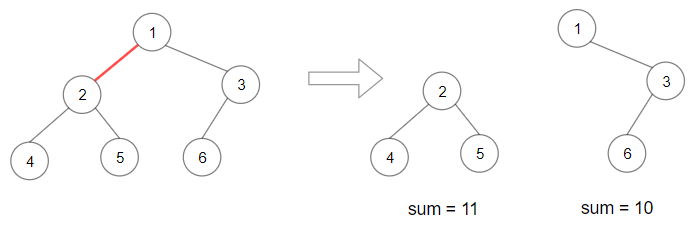

# Leetcode 刷题笔记

[TOC]

## 算法性能分析

### 大 $O$ 的定义

==大 $O$ 的定义==：大 $O$ 就是数据量级突破一个点且数据量级非常大的情况下所表现出的时间复杂度，这个数据量也就是常数项系数已经不起决定性作用的数据量。

> 所以我们说的时间复杂度都是忽略常数项系数的，因为一般情况下都是默认数据规模足够大。

### 时间和空间复杂度：递归

在写递归函数的时候一定要注意，不要跳进递归，而是利用==明确的定义==来实现算法逻辑。

处理看起来比较困难的问题，可以尝试化整为零，把一些简单的解法进行修改，解决困难的问题。

==递归算法的注意事项==：

1. 递归是在过程或函数中调用自身的过程
2. 递归必须有一个明确的递归结束条件，成为递归出口
3. 递归算法比较简洁，但运行效率较低
4. 递归调用过程，系统用==栈==来存储每一层的返回点和局部量，如果递归次数过多，容易造成==栈==溢出

==时间复杂度（递归）==：**递归的次数 * 每次递归的时间复杂度**

==空间复杂度（递归）==：**递归深度 * 每次递归的空间复杂度**

> 空间复杂度：一个算法在运行过程中占用内存空间大小的量度，利用程序的 空间复杂度，可以对程序运行中需要多少内存有个预先估计。

```python
# 斐波拉契求和
def fibonacci(i):
    if i == 1:
        return 1
    elif i <= 0:
        return 0
    else:
        return fibonacci(i-1) + fibonacci(i-2)
```

如果把递归过程抽象成一颗递归树，在这棵二叉树中每一个节点都是一次递归，而一棵深度为 k 的二叉树最多可以有 $2^k -1$ 个护节点。所以该递归算法的时间复杂度为 $O(2^n)$ 。

减少复杂度的方法：==把递归的结果存起来==。

==递归深度==如下：

递归第 $n$ 个斐波那契数的话，递归调用栈的深度就是 $n$。那么每次递归的空间复杂度是 $O (1)$， 调用栈深度为 $n$，所以这段递归代码的空间复杂度就是 $O (n)$。

| 求斐波拉契数 | 时间复杂度 | 空间复杂度 |
| ------------ | ---------- | ---------- |
| 非递归       | $O(n)$     | $O(1)$     |
| 递归算法     | $O(2^n)$     | $O(n)$     |
| 优化递归算法 | $O(n)$     | $O(n)$     |

可以看出，有斐波拉契数的时候，使用递归算法并不一定是在性能上最优的，但递归算法确实简化了代码层面的复杂度。

---

==二分查找递归实现==：

```python
def HalfSearch(OrderedList, key, left, right):
    if left > right:
        return None
    mid = (left + right) // 2
    if key == OrderedList[mid]:
        return mid
    elif key > OrderedList[mid]:
        return HalfSearch(OrderedList, key, mid + 1, right)
    else:
        return HalfSearch(OrderedList, key, left, mid - 1)
```


二分查找的时间复杂度是 $O(logn)$，那么递归二分查找的空间复杂度是多少呢？

我们依然看 **每次递归的空间复杂度和递归的深度**

首先我们先明确这里的空间复杂度里面的 n 是什么？二分查找的时候 n 就是指查找数组的长度，也就是代码中的 arr 数组。

每次递归的空间复杂度可以看出主要就是参数里传入的这个 arr 数组，即：$O (n)$。

再来看递归的深度，二分查找的递归深度是 $logn$ ，递归深度就是调用栈的长度，那么这段代码的空间复杂度为 $n * logn = O (nlogn)$。

如果希望递归二分查找的空间复杂度是 $O(logn)$，可以把这个数组放在外面而不是放在递归函数参数里，将数组定义为**全局变量**。

### 代码的内存消耗

不同的编程语言各自的内存管理方式。

- C/C++ 这种内存堆空间的申请和释放完全靠自己管理
- Java 依赖 JVM 来做内存管理，不了解 jvm 内存管理的机制，很可能会因一些错误的代码写法而导致内存泄漏或内存溢出
- Python 内存管理是由私有堆空间管理的，所有的 python 对象和数据结构都存储在私有堆空间中。程序员没有访问堆的权限，只有解释器才能操作。

例如 Python 万物皆对象，并且将内存操作封装的很好，**所以 python 的基本数据类型所用的内存会要远大于存放纯数据类型所占的内存**，例如，我们都知道存储 int 型数据需要四个字节，但是使用 Python 申请一个对象来存放数据的话，所用空间要远大于四个字节。

==内存对齐==：为什么会有内存对齐？

- 平台原因：不是所有硬件平台都能访问任意内存地址上的任意数据，某些硬件平台只能在某些地址处取某些特定类型的数据，否则抛出硬件异常。为了同一个程序可以在多平台运行，需要内存对齐。
- 硬件原因：经过内存对齐后，CPU 访问内存的速度大大提升

### 如何给递归算法 debug

**在递归函数内部打印关键之，配合缩进，直观地观察递归函数执行情况。**

最能提升我们 `debug` 效率的是缩进，除了解法函数，我们新定义一个函数 `printIndent` 和一个全局变量 `count`：

```python
# 全局变量，记录递归函数的递归层数
count = 0

# 输入 n，打印 n 个 tab 缩进
def printIndent(n):
    for i in range(n):
        print("	")
```

**套路是**：在递归函数的开头，调用 `printIndent(count++)` 并打印关键变量；然后在所有 `return` 语句之前调用  `printIndent(count--)` 并打印返回值。

```C++
int count = 0;
void printIndent(int n) {
    for (int i = 0; i < n; i++) {
        printf("   ");
    }
}

int dp(string& ring, int i, string& key, int j) {
    // printIndent(count++);
    // printf("i = %d, j = %d\n", i, j);
    
    if (j == key.size()) {
        // printIndent(--count);
        // printf("return 0\n");
        return 0;
    }
    
    int res = INT_MAX;
    for (int k : charToIndex[key[j]]) {
        res = min(res, dp(ring, j, key, i + 1));
    }
    
    // printIndent(--count);
    // printf("return %d\n", res);
    return res;
}
```


## 数组

**数组是存放在连续内存空间上的相同类型数据的集合。**

数组可以方便的通过下标索引的方式获取到下标下对应的数据。

需要两点注意的是

- **数组下标都是从 0 开始的。**
- **数组内存空间的地址是连续的**

正是**因为数组的在内存空间的地址是连续的，所以我们在删除或者增添元素的时候，就难免要移动其他元素的地址。**

> assert 用于判断一个表达式，在表达式条件为 false 的时候触发异常，断言可以在条件不满足程序运行的情况下直接返回错误，而不必等程度运行后出现崩溃的情况。

==注意：==

在处理数组和链表相关问题时，双指针技巧是经常用到的，双指针技巧主要分为两类：

- ==左右指针==：两个指针相向而行或者相背而行
- ==快慢指针==：两个指针同向而行，一快一慢，多用来解决链表问题


###  二分查找：查找一个元素

> 给定一个 n 个元素有序的（升序）整型数组 nums 和一个目标值 target  ，写一个函数搜索 nums 中的 target，如果目标值存在返回下标，否则返回 -1。

二分法的关键是：区间的定义。区间的定义是==不变量==。要在二分查找的过程中，保持不变量，就是在 while 寻找中每一次边界都要坚持根据区间的定义来操作，这就是==循环不变量规则==。

写二分法，区间的定义一般分为两种，左闭右闭即 [left, right]，或者左闭右开即 [left, right)。

#### 左闭右闭

- 循环结束条件：`while start <= end`，因为 `left == right` 在区间 [start, end] 是有意义的
- 当 `arr[mid] > x`时 end 要赋值为 `mid-1`，因为当前这个 `arr[mid]` 一定不是 target；另一种情况同理

```python
# 注意二分查找需要数组有序
arr = [-1, 0, 3, 5, 9, 12]

# 二分查找：左闭右闭 [left, right]
def search(x, arr):
    # 注意这里的 end = len(arr) - 1
    start, end = 0, len(arr) - 1
    # 如果循环结束还没有找到，返回 -1
    # 循环结束条件：start <= end
    while start <= end:
        mid = (start + end) // 2
        if arr[mid] == x:
            return mid
        elif arr[mid] < x:
            start = mid + 1
        elif arr[mid] > x:
            end = mid - 1
    return -1

print(search(12, arr))
```

> 这种解法感觉比较直观一点。

#### 左闭右开

- 循环结束条件：`while start < end`，这里使用 < , 因为 `start = end` 在区间 [left, right) 是没有意义的
- 当 `arr[mid] > x`时 end 要赋值为 `mid`，因为当前这个 `arr[mid]`不等于 target，去左区间继续寻找，而寻找区间是左闭右开区间，所以 end 更新为 mid

```python
# 左闭右开
def search2(x, arr):
    # 注意这里的 end = len(arr)
    start, end = 0, len(arr)
    while start < end:
        mid = (start + end) // 2
        if arr[mid] == x:
            return mid
        elif arr[mid] < x:
            start = mid + 1
        elif arr[mid] > x:
            end = mid 
    return -1

print(search2(12, arr))
```

### ==二分查找：寻找左侧边界==

上面的二分查找算法有局限性，比如说给你有序数组 `nums = [1,2,2,2,3]`，`target` 为 2，此算法返回的索引是 2，没错。但是如果我想得到 `target` 的左侧边界，即索引 1，或者我想得到 `target` 的右侧边界，即索引 3，这样的话此算法是无法处理的。

这样的需求很常见，**你也许会说，找到一个 `target`，然后向左或向右线性搜索不行吗？可以，但是不好，因为这样难以保证二分查找对数级的复杂度了**。

下面给出寻找左侧边界的二分搜索：

```python
# 注意二分查找需要数组有序
arr = [1,2,2,2,3]

def search(x, arr):
    # 注意这里的 end = len(arr)
    start, end = 0, len(arr) - 1
    while start <= end:
        mid = start + (end - start) // 2
        if arr[mid] == x:
            # 收缩右侧边界
            end = mid - 1
        elif arr[mid] < x:
            start = mid + 1
        elif arr[mid] > x:
            end = mid - 1
    # 因为我们要返回 start，所以要检查 start 越界情况和不符合
    if start >= len(arr) or arr[start] != x:
        return -1
    return start

print(search(2, arr))
```

**为什么该算法能够搜索左侧边界？**

关键在于对于 `nums[mid] == target` 这种情况的处理：

```python
if arr[mid] == x:
	end = mid - 1
```

可见，找到 target 时不要立即返回，而是缩小搜索区间的上界 right，在区间 $[left, mid]$ 中继续搜索，即不断向左收缩，达到锁定左侧边界的目的。

**同理，下面的代码寻找右侧边界的二分查找：**

```python
# 注意二分查找需要数组有序
arr = [1,2,2,2,3]

def search(x, arr):
    # 注意这里的 end = len(arr) 
    start, end = 0, len(arr) - 1 
    # 如果循环结束还没有找到，返回 -1
    while start <= end:
        mid = start + (end - start) // 2
        if arr[mid] == x:
            start = mid + 1
        elif arr[mid] < x:
            start = mid + 1
        elif arr[mid] > x:
            end = mid - 1 
    # 检查 end 越界的情况
    if end < 0 or arr[end] != x:
        return -1
    return end 
   
print(search(2, arr))
```

当 `nums[mid] == target` 时，不要立即返回，而是增大「搜索区间」的左边界 `left`，使得区间不断向右靠拢，达到锁定右侧边界的目的。

### 原地移除元素

> 原地移除元素，并返回移除后数组的新长度。要求不使用额外的数组空间，必须使用 $O(1)$ 额外空间并原地修改输入数组。你不需要考虑数组中超出新长度后面的元素。

**要知道数组的元素在内存地址中是连续的，不能单独删除数组中的某个元素，只能覆盖。**

#### 暴力解法

暴力解法：两层 for 循环，一个 for 循环遍历数组元素，第二个 for 循环更新数组（用后面的替换前面的）。

```python
class Solution:
    def removeElement(self, nums, val):
        """
        暴力解法：发现需要移除的元素，就将数组集体向前移动一位
        """
        length = len(nums)
        i = 0
        while i < length:
            # 发现目标，长度减一，指针向前移动一位
            if nums[i] == val:
                # range 前闭后开；数组下标比长度少 1 
                # 注意 j 只循环到倒数第二位元素，是 length - 1
                for j in range(i, length-1):
                    nums[j] = nums[j+1]
                length -= 1
                nums = nums[:length]
                i -= 1
            i += 1
        return length, nums

nums = [0, 1, 2, 3, 2, 9, 6, 3, 2, 2, 2, 3, 2]
val = 2
sol = Solution()
len, arr = sol.removeElement(nums, val)
print(len, 'nums =', arr)
```

#### 双指针法

双指针法（快慢指针法）：通过一个快指针和慢指针在一个 for 循环下完成两个 for 循环的工作。


双指针法（快慢指针法）在数组和链表的操作中是非常常见的，很多考察数组、链表、字符串等操作的面试题，都使用双指针法。

```python
class Solution2:
    def removeElement(self, nums, val):
        """
        双指针法
        时间复杂度：O(n)
        空间复杂度：O(1)
        """
        slowIndex = 0
        fastIndex = 0
        while fastIndex < len(nums):
            # 想想看如果这里写成 if val == nums[fastIndex]，会有什么问题
            if val != nums[fastIndex]:
                nums[slowIndex] = nums[fastIndex]
                slowIndex += 1
                fastIndex += 1
            else:
                # 当快指针遇到要删除的元素时停止赋值
                # 慢指针停止移动，快指针继续前进
                fastIndex += 1
        return slowIndex, nums[:slowIndex]
```

### 删除有序数组中的重复项

> 给你一个 **升序排列** 的数组 `nums` ，请你**[ 原地](http://baike.baidu.com/item/原地算法)** 删除重复出现的元素，使每个元素 **只出现一次** ，返回删除后数组的新长度。元素的 **相对顺序** 应该保持 **一致** 。
>
> 输入：nums = [1,1,2]
> 输出：2, nums = [1,2,_]
> 解释：函数应该返回新的长度 2 ，并且原数组 nums 的前两个元素被修改为 1, 2 。不需要考虑数组中超出新长度后面的元素。

我们让慢指针 `slow` 走在后面，快指针 `fast` 走在前面探路，找到一个不重复的元素就赋值给 `slow` 并让 `slow` 前进一步。

这样，就保证了 `nums[0:slow]` 都是无重复的元素，当 `fast` 指针遍历完整个数组 `nums` 后，`nums[0:slow]` 就是整个数组去重之后的结果。

```python
class Solution:
    def removeDuplicates(self, nums: List[int]) -> int:
        if len(nums) == 0: return 0
        fast, slow = 0, 0
        while fast < len(nums):
            # 将这里的条件判断和上一题进行比较
            # fast 在前面探路，找到一个不相同的就让 slow 前进一步并进行赋值
            if nums[fast] != nums[slow]:
                slow += 1
                nums[slow] = nums[fast]
                fast += 1
            else:
            	fast += 1
            
        return slow + 1
```


### 有序数组的平方

> 给你一个按==非递减顺序==排序的整数数组 nums，返回 每个数字的平方组成的新数组，要求也按非递减顺序排序。
>
> 输入：nums = [-4,-1,0,3,10]
> 输出：[0,1,9,16,100]
>
> 请设计时间复杂度为 O(n) 的算法解决本问题.

#### 暴力解法

最直观的算法莫过于：每个数平方之后进行排序。

```python
class Solution:
    def sortedSquares(self, nums):
        for i in range(len(nums)):
            nums[i] = nums[i] ** 2
        # 排序
        nums.sort()
        return nums
            
nums = [-4,-1,0,3,10,2]
a = Solution()
print(a.sortedSquares(nums))
```

#### 双指针法

数组其实是有序的，只不过负数平方之后可能成为最大数了。

那么数组平方的最大值就在数组的两端，不是最左边就是最右边，不可能是中间。此时可以考虑双指针法，$i$ 指向起始位置，$j$ 指向终止位置。

定义一个新数组 result，和 $A$ 数组一样的大小，让 $k$ 指向 result 数组的终止位置。


```python
class Solution2:
    """
    双指针法
    """
    def sortedSquares(self, nums):
        length = len(nums)
        i, j, k = 0, length-1, length-1
        arr = [0]*len(nums)
        while k >= 0:
            rm = nums[j] ** 2
            lm = nums[i] ** 2
            if rm >= lm:
                arr[k] = rm
                j -= 1
            else:
                arr[k] = lm
                i += 1
            k -= 1
        return arr

nums = [-4, -1, 0, 3, 10]
a = Solution2()
print(a.sortedSquares(nums))
```

### 长度最小的子数组

> 给定一个含有 n 个正整数的数组和一个正整数 s ，找出该数组中满足其和 ≥ s 的长度最小的连续子数组，并返回其长度。如果不存在符合条件的子数组，返回 0。
>
> 示例：
> 输入：s = 7, nums = [2,3,1,2,4,3]
> 输出：2
> 解释：子数组 [4,3] 是该条件下的长度最小的子数组。

#### 暴力解法

从长度为 1 开始试，长度加 1，计算连续长度的子数组和，判断是否满足条件，如果满足返回该长度，不满足继续加 1。

该解法超出时间限制了：

```python
class Solution:
    """
    暴力算法
    """
    def minSubArrayLen(self, target, nums):
        length = 0
        result = 0
        while length <= len(nums):
            length += 1
            for i in range(len(nums) - length + 1):
                if sum(nums[i:i+length]) >= target:
                    result = length
                    return result
        return result


s = 100
nums = [2, 3, 1, 2, 4, 3, 7]
sol = Solution()
print(sol.minSubArrayLen(s, nums))
```

#### 滑动窗口

所谓滑动窗口，就是==不断调节子序列的起始位置和终止位置==，从而得出我们想要的结果。


在本题中实现滑动窗口，主要确定如下三点：

- 窗口内是什么？
- 如何移动窗口的起始位置？
- 如何移动窗口的结束位置？

窗口就是满足其和 ≥ s 的长度最小的连续子数组。

窗口的结束位置如何移动：窗口的结束位置就是遍历数组的指针，窗口的起始位置为数组的数组的起始位置。

解题的关键在于窗口的起始位置如何移动？

可以发现**滑动窗口的精妙之处在于根据当前子序列和大小的情况，不断调节子序列的起始位置。从而将 O (n^2) 的暴力解法降为 O (n)。**

```python
class Solution:
    def minSubArrayLen(self, target: int, nums: List[int]) -> int:
        if sum(nums) < target: return 0
        # 滑动窗口：扩张和搜索的操作是对称的
        i = 0
        j = 0
        minL = len(nums)
        total = 0
        while j < len(nums):
            # 扩张窗口
            total += nums[j]
            j += 1

            while total >= target:
                # 先更新 minL，再收缩
                minL = min(minL, j-i)
                total -= nums[i]
                i += 1         

        return minL
```

==为什么时间复杂度是 $O(n)$==？

不要以为 for 里面放一个 while 就以为是 $O(n^2)$， 主要是看每一个元素被操作的次数，每个元素在滑动窗后进来操作一次，出去操作一次，每个元素都是被操作两次，所以时间复杂度是 2*n 也就是 $O(n)$

### ==螺旋矩阵==

> 给你一个正整数 n，生成一个包含 1 到 $n^2$ 所有元素，且元素按顺时针顺序螺旋排列的 n x n 正方形矩阵 matrix。
>
> 
>
> ```
> 输入：n = 3
> 输出：[[1,2,3],[8,9,4],[7,6,5]]
> ```

这道题目可以说在面试中出现频率较高的题目，不涉及什么算法，就是模拟过程，但十分考察对代码的掌控能力。

==循环不变量原则==，模拟顺时针画矩阵的过程：

- 填充上行从左到右
- 填充右列从上到下
- 填充下行从右到左
- 填充左列从下到上

由外向内一圈一圈这么画下去。

可以发现这里的边界条件非常多，在一个循环中，如此多的边界条件，如果不按照固定规则来遍历，那就是一进循环深似海，从此 offer 是路人。

这里一圈画下来，我们要画每四条边，这四条边怎么画，每画一条边都要坚持一致的左闭右开，或者左开右闭的原则，这样这一圈才能按照统一的规则画下来。

这里每一种颜色，代表一条边，我们遍历的长度，可以看出每一个拐角处的处理规则，拐角处让给新的一条边来继续画。这也是坚持了每条边左闭右开的原则。

但是下面的 python 代码是把一行画满再画下一步。

```python
class Solution:
    def generateMatrix(self, n):
        left, right, up, down = 0, n-1, 0, n-1
        # 初始化 matrix
        matrix = [[0]*n for _ in range(n)]
        num = 1
        while left <= right and up <= down:
            # 填充左到右：左闭右开
            for i in range(left, right+1):
                matrix[up][i] = num
                num += 1
            up += 1
            # 填充上到下
            for i in range(up, down+1):
                matrix[i][right] = num
                num += 1
            right -= 1
            # 填充右到左
            for i in range(right, left-1, -1):
                matrix[down][i] = num
                num += 1
            down -= 1
            # 填充下到上
            for i in range(down, up-1, -1):
                matrix[i][left] = num
                num += 1
            left += 1
        return matrix

sol = Solution()
print(sol.generateMatrix(3))
```

## 链表

链表是一种通过指针串联在一起的线性结构，每一个节点是又两部分组成，一个是数据域一个是指针域（存放指向下一个节点的指针），最后一个节点的指针域指向 null。链接的入口点称为列表的头节点 head。

==链表的特点==：

1. 因为节点的内存地址不需要连续，所以相比顺序表，对于内存的利用更加高效
2. 同时管理器只需要存储第一个节点的地址即可，对于后续节点，也只需要前一个节点有指针即可
3. 根据下标的查询操作只能从第一个节点依次往后进行
4. 越靠近头部的操作时间复杂度越低，越靠近尾部的时间复杂度越高

==链表的存储方式==：数组在内存中是连续分布的，但是链表在内存中不是连续分布的，链表是通过指针域的指针链接在内存中各个节点，链表中的节点散乱分布在内存中的某地址上，分配机制取决于操作系统的内存管理。

==链表的定义==：

```c++
// 单链表
struct ListNode {
    int val;  // 节点上存储的元素
    ListNode *next;  // 指向下一个节点的指针
    ListNode(int x) : val(x), next(NULL) {}  // 节点的构造函数
};

// 通过自己定义构造函数初始化节点
ListNode* head = new ListNode(5);

// 使用默认构造函数初始化节点
ListNode* head = new ListNode();
head->val = 5;
// 如果不定义构造函数使用默认构造函数的话，在初始化的时候就不能直接给变量赋值
```

==链表的操作==：

1. **删除节点**：只要将 C 节点的 next 指针 指向 E 节点就可以了。


2. **添加节点**：


> 数组在定义的时候，长度就是固定的，如果想改动数组的长度，就需要重新定义一个新的数组。
>
> 链表的长度可以是不固定的，并且可以动态增删，适合数据量不固定，频繁增删，较少查询的场景。

### 移除链表元素

> 给你一个链表的头节点 head 和一个整数 val ，请你删除链表中所有满足 Node.val == val 的节点，并返回新的头节点。
>
> 输入：head = [1,2,6,3,4,5,6], val = 6
> 输出：[1,2,3,4,5]

这里以链表 1 4 2 4 来举例，移除元素 4。


如果使用 C | C++ 编程语言的话，不要忘了还要从内存中删除这两个移除的节点。如果使用 java ，python 的话就不用手动管理内存了。

==如果需要删除头节点怎么办？==

- 直接使用原来的链表来进行删除操作：将头结点向后移动一位
- 设置一个**虚拟头节点**再进行删除操作：设置虚拟头节点，按照统一方式进行移除

```python
class ListNode:
    """
    单个节点只需要存储两个值，在构造函数中赋值即可。默认情况下一个节点的地址放 None，等有需要时再进行赋值
    """

    def __init__(self, val=0, next=None):
        self.val = val
        self.next = next

def list_2_listnode(array):
    tem_node = ListNode()
    node = ListNode()
    for i in array:
        # 记得是判定val是否有值，并且用一个node记住头节点，然后返回的是头节点
        if not tem_node.val:
            tem_node.val = i
            node = tem_node
        else:
            tem_node.next = ListNode(i)
            tem_node = tem_node.next
    return node

class Solution:
    def removeElements(self, head, val):
        # 新建虚拟头节点 dummy
        dummy = ListNode(None)
        dummy.next = head
        cur = dummy
        while cur.next:
            if cur.next.val != val:
                # 指针向后移动一位
                cur = cur.next
            else:
                # 边重新连接
                cur.next = cur.next.next
        # 返回头节点
        return dummy.next

head = [1, 2, 6, 3, 4, 5, 2, 6]
# list --> linkNode
head = list_2_listnode(head)
print(head)
# 需要删除的元素值
val = 6
sol = Solution()
result = sol.removeElements(head, val)
while result:
    print(result.val, end='\t')
    result = result.next

```

### 设计链表

> 设计链表的实现。您可以选择使用单链表或双链表。单链表中的节点应该具有两个属性：val 和 next。val 是当前节点的值，next 是指向下一个节点的指针 / 引用。如果要使用双向链表，则还需要一个属性 prev 以指示链表中的上一个节点。假设链表中的所有节点都是 0-index 的。
>
> 在链表类中实现这些功能：
>
> 1. `get (index)`：获取链表中第 index 个节点的值
> 2. `addAtHead (val)`：在链表的最前面插入一个值为 val 的节点
> 3. `addAtTail (val)`：在链表的最后面插入一个值为 val 的节点
> 4. `addAtIndex (index,val)`：在链表中的第 index 个节点前插入值为 val 的节点
> 5. `deleteAtIndex (index)`：删除链表中的第 index 个节点

```python
# 单链表
class Node:
    # 定义链表节点结构体
    def __init__(self, val):
        self.val = val
        self.next = None


class MyLinkedList:

    def __init__(self):
        self._head = Node(0)  # 虚拟头部节点
        self._count = 0  # 添加的节点数

    def get(self, index: int) -> int:
        """
        Get the value of the index-th node in the linked list. If the index is invalid, return -1.
        """
        if 0 <= index < self._count:
            node = self._head
            for _ in range(index + 1):
                node = node.next
            return node.val
        else:
            return -1

    def addAtHead(self, val: int) -> None:
        """
        Add a node of value val before the first element of the linked list. After the insertion, the new node will be the first node of the linked list.
        """
        self.addAtIndex(0, val)

    def addAtTail(self, val: int) -> None:
        """
        Append a node of value val to the last element of the linked list.
        """
        self.addAtIndex(self._count, val)

    def addAtIndex(self, index: int, val: int) -> None:
        """
        Add a node of value val before the index-th node in the linked list. If index equals to the length of linked list, the node will be appended to the end of linked list. If index is greater than the length, the node will not be inserted.
        """
        if index < 0:
            index = 0
        elif index > self._count:
            return

        # 计数累加
        self._count += 1

        # 新建节点
        add_node = Node(val)
        prev_node, current_node = None, self._head
        for _ in range(index + 1):
            prev_node, current_node = current_node, current_node.next
        else:
            prev_node.next, add_node.next = add_node, current_node

    def deleteAtIndex(self, index: int) -> None:
        """
        Delete the index-th node in the linked list, if the index is valid.
        """
        if 0 <= index < self._count:
            # 计数-1
            self._count -= 1
            prev_node, current_node = None, self._head
            for _ in range(index + 1):
                prev_node, current_node = current_node, current_node.next
            else:
                prev_node.next, current_node.next = current_node.next, None
```

```python
# 双链表
# 相对于单链表, Node新增了prev属性
class Node:

    def __init__(self, val):
        self.val = val
        self.prev = None
        self.next = None


class MyLinkedList:

    def __init__(self):
        self._head, self._tail = Node(0), Node(0)  # 虚拟节点
        self._head.next, self._tail.prev = self._tail, self._head
        self._count = 0  # 添加的节点数

    def _get_node(self, index: int) -> Node:
        # 当index小于_count//2时, 使用_head查找更快, 反之_tail更快
        if index >= self._count // 2:
            # 使用prev往前找
            node = self._tail
            for _ in range(self._count - index):
                node = node.prev
        else:
            # 使用next往后找
            node = self._head
            for _ in range(index + 1):
                node = node.next
        return node

    def get(self, index: int) -> int:
        """
        Get the value of the index-th node in the linked list. If the index is invalid, return -1.
        """
        if 0 <= index < self._count:
            node = self._get_node(index)
            return node.val
        else:
            return -1

    def addAtHead(self, val: int) -> None:
        """
        Add a node of value val before the first element of the linked list. After the insertion, the new node will be the first node of the linked list.
        """
        self._update(self._head, self._head.next, val)

    def addAtTail(self, val: int) -> None:
        """
        Append a node of value val to the last element of the linked list.
        """
        self._update(self._tail.prev, self._tail, val)

    def addAtIndex(self, index: int, val: int) -> None:
        """
        Add a node of value val before the index-th node in the linked list. If index equals to the length of linked list, the node will be appended to the end of linked list. If index is greater than the length, the node will not be inserted.
        """
        if index < 0:
            index = 0
        elif index > self._count:
            return
        node = self._get_node(index)
        self._update(node.prev, node, val)

    def _update(self, prev: Node, next: Node, val: int) -> None:
        """
            更新节点
            :param prev: 相对于更新的前一个节点
            :param next: 相对于更新的后一个节点
            :param val:  要添加的节点值
        """
        # 计数累加
        self._count += 1
        node = Node(val)
        prev.next, next.prev = node, node
        node.prev, node.next = prev, next

    def deleteAtIndex(self, index: int) -> None:
        """
        Delete the index-th node in the linked list, if the index is valid.
        """
        if 0 <= index < self._count:
            node = self._get_node(index)
            # 计数-1
            self._count -= 1
            node.prev.next, node.next.prev = node.next, node.prev


# Your MyLinkedList object will be instantiated and called as such:
index = 7
val = 5
obj = MyLinkedList()
param_1 = obj.get(index)
obj.addAtHead(val)
obj.addAtTail(val)
obj.addAtIndex(index, val)
obj.deleteAtIndex(index)
```

### 反转链表

> 给你单链表的头节点 head ，请你反转链表，并返回反转后的链表。
>
> 输入：head = [1,2,3,4,5]
> 输出：[5,4,3,2,1]
>
> 提示：链表可以选用迭代或递归方式完成反转。

如果再定义一个新的链表，实现链表元素的反转，这是对内存空间的浪费。

其实只需要改变链表的 next 指针的指向，直接将链表反转，而不用重新定义一个新的链表，如下图所示：


之前链表的头节点是元素 1，反转之后头节点就是元素 5，这里并没有添加或者删除节点，仅仅是改变 next 指针的方向。

#### 双指针法


首先定义一个 cur 指针，指向头节点，再定义一个 pre 指针，初始化为 null。

然后开始反转，首先把 `cur.next` 节点用 `tmp` 指针保存一下，也就是保存一下 `cur` 指针指向节点的下一个节点。为什么要保存这个节点呢，因为接下来要改变 `cur.next`的指向，将其指向 `pre`，此时已经反转了第一个节点了。

接下来，就是循环走如下代码逻辑了，继续移动 `pre` 和 `cur` 指针。

最后，`cur` 指针已经指向了 `null`，循环结束，链表也反转完毕。此时我们 `return pre`指针就可以了，`pre` 指针就指向了新的头节点。

```python
# 双指针法
class ListNode:
    def __init__(self, val=0, next=None):
        self.val = val
        self.next = next

class Solution:
    def reverseList(self, head: ListNode) -> ListNode:
        cur = head
        pre = None
        while(cur != None):
            # 保存一下 cur 的下一个节点，因为接下来要改变 cur->next
            temp = cur.next
            # 反转
            cur.next = pre
            # 更新 pre、cur 指针
            pre = cur
            cur = temp
        return pre
```

#### 递归法

递归法相对抽象，但是其实和双指针法是一样的逻辑，同样是当 `cur` 为空时循环结束，不断将 `cur` 指向 `pre`的过程。关键是初始化的地方。

```python
# 递归法
class ListNode:
    def __init__(self, val=0, next=None):
        self.val = val
        self.next = next

class Solution:
    def reverseList(self, head: ListNode) -> ListNode:

        def reverse(pre, cur):
            if not cur:
                return pre
            tmp = cur.next
            cur.next = pre
            return reverse(cur, tmp)

        return reverse(None, head)
```

### 反转链表 II

> 给你单链表的头指针 head 和两个整数 left 和 right ，其中 left <= right 。请你反转从位置 left 到位置 right 的链表节点，返回 反转后的链表 。
>
> 
>
> ```
> 输入：head = [1,2,3,4,5], left = 2, right = 4
> 输出：[1,4,3,2,5]
> ```

对链表问题的技巧是：一定要先想清楚思路，并且必要的时候在草稿纸上画图，理清穿针引线的先后步骤，再编码。

#### 穿针引线


反转 `left` 到 `right` 部分以后，再拼接起来。我们还需要记录 `left` 的前一个节点，和 `right` 的后一个节点。如图所示：


**算法步骤：**

1. 先将待反转的区域反转
2. 把 pre 的 next 指针指向反转以后的链表头节点，把反转以后的链表的尾节点的 next 指针指向 succ


```python
class Solution:
    def reverseBetween(self, head: ListNode, left: int, right: int) -> ListNode:
        def reverse(head):
            cur1 = None
            cur2 = head
            while cur2:
                temp = cur2.next
                cur2.next = cur1
                cur1 = cur2
                cur2 = temp
            return cur1
        
        dummy = ListNode()
        dummy.next = head
        cur = dummy 
        for i in range(left-1):
            cur = cur.next
            
        pre = cur
        start = cur.next

        for j in range(left, right+1):
            cur = cur.next
        
        end = cur.next

        # 切断链表
        cur.next = None

        # 反转指定区间内的链表
        temp = reverse(start)

        # pre 指向反转后的头节点
        pre.next = temp

        # start 指向尾部
        start.next = end
 
        return dummy.next

```

### K 个一组翻转链表

> 给你链表的头节点 head ，每 k 个节点一组进行翻转，请你返回修改后的链表。
>
> k 是一个正整数，它的值小于或等于链表的长度。如果节点总数不是 k 的整数倍，那么请将最后剩余的节点保持原有顺序。
>
> 你不能只是单纯的改变节点内部的值，而是需要实际进行节点交换。
>
> 
>
> ```
> 输入：head = [1,2,3,4,5], k = 2
> 输出：[2,1,4,3,5]
> ```

**美团面试原题。没有做出来。**

```python
# 我的解法：综合前面两题的思路，虽然可以通过，但是耗时很高
class Solution:
    def reverseKGroup(self, head: Optional[ListNode], k: int) -> Optional[ListNode]:
        def reverse(head):
            """
            反转链表
            """
            pre = None
            cur = head
            while cur:
                temp = cur.next
                cur.next = pre
                pre = cur
                cur = temp
            return pre
        
        def reverseMN(head, m, n):
            """
            反转区间[m,n]内的链表
            """
            dummy = ListNode()
            dummy.next = head
            cur = dummy
            for i in range(m-1):
                cur = cur.next
                
            # 反转区间的前一个节点
            start = cur
            # 反转区间的第一个节点
            target = cur.next

            for j in range(m, n + 1):
                cur = cur.next
            # 反转区间的后一个节点
            end = cur.next
            # 切断
            cur.next = None

            newTarget = reverse(target)

            start.next = newTarget
            target.next = end
            return dummy.next
        
        # 和前两题相比，增加了下面部分的代码
        # 链表计数
        count = 0
        cur = head
        while cur:
            count += 1
            cur = cur.next
        
        for i in range(1, count - k + 2, k):
            head = reverseMN(head, i, i+k-1)

        return head
```

本题也可以用递归解法，但是比较复杂，还没有看懂。2022.7.21 现在自己写出来了：

> 相信递归函数的定义并且利用它！！！！

```python
# Definition for singly-linked list.
# class ListNode:
#     def __init__(self, val=0, next=None):
#         self.val = val
#         self.next = next
class Solution:
    def reverseKGroup(self, head: Optional[ListNode], k: int) -> Optional[ListNode]:
        # 使用递归法：reverseKGroup 函数能够把以 head 为头的链表进行反转，并返回头节点
        # 1. 先反转以 head 开头的 k 个元素
        # 2. 将第 k+1 个元素作为 head 递归调用 reverseKGroup 函数
        # 3. 将上述两个过程的结果连接起来
        def reverse(head):
            pre = None
            cur = head
            while cur:
                temp = cur.next
                cur.next = pre
                pre = cur
                cur = temp
            return pre
        
        # base case：当头节点为空时，返回空
        if not head: 
            return None

        cur = head
        count = 1
        while count < k:
            if cur.next:
                cur = cur.next
                count += 1
            else:
                # 不够 k 个节点，直接返回头节点
                return head

        # 注意：temp 有可能为 None
        temp = cur.next
        cur.next = None
        # 切割后进行反转
        newHead = reverse(head)
        # 反转后重新连接
        head.next = self.reverseKGroup(temp, k)
        return newHead
```

**太棒了，刷代码题犹如修炼内功，需要持之以恒的努力和永不言弃的精神。**

**我不会一下子变得很强，但是我会越来越强的！**


### 删除链表的倒数第 N 个结点

> 给你一个链表，删除链表的倒数第 `n` 个结点，并且返回链表的头结点。
>
> 输入：head = [1,2,3,4,5], n = 2
> 输出：[1,2,3,5]

#### 双指针法

双指针法的经典应用，如果要删除倒数第 $n$ 个节点，让 fast 移动 $n$ 步，然后让 fast 和 slow 同时移动，slow 指向被删除节点的上一个节点（此时 fast 指向链表末尾，`fast.next = None`，可以作为循环结束条件），利用 `slow.next = slow.next.next`就可以执行删除操作。


```python
class ListNode:
    def __init__(self, val=0, next=None):
        self.val = val
        self.next = next

class Solution:
    def removeNthFromEnd(self, head: ListNode, n: int) -> ListNode:
        dummy = ListNode()
        dummy.next = head
        fast, slow = dummy, dummy
        # 快指针先走 n 步
        for _ in range(n):
            fast = fast.next
        # 快慢指针同时移动至 slow 指向被删除节点的上一个节点，方便删除
        while fast.next:
            fast = fast.next
            slow = slow.next
        # 删除 slow 所指向的节点
        slow.next = slow.next.next
        return head
```


### 链表相交

> 给你两个单链表的头节点 `headA` 和 `headB` ，请你找出并返回两个单链表相交的起始节点。如果两个链表没有交点，返回 `null`。请注意相交的定义基于节点的==引用==，而不是基于节点的值。换句话说，如果一个链表的第 $k$ 个节点与另一个链表的第 $j$ 个节点是同一节点（引用完全相同），则这两个链表相交。
>
> 
>
> 题目数据保证整个链式结构中不存在环。
> 注意：函数返回结果后，链表必须保持其原始结构。
> 你是否能设计一个时间复杂度 `O(n)` 、仅用 `O(1)` 内存的解决方案？
>
> 示例：
> 输入：listA = [4,1,8,4,5], listB = [5,0,1,8,4,5]
> 输出：Reference of the node with value = 8

#### 末尾对齐

简单来说，就是求两个链表交点节点的指针，交点不是数值相等，而是指针相等。

==算法==：我们求出两个链表的长度，并**求出两个链表长度的差值**，然后让 `curA` 移动到和 `curB` ==末尾对齐==的位置：


此时我们就可以比较 `curA` 和 `curB` 是否相同，如果不相同，同时向后移动 `curA` 和 `curB`，如果遇到 `curA == curB`，则找到交点。否则循环退出返回空指针。

```python
class ListNode:
    def __init__(self, x):
        self.val = x
        self.next = None

class Solution:
    def getIntersectionNode(self, headA: ListNode, headB: ListNode) -> ListNode:
        countA=0
        countB=0
        curA=headA
        curB=headB
        
        while curA!=None:
            curA=curA.next
            countA+=1

        while curB!=None:
            curB=curB.next
            countB+=1

        # 让 curA 指向长链表
        if countA<countB:
            curA=headB
            curB=headA
        else:
            curA=headA
            curB=headB
            
        gap = abs(countA-countB)
        for i in range(gap):
            # 末尾对齐
            curA=curA.next
        
        while curA!=None:
            if curA==curB:
                return curA
            curA=curA.next
            curB=curB.next
```

#### 快慢指针法

可以这么理解，两个指针同时从头节点开始移动，有的链表长，有的链表短，如果有交点，说明它们有一段路是共用的（如果相遇，一定在共用的路上相遇），当指针开始走时，短的先到，可以想象成两段路一样长，但是短的链表的指针走的快，如果有交点，他们最终一定会在共用路段的第一个节点（交点）相遇。why?

这还需要用到一点数学知识。


**解决这个问题的关键是，通过某些方式，让 `p1` 和 `p2` 能够同时到达相交节点 `c1`**。

所以，我们可以让 `p1` 遍历完链表 `A` 之后开始遍历链表 `B`，让 `p2` 遍历完链表 `B` 之后开始遍历链表 `A`，这样相当于「逻辑上」两条链表接在了一起。

如果这样进行拼接，就可以让 `p1` 和 `p2` 同时进入公共部分，也就是同时到达相交节点 `c1`：


那你可能会问，如果说两个链表没有相交点，是否能够正确的返回 null 呢？

这个逻辑可以覆盖这种情况的，相当于 `c1` 节点是 null 空指针嘛，可以正确返回 null。

```python
class Solution:
    def getIntersectionNode(self, headA: ListNode, headB: ListNode) -> ListNode:
        """
        根据快慢法则，走的快的一定会追上走得慢的。
        在这道题里，有的链表短，他走完了就去走另一条链表，我们可以理解为走的快的指针。
        那么，只要其中一个链表走完了，就去走另一条链表的路。如果有交点，他们最终一定会在同一个位置相遇。
        """
        # 用两个指针代替 a 和 b
        cur_a, cur_b = headA, headB     

        # 如果没有交点，能够走出循环吗？
        while cur_a != cur_b:
            # 如果 a 走完了，那么就切换到 b 走
            cur_a = cur_a.next if cur_a else headB  
            # 同理，b 走完了就切换到 a    
            cur_b = cur_b.next if cur_b else headA      
        
        return cur_a
```

### 环形链表

> 给定一个链表，返回链表开始入环的第一个节点。 如果链表无环，则返回 `null`。如果链表中有某个节点，可以通过连续跟踪 `next` 指针再次到达，则链表中存在环。为了表示给定链表中的环，评测系统内部使用整数 `pos` 来表示链表尾连接到链表中的位置（索引从 0 开始）。如果 `pos` 是 `-1`，则在该链表中没有环。
>
> 不允许修改链表。
>
> 输入：head = [3,2,0,-4], pos = 1
>输出：返回索引为 1 的链表节点
> 解释：链表中有一个环，其尾部连接到第二个节点

这道题目，不仅考察对链表的操作，而且还需要一些数学运算。

- 判断链表是否有环
- 如果有环，如何找到这个环的入口

#### 判断链表是否有环

可以使用==快慢指针法==，  分别定义 fast 和 slow 指针，从头结点出发，fast 指针每次移动两个节点，slow 指针每次移动一个节点，如果 fast 和 slow 指针在途中相遇 ，说明这个链表有环。

为什么 fast 走两个节点，slow 走一个节点，有环的话，一定会在环内相遇呢，而不是永远的错开呢？

首先第一点：**fast 指针一定先进入环中，如果 fast 指针和 slow 指针相遇的话，一定是在环中相遇，这是毋庸置疑的。**

那么来看一下，**为什么 fast 指针和 slow 指针一定会相遇呢？**

可以画一个环，然后让 fast 指针在任意一个节点开始追赶 slow 指针。会发现最终都是这种情况， 如下图：


fast 和 slow 各自再走一步， fast 和 slow 就相遇了。这是因为 fast 是走两步，slow 是走一步，**其实相对于 slow 来说，fast 是一个节点一个节点的靠近 slow 的**，所以 fast 一定可以和 slow 重合。


#### 如何找到环的入口

假设从头结点到环形入口节点 的节点数为 $x$。环形入口节点到 fast 指针与 slow 指针相遇节点节点数为 $y$。从相遇节点再到环形入口节点节点数为 $z$。如图所示：


那么相遇时：slow 指针走过的节点数为 $x+y$，fast 指针走过的节点数为 $x+y+n(y+z)$，$n$ 为 fast 指针在环内走了 $n$ 圈才遇到 slow 指针。

> 为什么第一次在环中相遇，slow 的 步数 是 x+y 而不是 x + 若干环的长度 + y 呢？
>
> 因为 slow 进环的时候，fast 一定是先进来了，而且在环的任意一个位置：
>
> 
>
> 那么 fast 指针走到环入口 3 的时候，已经走了 $k+n$ 个节点，slow 相应走了 $(k+n)/2$ 个节点，因为 $k$ 小于 $n$，所以 $(k+n)/2$ 一定小于 $n$，这说明 slow  一定没有走到环入口 3，而 fast 已经到环入口 3 了，也就是**在 slow 开始走的那一环已经和 fast 相遇了**。精彩的分析！！

因为 fast 指针是一步走两个节点，slow 指针一步走一个节点， 所以 fast 指针走过的节点数 = slow 指针走过的节点数 * 2：
$$
\begin{aligned}
(x+y) * 2&=x+y+n(y+z)\\
x+y&=n(y+z)
\end{aligned}
$$
因为要找环形的入口，那么要求的是 x，因为 x 表示头结点到环形入口节点的的距离。整理如下：
$$
x=(n-1)(y+z)+z
$$
这就意味着，**==从头结点出发一个指针==，==从相遇节点也出发一个指针==，这两个指针每次只走一个节点， 那么当这两个指针相遇的时候就是 环形入口的节点**。

操作步骤如下：

1. 找到相遇节点；
2. 在头节点和相遇节点同时定义两个指针，按链表行走，两个指针相遇的地方就是环的入口处。

```python
class ListNode:
    def __init__(self, x):
        self.val = x
        self.next = None

class Solution:
    def detectCycle(self, head: ListNode) -> ListNode:
        slow, fast = head, head
        # 注意下面的这个循环条件，错了 4 遍
        while fast and fast.next:
            slow = slow.next
            fast = fast.next.next
            # 如果相遇，说明有环
            if slow == fast:
                # 重新定义两个指针
                p = head
                q = slow
                while p!=q:
                    p = p.next
                    q = q.next
                #你也可以 return q
                return p

        return None
```

> 思路很复杂，但是算法却很简单。两个循环就解决了。

### 两数相加

> 给你两个 非空 的链表，表示两个非负的整数。它们每位数字都是按照 逆序 的方式存储的，并且每个节点只能存储 一位 数字。
>
> 请你将两个数相加，并以相同形式返回一个表示和的链表。
>
> 你可以假设除了数字 0 之外，这两个数都不会以 0 开头。
>
> 
>
> ```
> 输入：l1 = [2,4,3], l2 = [5,6,4]
> 输出：[7,0,8]
> 解释：342 + 465 = 807.
> ```

#### 迭代法

```python
class Solution:
    def addTwoNumbers(self, l1: Optional[ListNode], l2: Optional[ListNode]) -> Optional[ListNode]:
        sumNode = ListNode()
        sumIndex = sumNode
        carry = 0
        while l1 or l2:
            a = l1.val if l1 else 0
            b = l2.val if l2 else 0
            sum = a + b + carry
            sumIndex.next = ListNode()
            sumIndex = sumIndex.next
            sumIndex.val = sum % 10
            if sum // 10:
                carry = 1
            else:
                carry = 0
            l1 = l1.next if l1 else 0
            l2 = l2.next if l2 else 0

        if carry:
            sumIndex.next = ListNode()
            sumIndex = sumIndex.next
            sumIndex.val = carry

        return sumNode.next
```


#### 递归法

```python
class Solution:
    def __init__(self):
        self.flag = 0
    def addTwoNumbers(self, l1: Optional[ListNode], l2: Optional[ListNode]) -> Optional[ListNode]:
        # 使用递归：将两个链表相加并返回表示和的链表头节点

        # base case
        if not l1 and not l2: 
            if not self.flag:
                return None
            else:
                val = self.flag
        elif not l1 and l2:
            val = l2.val + self.flag
        elif not l2 and l1:
            val = l1.val + self.flag
        else:
            val = l1.val + l2.val + self.flag

        head = ListNode() 
        head.val = val % 10
        # 进位
        self.flag = val // 10
        
        # 注意避免 NoneType 类型没有 next 指针的错误
        a = l1.next if l1 else None
        b = l2.next if l2 else None
        
        head.next = self.addTwoNumbers(a, b)
        return head
```

现在递归法也玩的很熟练了。

### 合并两个有序链表

> 将两个升序链表合并为一个新的 **升序** 链表并返回。新链表是通过拼接给定的两个链表的所有节点组成的。 
>
> 

#### 迭代法
```python
class Solution:
    def mergeTwoLists(self, list1: Optional[ListNode], list2: Optional[ListNode]) -> Optional[ListNode]:
        cur1 = list1
        cur2 = list2
        dummy = ListNode()
        cur3 = dummy
        while cur1 and cur2:
            if cur1.val <= cur2.val:
                cur3.next = ListNode(cur1.val)
                cur3 = cur3.next
                cur1 = cur1.next
            else:
                cur3.next = ListNode(cur2.val)
                cur3 = cur3.next
                cur2 = cur2.next
                
        if not cur1:
            cur3.next = cur2
        else:
            cur3.next = cur1
        return dummy.next
```

#### 递归法

**递归法的思路真的好清晰，好直接，不容易写错。**

> 相信并利用递归函数的定义。

```python
class Solution:
    def mergeTwoLists(self, list1: Optional[ListNode], list2: Optional[ListNode]) -> Optional[ListNode]:
        # 递归法：拼接两个链表的所有节点并返回头节点
        # base case
        if not list1: return list2
        if not list2: return list1
        
        head = ListNode()
        if list1.val <= list2.val:
            head.val = list1.val
            head.next = self.mergeTwoLists(list1.next, list2)
        else:
            head.val = list2.val
            head.next = self.mergeTwoLists(list1, list2.next)
        
        return head
```


### 合并 K 个有序链表

> 给你一个链表数组，每个链表都已经按升序排列。
> 请你将所有链表合并到一个升序链表中，返回合并后的链表。
>
> 输入：lists = [[1,4,5],[1,3,4],[2,6]]
> 输出：[1,1,2,3,4,4,5,6]
> 解释：链表数组如下：
> [
>   1->4->5,
>   1->3->4,
>   2->6
> ]
> 将它们合并到一个有序链表中得到。
> 1->1->2->3->4->4->5->6

合并 `k` 个有序链表的逻辑类似合并两个有序链表，难点在于，如何快速得到 k 个节点中的最小节点，接到结果链表上？

这里我们就要用到 ==优先级队列== 这种数据结构，把链表节点放入一个**最小堆**，就可以每次获得 k 个节点中的最小节点。

```python
# Definition for singly-linked list.
# class ListNode:
#     def __init__(self, val=0, next=None):
#         self.val = val
#         self.next = next
class Solution:
    def mergeKLists(self, lists: List[Optional[ListNode]]) -> Optional[ListNode]:
        # 合并 k 个升序链表
        # 堆
        import heapq
        q = []
        for node in lists:
            while node:
                heappush(q, node.val)
                node = node.next

        dummy = ListNode()
        cur = dummy
        while q:
            cur.next = ListNode(val=heappop(q))
            cur = cur.next
        return dummy.next
```


### 两两交换链表中的节点

> 给你一个链表，两两交换其中相邻的节点，并返回交换后链表的头节点。你必须在不修改节点内部的值的情况下完成本题（即，只能进行节点交换）。
>
> 

#### 迭代法
```python
class Solution:
    def swapPairs(self, head: ListNode) -> ListNode:
        if not head:
            return 
        dummy = ListNode()
        dummy.next = head
        # 注意这里的 start
        start = dummy
        cur1 = head
        cur2 = head.next
        while cur2:
            cur1.next = cur2.next
            cur2.next = cur1
            start.next = cur2
            cur1, cur2 = cur2, cur1
            start = cur2
            cur1 = cur1.next.next
            try:
                cur2 = cur2.next.next
            except:
                break
        return dummy.next 
```
#### 递归法

**啊，我喜欢递归法！**

```python
class Solution:
    def swapPairs(self, head: ListNode) -> ListNode:
        # 递归法
        # base case
        if not head:
            return 
        if not head.next:
            return head

        cur = head.next
        temp = cur.next
        cur.next = head
        head.next = self.swapPairs(temp)

        return cur
```

**递归魔法，闪亮登场！**

### 旋转链表

> 给你一个链表的头节点 `head` ，旋转链表，将链表每个节点向右移动 `k` 个位置。
>
> 

我使用了一个笨方法：

1. 反转前 n - k 个节点

2. 反转后 k 个节点

3. 整体反转

==更好的办法==：先将链表闭合成环，然后在指定位置断开。

```python
class Solution:
    def rotateRight(self, head: Optional[ListNode], k: int) -> Optional[ListNode]:
        if not head:
            return
        # 先将链表闭合成环，然后在指定位置断开
        n = 1
        cur = head
        while cur.next:
            cur = cur.next
            n += 1
        
        k = k % n
        # 注意边界条件的处理
        # 如果 k == 0 不用处理，返回头节点
        # 如果链表长度为 1，返回头节点
        if k == 0 or n == 1:
            return head
        # 成环
        cur.next = head

        cur1 = head
        for i in range(n-1-k):
            cur1 = cur1.next
        res = cur1.next
        cur1.next = None
        return res
```


### 回文链表

> 给你一个单链表的头节点 `head` ，请你判断该链表是否为回文链表。如果是，返回 `true` ；否则，返回 `false` 。
>
> ```
> 输入：head = [1,2,2,1]
> 输出：true
> ```

#### 数组模拟

最直接的想法，就是把链表装成数组，然后再判断是否回文。

```python
# 数组模拟
class Solution:
    def isPalindrome(self, head: ListNode) -> bool:
        nums = []
        cur = head
        while cur:
            nums.append(cur.val)
            cur = cur.next
        
        i = 0
        j = len(nums) - 1
        while i < j:
            if nums[i] != nums[j]:
                return False
            else:
                i += 1
                j -= 1
        return True
```

#### 反转后半部分链表

这个做法的优点是把空间复杂度降低到 $O(1)$，但是这种做法破坏了原链表啊。

分为如下几步：

- 用快慢指针，快指针有两步，慢指针走一步，快指针遇到终止位置时，慢指针就在链表中间位置
- 同时用 pre 记录慢指针指向节点的前一个节点，用来分割链表
- 将链表分为前后均等两部分，如果链表长度是奇数，那么后半部分多一个节点
- 将后半部分反转 ，得 cur2，前半部分为 cur1
- 按照 cur1 的长度，一次比较 cur1 和 cur2 的节点数值

如图所示：


```python
# 反转后半部分链表
class Solution:
    def isPalindrome(self, head: ListNode) -> bool:
        if head == None or head.next == None:
            return True
        slow, fast = head, head
        while fast and fast.next:
            pre = slow
            slow = slow.next
            fast = fast.next.next

        pre.next = None # 分割链表
        cur1 = head # 前半部分，是短的那部分，所以 while 循环时看 cur1 就行了
        cur2 = self.reverseList(slow) # 反转后半部分，总链表长度如果是奇数，cur2 比 cur1多一个节点
        while cur1:
            if cur1.val != cur2.val:
                return False
            cur1 = cur1.next
            cur2 = cur2.next
        return True

    def reverseList(self, head: ListNode) -> ListNode:
        # 反转链表
        cur = head
        pre = None
        while(cur != None):
            # 保存一下 cur 的下一个节点，因为接下来要改变 cur->next
            temp = cur.next
            # 反转
            cur.next = pre
            # 更新 pre、cur 指针
            pre = cur
            cur = temp
        return pre

```

终于明白指针的含义了，节点有两个属性：val 和 next，只要不改变 `node.val` 或者 `node.next`，链表就不会改变，pre、slow 和 fast 就只是一个指针；如果想要改变链表，可以使用：`fast.next = fast.next.next` 类似这种代码。


### 重排链表：双向队列

> 给定一个单链表 L 的头节点 head ，单链表 L 表示为：
>
> L0 → L1 → … → Ln - 1 → Ln
> 请将其重新排列后变为：
>
> L0 → Ln → L1 → Ln - 1 → L2 → Ln - 2 → …
> 不能只是单纯的改变节点内部的值，而是需要实际的进行节点交换。
>
> 

==经典解法==：截断 + 翻转 + 拼接

```python
# Definition for singly-linked list.
# class ListNode:
#     def __init__(self, val=0, next=None):
#         self.val = val
#         self.next = next
class Solution:
    def reorderList(self, head: Optional[ListNode]) -> None:
        """
        Do not return anything, modify head in-place instead.
        """
        # 基础解法：截断 + 翻转 + 拼接
        def reverse(root):
            pre = None
            cur = root
            while cur:
                temp = cur.next
                cur.next = pre
                pre = cur
                cur = temp
            return pre

        if not head: return
        slow = head
        fast = head
        while fast and fast.next:
            slow = slow.next
            fast = fast.next.next
        mid = slow.next
        slow.next = None
        newHead = reverse(mid)

        while newHead:
            temp = newHead.next
            newHead.next = head.next
            head.next = newHead
            head = newHead.next
            newHead = temp
```

可以使用双向队列的，在经典面试题里面！


## 哈希表

哈希表是根据关键码的值而直接进行访问的数据结构，直白来讲数组就是一张哈希表。哈希表中关键码就是数组的索引下表，然后通过下表直接访问数组中的元素，如下图所示：


**哈希表可以用来快速判断一个元素是否出现在集合里。**例如要查询一个名字是否在这所学校里。要枚举的话时间复杂度是 O (n)，但如果使用哈希表的话， 只需要 O (1) 就可以做到。我们只需要初始化把这所学校里学生的名字都存在哈希表里，在查询的时候通过索引直接就可以知道这位同学在不在这所学校里了。将学生姓名映射到哈希表上就涉及到了 **hash function ，也就是==哈希函数==**。

哈希函数通过 hashCode 把名字转化为数值，一般 hashcode 是通过特定编码方式，可以将其他数据格式转化为不同的数值，这样就把学生名字映射为哈希表上的索引数字了。


如果 hashCode 得到的数值大于哈希表的大小怎么办？

为了保证映射出来的索引数值都落在哈希表上，我们会再对数值做一个==取模==的操作。

但如果学生的数量大于哈希表的大小怎么办，此时就算哈希函数计算的再均匀，也避免不了会有几位学生的名字同时映射到哈希表同一个索引下标的位置。

### ==哈希碰撞==


哈希碰撞有两种解决办法，拉链法和线性探测法。

#### 拉链法

将发生冲突的元素存储再链表中：


#### 线性探测法

使用线性探测法，一定要保证 `tableSize` 大于 `dataSize`。我们需要依靠哈希表中的空位来解决碰撞问题。

例如冲突的位置，放了小李，那么就向下找一个空位放置小王的信息。所以要求 `tableSize` 一定要大于 `dataSize` ，要不然哈希表上就没有空置的位置来存放 冲突的数据了。如图所示：


==总结一下==：当我们遇到了要快速判断一个元素是否出现在集合里，就要考虑哈希法，但是哈希法也是牺牲了空间换取时间，因为我们要使用额外的数组，set 或者 map 来存放数据，才能实现快速的查找。

### 有效的字母异位词

> 给定两个字符串 s  和 t ，编写一个函数来判断 t 是否是 s 的字母异位词。
>
> 注意：如果 s 和 t 中每个字符出现的次数都相同，则称 s 和 t 互为字母异位词。
>
> 输入: s = "anagram", t = "nagaram"
> 输出: true
>
> 进阶：如果输入字符串包含 `unicode` 字符怎么办？你能否调整你的解法来应对这种情况？

数组其实就是一个简单哈希表，而且这道题目中字符串只有小写字符，那么就可以定义一个数组，来记录字符串 s 里字符出现的次数。

需要定义一个多大的数组呢？定义一个数组 record，大小为 26 就可以了，初始化为 0，因为字符 a 到字符 z 的 ASCII 就是 26 个连续的数值，**字符 a 映射为下表 0，相应的字符 z 映射为下表 25。**遍历第一个字符时，字母出现一次对应位置元素加一；遍历第二个字符时，字母出现一次，对应位置元素减一；最后检查 record 数组如果有的元素不为 0，说明 字符串 s 和 t 一定是谁多了字符或者谁少了字符，`return false`。反之 `return true`。

```python
class Solution:
    def isAnagram(self, s: str, t: str) -> bool:
        record = [0] * 26
        for i in range(len(s)):
            #并不需要记住字符a的ASCII，只要求出一个相对数值就可以了
            record[ord(s[i]) - ord("a")] += 1
        # print(record)
        for i in range(len(t)):
            record[ord(t[i]) - ord("a")] -= 1
        for i in range(26):
            if record[i] != 0:
                #record数组如果有的元素不为零0，说明字符串s和t 一定是谁多了字符或者谁少了字符。
                return False
                #如果有一个元素不为零，则可以判断字符串s和t不是字母异位词
                break
        return True

sol = Solution()
s = "anagram"
t = "nagaram"
print(sol.isAnagram(s,t))
```

> 函数`ord()`是 `chr()` 函数（对于 8 位的 ASCII 字符串）或 `unichr()` 函数（对于 Unicode 对象）的配对函数，它以一个字符（长度为 1 的字符串）作为参数，返回对应的 ASCII 数值，或者 Unicode 数值，如果所给的 Unicode 字符超出了你的 Python 定义范围，则会引发一个 `TypeError` 的异常。

```python
# 使用字典
# 使用两个字典直接比较应该也可以
class Solution:
    def isAnagram(self, s: str, t: str) -> bool:
        s_dict = {}
        for i in range(len(s)):
            if s[i] not in s_dict:
                s_dict[s[i]] = 1
            else:
                s_dict[s[i]] += 1
        for i in range(len(t)):
            if t[i] not in s_dict:
                return False
            else:
                s_dict[t[i]] -= 1
        for value in s_dict:
            if s_dict[value] != 0:
                return False
        return True
```

### 查找共用字符

> 给你一个字符串数组 words ，请你找出所有在 words 的每个字符串中都出现的共用字符（ 包括重复字符），并以数组形式返回。你可以按任意顺序返回答案。例如，如果一个字符在每个字符串中出现 3 次，但不是 4 次，则需要在最终答案中包含该字符 3 次。
>
> 输入：words = ["bella","label","roller"]
> 输出：["e","l","l"]

这道题目一眼看上去，就是用哈希法，**“小写字符”，“出现频率”， 这些关键字都是为哈希法量身定做的啊**。

可以使用==暴力解法==，一个字符串一个字符串去搜，时间复杂度为 $O(n^m)$，$n$ 是字符串长度，$m$ 是有几个字符串。可以看出这是指数级别的时间复杂度，非常高，而且代码实现也不容易，因为要统计重复的字符，还要适当的替换或去重。

==哈希法==：整体思路就是统计出搜索字符串里 26 个字符的出现的频率，然后取每个字符频率最小值，最后转成输出格式就可以了。


```python
from typing import List

class Solution:
    def commonChars(self, words: List[str]) -> List[str]:
        if not words: return []
        result = []
        # 用来统计所有字符串里字符出现的最小频率
        hash = [0] * 26
        # 用第一个字符给 hash 初始化
        for i,c in enumerate(words[0]):
            hash[ord(c) - ord('a')] += 1
        # 统计除第一个字符串外字符的出现频率
        for i in range(1,len(words)):
            hashOtherStr = [0] * 26
            for j in range(len(words[i])):
                hashOtherStr[ord(words[i][j]) - ord('a')] += 1
            ## 更新 hash, 保证 hash 里统计 26 个字符在所有字符串里出现的最小
            for k in range(26):
                hash[k] = min(hash[k], hashOtherStr[k])
        # 将 hash 统计的字符次数，转换成输出形式
        for i in range(26):
            # 注意这里是 while，多个重复字符
            while hash[i] != 0:
                result.extend(chr(i+ord('a')))
                hash[i] -= 1
        return result

words = ["bella","label","roller"]
sol = Solution()
print(sol.commonChars(words))
```

```python
# 另一种解法
import collections
class Solution:
    def commonChars(self, words: List[str]) -> List[str]:
        tmp = collections.Counter(words[0])
        result = []
        for i in range(1,len(words)):
            # 使用 & 取交集: Counter({'l':2, 'e': 1})
            tmp = tmp & collections.Counter(words[i])

        # 剩下的就是每个单词都出现的字符（键），个数（值）
        for j in tmp:
            v = tmp[j]
            while(v):
                result.append(j)
                v -= 1
        return result

words = ["bella","label","roller"]
sol = Solution()
print(sol.commonChars(words))
```

### 两个数组的交集

> 给定两个数组`nums1`和`nums2`，返回它们的交集。输出结果中的每个元素一定是 **唯一** 的。我们可以 **不考虑输出结果的顺序** 。
>
> 输入：nums1 = [1,2,2,1], nums2 = [2,2]
> 输出：[2]

这道题目我们要学会使用一种哈希数据结构：`unordered_set`，这个数据结构可以解决很多类似的问题。注意题目特意说明：**输出结果中的每个元素一定是唯一的，也就是说输出的结果的去重的， 同时可以不考虑输出结果的顺序**。

使用数组来做哈希的题目，是因为题目都限制了数值的大小。而这道题目没有限制数值的大小，就无法使用数组来做哈希表了。而且如果哈希值比较少，特别分散或者跨度非常大，使用数组就造成空间的极大浪费，此时就需要使用另一种结构体：`set`。


```python
from typing import List
class Solution:
    def intersection(self, nums1: List[int], nums2: List[int]) -> List[int]:
        setA = set(nums1)
        setB = set(nums2)
        result = list(setA & setB)
        return result

nums1 = [1,2,2,1]
nums2 = [2,2]
sol = Solution()
print(sol.intersection(nums1, nums2))
```

为什么我们遇到哈希问题不直接用 set，用什么数组？

因为直接使用 set 不仅占用空间比数组大，而且速度要比数组慢，set 把数值映射到 key 上都要做 hash 计算。

### ==快乐数==

> 编写一个算法来判断一个数 n 是不是快乐数。
>
> ==快乐数== 定义为：
>
> - 对于一个正整数，每一次将该数替换为它每个位置上的数字的平方和。
> - 然后重复这个过程直到这个数变为 1，也可能是无限循环 但始终变不到 1。
> - 如果这个过程结果为 1，那么这个数就是快乐数。
> - 如果 n 是快乐数就返回 true ；不是，则返回 false 。

题目说了会无限循环，那么也就是说**求和的过程中，sum 会重复出现，这对解题很重要！所以这道题目使用哈希法，来判断这个 sum 是否重复出现，如果重复了就是 return false， 否则一直找到 sum 为 1 为止。**

```python
class Solution:
    def isHappy(self, n: int) -> bool:
        def calculate_happy(num):
            sum_ = 0
            
            # 从个位开始依次取，平方求和
            while num:
                # %: 取模，返回除法的余数
                sum_ += (num % 10) ** 2
                # //: 取整除，返回商的整数部分（向下取整）
                num = num // 10
            return sum_

        # 记录中间结果
        record = set()

        while True:
            n = calculate_happy(n)
            if n == 1:
                return True
            
            # 如果中间结果重复出现，说明陷入死循环了，该数不是快乐数
            if n in record:
                return False
            else:
                record.add(n)

sol = Solution()
n = 1985
print(sol.isHappy(n))
```

### 两数之和

> 给定一个整数数组 `nums` 和一个整数目标值 `target`，请你在该数组中找出和为目标值 `target` 的那两个整数，并返回它们的数组下标。
>
> 输入：`nums = [2,7,11,15], target = 9`
> 输出：`[0,1]`
> 解释：因为 `nums[0] + nums[1] == 9` ，返回 `[0, 1]`。

很明显暴力的解法是两层 for 循环查找，时间复杂度是 $O(n^2)$。

```python
from typing import List
class Solution:
    """
    暴力算法
    """
    def twoSum(self, nums: List[int], target: int) -> List[int]:
        for i in range(len(nums)):
            for j in range(len(nums)):
                if i != j:
                    sum = nums[i] + nums[j]
                    if sum == target:
                        return list([i,j])

nums = [2,7,11,15]
target = 18
sol = Solution()
print(sol.twoSum(nums,target))
```

本题我们使用 map，先看下使用数组和 set 来做哈希法的局限：

- 数组的大小是受限制的，而且如果元素很少，而哈希值太大会造成内存空间的浪费；
- set 是一个集合，里面放的元素只能是一个 key，而两数之和这道题目，不仅要判断 $y$ 是否存在而且还要记录 $y$ 的下标位置，所以 set 也不能用。

此时就要选择另一种数据结构：map ，map 是一种 key-value 的存储结构，可以用 key 保存数值，用 value 在保存数值所在的下标。

```python
# 更好的解法
class Solution:
    def twoSum(self, nums: List[int], target: int) -> List[int]:
        records = dict()
        # 用枚举更方便，就不需要通过索引再去取当前位置的值
        for idx, val in enumerate(nums):
            # 寻找 target - val 是否在 map 中
            if target - val not in records:
                records[val] = idx
            else:
                return [records[target - val], idx] # 如果存在就返回字典记录索引和当前索引

nums = [2,7,11,15]
target = 18
sol = Solution()
print(sol.twoSum(nums,target))
```

### 四数相加

> 给你四个整数数组 `nums1`、`nums2`、`nums3` 和 `nums4`，数组长度都是 $n$ ，请你计算有多少个元组 $(i, j, k, l)$ 能满足：
>
> - $0 <= i, j, k, l < n$
> - 有`nums1[i] + nums2[j] + nums3[k] + nums4[l] == 0`
>
> 输入：`nums1 = [1,2], nums2 = [-2,-1], nums3 = [-1,2], nums4 = [0,2]`
> 输出：2

==本题解题思路==：

1. 首先定义一个字典，key 放 a 和 b 两数之和，value 放 a 和 b 两数之和出现的次数
2. 遍历 A 和 B 数组，统计两个数组之和以及出现的次数，放在字典中
3. 定义变量 count，用来统计 $a+b+c+d = 0$ 出现的次数
4. 继续遍历 C 和 D 数组，找到如果 0-(c+d) 在字典中出现过的话，就用 count 把字典中 key 对应的 value 也就是出现次数统计出来
5. 最后返回统计值 count 就可以了

```python
from typing import List

class Solution:
    def fourSumCount(self, nums1: List[int], nums2: List[int], nums3: List[int], nums4: List[int]) -> int:
        result = {}
        count = 0
        for i in nums1:
            for j in nums2:
                temp = i+j
                if temp not in result:
                    result[temp] = 1
                else:
                    result[temp] += 1
        for k in nums3:
            for t in nums4:
                temp = -(k+t)
                if temp in result:
                    count += result[temp]
        return count
```

### 赎金信

> 给你两个字符串：ransomNote 和 magazine ，判断 ransomNote 能不能由 magazine 里面的字符构成。如果可以，返回 true ；否则返回 false 。magazine 中的每个字符只能在 ransomNote 中使用一次。
>
> 输入：`ransomNote = "a", magazine = "b"`
> 输出：false
>
> 输入：`ransomNote = "aa", magazine = "aab"`
> 输出：true

本题需要注意两点：

1. 为了不暴露赎金信字迹，要从杂志上搜索各个需要的字母，组成单词来表达意思，说明杂志里面的字母不可重复使用
2. 你可以假设两个字符串均只含有小写字母

因为题目只有小写字母，那可以采用空间换取时间的哈希策略，用一个长度为 26 的数组去记录 magazine 里字母出现的次数。

然后再用 `ransomNote` 去验证这个数组是否包含了 `ransomNote` 所需要的所有字母：依然是数组在哈希法中的应用。

为什么不用 map 呢？其实在本题，使用 map 的空间消耗要比数组大一些，因为 map 需要维护红黑树或者哈希表，而且还要做哈希函数，是费时的，数据量大的话就能体现出差别来了。

下面给出用==字典==做赎金信的代码：

```python
class Solution:
    def canConstruct(self, ransomNote: str, magazine: str) -> bool:
        def str2dict(x):
            result = {}
            for i in x:
                if i not in result:
                    result[i] = 1
                else:
                    result[i] += 1
            return result
        ransomNote = str2dict(ransomNote)

        # 去杂志中找，找到就减一
        for t in magazine:
            if t in ransomNote:
                ransomNote[t] -= 1

        # 遍历字典，如果还有 value 值大于 0，说明赎金信中还有字母没有在杂志中找到，返回 False
        for key in ransomNote:
            if ransomNote[key] > 0:
                return False
        
        return True
```

### ==三数之和==：去重

> 给你一个包含 n 个整数的数组 `nums`，判断 `nums` 中是否存在三个元素 a，b，c ，使得 a + b + c = 0 ？请你找出所有和为 0 且不重复的三元组。
>
> 注意：答案中不可以包含重复的三元组。
>
> 输入：`nums = [-1,0,1,2,-1,-4]`
> 输出：`[[-1,-1,2],[-1,0,1]]`

两层 for 循环就可以确定 a 和 b 的数值了，可以使用哈希法来确定 $0-(a+b)$ 是否在数组里出现过，但是题目要求不可以包含重复的三元组，把符合条件的三元组放进 vector 中，然后再去重，这样是非常费时的，很容易超时，去重的过程不好处理，有很多小细节，如果在面试中很难想到位。时间复杂度可以做到 $O (n^2)$，但还是比较费时的，因为不好做剪枝操作。

所以，这道题使用哈希法并不合适，因为在去重的操作中有很多细节需要注意，==双指针法==比哈希法高效一些。


1. 将数组排序，一层 for 循环，$i$ 从下标 0 的地方开始，同时定一个下标 left 定义在 $i+1$ 的位置上，定义下标 right 在数组结尾的位置上
2. 依然还是在数组中找到 `abc` 使得 $a + b +c =0$，我们这里相当于  `a = nums [i], b = nums [left], c = nums [right]`
3. 如果 `nums [i] + nums [left] + nums [right] > 0`  就说明此时三数之和大了，因为数组是==排序后==的，所以 right 就应该向左移动，这样才能让三数之和小一些
4. 如果 `nums [i] + nums [left] + nums [right] < 0` 说明此时三数之和小了，left 就向右移动，才能让三数之和大一些，直到 left 与 right 相遇为止
4. 注意，由于结果不能包含重复的三元组，所有指针遇到相同的元素指针不要停留，继续移动。

三数之和的==双指针解法==是一层 for 循环 `num[i]` 为确定值，然后循环内有 left 和 right 作为双指针，找到  `nums [i] + nums [left] + nums [right] == 0`。

```python
from typing import List
class Solution:
    def threeSum(self, nums: List[int]) -> List[List[int]]:
        result = []
        nums.sort()
        for i in range(len(nums)):
            left = i + 1
            right = len(nums) - 1
            if nums[i] > 0:
                break
            if i >= 1 and nums[i] == nums[i-1]:
                continue
            while left < right:
                total = nums[i] + nums[left] + nums[right]
                if total == 0:
                    # 将满足条件的数组存起来
                    # 因为已经排序过了，所以一定有 nums[i] <= nums[left] <= nums[right]
                    result.append((nums[i], nums[left], nums[right]))
                    # 因为结果不能有重复的三元组，所以遇到相同的元素指针继续移动
                    while left != right and nums[left] == nums[left + 1]:
                        left += 1
                    while left != right and nums[right] == nums[right - 1]:
                        right -= 1
                    # 如果左边连续的两个不相同，右边也不相同，那么左右指针可以同时移动
                    # 因为如果只移动一个只变动一个值，三元组的和一定不再等于 0，逻辑推断可以帮助我们减少一次判断
                    left += 1
                    right -= 1
                elif total > 0:
                    right -= 1
                elif total < 0:
                    left += 1
        return result

nums = [-1, 0, 1, 2, -1, -4]
sol = Solution()
print(sol.threeSum(nums))
```


### ==四数之和==：去重

> 给你一个由 n 个整数组成的数组 `nums` ，和一个目标值 `target` 。请你找出并返回满足下述全部条件且==不重复==的四元组 `[nums[a], nums[b], nums[c], nums[d]]` （若两个四元组元素一一对应，则认为两个四元组重复）：
>
> 1. `0 <= a, b, c, d < n`
> 2. a、b、c 和 d 互不相同
> 3. `nums[a] + nums[b] + nums[c] + nums[d] == target`
>
> 输入：`nums = [1,0,-1,0,-2,2], target = 0`
> 输出：`[[-2,-1,1,2],[-2,0,0,2],[-1,0,0,1]]`

四数之和的==双指针解法==是两层 for 循环 `nums [k] + nums [i]`为确定值，依然是循环内有 left 和 right 作为双指针，找出 `nums [k] + nums [i] + nums [left] + nums [right] == target`的情况，三数之和的时间复杂度是 $O(n^2)$，四数之和的时间复杂度是 $O(n^3)$。

> 和==四数相加==不同，四数相加是四个独立的数组，只要找到 `A [i] + B [j] + C [k] + D [l] = 0`就可以，不用考虑有重复的四个元素相加等于 0 的情况；而本题==四数之和==要求在一个集合中找出四个数相加等于 target，同时四元组不能重复。还是使用==双指针法==。

```python
from typing import List
class Solution:
    """
    双指针法
    """
    def fourSum(self, nums: List[int], target: int) -> List[List[int]]:
        result = []
        nums.sort()
        for j in range(len(nums)):
            # 去重
            if j > 0 and nums[j] == nums[j-1]:
                # continue: 跳出本次循环，继续进行下一轮循环
                # break: 结束所有循环
                continue
            for i in range(j+1,len(nums)):
                # 去重
                if i > j + 1 and nums[i] == nums[i-1]:
                    continue
                left = i + 1
                right = len(nums) - 1
                while left < right:
                    total = nums[j] + nums[i] + nums[left] + nums[right]
                    if total == target:
                        # 将满足条件的数组存起来
                        result.append((nums[j], nums[i], nums[left], nums[right]))
                        # 因为结果不能有重复的三元组，所以遇到相同的元素指针继续移动
                        while left != right and nums[left] == nums[left + 1]:
                            left += 1
                        while left != right and nums[right] == nums[right - 1]:
                            right -= 1
                        # 如果左边连续的两个不相同，右边也不相同，那么左右指针可以同时移动
                        # 因为如果只移动一个只变动一个值，三元组的和一定不再等于 0，逻辑推断可以帮助我们减少一次判断
                        left += 1
                        right -= 1
                    elif total > target:
                        right -= 1
                    elif total < target:
                        left += 1
        return result

nums = [2,2,2,2,2,2]
target = 8
sol = Solution()
print(sol.fourSum(nums, target))
```

> 知识点：==跳出本次循环，继续进行下一轮循环==
>
> - for - continue
> - while - i++

> 三数之和和四数之和都是使用的双指针法；而两数之和使用的是字典法。

## 字符串

### 反转字符串

> 编写一个函数，其作用是将输入的字符串反转过来。输入字符串以字符数组 s 的形式给出。
>
> 不要给另外的数组分配额外的空间，你必须原地修改输入数组、使用 O (1) 的额外空间解决这一问题。
>
> 输入：s = ["h","e","l","l","o"]
> 输出：["o","l","l","e","h"]

在反转链表中，使用了双指针的方法，那么反转字符串依然是使用双指针的方法，只不过对于字符串的反转更加简单一些。因为字符串也是一种数组，所以元素在内存中是连续分布，这就决定了反转链表和反转字符串方式上还是有所差异的。

对于字符串，我们定义两个指针（索引下标），一个从字符串前面，一个从字符串后面，两个指针同时向中间移动你，并交换元素。


```python
class Solution:
    def reverseString(self, s: List[str]) -> None:
        """
        Do not return anything, modify s in-place instead.
        """
        left, right = 0, len(s) - 1
        while(left < right):
            s[left], s[right] = s[right], s[left]
            left += 1
            right -= 1
```


### 反转字符串 II

> 给定一个字符串 s 和一个整数 k，从字符串开头算起，每计数至 2k 个字符，就反转这 2k 字符中的前 k 个字符。
>
> 如果剩余字符少于 k 个，则将剩余字符全部反转。
>
> 如果剩余字符小于 2k 但大于或等于 k 个，则反转前 k 个字符，其余字符保持原样。
>
> 输入：`s = "abcdefg", k = 2`
> 输出：`"bacdfeg"`

在遍历字符串的过程中，只要让 `i += (2*k)`, `i` 每次移动 $2*k$ ，然后判断是否需要有反转的区间。

==当需要固定规律一段一段去处理字符串的时候，要想想在 for 循环的表达式上做做文章==

```python
class Solution:
    def reverseStr(self, s: str, k: int) -> str:
        # 将字符串变为列表
        s = list(s)

        # 反转全部字符串的函数
        # 其实我们也可以用 s[::-1]
        def reverse(s):
            left, right = 0, len(s) - 1
            while(left < right):
                s[left], s[right] = s[right], s[left]
                left += 1
                right -= 1
            return s

        for i in range(0, len(s), 2*k):
            s[i:(i+k)] = reverse(s[i:(i+k)])

        # 将列表转换为字符串
        return ''.join(s)


s = "abcdefg"
k = 2
sol = Solution()
result = sol.reverseStr(s,k)
print(result)
```


### 替换空格

> 请实现一个函数，把字符串 s 中的每个空格替换成 "%20"。
>
> 输入：`s = "We are happy."`
> 输出：`"We%20are%20happy."`

首先扩充数组到每个空格替换成 "%20" 之后的大小。然后从后向前替换空格，也就是双指针法，过程如下：$i$ 指向新长度的末尾，$j$ 指向旧长度的末尾。


> **从前向后填充可以吗？**
>
> 从前向后填充就是 $O(n^2)$ 的算法，因为每次添加元素都要将添加元素之后的左右元素向后移动。

其实很多==数组填充类==的问题，都可以先预先给数组==扩容==带填充后的大小，然后在==从后向前==进行操作。

这么做有两个好处：

1. 不用申请新数组；
2. 从后向前填充元素，避免了从前向后填充元素要将添加元素之后的所有元素向后移动。

```python
class Solution:
    def replaceSpace(self, s: str) -> str:
        # 数空格
        counter = s.count(' ')
        res = list(s)
        # 每碰到一个空格就多拓展两个格子(空格)，1 + 2 = 3个位置存'%20'
        res.extend([' '] * counter * 2)
        # 原始字符串的末尾，拓展后的末尾
        left, right = len(s) - 1, len(res) - 1

        while left >= 0:
            # 如果不是空格
            if res[left] != ' ':
                res[right] = res[left]
                right -= 1
            else:
                # [right - 2, right), 左闭右开
                res[right - 2: right + 1] = '%20'
                right -= 3
            left -= 1
        return ''.join(res)
```

### 翻转字符串里的单词

> 给你一个字符串 s ，逐个翻转字符串中的所有单词 。
> 请你返回一个翻转 s 中单词顺序并用单个空格相连的字符串。
>
> 说明：
> 输入字符串 s 可以在前面、后面或者单词间包含多余的空格。
> 翻转后单词间应当仅用一个空格分隔。
> 翻转后的字符串中不应包含额外的空格。
>
> 输入：`s = "the sky is blue"`
> 输出：`"blue is sky the"`

```python
# 我的解法
class Solution:
    def reverseWords(self, s: str) -> str:
        # 注意此处，直接用 split() 默认所有的空字符，包括空格、换行(\n)、制表符(\t)等。
        # 不要写成 split(" ")，这样无法处理有多个空格的情况
        s = s.strip().split()
        i, j = 0, len(s)-1
        while i <= j:
            s[i], s[j] = s[j], s[i]
            i += 1
            j -= 1
        return " ".join(s)

s = "  hello world  "
sol = Solution()
print(sol.reverseWords(s))
```

提高下本题的难度：**不要使用辅助空间，空间复杂度要求为 O (1)。**

想一下，我们将整个字符串都反转过来，那么单词的顺序指定是倒序了，只不过单词本身也倒叙了，那么再把单词反转一下，单词不就正过来了。

1. 移除多余空格
2. 将整个字符串反转
3. 将每个单词反转

要对一句话里的单词顺序进行反转，==先整体反转再局部反转==是一个很妙的思路。

举个例子，源字符串为："the sky is blue"

- 移除多余空格 : "the sky is blue"
- 字符串反转："eulb si yks eht"
- 单词反转："blue is sky the"

### 左旋转字符串

> 字符串的左旋转操作是把字符串前面的若干个字符转移到字符串的尾部。要左旋转字符串，可以==先局部反转再整体反转==。
>
> 输入: `s = "abcdefg", k = 2`
> 输出: `"cdefgab"`

```python
# 方法一：可以使用切片方法
class Solution:
    def reverseLeftWords(self, s: str, n: int) -> str:
        return s[n:] + s[0:n]
```

```python
# 方法二：也可以使用上文描述的方法，有些面试中不允许使用切片，那就使用上文作者提到的方法
class Solution:
    def reverseLeftWords(self, s: str, n: int) -> str:
        s = list(s)
        s[0:n] = list(reversed(s[0:n]))
        s[n:] = list(reversed(s[n:]))
        s.reverse()
        
        return "".join(s)
```

### 实现 strStr() 函数：KMP

> 给你两个字符串 haystack 和 needle ，请你在 haystack 字符串中找出 needle 字符串出现的第一个位置（下标从 0 开始）。如果不存在，则返回  -1 。
>
> 说明：当 `needle` 是空字符串时，我们应当返回什么值呢？==0==
>
> 输入：`haystack = "hello", needle = "ll"`
> 输出：`2`

#### KMP

==什么是 KMP？==  Knuth，Morris 和 Pratt

==KMP 有什么用？==

KMP 的经典思想是: **当出现字符串不匹配时，可以记录一部分之前已经匹配的文本内容，利用这些信息避免从头再去做匹配。**

所以如何记录已经匹配的文本内容，是 KMP 的重点，也是 `next` 数组肩负的重任。

==什么是前缀表？==

前缀表是用来**回退**的，它记录了**模式串**（短）与**主串**（文本串，长）不匹配的时候，模式串应该从哪里开始重新匹配

本质上`next` 数组就是一个前缀表（prefix table）。

举个栗子：要在文本串：`aabaabaafa` 中查找是否出现过一个模式串：`aabaaf`。


可以看出，文本串中第六个字符 b 和模式串中第六个字符 f 不匹配。如果暴力匹配，此时就要**从头匹配**了。但是如果使用前缀表，就不会从头匹配，而是从上次已经匹配的内容开始匹配，找到了模式串中第三个字符 b 继续开始匹配。

**那前缀表是如何记录的呢？**

首先要知道前缀表的任务是当前位置匹配失败，找到之前已经匹配上的位置，再重新匹配，也意味着在某个字符失配时，前缀表会告诉你下一步匹配中，模式串应该跳到哪个位置。

**前缀表**：**记录下标 $i$ 之前（包括 $i$）的字符串中，有多大长度的相同前缀后缀。**

==最长公共前后缀：==

文章中字符串的**前缀是指不包含最后一个字符的所有以第一个字符开头的连续子串**。**后缀是指不包含第一个字符的所有以最后一个字符结尾的连续子串**。

前缀表要求的就是相同前后缀的长度。

而“最长公共前后缀”里面的 “公共”，更像是说前缀和后缀公共的长度。这其实并不是前缀表所需要的。

所以字符串 a 的最长相等前后缀为 0。字符串 aa 的最长相等前后缀为 1。字符串 aaa 的最长相等前后缀为 2。

==为什么一定要用前缀表？==

回顾一下，刚刚匹配的过程在下标 5 的地方遇到不匹配，模式串是指向 $f$，如图：


然后就找到了下标 2，指向 b，继续匹配：如图：


**下标 5 之前这部分的字符串（也就是字符串 aabaa）的最长相等的前缀 和 后缀字符串是 子字符串 aa ，因为找到了最长相等的前缀和后缀，匹配失败的位置是后缀==子串的====后面==，那么我们找到与其相同的==前缀的后面==从新匹配就可以了。**==而前缀的后面这个位置的下标正好是前缀的长度，也就是前缀表中存储的值。==

所以前缀表具有告诉我们当前位置匹配失败，跳到之前已经匹配过的地方的能力。

==如何计算前缀表？==

长度为前 1 个字符的子串 `a`，最长相同前后缀的长度为 0。（注意字符串的**前缀是指不包含最后一个字符的所有以第一个字符开头的连续子串**；**后缀是指不包含第一个字符的所有以最后一个字符结尾的连续子串**。）

长度为前 2 个字符的子串 `aa`，最长相同前后缀的长度为 1。


长度为前 3 个字符的子串 `aab`，最长相同前后缀的长度为 0。

以此类推：长度为前 4 个字符的子串 `aaba`，最长相同前后缀的长度为 1。长度为前 5 个字符的子串 `aabaa`，最长相同前后缀的长度为 2。长度为前 6 个字符的子串 `aabaaf`，最长相同前后缀的长度为 0。

那么把求得的最长相同前后缀的长度就是对应前缀表的元素，如图：


可以看出模式串与前缀表对应位置的数字表示的就是：**下标 $i$ 之前（包括 $i$）的字符串中，有多大长度的相同前缀后缀。**


找到的不匹配的位置， 那么此时我们要看它的前一个字符的前缀表的数值是多少。为什么要前一个字符的前缀表的数值呢，因为要找前面字符串的最长相同的前缀和后缀。前一个字符的前缀表的数值是 2， 所有把下标移动到下标 2 的位置继续比配。最后就在文本串中找到了和模式串匹配的子串了。

==前缀表与 next 数组==

很多 KMP 算法的时间都是使用 `next` 数组来做回退操作，那么 next 数组与前缀表有什么关系呢？

`next` 数组就可以是前缀表，但是很多实现都是把前缀表统一减一（右移一位，初始位置为 - 1）之后作为 `next` 数组。

右移操作之后，比较遇到不匹配时，直接看 f 这个位置(用前缀表要比较 f 的前一个位置的值)对应的值去跳就可以了。

==使用 next 数组来匹配==

有了 next 数组，就可以根据 next 数组来 匹配文本串 s，和模式串 t 了。注意 next 数组是新前缀表（旧前缀表统一减一了）。


==时间复杂度分析==

其中 $n$ 为文本串长度，$m$ 为模式串长度，因为在匹配的过程中，根据前缀表不断调整匹配的位置，可以看出匹配的过程是 $O (n)$，之前还要单独生成 next 数组，时间复杂度是 $O (m)$。所以整个 KMP 算法的时间复杂度是 $O (n+m)$ 的。

暴力的解法显而易见是 $O (n * m)$，所以 **KMP 在字符串匹配中极大的提高的搜索的效率。**

都知道使用 KMP 算法，一定要构造 next 数组。

==构造 next 数组==

我们定义一个函数 `getNext` 来构建 next 数组，函数参数为指向 next 数组的指针，和一个字符串。

**构造 next 数组其实就是计算模式串 s，前缀表的过程。** 主要有如下三步：

1. **初始化**：定义两个指针 $i$ 和 $j$，$j$ 指向前缀起始位置，$i$ 指向后缀起始位置，然后还要对 next 数组进行初始化赋值，`next[i]` 表示 $i$ （包括 $i$）之前最长相等的前后缀长度（其实就是 $j$）
2. **处理前后缀不相同的情况**：$i$ 从 1 开始，进行 `s[i]` 与 `s[j+1]` 的比较，所以遍历模式串 s 的循环下标 $i$ 需要从 1 开始，如果遇到 `s[i]` 与 `s[j+1]` 不相同的情况，就要向前回退。怎么回退呢？`next[j]` 就是记录着 $j$（包括 $j$）之前的子串的相同前后缀的长度，那么  `s[i]` 与 `s[j+1]` 不相同，就要找 $j+1$ 前一个元素在 next 数组里的值（就是 `next[j]` ）
3. **处理前后缀相同的情况**：如果 `s[i]` 和 `s[j+1]`相同，那么就同时向后移动 $i$ 和 $j$ 说明找到了相同的前后缀，同时还要将 $j$ （前缀的长度）赋给 `next[i]`，因为 `next[i]` 要记录相同前后缀的长度。


```python
def getnext(needle):
    a = len(needle)
    next = ['' for i in range(a)]
    # 1. 初始化
    # j 指针指向前缀末尾的位置，同时也代表 i 之前子串的最长相等前后缀的长度
    # i 指针指向后缀末尾的位置
    i, j = 0, -1
    next[0] = j
    while(i < a-1):
        # 2. 处理前后缀相同的情况
        # 如果相等，j 指针继续前进，同时还要将 j 赋给 next[i]
        if j == -1 or needle[j] == needle[i]:
            j += 1
            i += 1
            # next[i] 存储了 i 之前子串的最长相等前后缀的
            next[i] = j
        # 3. 处理前后缀不相同的情况
        # 如果不相等，j 指针就要回退
        else:
            j = next[j]
    return next
```

得到了 next 数组之后，就要用这个来做匹配了。

==使用 next 数组来做匹配==

在文本串 s 里 找是否出现过模式串 t。

定义两个下标 $j$ 指向模式串起始位置，$i$ 指向文本串起始位置。

那么 $j$ 初始值依然为 - 1，为什么呢？**依然因为 next 数组里记录的起始位置为 - 1。**$i$ 就从 0 开始，遍历文本串。接下来就是 s[i] 与 t[j + 1] （因为 $j$ 从 - 1 开始的） 进行比较。

- 如果 s[i] 与 t[j + 1] 不相同，$j$ 就要从 next 数组里寻找下一个匹配的位置
- 如果 s [i] 与 t [j + 1] 相同，那么 $i$ 和 $j$ 同时向后移动

如何判断在文本串 s 里出现了模式串 t 呢，如果 $j$ 指向了模式串 t 的末尾，那么就说明模式串 t 完全匹配文本串 s 里的某个子串了。


### ==重复的子字符串==：KMP

> 给定一个非空的字符串 `s` ，检查是否可以通过由它的一个子串重复多次构成。
>
> 输入: s = "abab"
> 输出: true
> 解释: 可由子串 "ab" 重复两次构成

又是一道标准的 KMP 题目。

在一个串中查找是否出现过另一个串，这是 KMP 的看家本领。那么寻找重复子串怎么也涉及到 KMP 算法了呢？

我们知道`next` 数组记录的最长相同前后缀，如果 `next [len - 1] != -1`，则说明字符串有最长相同的前后缀，且最长相等前后缀的长度为：`next [len - 1] + 1`

如果可以由子串重复构成，最后一位的 next 值一定不为 -1。

如果 `len % (len - (next [len - 1] + 1)) == 0` ，则说明 (数组长度 - 最长相等前后缀的长度) 正好可以被 数组的长度整除，说明有该字符串有重复的子字符串。

数组长度减去最长相同前后缀的长度相当于是第一个周期的长度，也就是一个周期的长度，如果这个周期可以被整除，就说明整个数组就是这个周期的循环。


`next [len - 1] = 7，next [len - 1] + 1 = 8`，8 就是此时字符串 `asdfasdfasdf` 的最长相同前后缀的长度。

`(len - (next [len - 1] + 1))` 也就是：12 (字符串的长度) - 8 (最长公共前后缀的长度) = 4， 4 正好可以被 12 (字符串的长度) 整除，所以说明有重复的子字符串（`asdf`）。

```python
class Solution:
    def repeatedSubstringPattern(self, s: str) -> bool:
        if len(s) == 0:
            return False
        nxt = [0] * len(s)
        self.getNext(nxt, s)
        if nxt[-1] != -1 and len(s) % (len(s) - (nxt[-1] + 1)) == 0:
            return True
        return False

    def getNext(self, nxt, s):
        """
        前缀表统一减一得到 next 数组
        """
        nxt[0] = -1
        j = -1
        # i 在 j 的后面
        for i in range(1, len(s)):
            # 如果 i 和 j+1 指向的字母不对，j 往前跳
            # 直到跳到和 i 指向相同的位置或者初始位置 -1
            while j >= 0 and s[i] != s[j+1]:
                j = nxt[j]
            if s[i] == s[j+1]:
                j += 1
            nxt[i] = j
        return nxt
```

## 栈与队列

- ==队列==：先进先出
- ==栈==：先进后出


栈提供 push 和 pop 等接口，所有元素必须符合先进后出规则，所有栈不提供走访功能，也不提供迭代器。

### 用栈实现队列

> 请你仅使用两个栈实现先入先出队列。队列应当支持一般队列支持的所有操作（push、pop、peek、empty）：
>
> 实现 MyQueue 类：
>
> `void push(int x)` 将元素 x 推到队列的末尾
> `int pop()` 从队列的开头移除并返回元素
> `int peek()` 返回队列开头的元素
> `boolean empty()` 如果队列为空，返回 true ；否则，返回 false

使用栈来模拟队列的行为，如果仅仅用一个栈，是一定不行的，所以需要两个栈：一个输入栈，一个输出栈。


在 push 数据的时候，只要数据放进输入栈就好，但是在 pop 的时候，操作就复杂一些：

1. 输出栈如果为空，就把进栈数据==全部导入==，再从出栈弹出数据；
2. 如果输出栈不为空，则直接从出栈弹出数据就可以了。

最后如何判断队列为空呢？如果进栈和出栈都为空的话，说明模拟的队列为空了。

```python
class MyQueue:

    def __init__(self):
        """
        Initialize your data structure here.
        """
        # python 内置数据结构 list 可以用来实现栈
        # append() 向栈顶添加元素
        # pop() 可以以后进先出的顺序删除元素（从尾巴删除）
        # 列表的问题是：列表是动态数组，当列表扩大却没有新空间保存新的元素时，会自动重新分配内存块，并将原来的内存中的值复制到新的内存块中，导致 append() 操作会消耗更多的时间
        self.stack1 = list()
        self.stack2 = list()

    def push(self, x: int) -> None:
        """
        Push element x to the back of queue.
        """
        # self.stack1用于接受元素
        self.stack1.append(x)

    def pop(self) -> int:
        """
        Removes the element from in front of queue and returns that element.
        """
        # self.stack2 用于弹出元素，如果 self.stack2 为 [],则将 self.stack1 中元素全部弹出给 self.stack2
        if self.stack2 == []:
            while self.stack1:
                tmp = self.stack1.pop()
                self.stack2.append(tmp)
        return self.stack2.pop()

    def peek(self) -> int:
        """
        Get the front element.
        """
        if self.stack2 == []:
            while self.stack1:
                tmp = self.stack1.pop()
                self.stack2.append(tmp)
        return self.stack2[-1]

    def empty(self) -> bool:
        """
        Returns whether the queue is empty.
        """
        return self.stack1 == [] and self.stack2 == []
```

### 用队列实现栈

> 请你仅使用两个队列实现一个后入先出（LIFO）的栈，并支持普通栈的全部四种操作（`push`、`top`、`pop`和`empty`）。

每次需要弹出操作时，元素从第一个队列全部输入第二个队，除了最后一个元素，弹出最后一个元素后，再把元素从第二个队放回第一个队。


不过这道题目用一个队列就够了：一个队列在模拟栈弹出元素的时候只要将队列头部的元素（除了最后一个元素外）重新添加进队列尾部，此时在再去弹出元素就是栈的顺序了。

### 有效的括号

> 给定一个只包括 '('，')'，'{'，'}'，'['，']' 的字符串 s ，判断字符串是否有效。
>
> 有效字符串需满足：
> 左括号必须用相同类型的右括号闭合。
> 左括号必须以正确的顺序闭合。
>
> 输入：s = "(]"
> 输出：false

括号匹配时使用栈解决的经典问题。首先要弄清楚，字符串里的括号不匹配==有几种情况==：

1. 字符串里左方向的括号多余了
2. 括号没有多余，但是括号的类型没有匹配上
3. 字符串里右方向的括号多余了

第一种情况，已经遍历完了字符串，但是栈不为空，说明有相应的左括号没有右括号来匹配，所以 return false；

第二种情况：遍历字符串匹配的过程中，发现栈里没有要匹配的字符。所以 return false；

第三种情况：遍历字符串匹配的过程中，栈已经为空了，没有匹配的字符了，说明右括号没有找到对应的左括号 return false。

那什么时候说明左括号和右括号全都匹配了呢，就是字符串遍历完之后，栈是空的，就说明全都匹配了。

```python
class Solution:
    def isValid(self, s: str) -> bool:
        stack = []
        for i in range(len(s)):
            if s[i] == '(':
                stack.append(')')
            elif s[i] == '[':
                stack.append(']')
            elif s[i] == '{':
                stack.append('}')
            elif stack and s[i] == stack[-1]:
                stack.pop()
            else:
                return False
        # 如果 stack 为空，返回 True
        return stack == []
```

### 最长有效括号

> 给你一个只包含 `'('` 和 `')'` 的字符串，找出最长有效（格式正确且连续）括号子串的长度。
>
> ```
> 输入：s = "(()"
> 输出：2
> 解释：最长有效括号子串是 "()"
> ```

看到**括号**类问题一定要想到**栈**！！！

一般判断括号串是否合法的算法如下：

```python
stk = []
for i in range(len(s)):
    if s[i] == "(":
        # 遇到左括号，记录索引
        stk.append(i)
    else:
        if stk:
            # 配对的左括号对应索引
            leftIndex = stk.pop()
            # 合法子串的长度
            length = 1 + i - leftIndex
```

**但是！**如果多个合法子串连在一起，会形成一个更长的合法括号子串，而上述算法无法适配这种情况，所以需要一个 dp 数组，记录 `leftIndex` 相邻合法括号子串的长度，才能得出题目想要的正确结果。

```python
class Solution:
    def longestValidParentheses(self, s: str) -> int:
        # 栈
        # dp[i]: 记录以 s[i-1] 结尾的最长合法括号子串长度
        dp = [0]*(len(s)+1)
        st = []
        for i in range(len(s)):
            if s[i] == "(":
                st.append(i)
            else:
                if st:
                    # 配对的左括号对应索引
                    leftIndex = st.pop()
                    # 以这个右括号结尾的最长子串长度
                    length = i - leftIndex + 1 + dp[leftIndex]
                    dp[i+1] = length
                    
        return max(dp)
```

### ==字符串解码==

> 给定一个经过编码的字符串，返回它解码后的字符串。
>
> 编码规则为: k[encoded_string]，表示其中方括号内部的 encoded_string 正好重复 k 次。注意 k 保证为正整数。
>
> ```
> 输入：s = "3[a]2[bc]"
> 输出："aaabcbc"
> ```

#### 辅助栈

本题的**难点**在于：括号内嵌套括号，需要从内向外生成与拼接字符串，这与栈的先入后出特性对应。

==算法流程：==

1. 数字存放在数字栈 (注意 multi 的使用)，字符串存放在字符串栈
   
1. 遇到右括号时弹出一个数字，字母栈弹到左括号为之
   
1. 将字母按数字扩增之后，继续压回栈中
   

```python
class Solution:
    def decodeString(self, s: str) -> str:
        # 数字存放在数字栈，字符串存放在字符串栈
        # 遇到右括号时候弹出一个数字栈，字母栈弹到左括号为止
        nums = []
        digits = []
        multi = 0
        for v in s:
            if '0' <= v <= '9':
                multi = multi*10 + int(v)
            elif v.isalpha():
                digits.append(v)
            elif v == '[':
                nums.append(multi)
                multi = 0
                digits.append(v)
            elif v == ']':
                n = nums.pop()
                temp = ''
                while digits[-1] != '[':
                    temp = digits.pop() + temp
                digits.pop()
                digits.append(temp * int(n))

        return ''.join(digits)
```

#### 递归法

总体思路与辅助栈法一致，不同点在于将 `[` 和 `]` 分别作为递归的开启与终止条件：

- 当 `s[i] == ']'` 时，返回当前括号内记录的 res 字符串与 ] 的索引 i （更新上层递归指针位置）；
- 当 `s[i] == '['` 时，开启新一层递归，记录此 [...] 内字符串 tmp 和递归后的最新索引 i，并执行 `res + multi * tmp` 拼接字符串。
- 遍历完毕后返回 res。

```python
class Solution:
    def decodeString(self, s: str) -> str:
        def dfs(s, i):
            res, multi = "", 0
            while i < len(s):
                if '0' <= s[i] <= '9':
                    multi = multi * 10 + int(s[i])
                elif s[i] == '[':
                    i, tmp = dfs(s, i + 1)
                    res += multi * tmp
                    multi = 0
                elif s[i] == ']':
                    return i, res
                else:
                    res += s[i]
                i += 1
            return res
        return dfs(s,0)
```


### 逆波兰表达式求值

> 有效的算符包括 +、-、*、/ 。每个运算对象可以是整数，也可以是另一个逆波兰表达式。
>
> 逆波兰表达式是一种==后缀表达式==，算符写在后面。其优点是：
>
> 1. 去掉括号后表达式无歧义
> 2. 适合用栈操作运算：遇到数字则入栈，遇到算符则取出栈顶两个元素进行计算，并将结果压入栈中。
>
> 注意两个整数之间的除法只保留整数部分。
> 可以保证给定的逆波兰表达式总是有效的。换句话说，表达式总会得出有效数值且不存在除数为 0 的情况。
>
> 输入：tokens = ["2","1","+","3","*"]
> 输出：9

其实波兰表达式相当于是二叉树中的后序遍历，大家可以把运算符作为中间节点，按照后序遍历的规则画出一个二叉树。


```python
class Solution:
    def evalRPN(self, tokens):
        stack = list()
        cal = ["+", "-", "*", "/"]
        for i in range(len(tokens)):
            if tokens[i] not in cal:
                stack.append(tokens[i])
            else:
                # 第一个出来的数应该在运算符的后面
                a = int(stack.pop())
                # 第二个出来的数应该在运算符的前面
                b = int(stack.pop())
                # 注意 a 和 b 与运算符的位置
                # eval: 好新颖的表达方式
                result = int(eval(f'{b}{tokens[i]}{a}'))
                stack.append(result)
        return int(stack.pop())
```

### ==滑动窗口最大值==

> 给你一个整数数组 nums，有一个大小为 k 的滑动窗口从数组的最左侧移动到数组的最右侧。你只可以看到在滑动窗口内的 k 个数字。滑动窗口每次只向右移动一位。
>
> 返回 滑动窗口中的最大值 。
>
> 输入：nums = [1,3,-1,-3,5,3,6,7], k = 3
> 输出：[3,3,5,5,6,7]
> 滑动窗口的位置         最大值
> [1  3  -1] -3  5  3  6  7    3
> 1 [3  -1  -3] 5  3  6  7    3
>  1  3 [-1  -3  5] 3  6  7    5
>  1  3  -1 [-3  5  3] 6  7    5
>  1  3  -1  -3 [5  3  6] 7    6
>  1  3  -1  -3  5 [3  6  7]    7

#### 单调队列

这是使用==单调队列==的经典题目。==难点==是如何求一个区间的最大值。笔记最后面有单调栈的题目。

暴力方法，遍历一遍的过程中每次从窗口中在找到最大的数值，这样很明显是 $O (n * k)$ 的算法。

有的同学可能会想用一个**大顶堆（优先级队列）**来存放这个窗口里的 k 个数字，这样就可以知道最大的最大值是多少了， 但是问题是这个窗口是移动的，而大顶堆每次只能弹出最大值，我们无法移除其他数值，这就造成大顶堆维护的不是滑动窗口里面的数值了。

此时我们需要一个队列，随着窗口的移动，队列也一进一出，每次移动之后，队列告诉我们里面的最大值是什么。

**每次窗口移动的时候，调用 `que.pop` (滑动窗口中移除元素的数值)，`que.push` (滑动窗口添加元素的数值)，然后 `que.front ()` 就返回我们要的最大值。**

为实现这一点，队列里面的元素一定需要排序，而且最大值放在出口，但如果把窗口里的元素都放进队列里，窗口移动的时候，队列需要弹出元素。

那么问题来了，已经排序之后的队列怎么能把窗口要移除的元素（这个元素可不一定是最大值）弹出呢。

其实队列没有必要维护窗口里的所有元素，只需要维护**有可能**成为窗口里最大值的元素就可以了，同时保证队列里面的元素数值是从大到小的

那么这个维护元素单调递减的队列就叫做**==单调队列==，即单调递减或单调递增的队列。**


对于窗口里的元素 {2, 3, 5, 1 ,4}，单调队列里只维护 {5, 4} 就够了，保持单调队列里单调递减，此时队列出口元素就是窗口里最大元素。

设计单调队列的时候，pop 和 push 操作要保持如下规则：

1. pop (value)：如果窗口移除的元素 value 等于单调队列的出口元素，那么队列弹出元素，否则不用任何操作
2. push (value)：如果 push 的元素 value 大于入口元素的数值，那么就将队列入口的元素弹出，直到 push 元素的数值小于等于队列入口元素的数值为止

保持如上规则，每次窗口移动的时候，只要问 `que.front ()` 就可以返回当前窗口的最大值。

为了更直观的感受到单调队列的工作过程，以题目示例为例，输入: `nums = [1,3,-1,-3,5,3,6,7]`, 和 `k = 3`，动画如下：

一定要保证 push 之后队列永远保持由大到小，如果不是，就把不满足条件的弹出去。


```python
from collections import deque
class MyQueue():
    """
    定义单调队列类: 从大到小
    """
    def __init__(self) -> None:
        self.queue = deque()

    def pop(self, value):
        """
        每次弹出时比较当前弹出的数值是否等于队列出口元素的数值，如果相等则直接弹出；
        如果不相等，说明什么？说明那个应该被弹出的元素已经在维持队列从大到小的顺序时就被弹出了，此时不用做任何操作
        """
        if self.queue and value == self.queue[0]:
            # 弹出队首元素
            self.queue.popleft()

    def push(self, value):
        """
        如果 push 的数值大于入口元素的数值，那么就将队列后端的数值弹出，直到 push 的数值小于等于队列入口元素的数值为止。保证队列由大到小。
        """
        # 如果队列非空并且队尾元素的值小于新加进来的值
        while self.queue and self.queue[-1] < value:
            # 弹出队尾元素，相当于让 value 一直往前插队超过比它小的人
            self.queue.pop()
        self.queue.append(value)

    def front(self):
        """
        查询当前队列里的最大值，直接返回 front
        """
        return self.queue[0]

class Solution:
    def maxSlidingWindow(self, nums, k):
        que = MyQueue()
        result = []
        # 先将前 k 的元素放进队列，一个滑动窗口
        for i in range(k):
            que.push(nums[i])
        result.append(que.front())
        for i in range(k, len(nums)):
            # 滑动窗口移除最前面元素：减一个
            que.pop(nums[i - k])
            # 滑动窗口前加入最后面的元素：加一个
            que.push(nums[i])
            # 记录对应的最大值
            result.append(que.front())
        return result

sol = Solution()
nums = [1,3,-1,-3,5,3,6,7]
k = 3
print(sol.maxSlidingWindow(nums,k))
```

#### 单调队列简化版

比上面的描述更加清晰：

1. 遍历数组，将下表存放在双向队列中
2. 要求数组中的数要从大到小排序：如果当前遍历的数比队尾的值大，则需要弹出队尾值，直到队列重新满足从大到小的要求
3. 判断队首值是否在窗口内，如果不在， `pop`
4. 判断队列长度是否已经到达 k，如果是，将队首元素添加到 `res` 数组

```python
class Solution:
    def maxSlidingWindow(self, nums: List[int], k: int) -> List[int]:
        if not nums or len(nums) < 2: return nums
        que = collections.deque()
        res = []
        for i in range(len(nums)):
            # 保证从大到小 如果前面数小则需要依次弹出，直至满足要求
            while que and nums[que[-1]] <= nums[i]:
                que.pop()
            que.append(i)
            # 判断队首值是否有效
            if que[0] <= i - k:
                que.popleft()
            # 当窗口长度为k时 保存当前窗口中最大值
            if i + 1 >= k:
                res.append(nums[que[0]])
        return res
```


### ==[前 K 个高频元素](https://leetcode-cn.com/problems/top-k-frequent-elements/)==：优先级队列

> 给你一个整数数组 nums 和一个整数 k ，请你返回其中出现频率前 k 高的元素。
> 
> 输入: `nums = [1,1,1,2,2,3], k = 2`
输出: [1,2]

> 进阶：你所设计算法的时间复杂度 必须 优于 O(nlogn) ，其中 n 是数组大小。

这个题目主要涉及如下三块内容：

1. 要统计元素出现频率：字典
2. 对频率排序：==优先级队列==
3. 找出前 k 个高频元素

==什么是优先级队列？==

其实就是一个披着队列外衣的堆，因为优先级队列对外接口只是从队列取元素，从队尾添加元素，再无其他取元素的方式，看起来就是一个队列。

而优先级队列内部元素是自动依照元素的权值排列的，怎么做到的？

缺省情况下 priority_queue 利用 max-heap（大顶堆）完成对元素的排序，这个大顶堆是以 vector 为表现形式的 complete binary tree（完全二叉树）。

**堆是一颗完全二叉树，树中每个结点的值都不小于（或不大于）其左右孩子的值。** 如果父亲结点是大于等于左右孩子就是大顶堆，小于等于左右孩子就是小顶堆。

本题我们就要使用==优先级队列==来对部分频率进行==排序==。为什么不用快排，使用快排需要将 map 转换为 vector 结构，然后对整个数组进行排序，而在这种场景下，我们其实只需要维护 k 个有序的序列就可以了，所以使用优先级队列是最优的。

==**所以我们要用小顶堆，因为要统计最大前 k 个元素，只有小顶堆每次将最小的元素弹出，最后小顶堆里积累的才是前 k 个最大元素。**==

寻找前 k 个最大元素流程如图所示：（图中的频率只有三个，所以正好构成一个大小为 3 的小顶堆，如果频率更多一些，则用这个小顶堆进行扫描）


```python
from typing import List
# 时间复杂度：O(nlogk)
# 空间复杂度：O(n)
import heapq
class Solution:
    def topKFrequent(self, nums: List[int], k: int) -> List[int]:
        # 要统计元素出现频率
        map_ = {}  # nums[i]:对应出现的次数
        for i in range(len(nums)):
            # get(key, default) 函数返回指定键的值，如果不存在返回 default
            map_[nums[i]] = map_.get(nums[i], 0) + 1

        # 对频率排序
        # 定义一个小顶堆，大小为 k
        pri_que = []  # 小顶堆
        # 用固定大小为 k 的小顶堆，sa所有频率的数值
        for key, freq in map_.items():
            # heapq: 只能构建小根堆，也是一种优先队列，它能以任意顺序增加对象，并且能在任意时间找到或移除最小的元素
            heapq.heappush(pri_que, (freq, key))
            if len(pri_que) > k:
                # 如果堆的大小大于了 K，则队列弹出，保证堆的大小一直为 k
                heapq.heappop(pri_que)

        # 找出前 K 个高频元素，因为小顶堆先弹出的是最小的，所以倒序来输出到数组
        result = [0] * k
        for i in range(k-1, -1, -1):
            result[i] = heapq.heappop(pri_que)[1]
        return result


sol = Solution()
nums = [1, 1, 1, 2, 2, 3, 1, 1]
k = 2
print(sol.topKFrequent(nums, k))
```


## 二叉树

二叉树的==思维模式==分为两类：

1. **是否可以通过遍历一遍二叉树得到答案？**

如果可以，用一个 `traverse ` 函数配合外部变量来实现，这叫**遍历**的思维模式。

2. **是否可以定义一个递归函数，通过子问题（子树）的答案推导出原问题的答案？**

如果可以，**写出这个递归函数的定义**，并充分利用这个函数的**返回值**，这叫**分解问题**的思维模式。

无论使用哪种思维模式，你都需要思考：

如果单独抽出一个二叉树节点，它需要做什么事情，需要在什么时候（前 / 中 / 后）做？其他的节点不用你操心，递归函数会帮你在所有节点上执行相同的操作。

### 二叉树的基本知识

#### 二叉树的类型

在我们解题过程中二叉树有两种主要的形式：满二叉树和完全二叉树。

==满二叉树==：如果一棵二叉树只有度为 0 的节点和度为 2 的节点，并且度为 0 的节点在同一层上，则这棵二叉树为满二叉树。也可以说深度为 k，有 $2^k-1$ 个节点的二叉树。

==完全二叉树==：在完全二叉树中，除了最底层节点可能没填满外，其余每层节点数都达到了最大值，并且最下面一层的节点都集中在该层最左边的若干位置上。若最底层为第 $h$ 层，则该层包含了 1 ~ $(2^{h -1})$  个节点。


> 优先级队列其实是一个堆，堆就是一颗完全二叉树，同时保证父子节点的顺序关系。

前面介绍的树，都是没有数值的，而==二叉搜索树==是有数值的，二叉搜索树是一个有序树。

- 若它的左子树不空，则左子树上所有结点的值均小于它的根结点的值；
- 若它的右子树不空，则右子树上所有结点的值均大于它的根结点的值；
- 它的左、右子树也分别为二叉排序树


==平衡二叉搜索树==：又被称为 AVL（Adelson-Velsky and Landis）树，且具有以下性质：它是一棵空树或它的左右两个子树的高度差的绝对值不超过 1，并且左右两个子树都是一棵平衡二叉树。


> 最后一棵不是平衡二叉树，因为它的左右两个子树的高度差的绝对值超过了 1。

#### 二叉树的存储方式

二叉树可以==链式存储==，也可以==顺序存储==。链式存储用指针，顺序存储用数组。顺序存储的元素在内存是连续分布的，而链式存储则是通过指针把分布在散落在各个地址的节点串联在一起。


**顺序存储的方式如图：**


用数组来存储二叉树如何遍历呢？

如果父节点的数组下表是 $i$，那么它的左孩子就是 $2^i+1$，右孩子就是 $2^i+2$。但是用链式表示的二叉树更有利于我们理解，所以我们一般用链式存储二叉树。

#### 二叉树的遍历方式

二叉树主要有两种遍历方式：

1. 深度优先遍历：先往深走，遇到叶子节点再往回走；
   -  前序遍历（递归法，迭代法）：中左右
   -  中序遍历（递归法，迭代法）：左中右
   -  后续遍历（递归法，迭代法）：左右中
2. 广度优先遍历：一层一层的去遍历。
   - 层次遍历（迭代法）

深度优先遍历中的==前中后==，其实指的就是==中间节点的遍历顺序==。


和二叉树相关的题目，经常会使用递归的方式来实现深度优先遍历，也就是前中后序遍历。

之前我们讲栈和队列的时候，就说过栈其实是递归的一种实现结构，也就是说==前中后序遍历==的逻辑其实都还是可以借助==栈==使用非递归的方式来实现的。而广度优先遍历的实现一般使用队列来实现，这也是队列先进先出的特点所决定的，因为需要先进先出的结构，才能一层一层的来遍历二叉树。

二叉树的定义和链表差不多，相对于链表，二叉树的节点里多了一个指针，有两个指针，指向左右孩子。

#### 二叉树的思维模式

1. **是否可以通过遍历一遍二叉树得到答案？**如何可以，用一个 `traverse` 函数配合外部变量来实现，这叫**遍历**的思维模式。
2. **是否可以定义一个递归函数，通过子问题（子树）的答案推导出原问题的答案？**如果可以，写出这个递归函数的定义，并充分利用这个函数的**返回值**，这叫分解问题的思维模式。

无论使用哪种思维模式，你都需要思考：

如果单独抽出一个二叉树节点，它需要做什么事情？需要在什么时候（前、中、后）做？其他节点不用你操心，递归函数会帮你在所有节点上执行相同的操作。

- **遍历的思维模式：无返回值**
- **分解问题的思维模式：有返回值**

### 深入理解前中后序

教科书里只会问你前中后序遍历结果分别是什么，所以对于一个只上过大学数据结构课程的人来说，他大概以为二叉树的前中后序只不过对应三种顺序不同的 `List<Integer>` 列表。

但是我想说，**前中后序是遍历二叉树过程中处理每一个节点的三个特殊时间点**，绝不仅仅是三个顺序不同的 List：

- 前序位置的代码在刚刚进入一个二叉树节点的时候执行；
- 后序位置的代码在将要离开一个二叉树节点的时候执行；
- 中序位置的代码在一个二叉树节点左子树都遍历完，即将开始遍历右子树的时候执行。

这里你可以理解为什么多叉树没有中序位置，因为二叉树的每个节点只会进行唯一一次左子树切换右子树，而多叉树节点可能有很多子节点，会多次切换子树去遍历，所以多叉树节点没有「唯一」的中序遍历位置。

说了这么多基础的，就是要帮你对二叉树建立正确的认识，然后你会发现：

**二叉树的所有问题，就是让你在前中后序位置注入巧妙的代码逻辑，去达到自己的目的，你只需要单独思考每一个节点应该做什么，其他的不用你管，抛给二叉树遍历框架，递归会在所有节点上做相同的操作**。

==**后序位置**的特殊之处：==

你可以发现，前序位置的代码执行是**自顶向下**的，而后序位置的代码执行是**自底向上**的。

这意味着前序位置的代码只能从函数参数中获取父节点传递来的数据，而后序位置的代码不仅可以获取**参数数据**，还可以获取到子树通过**函数返回值传递回来的数据**。

举具体的例子，现在给你一棵二叉树，我问你两个简单的问题：

1、如果把根节点看做第 1 层，如何打印出每一个节点所在的层数？

2、如何打印出每个节点的左右子树各有多少节点？

第一个问题可以这样写代码：

```c++
// 二叉树遍历函数
void traverse(TreeNode root, int level) {
    if (root == null) {
        return;
    }
    // 前序位置
    printf("节点 %s 在第 %d 层", root, level);
    traverse(root.left, level + 1);
    traverse(root.right, level + 1);
}

// 这样调用
traverse(root, 1);
```

第二个问题可以这样写代码：

```C++
// 定义：输入一棵二叉树，返回这棵二叉树的节点总数
int count(TreeNode root) {
    if (root == null) {
        return 0;
    }
    int leftCount = count(root.left);
    int rightCount = count(root.right);
    // 后序位置
    printf("节点 %s 的左子树有 %d 个节点，右子树有 %d 个节点",
            root, leftCount, rightCount);

    return leftCount + rightCount + 1;
```

这两个问题的根本区别在于：一个节点在第几层，你从根节点遍历过来的过程就能顺带记录，而以一个节点为根节点的整颗子树有多少个节点，你需要遍历完子树之后才能数清楚。

结合这两个简单的问题，你品味一下后序位置的特点，只有后序位置才能**通过返回值获取子树的信息**。

==换句话说，一旦你发现题目和子树有关，那大概率要给函数设置合理的**定义**和**返回值**，在后序位置写代码了。==

接下来看下后序位置是如何在实际的题目中发挥作用的，简单聊下力扣第 543 题「 [二叉树的直径](https://leetcode.cn/problems/diameter-of-binary-tree/)」，让你计算一棵二叉树的最长直径长度。

#### 二叉树的直径

所谓二叉树的「直径」长度，就是任意两个结点之间的路径长度。最长「直径」并不一定要穿过根结点，比如下面这棵二叉树：


它的最长直径是 3，即 `[4,2,1,3]` 或者 `[5,2,1,3]` 这两条「直径」的长度。

解这道题的关键在于，每一条二叉树的直径长度，就是**一个节点的左右子树的最大深度之和**。

现在让我求整棵树中的最长「直径」，那直截了当的思路就是遍历整棵树中的每个节点，然后通过每个节点的左右子树的最大深度算出每个节点的「直径」，最后把所有「直径」求个最大值即可。

```C++
// 记录最大直径的长度
int maxDiameter = 0;

public int diameterOfBinaryTree(TreeNode root) {
    // 对每个节点计算直径，求最大直径
    traverse(root);
    return maxDiameter;
}

// 遍历二叉树
void traverse(TreeNode root) {
    if (root == null) {
        return;
    }
    // 对每个节点计算直径
    int leftMax = maxDepth(root.left);
    int rightMax = maxDepth(root.right);
    int myDiameter = leftMax + rightMax;
    // 更新全局最大直径
    maxDiameter = Math.max(maxDiameter, myDiameter);
    
    traverse(root.left);
    traverse(root.right);
}

// 计算二叉树的最大深度
int maxDepth(TreeNode root) {
    if (root == null) {
        return 0;
    }
    int leftMax = maxDepth(root.left);
    int rightMax = maxDepth(root.right);
    return 1 + Math.max(leftMax, rightMax);
}
```

这个解法是正确的，但是运行时间很长，原因也很明显，`traverse` 遍历每个节点的时候还会调用递归函数 `maxDepth`，而 `maxDepth` 是要遍历子树的所有节点的，所以最坏时间复杂度是 $O (N^2)$。

这就出现了刚才探讨的情况，**前序位置无法获取子树信息，所以只能让每个节点调用 `maxDepth` 函数去算子树的深度**。

那如何优化呢？我们应该把计算直径的逻辑放在后序位置，准确说应该是放在 `maxDepth` 的后序位置，因为 `maxDepth` 的后序位置是知道左右子树的最大深度的。

```C++
// 记录最大直径的长度
int maxDiameter = 0;

public int diameterOfBinaryTree(TreeNode root) {
    maxDepth(root);
    return maxDiameter;
}
// 不是在求直径，是在
int maxDepth(TreeNode root) {
    if (root == null) {
        return 0;
    }
    int leftMax = maxDepth(root.left);
    int rightMax = maxDepth(root.right);
    // 后序位置，顺便计算最大直径，注意这个顺便
    int myDiameter = leftMax + rightMax;
    maxDiameter = Math.max(maxDiameter, myDiameter);

    return 1 + Math.max(leftMax, rightMax);
}
```

这下时间复杂度只有 `maxDepth` 函数的 O (N) 了。

讲到这里，照应一下前文：遇到子树问题，首先想到的是给函数设置返回值，然后在后序位置做文章。

#### 分裂二叉树的最大乘积

> 给你一棵二叉树，它的根为 root 。请你删除 1 条边，使二叉树分裂成两棵子树，且它们子树和的乘积尽可能大。
>
> 由于答案可能会很大，请你将结果对 10^9 + 7 取模后再返回。
>
> 
>
> ```
> 输入：root = [1,2,3,4,5,6]
> 输出：110
> ```

在二叉树中切出一个子树，计算这个子树节点之和与剩余节点之和的乘积。

任何子树的节点之和都可以在后序位置获得，而剩下的其他节点之和就是整棵二叉树的节点之和减去子树节点之和。

```python
class Solution:
    def __init__(self):
        self.res = 0
        self.treeSum = 0

    def maxProduct(self, root: Optional[TreeNode]) -> int:
        self.treeSum = self.getSum(root)
        self.getSum(root)
        return int(self.res % (1e9 + 7))

    def getSum(self, root):
        if not root:
            return 0
        
        left = self.getSum(root.left)
        right = self.getSum(root.right)
        rootSum = left + right + root.val

        # 后序位置计算乘积
        self.res = max(self.res, rootSum * (self.treeSum - rootSum))

        return rootSum
```

### 二叉树的递归遍历

==递归的三要素==：

1. **确定递归函数的参数和返回值**：确定哪些参数是递归的过程中需要处理的，那么就在递归函数中加上这个参数，并且还要明确每次递归的返回值是什么进而确定递归函数的返回类型。
2. **确定终止条件**：写完了递归算法，运行的时候，经常会遇到栈溢出的错误，就是没写终止条件或者终止条件写的不对，操作系统也是一个栈的结构来保存每一层递归的信息，如果递归没有终止，操作系统的内存栈必然就会溢出。
3. **确定单层递归的逻辑**：确定每一层递归需要处理的信息，在这里也就会重复调用自己来实现递归的过程。

```python
# 二叉树的构建
class Node:
    def __init__(self, data):
        # data 是传入的值
        # 下面三个都是 Node 类的属性，初始化这些属性
        # 函数内新引入的变量均为局部变量，故无论是设置还是使用它的属性都得利用 self. 的方式
        # 如果不加 self. 这个变量就无法在 init 函数之外被使用
        self.left = None
        self.right = None
        self.data = data

    def insert(self, data):
    # 将新值与父节点进行比较
        if self.data:  # 非空
            if data < self.data:            #新值较小，放左边
                if self.left is None:       #若空，则新建插入节点
                    self.left = Node(data)
                else:                       #否则，递归往下查找
                    self.left.insert(data)
            elif data > self.data:          #新值较大，放右边
                if self.right is None:      #若空，则新建插入节点
                    self.right = Node(data)
                else:                       #否则，递归往下查找
                    self.right.insert(data)
        else:
            self.data = data                

    # 打印这棵树，中序遍历
    def PrintTree(self):
        if self.left:
            self.left.PrintTree()
        print(self.data),
        if self.right:
            self.right.PrintTree()

# 使用insert方法添加节点
root = Node(12)
root.insert(6)
root.insert(14)
root.insert(3)

root.PrintTree()


# 前序遍历-递归-LC144_二叉树的前序遍历
class Solution:
    def preorderTraversal(self, root):
        # 确定递归函数的参数和返回值
        result = []
        
        def traversal(root):
            # 确定终止条件：什么时候递归结束？
            # 当前遍历的节点为空，那么本层递归结束
            if root == None:
                return
            # 确定单层递归的逻辑
            # 递归函数在使用时，会沿着那个方向一直走到底，撞到南墙之后再回头一步
            result.append(root.data)  # 前序
            traversal(root.left)    # 左
            traversal(root.right)   # 右

        traversal(root)
        return result

# 中序遍历-递归-LC94_二叉树的中序遍历
class Solution:
    def inorderTraversal(self, root):
        result = []

        def traversal(root):
            if root == None:
                return
            traversal(root.left)    # 左
            result.append(root.data)  # 中序
            traversal(root.right)   # 右

        traversal(root)
        return result

# 后序遍历-递归-LC145_二叉树的后序遍历
class Solution:
    def postorderTraversal(self, root):
        result = []

        def traversal(root):
            if root == None:
                return
            traversal(root.left)    # 左
            traversal(root.right)   # 右
            result.append(root.data)  # 后序

        traversal(root)
        return result

sol = Solution()
print(sol.inorderTraversal(root))
```

### 二叉树的迭代遍历

递归的实现就是：每一次递归调用都会把函数的局部变量、参数值和返回地址等压入栈中，然后递归返回的时候，从栈顶弹出上一次递归的各项参数，所以这就是递归为什么可以返回上一层位置的原因。

#### 前序遍历（迭代法）

前序遍历是中左右，每次先处理的是中间节点，那么先将根节点放入栈中，然后将右孩子加入栈，再加入左孩子。

==为什么先加入右孩子，再加入左孩子？==

因为这样出栈的时候才是中左右的顺序：


```python
# 前序遍历-迭代法
class Solution:
    def preorderTraversal(self, root):
        # 根节点为空则返回空列表
        if not root:
            return []
        stack = [root]
        result = []
        while stack:
            # 中节点先处理
            node = stack.pop()
            result.append(node.data)
            # 右孩子先入栈
            if node.right:
                stack.append(node.right)
            # 左孩子后入栈
            if node.left:
                stack.append(node.left)

        return result
```

#### 中序遍历（迭代法）

在刚才的迭代过程中其实我们有两个操作：

1. 处理：将元素放进 result 数组中
2. 访问：遍历节点

前序遍历的代码不能和中序遍历通用，因为前序遍历的顺序是中左右，先访问的元素的==中间节点==，要处理的元素也是==中间节点==；但是中序遍历顺序是左中右，先访问的是二叉树顶部的节点，然后一层一层向下访问，直到达到树左面的==最底部==，再开始处理节点（也就是把节点的数值放进 result 数组中），**这就造成了处理顺序和访问顺序是不一致的。**

在使用迭代法写==中序遍历==，就需要借助==指针的遍历==来帮助访问节点，栈则用来处理节点上的元素。


```python
# 中序遍历-迭代法: 左中右
class Solution:
    def inorderTraversal(self, root):
        # 根节点为空则返回空列表
        if not root:
            return []
        # 不能提前将节点加入 stack
        stack = []
        result = []
        # 补充一个指针
        cur = root
        while cur or stack:
            # 先迭代访问最底层的左子树节点
            if cur:
                stack.append(cur)
                cur = cur.left
            # 到达最左节点后处理栈顶节点
            else:
                cur = stack.pop()
                result.append(cur.val)
                # 取栈顶元素右节点
                cur = cur.right
        return result
```


#### 后序遍历（迭代法）

先序遍历是==中左右==，后序遍历是左右中，我们只需要调整一下先序遍历的代码顺序，就变成==中右左==，然后反转 result 数组，输出的结果就是左右中了

==总结==：迭代法的前序遍历和中序遍历完全是两种代码风格，并不像递归法那样对代码稍作调整，就可以实现，==这是因为前序遍历中访问节点和处理节点可以同步处理，但是中序无法做到同步。==

```python
# 后序遍历-迭代-LC145_二叉树的后序遍历
class Solution:
    def postorderTraversal(self, root: TreeNode) -> List[int]:
        if not root:
            return []
        stack = [root]
        result = []
        while stack:
            node = stack.pop()
            # 中结点先处理
            result.append(node.val)
            # 左孩子先入栈
            if node.left:
                stack.append(node.left)
            # 右孩子后入栈
            if node.right:
                stack.append(node.right)
        # 将最终的数组翻转
        return result[::-1]
```


### 二叉树的层序遍历

> 给你一个二叉树，请你返回其按层序遍历得到的节点值。（即逐层地，从左到右访问所有节点）。
>
> 
>
> 输入：`root = [3,9,20,null,null,15,7]`
> 输出：`[[3],[9,20],[15,7]]`

二叉树的层序遍历需要借助一个辅助数据结构即==队列==来实现，队列先进先出，符合一层一层遍历的逻辑，而栈先进后出适合模拟深度优先遍历也就是递归的逻辑。

而层序遍历就是图论中的广度优先遍历，只不过我们应用在二叉树上。


```python
from collections import deque
class Solution:
    """二叉树层序遍历迭代解法"""
    def levelOrder(self, root):
        results = []
        if not root:
            return results
        que = deque([root])
        while que:
            size = len(que)
            result = []
            for _ in range(size):
                cur = que.popleft()
                result.append(cur.val)
                if cur.left:
                    que.append(cur.left)
                if cur.right:
                    que.append(cur.right)
            results.append(result)

        return results
```


### 二叉树的锯齿形遍历

> 给你二叉树的根节点 `root` ，返回其节点值的 **锯齿形层序遍历** 。（即先从左往右，再从右往左进行下一层遍历，以此类推，层与层之间交替进行）。
>
> 
>
> ```
> 输入：root = [3,9,20,null,null,15,7]
> 输出：[[3],[20,9],[15,7]]
> ```

```python
class Solution:
    def zigzagLevelOrder(self, root: TreeNode) -> List[List[int]]:
        # 层序遍历
        if not root:
            return []
        q = deque()
        res = []
        path = []
        q.append(root)
        # 偶数：从左往右
        # 奇数：从右往左
        count = -1
        while q:
            length = len(q)
            count += 1
            for i in range(length):
                root = q.popleft()
                path.append(root.val)
                if root.left:
                    q.append(root.left)
                if root.right:
                    q.append(root.right)
            if count % 2 == 0:
                res.append(path)
            else:
                res.append(path[::-1])
            path = []
        return res
```


### 翻转二叉树

> 给你一棵二叉树的根节点 `root` ，翻转这棵二叉树，并返回其根节点。
>
> 
>
> ```
> 输入：root = [4,2,7,1,3,6,9]
> 输出：[4,7,2,9,6,3,1]
> ```

想要翻转二叉树，其实就是把每一个节点的左右孩子交换一下就可以了，关键在于==遍历顺序==。**前中后序应该选哪一种遍历顺序？**

遍历的过程中去翻转每一个节点的左右孩子就可以达到整体翻转的效果。

这道题目使用前序遍历和后序遍历都可以，唯独中序遍历不行，因为中序遍历会把左子树的左右孩子翻转两次。

层序遍历也是可以的，只要把每一个节点的左右孩子翻转一下的遍历方式都是可以的。

```python
class Solution:
    """
    递归法翻转二叉树
    """
    def invertTree(self, root):
        # 1. 确定递归函数的参数和返回值
        # 2. 确定终止条件
        if not root:
            return None
        # 3. 确定单层递归的逻辑：先交换左右孩子节点，然后反转左子树，再反转右子树
        root.left, root.right = root.right, root.left #中
        self.invertTree(root.left) #左
        self.invertTree(root.right) #右
        return root


class Solution:
    """
    迭代法：深度优先遍历（前序遍历）
    """
    def invertTree(self, root: TreeNode) -> TreeNode:
        if not root:
            return root
        st = []
        st.append(root)
        while st:
            node = st.pop()
            node.left, node.right = node.right, node.left #中
            if node.right:
                st.append(node.right) #右
            if node.left:
                st.append(node.left) #左
        return root


import collections
class Solution:
    """
    迭代法：广度优先遍历（层序遍历）
    """
    def invertTree(self, root):
        queue = collections.deque() #使用 deque()
        if root:
            queue.append(root)
        while queue:
            size = len(queue)
            for i in range(size):
                node = queue.popleft()
                node.left, node.right = node.right, node.left #节点处理
                if node.left:
                    queue.append(node.left)
                if node.right:
                    queue.append(node.right)
        return root
```

### 对称二叉树

> 给你一个二叉树的根节点 `root` ， 检查它是否轴对称。
>
> 
>
> ```
> 输入：root = [1,2,2,3,4,4,3]
> 输出：true
> ```

首先要想清楚，判断对称二叉树要比较的是哪两个节点，可不是左右节点！而是要比较根节点的 左右子树，所以在递归遍历的过程中，也是要==同时遍历两棵树==。   

==那应该如何选择遍历顺序？==

本题遍历顺序只能是”==后序遍历==“，因为我们要通过递归函数的返回值来判断两个子树的内侧节点是否相等。正因为要遍历两棵树而且要比较内侧和外侧节点，所以准确的来说是一个树的遍历顺序是==左右中==，一个树的遍历顺序是==右左中==。

#### 递归法

1. 确定递归函数的参数和返回值

因为我们要比较的是根节点的两个子树是否是相互翻转的，进而判断这个树是不是对称树，所以要比较的是两个树，参数自然也是左子树节点和右子树节点；

返回值自然是 bool 类型

2. 确定终止条件

要比较两个节点数值相不相同，首先要把两个节点为空的情况弄清楚！否则后面比较数值的时候就会操作空指针了。

节点为空的情况有：

- 左节点为空，右节点不为空，不对称
- 左不为空，右为空，不对称
- 左右都为空，对称

此时已经排除了节点为空的情况，那么剩下就是左右节点不为空：

- 左右都不为空，比较节点数值，不相同就 return false

此时左右节点都不为空，且数值也不相同的情况我们也处理了

3. 确定单层递归的逻辑

此时才进入单层递归的逻辑，单层递归的逻辑就是处理左右节点都不为空，且数值相同的情况：

- 比较二叉树外侧是否对称：传入的是左节点的左孩子，右节点的右孩子
- 比较内侧是否对称，传入左节点的右孩子，右节点的左孩子
- 如果左右都对称就返回 true，有一侧不对称就返回 false

```python
class Solution:
    """
    递归法
    """
    def isSymmetric(self, root: TreeNode) -> bool:
        if not root:
            return True
        return self.compare(root.left, root.right)
        
    def compare(self, left, right):
        # 首先排除空节点的情况
        if left == None and right != None:
            return False
        elif left != None and right == None:
            return False
        elif left == None and right == None:
            return True
        # 排除了空节点，再排除数值不相同的情况
        elif left.val != right.val:
            return False
        
        # 此时就是：左右节点都不为空，且数值相同的情况
        # 此时才做递归，做下一层的判断
        outside = self.compare(left.left, right.right) #左子树：左、 右子树：右
        inside = self.compare(left.right, right.left) #左子树：右、 右子树：左
        isSame = outside and inside # 左子树：中、 右子树：中 （逻辑处理）
        return isSame

```

```python
# 2022.7.21 更新
class Solution:
    def isSymmetric(self, root: Optional[TreeNode]) -> bool:
        # 递归法
        def function(node1, node2):
            if not node1 and node2: return False
            if not node2 and node1: return False
            if not node1 and not node2: return True
            if node1.val == node2.val:
                out = function(node1.left, node2.right)
                inner = function(node1.right, node2.left)
                return out and inner
            else:
                return False
        return function(root.left, root.right)
```

### 二叉树的最大深度

> 给定二叉树，找出其最大深度。
>
> 二叉树的深度为根节点到最远叶子节点的最长路径上的节点数量。
>
> 给定二叉树 `[3,9,20,null,null,15,7]`
>
>     3
>    / \
>   9  20
>        /  \
>      15   7

#### 递归法

本题可以使用前序（中左右），也可以使用后序遍历（左右中），==使用前序求的就是深度，使用后序求的是高度==。

> 1. 树的高度和深度是相同的
> 2. 同一层的节点的深度是相同的，但是高度不一定相同！

**而根节点的高度就是二叉树的最大深度**，所以本题中我们通过后序求的根节点高度来求的二叉树最大深度。

我先用后序遍历（左右中）来计算树的高度。

1. ==确定递归函数的参数和返回值==：参数就是传入树的根节点，返回就返回这棵树的深度，所以返回值为 int 类型。
2. ==确定终止条件==：如果为空节点的话，就返回 0，表示高度为 0。
3. ==确定单层递归的逻辑==：先求它的左子树的深度，再求的右子树的深度，最后取左右深度最大的数值 再 + 1 （加 1 是因为算上当前中间节点）就是目前节点为根节点的树的深度。

==分解问题的思路==：一棵二叉树的最大深度可以通过子树的最大高度推导出来。问题是，为什么代码的逻辑集中在后序位置？

因为这个思路正确的核心在于，你确实可以通过子树的最大高度推导出原树的高度，所以当然要首先利用递归函数的定义算出左右子树的最大深度，然后推出树的最大深度。

```python
class solution:
    def maxdepth(self, root: treenode) -> int:
        return self.getdepth(root)
        
    def getdepth(self, node):
        if not node:
            return 0
        leftdepth = self.getdepth(node.left) #左
        rightdepth = self.getdepth(node.right) #右
        depth = 1 + max(leftdepth, rightdepth) #中
        return depth
```

```python
# n 叉树的深度
class solution:
    def maxdepth(self, root: 'node') -> int:
        if not root:
            return 0
        depth = 0
        for i in range(len(root.children)):
            depth = max(depth, self.maxdepth(root.children[i]))
        return depth + 1
```

当然，你也可以使用遍历二叉树计算的思路：

```c++
// 记录最大深度
int res = 0;
// 记录遍历到的节点的深度
int depth = 0;

// 主函数
int maxDepth(TreeNode root) {
	traverse(root);
	return res;
}

// 二叉树遍历框架
void traverse(TreeNode root) {
	if (root == null) {
		return;
	}
	// 前序位置
	depth++;
    if (root.left == null && root.right == null) {
        // 到达叶子节点，更新最大深度
		res = Math.max(res, depth);
    }
	traverse(root.left);
	traverse(root.right);
	// 后序位置
	depth--;
}
```

为什么需要在前序位置增加 `depth`，在后序位置减小 `depth`？

因为前序位置是进入一个节点的时候，后序位置是离开一个节点的时候，`depth`记录当前递归到的节点深度，你把 `traverse` 理解成在二叉树上游走的一个指针，所以当然要这样维护。至于对 `res` 的更新，你放到前中后序位置都可以，只要保证在进入节点之后，离开节点之前（即 `depth` 自增之后，自减之前）就行了。

**2022–8–23** 遍历二叉树的时候出现了回退！如果把 depth 当作一个参数值写在递归函数在，就不用回退。`traverse` 是一个指针，谨记谨记！

#### 迭代法

使用迭代法，最适合用层序遍历，因为最大的深度就是二叉树的层数，和层序遍历的方式一样。

```python
import collections
class solution:
    def maxdepth(self, root: treenode) -> int:
        if not root:
            return 0
        depth = 0 #记录深度
        queue = collections.deque()
        queue.append(root)
        while queue:
            # 记录每一层的节点数量
            size = len(queue)
            depth += 1
            for i in range(size):
                node = queue.popleft()
                if node.left:
                    queue.append(node.left)
                if node.right:
                    queue.append(node.right)
        return depth
```

```python
# n 叉树的深度
import collections
class solution:
    def maxdepth(self, root: 'node') -> int:
        queue = collections.deque()
        if root:
            queue.append(root)
        depth = 0 #记录深度
        while queue:
            size = len(queue)
            depth += 1
            for i in range(size):
                node = queue.popleft()
                for j in range(len(node.children)):
                    if node.children[j]:
                        queue.append(node.children[j])
        return depth
```

### 二叉树的最小深度

> 给定一个二叉树，找出其最小深度。
>
> 最小深度是从根节点到最近叶子节点的最短路径上的节点数量。
>
> **说明：**叶子节点是指没有子节点的节点。
>
> 
>
> ```
> 输入：root = [3,9,20,null,null,15,7]
> 输出：2
> ```

遍历顺序依然是后序遍历，因为要比较递归返回之后的结果，但在处理中间节点的逻辑上，最大深度很容易理解，最小深度可有一个误区，如图：


这就重新审题了，题目中说的是：**最小深度是从根节点到最近叶子节点的最短路径上的节点数量。**注意是**叶子节点**。

什么是叶子节点，左右孩子都为空的节点才是叶子节点！

#### 递归法

1. ==确定递归函数的参数和返回值==：参数为要传入的二叉树根节点，返回的是 int 类型的深度。
2. ==确定终止条件==：终止条件也是遇到空节点返回 0，表示当前节点的高度为 0。
3. ==确定单层递归的逻辑==：这块和求最大深度可就不一样了，如果直接把求最大深度的代码由 max 改为 min，就会进入上面的误区：没有左孩子的分支会算为最短深度，所以，如果左子树为空，右子树不为空，说明最小深度是 1 + 右子树的深度；反之，右子树为空，左子树不为空，最小深度是 1 + 左子树的深度；最后如果左右子树都不为空，返回左右子树深度最小值 + 1。

遍历的顺序为后序（左右中），可以看出：**求二叉树的最小深度和求二叉树的最大深度的差别主要在于处理左右孩子不为空的逻辑。**

```python
class Solution:
    def minDepth(self, root: TreeNode) -> int:
        if not root:
            return 0
        min_depth = float('inf')
        left_depth = self.minDepth(root.left)
        right_depth = self.minDepth(root.right)
        if not root.left and root.right:
            return right_depth + 1
        if not root.right and root.left:
            return left_depth + 1
        # 左右子树都存在的情况下
        return 1 + min(left_depth, right_depth)
```


#### 迭代法

依然使用层序遍历，需要注意的是，只有当左右孩子都为空的时候，才说明遍历到最低点了，如果其中一个孩子为空则不是最低点。

```python
class Solution:
    def minDepth(self, root: TreeNode) -> int:
        if not root:
            return 0
        que = deque()
        que.append(root)
        res = 1

        while que:
            for _ in range(len(que)):
                node = que.popleft()
                # 当左右孩子都为空的时候，说明是最低点的一层了，退出
                if not node.left and not node.right:
                    return res
                if node.left is not None:
                    que.append(node.left)
                if node.right is not None:
                    que.append(node.right)
            res += 1
        return res
```

### 二叉树的最大宽度

> 给定一个二叉树，编写一个函数来获取这个树的最大宽度。树的宽度是所有层中的最大宽度。这个二叉树与满二叉树（full binary tree）结构相同，但一些节点为空。
>
> 每一层的宽度被定义为两个端点（该层最左和最右的非空节点，两端点间的null节点也计入长度）之间的长度。
>
> 输入: 
>
>            1
>          /   \
>         3     2
>        / \     \  
>       5   3     9 
>
> 输出: 4
> 解释: 最大值出现在树的第 3 层，宽度为 4 (5,3,null,9)。

**关键**：给二叉树节点按行进行编号，然后我们就可以通过每一行的最左侧节点和最右侧节点的编号推算出这一行的宽度，进而算出最大宽度。


而且，这样编号还可以通过父节点的编号计算得出左右子节点的编号：

假设父节点的编号是 `x`，左子节点就是 `2 * x`，右子节点就是 `2 * x + 1`。

#### 层序遍历

```python
class Pair():
    def __init__(self, node, id):
        self.node = node
        self.id = id

class Solution:
    def widthOfBinaryTree(self, root: Optional[TreeNode]) -> int:
        # 层序遍历
        if not root: return 0
        # 记录最大的宽度
        maxW = 0
        # 标准的层序遍历算法
        a = deque()
        # 在节点入队时同时记录编号
        a.append(Pair(root,1))
        # 从上到下遍历整棵树
        while a:
            start = 0
            end = 0
            sz = len(a)
            # 从左到右遍历每一行
            for i in range(sz):
                cur = a.popleft()
                node = cur.node
                node_id = cur.id
                # 记录当前行第一个和最后一个节点的编号
                if i == 0:
                    start = node_id
                if i == sz - 1:
                    end = node_id
                # 左右子节点入队，同时记录对应节点的编号
                if node.left:
                    a.append(Pair(node.left, node_id*2))
                if node.right:
                    a.append(Pair(node.right, node_id*2+1))
                
            # 用当前行的宽度更新最大宽度
            maxW = max(maxW, end-start+1)
        return maxW
```

#### 递归遍历

==TODO==


### 完全二叉树的节点个数

> 给你一棵 完全二叉树 的根节点 root ，求出该树的节点个数。
>
> 完全二叉树 的定义如下：在完全二叉树中，除了最底层节点可能没填满外，其余每层节点数都达到最大值，并且最下面一层的节点都集中在该层最左边的若干位置。若最底层为第 h 层，则该层包含 1~ 2h 个节点。
>
> 
>
> ```
> 输入：root = [1,2,3,4,5,6]
> 输出：6
> ```

```python
class Solution:
    """
    递归法：后序遍历
    """
    def countNodes(self, root: TreeNode) -> int:
        return self.getNodesNum(root)
        
    def getNodesNum(self, cur):
        if not cur:
            return 0
        leftNum = self.getNodesNum(cur.left) # 左
        rightNum = self.getNodesNum(cur.right) # 右
        treeNum = leftNum + rightNum + 1 # 中
        return treeNum
```

```python
import collections
class Solution:
    """
    迭代法
    """
    def countNodes(self, root: TreeNode) -> int:
        queue = collections.deque()
        if root:
            queue.append(root)
        result = 0
        while queue:
            size = len(queue)
            for i in range(size):
                node = queue.popleft()
                result += 1 #记录节点数量
                if node.left:
                    queue.append(node.left)
                if node.right:
                    queue.append(node.right)
        return result
```


完全二叉树只有两种情况，情况一：满二叉树；情况二：最后一层叶子节点没有满。

对于情况一，可以直接用 $2^ {树深度} - 1$ 来计算，注意这里根节点深度为 1。

对于情况二，分别递归左孩子，和右孩子，递归到某一深度一定会有左孩子或者右孩子为满二叉树，然后依然可以按照情况 1 来计算。


完全二叉树（二）如图：


可以看出如果整个树不是满二叉树，就递归其左右孩子，直到遇到满二叉树为止，用公式计算这个子树（满二叉树）的节点数量。

```python
class Solution:
    def countNodes(self, root: TreeNode) -> int:
        if not root:
            return 0
        left = root.left
        right = root.right
        # 这里初始为0是有目的的，为了下面求指数方便
        leftHeight = 0 
        rightHeight = 0
        # 求左子树深度
        while left: 
            left = left.left
            leftHeight += 1
        # 求右子树深度
        while right: 
            right = right.right
            rightHeight += 1
        if leftHeight == rightHeight:
            # 注意(2<<1) 相当于2^2，所以 leftHeight 初始为0
            return (2 << leftHeight) - 1 
        return self.countNodes(root.left) + self.countNodes(root.right) + 1
```

### 平衡二叉树

> 给定一个二叉树，判断它是否是高度平衡的二叉树。
>
> 本题中，一棵高度平衡二叉树定义为：
>
> > 一个二叉树*每个节点* 的左右两个子树的高度差的绝对值不超过 1 。
>
> 
>
> ```
> 输入：root = [3,9,20,null,null,15,7]
> 输出：true
> ```

这道题和二叉树的最大深度很像，但是有很大区别。

- 二叉树节点的==深度==：指从根节点到该节点的最长简单路径边的条数；==前序遍历求深度==
- 二叉树节点的==高度==：指从该节点到叶子节点的最长简单路径边的条数；==后序遍历求高度==


关于根节点的深度究竟是 1 还是 0，不同的地方有不一样的标准，leetcode 的题目中都是以节点为一度，即根节点深度是 1。但维基百科上定义用边为一度，即根节点的深度是 0，我们暂时以 leetcode 为准（毕竟要在这上面刷题）。

因为求深度可以从上到下去查 所以需要前序遍历（中左右），而高度只能从下到上去查，所以只能后序遍历（左右中）

那么有一个问题，为什么在求二叉树的最大深度中求的是二叉树的最大深度，也用的是后序遍历。那是因为代码的逻辑其实是求的根节点的高度，而根节点的高度就是这颗树的最大深度，所以才可以使用后序遍历。

==递归三部曲==：

1. ==明确递归函数的参数和返回值==：参数为传入的节点指针，返回值要返回传入节点为根节点树的高度。

那么如何标记左右子树是否差值大于 1 呢？如果当前传入节点为根节点的二叉树已经不是二叉平衡树了，还返回高度的话就没有意义了。所以如果已经不是二叉平衡树了，可以返回 - 1 来标记已经不符合平衡树的规则了。

2. ==明确终止条件==：递归的过程中依然是遇到空节点了为终止，返回 0，表示当前节点为根节点的树高度为 0
3. ==明确单层递归的逻辑==：如何判断当前传入节点为根节点的二叉树是否是平衡二叉树呢，当然是左子树高度和右子树高度相差 1。分别求出左右子树的高度，然后如果差值小于等于 1，则返回当前二叉树的高度，否则则返回 - 1，表示已经不是二叉树了。

此时递归的函数就已经写出来了，这个递归的函数传入节点指针，返回以该节点为根节点的二叉树的高度，如果不是二叉平衡树，则返回 - 1。

```python
class Solution:
    def isBalanced(self, root: TreeNode) -> bool:
        if self.get_height(root) != -1:
            return True
        else:
            return False
    
    def get_height(self, root: TreeNode) -> int:
        # Base Case
        if not root:
            return 0
        # 左
        left_height = self.get_height(root.left)
        if left_height == -1:
            return -1
        # 右
        right_height = self.get_height(root.right)
        if right_height == -1:
            return -1
        # 中
        if abs(left_height - right_height) > 1:
            return -1
        else:
            return 1 + max(left_height, right_height)

```

注意：对于二叉树题目的迭代法，有的同学会疑惑，迭代法中究竟什么时候用队列，什么时候用栈？

答案：如果是模拟前中后序遍历就用栈，如果是适合层序遍历就用队列，如果是其他情况，那么就先试试队列，不行就用栈。

### 二叉树的所有路径

> 给你一个二叉树的根节点 `root` ，按 **任意顺序** ，返回所有从==根节点==到==叶子节点==的路径。
>
> **叶子节点** 是指没有子节点的节点。
>
> 
>
> ```
> 输入：root = [1,2,3,null,5]
> 输出：["1->2->5","1->3"]
> ```

这道题目要求从根节点到叶子的路径，所以需要前序遍历，这样才方便让父节点指向孩子节点，找到对应的路径。

在这道题目中将==第一次涉及到回溯==，因为我们要把路径记录下来，需要回溯来回退一一个路径在进入另一个路径。


1. ==递归函数函数参数以及返回值==：要传入根节点，记录每一条路径的 path，和存放结果集的 result，这里递归不需要返回值
2. ==确定递归终止条件==：**那么什么时候算是找到了叶子节点？** 是当 cur 不为空，其左右孩子都为空的时候，就找到叶子节点。为什么没有判断 cur 是否为空呢，因为下面的逻辑可以控制空节点不入循环。再来看一下终止处理的逻辑。这里使用 vector 结构 path 来记录路径，所以要把 vector 结构的 path 转为 string 格式，在把这个 string 放进 result 里。**那么为什么使用了 vector 结构来记录路径呢？** 因为在下面处理单层递归逻辑的时候，要做回溯，使用 vector 方便来做回溯。
3. ==确定单层递归逻辑==：因为是==前序遍历==，需要先处理中间节点，中间节点就是我们要记录路径上的节点，先放进 path 中。然后是递归和回溯的过程，上面说过没有判断 cur 是否为空，那么在这里递归的时候，如果为空就不进行下一层递归了。所以递归前要加上判断语句，下面要递归的节点是否为空。此时还没完，递归完，要做回溯啊，因为 path 不能一直加入节点，它还要删节点，然后才能加入新的节点。

```python
# Definition for a binary tree node.
# class TreeNode:
#     def __init__(self, val=0, left=None, right=None):
#         self.val = val
#         self.left = left
#         self.right = right
class Solution:
    def binaryTreePaths(self, root: Optional[TreeNode]) -> List[str]:
        res = []
        path = []

        def backtrack(root):
            # 判断是否到叶子节点
            if not root:
                return
            if not root.left and not root.right:
                path.append(str(root.val))
                temp = '->'.join(path)
                res.append(temp)
                path.pop()
                return

            # 先序遍历
            path.append(str(root.val))
            backtrack(root.left)
            backtrack(root.right)
            path.pop()
        backtrack(root)
        return res
```

### ==左叶子之和==

> 给定二叉树的根节点 `root` ，返回所有左叶子之和。
>
> 
>
> 输入: root = [3,9,20,null,null,15,7] 
> 输出: 24 
> 解释: 在这个二叉树中，有两个左叶子，分别是 9 和 15，所以返回 24

左叶子的明确定义：**如果左节点不为空，且左节点没有左右孩子，那么这个节点就是左叶子**

**判断当前节点是不是左叶子是无法判断的，必须要通过节点的父节点来判断其左孩子是不是左叶子。**

如果该节点的左节点不为空，该节点的左节点的左节点为空，该节点的左节点的右节点为空，则找到了一个左叶子。

递归遍历的顺序为后序遍历，是因为要通过递归函数的返回值来累加求取左叶子数值之和。

递归三部曲：

1. ==确定递归函数的参数和返回值==：判断一个树的左叶子节点之和，那么一定要传入树的根节点，递归函数的返回值为数值之和，所以为 int。使用题目中给出的函数就可以了。
2. ==确定终止条件==：如果节点为空，返回 0。
3. ==确定单层递归的逻辑==：当遇到左叶子节点的时候，记录数值，然后通过递归求取左子树左叶子之和，相加便是整个树的左叶子之和

```python
class Solution:

    def sumOfLeftLeaves(self, root: Optional[TreeNode]) -> int:
        res = 0
        def function(root):
            # 函数定义：获得以 root 为根节点的左叶子和
            if not root:
                return 0

            left = function(root.left)
            right = function(root.right)
            res = left + right
            # 这一步是为了把根节点的左叶子的值补充进去，因为我们在调用函数的时候不会考虑传入的节点的值
            # 通过 root 节点来判断 root.left 节点是不是左叶子节点
            if root.left and not root.left.left and not root.left.right:
                res += root.left.val
            return res
        
        return function(root)
```

这道题目要求左叶子之和，其实是比较绕的，因为不能判断本节点是不是左叶子节点。

此时就要通过节点的父节点来判断其左孩子是不是左叶子了。

**平时我们解二叉树的题目时，已经习惯了通过节点的左右孩子判断本节点的属性，而本题我们要通过节点的父节点判断本节点的属性。**

希望通过这道题目，可以扩展大家对二叉树的解题思路。

### 找树左下角的值

> 给定一个二叉树，在树的最后一行找到最左边的值。
>
> 
>
> ```
> 输入: root = [2,1,3]
> 输出: 1
> ```

#### 递归法

咋眼一看，这道题目用递归的话就就一直向左遍历，最后一个就是答案呗？没有这么简单，一直向左遍历到最后一个，它未必是最后一行啊。

首先要是最后一行，然后是最左边的值。

如果使用递归法，如何判断是最后一行呢，其实就是深度最大的叶子节点一定是最后一行。

所以要找**深度最大的叶子节点**。

那么如果找最左边的呢？可以使用前序遍历，这样才先优先左边搜索，然后记录深度最大的叶子节点，此时就是树的最后一行最左边的值。

递归三部曲：

1. ==确定递归函数的参数和返回值==：参数必须要遍历树的根节点，还有就是一个 int 型的变量用来记录最长深度，这里就不需要返回值了。本题还需要类里的两个全局变量，maxLen 用来记录最大深度，maxleftValue 记录最大深度最左节点的数值。

为什么不能递归函数的返回值返回最长深度呢？递归函数什么时候要有返回值，什么时候不能有返回值？

如果要遍历整棵树，递归函数就不能有返回值，如果我们需要遍历某一条固定路线，递归函数就一定要有返回值！

本题我们是要遍历整个树找到最深的叶子节点，需要遍历整棵树，所以递归函数没有返回值。

2. ==确定终止条件==：当遇到叶子节点的时候，就需要统计一下最大的深度了，所以需要遇到叶子节点来更新最大深度。
3. ==确定单层递归的逻辑==：在找最大深度的时候，递归的过程中依然要使用==回溯==

```python
# 自己写的
class Solution:
    def findBottomLeftValue(self, root: Optional[TreeNode]) -> int:
        # 最底层、最左边
        maxD = 0
        res = 0
        def findBottom(root, dep):
            # 内外变量相同
            nonlocal maxD, res
            if not root:
                return 
            if not root.left and not root.right:
                # 不能是 >= , 想一想为什么？
                if dep > maxD:
                    res =  root.val
                    maxD = dep

            findBottom(root.left, dep+1)
            findBottom(root.right, dep+1)

        findBottom(root, 1)
        return res
```

不懂 0.0，第二遍还是不懂，深信孰能生巧的我，倒要看看我到底看几遍才能懂！生气！

**2022.7.22 自己写出来了**

#### 迭代：层序遍历

本题使用==层序遍历==再合适不过了，比递归要好理解的多！只需要记录最后一行第一个节点的数值就可以了。

```python
class Solution:
    def findBottomLeftValue(self, root: TreeNode) -> int:
        queue = deque()
        if root: 
            queue.append(root)
        result = 0
        while queue: 
            q_len = len(queue)
            for i in range(q_len):
                # 只取最左边的值
                if i == 0: 
                    result = queue[i].val 
                cur = queue.popleft()
                if cur.left: 
                    queue.append(cur.left)
                if cur.right: 
                    queue.append(cur.right)
        return result
```

### 路径总和

> 给你二叉树的根节点 root 和一个表示目标和的整数 targetSum 。判断该树中是否存在 根节点到叶子节点 的路径，这条路径上所有节点值相加等于目标和 targetSum 。如果存在，返回 true ；否则，返回 false 。
>
> 叶子节点 是指没有子节点的节点。
>
> 
>
> 输入：root = [5,4,8,11,null,13,4,7,2,null,null,null,1], targetSum = 22
> 输出：true
> 解释：等于目标和的根节点到叶节点路径如上图所示。

这道题我们要遍历从根节点到叶子节点的的路径看看总和是不是目标和。

可以使用深度优先遍历的方式，本题前中后序都可以，无所谓，因为中节点也没有处理逻辑。

1. ==确定递归函数的参数和返回类型==：
   - ==参数==：需要二叉树的根节点，还需要一个计数器，这个计数器用来计算二叉树的一条边之和是否正好是目标和
   - ==返回值==：递归函数什么时候需要返回值？什么时候不需要返回值？==这里总结如下三点：==
     - 如果需要搜索整棵二叉树且不用处理递归返回值，递归函数就不要返回值（路径总和 II）
     - 如果需要搜索整棵二叉树且需要处理递归返回值，递归函数就需要返回值（二叉树的最近公共祖先）
     - 如果要搜索其中一条符合条件的路径，那么递归一定需要返回值，因为遇到符合条件的路径了就要及时返回（本题）

本题我们要找一条符合条件的路径，那么递归函数一定需要返回值，及时返回，那么返回类型是什么？


图中可以看出，遍历的路线，并不要遍历整棵树，所以递归函数需要返回值，可以用 bool 类型表示。

2. ==确定终止条件==：首先计数器如何统计这一条路径的和呢？

不用去累加然后判断是否等于目标和，代码比较麻烦，可以用递减，让计数器 count 初始为目标和，然后每次减去遍历路径节点上的数值。如果最后 count == 0，同时到了叶子节点的话，说明找到了目标和。如果遍历到了叶子节点，count 不为 0，就是没找到。

3. ==确定单层递归的逻辑==：因为终止条件是判断叶子节点，所以递归的过程中就不要让空节点进入递归了，递归函数是有返回值的，如果递归函数返回 true，说明找到了合适的路径，应该立刻返回。这部分代码是包含着回溯的，没有回溯，如何后撤重新找另一条路径呢。

```python
# 自己写的版本：更清晰
class Solution:
    def hasPathSum(self, root: Optional[TreeNode], targetSum: int) -> bool:
        def dfs(root, targetSum):
            if not root:
                return False

            targetSum -= root.val
            
            # 如果走到了叶子节点
            if not root.left and not root.right:
                if targetSum == 0:
                    return True
            
            left = dfs(root.left, targetSum)
            rigth = dfs(root.right, targetSum)
            return left or right

        return dfs(root, targetSum)
```

另一个版本，有清晰的回溯过程。上下对比一下，很有意思：**把参数写在回溯函数里，就不用回溯了。**
```python
class Solution:
    def hasPathSum(self, root: Optional[TreeNode], targetSum: int) -> bool:
        # 回溯算法
        res = 0
        def backtrack(root):
            nonlocal res
            # 处理空节点
            if not root:
                return False
            
            res += root.val

            # 判断是否到达叶子节点
            if not root.left and not root.right:
                if res == targetSum:
                    return True

            left = backtrack(root.left)
            right = backtrack(root.right)
            # 回溯
            res -= root.val

            return left or right
        
        return backtrack(root)
```


### 路径总和 II

> 给你二叉树的根节点 root 和一个整数目标和 targetSum ，找出所有从根节点到叶子节点 路径总和等于给定目标和的路径。
>
> 叶子节点 是指没有子节点的节点。
>
> 
>
> 输入：root = [5,4,8,11,null,13,4,7,2,null,null,5,1], targetSum = 22
> 输出：[[5,4,11,2],[5,8,4,5]]

路径总和 ii 要遍历整个树，找到所有路径，**所以递归函数不要返回值！**


```python
class Solution:
    def pathSum(self, root: Optional[TreeNode], targetSum: int) -> List[List[int]]:
        res = []
        path = []
        def dfs(node):
            if not node:
                return

            path.append(node.val)
            if not node.left and not node.right and sum(path) == targetSum:
                res.append(path[:])
  
            dfs(node.left)
            dfs(node.right)
            path.pop()

        dfs(root)
        return res
```

二叉树的回溯框架与一般回溯框架不同，二叉树回溯时需要在回溯函数内**自调用两次**。


### 从中序与后序遍历序列构造二叉树

> 给定两个整数数组 inorder 和 postorder ，其中 inorder 是二叉树的中序遍历， postorder 是同一棵树的后序遍历，请你构造并返回这颗 二叉树 。
>
> 
>
> 输入：inorder = [9,3,15,20,7], postorder = [9,15,7,20,3]
> 输出：[3,9,20,null,null,15,7]

首先回忆一下如何根据两个顺序构造一个唯一的二叉树，就是以后序数组的最后一个元素为切割点，先切中序数组，根据中序数组，反过来切后序数组，一层一层切下去，每次后序数组最后一个元素就是节点元素。


说到一层一层切割，就应该想到递归：

- 第一步：如果数组大小为零的话，说明是空节点了。
- 第二步：如果不为空，那么取后序数组最后一个元素作为节点元素。
- 第三步：找到后序数组最后一个元素在中序数组的位置，作为切割点
- 第四步：切割中序数组，切成中序左数组和中序右数组 （顺序别搞反了，一定是先切中序数组）
- 第五步：切割后序数组，切成后序左数组和后序右数组
- 第六步：递归处理左区间和右区间

难点就是如何切割，以及边界值找不好很容易乱套。

此时应该注意切割的标准，是左闭右开，还有左开又闭，还是左闭又闭，这个就是不变量，要在递归中保持这个不变量。

首先要切割中序数组，为什么先切割中序数组呢？

切割点在后序数组的最后一个元素，就是用这个元素来切割中序数组的，所以必要先切割中序数组。

中序数组相对比较好切，找到切割点（后序数组的最后一个元素）在中序数组的位置，然后切割，如下代码中我坚持左闭右开的原则：

接下来就要切割后序数组了。

首先后序数组的最后一个元素指定不能要了，这是切割点也是当前二叉树中间节点的元素，已经用了。

后序数组的切割点怎么找？

后序数组没有明确的切割元素来进行左右切割，不像中序数组有明确的切割点，切割点左右分开就可以了。

此时有一个很重要的点，就是中序数组大小一定是和后序数组的大小相同。

==中序数组我们都切成了左中序数组和右中序数组了，那么后序数组就可以按照左中序数组的大小来切割，切成左后序数组和右后序数组。==

此时，中序数组切成了左中序数组和右中序数组，后序数组切割成左后序数组和右后序数组。

```python
class Solution:
    """
    从中序与后序遍历序列构造二叉树
    """
    def buildTree(self, inorder: List[int], postorder: List[int]) -> TreeNode:
        # 第一步: 特殊情况讨论: 树为空. (递归终止条件)
        if not postorder: 
            return None

        # 第二步: 后序遍历的最后一个就是当前的中间节点. 
        root_val = postorder[-1]
        root = TreeNode(root_val)

        # 第三步: 找切割点. 
        separator_idx = inorder.index(root_val)

        # 第四步: 切割inorder数组. 得到 inorder 数组的左,右半边. 
        inorder_left = inorder[:separator_idx]
        inorder_right = inorder[separator_idx + 1:]

        # 第五步: 切割postorder数组. 得到postorder数组的左,右半边.
        # ⭐️ 重点1: 中序数组大小一定跟后序数组大小是相同的. 
        postorder_left = postorder[:len(inorder_left)]
        postorder_right = postorder[len(inorder_left): len(postorder) - 1]

        # 第六步: 递归
        root.left = self.buildTree(inorder_left, postorder_left)
        root.right = self.buildTree(inorder_right, postorder_right)

        return root 
```
```python
class Solution:
    """
    从前序与中序遍历序列构造二叉树
    """
    def buildTree(self, preorder: List[int], inorder: List[int]) -> TreeNode:
        # 第一步: 特殊情况讨论: 树为空. 或者说是递归终止条件
        if not preorder: 
            return None

        # 第二步: 前序遍历的第一个就是当前的中间节点. 
        root_val = preorder[0]
        root = TreeNode(root_val)

        # 第三步: 找切割点. 
        separator_idx = inorder.index(root_val)

        # 第四步: 切割inorder数组. 得到inorder数组的左,右半边. 
        inorder_left = inorder[:separator_idx]
        inorder_right = inorder[separator_idx + 1:]

        # 第五步: 切割preorder数组. 得到preorder数组的左,右半边.
        # ⭐️ 重点1: 中序数组大小一定跟前序数组大小是相同的. 
        preorder_left = preorder[1:1 + len(inorder_left)]
        preorder_right = preorder[1 + len(inorder_left):]

        # 第六步: 递归
        root.left = self.buildTree(preorder_left, inorder_left)
        root.right = self.buildTree(preorder_right, inorder_right)

        return root
```


之前的题目都是再各种遍历二叉树，这次开始构造二叉树了，思路其实比较简单，但是真正的代码实现出来其实并不容易。

大家遇到这种题目的时候，也要学会打日志来调试（如何打日志有时候也是个技术活），不要脑动模拟，脑动模拟很容易越想越乱。

### 最大二叉树

**一般情况来说：如果让空节点（空指针）进入递归，就不加 if，如果不让空节点进入递归，就加 if 限制一下， 终止条件也会相应的调整。**

> 给定一个不重复的整数数组 nums 。 最大二叉树 可以用下面的算法从 nums 递归地构建:
>
> 创建一个根节点，其值为 nums 中的最大值。
> 递归地在最大值 左边 的 子数组前缀上 构建左子树。
> 递归地在最大值 右边 的 子数组后缀上 构建右子树。
> 返回 nums 构建的 最大二叉树 。
>
> 
>
> 输入：nums = [3,2,1,6,0,5]
> 输出：[6,3,5,null,2,0,null,null,1]
> 解释：递归调用如下所示：
>
> - [3,2,1,6,0,5] 中的最大值是 6 ，左边部分是 [3,2,1] ，右边部分是 [0,5] 。
>     - [3,2,1] 中的最大值是 3 ，左边部分是 [] ，右边部分是 [2,1] 。
>         - 空数组，无子节点。
>         - [2,1] 中的最大值是 2 ，左边部分是 [] ，右边部分是 [1] 。
>             - 空数组，无子节点。
>             - 只有一个元素，所以子节点是一个值为 1 的节点。
>     - [0,5] 中的最大值是 5 ，左边部分是 [0] ，右边部分是 [] 。
>         - 只有一个元素，所以子节点是一个值为 0 的节点。
>         - 空数组，无子节点。
>


构造树一般采用的是前序遍历，因为先构造中间节点，然后递归构造左子树和右子树。

1. 确定递归函数的参数和返回值

参数就是传入的是存放元素的数组，返回该数组构造的二叉树的头节点，返回类型是指向节点的指针。

2. 确定终止条件

题目中说了输入的数组大小一定是大于等于 1 的，所以我们不用考虑小于 1 的情况，那么当递归遍历的时候，如果传入的数组大小为 1，说明遍历到了叶子节点了。

那么应该定义一个新的节点，并把这个数组的数值赋给新的节点，然后返回这个节点。这表示一个数组大小是 1 的时候，构造了一个新的节点，并返回。

3. 确定单层递归的逻辑
   - 先找到数组中最大的值和对应的下标，最大的值构造根节点，下标用来下一步分割数组
   - 最大值所在的下标左区间构造左子树
   - 最大值所在的下标右区间构造右子树

> **注意类似用数组构造二叉树的题目，每次分隔尽量不要定义新的数组，而是通过下表索引直接在原数组上操作，这样可以节约时间和空间上的开销。**

```python
class Solution:
    """递归法 更快"""
    def constructMaximumBinaryTree(self, nums: List[int]) -> TreeNode:
        # 递归出口
        if not nums:
            return None
        
        # 找到数组中的最大值和对应的下标
        maxvalue = max(nums)
        index = nums.index(maxvalue)
        
        # 构造根节点
        root = TreeNode(maxvalue)
        
		# 最大值所在的下标左区间构造左子树；最大值所在的下标右区间构造右子树
        left = nums[:index]
        right = nums[index + 1:]

        root.left = self.constructMaximumBinaryTree(left)
        root.right = self.constructMaximumBinaryTree(right)
        
        # 递归返回值
        return root
```

### 最大二叉树 II

> 给你最大树的根节点 `root` 和一个整数 `val` 。将 `val` 插入到最大数中。

```python
class Solution:
    def insertIntoMaxTree(self, root: Optional[TreeNode], val: int) -> Optional[TreeNode]:
        # val 添加在原始数组的最后，根据构建最大二叉树的逻辑，这个数只有两种添加方式：
        # 1. if val > root.val: 成为根节点
        # 2. if val < root.val：插入右子树

        # base case
        if not root:
            return TreeNode(val=val)

        # 处理第一种情况
        if val >= root.val:
            head = TreeNode(val=val, left=root)
            return head
        # 处理第二种情况
        else:     
            root.right = self.insertIntoMaxTree(root.right, val)
            return root
```


### 合并二叉树：终止条件

> 给你两棵二叉树： root1 和 root2 。
>
> 想象一下，当你将其中一棵覆盖到另一棵之上时，两棵树上的一些节点将会重叠（而另一些不会）。你需要将这两棵树合并成一棵新二叉树。合并的规则是：如果两个节点重叠，那么将这两个节点的值相加作为合并后节点的新值；否则，不为 null 的节点将直接作为新二叉树的节点。
>
> 返回合并后的二叉树。
>
> 注意: 合并过程必须从两个树的根节点开始。
>
> 
>
> ```
> 输入：root1 = [1,3,2,5], root2 = [2,1,3,null,4,null,7]
> 输出：[3,4,5,5,4,null,7]
> ```

1. **确定递归函数的参数和返回值：**

首先那么要合入两个二叉树，那么参数至少是要传入两个二叉树的根节点，返回值就是合并之后二叉树的根节点。

2. **确定终止条件：**自己写的时候没有弄好

因为是传入了两个树，那么就有两个树遍历的节点 t1 和 t2，如果 t1 == NULL 了，两个树合并就应该是 t2 了啊（如果 t2 也为 NULL 也无所谓，合并之后就是 NULL）。

反过来如果 t2 == NULL，那么两个数合并就是 t1（如果 t1 也为 NULL 也无所谓，合并之后就是 NULL）。

3. **确定单层递归的逻辑：**

单层递归的逻辑就比较好些了，这里我们用重复利用一下 t1 这个树，t1 就是合并之后树的根节点（就是修改了原来树的结构）。那么单层递归中，就要把两棵树的元素加到一起。

接下来 t1 的左子树是：合并 t1 左子树 t2 左子树之后的左子树。

t1 的右子树：是合并 t1 右子树 t2 右子树之后的右子树。

最终 t1 就是合并之后的根节点。

```python
class Solution:
    def mergeTrees(self, root1: TreeNode, root2: TreeNode) -> TreeNode:
        # 递归终止条件: 
        # 但凡有一个节点为空, 就立刻返回另外一个. 如果另外一个也为None就直接返回None. 
        if not root1: 
            return root2
        if not root2: 
            return root1
        # 上面的递归终止条件保证了代码执行到这里root1, root2都非空. 
        root1.val += root2.val # 中
        root1.left = self.mergeTrees(root1.left, root2.left) #左
        root1.right = self.mergeTrees(root1.right, root2.right) # 右

        # 注意: 本题我们重复使用了题目给出的节点而不是创建新节点：节省时间，空间
        return root1  
```


###  二叉搜索树中的搜索

> 给定二叉搜索树（BST）的根节点 root 和一个整数值 val。
>
> 你需要在 BST 中找到节点值等于 val 的节点。 返回以该节点为根的子树。 如果节点不存在，则返回 null 。
>
> 
>
> ```
> 输入：root = [4,2,7,1,3], val = 2
> 输出：[2,1,3]
> ```

之前我们讲的都是普通二叉树，那么接下来我们看看二叉搜索树。

二叉搜索树是一个==有序树==：

- 若它的左子树不空，则左子树上所有结点的值均小于它的根结点的值；
- 若它的右子树不空，则右子树上所有结点的值均大于它的根结点的值；
- 它的左、右子树也分别为二叉搜索树

这就决定了，二叉搜索树，递归遍历和迭代遍历和普通二叉树都不一样。

本题，其实就是在二叉搜索树中搜索一个节点。那么我们来看看应该如何遍历。

递归三件套：

1. ==确定递归函数的参数和返回值==：递归函数的参数传入的就是根节点和要搜索的数值，返回的就是以这个搜索数值所在的节点。
2. ==确定终止条件==：如果 root 为空，或者找到这个数值了，就返回 root 节点。

3. ==确定单层递归的逻辑==：因为二叉搜索树的节点是有序的，所以可以有方向的去搜索。如果 root->val > val，搜索左子树，如果 root->val < val，就搜索右子树，最后如果都没有搜索到，就返回 NULL。

这里可能会疑惑，在递归遍历的时候，什么时候直接 return 递归函数的返回值，什么时候不用加这个 return 呢。

在“路径搜索”中已经讲过了，如果要搜索一条边，递归函数就要加返回值，这里也是一样的道理，因为已经搜索到目标节点了，就要立即 return，这样才是找到节点就返回（搜索某一条边），如果不加 return，就是遍历整棵树了。

```python
class Solution:
    def searchBST(self, root: TreeNode, val: int) -> TreeNode:
        if not root:
            return None
        
        if root.val == val:
            return root
        elif root.val > val:
            # 注意这里的 return，自己写的时候就没有加
            # 想想为什么要加
            return self.searchBST(root.left, val)
        elif root.val < val:
            return self.searchBST(root.right, val)
```

### [验证二叉搜索树](https://leetcode-cn.com/problems/validate-binary-search-tree/)

> 给你一个二叉树的根节点 root ，判断其是否是一个有效的二叉搜索树。
>
> 有效 二叉搜索树定义如下：
>
> 节点的左子树只包含 小于 当前节点的数。
> 节点的右子树只包含 大于 当前节点的数。
> 所有左子树和右子树自身必须也是二叉搜索树。
>
> 
>
> ```
> 输入：root = [2,1,3]
> 输出：true
> ```

> 在二叉树中通过两个==前后指针==作比较，会经常用到！！

要知道中序遍历下，输出的二叉搜索树节点的数值是有序序列。有了这个特性，**验证二叉搜索树，就相当于变成了判断一个序列是不是递增的了。**

但其实不用转变成数组，可以在递归遍历的过程中直接判断是否有序。

这道题目比较容易陷入两个陷阱：

- **不能单纯的比较左节点小于中间节点，右节点大于中间节点就完事了**。

因为我们要比较的是左子树所有节点小于中间节点，右子树所有节点大于中间节点，所以以上代码的判断逻辑是错误的。


- 样例中最小节点 可能是 int 的最小值，如果这样使用最小的 int 来比较也是不行的。

此时可以初始化比较元素为 longlong 的最小值。问题可以进一步演进：如果样例中根节点的 val 可能是 longlong 的最小值 又要怎么办呢？

==递归三部曲==：

1. ==确定递归函数，返回值以及参数==：要定义一个 longlong 的全局变量，用来比较遍历的节点是否有序

注意递归函数要有 bool 类型的返回值，只有寻找某一条边或者一个节点的 时候，递归函数会有 bool 类型的返回值。

其实本题是同样的道理，我们在寻找一个不符合条件的节点，如果没有找到这个节点就遍历了整个树，如果找到不符合的节点了，立刻返回。

2. ==确定终止条件==：`if not root: return true`，这是因为二叉搜索树也可以为空！
3. ==确定单层递归的逻辑==：中序遍历，一直更新 maxVal，一旦发现 maxVal >= root->val，就返回 false，注意元素相同时候也要返回 false。

```python
class Solution:
    # 中序遍历
    def __init__(self):
        self.pre = - float('inf')

    def isValidBST(self, root):
        if root == None:
            return True
        # 左
        if not self.isValidBST(root.left):
            return False
		# 中
        if root.val <= self.pre:
            return False
        self.pre = root.val
		
        # 右
        return self.isValidBST(root.right)
```

==二叉搜索树和中序遍历是好朋友！！==

下面的代码也很简洁：

```python
class Solution:
    def isValidBST(self, root):
        
        def BFS(root, left, right):
            if root is None:
                return True
            
            if left < root.val < right:
                return BFS(root.left, left, root.val) and BFS(root.right, root.val, right)
            else:
                return False

        return BFS(root, -float('inf'), float('inf'))
```


### 二叉搜索树的最小绝对差

> 给你一个二叉搜索树的根节点 `root` ，返回 **树中任意两不同节点值之间的最小差值** 。
>
> 差值是一个正数，其数值等于两值之差的绝对值。
>
> 
>
> ```
> 输入：root = [4,2,6,1,3]
> 输出：1
> ```

**注意是二叉搜索树**，二叉搜索树可是有序的。

遇到在二叉搜索树上求什么最值啊，差值之类的，就把它想成在一个有序数组上求最值，求差值，这样就简单多了。

那么二叉搜索树采用中序遍历，其实就是一个有序数组。

**在一个有序数组上求两个数最小差值，这是不是就是一道送分题了。**

```python
class Solution:
    def getMinimumDifference(self, root: TreeNode) -> int:
        res = []   
        r = float("inf")
        def buildaList(root):  //把二叉搜索树转换成有序数组
            if not root: 
                return None
            if root.left: 
                buildaList(root.left)  //左
            res.append(root.val)  //中
            if root.right: 
                buildaList(root.right)  //右
            return res
            
        buildaList(root)
        for i in range(len(res)-1):  // 统计有序数组的最小差值
            r = min(abs(res[i]-res[i+1]),r)
        return r
```

但是其实在二叉搜素树中序遍历的过程中，我们就可以直接计算了。

需要用一个 pre 节点记录一下 cur 节点的前一个节点。


```python
class Solution:
    def getMinimumDifference(self, root: TreeNode) -> int:
        res = float("inf")
        # 初始化为 -1 是因为题目保证了节点值非负
        pre = -1
        def traversal(root):
            nonlocal res
            nonlocal pre  
            if not root: 
                return None
            # 左
            traversal(root.left)
            
            # 初始化
            if pre == -1:
                pre = root.val
            else:
                res = min(res, root.val - pre)
                pre = root.val
            
            # 右
            traversal(root.right)
        
        traversal(root)
        return res
```

### [二叉搜索树中的众数](https://leetcode-cn.com/problems/find-mode-in-binary-search-tree/)

> 给你一个含重复值的二叉搜索树（BST）的根节点 root ，找出并返回 BST 中的所有 众数（即，出现频率最高的元素）。
>
> 如果树中有不止一个众数，可以按 任意顺序 返回。
>
> 假定 BST 满足如下定义：
>
> 结点左子树中所含节点的值 小于等于 当前节点的值
> 结点右子树中所含节点的值 大于等于 当前节点的值
> 左子树和右子树都是二叉搜索树
>
> 
>
> ```
> 输入：root = [1,null,2,2]
> 输出：[2]
> ```

#### 如果不是二叉搜索树

如果不是二叉搜索树，最直观的方法一定是把这个树都遍历了，用 map 统计频率，把频率排个序，最后取前面高频的元素的集合。

然后把 map 转化为堆，取频率最高的元素。

```python
class Solution:
    def findMode(self, root: TreeNode) -> List[int]:
        # 假如不是二叉搜索树
        map = {}

        def function(root):
            nonlocal map
            if not root:
                return None

            if root.val not in map:
                map[root.val] = 1
            else:
                map[root.val] += 1
          
            function(root.left)
            function(root.right)

        function(root)
        import heapq
        stack = []
        for k, v in map.items():
            heapq.heappush(stack, (-v,k))
        res = [heapq.heappop(stack)]
        while stack:
            res.append(heapq.heappop(stack))
            if res[-1][0] > res[-2][0]:
                res.pop()
                break
        res = [item[1] for item in res]
        return res
```


#### 如果是二叉搜索树

**既然是搜索树，它中序遍历就是有序的**。

遍历有序数组的元素出现频率，从头遍历，那么一定是相邻两个元素作比较，然后就把出现频率最高的元素输出就可以了。

关键是在有序数组上的话，好搞，在树上怎么搞呢？

这就考察对树的操作了。

在[二叉树：搜索树的最小绝对差](https://mp.weixin.qq.com/s?__biz=MzUxNjY5NTYxNA==&mid=2247493102&idx=2&sn=8f85cab9692dd948cc5dfa88b7298925&scene=21#wechat_redirect)中我们就使用了 pre 指针和 cur 指针的技巧，这次又用上了。

弄一个指针指向前一个节点，这样每次 cur（当前节点）才能和 pre（前一个节点）作比较。

而且初始化的时候 pre = NULL，这样当 pre 为 NULL 时候，我们就知道这是比较的第一个元素。

此时又有问题了，因为要求最大频率的元素集合（注意是集合，不是一个元素，可以有多个众数），如果是数组上大家一般怎么办？

应该是先遍历一遍数组，找出最大频率（maxCount），然后再重新遍历一遍数组把出现频率为 maxCount 的元素放进集合。（因为众数有多个）

这种方式遍历了两遍数组。

那么我们遍历两遍二叉搜索树，把众数集合算出来也是可以的。

但这里其实只需要遍历一次就可以找到所有的众数。

那么如何只遍历一遍呢？

如果 频率 count 等于 maxCount（最大频率），当然要把这个元素加入到结果集中，==频率 count 大于 maxCount 的时候，不仅要更新 maxCount，而且要清空结果集（以下代码为 result 数组），因为结果集之前的元素都失效了。==

```python
class Solution:
    # 好清晰的代码，注意学习
    def __init__(self):
        self.pre = TreeNode()
        self.count = 0
        self.max_count = 0
        self.result = []

    def findMode(self, root: TreeNode) -> List[int]:
        if not root: return None
        self.search_BST(root)
        return self.result
        
    def search_BST(self, cur: TreeNode) -> None:
        if not cur: return None

        # 左
        self.search_BST(cur.left)

        # 第一个节点
        if not self.pre:
            self.count = 1
        # 与前一个节点数值相同
        elif self.pre.val == cur.val:
            self.count += 1 
        # 与前一个节点数值不相同
        else:
            self.count = 1
        self.pre = cur

        if self.count == self.max_count:
            self.result.append(cur.val)
        
        if self.count > self.max_count:
            self.max_count = self.count
            # 清空self.result，确保result之前的的元素都失效
            self.result = [cur.val]	
        
        # 右
        self.search_BST(cur.right)

```

### 二叉树的最近公共祖先

> 给定一个二叉树，找到该树中两个指定节点的最近公共祖先。
>
> 百度百科中最近公共祖先的定义为：“对于有根树 T 的两个节点 p、q，最近公共祖先表示为一个节点 x，满足 x 是 p、q 的祖先且 x 的深度尽可能大（一个节点也可以是它自己的祖先）。”
>
> 
>
> 输入：root = [3,5,1,6,2,0,8,null,null,7,4], p = 5, q = 1
> 输出：3
> 解释：节点 5 和节点 1 的最近公共祖先是节点 3 。

 主要思考如下几点：

- 如何从底向上遍历？
- 遍历整棵树，还是遍历局部树？
- 如何把结果传到根节点的？

遇到这个题目首先想的是要是能自底向上查找就好了，这样就可以找到公共祖先了。

那么二叉树如何可以自底向上查找呢？

回溯啊，二叉树回溯的过程就是从底到上。

==后序遍历就是天然的回溯过程，最先处理的一定是叶子节点。==

接下来就看如何判断一个节点是节点 q 和节点 p 的公共祖先。

**如果找到一个节点，发现左子树出现结点 p，右子树出现节点 q，或者 左子树出现结点 q，右子树出现节点 p，那么该节点就是节点 p 和 q 的最近公共祖先。**

使用后序遍历，回溯的过程，就是从底向上遍历节点，一旦发现满足这个条件的节点，就是最近公共节点了。

递归三部曲：

1. ==确定递归函数返回值以及参数==：需要递归函数返回值，来告诉我们是否找到节点 q 或者 p，那么返回值为 bool 类型就可以了。但我们还要返回最近公共节点，可以利用上题目中返回值是 TreeNode * ，那么如果遇到 p 或者 q，就把 q 或者 p 返回，返回值不为空，就说明找到了 q 或者 p。
2. ==确定终止条件==：如果找到了 节点 p 或者 q，或者遇到空节点，就返回。
3. ==确定单层递归逻辑==：值得注意的是本题函数有返回值，是因为回溯的过程需要递归函数的返回值做判断，但本题我们依然要遍历树的所有节点。

之前我们提到过递归函数有返回值就是要遍历某一条边，但有返回值也要看如何处理返回值！

如果递归函数有返回值，如何区分要搜索一条边还是搜索整个树呢？

搜索一条边的写法：

```C++
if (递归函数(root->left)) return ;

if (递归函数(root->right)) return ;
```

搜索整个树写法：

```C++
left = 递归函数(root->left);
right = 递归函数(root->right);
left 与 right的逻辑处理;
```

在递归函数有返回值的情况下，如果要搜索一条边，递归函数返回值不为空的时候，立刻返回，如果搜索整个树，直接用一个变量 left 、right 接住这个返回值，这个 left 和 right 后续还有逻辑处理的需要，也就是后序遍历中处理中间节点的逻辑。

那么为什么要遍历整颗树呢？直观上来看，找到最近公共祖先，直接一路返回就可以了。


就像图中一样直接返回 7，多美滋滋。

但事实上还要遍历根节点右子树（即使此时已经找到了目标节点了），也就是图中的节点 4、15、20。

因为在如下代码的后序遍历中，如果想利用 left 和 right 做逻辑处理， 不能立刻返回，而是要等 left 与 right 逻辑处理完之后才能返回。

```C++
left = 递归函数(root->left);
right = 递归函数(root->right);
left 与 right的逻辑处理;
```

所以此时大家知道我们要遍历整棵树。

那么先用 left 和 right 接住左子树和右子树的返回值，如果两者都不为空，说明此时 root 就是最近公共节点；

如果 left 为空，right 不为空，就返回 right，说明目标节点是通过 right 返回的，反之亦然。


图中节点 10 的左子树返回 null，右子树返回目标值 7，那么此时节点 10 的处理逻辑就是把右子树的返回值（最近公共祖先 7）返回上去！

那么如果 left 和 right 都为空，则返回 left 或者 right 都是可以的，也就是返回空。


**那么我给大家归纳如下三点**：

1. 求最小公共祖先，需要从底向上遍历，那么二叉树，只能通过后序遍历（即：回溯）实现从底向上的遍历方式。
2. 在回溯的过程中，必然要遍历整棵二叉树，即使已经找到结果了，依然要把其他节点遍历完，因为要使用递归函数的返回值（也就是代码中的 left 和 right）做逻辑判断。
3. 要理解如果返回值 left 为空，right 不为空为什么要返回 right，为什么可以用返回 right 传给上一层结果。

可以说这里每一步，都是有难度的，都需要对二叉树，递归和回溯有一定的理解。

好复杂的逻辑啊，第一遍还不太理解。

第二遍，心里有点数了。

```python
class Solution:
    """二叉树的最近公共祖先 递归法"""

    def lowestCommonAncestor(self, root: 'TreeNode', p: 'TreeNode', q: 'TreeNode') -> 'TreeNode':
        if not root or root == p or root == q:
            return root
        
        left = self.lowestCommonAncestor(root.left, p, q)
        right = self.lowestCommonAncestor(root.right, p, q)
        
        if left and right:
            return root
        if left:
            return left
        return right
```

### 二叉搜索树中的插入操作

> 给定二叉搜索树（BST）的根节点 root 和要插入树中的值 value ，将值插入二叉搜索树。 返回插入后二叉搜索树的根节点。 输入数据保证 ，新值和原始二叉搜索树中的任意节点值都不同。
>
> 注意，可能存在多种有效的插入方式，只要树在插入后仍保持为二叉搜索树即可。 你可以返回任意有效的结果 。
>
> 
>
> ```
> 输入：root = [4,2,7,1,3], val = 5
> 输出：[4,2,7,1,3,5]
> ```


```python
class Solution:
    def insertIntoBST(self, root: TreeNode, val: int) -> TreeNode:
        # 返回更新后的以当前root为根节点的新树，方便用于更新上一层的父子节点关系链

        # Base Case
        if not root: return TreeNode(val)

        # 单层递归逻辑:
        if val < root.val: 
            # 将val插入至当前root的左子树中合适的位置
            # 并更新当前root的左子树为包含目标val的新左子树
            root.left = self.insertIntoBST(root.left, val)

        if root.val < val:
            # 将val插入至当前root的右子树中合适的位置
            # 并更新当前root的右子树为包含目标val的新右子树
            root.right = self.insertIntoBST(root.right, val)

        # 返回更新后的以当前root为根节点的新树
        return root
```


### 删除二叉搜索树中的节点

> 给定一个二叉搜索树的根节点 root 和一个值 key，删除二叉搜索树中的 key 对应的节点，并保证二叉搜索树的性质不变。返回二叉搜索树（有可能被更新）的根节点的引用。
>
> 一般来说，删除节点可分为两个步骤：
>
> 1. 首先找到需要删除的节点；
> 2. 如果找到了，删除它。
>
> 
>
> ```
> 输入：root = [5,3,6,2,4,null,7], key = 3
> 输出：[5,4,6,2,null,null,7]
> ```

二叉搜索树删除节点就涉及到结构调整了！

搜索树的节点删除要比节点增加复杂的多，有很多情况需要考虑，做好心里准备。

递归三部曲：

1. ==确定递归函数参数以及返回值==：递归函数的返回值，在[二叉树：搜索树中的插入操作](https://mp.weixin.qq.com/s?__biz=MzUxNjY5NTYxNA==&mid=2247493888&idx=2&sn=a3f170744f042f2d814e175d5304ad88&scene=21#wechat_redirect)中通过递归返回值来加入新节点， 这里也可以通过递归返回值删除节点。
2. ==确定终止条件==：遇到空返回，其实这也说明没找到删除的节点，遍历到空节点直接返回了
3. ==确定单层递归的逻辑==：有以下五种情况：
   1. 第一种情况：没找到删除的节点，遍历到空节点直接返回了
   2. 找到删除的节点：
      1. 第二种情况：左右孩子都为空（叶子节点），直接删除节点， 返回 NULL 为根节点
      2. 第三种情况：删除节点的左孩子为空，右孩子不为空，删除节点，右孩子补位，返回右孩子为根节点
      3. 第四种情况：删除节点的右孩子为空，左孩子不为空，删除节点，左孩子补位，返回左孩子为根节点
      4. 第五种情况：左右孩子节点都不为空，则将删除节点的左子树头结点（左孩子）放到删除节点的右子树的最左面节点的左孩子上，返回删除节点右孩子为新的根节点。


```python
class Solution:
    def deleteNode(self, root: Optional[TreeNode], key: int) -> Optional[TreeNode]:
        def findMin(root):
            if not root: return 
            # 找到最小的节点
            while root.left:
                root = root.left
            return root
            
        if not root:
            return

        if root.val == key:
            # 叶子节点：直接删除
            if not root.left and not root.right:
                return None
            # 有左叶子
            elif root.left and not root.right:
                return root.left
            # 有右叶子
            elif not root.left and root.right:
                return root.right
            # 左右都有
            elif root.left and root.right:
                # 找到右边最小的节点
                rightMin = findMin(root.right)
                # 修改节点值
                root.val = rightMin.val
                root.right = self.deleteNode(root.right, rightMin.val)
                return root

        elif root.val > key:
            root.left = self.deleteNode(root.left, key)
        elif root.val < key:
            root.right = self.deleteNode(root.right, key)
        return root
```

### [修剪二叉搜索树](https://leetcode-cn.com/problems/trim-a-binary-search-tree/)

> 给你二叉搜索树的根节点 root ，同时给定最小边界 low 和最大边界 high。通过修剪二叉搜索树，使得所有节点的值在 [low, high] 中。修剪树 不应该 改变保留在树中的元素的相对结构 (即，如果没有被移除，原有的父代子代关系都应当保留)。 可以证明，存在唯一的答案 。
>
> 所以结果应当返回修剪好的二叉搜索树的新的根节点。注意，根节点可能会根据给定的边界发生改变。
>
> 
>
> ```
> 输入：root = [3,0,4,null,2,null,null,1], low = 1, high = 3
> 输出：[3,2,null,1]
> ```

直接想法就是：递归处理，然后遇到 `root->val < low || root->val > high` 的时候直接 return NULL，一波修改，赶紧利落。

**然而 [1, 3] 区间在二叉搜索树的中可不是单纯的节点 3 和左孩子节点 0 就决定的，还要考虑节点 0 的右子树**。


我们需要重构二叉树！！

在上图中我们发现节点 0 并不符合区间要求，那么将节点 0 的右孩子 节点 2 直接赋给 节点 3 的左孩子就可以了（就是把节点 0 从二叉树中移除），如图：


1. 确定递归函数的参数以及返回值：

这里我们为什么需要返回值呢？因为是要遍历整棵树，做修改，其实不需要返回值也可以，我们也可以完成修剪（其实就是从二叉树中移除节点）的操作。但是有返回值，更方便，可以通过递归函数的返回值来移除节点。

2. 确定终止条件：

修剪的操作并不是在终止条件上进行的，所以就是遇到空节点返回就可以了。

3. 确定单层递归的逻辑

如果 root (当前节点) 的元素小于 low 的数值，那么应该递归右子树，并返回右子树符合条件的头结点。

如果 root (当前节点) 的元素大于 high 的，那么应该递归左子树，并返回左子树符合条件的头结点。

接下来要将下一层处理完左子树的结果赋给 root->left，处理完右子树的结果赋给 root->right。

最后返回 root 节点。

此时大家是不是还没发现这多余的节点究竟是如何从二叉树中移除的呢？

如下代码相当于把节点 0 的右孩子（节点 2）返回给上一层，

```C++
if (root->val < low) {
    TreeNode* right = trimBST(root->right, low, high); // 寻找符合区间[low, high]的节点
    return right;
}
```

然后如下代码相当于用节点 3 的左孩子 把下一层返回的 节点 0 的右孩子（节点 2） 接住。

```C++
root->left = trimBST(root->left, low, high);
```

此时节点 3 的右孩子就变成了节点 2，将节点 0 从二叉树中移除了。

最后整体代码：

```python
class Solution:
    def trimBST(self, root: TreeNode, low: int, high: int) -> TreeNode:
        '''
        确认递归函数参数以及返回值：返回更新后剪枝后的当前root节点
        '''
        # Base Case
        if not root: return None

        # 单层递归逻辑
        if root.val < low:
            # 若当前root节点小于左界：只考虑其右子树，用于替代更新后的其本身，抛弃其左子树整体
            return self.trimBST(root.right, low, high)
        
        if high < root.val:
            # 若当前root节点大于右界：只考虑其左子树，用于替代更新后的其本身，抛弃其右子树整体
            return self.trimBST(root.left, low, high)

        if low <= root.val <= high:
            root.left = self.trimBST(root.left, low, high)
            root.right = self.trimBST(root.right, low, high)
            # 返回更新后的剪枝过的当前节点root
            return root
```

### [将有序数组转换为二叉搜索树](https://leetcode-cn.com/problems/convert-sorted-array-to-binary-search-tree/)

> 给你一个整数数组 nums ，其中元素已经按 升序 排列，请你将其转换为一棵 高度平衡 二叉搜索树。
>
> 高度平衡 二叉树是一棵满足「每个节点的左右两个子树的高度差的绝对值不超过 1 」的二叉树。
>
> 
>
> ```
> 输入：nums = [-10,-3,0,5,9]
> 输出：[0,-3,9,-10,null,5]
> ```

题目中说要转换为一棵高度平衡二叉搜索树。这和转换为一棵普通二叉搜索树有什么差别呢？

其实这里不用强调平衡二叉搜索树，数组构造二叉树，构成平衡树是自然而然的事情，因为大家默认都是从数组中间位置取值作为节点元素，一般不会随机取，**所以想构成不平衡的二叉树是自找麻烦**。

根据数组构造一颗二叉树，**本质就是寻找分割点，分割点作为当前节点，然后递归左区间和右区间**。

```python
class Solution:
    def sortedArrayToBST(self, nums: List[int]) -> TreeNode:
        '''
        构造二叉树：重点是选取数组最中间元素为分割点，左侧是递归左区间；右侧是递归右区间
        必然是平衡树
        左闭右闭区间
        '''
        # 返回根节点
        root = self.traversal(nums, 0, len(nums)-1)
        return root

    def traversal(self, nums: List[int], left: int, right: int) -> TreeNode:
        # Base Case
        if left > right:
            return None
        
        # 确定左右界的中心，防越界
        mid = left + (right - left) // 2
        # 构建根节点
        mid_root = TreeNode(nums[mid])
        # 构建以左右界的中心为分割点的左右子树
        mid_root.left = self.traversal(nums, left, mid-1)
        mid_root.right = self.traversal(nums, mid+1, right)

        # 返回由被传入的左右界定义的某子树的根节点
        return mid_root
```


### 把二叉搜索树转换为累加树

> 给出二叉 搜索 树的根节点，该树的节点值各不相同，请你将其转换为累加树（Greater Sum Tree），使每个节点 node 的新值等于原树中大于或等于 node.val 的值之和。
>
> 提醒一下，二叉搜索树满足下列约束条件：
>
> 节点的左子树仅包含键 小于 节点键的节点。
> 节点的右子树仅包含键 大于 节点键的节点。
> 左右子树也必须是二叉搜索树。
>
> 
>
> 输入：[4,1,6,0,2,5,7,null,null,null,3,null,null,null,8]
> 输出：[30,36,21,36,35,26,15,null,null,null,33,null,null,null,8]

那么有序的元素如果求累加呢？

**其实这就是一棵树，大家可能看起来有点别扭，换一个角度来看，这就是一个有序数组 [2, 5, 13]，求从后到前的累加数组，也就是 [20, 18, 13]，是不是感觉这就简单了。**

因为数组大家都知道怎么遍历啊，从后向前，挨个累加就完事了，这换成了二叉搜索树，看起来就别扭了一些是不是。

那么知道如何遍历这个二叉树，也就迎刃而解了，**从树中可以看出累加的顺序是==右中左==，所以我们需要反中序遍历这个二叉树，然后顺序累加就可以了**。


本题依然需要一个 pre 指针记录当前遍历节点 cur 的前一个节点，这样才方便做累加。

1. ==递归函数参数以及返回值==：不需要递归函数的返回值做什么操作了，要遍历整棵树。
2. ==确定终止条件==：遇空就终止
3. ==确定单层递归的逻辑==：注意**要右中左来遍历二叉树**， 中节点的处理逻辑就是让 cur 的数值加上前一个节点的数值。

```python
class Solution:
    def __init__(self):
        self.pre = TreeNode()

    def convertBST(self, root: Optional[TreeNode]) -> Optional[TreeNode]:
        '''
        倒序累加替换：  
        [2, 5, 13] -> [[2]+[1]+[0], [2]+[1], [2]] -> [20, 18, 13]
        '''
        self.traversal(root)
        return root

    def traversal(self, root: TreeNode) -> None:
        # 因为要遍历整棵树，所以递归函数不需要返回值
        # Base Case
        if not root: 
            return None
        # 单层递归逻辑：中序遍历的反译 - 右中左
        self.traversal(root.right)  # 右

        # 中节点：用当前root的值加上pre的值
        root.val += self.pre.val    # 中
        self.pre = root             

        self.traversal(root.left)   # 左
```

### 二叉搜索树的后序遍历序列

> 输入一个整数数组，判断该数组是不是某二叉搜索树的后序遍历结果。如果是则返回 `true`，否则返回 `false`。假设输入的数组的任意两个数字都互不相同。
>
> ```
>      5
>     / \
>    2   6
>   / \
>  1   3
> ```
>
> ```
> 输入: [1,3,2,6,5]
> 输出: true
> ```

用递归的方式解决：

1. 对后序遍历数组而言，根节点是最后一个值
2. 遍历数组，找到第一个大于根节点的值，即右子树的开始节点
3. 验证右子树的所有节点是否全部大于根节点，如果不是，返回 False
4. 第二步已经保证了所有左子树都会小于根节点，所以不用验证了

```python
class Solution:
    def verifyPostorder(self, postorder) -> bool:
        # 找到第一个大于右子树的节点
        # 后序:根节点在最后面
        if not postorder:
            return True

        root = postorder[-1]
        for i in range(len(postorder)):
            if postorder[i] > root:
                break
        leftnums = postorder[:i]
        rightnums = postorder[i:-1]
        for val in rightnums:
            if val < root:
                return False

        left = self.verifyPostorder(leftnums)
        right = self.verifyPostorder(rightnums)
        return left and right
```


### 填充节点的右侧指针

> 给定一个 **完美二叉树** ，其所有叶子节点都在同一层，每个父节点都有两个子节点。二叉树定义如下：
>
> ```
> struct Node {
> int val;
> Node *left;
> Node *right;
> Node *next;
> }
> ```
> 填充它的每个 next 指针，让这个指针指向其下一个右侧节点。如果找不到下一个右侧节点，则将 next 指针设置为 NULL。初始状态下，所有 next 指针都被设置为 NULL。
>
> 

题目的意思就是把二叉树的每一层节点都用 `next` 指针连接起来。

核心代码不能写成：`root.left.next = root.right`，因为它只能把相同父节点的两个节点穿起来，而节点 5 和 6 不属于同一个父节点，这是有问题的。

**传统的 `traverse` 函数是遍历二叉树的所有节点，但现在我们想遍历的其实是两个相邻节点之间的「空隙」**。

我们可以在二叉树的基础上进行抽象，把图中每一个方框看作一个节点：


这样一来，一棵二叉树抽象成了一棵三叉树，三叉树上的每个节点就是原先二叉树上的两个相邻结点。

现在，我们只要实现一个 `traverse` 函数来遍历这棵三叉树，每个「三叉树节点」需要做的事就是把自己内部的两个二叉树节点穿起来：

```python
"""
# Definition for a Node.
class Node:
    def __init__(self, val: int = 0, left: 'Node' = None, right: 'Node' = None, next: 'Node' = None):
        self.val = val
        self.left = left
        self.right = right
        self.next = next
"""

class Solution:
    def connect(self, root: 'Optional[Node]') -> 'Optional[Node]':
        
        def traverse(node1, node2):
            if not node1 or not node2:
                return

            # 前序位置：将传入的两个节点穿起来
            node1.next = node2

            # 连接相同父节点的两个子节点
            traverse(node1.left, node1.right)
            traverse(node2.left, node2.right)
            # 连接跨越父节点的两个子节点
            traverse(node1.right, node2.left)

        if not root:
            return 
        traverse(root.left, root.right)
        return root
```

### 将二叉树展开为链表

> 给你二叉树的根结点 root ，请你将它展开为一个单链表：
>
> 展开后的单链表应该同样使用 TreeNode ，其中 right 子指针指向链表中下一个结点，而左子指针始终为 null 。
> 展开后的单链表应该与二叉树 先序遍历 顺序相同。
>
> 

**这题能不能用分解问题的思维模式来解决？**

我们尝试给出 `flatten` 函数的定义：

```python
# 定义：输入节点 root，然后 root 为根的二叉树就会被拉平为一条链表
def flatten(TreeNode root):
```

有了这个函数定义，如何按照题目要求把一棵树拉平成一条链表？

对于一个节点 `x`，可以执行以下流程：

1. 先利用 `flatten(x.left)` 和 `flatten(x.right)` 将 `x` 的左右子树拉平。
2. 将 `x` 的右子树接到左子树下方，然后将整个左子树作为右子树。


这样，以 $x$ 为根的整棵二叉树就被拉平了，恰好完成了 `flatten(x)` 的定义

```python
class Solution:
    def flatten(self, root: TreeNode) -> None:
        """
        Do not return anything, modify root in-place instead.
        """
        # 分解问题的思路
        # 将以 root 为根的二叉树展开为链表，并返回根节点
        if not root: return 

        left = self.flatten(root.left)
        right = self.flatten(root.right)
        # 将左子树置为右子树
        root.left = None
        root.right = left
        # 将原先的右子树接到现在右子树的末端
        cur = root
        while cur.right:
            cur = cur.right
        cur.right = right
        return root
```

这就是递归的魅力，你说 `flatten` 函数是怎么把左右子树拉平的？

不容易说清楚，但是只要知道 `flatten` 的定义如此并利用这个定义，让每一个节点做它该做的事情，然后 `flattten` 函数就会按照定义工作。

### 二叉树的序列化和反序列化

> 序列化是将一个数据结构或者对象转换为连续的比特位的操作，进而可以将转换后的数据存储在一个文件或者内存中，同时也可以通过网络传输到另一个计算机环境，采取相反方式重构得到原数据。
>
> 
>
> ```
> 输入：root = [1,2,3,null,null,4,5]
> 输出：[1,2,3,null,null,4,5]
> ```

`serialize` 方法也许会把它序列化成字符串 `2,1,#,6,3,#,#`，其中 `#` 表示 `null` 指针，那么把这个字符串再输入 `deserialize` 方法，依然可以还原出这棵二叉树。也就是说，这两个方法会成对儿使用，你只要保证他俩能够自洽就行了。

想象一下，二叉树结该是一个二维平面内的结构，而序列化出来的字符串是一个线性的一维结构。**所谓的序列化不过就是把结构化的数据「打平」，其实就是在考察二叉树的遍历方式**。

#### 前序遍历解法
调用 `traverse` 函数之后，你是否可以立即想出这个 `res` 列表中元素的顺序是怎样的？比如如下二叉树（`#` 代表空指针 null），可以直观看出前序遍历做的事情：


那么 `res = [1,2,-1,4,-1,-1,3,-1,-1]`，这就是将二叉树「打平」到了一个列表中，其中 -1 代表 null。

```python
# Definition for a binary tree node.
# class TreeNode(object):
#     def __init__(self, x):
#         self.val = x
#         self.left = None
#         self.right = None

class Codec:
    def serialize(self, root):
        """Encodes a tree to a single string.
        
        :type root: TreeNode
        :rtype: str
        """
        # 使用前序遍历
        if not root:
            return "null,"
        left = self.serialize(root.left)
        right = self.serialize(root.right)
        return str(root.val)+','+left+right
 
    def deserialize(self, data):
        """Decodes your encoded data to tree.
        :type data: str
        :rtype: TreeNode
        """
        data = data.split(',')
        root = self.helper(data)
        return root
    
    def helper(self, data):
        # 这一部分代码很重要，要反复阅读
        val = data.pop(0)
        if val == 'null':
            return None
        node = TreeNode(val)
        node.left = self.helper(data)
        node.right = self.helper(data)
        return node

# Your Codec object will be instantiated and called as such:
# ser = Codec()
# deser = Codec()
# ans = deser.deserialize(ser.serialize(root))
```

### 验证二叉树的前序序列化

> 给定一串以逗号分隔的序列，验证它是否是正确的二叉树的前序序列化。编写一个在不重构树的条件下的可行算法。
>
> 保证 每个以逗号分隔的字符或为一个整数或为一个表示 null 指针的 '#' 。
>
> 你可以认为输入格式总是有效的
>
> 例如它永远不会包含两个连续的逗号，比如 "1,,3" 。
> 注意：不允许重建树。
>
> ```
> 输入: preorder = "9,3,4,#,#,1,#,#,2,#,6,#,#"
> 输出: true
> ```

对这一题，我们可以利用二叉树节点和边的关系。

**每个非空的二叉树节点都会产生两条边，并消耗一条边；而每个空节点只会消耗一条边：**


```python
class Solution:
    def isValidSerialization(self, preorder: str) -> bool:
        # 利用二叉树节点和边的关系
        # 每个非空的二叉树节点都会产生两条边，并消耗一条边
        # 而每个空节点只会消耗一条边
        # 很精彩的分析！

        # 一条指向根节点的虚拟边
        edge = 1
        for node in preorder.split(','):
            # 任何时候，边数都不能小于 0
            if node == '#':
                # 空指针消耗一条空闲边
                edge -= 1
                if edge < 0:
                    return False
            else:
                # 非空节点消耗一条空闲边，增加两条空闲边
                edge -= 1
                if edge < 0:
                    return False
                edge += 2

        # 最后不应该存在空闲边
        return edge == 0
```

### 寻找重复的子树：后序位置

> 给定一棵二叉树 root，返回所有重复的子树。
>
> 对于同一类的重复子树，你只需要返回其中任意一棵的根结点即可。
>
> 如果两棵树具有相同的结构和相同的结点值，则它们是重复的。
>
> 
>
> ```
> 输入：root = [1,2,3,4,null,2,4,null,null,4]
> 输出：[[2,4],[4]]
> ```

前序位置的代码只能从函数参数中获取父节点传递来的数据，而后序位置的代码不仅可以获取参数数据，还可以获取到子树通过函数返回值传递回来的数据。

换句话说，一旦你发现题目和子树有关，那大概率要给函数设置合理的**定义**和**返回值**，在后序位置写代码。

**基本思路：**

比如说，你站在图中这个节点 2 上：


如果你想知道以自己为根的子树是不是重复的，是否应该加入到结果列表中，你需要知道什么信息？

**你需要知道以下两点：**

1. *以我为根的这棵二叉树（子树）长啥样？*
2. *以其他节点为根的子树都长啥样？*

如何知道*以我为根的这棵二叉树（子树）长啥样？*前文 [序列化和反序列化二叉树](https://labuladong.github.io/article/fname.html?fname=二叉树的序列化) 其实写过了，二叉树的前序 / 中序 / 后序遍历结果可以描述二叉树的结构。

如何知道*其他子树长啥样？*每个节点都把以自己为根的子树的样子存到一个外部的数据结构里即可。

```python
# Definition for a binary tree node.
# class TreeNode:
#     def __init__(self, val=0, left=None, right=None):
#         self.val = val
#         self.left = left
#         self.right = right
class Solution:
    def __init__(self):
        # 记录所有子树以及出现的次数
        self.hashMap = {}
        # 记录重复的子树根节点
        self.res = []

    def findDuplicateSubtrees(self, root: Optional[TreeNode]) -> List[Optional[TreeNode]]:
        def traverse(root):
            """返回后序遍历的序列"""
            if not root:
                return "#"
            # 后序遍历
            left = traverse(root.left)
            right = traverse(root.right)
            # 在后序位置写处理代码：左右中
            subTree = left + "," + right + "," + str(root.val)

            freq = self.hashMap.get(subTree, 0)
            # 多次重复也只会被加入结果集一次
            if freq == 1:
                self.res.append(root)
            # 给子树对应的出现次数加一
            self.hashMap[subTree] = freq + 1

            return subTree

        traverse(root)
        return self.res
```

### 二叉树剪枝：后序位置

> 给你二叉树的根结点 root ，此外树的每个结点的值要么是 0 ，要么是 1 。
>
> 返回移除了所有不包含 1 的子树的原二叉树。
>
> 节点 node 的子树为 node 本身加上所有 node 的后代。
>
> 

这道题的难点在于要一直剪枝，直到没有值为 0 的叶子节点为止，只有从后序遍历位置==自底向上==处理才能获得最高的效率。

```python
class Solution:
    def pruneTree(self, root: Optional[TreeNode]) -> Optional[TreeNode]:
        if not root:
            return 
        
        root.left = self.pruneTree(root.left)
        root.right = self.pruneTree(root.right)
        # 重要的话说三遍
		# 后序位置：在离开这个节点时进行处理
        # 后序位置：在离开这个节点时进行处理
        # 后序位置：在离开这个节点时进行处理
        # 后序遍历位置：判断自己是否是值为 0 的叶子节点
        if root.val == 0 and not root.left and not root.right:
            # 返回值会被父节点接受，相当于把自己删掉了
            return None

        return root

```

### 二叉树的直径：后序位置

> 给定一棵二叉树，你需要计算它的直径长度。一棵二叉树的直径长度是任意两个结点路径长度中的最大值。这条路径可能穿过也可能不穿过根结点。
>
> 

```python
class Solution:
    def __init__(self):
        self.maxD = 0
    def diameterOfBinaryTree(self, root: Optional[TreeNode]) -> int:
        def func(root):
            # 返回最大深度
            if not root: return 0

            left = func(root.left)
            right = func(root.right)
            # 后序位置
            depth = max(left, right) + 1
            dia = left + right
            self.maxD = max(self.maxD, dia)
            return depth

        func(root)
        return self.maxD
```

### 最长同值路径：后序位置

> 给定一个二叉树的 root ，返回最长的路径的长度 ，这个路径中的每个节点具有相同值 。这条路径可以经过也可以不经过根节点。
>
> 两个节点之间的路径长度由它们之间的边数表示。
>
> 

```python
class Solution:
    def __init__(self):
        self.res = 0
    def longestUnivaluePath(self, root: Optional[TreeNode]) -> int:
        if not root: return 0
        def func(root, parentVal):
            # 计算以 root 为根的这棵二叉树中，从 root 开始值为 parentVal 的最长树枝长度
            if not root: return 0

            # 利用函数定义计算左右子树值为 root.val 的最长树枝长度
            left = func(root.left, root.val)
            right = func(root.right, root.val)
            
            # 后序位置顺便更新全局变量
            self.res = max(self.res, left + right)
            # 如果 root 本身与上级值不同，那么整棵子树都不可能有同值树枝
            if root.val != parentVal:
                return 0

            return max(left, right) + 1
        
        func(root, root.val)
        return self.res
```

最重要的是函数的定义！`func` 相当于求值为 `parentVal` 的节点的最大深度。

### 二叉树的下一个节点

> 给定二叉树其中的一个结点，请找出其**中序遍历**顺序的下一个结点并且返回。
>
> 注意，树中的结点不仅包含左右子结点，**而且包含指向父结点的指针**。

节点 (设为 x) 中序遍历的下一个节点有以下可能：

1. 若 x 有右子树。则 x 的下一个节点为 x **右子树的最左侧节点**。如，2 的下一个节点为 8。

2. 若 x 没有右子树，又分为 2 种情况。

   - 若 x 是父节点的左孩子。则 x 的父节点就是 x 的下一个节点。如，7 的下一个节点是 4。

   - 若 x 是父节点的右孩子（说明父节点已经在之前遍历过了）。则沿着父节点向上，直到找到**一个节点的父节点的左孩子是该节点**，**则该节点的父节点就是 x 的下一个节点**。如，9 的下一个节点是 1。（好绕）

```java
//参考牛客 @weizier 的 JAVA 代码
/*
struct TreeLinkNode {
    int val;
    struct TreeLinkNode *left;
    struct TreeLinkNode *right;
    struct TreeLinkNode *next; //父节点
    TreeLinkNode(int x) :val(x), left(NULL), right(NULL), next(NULL) {
        
    }
};
*/
class Solution {
public:
    TreeLinkNode* GetNext(TreeLinkNode* pNode)
    {
        if(pNode->right) { //如果有右子树，则找右子树的最左节点
            TreeLinkNode *p = pNode->right;
            while(p->left) p = p->left;
            return p;
        }
        TreeLinkNode *p = pNode;
        while(p->next) { //没右子树，则找第一个当前节点是父节点左孩子的节点
            if(p->next->left == p) return p->next;
            p = p->next;
        }
        return nullptr; //退到了根节点仍没找到，则返回null
    }
};
```

### 另一棵树的子树

> 给你两棵二叉树 root 和 subRoot 。检验 root 中是否包含和 subRoot 具有相同结构和节点值的子树。如果存在，返回 true ；否则，返回 false 。
>
> 二叉树 tree 的一棵子树包括 tree 的某个节点和这个节点的所有后代节点。tree 也可以看做它自身的一棵子树。
>
> 
>
> ```
> 输入：root = [3,4,5,1,2], subRoot = [4,1,2]
> 输出：true
> ```

==很容易出错==：

```python
class Solution:
    def isSubtree(self, root: TreeNode, subRoot: TreeNode) -> bool:
        if not root and not subRoot:
            return True
        if not root or not subRoot:
            return False

        # 注意这里不能使用条件判断：if root.val == subRoot.val：
        # 因为一旦满足该条件，函数就会直接返回结果，不会再去检查左子树或者右子树是否符合
        # 示例 [1,1]和 [1] 的结果就会出错   
        # root 符合条件 (res1) or root.left 符合条件 or root.right 符合条件 (res2)
        res1 = root.val == subRoot.val and self.isSubtree(root.left, subRoot.left) and self.isSubtree(root.right, subRoot.right)
        res2 = self.isSubtree(root.left, subRoot) or self.isSubtree(root.right, subRoot)
        return res1 or res2
```

### ==树的子结构==

> 输入两棵二叉树A和B，判断B是不是A的子结构。(约定空树不是任意一个树的子结构)
>
> B是A的子结构， 即 A中有出现和B相同的结构和节点值。
>
> 例如:
> 给定的树 A:
>
>      3
>     / \
>    4   5
>   / \
>  1   2
> 给定的树 B：
>
>    4 
>   /
>  1
> 返回 true，因为 B 与 A 的一个子树拥有相同的结构和节点值。

**注意这一题和上一题的区别**：需要同时用到遍历和分解问题两种思路。

```python
# Definition for a binary tree node.
# class TreeNode:
#     def __init__(self, x):
#         self.val = x
#         self.left = None
#         self.right = None

class Solution:
    def __init__(self):
        # 这道题需要同时用到遍历和分解问题两种思维模式
        # isSubStructure 函数是遍历函数，遍历树 A 的所有节点，对 A 的所有节点做什么事情？
        # 就是以 A 上的每个节点作为根节点，试图匹配树 B，也就是 compareTree 函数
        self.found = False
        # 遍历二叉树 A 的所有节点
    def isSubStructure(self, A: TreeNode, B: TreeNode) -> bool:
        if not A  or not B:
            return False
        # 对于树 A 中的一个节点
        # 如果 A.val == B.val，则 A 可以作为根节点尝试去匹配树 B
        if A.val == B.val and self.compareTree(A, B):
            return True
        # 如果 A.val != B.val，就不要去匹配树 B 了
        return self.isSubStructure(A.left, B) or self.isSubStructure(A.right, B)

    def compareTree(self, A, B):
        # base case
        if not B:
            return True
        if B and not A:
            return False
        if A.val != B.val:
            return False

        # A 和 B 的值匹配完成，去匹配子树的节点
        return self.compareTree(A.left, B.left) and self.compareTree(A.right, B.right)   
 
```

### 二叉树的完全性检验

> 给定一个二叉树的 root ，确定它是否是一个完全二叉树 。
>
> 在一个完全二叉树中，除了最后一个关卡外，所有关卡都是完全被填满的，并且最后一个关卡中的所有节点都是尽可能靠左的。它可以包含 1 到 2h 节点之间的最后一级 h 。
>
> 
>
> ```
> 输入：root = [1,2,3,4,5,6]
> 输出：true
> ```

这题的关键是对于==完全二叉树特性==的理解：**如果按照 BFS 层的遍历方式遍历完全二叉树，队列最后留下的应该都是空指针**。


```python
# Definition for a binary tree node.
# class TreeNode:
#     def __init__(self, val=0, left=None, right=None):
#         self.val = val
#         self.left = left
#         self.right = right
class Solution:
    def isCompleteTree(self, root: Optional[TreeNode]) -> bool:
        # 层序遍历
        if not root: return True
        q = deque()
        q.append(root)
        # 遍历完所有非空节点时变成 True
        end = False
        # while 循环控制从上向下层遍历
        while q:
            length = len(q)
            # for 循环控制每一层从左向右遍历
            for _ in range(length):
                node = q.popleft()
                # 第一次遇到 None 时 end 变成 True
                # 如果之后所有节点都是 None，则说明是完全二叉树
                if node == None:
                    end = True
                else:
                    if end:
                        # end 为 True，又遇到非空节点，说明不是完全二叉树
                        return False
                    # 将下一层节点放入队列，不用判断是否非空
                    q.append(node.left)
                    q.append(node.right)

        return True
```

注意和一般层序遍历的区别：**在添加子节点时不用判断是否非空**。

## 回溯算法


回溯算法，也叫回溯搜索法，是一种搜索方式。

回溯是递归的副产品，只要有递归就会有回溯。回溯函数就是递归函数。

### 回溯法的基本知识

回溯法并不是高效的算法，因为回溯法的本质是==穷举==，穷举所有可能，然后选出我们想要的答案，如果想让回溯法高效一些，可以加一些剪枝的操作，但也改变不了回溯法就是穷举的本质。

==回溯法解决的问题==：

- 组合问题：N 个数里面按照一定规则找出 k 个数的集合
- 切割问题：一个字符串按照一定规则有几种切割方式
- 子集问题：一个 N 个数的集合里有多少符合条件的子集
- 排列问题：N 个数按一定规则全排列，有几种排列方式
- 棋盘问题：N 皇后，解数独等等

> 组合无序，排列有序。

==如何理解回溯法：==

回溯法解决的问题都可以抽象为树形结构，因为回溯法解决的都是在集合中递归查找子集：

- **集合的大小就构成了数的宽度**，for 循环横向遍历
- **递归的深度就构成了树的深度**，递归纵向遍历

递归就要有终止条件，所以必然是一棵高度有限的树（N 叉树）。

==回溯法模板==：

1. 回溯函数模板返回值以及参数

回溯法需要的参数可不像二叉树递归的时候那么容易一次性确定下来，所以一般都是先写逻辑，然后需要什么参数就填什么参数。

2. 回溯函数终止条件

搜索到叶子节点，也就找到了满足条件的一条答案，把这个答案存放起来，并结束本层递归。


```c++
for (选择：本层集合中元素（树中节点孩子的数量就是集合的大小）) {
    处理节点;
    backtracking(路径，选择列表); // 递归
    回溯，撤销处理结果
}
```

for 循环就是遍历集合区间，可以理解一个节点有多少个孩子，这个 for 循环就执行多少次。

backtracking 这里自己调用自己，实现递归。

大家可以从图中看出 **for 循环可以理解是横向遍历，backtracking（递归）就是纵向遍历**，这样就把这棵树全遍历完了，一般来说，搜索叶子节点就是找的其中一个结果了。

```c++
void backtracking(参数) {
    if (终止条件) {
        存放结果;
        return;
    }

    for (选择：本层集合中元素（树中节点孩子的数量就是集合的大小）) {
        处理节点;
        backtracking(路径，选择列表); // 递归
        回溯，撤销处理结果
    }
}
```

```python
result = []
def backtrack(路径, 选择列表):
    if 满足结束条件:
        result.add(路径)
        return
    
    for 选择 in 选择列表:
        做选择
        backtrack(路径, 选择列表)
        撤销选择
```

==前序遍历的代码在进入某一个节点之前的那个时间点执行，后序遍历代码在离开某个节点之后的那个时间点执行。==


### 组合

> 给定两个整数 `n` 和 `k`，返回范围 `[1, n]` 中所有可能的 `k` 个数的组合。
>
> ```
> 输入：n = 4, k = 2
> 输出：
> [
>   [2,4],
>   [3,4],
>   [2,3],
>   [1,2],
>   [1,3],
>   [1,4],
> ]
> ```

直接的解法当然是使用 for 循环，例如示例中 k 为 2，很容易想到 用两个 for 循环，这样就可以输出和示例中一样的结果。

**如果 n 为 100，k 为 50 呢，那就 50 层 for 循环，你写得出来吗**？

**此时就会发现虽然想暴力搜索，但是用 for 循环嵌套连暴力都写不出来！**

回溯搜索法来了，虽然回溯法也是暴力，但至少能写出来，不像 for 循环嵌套 k 层让人绝望。

==那么回溯法怎么暴力搜呢？==

上面我们说了**要解决 n 为 100，k 为 50 的情况，暴力写法需要嵌套 50 层 for 循环，那么回溯法就用递归来解决嵌套层数的问题**。

递归来做层叠嵌套（可以理解是开 k 层 for 循环），每一次的递归中嵌套一个 for 循环，那么递归就可以用于解决==多层嵌套循环==的问题了。


**每次从集合中选取元素，可选择的范围随着选择的进行而收缩，调整可选择的范围**。

**图中可以发现 n 相当于树的宽度，k 相当于树的深度**。

那么如何在这个树上遍历，然后收集到我们要的结果集呢？

图中每次搜索到了叶子节点，我们就找到一个结果。

相当于只需要把到达叶子节点的结果搜集起来，就可以求得 n 个数中 k 个数的组合集合。

==回溯法三部曲==：

1. **递归函数的返回值以及参数**

这里主要定义两个局部变量，一个用来存放符合条件的==单一结果== result，一个用来存放符合条件==结果的集合== path。

函数里一定有两个参数，既然是集合 n 里面取 k 的数，那么 n 和 k 是两个 int 型的参数。

然后还需要一个参数，为 int 型变量 `startIndex`，这个参数用来记录本层递归中，集合从哪里开始遍历（集合就是 [1,...,n] ），也就是下一层递归搜索的起始位置（如果可以重复的，应该就不需要这个参数）。

> **为什么要有这个 startIndex 呢？**
>
> 每次从集合中选取元素，可选择的范围随着选择的进行而收缩，调整可选择的范围，就要靠`startIndex`

2. **回溯函数终止条件**

什么时候到达所谓的叶子节点了呢？path 这个数组的大小如果达到了 k，说明我们找到了一个子集大小为 k 的组合了，这个数组存的就是根节点到叶子节点的路径。

此时用 result 二维数组，把 path 保存起来，并终止本层递归。

3. **单层搜索的过程**

回溯法的搜索过程就是一个树型结构的遍历过程，如下图，可以看出 for 循环用来横向遍历，递归的过程是纵向遍历。for 循环每次从 `startIndex` 开始遍历，然后用 path 保存取到得节点 $i$。递归函数通过不断调用自己一直往深处遍历，总会遇到叶子节点，遇到叶子节点就要返回。

==剪枝优化：==


**如果 for 循环选择得起始位置之后得元素个数已经不足我们需要的元素个数了，那么就没有必要搜索了**

```python
class Solution:
    def combine(self, n: int, k: int) -> List[List[int]]:
        res = []
        path = []
        
        ## 1. 确定回溯函数的参数
        def backtrack(n, k, StartIndex):
            ## 2. 确定回溯函数的终止条件
            if len(path) == k:
                res.append(path[:])
                return
            ## 3. 进入单层循环逻辑
            # for：横向遍历
            for i in range(StartIndex, n + 1):
                path.append(i)
                # 回溯函数：纵向遍历
                backtrack(n, k, i+1)
                # 回溯完成后要把之前的元素 pop 出去
                path.pop()
                
        backtrack(n, k, 1)
        return res
    
    
class Solution:
    """
    剪枝
    """
    def combine(self, n: int, k: int) -> List[List[int]]:
        res=[]  # 存放符合条件结果的集合
        path=[]  # 用来存放符合条件结果
        def backtrack(n,k,startIndex):
            if len(path) == k:
                res.append(path[:])
                return
            # k - len(path) 是我们还需要选取的元素的个数
            for i in range(startIndex,n - (k - len(path)) + 2):  #优化的地方
                path.append(i)  #处理节点 
                backtrack(n,k,i+1)  #递归
                path.pop()  #回溯，撤销处理的节点
        backtrack(n,k,1)
        return res
```

### 组合总和 III

> 找出所有相加之和为 n 的 k 个数的组合。组合中只允许含有 1 - 9 的正整数，并且每种组合中不存在重复的数字。
>
> ```
> 输入: k = 3, n = 7
> 输出: [[1,2,4]]
> ```

本题就是在 [1,2,3,4,5,6,7,8,9] 这个集合中找到和为 n 的 k 个数的组合。

和上一题相比，无非就是多了一个限制，本题是要找到和为 n 的 k 个数的组合，而整个集合已经是固定的 [1,...,9]。

本题 k 相当于了树的深度，9（因为整个集合就是 9 个数）就是树的宽度。

例如 k = 2，n = 4 的话，就是在集合 [1,2,3,4,5,6,7,8,9] 中求 k（个数） = 2, n（和） = 4 的组合。

选取过程如图：


```python
from typing import List
 
class Solution:
    def __init__(self):
        self.res = []
        # 已经收集的元素总和，也就是 path 里元素的总和
        self.sum_now = 0
        self.path = []

    def combinationSum3(self, k: int, n: int):
        self.backtracking(k, n, 1)
        return self.res

    def backtracking(self, k: int, n: int, start_num: int):
        # 剪枝：和 > target，无意义了
        if self.sum_now > n:  
            return
        # len(path)==k 时不管 sum 是否等于 n 都会返回
        if len(self.path) == k:  
            if self.sum_now == n:
                self.res.append(self.path[:])
            # 如果 len(path)==k 但是 和不等于 target，直接返回
            return
        # 集合固定为 9 个数
        for i in range(start_num, 10 - (k - len(self.path)) + 1):
            # 单层搜索时操作了两个元素 path 和 sum_now，这两个元素在函数返回时都要进行判断
            self.path.append(i)
            self.sum_now += i
            self.backtracking(k, n, i + 1)
            self.path.pop()
            self.sum_now -= i
```

### 电话号码的字母组合

> 给定一个仅包含数字 2-9 的字符串，返回所有它能表示的字母组合。答案可以按 任意顺序 返回。
>
> 给出数字到字母的映射如下（与电话按键相同）。注意 1 不对应任何字母。
>
> 
>
> ```
> 输入：digits = "23"
> 输出：["ad","ae","af","bd","be","bf","cd","ce","cf"]
> ```

本题需要解决三个问题：

1. 数字和字母如何映射？
2. 两个字母就两个 for 循环，三个字母就三个 for 循环，这样代码根本写不出来
3. 输入 1 * # 案件的异常情况

==数字和字母如何映射==：可以使用 map 或者定义一个二维数组来做映射

==回溯法来解决 n 个 for 循环的问题==：


图中可以看出遍历的深度，就是输入 "23" 的长度，而叶子节点就是我们要收集的结果，输出 ["ad", "ae", "af", "bd", "be", "bf", "cd", "ce", "cf"]。

```python
class Solution:
    def letterCombinations(self, digits: str) -> List[str]:
        if not digits: return []
        res = []
        path = []
        dictionary = {
            "2": 'abc',
            '3': 'def',
            '4': 'ghi',
            '5': 'jkl',
            '6': 'mno',
            '7': 'pqrs',
            '8': 'tuv',
            '9': 'wxyz'
        }

        def backtrack(digits, index):
            if len(path) == len(digits):
                res.append(''.join(path))
                return
            
            # 横向在同一数字对应的字母中选
            for val in dictionary[digits[index]]:
                path.append(val)
                # 纵向在不同数字中选
                backtrack(digits, index+1)
                path.pop()
        
        backtrack(digits, 0)
        return res
```

> 在写回溯算法时，脑海中一定要想一想回溯树，横向 for，纵向 backtrack，横向在干什么，纵向在干什么，想清楚这些问题，回溯框架一套就出来了。

### 组合总和

> 给你一个==无重复元素==的整数数组 candidates 和一个目标整数 target ，找出 candidates 中可以使数字和为目标数 target 的所有不同组合 ，并以列表形式返回。你可以按任意顺序返回这些组合。
>
> candidates 中的**同一个数字可以无限制重复被选取** 。如果至少一个数字的被选数量不同，则两种组合是不同的。 
>
> 对于给定的输入，保证和为 target 的不同组合数少于 150 个。
>
> 输入：`candidates = [2,3,6,7], target = 7`
> 输出：`[[2,2,3],[7]]`

自己写出来了一个版本，但是结果有重复。


注意叶子节点的返回条件，因为本题没有组合数量要求，仅仅是总和的限制，所以递归没有层数的限制，只要选取的元素总和超过 target，就 return ！（这一点我也想到了）

==本题还需要 startindex 来控制 for 循环的起始位置，对于组合问题，什么时候需要 startindex 呢？==

- 如果是==一个集合==求组合，就需要 startindex
- 如果是==多个集合==取组合，各个集合之间相互不影响，就不用 startindex（例如电话号码的字母组合）

本题单层 for 循环依然是从 startIndex 开始，搜索 candidates 集合。

```python
class Solution:
    def __init__(self) -> None:
        self.res = []
        self.result = []
        self.sum = 0

    def combinationSum(self, candidates: List[int], target: int) -> List[List[int]]:
        startindex = 0
        self.res = self.trackbacking(startindex, candidates, target)
        return self.res

    def trackbacking(self, startindex, candidates, target):
        # 确定终止条件：用和来结束遍历，而不是路径长度
        if self.sum == target:
            self.res.append(self.result[:])
            return
        if self.sum > target:
            return

        # 进入单层循环逻辑：从 startindex 开始选取是为了保证在后面做选择时不会选到前面的数字避免重复
        # 如果在同一个集合中求组合，一定要加上 startindex ！！
        for i in range(startindex, len(candidates)):
            self.result.append(candidates[i])
            self.sum += candidates[i]
            # 因为可以无限制选取同一个数字，所以是 i
            # 如果不能重复选同一个数字，应该是 i + 1
            self.trackbacking(i, candidates, target)
            # 回溯
            self.result.pop()
            self.sum -= candidates[i]
        return self.res
```

==剪枝优化：==这个优化一般不容易想到，但是在求和问题中，==排序后加剪枝==是常见的套路！

以及上面的版本一的代码大家可以看到，对于 sum 已经大于 target 的情况，其实是依然进入了下一层递归，只是下一层递归结束判断的时候，会判断 sum > target 的话就返回。其实如果已经知道下一层的 sum 会大于 target，就没有必要进入下一层递归了。那么可以在 for 循环的搜索范围上做做文章了。

**对总集合排序之后，如果下一层的 sum（就是本层的 sum + candidates [i]）已经大于 target，就可以结束本轮 for 循环的遍历**。


```python
class Solution:
    """剪枝策略"""
    def __init__(self) -> None:
        self.res = []
        self.result = []
        self.sum = 0

    def combinationSum(self, candidates: List[int], target: int) -> List[List[int]]:
        startindex = 0
        # 为了剪枝提前进行排序
        candidates.sort()
        self.res = self.trackbacking(startindex, candidates, target)
        return self.res

    def trackbacking(self, startindex, candidates, target):
        # 确定终止条件
        if self.sum == target:
            # 因为是 shallow copy，所以不能直接传入self.result
            self.res.append(self.result[:])
            return

        # 进入单层循环逻辑：从 startindex 开始选取是为了保证在后面做选择时不会选到前面的数字避免重复
        # 如果本层 sum + condidates[i] > target，就提前结束遍历，剪枝
        for i in range(startindex, len(candidates)):
            # 注意这一段代码一定要放在 append 和 sum += 的前面！！！
            if self.sum + candidates[i] > target:
                return
            self.result.append(candidates[i])
            self.sum += candidates[i]
            # 因为可以无限制选取同一个数字，所以是 i
            self.trackbacking(i, candidates, target)
            # 回溯
            self.result.pop()
            self.sum -= candidates[i]
        return self.res
```

### 组合总和 II: 树枝去重与树层去重

> 给定一个候选人编号的集合 candidates 和一个目标数 target ，找出 candidates 中所有可以使数字和为 target 的组合。
>
> candidates 中的每个数字在每个组合中只能使用 一次 。
>
> 注意：解集不能包含重复的组合。
>
> ```
> 输入: candidates = [2,5,2,1,2], target = 5,
> 输出:
> [
> [1,2,2],
> [5]
> ]
> ```

这道题目和上一题组合总和的区别：

1. 本题 candidates 中的每个数字在每个组合中只能使用一次。
2. 本题数组 candidates 的元素是有重复的，而 [39. 组合总和 ](https://mp.weixin.qq.com/s?__biz=MzUxNjY5NTYxNA==&mid=2247494682&idx=2&sn=45c7642a4b42f589be18cd087d0c3388&scene=21#wechat_redirect)是无重复元素的数组 candidates

这个题目的关键在==去重==！题目给的集合里**有重复的元素**，但是不能有重复的组合！！！

如果把所有的组合全部求出来，再用 set 或者 map 去重，这么做很容易**超时**！所以我们需要在搜索的过程中就去掉重复组合。

所谓去重，==其实就是使用过的元素不能重复选取==。

都知道组合问题可以抽象成树型结构，那么使用过在这个树形结构上是有两个维度的，一个维度是==同一树枝==上使用过，一个维度是==同一树层==上使用过，没有理解这两个层面的“使用过”是造成大家没有彻底理解去重的根本原因。

题目要求：元素在同一组合是就可以重复使用的，只要给的集合有重复的数字，但是这两个组合不能相同，所以我们==要去重的是同一树层上的“使用过”，因为同一树枝上的都是一个组合里的元素，不用去重==。以 `candidates = [1, 1, 2], target = 3`为例：


==回溯三部曲：==

1. **递归函数参数**：与上一题相同，此时还需要加一个 ==bool 型数组 used==，用来记录同一树枝上的元素是否使用过，这个集合去重的重任就是 used 完成的。

2. **递归终止条件**：终止条件为 `sum > target` 和 `sum == target`。
3. **单层搜索的逻辑**：如何判断同一树层上元素是否使用过了呢？

**如果 `candidates[i] == candidates[i - 1]` 并且 `used[i - 1] == false`，就说明：前一个树枝，使用了 `candidates [i - 1]`，也就是说同一树层使用过 `candidates [i - 1]`**。此时 for 循环里应该做 continue 的操作。


我在图中将 used 的变化用橘黄色标注上，可以看出在 `candidates [i] == candidates [i - 1]` 相同的情况下：

- `used [i - 1] == true`，说明同一树支 `candidates [i - 1]` 使用过
- `used [i - 1] == false`，说明同一树层 `candidates [i - 1]` 使用过

和上一题相比，同样是求组合总和，但就是因为**其数组 candidates 有重复元素，而要求不能有重复的组合**，难度提升了不少。

```python
class Solution:
    """剪枝策略"""
    def __init__(self) -> None:
        self.res = []
        self.result = []
        self.sum = 0
        # 存储用过的元素值
        self.used = []

    def combinationSum2(self, candidates: List[int], target: int) -> List[List[int]]:
        startindex = 0
        # 为了剪枝提前进行排序
        candidates.sort()
        self.used = [0]*len(candidates)
        self.trackbacking(startindex, candidates, target)
        return self.res

    def trackbacking(self, startindex, candidates, target):
        # 确定终止条件
        if self.sum == target:
            # 因为是 shallow copy，所以不能直接传入self.result
            self.res.append(self.result[:])
            return

        # 进入单层循环逻辑：从 startindex 开始选取是为了保证在后面做选择时不会选到前面的数字避免重复
        # 如果本层 sum + condidates[i] > target，就提前结束遍历，剪枝
        for i in range(startindex, len(candidates)):
            # 剪枝
            if self.sum + candidates[i] > target:
                    return
            # 检查同一树层是否出现曾经使用过的相同元素
            # 若数组中前后元素值相同，但前者却未被使用(used == False)，说明是for loop中的同一树层的相同元素情况
            # 注意这里，list[-1] 代表的不是 list[0] 的前一位而是列表的最后一位，这是不符合比较逻辑的，所以要从 i=1 开始取值
            # 为什么只用比较前一个呢？因为已经对数组进行排序了
            if i >= 1 and candidates[i] == candidates[i-1] and self.used[i-1] == 0:
                continue

            self.result.append(candidates[i])
            self.sum += candidates[i]
            self.used[i] = 1
            self.trackbacking(i+1, candidates, target)
            # 回溯
            self.result.pop()
            self.sum -= candidates[i]
            self.used[i] = 0
        return self.res
```

### 分割回文字符串

> 给你一个字符串 `s`，请你将 `s` 分割成一些子串，使每个子串都是 **回文串** 。返回 `s` 所有可能的分割方案。
>
> **回文串** 是正着读和反着读都一样的字符串。
>
> ```
> 输入：s = "aab"
> 输出：[["a","a","b"],["aa","b"]]
> ```

本题涉及两个关键问题：

1. 切割问题，有不同的切割方式
2. 判断回文

切割问题类似于组合问题，例如对于字符串 abcdef：

- 组合问题：选取一个 a 之后，在 bcdef 中再去选取第二个，选取 b 之后在 cdef 中在选组第三个.....。
- 切割问题：切割一个 a 之后，在 bcdef 中再去切割第二段，切割 b 之后在 cdef 中在切割第三段.....。

所以切割问题，也可以抽象为一棵树形结构：


递归用来纵向遍历，for 循环用来横向遍历，切割线（就是图中的红线）切割到字符串的结尾位置，说明找到了一个切割方法。

此时可以发现，切割问题的回溯搜索的过程和组合问题的回溯搜索的过程是差不多的。

==回溯三部曲==：

1. 递归函数参数：全局变量数组 path 存放切割后回文的子串，二维数组 result 存放结果集。还需要 startindex，因为切割过的地方，不能重复切割，和组合问题保持一致。

2. 递归函数终止条件：从树形结构图中可以看出，切割线找到了字符串的后面，说明找到了一种切割方法，此时就是本层递归的终止条件，==在代码中==，递归参数需要传入 startindex 表示下一轮递归遍历的起始位置，这个 startindex 就是切割线。
3. 单层搜索的逻辑：在递归循环中，如何截取子串？我们 定义了起始位置 startIndex，那么 [startIndex, i] 就是要截取的子串。首先判断这个子串是不是回文，如果是回文，就加入 path，path 用来记录切割过的回文子串。**注意切割过的位置，不能重复切割，所以，backtracking (s, i + 1); 传入下一层的起始位置为 i + 1**。

==判断回文子串==：

我们可以使用双指针法，一个指针从前向后，一个指针从后向前，如果前后指针所指向的元素是相等的，就是回文字符串了

==难点剖析==：

- 切割问题可以抽象为组合问题
- 如何模拟切割线
- 切割问题中递归如何终止
- 在递归循环中如何截取子串
- 如何判断回文

> 我们在做难题的时候，总结出来难究竟难在哪里也是一种需要锻炼的能力。

又是学习思路后独自完成的一题，真棒！

```python
class Solution:
    def __init__(self) -> None:
        self.path = []
        self.res = []

    def partition(self, s: str) -> List[List[str]]:
        startindex = 0
        self.backtracking(s, startindex)
        return self.path

    def backtracking(self, s, startindex):
        # 递归结束条件
        # 当指针走到最后，回溯结束
        if startindex == len(s):
            self.path.append(self.res[:])
            return

        # 进入单层循环
        for i in range(startindex, len(s)):
            # 这里就应该判断这个子字符串是不是回文串了，如果不是就 continue
            if not self.isPalindrome(s[startindex:i+1]):
                continue
            self.res.append(s[startindex:i+1])
            self.backtracking(s, i+1)
            self.res.pop()

    def isPalindrome(self, s):
        """判断某个字符串是否为回文字符串"""
        i, j = 0, len(s)-1
        while i < j:
            if s[i] == s[j]:
                i += 1
                j -= 1
            else:
                return False
        return True
```

### [复原 ip 地址](https://leetcode.cn/problems/restore-ip-addresses/)

> 有效 IP 地址正好由四个整数（每个整数位于 0 到 255 之间组成，且不能含有前导 0），整数之间用 '.' 分隔。
>
> 例如："0.1.2.201" 和 "192.168.1.1" 是 有效 IP 地址，但是 "0.011.255.245"、"192.168.1.312" 和 "192.168@1.1" 是 无效 IP 地址。
> 给定一个只包含数字的字符串 s ，用以表示一个 IP 地址，返回所有可能的有效 IP 地址，这些地址可以通过在 s 中插入 '.' 来形成。你 不能 重新排序或删除 s 中的任何数字。你可以按任何顺序返回答案。
>
> ```
> 输入：s = "25525511135"
> 输出：["255.255.11.135","255.255.111.35"]
> ```

本题和上一题比较类似，其实都是切割问题，切割问题就可以使用回溯法把所有可能性搜出来：


==回溯三部曲==：

1. 递归参数：startindex 一定是需要的，因为不能重复分割，记录下一层递归分割的起始位置；本题我们还需要一个变量，记录添加逗号的数量
2. 递归终止条件：本题明确要求只会分成 4 段，所以不能用切割线切到最后作为终止条件，而是分割的段数作为终止条件。pointNum 表示逗点数量，pointNum 为 3 说明字符串分成了 4 段了。然后验证一下第四段是否合法，如果合法就加入到结果集里
3. 单层搜索的逻辑：在 for 循环中 `[startIndex, i]` 这个区间就是截取的子串，需要判断这个子串是否合法，如果合法就在字符串后面加上符号`.` 表示已经分割，如果不合法就结束本层循环。

然后就是递归和回溯的过程：

- 递归调用时，下一层递归的 startindex 要从 ==i + 2== 开始，因为需要在字符串中加入分隔符，同时记录分隔符的数量 pointNum 要加 1。
- 回溯的时候，就将刚刚加入的分隔符删掉，同时 pointNum 减 1

```python
# 更简洁的版本
class Solution:
    def restoreIpAddresses(self, s: str) -> List[str]:
        res = []
        path = []

        def isValid(s):
            # 不能含有前导 0
            if s.startswith('0') and len(s) > 1:
                return False
            if int(s) >= 0 and int(s) <= 255:
                return True
            else:
                return False

        def backtrack(startIndex, s):
            if len(path) == 4:
                if startIndex == len(s):
                    res.append('.'.join(path))
                return

            for i in range(startIndex, len(s)):
                # 剪枝：
                if len(path) == 3 and not isValid(s[startIndex:]):
                    return
                if isValid(s[startIndex:i+1]):
                    path.append(s[startIndex:i+1])
                    backtrack(i+1,s)
                    path.pop()
        
        backtrack(0, s)
        return res
```

### 子集

> 给你一个整数数组 `nums` ，数组中的元素 **互不相同** 。返回该数组所有可能的子集（幂集）。
>
> 解集 **不能** 包含重复的子集。你可以按 **任意顺序** 返回解集。
>
> ```
> 输入：nums = [1,2,3]
> 输出：[[],[1],[2],[1,2],[3],[1,3],[2,3],[1,2,3]]
> ```

自己写出来的 ！！
```python
class Solution:
    def __init__(self) -> None:
        self.res = [[]]
        self.path = []

    def subsets(self, nums: List[int]) -> List[List[int]]:
        startindex = 0
        self.backtracking(nums, startindex)
        return self.res

    def backtracking(self, nums, startindex):
        # 回溯结束条件
        if startindex == len(nums):
            # self.res.append(self.path[:])
            return

        # 单层递归逻辑
        for i in range(startindex, len(nums)):
            self.path.append(nums[i])
            self.res.append(self.path[:])
            self.backtracking(nums, i+1)
            self.path.pop()
```

如果把子集问题、组合问题、分割问题都抽象为一棵树的话，那么==组合问题和分割问题==都是收集树的==叶子节点==，而==子集问题==是找==树的所有节点==！

其实子集也是一种组合问题，因为它的集合是无序的，子集 {1,2} 和 子集 {2,1} 是一样的。既然无序，取过的元素不会重复取，写回溯算法的时候，for 就要从 startindex 开始，而不是从 0 开始！

> 什么时候可以从 0 开始呢？要么是求在不同的集合中取元素，要么是在解决排列问题。


从图中红线部分，可以看出**遍历这个树的时候，把所有节点都记录下来，就是要求的子集集合**。

### 子集 II

> 给你一个整数数组 nums ，其中可能包含重复元素，请你返回该数组所有可能的子集（幂集）。
>
> 解集 不能 包含重复的子集。返回的解集中，子集可以按 任意顺序 排列。
>
> ```
> 输入：nums = [1,2,2]
> 输出：[[],[1],[1,2],[1,2,2],[2],[2,2]]
> ```

这道题目和 [78. 子集](https://mp.weixin.qq.com/s?__biz=MzUxNjY5NTYxNA==&mid=2247494825&idx=2&sn=6dfb48c91559b1cfc980a86c4806103e&scene=21#wechat_redirect)区别就是集合里有重复元素了，而且求取的子集要去重。

**理解 “树层去重” 和 “树枝去重” 非常重要**。在去重之前需要先对集合排序。


从图中可以看出，同一树层上重复取 2 就要过滤掉，同一树枝上就可以重复取 2，因为同一树枝上元素的集合才是唯一子集！

**树层去重：**

```python
class Solution:
    def subsetsWithDup(self, nums: List[int]) -> List[List[int]]:
        nums = sorted(nums)
        path = []
        res = [[]]
        used = [0]*len(nums)

        def backtracking(nums, startIndex):
            if len(path) >= len(nums):
                return
            # 树层去重
            for i in range(startIndex, len(nums)):
                if i >= 1 and used[i-1] == 0 and nums[i] == nums[i-1]:
                    continue
                    
                used[i] = 1
                path.append(nums[i])
                res.append(path[:])
                backtracking(nums, i+1)
                path.pop()
                used[i] = 0
        
        backtracking(nums,0)
        return res
```

### 递增子序列：另类去重

> 给你一个整数数组 nums ，找出并返回所有该数组中不同的递增子序列，递增子序列中至少有两个元素 。你可以按 任意顺序返回答案。
>
> 数组中可能含有重复元素，如出现两个整数相等，也可以视作递增序列的一种特殊情况。
>
> 输入：nums = [4,6,7,7]
> 输出：[[4,6],[4,6,7],[4,6,7,7],[4,7],[4,7,7],[6,7],[6,7,7],[7,7]]

这个递增子序列比较像是取有序的子集。而且本题也要求不能有相同的递增子序列。

这又是子集，又是去重，是不是不由自主的想起了刚刚讲过的 [90. 子集 II](https://mp.weixin.qq.com/s?__biz=MzUxNjY5NTYxNA==&mid=2247495100&idx=2&sn=1f87c291dd7453fe99114d595d13fd40&scene=21#wechat_redirect)。

就是因为太像了，更要注意差别所在，要不就掉坑里了！

 [90. 子集 II](https://mp.weixin.qq.com/s?__biz=MzUxNjY5NTYxNA==&mid=2247495100&idx=2&sn=1f87c291dd7453fe99114d595d13fd40&scene=21#wechat_redirect) 我们是通过排序，再加上一个标记数组达到去重目的的，而本题要求自增子序列，是不能对原数组排序的，排完序的数组都是自增子序列了。

所以不能使用之前的去重逻辑！

为了有鲜明的对比，我用 [4, 7, 6, 7] 这个数组来举例，抽象为树形结构如图：


回溯三部曲：

1. ==递归函数参数==：本题求子序列，很明显一个元素不能重复使用，所以需要 startIndex，调整下一层递归的起始位置
2. ==终止条件==：本题类似于求子集问题，也是要遍历树形结构找每一个节点，所以和子集问题一样，可以不加终止条件，startIndex 每次都会加 1，并不会无限递归。但注意本题要求递增子序列至少为 2
3. ==单层搜索逻辑==：同一父节点下的同层上使用过的元素就不能再使用了。

代码也比较好理解：

```python
class Solution:
    def __init__(self):
        self.paths = []
        self.path = []

    def findSubsequences(self, nums: List[int]) -> List[List[int]]:
        '''
        本题求自增子序列，所以不能改变原数组顺序
        '''
        self.backtracking(nums, 0)
        return self.paths

    def backtracking(self, nums: List[int], start_index: int):
        # 收集结果，同78.子集，仍要置于终止条件之前
        if len(self.path) >= 2:
            # 本题要求所有的节点
            self.paths.append(self.path[:])
        
        # Base Case（可忽略）
        if start_index == len(nums):
            return

        # 单层递归逻辑：想一想为什么这个 used 列表放在了单层搜索的逻辑而不是全局变量
        # 深度遍历中每一层都会有一个全新的 usage_list 用于记录本层元素是否重复使用
        usage_list = set()
        # 同层横向遍历
        for i in range(start_index, len(nums)):
            # 若当前元素值小于前一个时（非递增）或者曾用过，跳入下一循环
            if (self.path and nums[i] < self.path[-1]) or nums[i] in usage_list:
                continue
            usage_list.add(nums[i])
            self.path.append(nums[i])
            self.backtracking(nums, i+1)
            self.path.pop() 
```

```python
# 2022.7.23：新感悟
class Solution:
    def findSubsequences(self, nums: List[int]) -> List[List[int]]:
        res = []
        path = []

        def backtrack(startIndex, nums):
            if startIndex == len(nums):
                return
            # 定义一个局部 used 集合，其作用效力是整个 for 循环
            used = set()
            
            for i in range(startIndex, len(nums)):
                # 树层重复
                if nums[i] in used:
                    continue

                # 判断是否符合条件
                if i > 0 and path and nums[i] < path[-1]:
                    continue 
            
                path.append(nums[i])
                # 往 used 集合中添加，在后面回溯的时候不用 pop
                # 因为每次调用 backtrace 函数都会得到一个全新的 used 集合
                used.add(nums[i])

                if len(path) >= 2:
                    res.append(path[:])

                backtrack(i+1, nums)
                path.pop()
        
        backtrack(0, nums)
        return res
```


注意上述代码中的 `usage_list`，这个东西每一层有一个新的 (局部的，只要元素出现在了 used 里，就是树层的重复)，所以回溯的时候不用 `pop`

在[回溯算法：求子集问题（二）](https://mp.weixin.qq.com/s?__biz=MzUxNjY5NTYxNA==&mid=2247485446&idx=1&sn=ef48986a30c3ed0e8e116dfd8fca93db&scene=21#wechat_redirect)中的去重和 [回溯算法：递增子序列](https://mp.weixin.qq.com/s?__biz=MzUxNjY5NTYxNA==&mid=2247485466&idx=1&sn=2b5420bca9b66356d777bc4530a224c5&scene=21#wechat_redirect)中的去重 都是 同一父节点下本层的去重。

[回溯算法：求子集问题（二）](https://mp.weixin.qq.com/s?__biz=MzUxNjY5NTYxNA==&mid=2247485446&idx=1&sn=ef48986a30c3ed0e8e116dfd8fca93db&scene=21#wechat_redirect)（used 数组是全局的，根据 used[i-1] 是 0 还是 1 来判断是树层还是树枝）也可以使用 set 针对同一父节点本层去重，但子集问题一定要排序，为什么呢？


上述是只有求子集组合会出现的问题，因为求递增子序列我们已经强制所有的子集内元素递增，{2，1} 会在单层逻辑判断时被直接删除！！**所以递增子序列不用排序，但是子集需要排序**，他们都可以定义局部 used （每层一个新的）来进行去重，此外，子集还可以定义全局 used （同过 used[i-1] 来判断是在树枝还是树层）。

所以这两者 used 列表定义在了不同的地方，注意区别！！！！

另外，我发现回溯法类似于深度优先遍历。

==这一块有点模糊，重新看一看，搞清楚 used 数组到底应该放在哪里以及为什么！==

### 全排列：注意排列和组合的区别，for 循环中有没有 startindex

在组合 / 子集问题中使用 startIndex 变量保证元素 `nums[start]` 之后只会出现 `nums[start+1:]` 中的元素，通过固定元素的相对位置来保证不出现重复的子集。

**但是排列问题本身就是让穷举元素的位置，`nums[i]` 之后也可以出现 `nums[i]` 左边的元素，所以之前那一套玩不转了，需要额外使用 ==used 数组== 来标记哪些元素还可以被选择。**

> 给定一个不含重复数字的数组 `nums` ，返回其 *所有可能的全排列* 。你可以 **按任意顺序** 返回答案。
>
> ```
> 输入：nums = [1,2,3]
> 输出：[[1,2,3],[1,3,2],[2,1,3],[2,3,1],[3,1,2],[3,2,1]]
> ```


==回溯三部曲==：

1. ==递归函数参数==：**首先排列是有序的，也就是说 [1,2] 和 [2,1] 是两个集合，这和之前分析的子集以及组合所不同的地方**。可以看出元素 1 在 [1,2] 中已经使用过了，但是在 [2,1] 中还要在使用一次 1，所以处理排列问题就==不用使用 startIndex== 了。但排列问题需要一个 used 数组，标记已经选择的元素，如图橘黄色部分所示，在 for 循环遍历时跳过该元素（因为结果集中同一元素不能重复选取）。其实还可以更简单，就是直接从 path 里判断，如果元素出现在 path 中，不选，==树枝去重==（能够做出这样判断的前提是给定的是不含重复数字的数组，这样可以保证我们的结果子集不含重复数字）。
2. ==递归终止条件==：可以看出叶子节点，就是收割结果的地方。当收集元素的数组 path 的大小达到和 nums 数组一样大的时候，说明找到了一个全排列，也表示到达了叶子节点。
3. ==单层搜索的逻辑==：这里和 [77. 组合问题](https://mp.weixin.qq.com/s?__biz=MzUxNjY5NTYxNA==&mid=2247494135&idx=2&sn=3a17829d16a597246c20600a3a4bb2ce&scene=21#wechat_redirect)、 [131. 切割问题](https://mp.weixin.qq.com/s?__biz=MzUxNjY5NTYxNA==&mid=2247494794&idx=2&sn=c0862525bd69bbd6fe4a2611ab0f7358&scene=21#wechat_redirect)和 [78. 子集问题](https://mp.weixin.qq.com/s?__biz=MzUxNjY5NTYxNA==&mid=2247494825&idx=2&sn=6dfb48c91559b1cfc980a86c4806103e&scene=21#wechat_redirect)最大的不同==就是 for 循环里不用 startIndex== 了。因为排列问题，每次都要从头开始搜索，例如元素 1 在 [1,2] 中已经使用过了，但是在 [2,1] 中还要再使用一次 1。**而 used 数组，其实就是记录此时 path 里都有哪些元素使用了，一个排列里一个元素只能使用一次**。

```python
class Solution:
    def __init__(self):
        self.path = []
        self.paths = []

    def permute(self, nums: List[int]) -> List[List[int]]:
        '''
        因为本题排列是有序的，这意味着同一层的元素可以重复使用，但同一树枝上不能重复使用
        所以处理排列问题每层都需要从头搜索，故不再使用start_index
        '''
        self.backtracking(nums)
        return self.paths

    def backtracking(self, nums: List[int]) -> None:
        # Base Case本题求叶子节点
        if len(self.path) == len(nums):
            self.paths.append(self.path[:])
            return

        # 单层递归逻辑
        for i in range(0, len(nums)):  # 从头开始搜索
            # 若遇到self.path里已收录的元素，跳过
            # 因为题目说了不含重复数字才能这么玩！
            if nums[i] in self.path:
                continue
            self.path.append(nums[i])
            self.backtracking(nums)
            self.path.pop()
```

==**大家此时可以感受出排列问题的不同：**==

- 每层都是从 0 开始搜索而不是 startIndex
- 需要 used 数组记录 path 里都放了哪些元素了

### 全排列 II

> 给定一个可==包含重复数字==的序列 `nums` ，***按任意顺序*** 返回所有不重复的全排列。
>
> ```
> 输入：nums = [1,1,2]
> 输出：
> [[1,1,2],
>  [1,2,1],
>  [2,1,1]]
> ```

这道题目和 [46. 全排列](https://mp.weixin.qq.com/s?__biz=MzUxNjY5NTYxNA==&mid=2247495189&idx=2&sn=ff43a4a2841cab0ee92109f2507dc872&scene=21#wechat_redirect)的区别在与**给定一个可包含重复数字的序列**，要返回**所有不重复的全排列**。

**还要强调的是去重一定要对元素经行排序，这样我们才方便通过相邻的节点来判断是否重复使用了**。

我以示例中的 [1,1,2] 为例 （为了方便举例，已经排序）抽象为一棵树，去重过程如图：

这一题就不能像之前一样用 path 去重了，因为给定的数组含有重复数字，导致结果子集可能含有重复数字，因此还是需要 used 数组去重。当然使用 used 判断一定要排序！


图中我们对同一树层，前一位（也就是 nums [i-1]）如果使用过，那么就进行去重。

==一般来说：组合问题和排列问题是在树形结构的叶子节点上收集结果，而子集问题就是取树上所有节点的结果。==

```python
class Solution:
    def __init__(self):
        self.path = []
        self.res = []
        self.used = []

    def permuteUnique(self, nums: List[int]) -> List[List[int]]:
        if len(nums) == 0:
            return []
        self.used = [0]*len(nums)
        self.backtracking(sorted(nums))
        return self.res

    def backtracking(self, nums):
        if len(self.path) == len(nums):
            self.res.append(self.path[:])
            return 

        for i in range(len(nums)):
            # 树枝去重：如果当前元素尚未使用
            # 这一行代码和上一题的 if nums[i] in self.path: continue 同样作用，在同一树枝上已经选过的元素不可重复选取，求组合时没有这一步是因为我们有 startIndex，每次都 + 1，保证选择过的元素不会被重新选取
            if self.used[i] == 0:
                # 树层去重：当前元素和前一元素相等，但是我们发现前一元素没有使用
                # 说明在同一树层上有两个重复元素，不可重复选取
                if i>0 and nums[i] == nums[i-1] and self.used[i-1] == 0:
                    continue
                # 如果当前元素和前一元素相等，但发现前一元素使用了，说明在同一树枝中，可以选
                self.used[i] = 1
                self.path.append(nums[i])
                
                self.backtracking(nums)
                
                self.path.pop()
                self.used[i] = 0
```

把 `used` 数组作为全局变量，就会把树枝的情况一并记录下来，不是在单纯的控制某一节点的同一层。

### 重新安排行程

> 给你一份航线列表 tickets ，其中 tickets[i] = [fromi, toi] 表示飞机出发和降落的机场地点。请你对该行程进行重新规划排序。
>
> 所有这些机票都属于一个从 JFK（肯尼迪国际机场）出发的先生，所以该行程必须从 JFK 开始。如果存在多种有效的行程，请你按字典排序返回最小的行程组合。
>
> 例如，行程 ["JFK", "LGA"] 与 ["JFK", "LGB"] 相比就更小，排序更靠前。
> 假定所有机票至少存在一种合理的行程。且所有的机票 必须都用一次 且 只能用一次。
>
> 
>
> 输入：tickets = [["MUC","LHR"],["JFK","MUC"],["SFO","SJC"],["LHR","SFO"]]
> 输出：["JFK","MUC","LHR","SFO","SJC"]

直觉上来看 这道题和回溯法没有什么关系，更像是图论中的深度优先搜索。

实际上确实是深搜，但这是深搜中使用了回溯的例子，在**查找路径的时候，如果不回溯，怎么能查到目标路径呢**。

所以我倾向于说本题应该使用回溯法，那么我也用回溯法的思路来讲解本题，其实深搜一般都使用了回溯法的思路，在图论系列中我会再详细讲解深搜。

**这道题目有几个难点：**

1. 一个行程中，如果航班处理不好容易变成一个圈，成为死循环
2. 有多种解法，字母序靠前排在前面，让很多同学望而退步，如何该记录映射关系呢 ？
3. 使用回溯法（也可以说深搜） 的话，那么终止条件是什么呢？
4. 搜索的过程中，如何遍历一个机场所对应的所有机场。

#### 如何理解死循环

对于死循环，我来举一个有重复机场的例子：


为什么要举这个例子呢，就是告诉大家，出发机场和到达机场也会重复的，**如果在解题的过程中没有对集合元素处理好，就会死循环。**

#### 如何记录映射关系

有多种解法，字母序靠前排在前面，让很多同学望而退步，如何该记录映射关系呢 ？

一个机场映射多个机场，机场之间要靠字母序排列，一个机场映射多个机场，可以使用 std::unordered_map，如果让多个机场之间再有顺序的话，就是用 std::map 或者 std::multimap 或者 std::multiset。

- unordered_map<string, multiset> targets：unordered_map <出发机场，到达机场的集合> targets

- unordered_map<string, map<string, int>> targets：unordered_map < 出发机场，map < 到达机场，航班次数 >> targets

这两个结构，我选择了后者，因为如果使用 `unordered_map<string, multiset<string>> targets` 遍历 multiset 的时候，不能删除元素，一旦删除元素，迭代器就失效了。

**再说一下为什么一定要增删元素呢，正如开篇我给出的图中所示，出发机场和到达机场是会重复的，搜索的过程没及时删除目的机场就会死循环。**

所以搜索的过程中就是要不断删除 multiset 里的元素，那么推荐使用 `unordered_map<string, map<string, int>> targets`。

在遍历 `unordered_map<出发机场, map<到达机场, 航班次数>> targets` 的过程中，**可以使用 "航班次数" 这个字段的数字做相应的增减，来标记到达机场是否使用过了。**

如果 “航班次数” 大于零，说明目的地还可以飞，如果如果 “航班次数” 等于零说明目的地不能飞了，而不用对集合做删除元素或者增加元素的操作。

回顾回溯法模板：

```C++
void backtracking(参数) {
    if (终止条件) {
        存放结果;
        return;
    }

    for (选择：本层集合中元素（树中节点孩子的数量就是集合的大小）) {
        处理节点;
        backtracking(路径，选择列表); // 递归
        回溯，撤销处理结果
    }
}
```

本题以输入：[["JFK", "KUL"], ["JFK", "NRT"], ["NRT", "JFK"] 为例，抽象为树形结构如下：


1. ==递归函数参数==：

在讲解映射关系的时候，已经讲过了，使用 `unordered_map<string, map<string, int>> targets;` 来记录航班的映射关系，我定义为全局变量。

当然把参数放进函数里传进去也是可以的，我是尽量控制函数里参数的长度。

参数还需要 ticketNum，表示有多少个航班（终止条件会用上）

注意返回值是 bool，因为我们只需要找到一个行程，就是在树形结构中唯一的一条通向叶子节点的路线：


所以找到了这个叶子节点了直接返回。

2. ==递归终止条件==：

拿题目中的示例为例，输入: [["MUC", "LHR"], ["JFK", "MUC"], ["SFO", "SJC"], ["LHR", "SFO"]] ，这是有 4 个航班，那么只要找出一种行程，行程里的机场个数是 5 就可以了。

所以终止条件是：我们回溯遍历的过程中，遇到的机场个数，如果达到了（航班数量 + 1），那么我们就找到了一个行程，把所有航班串在一起了。

已经看习惯回溯法代码的同学，到叶子节点了习惯性的想要收集结果，但发现并不需要，本题的 result 相当于 [回溯算法：求组合总和！](https://mp.weixin.qq.com/s?__biz=MzUxNjY5NTYxNA==&mid=2247494448&idx=2&sn=08f97a245ce1110a704d0d6051338922&scene=21#wechat_redirect)中的 path，也就是本题的 result 就是记录路径的（就一条），在如下单层搜索的逻辑中 result 就添加元素了。

3. ==单层搜索的逻辑==：

回溯的过程中，如何遍历一个机场所对应的所有机场呢？

本题既要找到一个对数据进行排序的容器，而且还要容易增删元素，迭代器还不能失效。

所以我选择了 `unordered_map<string, map<string, int>> targets` 来做机场之间的映射。

```python
class Solution:
    def findItinerary(self, tickets: List[List[str]]) -> List[str]:
        # defaultdic(list) 是为了方便直接 append
        tickets_dict = defaultdict(list)
        
        for item in tickets:
            tickets_dict[item[0]].append(item[1])
        '''
        tickets_dict里面的内容是这样的
         {'JFK': ['SFO', 'ATL'], 'SFO': ['ATL'], 'ATL': ['JFK', 'SFO']})
        '''
        # 初始点
        path = ["JFK"]
        
        def backtracking(start_point):
            # 终止条件
            # 想一想为什么经过的城市是机票数+1
            if len(path) == len(tickets) + 1:
                return True
            tickets_dict[start_point].sort()
            
            for _ in tickets_dict[start_point]:
                # 必须及时删除，避免出现死循环!!
                end_point = tickets_dict[start_point].pop(0)
                path.append(end_point)
                # 只要找到一个就可以返回了
                if backtracking(end_point):
                    return True
                # 回溯
                path.pop()
                # 把城市再加回去
                tickets_dict[start_point].append(end_point)

        backtracking("JFK")
        return path
```


### N 皇后

> n 皇后问题 研究的是如何将 n 个皇后放置在 n×n 的棋盘上，并且使皇后彼此之间不能相互攻击。
>
> 给你一个整数 n ，返回所有不同的 n 皇后问题 的解决方案。
>
> 每一种解法包含一个不同的 n 皇后问题 的棋子放置方案，该方案中 'Q' 和 '.' 分别代表了皇后和空位。
>
> 
>
> 输入：n = 4
> 输出：[[".Q..","...Q","Q...","..Q."],["..Q.","Q...","...Q",".Q.."]]
> 解释：如上图所示，4 皇后问题存在两个不同的解法。

都知道 n 皇后问题是回溯算法解决的经典问题，但是用回溯解决多了组合、切割、子集、排列问题之后，遇到这种二位矩阵还会有点不知所措。

首先来看一下皇后们的约束条件：

1. 不能同行
2. 不能同列
3. 不能同斜线

确定完约束条件，来看看究竟要怎么去搜索皇后们的位置，其实搜索皇后的位置，可以抽象为一棵树。

下面我用一个 3*3 的棋牌，酱搜索过程抽象为一棵树，如图：


从图中可以看出，二维矩阵中矩阵的高就是这棵树的高度，矩阵的宽就是树形结构中每一个节点的宽度。

那么我们用皇后们的约束条件，来回溯搜索这棵树，只要搜索到了树的叶子节点，说明就找到了皇后们的合理位置。

==回溯三部曲==：

1. ==递归函数参数==：定义全局变量二维数组 result 来记录最终结果，参数 n 是棋牌的大小，然后用 row 来记录当前遍历到棋盘的第几层
2. ==递归终止条件==：当递归到棋盘最底层也就是叶子节点的时候，就可以收集结果并返回了
3. ==单层搜索的逻辑==：递归深度就是 row 控棋盘的行，每一层里 for 循环的 col 控制棋盘的列，一行一列，确定了放置皇后的位置，每次都是要从新的一行的起始位置开始搜，所以都是从 0 开始。

==按照如下标准去重：==

1. 不能同行
2. 不能同列
3. 不能同斜线 （45 度和 135 度角）

在这份代码中，细心的同学可以发现为什么没有在同行进行检查呢？

因为在单层搜索的过程中，每一层递归，只会选 for 循环（也就是同一行）里的一个元素，所以不用去重了。而且由于皇后是一行一行从上往下放的，所以左下方，右下方和正下方不用检查（还没放皇后）；因为一行只会放一个皇后，所以每行不用检查。也就是最后只用检查上面，左上，右上三个方向。

**这里我明确给出了棋盘的宽度就是 for 循环的长度，递归的深度就是棋盘的高度，这样就可以套进回溯法的模板里了**。

```python
class Solution:
    def solveNQueens(self, n: int) -> List[List[str]]:
        res = []
        path = []

        def isValid(path, row, col):
            if not path: return True
            for i in range(row):
                # 同一列冲突
                if path[i][col] == 'Q':
                    return False
            # 左上角冲突
            i = row - 1
            j = col - 1
            while i >= 0 and j >= 0:
                if path[i][j] == 'Q':
                    return False
                i -= 1
                j -= 1

            # 右上角冲突
            i = row - 1
            j = col + 1
            while i >= 0 and j <= n-1:
                if path[i][j] == 'Q':
                    return False
                i -= 1
                j += 1
            return True
            
        def backtrace(row, n):
            # base case
            if len(path) == n:
                res.append(path[:])
                return

            # 横向：选择第 row 行的第 col 列进行填充
            # 对同一行来说，一次只能选择一个位置，天然地避免了同行冲突的情况
            for col in range(0, n):
                if isValid(path, row, col):
                    temp = '.'*col + 'Q' + '.'*(n-1-col)
                    path.append(temp)
                    # 纵向：填充第 row+1 行
                    backtrace(row+1, n)
                    path.pop()

        # 从第 0 行开始
        backtrace(0, n)
        return res
```

**有的时候，我们并不想得到所有合法的答案，只想要一个答案，怎么办呢**？比如解数独的算法，找所有解法复杂度太高，只要找到一种解法就可以。

```C++
// 函数找到一个答案后就返回 true
bool backtrack(vector<string>& board, int row) {
    // 触发结束条件
    if (row == board.size()) {
        res.push_back(board);
        return true;
    }
    ...
    for (int col = 0; col < n; col++) {
        ...
        board[row][col] = 'Q';

        if (backtrack(board, row + 1))
            return true;
        
        board[row][col] = '.';
    }

    return false;
}
```

这样修改后，只要找到一个答案，for 循环的后续递归穷举都会被阻断。

如果只要得到一种解法就可以，那么需要：

1. 在结束时返回 `return True` 而不是 `return`
2. 在回溯时对回溯的返回值进行判断：

```python
if backtrack(board, row + 1):
	return true
```

### 解数独

> 编写一个程序，通过填充空格来解决数独问题。
>
> 数独的解法需 遵循如下规则：
>
> 数字 1-9 在每一行只能出现一次。
> 数字 1-9 在每一列只能出现一次。
> 数字 1-9 在每一个以粗实线分隔的 3x3 宫内只能出现一次。（请参考示例图）
> 数独部分空格内已填入了数字，空白格用 '.' 表示。
>
> 
>
> 

棋盘搜索问题可以使用回溯法暴力搜索，只不过我们要做的是==**二维递归**==。太离谱了。

之前的题目都是一维递归，[N 皇后问题](https://mp.weixin.qq.com/s?__biz=MzUxNjY5NTYxNA==&mid=2247495456&idx=2&sn=1e9e5b7289d544186e2219766d1054e2&scene=21#wechat_redirect)是因为每一行每一列只放一个皇后，只需要一层 for 循环遍历一行，递归来来遍历列，然后一行一列确定皇后的唯一位置。

本题就不一样了，本题中棋盘的每一个位置都要放一个数字，并检查数字是否合法，解数独的树形结构要比 N 皇后更宽更深。

因为这个树形结构太大了，我抽取一部分，如图所示：


1. ==递归函数以及参数==：递归函数的返回值需要 bool 类型，为什么呢？因为解数独找到一个符合的条件（树的叶子节点）立刻就返回，相当于找从根节点到叶子节点一条唯一的路径，所以需要 bool 返回值
2. ==递归终条件==：本题递归不用终止条件，解数独是要遍历整个树形结构寻找可能的叶子节点就立刻返回。

> 不用终止条件会不会死循环？递归的下一层棋盘一定比上一层棋盘多一个数，等数填满了棋盘自然就终止了，所以不需要终止条件。

3. ==递归单层搜索逻辑==：在树形图中可以看出我们需要的是一个二维的递归（也就是两个 for 循环嵌套着递归）

   **一个 for 循环遍历棋盘的行，一个 for 循环遍历棋盘的列，一行一列确定下来之后，递归遍历这个位置放 9 个数字的可能性！**

   注意这里 return false 的地方，这里放 return false 也是有讲究的，因为如果一行一列确定下来了，这里尝试了 9 个数都不行，说明这个棋盘找不到解决数独问题的解！那么会直接返回，这也就是为什么没有终止条件也不会永远填不满棋盘而无限递归下去！

==判断棋盘是否合法：==

1. 同行是否重复
2. 同列是否重复
3. 9 宫格里是否重复

```python
class Solution:
    def solveSudoku(self, board: List[List[str]]) -> None:
        """
        Do not return anything, modify board in-place instead.
        """
        self.backtracking(board)

    def backtracking(self, board: List[List[str]]) -> bool:
        # 若有解，返回True；若无解，返回False
        for i in range(len(board)): # 遍历行
            for j in range(len(board[0])):  # 遍历列
                # 若空格内已有数字，跳过
                if board[i][j] != '.': continue
                for k in range(1, 10):  
                    if self.is_valid(i, j, k, board):
                        board[i][j] = str(k)
                        if self.backtracking(board): return True
                        board[i][j] = '.'
                # 若数字 1-9 都不能成功填入空格，返回False无解
                return False
        return True # 有解

    def is_valid(self, row: int, col: int, val: int, board: List[List[str]]) -> bool:
        # 判断同一行是否冲突
        for i in range(9):
            if board[row][i] == str(val):
                return False
        # 判断同一列是否冲突
        for j in range(9):
            if board[j][col] == str(val):
                return False
        # 判断同一九宫格是否有冲突
        start_row = (row // 3) * 3
        start_col = (col // 3) * 3
        for i in range(start_row, start_row + 3):
            for j in range(start_col, start_col + 3):
                if board[i][j] == str(val):
                    return False
        return True
```

### ==括号生成==

> 数字 `n` 代表生成括号的对数，请你设计一个函数，用于能够生成所有可能的并且 **有效的** 括号组合。
>
> ```
> 输入：n = 3
> 输出：["((()))","(()())","(())()","()(())","()()()"]
> 
> 输入：n = 1
> 输出：["()"]
> ```


- 当前左右括号都有大于 0 个可以使用的时候，才产生分支；
- 产生左分支的时候，只看当前是否还有左括号可以使用；
- 产生右分支的时候，还收到左分支的限制，**右边剩余可以使用的括号数量一定得在严格大于左边剩余的数量的时候**，才可以产生分支；
- 在左边和右边剩余的括号数都等于 0 的时候结算。

```python
from typing import List
class Solution:
    def generateParenthesis(self, n):
        res = []
        path = ''
        
        def dfs(path, left, right):
            """
            path: 从根节点到叶子节点的路径字符串
            left: 左括号还可以使用的个数
            right: 右括号还可以使用的个数
            """
            if left == 0 and right == 0:
                res.append(path)
                return
            
            if right < left:
                return
            if left > 0:
                # 把参数的变化写在函数的参数中，就可以不用回溯
                dfs(path+'(', left-1, right)
            if right > 0:
                dfs(path+')', left, right-1)
                
        dfs(path, n, n)
        return res        
```

> 回溯法和深度优先遍历的区别：
>
> 回溯搜索是深度优先搜索的一种，回溯法的思想是：一直向下走，走不通就掉头，类似于树的先序遍历，dfs 和回溯法的主要区别是：回溯法在求解过程中不保留完整的树结构，而深度优先搜索则记下完整的搜索树。
>
> 回溯算法 = 树的深度优先搜索 + 剪枝函数

**深度优先遍历 dfs 的特点：**

深度优先遍历沿着树的深度遍历树的节点，尽可能深的搜索树的分支，当节点 v 的所有边都已经被探寻过，搜索将回溯到发现节点 v 的那条边的起始节点，这一过程一直进行到已发现从源节点可达的所有节点为止。

```python
# 2022.7.23
class Solution:
    def generateParenthesis(self, n: int) -> List[str]:
        path = []
        res = []
        left, right = n, n 

        def backtrace(left, right):
            # base case
            if len(path) == 2*n:
                res.append(''.join(path))
                return
            
            # 当剩余左括号数严格大于剩余右括号时：剪枝，后面不可能产生有效的括号
            if left > right:
                return 
            
            if left > 0:
                path.append('(')
                backtrace(left-1, right)
                path.pop()
            if right > 0:
                path.append(')')
                backtrace(left, right - 1)
                path.pop()
        
        backtrace(n,n)
        return res          
```


## 贪心算法

### 贪心算法的基础知识


==贪心的本质==：这种方法模式一般将求解过程分成若干个步骤，但是每个步骤都应用贪心原则，选取当前状态下最好 / 最优的选择（局部最有利的选择），并以此希望最后堆叠出的结果也是最好最优的解。

> 看着这个名字，贪心，贪婪这两字的内在含义最为关键。这就好像一个贪婪的人，他事事都想要眼前看到最好的那个，看不到长远的东西，也不为最终的结果和将来着想，贪图眼前局部的利益最大化，有点走一步看一步的感觉。

这么说有点抽象，来举一个例子：

例如，有一堆钞票，你可以拿走十张，如果想达到最大的金额，你要怎么拿？

指定每次拿最大的，最终结果就是拿走最大数额的钱。

每次拿最大的就是局部最优，最后拿走最大数额的钱就是推出全局最优。

再举一个例子如果是 有一堆盒子，你有一个背包体积为 n，如何把背包尽可能装满，如果还每次选最大的盒子，就不行了。这时候就需要动态规划。动态规划的问题在下一个系列会详细讲解。

==贪心的套路==：什么时候用贪心？如何通过局部最优，推出整体最优？

如何验证可否用贪心算法呢？**最好用的策略就是举反例，如果想不到反例，那么就试一试贪心吧**。

==贪心算法的一般解题步骤：==

1. 将问题分解为若干个子问题
2. 找出适合的贪心策略
3. 求解每一个子问题的最优解
4. 将局部最优解堆叠成全局最优解

------------

1. 从某个初始解出发
2. 采用迭代的过程，当可以向目标前进一步时，就根据局部最优策略，得到一部分解，缩小问题规模
3. 将所有解综合起来

> 思考找硬币过程，案例学习


### 分发饼干

> 假设你是一位很棒的家长，想要给你的孩子们一些小饼干。但是，每个孩子最多只能给一块饼干。
> 对每个孩子 $i$，都有一个胃口值 $g[i]$，这是能让孩子们满足胃口的饼干的最小尺寸；并且每块饼干 $j$，都有一个尺寸 $s[j]$ 。如果 $s[j] >= g[i]$，我们可以将这个饼干 $j$ 分配给孩子 $i$ ，这个孩子会得到满足。你的目标是尽可能满足越多数量的孩子，并输出这个最大数值。
>
> ```
> 输入: g = [1,2,3], s = [1,1]
> 输出: 1
> ```

为了了满足更多的小孩，就不要造成饼干尺寸的浪费。

大尺寸的饼干既可以满足胃口大的孩子也可以满足胃口小的孩子（小尺寸的饼干只能满足小的），那么就应该优先满足胃口大的。

**这里的局部最优就是大饼干喂给胃口大的，充分利用饼干尺寸喂饱一个，全局最优就是喂饱尽可能多的小孩**。

可以尝试使用贪心策略，先将饼干数组和小孩数组排序。

然后==从后向前==遍历小孩数组，用大饼干优先满足胃口大的，并统计满足小孩数量。如图：


> 试想一下如果你把 9 喂给了 孩子 2 或孩子 1，最终只能满足两个小孩，显然不是最优的。

文中详细介绍了思考的过程，**想清楚局部最优，想清楚全局最优，感觉局部最优是可以推出全局最优，并想不出反例，那么就试一试贪心**。

```python
class Solution:
    # 思路 1：优先考虑饼干
    def findContentChildren(self, g: List[int], s: List[int]) -> int:
        g.sort()
        s.sort()
        res = 0
        for i in range(len(s)):
            # 小饼干先喂饱小胃口
            if res <len(g) and s[i] >= g[res]:  
                # 只有得到饼干了小孩指针才往前走
                res += 1
        return res
```


### ==摆动序列==：很典型的贪心

> 如果连续数字之间的差严格地在正数和负数之间交替，则数字序列称为 摆动序列 。第一个差（如果存在的话）可能是正数或负数。仅有一个元素或者含两个不等元素的序列也视作摆动序列。
>
> - 例如， [1, 7, 4, 9, 2, 5] 是一个 摆动序列 ，因为差值 (6, -3, 5, -7, 3) 是正负交替出现的。
>
> - 相反，[1, 4, 7, 2, 5] 和 [1, 7, 4, 5, 5] 不是摆动序列，第一个序列是因为它的前两个差值都是正数，第二个序列是因为它的最后一个差值为零。
>
> 子序列 可以通过从原始序列中删除一些（也可以不删除）元素来获得，剩下的元素保持其原始顺序。
>
> 给你一个整数数组 `nums` ，返回 `nums` 中作为摆动序列的最长子序列的长度 。
>
> ```
> 输入：nums = [1,17,5,10,13,15,10,5,16,8]
> 输出：7
> 解释：这个序列包含几个长度为 7 摆动序列。
> 其中一个是 [1, 17, 10, 13, 10, 16, 8] ，各元素之间的差值为 (16, -7, 3, -3, 6, -8) 。
> ```

#### 贪心解法

本题要求通过从原始序列中删除一些（也可以不删除）元素来获得子序列，剩下的元素保持其原始顺序。

来分析一下，要求删除元素使其达到最大摆动序列，应该删除什么元素呢？

用示例二来举例，如图所示：


==局部最优==：删除单调坡度上的节点（不包括单调坡度两端的节点），那么这个坡度就可以有两个局部峰值。

==整体最优==：整个序列有最多的局部峰值，从而达到最长摆动序列。

局部最优推出全局最优，并举不出反例，那么试试贪心！

实际操作中，其实连删除的操作都不用做，因为题目要求的是最长摆动子序列的长度，所以只需要**统计数组的峰值数量**就可以了（相当于是删除单一坡度上的节点，然后统计长度）

==这就是贪心所贪心的地方，让峰值尽可能的保持峰值，然后删除单一坡度上的节点。==

```python
class Solution:
    def wiggleMaxLength(self, nums: List[int]) -> int:
        # 题目里 nums 长度大于等于 1，当长度为 1 时，其实到不了 for 循环里去，所以不用考虑 nums 长度
        preC, curC, res = 0, 0, 1
        for i in range(len(nums) - 1):
            curC = nums[i + 1] - nums[i]
            # 差值为 0 时，不算摆动
            if curC * preC <= 0 and curC != 0:
                res += 1
                # 如果当前差值和上一个差值为一正一负时，才需要用当前差值替代上一个差值
                preC = curC
        return res
```

#### 动态规划

对于我们当前考虑的这个数，要么作为山峰（即 `nums [i] > nums [i-1]`），要么是作为山谷（即 `nums [i] < nums [i - 1]`）。

- 设 dp 状态 `dp[i][0]`，表示考虑前 $i$ 个数，第 $i$ 个数作为山峰的摆动子序列的最长长度
- 设 dp 状态 `dp[i][1]`，表示考虑前 $i$ 个数，第 $i$ 个数作为山谷的摆动子序列的最长长度

则转移方程为：

- `dp[i][0] = max(dp[i][0], dp[j][1] + 1)`，其中 `0 < j < i` 且 `nums[j] < nums[i]`，表示将 `nums [i]` 接到前面某个山谷后面，作为山峰。
- `dp[i][1] = max(dp[i][1], dp[j][0] + 1)`，其中 `0 < j < i` 且 `nums[j] > nums[i]`，表示将 `nums [i]` 接到前面某个山峰后面，作为山谷。

```python
class Solution:
    def wiggleMaxLength(self, nums: List[int]) -> int:
        # 动态规划
        # dp[i][0] 山峰 | dp[i][1] 山谷
        dp = [[0]*2 for _ in range(len(nums))]
        dp[0][0] = 1
        dp[0][1] = 1
        res = 0
        if len(nums) == 1: return 1
        if len(nums) == 2 and nums[0] == nums[1]: return 1
        if nums[1] > nums[0]:
            dp[1][0] = 2
            res = max(res, 2)
        if nums[1] < nums[0]:
            dp[1][1] = 2
            res = max(res, 2)
        
        for i in range(2, len(nums)):
            for j in range(i):
                if nums[i] > nums[j]:
                    dp[i][0] = max(dp[i][0], dp[j][1] + 1)
                    res = max(res, dp[i][0])
                if nums[i] < nums[j]:
                    dp[i][1] = max(dp[i][1], dp[j][0] + 1)
                    res = max(res, dp[i][1])
                if nums[i] == nums[j]:
                    dp[i][0] = max(dp[i][0], 1)
                    res = max(res, dp[i][0])
        return res
```


### 最大子数组和：DP

> 给你一个整数数组 `nums` ，请你找出一个具有最大和的连续子数组（子数组最少包含一个元素），返回其最大和。
>
> **子数组** 是数组中的一个**连续**部分。
>
> ```
> 输入：nums = [-2,1,-3,4,-1,2,1,-5,4]
> 输出：6
> 解释：连续子数组 [4,-1,2,1] 的和最大，为 6 。
> ```

#### 暴力解法

暴力解法的思路，第一层 for 就是设置起始位置，第二层 for 循环遍历数组寻找最大值：

#### 贪心解法

==如何贪心呢？==

如果 -2 和 1 在一起，计算起点的时候，一定是从 1 开始计算，因为负数只会拉低总和，这就是贪心贪的地方！

==局部最优==：当前连续和为负数的时候立刻放弃，从下一个元素重新计算连续和，因为负数加上下一个元素连续和只会越来越小。

==全局最优==：选取最大的“连续和”

**局部最优的情况下，并记录最大的连续和，可以推出全局最优。**

从代码角度上来讲：遍历 `nums`，从头开始用 `count` 累积，如果 `count` 一旦加上 `nums [i]` 变为负数，那么就应该从 `nums [i+1]` 开始==从 0 累积 count== 了，因为已经变为负数的 `count`，只会==拖累总和==。（很有道理）

> 这相当于是暴力解法中的不断调整最大子序和和区间的起始位置。

而区间的终止位置，起始就是如果 count 取到最大值了，及时记录下来。


红色的起始位置就是贪心每次取 count 为正数的时候，开始一个区间的统计。

```python
class Solution:
    def maxSubArray(self, nums: List[int]) -> int:
        result = -float('inf')
        count = 0
        for i in range(len(nums)):
            count += nums[i]
            if count > result:
                result = count
            if count <= 0:
                count = 0
        return result
```

#### 动态规划

**动态规划**更好理解：

```python
class Solution:
    def maxSubArray(self, nums: List[int]) -> int:
        # dp[i] 表示 i 之前包含 i 的连续子数组最大和
        dp = [0]*len(nums)
        dp[0] = nums[0]
        for i in range(1, len(nums)):
            dp[i] = max(nums[i], dp[i-1]+nums[i])
        return max(dp)
```


### 买卖股票的最佳时机 II

> 给定一个数组 `prices` ，其中 `prices[i]` 表示股票第 i 天的价格。
>
> 在每一天，你可能会决定购买和 / 或出售股票。你在任何时候最多只能持有一股股票。你也可以购买它，然后在同一天出售。
> 返回你能获得的最大利润和。
>
> 输入: `prices = [7,1,5,3,6,4]`
> 输出: `7`
> 解释: 在第 2 天（股票价格 = 1）的时候买入，在第 3 天（股票价格 = 5）的时候卖出, 这笔交易所能获得利润 = 5-1 = 4 。随后，在第 4 天（股票价格 = 3）的时候买入，在第 5 天（股票价格 = 6）的时候卖出, 这笔交易所能获得利润 = 6-3 = 3 。

本题要清楚两点：

1. 只有一只股票
2. 当前只有买股票或者卖股票的操作
3. 想要获得利润至少要两天为一个交易单元

==贪心算法==：

如果想到最终利润是可以==分解==的，那么本题就很容易了！

如何分解呢？

假如第 0 天买入，第 3 天卖出，那么利润为：prices [3] - prices [0]。

相当于 (prices [3] - prices [2]) + (prices [2] - prices [1]) + (prices [1] - prices [0])。如果三天的利润和里面某一天的利润是负数，例如第 1 天，那么显然（第 0 天买入，第 3 天卖出）的利润就低于（第一天买入，第 3 天卖出）的利润。

此时就是把利润分解为每天为单位的维度，而不是从 0 天到第 3 天整体去考虑，那么根据 prices 可以得到每天的利润序列：`(prices [i] - prices [i - 1]).....(prices [1] - prices [0])`

> 其实就相当于一位有预知能力的股民，她可以知道今天和第二天股票的价格（贪心算法的一个核心是短视，题目说每一天的价格都知道，但我们把主人公限定为一个”目光短浅“的人），显然，如果第二天的价格比今天高，那就今天买明天卖肯定可以赚钱。


第一天是没有利润的，至少第二天才会有利润，所以利润的序列比股票序列少一天！

==从图中可以发现，其实我们需要收集每天的正利润就可以，收集正利润的区间，就是股票买卖的区间，而我们只需要关注最终利润，不需要记录区间。==

那么只收集正利润就是贪心算法贪心的地方！

==局部最优==：收集每天的正利润；

==全局最优==：求得最大利润

```python
class Solution:
    """贪心算法"""
    def maxProfit(self, prices: List[int]) -> int:
        profit = 0
        for i in range(len(prices)-1):
            temp =prices[i+1] - prices[i]
            if temp > 0:
                profit += temp
        return profit
```

### 跳跃游戏

> 给定一个非负整数数组 nums ，你最初位于数组的第一个下标 。数组中的每个元素代表你在该位置可以跳跃的最大长度。判断你是否能够到达最后一个下标。
>
> ```
> 输入：nums = [3,2,1,0,4]
> 输出：false
> 解释：无论怎样，总会到达下标为 3 的位置。但该下标的最大跳跃长度是 0 ，所以永远不可能到达最后一个下标。
> ```

这个问题其实跳几步无所谓，关键在于可跳的覆盖范围！不一定非要明确一次究竟跳几步，每次取最大的跳跃步数，这个就是可以跳跃的覆盖范围。这个范围内，别管怎么跳的，反正一定可以跳过来。

==那么问题就转化为跳跃覆盖范围究竟可不可以覆盖到终点！==

每次移动取最大跳跃步数（得到最大的覆盖范围），每移动一个单位，就更新最大覆盖范围。

- ==贪心算法局部最优解==：每次取最大跳跃步数（取最大覆盖范围），

- ==整体最优解==：最后得到整体最大覆盖范围，看是否能到终点。


```python
class Solution:
    def canJump(self, nums: List[int]) -> bool:
        maxscale = 0
        # python 不支持动态修改 for 循环中变量，可以使用 while 循环代替
        # while i <= maxscale
        for i in range(len(nums) - 1):
            maxscale = max(maxscale, i + nums[i])
            # 如果此时最大范围还没有超过 i，以后也不可能超过了
            if maxscale <= i:
                return False
        return maxscale >= len(nums)-1
```

```python
# 2022.7.23
class Solution:
    def canJump(self, nums: List[int]) -> bool:
        # 理解题意：范围能否覆盖终点？
        start = 0
        # 初始化
        scale = start + nums[start]
        i = 0
        while i <= scale and i <= len(nums)-1:
            scale = max(scale, i + nums[i])
            i += 1

        return scale >= len(nums)-1
```

### 跳跃游戏 II

> 给你一个非负整数数组 nums ，你最初位于数组的第一个位置。数组中的每个元素代表你在该位置可以跳跃的最大长度。
>
> 你的目标是使用==最少==的跳跃次数到达数组的最后一个位置。假设你总是可以到达数组的最后一个位置。
>
> 输入: nums = [2,3,1,1,4]
> 输出: 2
> 解释: 跳到最后一个位置的最小跳跃数是 2。从下标为 0 跳到下标为 1 的位置，跳 1 步，然后跳 3 步到达数组的最后一个位置。

本题需要计算最小步数，那么要想清楚什么时候步数才一定要加一呢？

==贪心的思路==：

- ==局部最优==：当前可移动距离尽可能多走，如果还没到终点，步数再加一
- ==整体最优==：一步尽可能多走，从而能达到最小步数

思路虽然是这样的，但是在写代码的时候不能真的能跳多远就跳多远，那样就不知道下一步最远能跳到哪里了。

**所以真正解题的时候，要从覆盖范围出发，不管怎么跳，覆盖范围内一定是可以跳到的，==以最小的步数增加覆盖范围==，覆盖范围一旦覆盖了终点，得到的就是最小步数。**

这里需要统计两个覆盖范围，==当前这一步的最大覆盖==和==下一步最大覆盖==。

如果移动下标达到了当前这一步的最大覆盖最远距离了，还没有到终点的话，那么就必须再走一步来增加覆盖范围，直到覆盖范围覆盖了终点。

> 不管你从哪里起跳，步数加一之后指针移到最大的范围处。


图中覆盖范围的意义在于，只要红色的区域，最多两步一定可以到！不管具体怎么跳，反正一定可以跳到。

> 尝试自己写，错了三次，认真学习。

#### 方法一

移动下标达到了当前覆盖的==最远==距离下标时，步数就要加一，来增加覆盖距离。最后的步数就是最少步数。

这里还有个特殊情况需要考虑，当移动下标达到了当前覆盖的最远距离下标时：

- 如果当前覆盖最远距离下标不是集合终点，步数就加一，还需要继续走
- 如果当前覆盖最远距离下标就是集合终点，步数不用加一，因为不能再往后走了。

#### 方法二

针对方法一的特殊情况，可以统一处理，即：移动下标只要遇到当前覆盖最远距离的下标，直接步数加一，不考虑是不是终点的情况。

想要达到这样的效果，只要让移动下标，最大只能移动到 `len(nums) - 2` 的地方就可以了。

因为当移动下标指向 `len(nums) - 2`时（倒数第一位）：

- 如果移动下标等于当前覆盖最大距离下标，需要再走一步，因为最后一步一定是可以到的终点


- 如果移动下标不等于当前覆盖最大距离下标，说明当前覆盖最远距离就可以直接达到终点了，不需要再走一步：


关键在于控制移动下标只移动到倒数第二个位置，所以移动下标只要遇到当前覆盖最远距离的下标，直接步数加 1，不用考虑别的。

==理解本题的关键在于==：以==最小的步数增加最大的覆盖范围==，直到覆盖范围覆盖了终点，这个范围内最小步数一定可以跳到，不用管具体是怎么跳的，不纠结于一步究竟跳一个单位还是两个单位。

```python
class Solution:
    def jump(self, nums: List[int]) -> int:
        """以最小的步数增加最大的覆盖范围"""
        # 当前覆盖的最远距离下标
        curDistance = 0
        # 下一步覆盖的最远距离下标
        nextDistance = 0
        # 记录走的最大步数
        step = 0
        if len(nums) == 1: return 0
    	# 从第 i 个位置出发
        for i in range(len(nums)):
            nextDistance = max(i + nums[i], nextDistance)
            # 指针遍历当前范围内的所有元素，看从哪个位置出发可以最大程度地扩展自己的覆盖范围
            # 如果指针走到当前势力范围的最后一个元素，但是当前范围没到最后一个位置，step + 1，往后走
            if i == curDistance:
                if curDistance != len(nums) - 1:
                    step += 1
                    curDistance = nextDistance
                    if nextDistance >= len(nums) - 1: break
        return step
```

https://labuladong.github.io/algo/3/28/102/

**很久之后，按自己的理解写出来的代码：**

```python
# 2022-8-18
class Solution:
    def jump(self, nums: List[int]) -> int:
        # 使用最少的跳跃次数到达终点
        # 以最小的步数增加覆盖距离，直到覆盖距离到达终点
        # 在 old 覆盖范围下，新的 new 可以到哪里？
        # 贪心算法：终于算是从根上理解了这个解法
        old = 0
        new = 0
        count = 0
        while new < len(nums) - 1:
            i = old
            old = new
            while i <= old:
                new = max(new, i+nums[i])
                i += 1
            count += 1

        return count
```


#### ==动态规划==

dp[i] 表示跳到 i 的最小次数，递推公式是：`dp[i] = min(dp[i], dp[j]+1) if j + num[j] >= i`

感觉可以尝试下 dp，贪心算法有点难以理解。

```python
class Solution:
    def jump(self, nums: List[int]) -> int:
        """以最小的步数增加最大的覆盖范围"""
        dp = [float('inf')]* len(nums)
        dp[0] = 0
        for i in range(1, len(nums)):
            for j in range(i):
                if j + nums[j] >= i:
                    dp[i] = min(dp[i], dp[j] + 1) 
        return dp[-1]
```

但是上述方法超时了。**105 / 106** 个通过测试用例。

### [K 次取反后最大化的数组和](https://leetcode-cn.com/problems/maximize-sum-of-array-after-k-negations/)

> 给你一个整数数组 nums 和一个整数 k ，按以下方法修改该数组：
>
> - 选择某个下标 i 并将 `nums[i]` 替换为 `-nums[i]` 。
> - 重复这个过程恰好 k 次。可以多次选择同一个下标 i 。
>
> 以这种方式修改数组后，返回数组可能的最大和 。

```
输入：nums = [4,2,3], k = 1
输出：5
解释：选择下标 1 ，nums 变为 [4,-2,3] 。
```

==贪心算法：==

- ==局部最优==：让绝对值大的负数变为正数，当前数值达到最大
- ==整体最优==：整个数组和达到最大

那么如果将负数都转变为正数后，K 依然大于 0，此时的问题就是一个有序正整数序列，如何转变 K 次正负，让数组和达到最大？

==继续贪心==：

- ==局部最优==：只找到数值最小的正整数进行翻转，当前数值可以达到最大
- ==全局最优==：整个数组和达到最大

本题的解题步骤是：

1. 将数组按照==绝对值==大小从大到小进行排序
2. 从前向后遍历，遇到负数将其变为正数，同时 `K = K-1`，这里包含的思想是先抓紧把绝对值大的负数取反
3. 如果 K 还大于 0（此时全部都是正数了），那么反复转变绝对值最小的元素（也就是排在末尾的元素），将 K 用完
4. 求和

```python
class Solution:
    def largestSumAfterKNegations(self, A: List[int], K: int) -> int:
        A = sorted(A, key=abs, reverse=True) # 将A按绝对值从大到小排列
        for i in range(len(A)):
            if K > 0 and A[i] < 0:
                A[i] *= -1
                K -= 1
        if K > 0:
            A[-1] *= (-1)**K # 取A最后一个数只需要写 -1
        return sum(A)
```


### 加油站

> 在一条环路上有 n 个加油站，其中第 i 个加油站有汽油 gas[i] 升。
>
> 你有一辆油箱容量无限的的汽车，从第 i 个加油站开往第 i+1 个加油站需要消耗汽油 cost[i] 升。你从其中的一个加油站出发，开始时油箱为空。
>
> 给定两个整数数组 gas 和 cost ，如果你可以绕环路行驶一周，则返回出发时加油站的编号，否则返回 -1 。如果存在解，则保证它是唯一的。
>
> ```
> 输入: gas = [1,2,3,4,5], cost = [3,4,5,1,2]
> 输出: 3
> ```

#### 暴力解法

暴力的方法就是遍历每一个加油站为起点的情况，模拟一圈，如果跑了一圈，中途没有断油，并且最后油量大于等于 0，说明这个起点是 ok 的，for 循环适合模拟从头到尾的遍历，而 while 循环适合模拟环形遍历，要善于使用 while！

```python
class Solution:
    def canCompleteCircuit(self, gas: List[int], cost: List[int]) -> int:
        # 从 i 出发
        for i in range(len(cost)):
            # rest 表示从 i 走到 i+1 后车里还剩下多少油
            rest = gas[i] - cost[i]
            # 取余，表示 i 的下一个
            index = (i+1) % len(cost)
            # 模拟以 i 为起点行驶一圈
            # 如果 rest > 0 表明你已经走到了下一个节点
            while rest > 0 and index != i:
                rest += gas[index] - cost[index]
                index = (index + 1) % len(cost)
            if rest >= 0 and index == i:
                return i
        return -1
```

#### 图像算法

汽车进入站点 `i` 可以加 `gas[i]` 的油（图中绿色数字），离开站点会损耗 `cost[i]` 的油（图中红色数字），那么可以把站点和与其相连的路看做一个整体，将 `gas[i] - cost[i]` 作为经过站点 `i` 的油量变化值（图中橙色数字）：


这样，题目描述的场景就被抽象成了一个环形数组，数组中的第 `i` 个元素就是 `gas[i] - cost[i]`。

**有了这个环形数组，我们需要判断这个环形数组中是否能够找到一个起点 `start`，使得从这个起点开始的累加和一直大于等于 0**。

如何判断是否存在这样一个起点 `start`？又如何计算这个起点 `start` 的值呢？

我们不妨就把 0 作为起点，计算累加和的代码非常简单：

```python
n = len(gas)
sum = 0
for i in range(n):
    sum += gas[i] - cost[i]
```

上述代码的 `sum` 就相当于是油箱中油量的变化，比如给你输入这组测试用例：

```python
gas  = [4,3,1,2,7,4]
cost = [1,2,7,3,2,5]
3 1 -6 -1 5 -1
3 4 -2 -3 2 1
```

`sum` 的变化过程就是这样的：


显然，将 0 作为起点肯定是不行的，因为 `sum` 在变化的过程中小于 0 了，不符合我们「累加和一直大于等于 0」的要求。

那如果 0 不能作为起点，谁可以作为起点呢？

看图说话，图像的最低点最有可能可以作为起点：


**如果把这个最低点作为起点，就是说将这个点作为坐标轴原点，就相当于把图像最大限度向上平移了。**

再加上这个数组是环形数组，最低点左侧的图像可以接到图像的最右侧：


这样，整个图像都保持在 x 轴以上，所以这个最低点 4，就是题目要求我们找的起点。

不过，经过平移后图像一定全部在 x 轴以上吗？不一定，因为还有无解的情况：

**如果 `sum(gas[:]) < sum(cost[:])`，总油量小于总的消耗，那肯定是没办法环游所有站点的**。

```python
class Solution:
    def canCompleteCircuit(self, gas: List[int], cost: List[int]) -> int:
        if sum(gas) < sum(cost): return -1
        n = len(gas)
        # 相当于图像中的坐标点和最低点
        total = 0
        minSum = 0
        start = 0
        for i in range(n):
            total += gas[i] - cost[i]
            if total < minSum:
                # 经过第 i 个站点后，使 total 到达新低
                # 所以站点 i+1 就是最低点
                start = i + 1
                minSum = total
        # 环形数组特性
        return 0 if start == n else start
```


以上是观察函数图像得出的解法，时间复杂度为 O (N)，比暴力解法的效率高很多。

#### 贪心解法

**如果选择站点 `i` 作为起点「恰好」无法走到站点 `j`，那么 `i` 和 `j` 中间的任意站点 `k` 都不可能作为起点**。

比如说，如果从站点 `1` 出发，走到站点 `5` 时油箱中的油量「恰好」减到了负数，那么说明站点 `1`「恰好」无法到达站点 `5`；那么你从站点 `2,3,4` 任意一个站点出发都无法到达 `5`，因为到达站点 `5` 时油箱的油量也必然被减到负数。


```python
class Solution:
    def canCompleteCircuit(self, gas: List[int], cost: List[int]) -> int:
        start = 0
        curSum = 0
        totalSum = 0
        for i in range(len(gas)):
            curSum += gas[i] - cost[i]
            totalSum += gas[i] - cost[i]
            if curSum < 0:
                curSum = 0
                start = i + 1
        if totalSum < 0: return -1
        return start
```

### 分发糖果

> n 个孩子站成一排。给你一个整数数组 ratings 表示每个孩子的评分。
>
> 你需要按照以下要求，给这些孩子分发糖果：
>
> 每个孩子至少分配到 1 个糖果。
> 相邻两个孩子评分更高的孩子会获得更多的糖果。
> 请你给每个孩子分发糖果，计算并返回需要准备的最少糖果数目。
>
> ```
> 输入：ratings = [1,0,2]
> 输出：5
> 解释：你可以分别给第一个、第二个、第三个孩子分发 2、1、2 颗糖果。
> ```

这道题目一定要确定一边之后，再确定另一边，例如比较每一个孩子的左边，然后再比较右边，==如果两边一起考虑一定会顾此失彼==。

==先确定右边评分大于左边的情况（也就是从前向后遍历）：==

- 局部最优：只要右边评分比左边大，右边的孩子就多一个糖果；

- 全局最优：相邻的孩子中，评分高得右孩子获得比左边孩子更多的糖果

==再确定左孩子大于右孩子的情况（从后向前遍历）：因为要根据 `ratings[i+1]` 来确定 `ratings[i]` 的值==

- 如果  `ratings [i] > ratings [i + 1]`，此时 `candyVec [i]`（第 i 个小孩的糖果数量）就有两个选择了，一个是 `candyVec [i + 1] + 1`（从右边这个加 1 得到的糖果数量），一个是 candyVec [i]（之前比较右孩子大于左孩子得到的糖果数量），两者取最大值即可

```python
class Solution:
    def candy(self, ratings: List[int]) -> int:
        nums = [1]*len(ratings)
        for i in range(1, len(ratings)):
            if ratings[i] > ratings[i-1]:
                nums[i] = nums[i-1] + 1
        for j in range(len(ratings)-2,-1,-1):
            if ratings[j] > ratings[j+1]:
                nums[j] = max(nums[j], nums[j+1] + 1)
        return sum(nums)
```


### 柠檬水找零

> 在柠檬水摊上，每一杯柠檬水的售价为 5 美元。顾客排队购买你的产品，（按账单 bills 支付的顺序）一次购买一杯。
>
> 每位顾客只买一杯柠檬水，然后向你付 5 美元、10 美元或 20 美元。你必须给每个顾客正确找零，也就是说净交易是每位顾客向你支付 5 美元。
>
> 注意，一开始你手头没有任何零钱。
>
> 给你一个整数数组 bills ，其中 bills[i] 是第 i 位顾客付的账。如果你能给每位顾客正确找零，返回 true ，否则返回 false 。
>
> ```
> 输入：bills = [5,5,5,10,20]
> 输出：true
> ```

如何找零才能保证完整全部账单的找零呢？

我们需要维护三种金额的数量：5，10 和 20，有如下三种情况：

1. 账单是 5，直接收下
2. 账单是 10，消耗一个 5，增加一个 10
3. 账单是 20，优先消耗一个 10 和一个 5，如果不够，再消耗三个 5

情况一和情况二都是固定策略，唯一的不确定性来自于情况三（贪心）:

```python
class Solution:
    def lemonadeChange(self, bills: List[int]) -> bool:
        res = {key: 0 for key in ['5', '10', '20']}
        if bills[0] != 5:
            return False
        else:
            res['5'] = 1
        for i in range(1, len(bills)):
            if bills[i] == 5:
                res['5'] += 1
            elif bills[i] == 10:
                if res['5'] > 0:
                    res['5'] -= 1
                else:
                    return False
                res['10'] += 1
            elif bills[i] == 20:
                if res['10'] > 0 and res['5'] > 0:
                    res['10'] -= 1
                    res['5'] -= 1
                elif res['10'] == 0 and res['5'] > 2:
                    res['5'] -= 3
                else:
                    return False
        return True
```

> 上面的代码是自己写的，其实不需要用字典的，定义三个变量 five，ten 和 twenty 也可以。

### 根据身高重建队列

> 假设有打乱顺序的一群人站成一个队列，数组 people 表示队列中一些人的属性（不一定按顺序）。每个 people[i] = [hi, ki] 表示第 i 个人的身高为 hi ，前面 正好 有 ki 个身高大于或等于 hi 的人。
>
> 请你重新构造并返回输入数组 people 所表示的队列。返回的队列应该格式化为数组 queue ，其中 queue[j] = [hj, kj] 是队列中第 j 个人的属性（queue[0] 是排在队列前面的人）。
>

本题有两个维度，h 和 k，如何确定一个维度，然后再按照另一个维度重新排列，和分发糖果题目有点像，如果两个维度一起考虑一定会顾此失彼！

我们按身高去排列，使得前面的节点一定都比本节点高，那么只需要按照 k 为下标重新插入队列就可以了，为什么呢？


按照身高排序之后，优先按照身高高的 people 的 k 来插入，后序插入节点也不影响前面已经插入的节点，最终按照 k 的规则完成队列，所以在按照身高从大到小排序后：

==局部最优==：优先按身高高的 people 的 k 来插入，插入操作过后的 people 满足队列属性

==全局最优==：最后都做完插入操作，整个队列满足题目队列属性

```python
class Solution:
    def reconstructQueue(self, people: List[List[int]]) -> List[List[int]]:
    	# 先按照h维度的身高顺序从高到低排序。确定第一个维度
        # lambda返回的是一个元组：当-x[0](维度h）相同时，再根据x[1]（维度k）从小到大排序
        people.sort(key=lambda x: (-x[0], x[1]))
        que = []
	
	    # 根据每个元素的第二个维度k，贪心算法，进行插入
        # people已经排序过了：同一高度时k值小的排前面。
        for p in people:
            # insert 函数插入时，位置上的旧元素往后移动腾出位置
            que.insert(p[1], p)
        return que
```

### 无重叠区间：最大不重叠区间数

> 给定一个区间的集合 intervals ，其中 intervals[i] = [starti, endi] 。返回需要移除区间的最小数量，使剩余区间互不重叠 。
>
> ```
> 输入: intervals = [[1,2],[2,3],[3,4],[1,3]]
> 输出: 1
> 解释: 移除 [1,3] 后，剩下的区间没有重叠。
> ```

**经典的贪心算法问题：区间调度问题**，求**最多**不重叠的区间数。

给你很多形如 `[start, end]` 的闭区间，请你设计一个算法，**算出这些区间中最多有几个互不相交的区间**。

> 这个问题在生活中的应用广泛，比如你今天有好几个活动，每个活动都可以用区间 `[start, end]` 表示开始和结束的时间，请问你今天**最多能参加几个活动呢**？显然你一个人不能同时参加两个活动，所以说这个问题就是求这些时间区间的**最大不相交子集**。

**贪心思路分为下面三步：**

1. 从区间集合中选择一个区间 `x`，这个 `x` 是在当前所有区间中结束最早的（`end` 最小）
2. 把所有与 `x` 区间相交的区间从区间集合 `intvs` 中删除
3. 重复步骤 1 和 2，直到 `intvs` 为空为止。之前选出的那些 `x` 就是最大不相交子集。

把这个思路实现成算法的话，可以按每个区间的 `end` 数值升序排序，因为这样处理之后实现步骤 1 和步骤 2 都方便很多，如下 GIF 所示：


```python
class Solution:
    def eraseOverlapIntervals(self, intervals: List[List[int]]) -> int:
        intervals.sort(key=lambda x: x[1])
        end = intervals[0][1]
        count = 1
        for i in range(1, len(intervals)):
            if intervals[i][0] >= end:
                count += 1
                end = intervals[i][1]
        # 原始区间数 - 不重叠的区间数 = 移除区间的最小数量
        return len(intervals) - count
```

### 用最少数量的箭引爆气球

> 在二维空间中有许多球形的气球。对于每个气球，提供的输入是水平方向上，气球直径的开始和结束坐标。由于它是水平的，所以纵坐标并不重要，因此只要知道开始和结束的横坐标就足够了。开始坐标总是小于结束坐标。
>
> 一支弓箭可以沿着 x 轴从不同点完全垂直地射出。在坐标 x 处射出一支箭，若有一个气球的直径的开始和结束坐标为 xstart，xend， 且满足  xstart ≤ x ≤ xend，则该气球会被引爆。可以射出的弓箭的数量没有限制。 弓箭一旦被射出之后，可以无限地前进。我们想找到使得所有气球全部被引爆，所需的弓箭的最小数量。
>
> 给你一个数组 points ，其中 points [i] = [xstart,xend] ，返回引爆所有气球所必须射出的最小弓箭数。
>
> 输入：points = [[10,16],[2,8],[1,6],[7,12]]
> 输出：2
> 解释：对于该样例，x = 6 可以射爆 [2,8],[1,6] 两个气球，以及 x = 11 射爆另外两个气球

如果最多有 `n` 个不重叠的区间，那么就至少需要 `n` 个箭头穿透所有区间：

```python
class Solution:
    def findMinArrowShots(self, points: List[List[int]]) -> int:
        # 其实就是在计算最多有几个不相交的区间
        # 使用区间调度算法
        points.sort(key=lambda x: x[1])
        count = 1
        end = points[0][1]
        for i in range(1, len(points)):
            # 和上一题的代码只在这里有区别，是 > 不是 >=
            if points[i][0] > end:
                count += 1
                end = points[i][1]
        return count
```

### 会议室 II：同一时刻最大重叠区间数

> 给定一系列的会议时间间隔 intervals，包括起始和结束时间 `[[s1,e1],[s2,e2],...] (si < ei)`，找到所需的最小的会议室数量。
>
> ```
> 输入: intervals = [(0,30),(5,10),(15,20)]
> 输出: 2
> 解释:
> 需要两个会议室
> 会议室1:(0,30)
> 会议室2:(5,10),(15,20)
> ```

对于这种时间安排的问题，本质上讲就是区间调度问题，十有八九得排序，然后找规律来解决。

**第一个场景：**假设现在只有一个会议室，还有若干会议，你如何将尽可能多的会议安排到这里？

这个问题需要将这些会议区间按结束时间（右端点）排序，然后进行处理。

**第二个场景**：给你若干较短的视频片段，和一个较长的视频片段，请你从较短的片段中尽可能少地挑出一些片段，拼接出较长的这个片段。

这个问题需要将这些视频片段（区间）按开始时间（左端点）排序，然后进行处理，详见后文 [剪视频剪出一个贪心算法](https://labuladong.github.io/algo/3/28/101/)。

**第三个场景**：给你若干区间，其中可能有些区间比较短，被其他区间完全覆盖住了，请你删除这些被覆盖的区间。

这个问题需要将这些区间按左端点排序，然后就能找到并删除那些被完全覆盖的区间了，详见后文 [删除覆盖区间](https://labuladong.github.io/algo/4/32/124/)。

**第四个场景**：给你若干区间，请你将所有有重叠部分的区间进行合并。

这个问题需要将这些区间按左端点排序，方便找出存在重叠的区间，详见后文 [合并重叠区间](https://labuladong.github.io/algo/4/32/124/)。

**第五个场景**：有两个部门同时预约了同一个会议室的若干时间段，请你计算会议室的冲突时段。

这个问题就是给你两组区间列表，请你找出这两组区间的交集，这需要你将这些区间按左端点排序，详见后文 [区间交集问题](https://labuladong.github.io/algo/4/32/124/)。

**第六个场景**：假设现在只有一个会议室，还有若干会议，如何安排会议才能使这个会议室的闲置时间最少？

这个问题需要动动脑筋，说白了这就是个 0-1 背包问题的变形：

会议室可以看做一个背包，每个会议可以看做一个物品，物品的价值就是会议的时长，请问你如何选择物品（会议）才能最大化背包中的价值（会议室的使用时长）？

当然，这里背包的约束不是一个最大重量，而是各个物品（会议）不能互相冲突。把各个会议按照结束时间进行排序，然后参考前文 [0-1 背包问题详解](https://labuladong.github.io/algo/3/26/81/) 的思路即可解决，等我以后有机会可以写一写这个问题。

**第七个场景**：就是本文想讲的场景，给你若干会议，让你合理申请会议室。

---

如果会议之间的时间有重叠，那就得额外申请会议室来开会，想求至少需要多少间会议室，就是让你计算**同一时刻最多有多少会议在同时进行**。

换句话说，**如果把每个会议的起始时间看做一个线段区间，那么题目就是让你求最多有几个重叠区间**，仅此而已。

题目的关键点在于，给你一个任意时刻，你是否能够说出这个时刻有几个会议？

如果可以做到，那我遍历所有的时刻，找个最大值，就是需要申请的会议室数量。

我们首先把这些会议的时间区间进行投影：


红色的点代表每个会议的开始时间点，绿色的点代表每个会议的结束时间点。

现在假想有一条带着计数器的线，在时间线上从左至右进行扫描，每遇到红色的点，计数器 `count` 加一，每遇到绿色的点，计数器 `count` 减一：


**这样一来，每个时刻有多少个会议在同时进行，就是计数器 `count` 的值，`count` 的最大值，就是需要申请的会议室数量**。

那么，如何写代码实现这个扫描的过程呢？

**扫描线算法：**

- 扫描线，把所有的时间排序，按照开始时间升序，开始时间相同结束时间升序的方式进行排序，如果时间相同，结束时间在前，
- 扫描一遍，当扫描到开始时间，就会多一个房间，当扫描到结束时间就少一个房间，这样扫描到 i 时候就是 i 时间所需要的最少的房间
- 我们的房间数量要满足所有时间的需求，所以答案就是对所有时间所需要的最少房间取最大值，这样就能满足所有时间的开会需求了。

```python
"""
Definition of Interval.
class Interval(object):
    def __init__(self, start, end):
        self.start = start
        self.end = end
"""
# 扫描线算法，很精彩的分析
class Solution:
    def minMeetingRooms(self, intervals):
        points = []
        for interval in intervals:
            points.append((interval.start, 1))
            points.append((interval.end, -1))
            
        meeting_rooms = 0
        ongoing_meetings = 0
        for _, delta in sorted(points):
            ongoing_meetings += delta
            meeting_rooms = max(meeting_rooms, ongoing_meetings)
            
        return meeting_rooms
```

### 视频拼接

> 你将会获得一系列视频片段，这些片段来自于一项持续时长为 time 秒的体育赛事。这些片段可能有所重叠，也可能长度不一。
>
> 使用数组 clips 描述所有的视频片段，其中 clips[i] = [starti, endi] 表示：某个视频片段开始于 starti 并于 endi 结束。
>
> 甚至可以对这些片段自由地再剪辑：
>
> 例如，片段 [0, 7] 可以剪切成 [0, 1] + [1, 3] + [3, 7] 三部分。
> 我们需要将这些片段进行再剪辑，并将剪辑后的内容拼接成覆盖整个运动过程的片段（[0, time]）。返回所需片段的最小数目，如果无法完成该任务，则返回 -1 。
>
> ```
> 输入：clips = [[0,2],[4,6],[8,10],[1,9],[1,5],[5,9]], time = 10
> 输出：3
> 解释：
> 选中 [0,2], [8,10], [1,9] 这三个片段。
> 然后，按下面的方案重制比赛片段：
> 将 [1,9] 再剪辑为 [1,2] + [2,8] + [8,9] 。
> 现在手上的片段为 [0,2] + [2,8] + [8,10]，而这些覆盖了整场比赛 [0, 10]。
> ```

记得以前写过好几篇区间相关的问题：

[区间问题合集](https://labuladong.github.io/algo/4/32/124/) 写过求区间交集、区间并集、区间覆盖这几个问题。

[贪心算法做时间管理](https://labuladong.github.io/algo/3/28/99/) 写过利用贪心算法求不相交的区间。

**前文多次说过，区间问题肯定按照区间的起点或者终点进行排序**。

至于到底如何排序，这个就要因题而异了，我做这道题的思路是先按照起点升序排序，如果起点相同的话按照终点降序排序。**起点升序，终点降序。**

为什么这样排序呢，主要考虑到这道题的以下两个特点：

1. 要用若干短视频凑出完成视频 `[0, T]`，至少得有一个短视频的起点是 0。
2. 如果有几个短视频的起点都相同，那么一定应该选择那个最长（终点最大）的视频。

> 这一条就是贪心的策略，因为题目让我们计算最少需要的短视频个数，如果起点相同，那肯定是越长越好，不要白不要，多出来了大不了剪辑掉嘛。

基于以上两个特点，将 `clips` 按照起点升序排序，起点相同的按照终点降序排序，最后得到的区间顺序就像这样：


```python
class Solution:
    def videoStitching(self, clips: List[List[int]], time: int) -> int:
        # 按照起点升序排序，起点相同的按照终点降序排序
        clips.sort(key = lambda s:(s[0], - s[1]))
        if clips[0][0] != 0: return -1
        # 记录选择的短视频个数
        res = 0
        
        curEnd = 0 
        nextEnd = 0
        i = 0
        n = len(clips)
        while i < n and clips[i][0] <= curEnd:
            # 在第 res 个视频区间内贪心选择下一个视频
            while i < n and clips[i][0] <= curEnd:
                nextEnd = max(nextEnd, clips[i][1])
                i += 1
            # 找到下一个视频，更新 curEnd
            res += 1
            curEnd = nextEnd
            if curEnd >= time:
                # 已经可以拼出区间
                return res
        # 无法连续拼出区间
        return -1
```


### 划分字母区间

> 字符串 `S` 由小写字母组成。我们要把这个字符串划分为尽可能多的片段，同一字母最多出现在一个片段中。返回一个表示每个字符串片段的长度的列表。
>
> 输入：S = "ababcbacadefegdehijhklij"
> 输出：[9,7,8]
> 解释：
> 划分结果为 "ababcbaca", "defegde", "hijhklij"。
> 每个字母最多出现在一个片段中。
> 像 "ababcbacadefegde", "hijhklij" 的划分是错误的，因为划分的片段数较少。

题目要求同一字母最多出现在一个片段中，那么如何把同一个字母都圈在同一个区间里呢？

在遍历的过程中相当于是要找每一个字母的边界，如果找到之前遍历过的所有字母的最远边界，说明这个边界就是分割点了。

1. 统计每一个字符最后出现的位置
2. 从头遍历字符，并更新字符的最远出现下标，如果找到**字符最远出现位置下标和当前下标相等**了，则找到了分割点


```python
class Solution:
    def partitionLabels(self, s: str) -> List[int]:
        hash = [0] * 26
        for i in range(len(s)):
            hash[ord(s[i]) - ord('a')] = i
        result = []
        left = 0
        right = 0
        for i in range(len(s)):
            # 不断更新最大边界
            right = max(right, hash[ord(s[i]) - ord('a')])
            # 如果字符最远出现位置下标和当前下标相等，说明找到了分割点
            if i == right:
                result.append(right - left + 1)
                left = i + 1
        return result
```

### 合并区间

> 以数组 intervals 表示若干个区间的集合，其中单个区间为 intervals[i] = [starti, endi] 。请你合并所有重叠的区间，并返回 一个不重叠的区间数组，该数组需恰好覆盖输入中的所有区间 。
>
> 输入：intervals = [[1,3],[2,6],[8,10],[15,18]]
> 输出：[[1,6],[8,10],[15,18]]
> 解释：区间 [1,3] 和 [2,6] 重叠, 将它们合并为 [1,6].

注意，此题一定要排序，如果按照左边界排序，排序之后局部最优，每次合并都取最大的右边界，这样就可以合并更多的区间了

整体最优：合并所有重叠的区间。


知道如何判断重复之后，剩下的就是合并了，如何去模拟合并区间呢？

其实就是用合并区间后左边界和右边界，作为一个新的区间，加入到 result 数组里就可以了。如果没有合并就把原区间加入到 result 数组里。

```python
class Solution:
    def merge(self, intervals: List[List[int]]) -> List[List[int]]:
        if len(intervals) == 0: return intervals
        # 排序
        intervals.sort(key=lambda x: x[0])
        result = []
        result.append(intervals[0])
        for i in range(1, len(intervals)):
            # 取结果列表里最后一个值
            last = result[-1]
            if last[1] >= intervals[i][0]:
                # 直接修改
                result[-1] = [last[0], max(last[1], intervals[i][1])]
            else:
                result.append(intervals[i])
        return result
```


### 单调递增的数字

> 当且仅当每个相邻位数上的数字 x 和 y 满足 x <= y 时，我们称这个整数是单调递增的。
>
> 给定一个整数 n ，返回 小于或等于 n 的最大数字，且数字呈单调递增 。
>
> ```
> 输入: n = 10
> 输出: 9
> ```

题目要求小于等于 N 的最大单调递增的整数，那么拿一个两位的数字来举例：

例如：98，一旦出现 strNum [i - 1] > strNum [i] 的情况（非单调递增），首先想让 strNum [i - 1]---，然后 strNum [i] 设为9，这样这个整数就是 89，即小于 98 的最大的单调递增整数。

==局部最优==：遇到 strNum [i - 1] > strNum [i] 的情况，让 `strNum [i - 1]--`，然后 `strNum [i]` 给为 9，可以保证这两位变成最大单调递增整数。

==全局最优==：得到小于等于 N 的最大单调递增的整数

此外，还要考虑遍历顺序，只有从后向前遍历才能重复利用上次比较的结果。

```python
class Solution:
    def monotoneIncreasingDigits(self, n: int) -> int:
        a = list(str(n))
        for i in range(len(a)-1,0,-1):
            if int(a[i-1]) > int(a[i]):
                a[i-1] = str(int(a[i-1]) - 1)
                # 把后面所有位都设置为 9
                a[i:] = '9' * (len(a) - i)  # python不需要设置flag值，直接按长度给9就好了
        return int("".join(a))
```

### 贪心算法：买卖股票的最佳时机含手续费

> 给定一个整数数组 prices，其中 prices[i] 表示第 i 天的股票价格 ；整数 fee 代表了交易股票的手续费用。
>
> 你可以无限次地完成交易，但是你每笔交易都需要付手续费。如果你已经购买了一个股票，在卖出它之前你就不能再继续购买股票了。
>
> 返回获得利润的最大值。
>
> 注意：这里的一笔交易指买入持有并卖出股票的整个过程，每笔交易你只需要为支付一次手续费。
>
> 输入：prices = [1, 3, 2, 8, 4, 9], fee = 2
> 输出：8
> 解释：能够达到的最大利润: 
> 在此处买入 prices[0] = 1
> 在此处卖出 prices[3] = 8
> 在此处买入 prices[4] = 4
> 在此处卖出 prices[5] = 9
> 总利润: ((8 - 1) - 2) + ((9 - 4) - 2) = 8

如果没有手续费的情况下，贪心策略不用关心具体什么时候买卖，只要收集每天的正利润，最后稳稳的就是最大利润了，而本题有了手续费，就要关心什么时候买卖了，因为计算所获得利润，需要考虑买卖利润可能不足以手续费的情况。

如果使用贪心策略，就是最低值买，最高值（如果算上手续费还盈利）就卖。

此时无非就是要找两个点，买入日期和卖出日期。

- 买入日期：遇到更低点就记录一下
- 卖出日期：这个就不好算了，但也没必要算出准确的卖出日期，只要当前价格大于（最低价格+手续费），就可以收回利润，至于准确的卖出日期，就是连续收获利润区间里的最后一天（并不需要计算是具体哪一天）。

所以我们在做收获利润操作的时候其实有三种情况：

- 情况一：收获利润的这一天并不是收获利润区间里的最后一天（不是真正的卖出，相当于持有股票），所以后面要继续收获利润
- 情况二：前一天是收获利润区间里的最后一天（相当于真正卖出了），今天要重新记录最小价格了
- 情况三：不做操作，保持原有状态（买入、卖出、不买不卖）

```python
class Solution: # 贪心思路
    def maxProfit(self, prices: List[int], fee: int) -> int:
        result = 0
        minPrice = prices[0]
        for i in range(1, len(prices)):
            if prices[i] < minPrice:
                minPrice = prices[i]
            elif prices[i] >= minPrice and prices[i] <= minPrice + fee: 
                continue
            else: 
                result += prices[i] - minPrice - fee
                # 这行代码看下面的解释
                minPrice = prices[i] - fee
        return result
```

贪心中为啥是 minPrice = prices [i] - fee; 举例：[1,3,5], fee=1, 连续上涨两天卖出

1. 第 i 天：res += prices [i]- minPrice-fee，表示利润
2. 第 i+1 天：res += prices [i+1] - prices [i]，不需要手续费。相当于第 i 天并没有卖出，而是在第 i+1 天卖出。 等价于 prices [i+1] - prices [i] == prices [i+1] - ( prices [i] - fee) -fee 所以 minPrice 在 prices [i] > minPrice+fee 的时候要更新为 prices [i] - fee

也就是说，当连续获利时，手续费只算在某一次交易中即可，所以当某一天获利 prince[i] - minPrice - fee > 0 时，minPrice 也要更新为 `今天的价格 - fee`，这样下一轮如果继续获利，将不会多余减去 fee 这个费用，如果不继续获利，minPrice 也要进行变换了，对结果毫无影响。

其实感觉这里时间久了肯定想不起来，还是不太好理解！如果遇到股票买卖含手续费的问题，优先使用动态规划解题！！！一定记住！！！

### 贪心算法：监控二叉树

> 给定一个二叉树，我们在树的节点上安装摄像头。
>
> 节点上的每个摄影头都可以监视**其父对象、自身及其直接子对象。**
>
> 计算监控树的所有节点所需的最小摄像头数量。
>
> 
>
> ```
> 输入：[0,0,null,0,0]
> 输出：1
> 解释：如图所示，一台摄像头足以监控所有节点。
> ```

这道题目首先要想，如何放置才能让摄像头最小的呢？

从题目示例中，可以得到启发，我们发现题目实例中的摄像头都没有放在叶子节点上！

这是很重要的线索，摄像头可以覆盖上中下三层，如果把摄像头放在叶子节点上，就浪费了一层的覆盖。所以把摄像头放在叶子节点的父节点位置，才能充分利用摄像头的覆盖面积。

那有同学可能会问：为什么不从头节点开始看起，为啥要用叶子节点看？

因为头节点放不放摄像头也就省下一个摄像头，叶子节点放不放摄像头省下的摄像头数量是指数级别的。

所以我们要从下往上看：

==局部最优==：让叶子节点的父节点安摄像头，所用摄像头最少

==整体最优==：全部摄像头数量所用最少

此时，大体思路就是从低到上，先给叶子节点父节点放个摄像头，然后隔两个节点放一个摄像头，直到二叉树头节点

此时这道题目还有两个难点：

1. 二叉树的遍历：可以使用后序遍历也就是左右中的顺序，这样就可以在回溯的过程中从下到上进行推导了
2. 如何隔两个节点放一个摄像头：此时需要状态转移公式，节点有三种状态：
   1. 该节点无覆盖：0
   2. 本节点有摄像头：1
   3. 本节点有覆盖：2

在遍历数的过程中，遇到空节点，空姐点究竟是哪一种状态呢？

回归本质，为了让摄像头数量最少，我们要尽量让叶子节点的父节点安装摄像头，这样才能摄像头的数量最少，那么空节点不能是无覆盖的状态，这样叶子节点就要放摄像头了，空节点也不能是由摄像头的状态，这样叶子节点的父节点就没有必要放摄像头了，而是可以把摄像头放在叶子节点的爷爷节点上。

**所以空节点的状态只能是有覆盖，这样就可以在叶子节点的父节点放摄像头了**。

==有点过于复杂了，先放一放。==

# 参考资料

1. 微信公众号：代码随想录
1. https://github.com/youngyangyang04/leetcode-master/tree/master/problems
