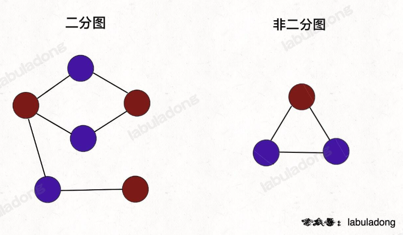

# Leetcode 刷题笔记 II


## 图论基础

### 图的逻辑结构

一幅图是由**节点**和**边**构成的，逻辑结构如下：


==用邻接表和邻接矩阵的存储方式如下==：


**邻接表**很直观，我把每个节点 `x` 的邻居都存到一个列表里，然后把 `x` 和这个列表关联起来，这样就可以通过一个节点 `x` 找到它的所有相邻节点。

**邻接矩阵**则是一个二维布尔数组，我们权且称为 `matrix`，如果节点 `x` 和 `y` 是相连的，那么就把 `matrix[x][y]` 设为 `true`（上图中绿色的方格代表 `true`）。如果想找节点 `x` 的邻居，去扫一圈 `matrix[x][:]` 就行了。

对于邻接表，好处是占用的空间少。

你看邻接矩阵里面空着那么多位置，肯定需要更多的存储空间。

但是，邻接表无法快速判断两个节点是否相邻。

比如说我想判断节点 `1` 是否和节点 `3` 相邻，我要去邻接表里 `1` 对应的邻居列表里查找 `3` 是否存在。但对于邻接矩阵就简单了，只要看看 `matrix[1][3]` 就知道了，效率高。

最后，我们再明确一个图论中特有的**度**（degree）的概念，在无向图中，「度」就是每个节点相连的边的条数。

由于有向图的边有方向，所以有向图中每个节点「度」被细分为**入度**（indegree）和**出度**（outdegree）

### 图的遍历

参考多叉树，多叉树的遍历框架：

```python
def traverse(root):
    if not root:
        return
    # 前序位置
    for child in root.children:
        traverse(child)
    # 后序位置
```

图和多叉树最大的区别是，图是可能包含环的，你从图的某一个节点开始遍历，有可能走了一圈又回到这个节点，而树不会出现这种情况，从某个节点出发必然走到叶子节点，绝不可能回到它自身。

**所以，如果图包含环，遍历框架就要一个 `visited` 数组进行辅助。**

在飞机求路线的题目中，处理的方法是直接 `pop(0)`，然后回溯之后再 `append()` 进来。

```C++
// 记录被遍历过的节点
boolean[] visited;
// 记录从起点到当前节点的路径
boolean[] onPath;

/* 图遍历框架 */
void traverse(Graph graph, int s) {
    if (visited[s]) return;
    // 经过节点 s，标记为已遍历
    visited[s] = true;
    // 做选择：标记节点 s 在路径上
    onPath[s] = true;
    for (int neighbor : graph.neighbors(s)) {
        traverse(graph, neighbor);
    }
    // 撤销选择：节点 s 离开路径
    onPath[s] = false;
}
```

注意 `visited` 数组和 `onPath` 数组的区别，因为二叉树算是特殊的图，所以用遍历二叉树的过程来理解下这两个数组的区别：


**上述 GIF 描述了递归遍历二叉树的过程，在 `visited` 中被标记为 true 的节点用灰色表示，在 `onPath` 中被标记为 true 的节点用绿色表示**，类比贪吃蛇游戏，`visited` 记录蛇经过过的格子，而 `onPath` 仅仅记录蛇身。在图的遍历过程中，`onPath` 用于判断是否成环，类比当贪吃蛇自己咬到自己（成环）的场景，这下你可以理解它们二者的区别了吧。

如果让你处理路径相关的问题，这个 `onPath` 变量是肯定会被用到的，比如**拓扑排序**。

另外，你应该注意到了，这个 `onPath` 数组的操作很像前文 [回溯算法核心套路](https://labuladong.github.io/algo/4/29/103/) 中做「做选择」和「撤销选择」，区别在于**位置**：回溯算法的「做选择」和「撤销选择」在 for 循环里面，而对 `onPath` 数组的操作在 for 循环外面。

为什么会有这个区别呢？这就是前文 [回溯算法核心套路](https://labuladong.github.io/algo/4/29/103/) 中讲到的回溯算法和 DFS 算法的区别所在：回溯算法关注的不是节点，而是树枝。不信你看前文画的回溯树，我们需要在「树枝」上做选择和撤销选择：


```C++
// DFS 算法，关注点在节点
void traverse(TreeNode root) {
    if (root == null) return;
    printf("进入节点 %s", root);
    for (TreeNode child: root.children) {
        traverse(child);
    }
    printf("离开节点 %s", root);
}

// 回溯算法，关注点在树枝
void backtrack(TreeNode root) {
    if (root == null) return;
    for (TreeNode child: root.children) {
        // 做选择
        printf("从 %s 到 %s", root, child);
        backtrack(child);
        // 撤销选择
        printf("从 %s 到 %s", child, root);
    }
}
```

如果执行这段代码，你会发现根节点被漏掉了：

```C++
void traverse(TreeNode root) {
    if (root == null) return;
    for (TreeNode child : root.children) {
        printf("进入节点 %s", child);
        traverse(child);
        printf("离开节点 %s", child);
    }
}
```

所以对于这里**图的遍历**，我们应该用 DFS 算法，即把 `onPath` 的操作放到 for 循环外面，否则会漏掉记录起始点的遍历。

说了这么多 `onPath` 数组，再说下 `visited` 数组，其目的很明显了，由于图可能含有环，`visited` 数组就是防止递归重复遍历同一个节点进入死循环的。

当然，如果题目告诉你图中不含环，可以把 `visited` 数组都省掉，基本就是多叉树的遍历。

### 所有可能的路径

> 给你一个有 n 个节点的 有向无环图（DAG），请你找出所有从节点 0 到节点 n-1 的路径并输出（不要求按特定顺序）
>
>  `graph[i]` 是一个从节点 i 可以访问的所有节点的列表（即从节点 i 到节点 `graph[i][j]` 存在一条有向边）。
>
> 
>
> 输入：graph = [[1,2],[3],[3],[]]
> 输出：[[0,1,3],[0,2,3]]
> 解释：有两条路径 0 -> 1 -> 3 和 0 -> 2 -> 3

输入的这个 `graph` 其实就是「邻接表」表示的一幅图，`graph[i]` 存储这节点 `i` 的所有邻居节点。

**解法很简单，以 `0` 为起点遍历图，同时记录遍历过的路径，当遍历到终点时将路径记录下来即可**。

既然输入的图是无环的，我们就不需要 `visited` 数组辅助了，直接套用图的遍历框架：

```python
class Solution:
    def __init__(self):
        # 记录所有路径
        self.res = []
        self.path = []

    def allPathsSourceTarget(self, graph: List[List[int]]) -> List[List[int]]:

        # 图的遍历框架
        def traverse(graph, s, path):
            # 添加节点 s 到路径
            self.path.append(s)
            
            # 终点判断
            length = len(graph)
            if s == length - 1:
                # 到达终点
                self.res.append(self.path[:])
                self.path.pop()
                return
            
            # 递归每个相邻节点
            for i in graph[s]:
                # 如果是回溯，应该在这里添加节点到路径，注意区别
                traverse(graph, i, path)
                
            # 从路径移出节点 s
            self.path.pop()

        # 深度优先遍历
        traverse(graph, 0, self.path)
        return self.res
```

**注意，这个问题错了很多次了，`python` 参数传的是对象引用，所以向 `res` 中添加 `path` 时需要拷贝一个新的列表  `self.path[:]`，否则最终 `res` 中的列表是空的。**


## 图论算法

### 有向图的环检测

#### 课程表

> 你这个学期必须选修 numCourses 门课程，记为 0 到 numCourses - 1 。
>
> 在选修某些课程之前需要一些先修课程。 先修课程按数组 prerequisites 给出，其中 prerequisites[i] = [ai, bi] ，表示如果要学习课程 ai 则 必须 先学习课程  bi 。
>
> 例如，先修课程对 [0, 1] 表示：想要学习课程 0 ，你需要先完成课程 1 。
> 请你判断是否可能完成所有课程的学习？如果可以，返回 true ；否则，返回 false 。

看到**依赖问题**，首先想到的就是把问题转化成**有向图**这种数据结构，只要图中存在环，那就说明存在循环依赖。

**思路：**课程安排图是否是有向无环图 DAG，即课程间规定了前置条件，但*不能构成任何环路*，否则课程前置条件将不成立。

我们可以通过拓扑排序判断此课程安排图是否是有向无环图。

==拓扑排序原理：==

- 对 DAG 顶点进行排序，使得对每一条有向边 $(u,v)$ 均有 $u$ 比 $v$ 先出现；
- 通过课程前置表可以得到课程安排图的邻接表，以降低时间复杂度

==通过 DFS 判断图中是否有环==

1. 借助一个标志列表 `flags`，用于判断每个节点 $i$ 的状态：
   - 未被 DFS 访问：`i==0`
   - 已被其他节点启动的 DFS 访问：`i==-1`
   - 已被当前节点启动的 DFS 访问：`i==1`
2. 对 `numCourses`个节点依次执行 DFS，判断每个节点起步 DFS 是否存在环，若存在环直接返回 False。DFS 流程：
   1. 终止条件：
      -  当 `flag[i] == -1`，说明当前访问节点已被其他节点启动的 DFS 访问，无需再重复搜索，直接返回 True。
      -  当 `flag[i] == 1`，说明在本轮 DFS 搜索中节点 $i$ 被第 2 次访问，即 **课程安排图有环** ，直接返回 False。

   2. 将当前访问节点 $i$ 对应 `flag[i]` 置 1，即标记其被本轮 DFS 访问过；

   3. 递归访问当前节点 $i$ 的所有邻接节点 $j$，当发现环直接返回 False；

   4. 当前节点所有邻接节点已被遍历，并没有发现环，则将当前节点 flag 置为 −1 并返回 True。

   5. 若整个图 DFS 结束并未发现环，返回 True


只要会遍历图结构，就可以判断环了。

利用布尔数组 `onPath`，如果遍历过程中发现下一个即将遍历的节点已经被标记为 true，说明遇到了环。

```python
class Solution:
    def canFinish(self, numCourses: int, prerequisites: List[List[int]]) -> bool:
        """
        拓扑排序：有向无环图
        从任何一个节点往前走，都不会回到这个节点，证明无环，返回 True
        """ 
        from collections import defaultdict
        # 构建邻接表
        # 使用 list 初始化所有的 value
        course = defaultdict(list)
        for val in prerequisites:
            course[val[1]].append(val[0])

        # 记录一次 traverse 递归经过的节点
        onPath = [False] * numCourses
        # 记录遍历过的节点，防止走回头路
        visited = [False] * numCourses
        # 记录图中是否有环
        hasCycle = False

        def traverse(graph, s):
            nonlocal hasCycle
            if onPath[s]:
                # 出现环
                hasCycle = True
            # 想一想 s 在 visited 中出现但是没有在 onPath 中出现，代表什么？
            # 表明其之前在另一条路径上就已经被访问过，并且是安全的（无环）
            # 所以才能一步步回退，直到从另一个节点出发再次访问到该节点，不用再重复遍历，可以直接返回
            if visited[s] or hasCycle:
                # 如果已经找到了环，也不用再遍历了
                return
            
            visited[s] = True

            onPath[s] = True
            # 这里的写法非常像多叉树，对不对
            for t in graph[s]:
                traverse(graph, t)
            # 后序遍历代码位置
            # 在这里注意 onPath 和 visited 的区别
            # 只有 onPath 需要回溯，做“选择撤销”，visited 不用
            onPath[s] = False

        # 从每一个节点出发，走一遍，看会不会碰到环
        for i in range(numCourses):
            traverse(course, i)
        return not hasCycle
```

仔细思考一下 `visited` 和 `onpath` 的区别！！

**新感悟：2022-8-24**

`visited` 这个表，我第一次写的时候没有设置这个表，也可以跑通，但是会出现超时的情况，也就是说，这个表就是用来帮我们剪枝的！一定要有！如果一个点是安全的（可以安全到终点，不会出现环），那么当我们从不同的路径到这里时，不需要走到终点我们就知道后面都是安全的，不用继续走了！

**想一想 s 在 visited 中出现但是没有在 onPath 中出现，代表什么？**

1. 表明其之前在另一条路径上就已经被访问过，并且是安全的（无环）

2. 所以才能一步步回退，直到从另一个节点出发再次访问到该节点，不用再重复遍历，可以直接返回

```python
class Solution:
    def canFinish(self, numCourses: int, prerequisites: List[List[int]]) -> bool:
        # 拓扑排序
        # 构建邻接表
        course = defaultdict(list)
        for val in prerequisites:
            course[val[1]].append(val[0])

        # 记录一次 traverse 递归经过的节点
        onPath = [False] * numCourses
        # 记录遍历过的节点，防止走回头路
        visited = [False] * numCourses

        def dfs(x):
            # 从 x 出发，看有没有环
            if onPath[x]:
                return True
            # 想一想 s 在 visited 中出现但是没有在 onPath 中出现，代表什么？
            # 表明其之前在另一条路径上就已经被访问过，并且是安全的（无环）
            # 所以才能一步步回退，直到从另一个节点出发再次访问到该节点，不用再重复遍历，可以直接返回
            if visited[x]:
                return False

            visited[x] = True

            onPath[x] = True
            for nextCourse in course[x]:
                if dfs(nextCourse):
                    return True
            onPath[x] = False

            return False

        for i in range(numCourses):
            if dfs(i):
                return False
        return True
```


### 拓扑排序算法

#### 课程表 II

> 现在你总共有 numCourses 门课需要选，记为 0 到 numCourses - 1。给你一个数组 prerequisites ，其中 prerequisites[i] = [ai, bi] ，表示在选修课程 ai 前 必须 先选修 bi 。
>
> 例如，想要学习课程 0 ，你需要先完成课程 1 ，我们用一个匹配来表示：[0,1] 。
> 返回你为了学完所有课程所安排的学习顺序。可能会有多个正确的顺序，你只要返回 任意一种 就可以了。如果不可能完成所有课程，返回 一个空数组 。
>
> 输入：numCourses = 2, prerequisites = [[1,0]]
> 输出：[0,1]
> 解释：总共有 2 门课程。要学习课程 1，你需要先完成课程 0。因此，正确的课程顺序为 [0,1] 。

这道题就是上道题的进阶版，不是仅仅让你判断是否可以完成所有课程，而是进一步让你返回一个合理的上课顺序，保证开始修每个课程时，前置的课程都已经修完。

**如果把课程抽象成节点，课程之间的依赖关系抽象成有向边，那么这幅图的拓扑排序结果就是上课顺序**。

首先，我们先判断一下题目输入的课程依赖是否成环，成环的话是无法进行拓扑排序的，所以我们可以复用上一道题的主函数。

关键问题是如何进行拓扑排序？

**很简单，将后序遍历的结果进行反转，就是拓扑排序的结果。**

二叉树的后序遍历是什么时候？遍历完左右子树之后才会执行后序遍历位置的代码。换句话说，当左右子树的节点都被装到结果列表里面了，根节点才会被装进去。

后序遍历的这一特点很重要，之所以拓扑排序的基础是后序遍历，是因为一个任务必须等到它依赖的所有任务都完成后才能开始执行。

## BFS 广度优先遍历

**BFS 的核心思想**：就是把一些问题抽象成图，从一个点开始，向四周扩散。一般来说，我们写 BFS 算法都是用**队列**这种数据结构，每次将一个节点周围的所有节点加入队列。

**BFS 相对 DFS 最主要的区别是**：BFS 找到的路径一定是最短的，但代价就是空间复杂度可能比 DFS 大很多。

### 基础知识

#### 算法框架

**问题的本质就是让你在一幅图中找到从起点 start 到终点 end 的最近距离。**

这个广义的描述可以有各种变体，如走迷宫，有的格子是围墙不能走，从起点到终点的最短距离是多少？如果这个迷宫带传送门可以瞬间传送呢？

再比如说两个单词，要求你通过某些替换，把其中一个变成另外一个，每次只能替换一个字符，最少要替换几次？

> 这是 BFS 的题？这不是编辑距离，动态规划的题？

再比如说连连看游戏，两个方块消除的条件不仅仅是图案相同，还得保证两个方块之间的最短连线不能多于两个拐点。你玩连连看，点击两个坐标，游戏是如何判断它俩的最短连线有几个拐点的？

净整些花里胡哨的，这些问题都没啥奇技淫巧，本质上就是一幅「图」，让你从一个起点，走到终点，问最短路径。这就是 BFS 的本质，框架搞清楚了直接默写就好。


记住下面这个框架就 OK 了：

```python
# 计算从起点 start 到终点 target 的最近距离
def BFS(start, target):
    # 核心数据结构
    q = deque()
    # 避免走回头路
    visited = []

    # 将起点加入队列
    q.append(root)
    visited.append(root)
    # 记录扩散的步数
    step = 1
    
    while q:
        length = len(q)
        # 将当前队列中的所有节点向四周扩散
        for i in range(length):
            cur = q.popleft()
            # 划重点：这里判断是否到达终点
            if cur is target:
                return step
            # 将 cur 的相邻节点加入队列
            for node in cur.adj():
            	if node not in visited:
                    q.append(node)
                    visited.append(node)
        # 划重点：更新步数在这里
        step += 1
```

`cur.adj()` 泛指 `cur` 相邻的节点，比如说二维数组中，`cur` 上下左右四面的位置就是相邻节点；`visited` 的主要作用是防止走回头路，大部分时候都是必须的，但是像一般的二叉树结构，没有子节点到父节点的指针，不会走回头路就不需要 `visited`。

这里注意这个 `while` 循环和 `for` 循环的配合，**`while` 循环控制一层一层往下走，`for` 循环利用 `length` 变量控制从左到右遍历每一层二叉树节点**。

### 二叉树中所有距离为 K 的节点：BFS

> 给定一个二叉树（具有根结点 root）， 一个目标结点 target ，和一个整数值 k 。
>
> 返回到目标结点 target 距离为 k 的所有结点的值的列表。 答案可以以 任何顺序 返回。
>
>  
>
> 输入：root = [3,5,1,6,2,0,8,null,null,7,4], target = 5, k = 2
> 输出：[7,4,1]
> 解释：所求结点为与目标结点（值为 5）距离为 2 的结点，值分别为 7，4，以及 1

这道题的常规解法就是把二叉树变成一幅图，然后在图中用 BFS 算法求距离 target 节点 k 步的所有节点。

```python
class Solution:
    def __init__(self):
        self.parent = {}

    def distanceK(self, root: TreeNode, target: TreeNode, k: int) -> List[int]:
        # 遍历所有节点，记录每个节点的父节点
        def traverse(root, parentNode):
            if not root:
                return
            self.parent[root.val] = parentNode
            traverse(root.left, root)
            traverse(root.right, root)

        traverse(root, None)

        # 开始从 target 节点施放 BFS 算法，找到距离为 K 的节点
        q = deque()
        visited = set()
        q.append(target)
        visited.add(target.val)
        # 记录离 target 的距离
        dist = 0
        res = []

        while q:
            length = len(q)
            for _ in range(length):
                cur = q.popleft()
                if dist == k:
                    # 找到距离起点 target 为 k 的节点
                    res.append(cur.val)
                    
                # 向父节点、子节点扩散
                parentNode = self.parent[cur.val]
                if parentNode and parentNode.val not in visited:
                    visited.add(parentNode.val)
                    q.append(parentNode)
                if cur.left and cur.left.val not in visited:
                    visited.add(cur.left.val)
                    q.append(cur.left)
                if cur.right and cur.right.val not in visited:
                    visited.add(cur.right.val)
                    q.append(cur.right)
            
            dist += 1
        return res
```

### 网格中的最短路径

> 给你一个 m * n 的网格，其中每个单元格不是 0（空）就是 1（障碍物）。每一步，您都可以在空白单元格中上、下、左、右移动。
>
> 如果您 最多 可以消除 k 个障碍物，请找出从左上角 (0, 0) 到右下角 (m-1, n-1) 的最短路径，并返回通过该路径所需的步数。如果找不到这样的路径，则返回 -1 。
>

**最短路径**，一看到这样的字眼就应该想到**广度优先遍历 BFS**！

我们使用四元组 `(x,y,rest,steps)` 表示一个搜索状态，其中 `(x,y)` 表示玩家的位置，`rest` 表示玩家还可以经过 `rest` 个障碍物，它的值必须为非负整数。对于当前的状态，它可以向最多四个新状态进行搜索，即将玩家向四个方向移动一格。假设移动的方向为 `(dx, dy)`，那么玩家的新位置为 `(mx + dx, my + dy)`。如果该位置为障碍物，那么新的状态为 `(mx + dx, my + dy, rest - 1)`，否则新的状态为 `(mx + dx, my + dy, rest)`。

我们从初始状态 `(0, 0, k)` 开始搜索，当我们第一次到达状态 `(m - 1, n - 1, k')`，其中 `k'` 是任意非负整数时，就得到了从左上角 `(0, 0)` 到右下角 `(m - 1, n - 1)` 且最多经过 `k` 个障碍物的最短路径。

注意，我们需要利用一个集合记录访问过的状态，从而避免死循环。

> **为什么状态信息需要第三维度？**
>
> 1. 对于不考虑可以越过障碍物的常规情况，只需记录已访问过的点坐标即可，因为某一点出发，之后可以走的所有情形（是否能走完、可以走的最短路径等信息）就是确定的，即点坐标 `(x, y)` 可与当前状态一一对应，BFS过程中如遇到已有状态则剪枝，说明当前已经绕了远路。
> 2. 对于此题，点坐标 `(x, y)` 本身不足以与当前状态一一对应：显然即使在同一位置上，可以越过障碍的剩余机会数目也会决定之后是否能走完、可以走的最短路径等信息，所以需要 `(x, y, rest)` 三元组来与当前状态一一对应。
>
> 

此外，我们还可以对搜索空间进行优化。注意到题目中 k 的上限为 `m * n`，但考虑一条从 `(0, 0)` 向下走到 `(m - 1, 0)` 再向右走到 `(m - 1, n - 1)` 的路径，它经过了 `m + n - 1` 个位置，其中起点 `(0, 0)` 和终点 `(m - 1, n - 1)` 没有障碍物，那么这条路径上最多只会有 `m + n - 3` 个障碍物。

我们可以将 `k` 的值设置为 `m + n - 3` 与其本身的较小值 `min(k, m + n - 3)`，将广度优先搜索的时间复杂度从 $O(MNK)$ 降低至 $MN * min(M+N, K)$ 。

```python
class Solution:
    def shortestPath(self, grid: List[List[int]], k: int) -> int:
        # BFS
        if not any(grid):
            return -1
        m, n = len(grid), len(grid[0])
        k = min(k, m + n - 3)
        q = [(0, 0, k, 0)]
        visited = {(0, 0, k)}
        while q:
            x, y, rest, steps = q.pop(0)
            if x == m - 1 and y == n - 1:
                return steps
            for nx, ny in [(x + 1, y), (x - 1, y), (x, y + 1), (x, y - 1)]:
                if 0 <= nx < m and 0 <= ny < n:
                    nk = rest - grid[nx][ny]
                    if nk < 0 or (nx, ny, nk) in visited:
                        continue
                    q.append((nx, ny, nk, steps + 1))
                    visited.add((nx, ny, nk))
        return -1
```

### 到家的最少跳跃次数

> 有一只跳蚤的家在数轴上的位置 x 处。请你帮助它从位置 0 出发，到达它的家。
>
> 跳蚤跳跃的规则如下：
>
> 它可以 往前 跳恰好 a 个位置（即往右跳）。
> 它可以 往后 跳恰好 b 个位置（即往左跳）。
> 它不能 连续 往后跳 2 次。
> 它不能跳到任何 forbidden 数组中的位置。
> 跳蚤可以往前跳 超过 它的家的位置，但是它 不能跳到负整数 的位置。
>
> 给你一个整数数组 forbidden ，其中 forbidden[i] 是跳蚤不能跳到的位置，同时给你整数 a， b 和 x ，请你返回跳蚤到家的最少跳跃次数。如果没有恰好到达 x 的可行方案，请你返回 -1 。
>
> 输入：forbidden = [14,4,18,1,15], a = 3, b = 15, x = 9
> 输出：3
> 解释：往前跳 3 次（0 -> 3 -> 6 -> 9），跳蚤就到家了。

**最少跳跃次数**：**广度优先遍历**

1. 从起点开始，使用广度优先搜索，并记录访问过的节点状态不再再次访问
2. 本题的关键在于确定最远能到达的右边界，超过这个范围则终止
3. 参见题解[到家的最少跳跃次数（最短路+证明）](https://leetcode.cn/problems/minimum-jumps-to-reach-home/solution/dao-jia-de-zui-shao-tiao-yue-ci-shu-zui-duan-lu-zh/)可以得出最远达到的位置 $n$ 有 $n=$ $\max (f+a+b, x+b)$ ，其中 $f$ 为 forbidden 的最大值，因为  $f, a, b, x \leq 2000$ ，故搜索范围不会超过  $\mathbf{6 0 0 0}$ 。

```python
class Solution:
    def minimumJumps(self, forbidden: List[int], a: int, b: int, x: int) -> int:
        # BFS 广度优先遍历
        farest = max(max(forbidden) + a + b, x + b)
        forbid = set(forbidden)
        visit = set()
        step = 0
        # [青蛙所在坐标，从左边跳过来的还是从右边跳过来的？]
        # 主要是为了避免向右连跳两次，因此需要这个值
        stack = [[0, 0]]
        while stack:
            nex = []
            for i, _ in stack:
                if i == x:
                    return step

            for i, d in stack:
                if i + a not in forbid and i + a <= farest and (i + a, 1) not in visit:
                    visit.add((i + a, 1))
                    nex.append([i + a, 1])
                # 向右不能连跳两次
                if d != -1:
                    if i - b >= 0 and i - b not in forbid and (i - b, -1) not in visit:
                        visit.add((i - b, -1))
                        nex.append([i - b, -1])
            step += 1
            stack = nex.copy()
        return -1
```

###  [二叉树的最小深度](https://leetcode.cn/problems/minimum-depth-of-binary-tree/)

> 二叉数的最小深度是从根节点到最近叶子节点的最短路径上的节点数量。

在这一题里，如何判断 `if cur is target`？很显然，目标节点就是叶子节点，如果左右子树都为空，说明当前节点就是叶子节点。

```python
class Solution:
    def minDepth(self, root: TreeNode) -> int:
        if not root:
            return 0
            
        q = deque()
        visited = []

        q.append(root)
        visited.append(root)
        depth = 1

        while q:
            length = len(q)
            for i in range(length):
                cur = q.popleft()
                # 判断目标是否为叶子节点
                if not cur.left and not cur.right:
                    return depth
                if cur.left and cur.left not in visited:
                    q.append(cur.left)
                    visited.append(cur.left)
                if cur.right and cur.right not in visited:
                    q.append(cur.right)
                    visited.append(cur.right)
            depth += 1   
```

### 解开密码锁的最少次数

> 你有一个带有四个圆形拨轮的转盘锁。每个拨轮都有 10 个数字： '0', '1', '2', '3', '4', '5', '6', '7', '8', '9' 。每个拨轮可以自由旋转：例如把 '9' 变为 '0'，'0' 变为 '9' 。每次旋转都只能旋转一个拨轮的一位数字。
>
> 锁的初始数字为 '0000' ，一个代表四个拨轮的数字的字符串。
>
> 列表 deadends 包含了一组死亡数字，一旦拨轮的数字和列表里的任何一个元素相同，这个锁将会被永久锁定，无法再被旋转。
>
> 字符串 target 代表可以解锁的数字，你需要给出解锁需要的最小旋转次数，如果无论如何不能解锁，返回 -1 。
>
> 输入：deadends = ["0201","0101","0102","1212","2002"], target = "0202"
> 输出：6
> 解释：
> 可能的移动序列为 "0000" -> "1000" -> "1100" -> "1200" -> "1201" -> "1202" -> "0202"。
> 注意 "0000" -> "0001" -> "0002" -> "0102" -> "0202" 这样的序列是不能解锁的，
> 因为当拨动到 "0102" 时这个锁就会被锁定。

题目中描述的就是我们生活中常见的那种密码锁，若果没有任何约束，最少的拨动次数很好算，就像我们平时开密码锁那样直奔密码拨就行了。

但现在的难点就在于，不能出现 `deadends`，应该如何计算出最少的转动次数呢？

第一步，我们不管所有的限制条件，不管 deadends 和 target 的限制，就思考一个问题：如果让你设计一个算法，穷举所有可能的密码组合，你怎么做？

穷举呗，再简单一点，**如果你只转一下锁**，有几种可能？总共有 4 个位置，每个位置可以向上转，也可以向下转，也就是有 8 种可能对吧。

比如说从 `"0000"` 开始，转一次，可以穷举出 `"1000", "9000", "0100", "0900"...` 共 8 种密码。然后，再以这 8 种密码作为基础，对每个密码再转一下，穷举出所有可能…

**仔细想想，这就可以抽象成一幅图，每个节点有 8 个相邻的节点**，又让你求最短距离，这不就是典型的 BFS 嘛，框架就可以派上用场了：

```python
class Solution:
    def openLock(self, deadends: List[str], target: str) -> int:
    
        def plusOne(s, j):
            s = list(s)
            if s[j] == '9':
                s[j] = '0'
            else:
                s[j] = str(int(s[j]) + 1)
            return ''.join(s)
            
        def minusOne(s, j):
            s = list(s)
            if s[j] == '0':
                s[j] = '9'
            else:
                s[j] = str(int(s[j]) - 1)
            return ''.join(s)
        
        def bfs(deadends, target):
            q = deque()
            q.append('0000')

            # 使用死亡数组初始化 visited
            visited = deadends[:]
            if '0000' not in visited:
                visited.append('0000')
            else:
                return -1

            step = 0

            while q:
                length = len(q)
                # 将当前队列中的左右节点向周围扩散
                for i in range(length):
                    s = q.popleft()
                    # 判断是否到达终点
                    if s == target:
                        return step
                    
                    # 将当前节点的相邻节点（8个）加入队列
                    for j in range(4):
                        a = plusOne(s, j)
                        b = minusOne(s, j)
                        if a not in visited:
                            q.append(a)
                            visited.append(a)
                        if b not in visited:
                            q.append(b)
                            visited.append(b)

                # 在这里增加步数
                step += 1
            
            # 如果穷举完还没有找到，就返回 -1
            return -1
            
        return bfs(deadends, target)
```

但是上面这种方法超时了，需要==双向 BFS 优化==：

传统的 BFS 框架是从起点开始向四周扩散，遇到终点时停止，而双向 BFS 则是从起点和终点同时开始扩散，当两边有交集的时候停止。


图示中的树形结构，如果终点在最底部，按照传统 BFS 算法的策略，会把整棵树的节点都搜索一遍，最后找到 `target`；而双向 BFS 其实只遍历了半棵树就出现了交集，也就是找到了最短距离。从这个例子可以直观地感受到，双向 BFS 是要比传统 BFS 高效的。

**不过，双向 BFS 也有局限，因为你必须知道终点在哪里**。比如我们刚才讨论的二叉树最小高度的问题，你一开始根本就不知道终点在哪里，也就无法使用双向 BFS；但是第二个密码锁的问题，是可以使用双向 BFS 算法来提高效率的。

```python
class Solution:
    # 双向 bfs
    def openLock(self, deadends: List[str], target: str) -> int:
        if target == "0000":
            return 0
        dead = set(deadends)
        if "0000" in dead:
            return -1
        d = {"0000": 0}
        ed = {target: 0}
        q = deque(["0000"])
        eq = deque([target])

        def spin(start: str) -> List[str]:
            for i in range(4):
                num = int(start[i])
                for j in [1, -1]:
                    yield start[:i] + str((num + j) % 10) + start[i + 1:]

        def update(s: deque, t: dict, u: dict) -> int:
            for _ in range(len(s)):
                cur = s.popleft()
                tim = t[cur]
                for st in spin(cur):
                    # st 不在死亡数组中
                    if st not in dead and st not in t:
                        if st in u:
                            return u[st] + tim + 1
                        else:
                            s.append(st)
                            t[st] = tim + 1

        while q and eq:
            if len(q) <= len(eq):
                r = update(q, d, ed)
            else:
                r = update(eq, ed, d)
            if r:
                return r
        return -1
```


## 岛屿问题

在 LeetCode 中，「岛屿问题」是一个系列系列问题，比如：岛屿数量、岛屿的周长、岛屿的最大面积、最大人工岛。我们所熟悉的 DFS 深度优先搜索问题通常是在树或者图结构上进行的，而我们今天要讨论的 DFS 问题，是在一种网格结构中进行的，岛屿问题是这类网格 DFS 问题的典型代表。网格结构遍历起来要比二叉树复杂一些，如果没有掌握一定的方法，DFS 代码容易写的冗长繁杂。

==网格类问题问题的 DFS 遍历方法：==

==网格问题的基本概念==

网格问题是由 m×n 个小方格组成一个网格，每个小方格与其上下左右四个方格认为是相邻的，要在这样的网格上进行某种搜索。

岛屿问题是一类典型的网格问题。每个格子中的数字可能是 0 或者 1。我们把数字为 0 的格子看成海洋格子，数字为 1 的格子看成陆地格子，这样相邻的陆地格子就连接成一个岛屿。


在这样一个设定下，就出现了各种岛屿问题的变种，包括岛屿的数量、面积、周长等，不过这些问题，基本都可以用 DFS 遍历解决。

==DFS 的基本结构：==

网格结构要比二叉树结构稍微复杂一些，它其实是一种简化版的图结构。要写好网格上的 DFS 遍历，我们首先要理解二叉树上的 DFS 遍历方法，再类比写出网格结构上的 DFS 遍历：

```python
def traverse(root):
    if root == None:
        return
    traverse(root.left)
    traverse(root.right)
```

可以看到，二叉树的 DFS 有两个要素：

- 访问相邻节点
- 判断 base case

第一个要素是 ==访问相邻节点==。二叉树的相邻节点非常简单，只有左节点和右节点两个。二叉树本身是一个递归定义的结构：一棵二叉树，它的左子树和右子树也是一棵二叉树。那么我们的 DFS 遍历只需要递归调用左子树和右子树即可。

第二个要素是判断 base case。一般来说，二叉树遍历的 base case 是 `root == None`，这样一个条件判断其实有两个含义：一方面，这表示 root 指向的子树为空，不需要再往下遍历了；另一方面，在 `root == None` 的时候及时返回，可以让后面的 `root.left` 和 `root.right` 操作不会出现空指针异常。

对于网格上的 DFS，我们完全可以参考二叉树的 DFS，写出网格 DFS 的两个要素：

 首先，网格结构中的格子有多少相邻节点？答案是上下左右四个。对于格子 `(r,c)` 来说，四个相邻的格子分别是 `(r-1, c)`、`(r+1, c)`、`(r, c-1)`、`(r, c+1)`。换句话说，网格结构是「四叉」的。


其次，网格  DFS 中的 base case 是什么？从二叉树的 base case 对应过来，应该是网格中不需要继续遍历、`grid[r][c]`会出现数组下标越界异常的格子，也就是那些超出网格范围的格子。


这稍微有些反直觉，坐标竟然可以临时超出网格的范围？这种方法我称为==先污染后治理==——甭管当前是在哪个格子，先往四个方向走一步再说，如果发现走出了网格范围再赶紧返回。这跟二叉树的遍历方法是一样的，先递归调用，发现 `root == None`再返回。这样我们就得到了网格 DFS 遍历的框架代码：

```java
void dfs(int[][] grid, int r, int c) {
    // 判断 base case
    // 如果坐标 (r, c) 超出了网格范围，直接返回
    if (!inArea(grid, r, c)) {
        return;
    }
    // 访问上、下、左、右四个相邻结点
    dfs(grid, r - 1, c);
    dfs(grid, r + 1, c);
    dfs(grid, r, c - 1);
    dfs(grid, r, c + 1);
}

// 判断坐标 (r, c) 是否在网格中
boolean inArea(int[][] grid, int r, int c) {
    return 0 <= r && r < grid.length 
        	&& 0 <= c && c < grid[0].length;
}
```

==如何避免重复遍历？==

网格结构的 DFS 与二叉树的 DFS 最大的不同之处在于，**遍历中可能遇到遍历过的节点**，这是因为，网格结构本质上是一个图，我们可以把每个格子看成图中的节点，每个节点有向上下左右的四条边。在图中遍历时，自然可能会遇到重复遍历节点。

这时候，DFS 可能会不停地「兜圈子」，永远停不下来，如下图所示：


如何避免这样的重复遍历呢？==答案是标记已经遍历过的格子==，以岛屿问题为例，我们需要在所有值为 1 的陆地格子上做 DFS 遍历，每走过一个陆地格子，就把格子的值改为 2，这样当我们遇到 2 的时候，就知道这是遍历过的格子了，也就是说，每个格子可能取三个值：

- 0 —— 海洋格子
- 1 —— 陆地格子（未遍历过）
- 2 —— 陆地格子（已遍历过）

我们在框架代码中加入避免重复遍历的语句：

```java
void dfs(int[][] grid, int r, int c) {
    // 判断 base case
    if (!inArea(grid, r, c)) {
        return;
    }
    // 如果这个格子不是岛屿，直接返回
    if (grid[r][c] != 1) {
        return;
    }
    grid[r][c] = 2; // 将格子标记为「已遍历过」
    
    // 访问上、下、左、右四个相邻结点
    dfs(grid, r - 1, c);
    dfs(grid, r + 1, c);
    dfs(grid, r, c - 1);
    dfs(grid, r, c + 1);
}

// 判断坐标 (r, c) 是否在网格中
boolean inArea(int[][] grid, int r, int c) {
    return 0 <= r && r < grid.length 
        	&& 0 <= c && c < grid[0].length;
}
```


这样，我们就得到了一个岛屿问题、乃至各种网格问题的通用 DFS 遍历方法。

### ==[岛屿的最大面积](https://leetcode-cn.com/problems/max-area-of-island/)==

> 给你一个大小为 m x n 的二进制矩阵 grid 。
>
> 岛屿 是由一些相邻的 1 (代表土地) 构成的组合，这里的「相邻」要求两个 1 必须在水平或者竖直的四个方向上 相邻。你可以假设 grid 的四个边缘都被 0（代表水）包围着。
>
> 岛屿的面积是岛上值为 1 的单元格的数目。
>
> 计算并返回 grid 中最大的岛屿面积。如果没有岛屿，则返回面积为 0 。
>
> 

这道题目只需要对每个岛屿做  DFS 遍历，求出每个岛屿的面积就可以了，每遍历到一个格子，就把面积加一。

#### 深度优先搜索

1. 遍历二维数组，对于每块土地，去其前后左右找相邻土地，再去前后左右的土地找其前后左右的土地，直到周围没有土地
2. 对于每一块已找过的土地，为避免重复计算，**将其置为 0**
3. 遍历所有岛屿，然后取这些岛屿的最大面积

```python
class Solution:
    def maxAreaOfIsland(self, grid: List[List[int]]) -> int:
        m, n = len(grid), len(grid[0])
        def dfs(i, j):
            if 0 <= i < m and 0 <= j < n and grid[i][j]:
                grid[i][j] = 0
                return 1 + dfs(i - 1, j) + dfs(i + 1, j) + dfs(i, j - 1) + dfs(i, j + 1)
            # 这里是终止条件，x
            # base case
            return 0
        
        res = 0
        for i in range(m):
            for j in range(n):
                if grid[i][j]:
                    res = max(res, dfs(i, j))
        return res

```

### 填海造陆问题：最大人工岛

> 在二维地图上， 0 代表海洋，1 代表陆地，我们最多只能将一格 0 （海洋）变成 1 （陆地）。进行填海之后，地图上最大的岛屿面积是多少？

这道题目是岛屿最大面积问题的升级版，大致的思路我们不难想到，我们先计算出所有岛屿的面积，在所有的格子上标记出岛屿的面积。**然后搜索出哪个海洋格子相邻的两个岛屿面积最大**，例如下图中红色方框内的海洋格子，上边、左边都与岛屿相邻，我们可以计算出它变成陆地之后可以连接成的岛屿面积。


然而，这种做法可能遇到一个问题，如下图中红色方框内的海洋格子，它的上边、左边都与岛屿相邻，这时候连接成的岛屿面积难道是 7+1+7 ？显然不是。这两个 7 来自同一个岛屿，所以填海造陆之后得到的岛屿面积应该只有 7+1 = 8。


可以看到，要让算法正确，我们得能区分一个海洋格子相邻的两个 7 是不是来自同一个岛屿。那么我们不能在方格中标记岛屿的面积，而应该标记岛屿的索引下标，另外用一个数组记录每个岛屿的面积，如下图所示，这样我们就可以发现红色方框内的海洋格子，它的两个相邻的岛屿实际上是同一个。


可以看到，这道题实际上是对网格做了两遍 DFS：第一遍 DFS 遍历陆地格子，计算每个岛屿的面积并比较岛屿；第二遍 DFS 遍历海洋格子，观察每个海洋格子相邻的陆地格子。

**2022-8-24 很不容易，总算写出来了！**

华为笔试原题，但是更难一些，可以填两个格子，求最大岛屿面积。

```python
from typing import List
class Solution:
    def largestIsland(self, grid: List[List[int]]) -> int:
        # 1. 求出所有岛的面积，将编号和面积放在字典里
        # 2. 将岛的值更改为 index
        # 3. 遍历岛，如果为 0，上下左右搜寻
        island, grid, maxArea = self.maxAreaOfIsland(grid)
        m, n = len(grid), len(grid[0])
        res = maxArea
        for i in range(m):
            for j in range(n):
                if grid[i][j] == 0:
                    area = 1
                    # 避免加重，用一个集合来去重！
                    toAdd = set()
                    for x, y in [(i + 1, j), (i - 1, j), (i, j - 1), (i, j + 1)]:
                        if 0 <= x < m and 0 <= y < n:
                            if grid[x][y] in island:
                                toAdd.add(grid[x][y])
                    for index in toAdd:
                        area += island[index]

                    res = max(res, area)
        return res

    def maxAreaOfIsland(self, grid: List[List[int]]) -> int:
        m, n = len(grid), len(grid[0])

        def dfs(i, j, index):
            if 0 <= i < m and 0 <= j < n and grid[i][j] == 1:
                grid[i][j] = index
                return (
                    1
                    + dfs(i - 1, j, index)
                    + dfs(i + 1, j, index)
                    + dfs(i, j - 1, index)
                    + dfs(i, j + 1, index)
                )
            # 这里是终止条件，x
            return 0

        island = {}
        # 从 2 开始编号的原因是岛屿只有 0 和 1
        index = 2
        maxArea = 0
        for i in range(m):
            for j in range(n):
                if grid[i][j]:
                    island[index] = dfs(i, j, index)
                    maxArea = max(maxArea, island[index])
                    index += 1
        return island, grid, maxArea
```


### 岛屿的周长

> 给定一个包含 0 和 1 的二维网格地图，其中 1 表示陆地，0 表示海洋。网格中的格子水平和垂直方向相连（对角线方向不相连）。整个网格被水完全包围，但其中恰好有一个岛屿（一个或多个表示陆地的格子相连组成岛屿）。
>
> 岛屿中没有 “湖”（“湖” 指水域在岛屿内部且不和岛屿周围的水相连）。格子是边长为 1 的正方形。计算这个岛屿的周长。
>
> 

对于岛屿，直接用数学的方法求周长会更容易。不过这道题是一个很好的理解 DFS 遍历过程的例题，不信你跟着我往下看。

可以看到，dfs 函数直接返回有这几种情况：

`!inArea(grid, r, c)`，即坐标 (r, c) 超出了网格的范围，也就是我所说的「先污染后治理」的情况
`grid[r][c] != 1`，即当前格子不是岛屿格子，这又分为两种情况：
`grid[r][c] == 0`，当前格子是海洋格子
`grid[r][c] == 2`，当前格子是已遍历的陆地格子

那么这些和我们岛屿的周长有什么关系呢？实际上，岛屿的周长是计算岛屿全部的边缘，而这些边缘就是我们在 DFS 遍历中，dfs 函数返回的位置。观察题目示例，我们可以将岛屿的周长中的边分为两类，如下图所示。黄色的边是与网格边界相邻的周长，而蓝色的边是与海洋格子相邻的周长。


当我们的 dfs 函数因为「坐标 (r, c) 超出网格范围」返回的时候，实际上就经过了一条黄色的边；而当函数因为「当前格子是海洋格子」返回的时候，实际上就经过了一条蓝色的边。这样，我们就把岛屿的周长跟 DFS 遍历联系起来了，我们的题解代码也呼之欲出：

```java
public int islandPerimeter(int[][] grid) {
    for (int r = 0; r < grid.length; r++) {
        for (int c = 0; c < grid[0].length; c++) {
            if (grid[r][c] == 1) {
                // 题目限制只有一个岛屿，计算一个即可
                return dfs(grid, r, c);
            }
        }
    }
    return 0;
}

int dfs(int[][] grid, int r, int c) {
    // 函数因为「坐标 (r, c) 超出网格范围」返回，对应一条黄色的边
    if (!inArea(grid, r, c)) {
        return 1;
    }
    // 函数因为「当前格子是海洋格子」返回，对应一条蓝色的边
    if (grid[r][c] == 0) {
        return 1;
    }
    // 函数因为「当前格子是已遍历的陆地格子」返回，和周长没关系
    if (grid[r][c] != 1) {
        return 0;
    }
    grid[r][c] = 2;
    return dfs(grid, r - 1, c)
        + dfs(grid, r + 1, c)
        + dfs(grid, r, c - 1)
        + dfs(grid, r, c + 1);
}

// 判断坐标 (r, c) 是否在网格中
boolean inArea(int[][] grid, int r, int c) {
    return 0 <= r && r < grid.length 
        	&& 0 <= c && c < grid[0].length;
}
```

```python
class Solution:
    def islandPerimeter(self, grid: List[List[int]]) -> int:
        def dfs(grid,i,j):
            if not inArea(grid,i,j) or grid[i][j] == 0:
                return 1
            if grid[i][j] == 2:
                return 0
            
            if grid[i][j] == 1:
                grid[i][j] = 2
                up = dfs(grid, i, j+1)
                down = dfs(grid, i, j-1)
                left = dfs(grid, i-1, j)
                right = dfs(grid, i+1, j)
                return up + down + left + right

        def inArea(grid, i, j):
            return 0<=i<len(grid) and 0<=j<len(grid[0])

        for i in range(len(grid)):
            for j in range(len(grid[0])):
                if grid[i][j]:
                    res = dfs(grid, i, j)
                    return res
```


### 岛屿数量

> 给你一个由 '1'（陆地）和 '0'（水）组成的的二维网格，请你计算网格中岛屿的数量。岛屿总是被水包围，并且每座岛屿只能由水平方向和 / 或竖直方向上相邻的陆地连接形成。此外，你可以假设该网格的四条边均被水包围。
>
> 输入：grid = [
> ["1","1","1","1","0"],
> ["1","1","0","1","0"],
> ["1","1","0","0","0"],
> ["0","0","0","0","0"]
> ]
> 输出：1

```python
class Solution:
    def numIslands(self, grid: List[List[str]]) -> int:

        def dfs(grid, i, j):
            if not inArea(grid, i, j) or grid[i][j] == 0:
                return
            
            if grid[i][j] == '1':
                grid[i][j] = 0

                dfs(grid, i+1, j)
                dfs(grid, i, j+1)
                dfs(grid, i-1, j)
                dfs(grid, i, j-1)

        def inArea(grid, i, j):
            return 0<=i<len(grid) and 0<=j<len(grid[0])
        
        count = 0
        for i in range(len(grid)):
            for j in range(len(grid[0])):
                if grid[i][j] == '1':
                    dfs(grid, i, j)
                    count += 1
        return count
```

- 从 1 出发，dfs 把 1 周围的 1 全部置为 0
- 岛屿数量 + 1
- 遍历格子，重复第一、二步


## 单调栈

### 每日温度

> 给定一个整数数组 temperatures ，表示每天的温度，返回一个数组 answer ，其中 answer[i] 是指在第 i 天之后，才会有更高的温度。如果气温在这之后都不会升高，请在该位置用 0 来代替。
>
> ```
> 输入: temperatures = [73,74,75,71,69,72,76,73]
> 输出: [1,1,4,2,1,1,0,0]
> ```

==单调栈==：要求是每次入栈的元素必须要有序（如果新元素入栈不符合要求，则将之前的元素出栈，直到符合要求再入栈），使之形成单调递增 / 单调递减的一个栈。

==什么时候用单调栈？==

通常是一维数组，要寻找任意一个元素的右边或者左边==第一个比自己大或者小的元素的位置==，此时我们就要想到可以用单调栈。

那么单调栈的原理是什么呢？为什么时间复杂度是 O (n) 就可以找到每一个元素的右边第一个比它大的元素位置呢？

单调栈的本质是==空间换时间==，因为在遍历的过程中需要用一个栈来记录右边第一个比当前元素大的元素，优点是只需要遍历一次。

在使用单调栈的时候首先要明确如下几点：

1. 单调栈里存放的元素是什么？

单调栈里只需要存放元素的下标 i 就可以了，如果需要使用对应的元素，直接 T [i] 就可以获取。

2. 单调栈里元素是递增呢？还是递减呢？

注意顺序是从栈头到栈底的顺序，这里我们要使用递增循序，因为只有递增的时候，加入一个元素 i，才知道栈顶元素在数组中右面第一个比栈顶元素大的元素是 i。

使用单调栈主要有三个判断条件。

- 当前遍历的元素 T [i] 小于栈顶元素 T [st.top ()] 的情况
- 当前遍历的元素 T [i] 等于栈顶元素 T [st.top ()] 的情况
- 当前遍历的元素 T [i] 大于栈顶元素 T [st.top ()] 的情况

接下来我们用 temperatures = [73, 74, 75, 71, 71, 72, 76, 73] 为例来逐步分析，输出应该是 [1, 1, 4, 2, 1, 1, 0, 0]。

首先先将第一个遍历元素加入单调栈：


加入 T [1] = 74，因为 T [1] > T [0]（当前遍历的元素 T [i] 大于栈顶元素 T [st.top ()] 的情况），而我们要保持一个递增单调栈（从栈头到栈底），所以将 T [0] 弹出，T [1] 加入，此时 result 数组可以记录了，result [0] = 1，即 T [0] 右面第一个比 T [0] 大的元素是 T [1]。


加入 T [2]，同理，T [1] 弹出：


加入 T [3]，T [3] < T [2] （当前遍历的元素 T [i] 小于栈顶元素 T [st.top ()] 的情况），加 T [3] 加入单调栈。


加入 T [4]，T [4] == T [3] （当前遍历的元素 T [i] 等于栈顶元素 T [st.top ()] 的情况），此时依然要加入栈，不用计算距离，因为我们要求的是右面第一个大于本元素的位置，而不是大于等于！


加入 T [5]，T [5] > T [4] （当前遍历的元素 T [i] 大于栈顶元素 T [st.top ()] 的情况），将 T [4] 弹出，同时计算距离，更新 result


T [4] 弹出之后， T [5] > T [3] （当前遍历的元素 T [i] 大于栈顶元素 T [st.top ()] 的情况），将 T [3] 继续弹出，同时计算距离，更新 result


直到发现 T [5] 小于 T [st.top ()]，终止弹出，将 T [5] 加入单调栈


加入 T [6]，同理，需要将栈里的 T [5]，T [2] 弹出


同理，继续弹出


此时栈里只剩下了 T [6]


加入 T [7]， T [7] < T [6] 直接入栈，这就是最后的情况，result 数组也更新完了。


此时有同学可能就疑惑了，那 result [6] , result [7] 怎么没更新啊，元素也一直在栈里。

其实定义 result 数组的时候，就应该直接初始化为 0，如果 result 没有更新，说明这个元素右面没有更大的了，也就是为 0。

```python
class Solution:
    def dailyTemperatures(self, temperatures: List[int]) -> List[int]:
        answer = [0]*len(temperatures)
        stack = [0]
        for i in range(1,len(temperatures)):
            # 情况一和情况二
            if temperatures[i]<=temperatures[stack[-1]]:
                stack.append(i)
            # 情况三
            else:
                while len(stack) != 0 and temperatures[i]>temperatures[stack[-1]]:
                    answer[stack[-1]]=i-stack[-1]
                    stack.pop()
                stack.append(i)
            
        return answer
```

### 下一个更大元素

> nums1 中数字 x 的下一个更大元素是指 x 在 nums2 中对应位置 右侧 的 第一个 比 x 大的元素。
>
> 给你两个 没有重复元素 的数组 nums1 和 nums2 ，下标从 0 开始计数，其中 nums1 是 nums2 的子集。
>
> 对于每个 0 <= i < nums1.length ，找出满足 nums1[i] == nums2[j] 的下标 j ，并且在 nums2 确定 nums2[j] 的 下一个更大元素 。如果不存在下一个更大元素，那么本次查询的答案是 -1 。
>
> 返回一个长度为 nums1.length 的数组 ans 作为答案，满足 ans[i] 是如上所述的 下一个更大元素 。
>
> ```
> 输入：nums1 = [4,1,2], nums2 = [1,3,4,2].
> 输出：[-1,3,-1]
> 解释：nums1 中每个值的下一个更大元素如下所述：
> - 4 ，用加粗斜体标识，nums2 = [1,3,4,2]。不存在下一个更大元素，所以答案是 -1 。
> - 1 ，用加粗斜体标识，nums2 = [1,3,4,2]。下一个更大元素是 3 。
> - 2 ，用加粗斜体标识，nums2 = [1,3,4,2]。不存在下一个更大元素，所以答案是 -1 。
> ```

> 注意看清题目是要找更大元素的下标还是更大元素。这也是本题和上一题的区别之一。

在每日温度中是求每个元素下一个比当前元素大的元素的位置，本题则是说 nums1 是 nums2 的子集，找 nums1 中的元素在 nums2 中下一个比当前元素大的元素，那么就要定义一个和 nums1 一样大小的数组 result 来存放结果。

==如何初始化呢？== 题目说如果不存在对应位置就输出 -1，所以 result 数组如果某位置没有被赋值，那么就应该是 -1，所以初始化为 -1。

在遍历 nums2 的过程中，我们要判断 nums2 [i] 是否在 nums1 中出现过，因为最后是要根据 nums1 元素的下标来更新 result 数组。

注意题目中说是两个没有重复元素的数组，没有重复元素，我们就可以用 map 来做映射了，根据数值快速找到下标，还可以判断 nums2[i] 是否在 nums1 中出现过。

使用单调栈，首先要想单调栈是从大到小还是从小到大。

栈头到栈底的顺序，要==从小到大==，也就是保持栈里的元素为递增顺序。只要保持递增，才能找到右边第一个比自己大的元素。

接下来就要分析如下三种情况，一定要分析清楚。

1. 情况一：当前遍历的元素 T [i] 小于栈顶元素 T [st.top ()] 的情况

此时满足递增栈（栈头到栈底的顺序），所以直接入栈。

2. 情况二：当前遍历的元素 T [i] 等于栈顶元素 T [st.top ()] 的情况

如果相等的话，依然直接入栈，因为我们要求的是右边第一个比自己大的元素，而不是大于等于！

3. 情况三：当前遍历的元素 T [i] 大于栈顶元素 T [st.top ()] 的情况

此时如果入栈就不满足递增栈了，这也是找到右边第一个比自己大的元素的时候。

判断栈顶元素是否在 nums1 里出现过，（注意栈里的元素是 nums2 的元素），如果出现过，开始记录结果。

记录结果这块逻辑有一点小绕，要清楚，此时栈顶元素在 nums2 中右面第一个大的元素是 nums2 [i] 即当前遍历元素。

```python
class Solution:
    def nextGreaterElement(self, nums1: List[int], nums2: List[int]) -> List[int]:
        result = [-1]*len(nums1)
        # stack 中存储的是下标
        stack = [0]
        for i in range(1,len(nums2)):
            # 情况一情况二
            if nums2[i]<=nums2[stack[-1]]:
                stack.append(i)
            # 情况三
            else:
                while len(stack)!=0 and nums2[i]>nums2[stack[-1]]:
                    if nums2[stack[-1]] in nums1:
                        # 根据元素值求下标
                        index = nums1.index(nums2[stack[-1]])
                        result[index]=nums2[i]
                    stack.pop()
                # 把比它小的都弹出去之后，再把它入栈
                stack.append(i)
        return result
```

> 想要加入栈的元素都在栈内元素的右边（因为是按下标顺序入栈的），如果想要入栈的元素更大，势必会引发 pop 操作。

### 下一个更大元素 II

> 给定一个循环数组 nums （ nums[nums.length - 1] 的下一个元素是 nums[0] ），返回 nums 中每个元素的 下一个更大元素 。
>
> 数字 x 的 下一个更大的元素 是按数组遍历顺序，这个数字之后的第一个比它更大的数，这意味着你应该循环地搜索它的下一个更大的数。如果不存在，则输出 -1 。
>
> 输入: nums = [1,2,1]
> 输出: [2,-1,2]
> 解释: 第一个 1 的下一个更大的数是 2；
> 数字 2 找不到下一个更大的数； 
> 第二个 1 的下一个最大的数需要循环搜索，结果也是 2。

==如何处理循环数组？==

一个直观的想法就是==直接把两个数组拼接在一起==，然后使用单调栈求下一个最大值，最后再把结果集即 result 数组 resize 到原数组大小就可以了。

这种写法很直观，但是做了很多无用操作，例如修改了 nums 数组，而且最后还要把 result 数组 resize 回去。

resize 倒是不费时间，是 O (1) 的操作，但扩充 nums 数组相当于多了一个 O (n) 的操作。

其实也可以不扩充 nums，而是在遍历的过程中模拟走了两边 nums。

```python
class Solution:
    def nextGreaterElements(self, nums: List[int]) -> List[int]:
        dp = [-1] * len(nums)
        stack = []
        for i in range(len(nums)*2):
            while(len(stack) != 0 and nums[i%len(nums)] > nums[stack[-1]]):
                    dp[stack[-1]] = nums[i%len(nums)]
                    stack.pop()
            stack.append(i%len(nums))
        return dp
```

### 下一个更大元素 III

> 给你一个正整数 n ，请你找出符合条件的最小整数，其由重新排列 n 中存在的每位数字组成，并且其值大于 n 。如果不存在这样的正整数，则返回 -1 。
>
> 注意 ，返回的整数应当是一个 32 位整数 ，如果存在满足题意的答案，但不是 32 位整数 ，同样返回 -1 。
>
> ```
> 输入：n = 12
> 输出：21
> ```

这一题和 **下一个排列** 的解法是一样的。

```python
class Solution:
    def nextGreaterElement(self, n: int) -> int:
        # 从后向前找到第一个升序对 (nums[k], nums[k+1])
        # 在 nums[k+1:] 中逆序找第一个比 nums[k] 大的数 nums[i]
        # 交换 nums[i] 和 nums[k]
        # 将 nums[k] 后的数按从小到大的方式排序
        nums = list(str(n))
        flag = False
        for k in range(len(nums)-2, -1, -1):
            if nums[k] < nums[k+1]:
                flag = True
                break
        if not flag: return -1
        for i in range(len(nums)-1, k, -1):
            if nums[i] > nums[k]:
                break
        nums[i], nums[k] = nums[k], nums[i]
        temp = nums[k+1:]
        temp.sort()
        if temp:
            nums[k+1:] = temp[:]
        res = "".join(nums)
        return int(res) if 1 <= int(res) <= 2**31 - 1 else -1
```

### ==接雨水==

> 给定 `n` 个非负整数表示每个宽度为 `1` 的柱子的高度图，计算按此排列的柱子，下雨之后能接多少雨水。
>
> 
>
> 输入：height = [0,1,0,2,1,0,1,3,2,1,2,1]
> 输出：6
> 解释：上面是由数组 [0,1,0,2,1,0,1,3,2,1,2,1] 表示的高度图，在这种情况下，可以接 6 个单位的雨水（蓝色部分表示雨水）。 

#### 双指针法

按照行来计算如图：


按照列来计算如图：


首先，**如果按照列来计算的话，宽度一定是 1 了，我们再把每一列的雨水的高度求出来就可以了。**

可以看出每一列雨水的高度，取决于，该列 ==左侧最高的柱子== 和 ==右侧最高的柱子== 中 ==最矮的那个柱子== 的高度。

这句话有点绕，例如求列 4 的雨水高度，如图：


列 4 左侧最高的柱子是列 3，高度为 2（以下用 lHeight 表示）。

列 4 右侧最高的柱子是列 7，高度为 3（以下用 rHeight 表示）。

列 4 柱子的高度为 1（以下用 height 表示）

那么列 4 的雨水高度为 列 3 和列 7 的高度最小值减列 4 高度，即：min (lHeight, rHeight) - height。

列 4 的雨水高度求出来了，宽度为 1，相乘就是列 4 的雨水体积了。

此时求出了列 4 的雨水体积。

一样的方法，只要从头遍历一遍所有的列，然后求出每一列雨水的体积，相加之后就是总雨水的体积了。

首先从头遍历所有的列，并且**要注意第一个柱子和最后一个柱子不接雨水**，在 for 循环中求左右两边最高柱子，最后计算该列雨水高度。

因为每次遍历列的时候，还要向两边寻找最高的列，所以时间复杂度是 $O(n^2)$ ，空间复杂度是 $O(1)$

```python
class Solution:
    # 按列计算，还是很好理解的
    def trap(self, height: List[int]) -> int:
        res = 0
        for i in range(len(height)):
            if i == 0 or i == len(height)-1: continue
            lHight = height[i-1]
            rHight = height[i+1]
            for j in range(i-1):
                if height[j] > lHight:
                    lHight = height[j]
            for k in range(i+2,len(height)):
                if height[k] > rHight:
                    rHight = height[k]
            res1 = min(lHight,rHight) - height[i]        
            if res1 > 0:
                res += res1
        return res
```

```python
# 这其实更像下面动态规划的思路：
class Solution:
    def trap(self, height: List[int]) -> int:
        # 对每一个坐标，维护其两边最高的高度
        left = [0]*len(height)
        right = [0]*len(height)
        leftM = 0
        rightM = 0
        for i in range(len(height)):
            if height[i] > leftM:
                leftM = height[i]
            left[i] = leftM
        for i in range(len(height)-1, -1, -1):
            if height[i] > rightM:
                rightM = height[i]
            right[i] = rightM
        res = 0
        for i in range(len(height)):
            res += min(left[i], right[i]) - height[i]
        return res
```


#### 动态规划

在上一节的双指针解法中，我们可以看到只要记录左边柱子的最高高度和右边柱子的最高高度，就可以计算当前位置的雨水面积，这就是通过列来计算：

`当前列雨水面积 = min (左边柱子的最高高度，记录右边柱子的最高高度) - 当前柱子高度。`

为了得到两边的最高高度，使用了双指针来遍历，每到一个柱子都向两边遍历一遍，这其实是有重复计算的，我们把==每个位置的左边最高高度记录在一个数组上，右边最高高度记录在一个数组上==，这样就避免了重复计算，这就是动态规划。

当前位置，左边的最高高度是前一个位置的左边最高高度和本高度的最大值。

即从左向右遍历：`maxLeft [i] = max (height [i], maxLeft [i - 1])`;

从右向左遍历：`maxRight [i] = max (height [i], maxRight [i + 1])`;

```python
class Solution:
    def trap(self, height: List[int]) -> int:
        leftheight, rightheight = [0]*len(height), [0]*len(height)

        # 初始化
        leftheight[0]=height[0]
        # 递推公式：从前向后遍历
        for i in range(1,len(height)):
            leftheight[i]=max(leftheight[i-1],height[i])
            
        # 初始化
        rightheight[-1]=height[-1]
        # 递推公式：从后向前遍历
        for i in range(len(height)-2,-1,-1):
            rightheight[i]=max(rightheight[i+1],height[i])

        result = 0
        for i in range(0,len(height)):
            summ = min(leftheight[i],rightheight[i])-height[i]
            result += summ
        return result
```

#### 单调栈

单调栈就是保持栈内元素有序，我们需要自己维持顺序，没有现成的容器可以使用。

**准备工作**

1. 单调栈是按照行的方向来计算雨水：


2. 使用单调栈内元素的顺序

从大到小还是从小到大呢？从栈头（元素从栈头弹出）到栈底的顺序应该是==从小到大==的顺序。

**因为一旦发现添加的柱子高度大于栈头元素了，此时就出现凹槽了，栈头元素就是凹槽底部的柱子，栈头第二个元素就是凹槽左边的柱子，而添加的元素就是凹槽右边的柱子。**


3. 遇到相同高度的柱子怎么办？

遇到相同的元素，更新栈内下标，就是将栈里元素（旧下标）弹出，将新元素（新下标）加入栈中。

例如 5 5 1 3 这种情况。如果添加第二个 5 的时候就应该将第一个 5 的下标弹出，把第二个 5 添加到栈中。

**因为我们要求宽度的时候如果遇到相同高度的柱子，需要使用最右边的柱子来计算宽度**。

如图所示：


4. 栈里要保存什么数值？

是用单调栈，其实是通过 长 * 宽 来计算雨水面积的。

==长就是通过柱子的高度来计算==，==宽是通过柱子之间的下标来计算==，那么栈里有没有必要存一个 pair<int, int> 类型的元素，保存柱子的高度和下标呢。

其实不用，栈里就存放 int 类型的元素就行了，表示下标，想要知道对应的高度，通过 height [stack.top ()] 就知道弹出的下标对应的高度了。

所以栈内存放下标，计算的时候用下标对应的柱子高度。

**单调栈处理逻辑**：

先将下标 0 的柱子加入到栈中，`st.push(0);`。

然后开始从下标 1 开始遍历所有的柱子，`for (int i = 1; i < height.size(); i++)`。

如果当前遍历的元素（柱子）高度小于栈顶元素的高度，就把这个元素加入栈中，因为栈里本来就要保持从小到大的顺序（从栈头到栈底）。

如果当前遍历的元素（柱子）高度等于栈顶元素的高度，要更新栈顶元素，因为遇到相同高度的柱子，需要使用最右边的柱子来计算宽度。


如果当前遍历的元素（柱子）高度大于栈顶元素的高度，此时就出现凹槽了，取栈顶元素，将栈顶元素弹出，这个就是凹槽的底部，也就是中间位置，下标记为 mid，对应的高度为 height [mid]（就是图中的高度 1）。

此时的栈顶元素 st.top ()，就是凹槽的左边位置，下标为 st.top ()，对应的高度为 height [st.top ()]（就是图中的高度 2）。

当前遍历的元素 i，就是凹槽右边的位置，下标为 i，对应的高度为 height [i]（就是图中的高度 3）。

此时大家应该可以发现其实就是**栈顶和栈顶的下一个元素以及要入栈的三个元素来接水！**

那么==雨水高度==是 min (凹槽左边高度，凹槽右边高度) - 凹槽底部高度，代码为：`int h = min(height[st.top()], height[i]) - height[mid];`

==雨水宽度==是凹槽右边的下标 - 凹槽左边的下标 - 1（因为只求中间宽度），代码为：`int w = i - st.top() - 1 ;`

当前凹槽雨水的体积就是：`h * w`。

```python
class Solution:
    def trap(self, height: List[int]) -> int:
        # 单调栈
        '''
        单调栈是按照 行 的方向来计算雨水
        从栈顶到栈底的顺序：从小到大
        通过三个元素来接水：栈顶，栈顶的下一个元素，以及即将入栈的元素
        雨水高度是 min(凹槽左边高度, 凹槽右边高度) - 凹槽底部高度
        雨水的宽度是 凹槽右边的下标 - 凹槽左边的下标 - 1（因为只求中间宽度）
        '''
        # stack储存index，用于计算对应的柱子高度
        stack = [0]
        result = 0
        for i in range(1, len(height)):
            # 情况一
            if height[i] < height[stack[-1]]:
                stack.append(i)

            # 情况二
            # 当当前柱子高度和栈顶一致时，左边的一个是不可能存放雨水的，所以保留右侧新柱子
            # 需要使用最右边的柱子来计算宽度
            elif height[i] == height[stack[-1]]:
                stack.pop()
                stack.append(i)

            # 情况三
            else:
                # 抛出所有较低的柱子
                while stack and height[i] > height[stack[-1]]:
                    # 栈顶就是中间的柱子：储水槽，就是凹槽的地步
                    mid_height = height[stack[-1]]
                    stack.pop()
                    if stack:
                        right_height = height[i]
                        left_height = height[stack[-1]]
                        # 两侧的较矮一方的高度 - 凹槽底部高度
                        h = min(right_height, left_height) - mid_height
                        # 凹槽右侧下标 - 凹槽左侧下标 - 1: 只求中间宽度
                        w = i - stack[-1] - 1
                        # 体积：高乘宽
                        result += h * w
                stack.append(i)
        return result
        
# 单调栈压缩版        
class Solution:
    def trap(self, height: List[int]) -> int:
        stack = [0]
        result = 0
        for i in range(1, len(height)):
            while stack and height[i] > height[stack[-1]]:
                mid_height = stack.pop()
                if stack:
                    # 雨水高度是 min(凹槽左侧高度, 凹槽右侧高度) - 凹槽底部高度
                    h = min(height[stack[-1]], height[i]) - height[mid_height]
                    # 雨水宽度是 凹槽右侧的下标 - 凹槽左侧的下标 - 1
                    w = i - stack[-1] - 1
                    # 累计总雨水体积
                    result += h * w
            stack.append(i)
        return result
```

### ==柱状图中最大的矩形==

> 给定 *n* 个非负整数，用来表示柱状图中各个柱子的高度。每个柱子彼此相邻，且宽度为 1 。
>
> 求在该柱状图中，能够勾勒出来的矩形的最大面积。
>
> 
>
> ```
> 输入：heights = [2,1,5,6,2,3]
> 输出：10
> 解释：最大的矩形为图中红色区域，面积为 10
> ```

本题和==接雨水==是遥相呼应的两道题目，建议都仔细做一做，原理上有很多相同的地方，但细节上又有差异，更可以加深对单调栈的理解。

==接雨水==是找每个柱子左右两边第一个大于该柱子高度的柱子，而本题是找每个柱子左右两边第一个小于该柱子的柱子。

这里就涉及到了单调栈很重要的性质，就是==单调栈里的顺序==，是从小到大还是从大到小。

因为本题是要找每个柱子左右两边第一个小于该柱子的柱子，所以从栈头（元素从栈头弹出）到栈底的顺序应该是==从大到小==的顺序！


只有栈里从大到小的顺序，才能保证栈顶元素找到左右两边第一个小于栈顶元素的柱子。

==所以本题单调栈的顺序正好与接雨水反过来。==

此时大家应该可以发现其实就是栈顶和栈顶的下一个元素以及要入栈的三个元素组成了我们要求的最大面积的高度和宽度。

剩下就是分析清楚如下三种情况：

- 情况一：当前遍历的元素 heights [i] 小于栈顶元素 heights [st.top ()] 的情况
- 情况二：当前遍历的元素 heights [i] 等于栈顶元素 heights [st.top ()] 的情况
- 情况三：当前遍历的元素 heights [i] 大于栈顶元素 heights [st.top ()] 的情况


```python
# 单调栈
class Solution:
    def largestRectangleArea(self, heights: List[int]) -> int:
        # Monotonic Stack
        '''
        找每个柱子左右侧的第一个高度值小于该柱子的柱子
        单调栈：栈顶到栈底：从大到小（每插入一个新的小数值时，都要弹出先前的大数值）
        栈顶，栈顶的下一个元素，即将入栈的元素：这三个元素组成了最大面积的高度和宽度
        情况一：当前遍历的元素heights[i]大于栈顶元素的情况
        情况二：当前遍历的元素heights[i]等于栈顶元素的情况
        情况三：当前遍历的元素heights[i]小于栈顶元素的情况
        '''
        # 输入数组首尾各补上一个0 (与42.接雨水不同的是，本题原首尾的两个柱子可以作为核心柱进行最大面积尝试)
        heights.insert(0, 0)
        heights.append(0)
        stack = [0]
        result = 0
        for i in range(1, len(heights)):
            # 情况一
            if heights[i] > heights[stack[-1]]:
                stack.append(i)
            # 情况二
            elif heights[i] == heights[stack[-1]]:
                stack.pop()
                stack.append(i)
            # 情况三
            else:
                # 抛出所有较高的柱子
                while stack and heights[i] < heights[stack[-1]]:
                    # 栈顶就是中间的柱子，主心骨
                    mid_index = stack[-1]
                    stack.pop()
                    if stack:
                        left_index = stack[-1]
                        right_index = i
                        width = right_index - left_index - 1
                        height = heights[mid_index]
                        result = max(result, width * height)
                stack.append(i)
        return result

# 单调栈精简
class Solution:
    # # 在一维数组中对每一个数找到第一个比自己小的元素
    def largestRectangleArea(self, heights: List[int]) -> int:
        heights.insert(0, 0)
        heights.append(0)
        stack = [0]
        result = 0
        for i in range(1, len(heights)):
            while stack and heights[i] < heights[stack[-1]]:
                mid_height = heights[stack[-1]]
                stack.pop()
                if stack:
                    # area = width * height
                    area = (i - stack[-1] - 1) * mid_height
                    result = max(area, result)
            stack.append(i)
        return result
```

### 去除重复字母

> 给你一个字符串 `s` ，请你去除字符串中重复的字母，使得每个字母只出现一次。需保证 **返回结果的字典序最小**（要求不能打乱其他字符的相对位置）。
>
> ```
> 输入：s = "bcabc"
> 输出："abc"
> ```

==要求如下：==

1. 要去重
2. 去重字符串中的字符顺序不能打乱 s 中字符出现的相对顺序
3. 在所有符合上一条要求的去重字符串中，字典序最小的作为最终结果（==依据字典序，有选择地从重复字母选择想要保留的那一个==）

上述三条要求中，要求三可能有点难理解，举个例子。

比如说输入字符串 `s = "babc"`，去重且符合相对位置的字符串有两个，分别是 `"bac"` 和 `"abc"`，但是我们的算法得返回 `"abc"`，因为它的字典序更小。

我们用布尔数组 `inStacK` 记录栈中元素，将元素压入栈，可以保证**栈中的元素都是没有重复的**。如果输入 `s = "bcabc"`，这个算法会返回 `"bca"`，已经符合要求一和要求二了，但是题目希望要的答案是 `"abc"` 对吧。

那我们想一想，如果想满足要求三，保证字典序，需要做些什么修改？

在向栈 `stk` 中插入字符 `'a'` 的这一刻，我们的算法需要知道，字符 `'a'` 的字典序和之前的两个字符 `'b'` 和 `'c'` 相比，谁大谁小？

**如果当前字符 `'a'` 比之前的字符字典序小，就有可能需要把前面的字符 pop 出栈，让 `'a'` 排在前面，对吧**？

我们可以插入了一个 while 循环，连续 pop 出比当前字符小的栈顶字符，直到栈顶元素比当前元素的字典序还小为止。只是不是有点「单调栈」的意思了？

这样，对于输入 `s = "bcabc"`，我们可以得出正确结果 `"abc"` 了。

但是，如果我改一下输入，假设 `s = "bcac"`，按照刚才的算法逻辑，返回的结果是 `"ac"`，而正确答案应该是 `"bac"`，分析一下这是怎么回事？

很容易发现，因为 `s` 中只有唯一一个 `'b'`，即便字符 `'a'` 的字典序比字符 `'b'` 要小，字符 `'b'` 也不应该被 pop 出去。

==问题出在哪里？==

**我们的算法在 `stk.peek() > c` 时才会 pop 元素，其实这时候应该分两种情况**：

- 如果 `stk.peek()` 这个字符之后还会出现，那么可以把它 pop 出去，反正后面还有嘛，后面再 push 到栈里，刚好符合字典序的要求。
- 如果 `stk.peek()` 这个字符之后不会出现了，前面也说了栈中不会存在重复的元素，那么就不能把它 pop 出去，否则你就永远失去了这个字符。

回到 `s = "bcac"` 的例子，插入字符 `'a'` 的时候，发现前面的字符 `'c'` 的字典序比 `'a'` 大，且在 `'a'` 之后还存在字符 `'c'`，那么栈顶的这个 `'c'` 就会被 pop 掉。

while 循环继续判断，发现前面的字符 `'b'` 的字典序还是比 `'a'` 大，但是在 `'a'` 之后再没有字符 `'b'` 了，所以不应该把 `'b'` pop 出去。

**那么关键就在于，如何让算法知道字符 `'a'` 之后有几个 `'b'` 有几个 `'c'` 呢**？

我们使用一个计数器 count，当字典序较小的字符试图挤掉栈顶元素的时候，在 count 中检查栈顶元素是否是唯一的，只有当后面还存在栈顶元素的时候才能挤掉，否则不能挤掉。

至此，这个算法就结束了，时间空间复杂度都是 O (N)。

1. 通过 `inStack` 这个布尔数组做到栈 `stk` 中不存在重复元素
2. 顺序遍历字符串 `s`，通过「栈」这种顺序结构的 push/pop 操作记录结果字符串，保证了字符出现的顺序和 `s` 中出现的顺序一致。

> 这里也可以想到为什么要用「栈」这种数据结构，因为先进后出的结构允许我们立即操作刚插入的字符，如果用「队列」的话肯定是做不到的。

3. 用类似单调栈的思路，配合计数器 `count` 不断 pop 掉不符合最小字典序的字符，保证了最终得到的结果字典序最小。

当然，由于栈的结构特点，我们最后需要把栈中元素取出后再反转一次才是最终结果。

**所以分析了这么多，最后代码还是没有写出来，笑死我了。**

==直接看别人的代码吧，挺清晰的。==

1. 建立一个字典，其中 key 为字符 c，value 为其剩余出现次数 - 1
2. 从左往右遍历字符串，每次遍历到一个字符，其剩余出现次数 - 1
3. 对于每一个字符，如果其对应的剩余出现次数大于 1，我们可以选择丢弃，否则不可以丢弃
4. 是否丢弃的标准：如果栈中相邻的元素字典序更大，那么我们选择丢弃相邻的栈中的元素

```python
class Solution:
    def removeDuplicateLetters(self, s) -> int:
        stack = []
        seen = set()
        remain_counter = collections.Counter(s)

        for c in s:
            if c not in seen:
                # 如果 c 的字典序比较小，应该放在前面
                # 我们看看想要 pop 的字母在 s 中还有没有，如果还有的话，就可以 pop，否则不能
                while stack and c < stack[-1] and remain_counter[stack[-1]] > 0:
                    # 集合的 discard 可以移除指定的元素
                    seen.discard(stack.pop())
                seen.add(c)
                stack.append(c)
            remain_counter[c] -= 1
        return ''.join(stack)
```


### 不同字符的最小子序列


## 滑动窗口问题

最难掌握的双指针技巧：滑动窗口技巧。

滑动窗口的逻辑大致如下：

```C++
int left = 0, right = 0;

while (right < s.size()) {
    // 增大窗口
    window.add(s[right]);
    right++;
    
    while (window needs shrink) {
        // 缩小窗口
        window.remove(s[left]);
        left++;
    }
}
```

这个算法技巧的时间复杂度是 O (N)，比字符串暴力算法要高效得多。

滑动窗口的代码框架如下：

```python
def slidingWindow(s, t):
    window = {}
    need = {}
    for char in t:
        need[char] = need.get(char, 0) + 1
    # 使用 left 和 right 初始化窗口的两端
    # 区间 [left, right) 是左闭右开
    left = 0
    right = 0
    # valid 变量表示窗口中满足 need 条件的字符个数
    # 如果 valid 和 need 的大小相同，说明窗口已经满足条件，已经完全覆盖子串 t
    valid = 0
    while right < len(s):
        # c 是将移入窗口的字符
        c = s[right]
        # 增大窗口
        right += 1
        # 进行窗口内数据的一系列更新
        ...
        
        # debug 输出的位置
        print("window: [%d, %d)\n", left, right)
        
        # 判断左侧窗口是否要收缩
        while window needs shrink:
            # d 是将移出窗口的字符
            d = s[left]
            # 缩小窗口
            left += 1
            # 进行窗口内数据的一系列更新
            ...
            
```

这两个 `...` 处的操作分别是扩大和缩小窗口的更新操作，等会你会发现它们操作是完全对称的。

### 最小覆盖子串

> 给你一个字符串 `s` 、一个字符串 `t` 。返回 `s` 中涵盖 `t` 所有字符的最小子串。如果 `s` 中不存在涵盖 `t` 所有字符的子串，则返回空字符串 `""` 。
>
> ```
> 输入：s = "ADOBECODEBANC", t = "ABC"
> 输出："BANC"
> ```

滑动窗口的思路是：

1. 我们在字符串 `S` 中使用双指针中的左右指针技巧，初始化 `left = right = 0`，把索引**左闭右开**区间 `[left, right)` 称为一个「窗口」。

> 当然，也可以设计两端都闭的区间，但设计为左闭右开区间是最方便处理的，因为初始化 `left = right = 0` 时区间 `[0, 0)` 中没有元素，但只要让 `right` 向右移动（扩大）一位，区间 `[0, 1)` 就包含一个元素 `0` 了。如果你设置为两端都开的区间，那么让 `right` 向右移动一位后开区间 `(0, 1)` 仍然没有元素；如果你设置为两端都闭的区间，那么初始区间 `[0, 0]` 就包含了一个元素。这两种情况都会给边界处理带来不必要的麻烦。

2. 我们先不断增加 `right` 指针扩大窗口 `[left, right)`，直到窗口中的字符串符合要求（包含了 `T` 中的所有字符）。
3. 此时，我们停止增加 `right`，转而不断增加 `left` 指针缩小窗口 `[left, right)`，直到窗口中的字符串不再符合要求（不包含 `T` 中的所有字符了）。同时，每次增加 `left`，我们都要更新一轮结果。
4. 重复第二三步，直到 `right` 到达字符串 `s` 的尽头。

这个思路说白了就是，先寻找一个**可行解**，然后第三步再优化这个可行解，最终找到**最优解**，也就是最短的覆盖子串，左右指针轮流前进，窗口大小增增减减，窗口不断向右滑动，这就是滑动窗口这个名字的来历。

下面画图理解一下，`needs` 和 `window` 相当于计数器，分别记录 `T` 中字符出现次数和「窗口」中的相应字符的出现次数。

==初始状态==：


增加 `right`，直到窗口 `[left, right)` 包含了 `T` 中所有字符：


现在开始增加 `left`，缩小窗口 `[left, right)`：


直到窗口中的字符串不再符合要求，`left` 不再继续移动：


之后重复上述过程，先移动 `right`，再移动 `left`…… 直到 `right` 指针到达字符串 `S` 的末端，算法结束。

**现在开始套模板，只需要思考以下四个问题**：

1. 当移动 `right` 扩大窗口，即加入字符时，应该更新哪些数据？
2. 什么条件下，窗口应该暂停扩大，开始移动 `left` 缩小窗口？
3. 当移动 `left` 缩小窗口，即移出字符时，应该更新哪些数据？
4. 我们要的结果应该在扩大窗口时还是缩小窗口时进行更新？

如果一个字符进入窗口，应该增加 `window` 计数器；如果一个字符将移出窗口的时候，应该减少 `window` 计数器；当 `valid` 满足 `need` 时应该收缩窗口；应该在收缩窗口的时候更新最终结果。

```python
class Solution:
    def minWindow(self, s: str, t: str) -> str:
        need = {}
        window = {}
        for char in t:
            need[char] = need.get(char, 0) + 1
            window[char] = 0
        
        valid = 0
        left, right = 0, 0
        start = 0
        minLength = float('inf')
        while right < len(s):
            # c 是将移入窗口的字符
            c = s[right]
            # 扩大窗口
            right += 1
            # 进行窗口内数据的一系列更新
            if c in window:
                window[c] += 1
                if window[c] == need[c]:
                    valid += 1
            # 判断左侧窗口是否要收缩
            while valid == len(need):
                # 更新最小覆盖子串
                if right - left < minLength:
                    start = left
                    minLength = right - left
                # d 是将移出窗口的字符
                d = s[left]
                # 缩小窗口
                left += 1
                # 进行窗口内数据的一系列更新
                if d in window:
                    if window[d] == need[d]:
                        valid -= 1
                    window[d] -= 1
        return s[start:start+minLength] if minLength != float('inf') else ""
```

需要注意的是，当我们发现某个字符在 `window` 的数量满足了 `need` 的需要，就要更新 `valid`，表示有一个字符已经满足要求。

当 `valid == need.size()` 时，说明 `T` 中所有字符已经被覆盖，已经得到一个可行的覆盖子串，现在应该开始收缩窗口了，以便得到「最小覆盖子串」。

> 这里我们为什么不直接判断 `if window == need` 呢，因为在更新窗口数据的时候，有可能会出现 window 中相应字母数量更多的情况，这种情况是符合条件的，但是 `window != need`，所以不能用这种方式，使用 valid 来计数更好。

移动 `left` 收缩窗口时，窗口内的字符都是可行解，所以应该在收缩窗口的阶段进行最小覆盖子串的更新，以便从可行解中找到长度最短的最终结果。

```python
# 更直观的写法，但是更耗时
class Solution:
    def minWindow(self, s: str, t: str) -> str:
        def function(a, b):
            for key in b:
                if key not in a or b[key] > a[key]: return False
            return True

        # 使用滑动窗口
        tDict = {}
        for val in t:
            tDict[val] = tDict.get(val, 0) + 1
        
        i = 0
        j = 0
        window = {}
        minL = len(s) + 1
        # 左闭右开
        left = 0
        right = len(s) 
        while j < len(s):
            # 扩大窗口
            window[s[j]] = window.get(s[j], 0) + 1
            j += 1
            
            # 判断左侧窗口是否要收缩
            while function(window, tDict):
                # 更新最小覆盖子串
                if j - i < minL:
                    left = i
                    right = j
                    minL = j - i 
                
                # 缩小窗口
                window[s[i]] -= 1
                i += 1
                    
        return s[left:right] if minL != len(s) + 1 else ""
```


### 字符串排列

> 给你两个字符串 s1 和 s2 ，写一个函数来判断 s2 是否包含 s1 的排列。如果是，返回 true ；否则，返回 false 。
>
> 换句话说，s1 的排列之一是 s2 的 子串 。
>
> ```
> 输入：s1 = "ab" s2 = "eidbaooo"
> 输出：true
> 解释：s2 包含 s1 的排列之一 ("ba").
> ```

**这个题相当给你一个 `S` 和一个 `T`，请问你 `S` 中是否存在一个子串，包含 `T` 中所有字符且不包含其他字符**？

```python
class Solution:
    def checkInclusion(self, s1: str, s2: str) -> bool:
        need = {}
        window = {}
        for char in s1:
            need[char] = need.get(char, 0) + 1
            window[char] = 0
        
        valid = 0
        left, right = 0, 0

        while right < len(s2):
            # c 是将移入窗口的字符
            c = s2[right]
            # 扩大窗口
            right += 1
            # 进行窗口内数据的一系列更新
            if c in window:
                window[c] += 1
                if window[c] == need[c]:
                    valid += 1
            # 判断左侧窗口是否要收缩
            while right - left >= len(s1):
                # 更新最小覆盖子串
                if valid == len(need):
                    return True
                # d 是将移出窗口的字符
                d = s2[left]
                # 缩小窗口
                left += 1
                # 进行窗口内数据的一系列更新
                if d in window:
                    if window[d] == need[d]:
                        valid -= 1
                    window[d] -= 1
        return False
```

1. 本题缩小窗口的时机是窗口大小大于 `len(s1)`！！
2. 当发现 `valid == len(need)` 时，就说明窗口中就是一个合法的排列，应该立即返回 `True`

### 找到字符串中所有字符异位词

> 给定两个字符串 s 和 p，找到 s 中所有 p 的 异位词 的子串，返回这些子串的起始索引。不考虑答案输出的顺序。
>
> 异位词 指由相同字母重排列形成的字符串（包括相同的字符串）。
>
> 输入: s = "cbaebabacd", p = "abc"
> 输出: [0,6]
> 解释:
> 起始索引等于 0 的子串是 "cba", 它是 "abc" 的异位词。
> 起始索引等于 6 的子串是 "bac", 它是 "abc" 的异位词。

和上一题相比，就是把返回 True 的代码（找到一个合法的字母异位词后）改为 `res.append(left)`

```python
class Solution:
    def findAnagrams(self, s: str, p: str) -> List[int]:
        need = {}
        window = {}
        for char in p:
            need[char] = need.get(char, 0) + 1
            window[char] = 0
        
        valid = 0
        left, right = 0, 0
        res = []

        while right < len(s):
            # c 是将移入窗口的字符
            c = s[right]
            # 扩大窗口
            right += 1
            # 进行窗口内数据的一系列更新
            if c in window:
                window[c] += 1
                if window[c] == need[c]:
                    valid += 1
            # 判断左侧窗口是否要收缩
            while right - left >= len(p):
                # 更新最小覆盖子串
                if valid == len(need):
                    res.append(left)
                # d 是将移出窗口的字符
                d = s[left]
                # 缩小窗口
                left += 1
                # 进行窗口内数据的一系列更新
                if d in window:
                    if window[d] == need[d]:
                        valid -= 1
                    window[d] -= 1
        return res
```

### 无重复字符的最长子串

> 给定一个字符串 `s` ，请你找出其中不含有重复字符的 **最长子串** 的长度。
>
> ```
> 输入: s = "abcabcbb"
> 输出: 3 
> 解释: 因为无重复字符的最长子串是 "abc"，所以其长度为 3。
> ```

```python
class Solution:
    def lengthOfLongestSubstring(self, s: str) -> int:
        window = {}
        res = 0
        left, right = 0, 0
 
        while right < len(s):
            # c 是将移入窗口的字符
            c = s[right]
            # 扩大窗口
            right += 1
            window[c] = window.get(c, 0) + 1
            while window[c] > 1:
                d = s[left]
                left += 1
                window[d] -= 1
            res = max(res, right - left)
        return res
```

当 `window[c]` 值大于 1 时，说明窗口中存在重复字符，不符合条件，就该移动 `left` 缩小窗口了嘛。

唯一需要注意的是，在哪里更新结果 `res` 呢？我们要的是最长无重复子串，哪一个阶段可以保证窗口中的字符串是没有重复的呢？

这里和之前不一样，我们需要在收缩窗口完成之后更新 `res`，因为窗口收缩的 while 条件时存在重复元素，换句话说就是收缩完后一定保证窗口没有重复。

## 切割字符串问题

### 分割回文字符串

> 给你一个字符串 `s`，请你将 `s` 分割成一些子串，使每个子串都是 **回文串** 。返回 `s` 所有可能的分割方案。
>
> **回文串** 是正着读和反着读都一样的字符串。
>
> ```
> 输入：s = "aab"
> 输出：[["a","a","b"],["aa","b"]]
> ```

本题涉及两个关键问题：

1. 切割问题，有不同的切割方式
2. 判断回文

切割问题类似于组合问题，例如对于字符串 abcdef：

- 组合问题：选取一个 a 之后，在 bcdef 中再去选取第二个，选取 b 之后在 cdef 中在选组第三个.....。
- 切割问题：切割一个 a 之后，在 bcdef 中再去切割第二段，切割 b 之后在 cdef 中在切割第三段.....。

所以切割问题，也可以抽象为一棵树形结构：


递归用来纵向遍历，for 循环用来横向遍历，切割线（就是图中的红线）切割到字符串的结尾位置，说明找到了一个切割方法。

此时可以发现，切割问题的回溯搜索的过程和组合问题的回溯搜索的过程是差不多的。

==回溯三部曲==：

1. **递归函数参数**：全局变量数组 path 存放切割后回文的子串，二维数组 result 存放结果集。还需要 startindex，因为切割过的地方，不能重复切割，和组合问题保持一致。

2. **递归函数终止条件**：从树形结构图中可以看出，切割线找到了字符串的后面，说明找到了一种切割方法，此时就是本层递归的终止条件，==在代码中==，递归参数需要传入 startindex 表示下一轮递归遍历的起始位置，这个 startindex 就是切割线。
3. **单层搜索的逻辑**：在递归循环中，如何截取子串？我们 定义了起始位置 startIndex，那么 [startIndex, i] 就是要截取的子串。首先判断这个子串是不是回文，如果是回文，就加入 path，path 用来记录切割过的回文子串。**注意切割过的位置，不能重复切割，所以，backtracking (s, i + 1); 传入下一层的起始位置为 i + 1**。

==判断回文子串==：

我们可以使用双指针法，一个指针从前向后，一个指针从后向前，如果前后指针所指向的元素是相等的，就是回文字符串了

==难点剖析==：

- 切割问题可以抽象为组合问题
- 如何模拟切割线
- 切割问题中递归如何终止
- 在递归循环中如何截取子串
- 如何判断回文

```python
class Solution:
    def __init__(self) -> None:
        self.path = []
        self.res = []

    def partition(self, s: str) -> List[List[str]]:
        startindex = 0
        self.backtracking(s, startindex)
        return self.path

    def backtracking(self, s, startindex):
        # 递归结束条件
        # 当指针走到最后，回溯结束
        if startindex == len(s):
            self.path.append(self.res[:])
            return

        # 进入单层循环
        for i in range(startindex, len(s)):
            # 这里就应该判断这个子字符串是不是回文串了，如果不是就 continue
            if not self.isPalindrome(s[startindex:i+1]):
                continue
            self.res.append(s[startindex:i+1])
            self.backtracking(s, i+1)
            self.res.pop()

    def isPalindrome(self, s):
        """判断某个字符串是否为回文字符串"""
        i, j = 0, len(s)-1
        while i < j:
            if s[i] == s[j]:
                i += 1
                j -= 1
            else:
                return False
        return True
```

### 分割回文字符串 II

> 给你一个字符串 `s`，请你将 `s` 分割成一些子串，使每个子串都是回文。
>
> 返回符合要求的 **最少分割次数** 。
>
> ```
> 输入：s = "aab"
> 输出：1
> 解释：只需一次分割就可将 s 分割成 ["aa","b"] 这样两个回文子串。
> ```

虾皮面试原题，当时卡在动态规划上，其实可以用回溯法，虽然时间超限，但是至少向面试官展示一下自己的代码能力。回溯法是可以做的，只不过在加入的 res 时不是添加 `path[:]` 而是 `len(path) - 1`表示切割次数。但是暴力搜索确实不是好的方法。

> 一定要注意添加的是 `path[:]` ，这里的 `[:]` 代表深度拷贝，不然后期对 path 进行 pop 处理的时候，res 里面的数组也会同样 pop，答案就不对了。

#### ==动态规划==

设 `dp[i]` 表示字符串的前缀 $s[0:i]$ 的最少分割次数，要想得出 `dp[i]`的值，我们可以考虑==枚举== $s[0:i]$ 分割出的最后一个回文串（**这个思路也太难想了**），这样我们就可以写出状态转移方程：
$$
dp[i]=\min _{0 \leq j<i}\{dp[j]\}+1, \quad \text { 其中 } s[j+1 : i] \text { 是一个回文串 }
$$
即我们枚举最后一个回文串的起始位置 $j+1$，保证 $s[j+1:i]$是一个回文串，那么 $f[i]$ 就可以从 $f[j]$ 转移而来，附加 ==1 次==额外的分割次数。

注意到上面的状态转移方程中，我们还少考虑了一种情况，即 $s[0:i]$ 本身就i是一个回文串，此时其不需要进行任何分割，即：
$$
dp[i] = 0
$$
那么我们如何知道 $s[j+1:i]$ 或者 $s[0:i]$ 本身就是一个回文串呢？我们可以使用与上一题中相同的预处理方法，将字符串 $s$ 中的每个子串是否为回文串预先计算出来，即：

设 $g(i, j)$ 表示 $s[i :j]$ 是否为回文串，那么有状态转移方程:
$$
g(i, j)= \begin{cases}\text { True, } & i \geq j \\ g(i+1, j-1) \wedge(s[i]=s[j]), & \text { otherwise }\end{cases}
$$
其中 $\wedge$ 表示逻辑==与==运算，即 $s[i : j]$ 为回文串，当且仅当其为空串 $(i>j)$ ，其长度为 $1(i=j$ ），或者首尾字符相同且 $s[i+1 : j-1]$ 为回文串。

这样一来，我们只需要 $O(1)$ 的时间就可以判断任意 $s[i:j]$ 是否为回文串了，通过动态规划计算出所有的 dp 值后，最终的答案即为 $dp[len(s)-1]$

```python
class Solution:
    def minCut(self, s: str) -> int:
        n = len(s)
        # g[i:j] 表示 s[i:j] 是否为回文串
        g = [[True] * n for _ in range(n)]
		
        # 看递推公式，向右上方递推，i 从大到小，j 从小到大
        for i in range(n - 1, -1, -1):
            for j in range(i + 1, n):
                g[i][j] = (s[i] == s[j]) and g[i + 1][j - 1]
		
        # dp[i] 表示字符串的前缀 s[0:i] 的最少分割次数
        dp = [float("inf")] * n
        for i in range(n):
            if g[0][i]:
                dp[i] = 0
            else:
                for j in range(i):
                    if g[j + 1][i]:
                        dp[i] = min(dp[i], dp[j] + 1)
        
        return dp[-1]
```

- 时间复杂度：$O(n^2)$
- 空间复杂度：$O(n^2)$


### 分割回文串 III

> 给你一个由小写字母组成的字符串 s，和一个整数 k。
>
> 请你按下面的要求分割字符串：
>
> 首先，你可以将 s 中的部分字符修改为其他的小写英文字母。
> 接着，你需要把 s 分割成 k 个非空且不相交的子串，并且每个子串都是回文串。
> 请返回以这种方式分割字符串所需修改的最少字符数。
>
> ```
> 输入：s = "abc", k = 2
> 输出：1
> 解释：你可以把字符串分割成 "ab" 和 "c"，并修改 "ab" 中的 1 个字符，将它变成回文串。
> ```

==TODO:==


## 前缀和数组

**前缀和主要使用的场景是原始数组不会被修改的情况下，频繁查询某个区间的累加和。**

注意：前缀和技巧适用于快速、频繁地计算一个索引区间内的元素之和。

下面先看下一维数组中的前缀和例题：

### 区域和检索 - 数组不可变

> 给定一个整数数组  nums，处理以下类型的多个查询:
>
> 计算索引 left 和 right （包含 left 和 right）之间的 nums 元素的 和 ，其中 left <= right
> 实现 NumArray 类：
>
> NumArray(int[] nums) 使用数组 nums 初始化对象
> int sumRange(int i, int j) 返回数组 nums 中索引 left 和 right 之间的元素的 总和 ，包含 left 和 right 两点（也就是 nums[left] + nums[left + 1] + ... + nums[right] )
>
> 输入：
> ["NumArray", "sumRange", "sumRange", "sumRange"]
> [[[-2, 0, 3, -5, 2, -1]], [0, 2], [2, 5], [0, 5]]
> 输出：
> [null, 1, -1, -3]
>
> 解释：
> NumArray numArray = new NumArray([-2, 0, 3, -5, 2, -1]);
> numArray.sumRange(0, 2); // return 1 ((-2) + 0 + 3)
> numArray.sumRange(2, 5); // return -1 (3 + (-5) + 2 + (-1)) 
> numArray.sumRange(0, 5); // return -3 ((-2) + 0 + 3 + (-5) + 2 + (-1))

本题让你计算数组区间内元素的和，是一道非常标准的前缀和问题。

`sumRange` 函数需要计算并返回一个索引区间之内的元素和，我们可以不适用 for 循环来实现吗？

==核心思路==是我们构造一个新数组 `preSum`，`preSum[i]` 记录 `nums[0:i-1]` 的累加和：


看这个 `preSum` 数组，如果我想求索引区间 `[1, 4]` 内的所有元素之和，就可以通过 `preSum[5] - preSum[1]` 得出。

这样，`sumRange` 函数仅仅需要做一次减法运算，避免了每次进行 for 循环调用，最坏时间复杂度为常数 `O(1)`。

```python
class NumArray:

    def __init__(self, nums: List[int]):
        # 构造前缀和数组
        self.preSums = [0]
        for num in nums:
            self.preSums.append(self.preSums[-1] + num)

    def sumRange(self, i: int, j: int) -> int:
        # 查询闭区间 [i, j] 的累加和
        return self.preSums[j + 1] - self.preSums[i]


# Your NumArray object will be instantiated and called as such:
# obj = NumArray(nums)
# param_1 = obj.sumRange(left,right)
```


这个技巧在生活中运用也挺广泛的，比方说，你们班上有若干同学，每个同学有一个期末考试的成绩（满分 100 分），那么请你实现一个 API，输入任意一个分数段，返回有多少同学的成绩在这个分数段内。

那么，你可以先通过计数排序的方式计算每个分数具体有多少个同学，然后利用前缀和技巧来实现分数段查询的 API：

```C++
int[] scores; // 存储着所有同学的分数
// 试卷满分 100 分
int[] count = new int[100 + 1]
// 记录每个分数有几个同学
for (int score : scores)
    count[score]++
// 构造前缀和
for (int i = 1; i < count.length; i++)
    count[i] = count[i] + count[i-1];

// 利用 count 这个前缀和数组进行分数段查询
```

接下来，我们看一看前缀和思路在二维数组中如何运用。

### 二维区域和检索 - 矩阵不可变

上一题是让你计算子数组的元素之和，这道题让你计算二维矩阵中子矩阵的元素之和：

> 给定一个二维矩阵 matrix，以下类型的多个请求：
>
> 计算其子矩形范围内元素的总和，该子矩阵的 左上角 为 (row1, col1) ，右下角 为 (row2, col2) 。
> 实现 NumMatrix 类：
>
> NumMatrix(int[][] matrix) 给定整数矩阵 matrix 进行初始化
> int sumRegion(int row1, int col1, int row2, int col2) 返回 左上角 (row1, col1) 、右下角 (row2, col2) 所描述的子矩阵的元素 总和 。
>
> 
>
> 输入: 
> ["NumMatrix","sumRegion","sumRegion","sumRegion"]
> [[[[3,0,1,4,2],[5,6,3,2,1],[1,2,0,1,5],[4,1,0,1,7],[1,0,3,0,5]]],[2,1,4,3],[1,1,2,2],[1,2,2,4]]
> 输出: 
> [null, 8, 11, 12]
>
> 解释:
> NumMatrix numMatrix = new NumMatrix([[3,0,1,4,2],[5,6,3,2,1],[1,2,0,1,5],[4,1,0,1,7],[1,0,3,0,5]]);
> numMatrix.sumRegion(2, 1, 4, 3); // return 8 (红色矩形框的元素总和)
> numMatrix.sumRegion(1, 1, 2, 2); // return 11 (绿色矩形框的元素总和)
> numMatrix.sumRegion(1, 2, 2, 4); // return 12 (蓝色矩形框的元素总和)

做这道题更好的思路和一维数组中的前缀和是非常类似的，如下图：


如果我想计算红色的这个子矩阵的元素之和，可以用绿色矩阵减去蓝色矩阵减去橙色矩阵最后加上粉色矩阵，而绿蓝橙粉这四个矩阵有一个共同的特点，就是左上角就是 `(0, 0)` 原点。

那么我们可以维护一个二维 `preSum` 数组，**专门记录以原点为顶点的矩阵的元素之和**，就可以用几次加减运算算出任何一个子矩阵的元素和：

```python
class NumMatrix:
    def __init__(self, matrix: List[List[int]]):
        m, n = len(matrix), len(matrix[0])
        if m == 0 or n == 0:
            return
        # 定义：preSums[i][j] 记录 matrix 中子矩阵 [0, 0, i-1, j-1] 的元素和
        self.preSums = [[0] * (n + 1) for _ in range(m + 1)]

        for i in range(1, m + 1):
            for j in range(1, n + 1):
                self.preSums[i][j] = (
                    self.preSums[i - 1][j]
                    + self.preSums[i][j - 1]
                    - self.preSums[i - 1][j - 1]
                    + matrix[i - 1][j - 1]
                )

    def sumRegion(self, row1: int, col1: int, row2: int, col2: int) -> int:
        total = (
            self.preSums[row2 + 1][col2 + 1]
            - self.preSums[row1][col2 + 1]
            - self.preSums[row2 + 1][col1]
            + self.preSums[row1][col1]
        )
        return total

# Your NumMatrix object will be instantiated and called as such:
# obj = NumMatrix(matrix)
# param_1 = obj.sumRegion(row1,col1,row2,col2)
```

这样，`sumRegion` 函数的时间复杂度也用前缀和技巧优化到了 O (1)，这是典型的「**空间换时间**」思路。

### 和为 k 的子数组

> 给你一个整数数组 `nums` 和一个整数 `k` ，请你统计并返回 *该数组中和为 `k` 的连续子数组的个数* 。
>
>  **示例 1：**
>
> ```
> 输入：nums = [1,1,1], k = 2
> 输出：2
> ```

**注意**：这一题很容易想到滑动窗口的方法，但是滑动窗口是不行的，因为 `nums[i]` 可以小于 0，也就是说右指针 `j` 向后移 1 位不能保证区间会增大，左指针 `i` 向后移 1 位也不能保证区间和会减小。而且滑动窗口的代码实现起来有很多问题，不太好写。

应该想到的方法是**前缀和数组**。

如果求出前缀和，我们只需找到有几种 `i` 和 `j` 的组合可以满足 `prefixSum[j] - prefixSum[i] == k` 即可求出答案。但这种方式需要两层 `for` 循环，时间复杂度是 $O(n^2)$.

改进的方法就是：**不用求出 prefixSum 数组**

- 其实我们不关心具体是哪两项的前缀和之差等于 `k`，只关心等于 `k` 的前缀和之差出现的次数 `c`
- 遍历 `nums` 之前，我们让 -1 对应的前缀和为 0，即在遍历之前，map 初始放入 `0:1` 键值对（前缀和为 0 出现 1 次了）。
- 遍历 `nums` 数组，求每一项前缀和，统计对应的出现次数，以键值对存入 map
- 边存边查看 `map`，如果 map 中存在 key 为「当前前缀和 - k」，说明这个之前出现的前缀和，满足「当前前缀和 - 该前缀和 == k」，它出现的次数，累加给 count。

```python
class Solution:
    def subarraySum(self, nums: List[int], k: int) -> int:
        # 前缀和数组
        # 但是不用求出来
        q = {0: 1}
        total = 0
        res = 0
        for i in range(len(nums)):
            # 前缀和
            total += nums[i]
            if total - k in q:
                res += q[total - k]
            q[total] = q.get(total, 0) + 1

        return res
```


## 差分数组

**差分数组的主要适用场景是频繁对原始数组的某个区域的元素进行增减**。

比如说，我给你输入一个数组 `nums`，然后又要求给区间 `nums[2:6]` 全部加 1，再给 `nums[3:9]` 全部减 3，再给 `nums[0:4]` 全部加 2，再给…

然后问你，最后 `nums` 数组的值是什么？

常规的思路就是 for 循环，这种思路的时间复杂度是 $O (N)$，由于这个场景下对 `nums` 的修改非常频繁，所以效率会很低下。

这里就需要差分数组的技巧，类似前缀和技巧构造的 `prefix` 数组，我们先对 `nums` 数组构造一个 `diff` 差分数组，**`diff[i]` 就是 `nums[i]` 和 `nums[i-1]` 之差**：

```C++
int[] diff = new int[nums.length];
// 构造差分数组
diff[0] = nums[0];
for (int i = 1; i < nums.length; i++) {
    diff[i] = nums[i] - nums[i - 1];
}
```


通过这个 `diff` 差分数组是可以反推出原始数组 `nums` 的，代码逻辑如下：

```python
int[] res = new int[diff.length];
// 根据差分数组构造结果数组
res[0] = diff[0];
for (int i = 1; i < diff.length; i++) {
    res[i] = res[i - 1] + diff[i];
}
```

**这样构造差分数组 `diff`，就可以快速进行区间增减的操作**，如果你想对区间 `nums[i:j]` 的元素全部加 3，那么只需要让 `diff[i] += 3`，然后再让 `diff[j+1] -= 3` 即可：


**原理很简单，回想 `diff` 数组反推 `nums` 数组的过程，`diff[i] += 3` 意味着给 `nums[i:]` 所有的元素都加了 3，然后 `diff[j+1] -= 3` 又意味着对于 `nums[j+1:]` 所有元素再减 3，那综合起来，是不是就是对 `nums[i:j]` 中的所有元素都加 3 了**？

只要花费 O (1) 的时间修改 `diff` 数组，就相当于给 `nums` 的整个区间做了修改。多次修改 `diff`，然后通过 `diff` 数组反推，即可得到 `nums` 修改后的结果。

### 区间加法

> 假设你有一个长度为 **n** 的数组，初始情况下所有的数字均为 **0**，你将会被给出 **k** 个更新的操作。
>
> 其中，每个操作会被表示为一个三元组：**[startIndex, endIndex, inc]**，你需要将子数组 **A[startIndex ... endIndex]**（包括 startIndex 和 endIndex）增加 **inc**。
>
> ```undefined
> 输入: length = 5, updates = [[1,3,2],[2,4,3],[0,2,-2]]
> 输出: [-2,0,3,5,3]
> 
> 初始状态:
> [0,0,0,0,0]
> 
> 进行了操作 [1,3,2] 后的状态:
> [0,2,2,2,0]
> 
> 进行了操作 [2,4,3] 后的状态:
> [0,2,5,5,3]
> 
> 进行了操作 [0,2,-2] 后的状态:
> [-2,0,3,5,3]
> ```

```C++
// 差分数组工具类
class Difference {
    // 差分数组
    private int[] diff;
    
    /* 输入一个初始数组，区间操作将在这个数组上进行 */
    public Difference(int[] nums) {
        assert nums.length > 0;
        diff = new int[nums.length];
        // 根据初始数组构造差分数组
        diff[0] = nums[0];
        for (int i = 1; i < nums.length; i++) {
            diff[i] = nums[i] - nums[i - 1];
        }
    }

    /* 给闭区间 [i, j] 增加 val（可以是负数）*/
    public void increment(int i, int j, int val) {
        diff[i] += val;
        if (j + 1 < diff.length) {
            diff[j + 1] -= val;
        }
    }

    /* 返回结果数组 */
    public int[] result() {
        int[] res = new int[diff.length];
        // 根据差分数组构造结果数组
        res[0] = diff[0];
        for (int i = 1; i < diff.length; i++) {
            res[i] = res[i - 1] + diff[i];
        }
        return res;
    }
}
```

```C++
int[] getModifiedArray(int length, int[][] updates) {
    // nums 初始化为全 0
    int[] nums = new int[length];
    // 构造差分解法
    Difference df = new Difference(nums);
    
    for (int[] update : updates) {
        int i = update[0];
        int j = update[1];
        int val = update[2];
        df.increment(i, j, val);
    }
    
    return df.result();
}
```

### 航班预定统计

> 这里有 n 个航班，它们分别从 1 到 n 进行编号。
>
> 有一份航班预订表 bookings ，表中第 i 条预订记录 bookings[i] = [firsti, lasti, seatsi] 意味着在从 firsti 到 lasti （包含 firsti 和 lasti ）的 每个航班 上预订了 seatsi 个座位。
>
> 请你返回一个长度为 n 的数组 answer，里面的元素是每个航班预定的座位总数。
>
>  输入：bookings = [[1,2,10],[2,3,20],[2,5,25]], n = 5
> 输出：[10,55,45,25,25]
> 解释：
> 航班编号         1   2   3   4   5
> 预订记录 1 ：   10  10
> 预订记录 2 ：       20  20
> 预订记录 3 ：       25  25  25  25
> 总座位数：      10  55  45  25  25
> 因此，answer = [10,55,45,25,25]

很明显的差分数组题目。尝试自己写。

```python
class Difference:
    def __init__(self, n):
        self.nums = [0]*n
        self.diff = [0]*n
        self.diff[0] = self.nums[0]

        for i in range(1, n):
            self.diff[i] = self.nums[i] - self.nums[i-1]
    
    def increment(self, i, j, val):
        self.diff[i] += val
        if j + 1 < len(self.diff):
            self.diff[j+1] -= val
    
    def result(self):
        res = [0]*len(self.diff)
        res[0] = self.diff[0]
        for i in range(1, len(self.diff)):
            res[i] = res[i-1] + self.diff[i]
        return res

class Solution:
    def corpFlightBookings(self, bookings: List[List[int]], n: int) -> List[int]:
        differ = Difference(n)
        
        for book in bookings:
            differ.increment(book[0]-1, book[1]-1, book[2])
        
        return differ.result()
```

### 拼车

> 车上最初有 capacity 个空座位。车 只能 向一个方向行驶（也就是说，不允许掉头或改变方向）
>
> 给定整数 capacity 和一个数组 trips ,  trip[i] = [numPassengersi, fromi, toi] 表示第 i 次旅行有 numPassengersi 乘客，接他们和放他们的位置分别是 fromi 和 toi 。这些位置是从汽车的初始位置向东的公里数。
>
> 当且仅当你可以在所有给定的行程中接送所有乘客时，返回 true，否则请返回 false。

注意定义类函数 `increment` 时，是 `self.diff[j] -= val` 而不是 `self.diff[j + 1] -= val`，和上一题对比，因为乘客到了终点站就会下车，所以 `+val` 的操作只在首站和中间站，尾站没有。

当然，也可以不修改类，保持类的一致性，在调用函数的时候修改，写成 `differ.increment(trip[1],trip[2] - 1,trip[0])` 也是可以的，关键要理解差分算法的核心思想。

> ```
> 输入：trips = [[2,1,5],[3,3,7]], capacity = 4
> 输出：false
> ```
```python
class Difference:
    def __init__(self, n):
        self.nums = [0]*n
        self.diff = [0]*n
        self.diff[0] = self.nums[0]

        for i in range(1, n):
            self.diff[i] = self.nums[i] - self.nums[i-1]
    
    def increment(self, i, j, val):
        self.diff[i] += val
        # 注意这里和上一题的区别，是 j 不是 j+1
        if j < len(self.diff):
            self.diff[j] -= val
    
    def result(self):
        res = [0]*len(self.diff)
        res[0] = self.diff[0]
        for i in range(1, len(self.diff)):
            res[i] = res[i-1] + self.diff[i]
        return res


class Solution:
    def carPooling(self, trips: List[List[int]], capacity: int) -> bool:
        # capacity 是一个上限
        differ = Difference(1000)
        for trip in trips:
            differ.increment(trip[1],trip[2],trip[0])
        
        for val in differ.result():
            if val > capacity:
                return False
        return True
```


## 二维数组的花式遍历技巧

### 旋转图像

> 给定一个 n × n 的二维矩阵 matrix 表示一个图像。请你将图像顺时针旋转 90 度。
>
> 你必须在 原地 旋转图像，这意味着你需要直接修改输入的二维矩阵。请不要 使用另一个矩阵来旋转图像。
>
> 
>
> ```
> 输入：matrix = [[1,2,3],[4,5,6],[7,8,9]]
> 输出：[[7,4,1],[8,5,2],[9,6,3]]
> ```

**一个神奇的技巧**：

**我们可以先将 `n x n` 矩阵 `matrix` 按照左上到右下的对角线进行镜像对称**：


**然后再对矩阵的每一行进行反转**：


**发现结果就是 `matrix` 顺时针旋转 90 度的结果**：


```python
class Solution:
    def rotate(self, matrix: List[List[int]]) -> None:
        """
        Do not return anything, modify matrix in-place instead.
        """
        # 1. 先将矩阵按对角线翻转
        # 2. 再将矩阵左右翻转
        for i in range(len(matrix)):
            for j in range(i+1, len(matrix[0])):
                matrix[i][j], matrix[j][i] = matrix[j][i], matrix[i][j]
        
        for i in range(len(matrix)):
            pre, last = 0, len(matrix[0]) - 1
            while pre < last:
                matrix[i][pre], matrix[i][last] = matrix[i][last], matrix[i][pre]
                pre += 1
                last -= 1
```

这个思路也太酷了，代码超级简单！

仔细想想，旋转二维矩阵的难点在于将**行**变成**列**，将**列**变成**行**，而只有按照对角线的对称操作是可以轻松完成这一点的，对称操作之后就很容易发现规律了。

**既然说道这里，我们可以发散一下，如何将矩阵逆时针旋转 90 度呢**？

思路是类似的，只要通过另一条对角线镜像对称矩阵，然后再反转每一行，就得到了逆时针旋转矩阵的结果：


### 螺旋矩阵

## 洗牌算法

**如何打乱一个数组？**

1. 什么叫做「真的乱」？

2. 设计怎样的算法来打乱数组才能做到「真的乱」？

这种算法称为「随机乱置算法」或者「洗牌算法」。

### 洗牌算法

此类算法都是靠随机选取元素交换来获取随机性，直接看代码（伪码），该算法有 4 种形式，都是正确的：

```C++
// 得到一个在闭区间 [min, max] 内的随机整数
int randInt(int min, int max);

// 第一种写法
void shuffle(int[] arr) {
    int n = arr.length();
    /******** 区别只有这两行 ********/
    for (int i = 0 ; i < n; i++) {
        // 从 i 到最后随机选一个元素
        int rand = randInt(i, n - 1);
        /*************************/
        swap(arr[i], arr[rand]);
    }
}

// 第二种写法
    for (int i = 0 ; i < n - 1; i++)
        int rand = randInt(i, n - 1);

// 第三种写法
    for (int i = n - 1 ; i >= 0; i--)
        int rand = randInt(0, i);

// 第四种写法
    for (int i = n - 1 ; i > 0; i--)
        int rand = randInt(0, i);
```

**分析洗牌算法正确性的准则：产生的结果必须有 $n!$ 种可能，否则就是错误的。**这个很好解释，因为一个长度为 n 的数组的全排列就有 $n!$ 种，也就是说打乱结果总共有 $n!$ 种。算法必须能够反映这个事实，才是正确的。

第一种写法：for 循环第一轮迭代时，$i=0$，rand 的取值范围是 $[0,4]$，有 5 个可能的取值。


for 循环第二轮迭代时，$i=1$，rand 的取值范围是 $[1,4]$，有 4 个可能的取值。


后面以此类推，直到最后一次迭代，$i=4$，rand 的取值范围是 $[4,4]$，只有 1 个可能的取值。

可以看到，整个过程产生的所有可能结果有 $5*4*3*2*1=5!=n!$ 种，所以这个算法是正确的。

**第二种写法**，前面的迭代都是一样的，少了一次迭代而已。所以最后一次迭代时 $i = 3$，rand 的取值范围是 $[3,4]$，有 2 个可能的取值。所以整个过程产生的所有可能结果仍然有 $5*4*3*2=5!=n!$ 种，因为乘以 1 可有可无嘛。所以这种写法也是正确的。

**第三种写法**就是第一种写法，只是将数组从后往前迭代而已；**第四种写法**是第二种写法从后往前来。所以它们都是正确的。

下面这种解法是错误的，因为这种写法得到的所有可能结果是 $n^n$ 而不是 $n!$ ：

```C++
void shuffle(int[] arr) {
    int n = arr.length();
    for (int i = 0 ; i < n; i++) {
        // 每次都从闭区间 [0, n-1]
        // 中随机选取元素进行交换
        int rand = randInt(0, n - 1);
        swap(arr[i], arr[rand]);
    }
}
```

### 蒙特卡洛方法验证正确性

洗牌算法，或者说随机乱置算法的**正确性衡量标准**是：**对于每种可能的结果出现的概率必须相等，也就是说要足够随机。**

如果不用数学严格证明概率相等，可以用蒙特卡罗方法近似地估计出概率是否相等，结果是否足够随机。

我们可以对同一个数组进行一百万次洗牌，统计各种结果出现的次数，把频率作为概率，可以很容易看出洗牌算法是否正确。整体思想很简单，不过实现起来也有些技巧的，下面简单分析几种实现思路。

**第一种思路**，我们把数组 arr 的所有排列组合都列举出来，做成一个直方图（假设 `arr = {1,2,3}`）：


每次进行洗牌算法后，就把得到的打乱结果对应的频数加一，重复进行 100 万次，如果每种结果出现的总次数差不多，那就说明每种结果出现的概率应该是相等的。写一下这个思路的伪代码：

```C++
void shuffle(int[] arr);

// 蒙特卡罗
int N = 1000000;
HashMap count; // 作为直方图
for (i = 0; i < N; i++) {
    int[] arr = {1,2,3};
    shuffle(arr);
    // 此时 arr 已被打乱
    count[arr] += 1；
}
for (int feq : count.values()) 
    print(feq / N + " "); // 频率
```

**第二种思路**，可以这样想，arr 数组中全都是 0，只有一个 1。我们对 arr 进行 100 万次打乱，记录每个索引位置出现 1 的次数，如果每个索引出现 1 的次数差不多，也可以说明每种打乱结果的概率是相等的。

```C++
void shuffle(int[] arr);

// 蒙特卡罗方法
int N = 1000000;    
int[] arr = {1,0,0,0,0};
int[] count = new int[arr.length];
for (int i = 0; i < N; i++) {
    shuffle(arr); // 打乱 arr
    for (int j = 0; j < arr.length; j++) 
        if (arr[j] == 1) {
            count[j]++;
            break;
        }
}
for (int feq : count) 
    print(feq / N + " "); // 频率
```

这种思路也是可行的，而且避免了阶乘级的空间复杂度，但是多了嵌套 for 循环，时间复杂度高一点。不过由于我们的测试数据量不会有多大，这些问题都可以忽略。


### 打乱数组

> 给你一个整数数组 `nums` ，设计算法来打乱一个没有重复元素的数组。打乱后，数组的所有排列应该是 **等可能** 的。

```python
class Solution:
    def __init__(self, nums: List[int]):
        self.nums = nums
        self.original = nums.copy()

    def reset(self) -> List[int]:
        self.nums = self.original.copy()
        return self.nums

    def shuffle(self) -> List[int]:
        shuffled = [0] * len(self.nums)
        for i in range(len(self.nums)):
            j = random.randrange(len(self.nums))
            shuffled[i] = self.nums.pop(j)
        self.nums = shuffled
        return self.nums
```

或者使用**洗牌算法**：

```python
class Solution:
    def __init__(self, nums: List[int]):
        self.nums = nums
        self.original = nums.copy()

    def reset(self) -> List[int]:
        self.nums = self.original.copy()
        return self.nums

    def shuffle(self) -> List[int]:
        for i in range(len(self.nums)):
            j = random.randrange(i, len(self.nums))
            self.nums[i], self.nums[j] = self.nums[j], self.nums[i]

        return self.nums
```


## 随机算法

### 常数时间插入、删除和获取随机元素

> 实现 RandomizedSet 类：
>
> RandomizedSet() 初始化 RandomizedSet 对象
> bool insert(int val) 当元素 val 不存在时，向集合中插入该项，并返回 true ；否则，返回 false 。
> bool remove(int val) 当元素 val 存在时，从集合中移除该项，并返回 true ；否则，返回 false 。
> int getRandom() 随机返回现有集合中的一项（测试用例保证调用此方法时集合中至少存在一个元素）。每个元素应该有 相同的概率 被返回。
> 你必须实现类的所有函数，并满足每个函数的 平均 时间复杂度为 O(1) 。
>
> 输入
> ["RandomizedSet", "insert", "remove", "insert", "getRandom", "remove", "insert", "getRandom"]
> [[], [1], [2], [2], [], [1], [2], []]
> 输出
> [null, true, false, true, 2, true, false, 2]
>
> 解释
> RandomizedSet randomizedSet = new RandomizedSet();
> randomizedSet.insert(1); // 向集合中插入 1 。返回 true 表示 1 被成功地插入。
> randomizedSet.remove(2); // 返回 false ，表示集合中不存在 2 。
> randomizedSet.insert(2); // 向集合中插入 2 。返回 true 。集合现在包含 [1,2] 。
> randomizedSet.getRandom(); // getRandom 应随机返回 1 或 2 。
> randomizedSet.remove(1); // 从集合中移除 1 ，返回 true 。集合现在包含 [2] 。
> randomizedSet.insert(2); // 2 已在集合中，所以返回 false 。
> randomizedSet.getRandom(); // 由于 2 是集合中唯一的数字，getRandom 总是返回 2 。

就是让我们实现如下一个类：

```python
class RandomizedSet:

    def __init__(self):

	# 如果 val 不存在集合中，则插入并返回 true，否则直接返回 false
    def insert(self, val: int) -> bool:

	# 如果 val 在集合中，则删除并返回 true，否则直接返回 false
    def remove(self, val: int) -> bool:

	# 从集合中等概率地随机获得一个元素
    def getRandom(self) -> int:

```


==本题的难点在于==：

1. 插入、删除、获取随机元素这三个操作的时间复杂度必须是 $O(1)$
2. `getRandom` 方法返回的元素必须等概率返回随机元素，也就是说，如果集合里面有 `n` 个元素，每个元素被返回的概率必须是 `1/n`

我们先来分析一下：对于插入，删除，查找这几个操作，哪种数据结构的时间复杂度是 $O (1)$？

`HashSet` 肯定算一个对吧。哈希集合的底层原理就是一个大数组，我们把元素通过哈希函数映射到一个索引上；如果用拉链法解决哈希冲突，那么这个索引可能连着一个链表或者红黑树。

那么请问对于这样一个标准的 `HashSet`，你能否在 O (1) 的时间内实现 `getRandom` 函数？

其实是不能的，因为根据刚才说到的底层实现，元素是被哈希函数分散到整个数组里面的，更别说还有拉链法等解决哈希冲突的机制，所以做不到 $O(1)$ 时间**等概率**随机获取元素。

根据上面的分析，对于 `getRandom` 方法，如果想「等概率」且「在 O (1) 的时间」取出元素，一定要满足：**底层用数组实现，且数组必须是紧凑的**。

这样我们就可以直接生成随机数作为索引，从数组中取出该随机索引对应的元素，作为随机元素。

**但是如果用数组存储元素的话，插入、删除的时间复杂度怎么可能是 $O(1)$ 呢？**

可以做到！对数组尾部进行插入和删除操作不会涉及数据搬移，时间复杂度是 $O (1)$。

**所以，如果我们想在 O (1) 的时间删除数组中的某一个元素 `val`，可以先把这个元素交换到数组的尾部，然后再 `pop` 掉**。

> 注意，在数组中，`nums.index(val)` 可以通过值取 `index`

```python
import random 
class RandomizedSet:
    def __init__(self):
        self.nums = []

    def insert(self, val: int) -> bool:
        if val not in self.nums:
            self.nums.append(val)
            return True
        else:
            return False

    def remove(self, val: int) -> bool:
        if val not in self.nums:
            return False
        else:
            self.nums[self.nums.index(val)], self.nums[-1] = self.nums[-1], self.nums[self.nums.index(val)]
            self.nums.pop()
            return True

    def getRandom(self) -> int:
        return random.choice(self.nums)
```

### 黑名单中的随机数

> 给定一个整数 n 和一个 无重复 黑名单整数数组 blacklist 。设计一种算法，从 [0, n - 1] 范围内的任意整数中选取一个 未加入 黑名单 blacklist 的整数。任何在上述范围内且不在黑名单 blacklist 中的整数都应该有 同等的可能性 被返回。
>
> 优化你的算法，使它最小化调用语言 内置 随机函数的次数。
>
> 实现 Solution 类:
>
> Solution(int n, int[] blacklist) 初始化整数 n 和被加入黑名单 blacklist 的整数
> int pick() 返回一个范围为 [0, n - 1] 且不在黑名单 blacklist 中的随机整数
>
> ```
> 输入
> ["Solution", "pick", "pick", "pick", "pick", "pick", "pick", "pick"]
> [[7, [2, 3, 5]], [], [], [], [], [], [], []]
> 输出
> [null, 0, 4, 1, 6, 1, 0, 4]
> ```

```python
class Solution:

    def __init__(self, n: int, blacklist: List[int]):

    def pick(self) -> int:
```

`pick` 函数会被多次调用，每次调用都要在区间 `[0,N)` 中「等概率随机」返回一个「不在 `blacklist` 中」的整数。

这应该不难理解吧，比如给你输入 `N = 5, blacklist = [1,3]`，那么多次调用 `pick` 函数，会等概率随机返回 0, 2, 4 中的某一个数字。

**而且题目要求，在 `pick` 函数中应该尽可能少调用内置随机数生成函数 `random()`**。

**我们可以将区间 `[0,N)` 看做一个数组，然后将 `blacklist` 中的元素移到数组的最末尾**：

```python
import random
class Solution:

    def __init__(self, n: int, blacklist: List[int]):
        self.nums = [i for i in range(n)]
        self.end = n - 1
        # 将 blacklist 放到数组末尾
        for val in blacklist:
            self.nums[self.nums.index(val)], self.nums[self.end] = self.nums[self.end], self.nums[self.nums.index(val)]
            self.end -= 1

    def pick(self) -> int:
        return random.choice(self.nums[:self.end+1])
```

上面这种方法超过时间限制了！

==黑名单映射==

白名单中数的个数为 N - len(B)，那么可以直接在 [0, N - len(B)) 中随机生成整数。我们把所有小于 N - len(B) 且在黑名单中数一一映射到大于等于 N - len(B) 且出现在白名单中的数。这样一来，如果随机生成的整数出现在黑名单中，我们就返回它唯一对应的那个出现在白名单中的数即可。

例如当 N = 6，B = [0, 2, 3] 时，我们在 [0, 3) 中随机生成整数，并将 2 映射到 4，3 映射到 5，这样随机生成的整数就是 [0, 1, 4, 5] 中的一个。

```python
class Solution:

    def __init__(self, n: int, blacklist: List[int]):
        self.bl = blacklist
        self.mapping = {}
        self.gap = n - len(blacklist) - 1    # [0,gap]都应该为白位置
        for b in self.bl:            # 先记录黑名单的初始位置
            self.mapping[b] = b
        last = n-1                   # last用来找后部分的白位置，用来放前部分的黑元素
        for b in self.bl:
            if b > self.gap:   # 若b已经在黑名单应该在的后半部分，不移动它
                continue
            while last in self.mapping:   # 若 b 在白名单的位置
                last -= 1              # 则从最后往前找到白位置
            self.mapping[b] = last     # 把它映射过去
            last -= 1
    
    def pick(self):
        import random
        idx = random.randint(0, self.gap)
        if idx in self.mapping:          # 若是[0,gap]的黑位置，则找到他映射的白位置返回
            return self.mapping[idx]
        return idx
```


### 如何在无限序列中随机抽取元素？水塘抽样算法（Reservoir Sampling）

我第一次见到这个算法问题是谷歌的一道算法题：给你一个**未知长度**的链表，请你设计一个算法，**只能遍历一次**，随机地返回链表中的一个节点。

一般的想法就是，我先遍历一遍链表，得到链表的总长度 `n`，再生成一个 `[1,n]` 之间的随机数为索引，然后找到索引对应的节点，不就是一个随机的节点了吗？

但题目说了，只能遍历一次，意味着这种思路不可行。题目还可以再泛化，给一个未知长度的序列，如何在其中随机地选择 `k` 个元素？想要解决这个问题，就需要著名的==**水塘抽样算法**==了。

==水塘抽样算法：==运用简单的数学

**先解决只抽取一个元素的问题**：

这个问题的难点在于，随机选择是**动态**的，比如说你现在你有 5 个元素，你已经随机选取了其中的某个元素 `a` 作为结果，但是现在再给你一个新元素 `b`，你应该留着 `a` 还是将 `b` 作为结果呢？以什么逻辑做出的选择，才能保证你的选择方法在概率上是公平的呢？

**先说结论，当你遇到第 `i` 个元素时，应该有 `1/i` 的概率选择该元素，`1 - 1/i` 的概率保持原有的选择**。

#### 链表随机节点

> 给你一个单链表，随机选择链表的一个节点，并返回相应的节点值。每个节点 **被选中的概率一样** 。

```python
import random
class Solution:
    def __init__(self, head: Optional[ListNode]):
        self.head = head

    def getRandom(self) -> int:
        node = self.head
        i = 1
        ans = 0
        while node:
            if random.randint(1, i) == 1:  # 1/i 的概率选中（替换为答案）
                ans = node.val
            i += 1
            node = node.next
        return ans
```

为什么每次以 `1/i` 的概率更新结果就可以保证结果是平均随机（uniform random）？

**证明**：假设总共有 `n` 个元素，我们要的随机性无非就是每个元素被选择的概率都是 `1/n` 对吧，那么对于第 `i` 个元素，它被选择的概率就是：(第 `i` 个元素被选，并且在之后的遍历中一直没有被替换！)


第 `i` 个元素被选择的概率是 `1/i`，第 `i+1` 次不被替换的概率是 `1 - 1/(i+1)`，以此类推，相乘就是第 `i` 个元素最终被选中的概率，就是 `1/n`。

**同理，如果要随机选择 `k` 个数，只要在第 `i` 个元素处以 `k/i` 的概率选择该元素，以 `1 - k/i` 的概率保持原有选择即可**。


### 带权重的随机选择算法

> 请你实现一个函数 pickIndex ，它可以 随机地 从范围 [0, w.length - 1] 内（含 0 和 w.length - 1）选出并返回一个下标。选取下标 i 的 概率 为 w[i] / sum(w) 。
>
> 例如，对于 w = [1, 3]，挑选下标 0 的概率为 1 / (1 + 3) = 0.25 （即，25%），而选取下标 1 的概率为 3 / (1 + 3) = 0.75（即，75%）。
>
> ```
> 输入：
> ["Solution","pickIndex"]
> [[[1]],[]]
> 输出：
> [null,0]
> 解释：
> Solution solution = new Solution([1]);
> solution.pickIndex(); // 返回 0，因为数组中只有一个元素，所以唯一的选择是返回下标 0。
> ```

假设每个元素都有不同的权重，权重大小代表随机选到这个元素的概率大小，你如何写算法去随机获取元素呢？

==前缀和技巧 + 二分搜索详解==

假设给你输入的权重数组是 `w = [1,3,2,1]`，我们想让概率符合权重，那么可以抽象一下，根据权重画出这么一条彩色的线段：


如果我在线段上面随机丢一个石子，石子落在哪个颜色上，我就选择该颜色对应的权重索引，那么每个索引被选中的概率是不是就是和权重相关联了？

**所以，你再仔细看看这条彩色的线段像什么？这不就是 [前缀和数组](https://labuladong.github.io/algo/2/18/22/) 嘛**：


那么接下来，如何模拟在线段上扔石子？

当然是随机数，比如上述前缀和数组 `preSum`，取值范围是 `[1, 7]`，那么我生成一个在这个区间的随机数 `target = 5`，就好像在这条线段中随机扔了一颗石子：


还有个问题，`preSum` 中并没有 5 这个元素，我们应该选择比 5 大的最小元素，也就是 6，即 `preSum` 数组的索引 3：


**如何快速寻找数组中大于等于目标值的最小元素？ [二分搜索算法](https://labuladong.github.io/algo/2/18/26/) 就是我们想要的**。

到这里，这道题的核心思路就说完了，主要分几步：

1. 根据权重数组 w 生成前缀和数组 preSum
2. 生成一个取值在 `preSum` 之内的随机数，用二分搜索算法寻找大于等于这个随机数的最小元素索引
3. 最后对这个索引减一，因为前缀和数组有一位索引偏移，就可以作为权重数组的索引，即最终答案。

思路简单，但是坑非常多！


就比如这个 `preSum` 数组，你觉得随机数 `target` 应该在什么范围取值？闭区间 `[0, 7]` 还是左闭右开 `[0, 7)`？

都不是，应该在闭区间 `[1, 7]` 中选择，**因为前缀和数组中 0 本质上是个占位符**，仔细体会一下：


```python
class Solution:
    import random
    def __init__(self, w: List[int]):
        # 构造前缀和数组
        self.preSum = [0]
        for val in w:
            self.preSum.append(self.preSum[-1] + val)

    def pickIndex(self) -> int:
        index = random.randint(1, self.preSum[-1])
        i = 0
        j = len(self.preSum) - 1
        while i <= j:
            mid = i + (j - i) // 2
            if index == self.preSum[mid]:
                return mid - 1
            elif index < self.preSum[mid]:
                j = mid - 1
            elif index > self.preSum[mid]:
                i = mid + 1
        return j
```


## 二分搜索的进阶版


在具体的算法问题中，常用到的是==搜索左侧边界==和==搜索右侧边界==这两种场景，很少有让你单独搜索一个元素。

因为算法题一般都让你求最值，比如让你求吃香蕉的最小速度，让你求轮船的最低运载能力，求最值的过程，必然是搜索一个边界的过程。

**==二分搜索问题的泛化==：**

什么问题可以运用二分搜索算法技巧？

**首先，你要从题目中抽象出一个自变量 `x`，一个关于 `x` 的函数 `f(x)`，以及一个目标值 `target`**。

同时，`x, f(x), target` 还要满足以下条件：

**1、`f(x)` 必须是在 `x` 上的单调函数（单调增单调减都可以）**。

**2、题目是让你计算满足约束条件 `f(x) == target` 时的 `x` 的值**。

上述规则听起来有点抽象，来举个具体的栗子：


`nums[mid] -> f(mid, nums)`

**运用二分搜索的套路框架：**

```python
# 函数 f 是关于自变量 x 的单调函数
def function(x):
    pass

# 主函数：在 f(x) == target 的约束下求 x 的最值
def solution(nums, target):
    if len(nums) == 0: return -1
    # 问自己：自变量 x 的最小值是多少？
    start = ...
    # 问自己：自变量 x 的最大值是多少？
    end = ...
    
    while start <= end:
        mid = start + (end - start) // 2
        if nums[mid] == target:
            # 问自己：题目是求左边界还是右边界？
            # ...
        elif nums[mid] < target:
            # 问自己：怎么让 f(x) 大一点
            # ...
        elif nums[mid] > target:
            # 问自己：怎么让 f(x) 小一点
            # ...

    return start
```

具体来说，想要用二分搜索算法解决问题，分为以下几步：

**1、确定 `x, f(x), target` 分别是什么，并写出函数 `f` 的代码**。

**2、找到 `x` 的取值范围作为二分搜索的搜索区间，初始化 `left` 和 `right` 变量**。

**3、根据题目的要求，确定应该使用搜索左侧还是搜索右侧的二分搜索算法，写出解法代码**。


### 爱吃香蕉的珂珂

> 珂珂喜欢吃香蕉。这里有 n 堆香蕉，第 i 堆中有 piles[i] 根香蕉。警卫已经离开了，将在 h 小时后回来。
>
> 珂珂可以决定她吃香蕉的速度 k （单位：根 / 小时）。每个小时，她将会选择一堆香蕉，从中吃掉 k 根。如果这堆香蕉少于 k 根，她将吃掉这堆的所有香蕉，然后这一小时内不会再吃更多的香蕉。  
>
> 珂珂喜欢慢慢吃，但仍然想在警卫回来前吃掉所有的香蕉。
>
> 返回她可以在 h 小时内吃掉所有香蕉的最小速度 k（k 为整数）。
>
> ```
> 输入：piles = [3,6,7,11], h = 8
> 输出：4
> ```

珂珂每小时最多只能吃一堆香蕉，如果吃不完的话留到下一小时再吃；如果吃完了这一堆还有胃口，也只会等到下一小时才会吃下一堆。

按步骤思考即可：

**1. 确定 `x, f(x), target` 分别是什么，并写出函数 f 的代码。**

自变量 `x` 是什么呢？回忆之前的函数图像，二分搜索的本质就是在搜索自变量。

所以，**题目让求什么，就把什么设为自变量**，珂珂吃香蕉的速度就是自变量 `x`。

那么，在 `x` 上单调的函数关系 `f(x)` 是什么？

显然，吃香蕉的速度越快，吃完所有香蕉堆所需的时间就越少，速度和时间就是一个单调函数关系。

所以，$f(x)$ 可以这样被定义：

若吃香蕉的速度为 `x` 根 / 小时，则需要 `f(x)` 小时吃完所有香蕉。

```python
# 定义：速度为 x 时，需要 f(x) 小时吃完所有香蕉
# f(x) 随着 x 的增加单调递减
# x: speed; y: time
def function(x):
    hour = 0
    for pile in piles:
        hour += pile // x
        if pile % x != 0:
            hour += 1
            return hour
```

`target` 就很明显了，吃香蕉的时间限制 `H` 自然就是 `target`，是对 `f(x)` 返回值的最大约束。

**2. 找到 `x` 的取值范围作为二分搜索的搜索区间，初始化 `left` 和 `right` 变量。**

珂珂吃香蕉的速度最小是多少？多大是多少？

显然，最小速度应该是 1，最大速度是 `piles` 数组中的元素的最大值，因为每小时最多吃一堆香蕉，胃口再大也百搭嘛。

这里可以有两种选择，要么你用一个 for 循环去遍历 `piles` 数组，计算最大值，要么你看题目给的约束，`piles` 中的元素取值范围是多少，然后给 `right` 初始化一个取值范围之外的值。这样就可以直接确定二分搜索的区间边界。

**3. 根据题目的要求，确定应该使用搜索左侧还是搜索右侧的二分搜索算法，写出解法代码。**

现在我们确定了自变量 `x` 是吃香蕉的速度，`f(x)` 是单调递减的函数，`target` 就是吃香蕉的时间限制 `H`，题目要我们计算最小速度，也就是 `x` 要尽可能小：


这就是搜索左侧边界的二分搜索嘛，不过注意 `f(x)` 是单调递减的，不要闭眼睛套框架，需要结合上图进行思考，写出代码：

```python
class Solution:
    def minEatingSpeed(self, piles: List[int], h: int) -> int:
        # x: speed; y: time 吃完所有堆香蕉所需要的时间
        def function(x):
            hour = 0
            for pile in piles:
                hour += pile // x
                if pile % x != 0:
                    hour += 1
            return hour
        
        # 最小速度：每小时吃一根
        left = 1
        # 最大速度：每小时吃最大的一堆
        right = max(piles) 
        
        # 求左边界
        while left <= right:
            mid = left + (right - left) // 2
            if function(mid) == h:
                right = mid - 1
            # 超时：增大速度
            elif function(mid) > h:
                left = mid + 1
            # 未超时：减小速度
            elif function(mid) < h:
                right = mid - 1
                
        return left
```


### 在 D 天内送达包裹的能力

> 传送带上的包裹必须在 days 天内从一个港口运送到另一个港口。
>
> 传送带上的第 i 个包裹的重量为 weights[i]。每一天，我们都会按给出重量（weights）的顺序往传送带上装载包裹。我们装载的重量不会超过船的最大运载重量。
>
> 返回能在 days 天内将传送带上的所有包裹送达的船的最低运载能力。

题目问什么，什么就是自变量。

x：运载能力

y：运完所有货物需要的天数

注意二分法的左右边界！要符合实际情况！

- 船的最小载重应该是 `weights` 数组中元素的最大值，因为每次至少得装一件货物走，最大载重显然就是 `weights` 数组所有元素之和，也就是一次把所有货物都装走。

```python
class Solution:
    def shipWithinDays(self, weights: List[int], days: int) -> int:
        # x: 运载能力;
        # y: 运完所有货物需要的天数
        def function(x):
            day = 1
            count = 0
            for weight in weights:
                count += weight
                if count > x:
                    count = weight
                    day += 1
            return day
        
        # 最低运载能力
        left = max(weights)
        # 最高运载能力
        right = sum(weights) 
        
        # 求左边界
        while left <= right:
            mid = left + (right - left) // 2
            if function(mid) == days:
                right = mid - 1
            elif function(mid) > days:
                left = mid + 1
            elif function(mid) < days:
                right = mid - 1
                
        return left
```

### 搜索旋转排序数组

> 整数数组 nums 按升序排列，数组中的值 互不相同 。
>
> 在传递给函数之前，nums 在预先未知的某个下标 k（0 <= k < nums.length）上进行了 旋转，使数组变为 [nums[k], nums[k+1], ..., nums[n-1], nums[0], nums[1], ..., nums[k-1]]（下标 从 0 开始计数）。例如， [0,1,2,4,5,6,7] 在下标 3 处经旋转后可能变为 [4,5,6,7,0,1,2] 。
>
> 给你 旋转后 的数组 nums 和一个整数 target ，如果 nums 中存在这个目标值 target ，则返回它的下标，否则返回 -1 。
>
> 你必须设计一个时间复杂度为 O(log n) 的算法解决此问题。
>
> ```
> 输入：nums = [4,5,6,7,0,1,2], target = 0
> 输出：4
> ```

我一开始用了奇怪的技巧，没想到还通过了，而且内存和用时都好低：

```python
class Solution(object):
    def search(self, nums, target):
        try:
            res = nums.index(target)
        except:
            res = -1
        return res
```

但是专业的写法是二分法：

```python
class Solution:
    def search(self, nums: List[int], target: int) -> int:
        '''二分法'''
        """
        二分法，需要考虑二者是否在同一个子序列
        注意：存在只有一个子序列的情况
        """
        n = len(nums)
        l = 0
        r = n - 1
        flag = True if nums[0] > nums[-1] else False  # 是否有两个子序列
        while l <= r:  
            mid = (l + r) // 2
            # mid 在左序列，target 在右序列
            if flag and nums[mid] >= nums[0] and target <= nums[-1]:
                l = mid + 1
            # mid 在右序列，target 在左序列
            elif flag and nums[mid] <= nums[-1] and target >= nums[0]:
                r = mid - 1
            # mid 和 target 同在一个子序列
            else:
                if nums[mid] < target:
                    l = mid + 1
                elif nums[mid] > target:
                    r = mid - 1
                else:
                    return mid
        return -1
```

### 寻找旋转排序数组中的最小值

> 给你一个元素值 **互不相同** 的数组 `nums` ，它原来是一个升序排列的数组，并按上述情形进行了多次旋转。请你找出并返回数组中的 **最小元素** 。
>
> ```
> 输入：nums = [3,4,5,1,2]
> 输出：1
> 解释：原数组为 [1,2,3,4,5] ，旋转 3 次得到输入数组。
> ```

**二分查找：**一个不包含重复元素的升序数组在经过旋转之后，可以得到下面可视化的折线图：


其中横轴表示数组元素的下标，纵轴表示数组元素的值。

我们考虑数组中的最后一个元素 xx：在最小值右侧的元素（不包括最后一个元素本身），它们的值一定都严格小于 xx；而在最小值左侧的元素，它们的值一定都严格大于 xx。因此，我们可以根据这一条性质，通过二分查找的方法找出最小值。

在二分查找的每一步中，左边界为 `low`，右边界为 `high`，区间的中点为 `pivot`，最小值就在该区间内。我们将中轴元素 `nums[pivot]` 与右边界元素 `nums[high]` 进行比较，可能会有以下的三种情况：

1. `nums[pivot]` < `nums[high]`：如下图所示，这说明 `nums[pivot]` 是最小值右侧的元素，因此我们可以忽略二分查找区间的右半部分


2. `nums[pivot]` > `nums[high]`：如下图所示，这说明 `nums[pivot]` 是最小值左侧的元素，因此我们可以忽略二分查找区间的左半部分


由于数组不包含重复元素，并且只要当前区间长度不为 1， `pivot` 就不会与 `high` 重合；而如果当前区间长度为 1，这说明我们已经可以结束二分查找了，因此不会存在 `nums[pivot] == nums[high]` 的情况。

当二分查找结束时，我们就得到了最小值所在的位置。

```python
class Solution:
    def findMin(self, nums: List[int]) -> int:
        # 二分查找
        if len(nums) == 1: return nums[0]
        i = 0 
        j = len(nums) - 1
        while i < j:
            mid = i + (j-i)//2
            if nums[mid] < nums[j]:
                # 注意这里：nums[mid] 有可能是最小值！因为它小于 nums[j]
                # 一定要写成 j = mid 而不是 j = mid - 1
                j = mid
            elif nums[mid] > nums[j]:
                # 这里 nums[mid] 不可能是最小值，至少我们已经知道 nums[j] 比它要小！
                # 所以是 mid + 1
                i = mid + 1
        return nums[i]
```

### 寻找峰值

> 峰值元素是指其值严格大于左右相邻值的元素。
>
> 给你一个整数数组 nums，找到峰值元素并返回其索引。数组可能包含多个峰值，在这种情况下，返回 任何一个峰值 所在位置即可。
>
> 你可以假设 nums[-1] = nums[n] = -∞ 。
>
> 你必须实现时间复杂度为 O(log n) 的算法来解决此问题。
>
> ```
> 输入：nums = [1,2,3,1]
> 输出：2
> 解释：3 是峰值元素，你的函数应该返回其索引 2。
> ```

二分搜索，往**递增的方向上去找**：

```python
class Solution:
    def findPeakElement(self, nums: List[int]) -> int:
        n = len(nums)

        # 辅助函数，输入下标 i，返回 nums[i] 的值
        # 方便处理 nums[-1] 以及 nums[n] 的边界情况
        def get(i: int) -> int:
            if i == -1 or i == n:
                return float('-inf')
            return nums[i]
        
        left, right, ans = 0, n - 1, -1
        while left <= right:
            mid = (left + right) // 2
            if get(mid - 1) < get(mid) > get(mid + 1):
                ans = mid
                break
            # 往递增的方向上去找
            if get(mid) < get(mid + 1):
                left = mid + 1
            else:
                right = mid - 1
        
        return ans
```

### 找到 k 个最接近的元素

> 给定一个**排序好**的数组 arr ，两个整数 k 和 x，从数组中找到最靠近 x（两数之差最小）的 k 个数。返回的结果必须要是按升序排好的。
>
> 整数 a 比整数 b 更接近 x 需要满足：
>
> |a - x| < |b - x| 或者
> |a - x| == |b - x| 且 a < b
>
> ```
> 输入：arr = [1,2,3,4,5], k = 4, x = 3 
> 输出：[1,2,3,4]
> ```

题目要求: 找到离 $x$ 最近的 $k$ 个元素

1. 当 $x>=\operatorname{arr}[-1]$ ，则只需要返回最后的 $k$ 个元素
2. 当 $x<=\operatorname{arr}[0]$ ，则只需要返回前 $\mathrm{k}$ 个元素
3. 当 $\operatorname{arr}[0]<x<\operatorname{arr}[-1]$ 时，我们可以把 $k$ 个元素当作一个滑动框，使用二分法去寻找滑动框的**左边界**。这是因为结果必须按照升序排列。

```python
class Solution:
    def findClosestElements(self, arr: List[int], k: int, x: int) -> List[int]:
        l, r = 0, len(arr) - k
        # 如果 x 于等于数组的最大元素，那么离 x 最近的就是从后往前数的 k 个数
        if x >= arr[-1]:
            return arr[-k:]
        # 如果 x 小于等于数组的最大元素，那么离 x 最近的就是从前往后的 k 个数
        if x <= arr[0]:
            return arr[:k]

        while l < r:
            mid = (l + r) // 2
            if abs(x - arr[mid]) > abs(arr[mid + k] - x):
                l = mid + 1
            else:
                # 否则，左边界肯定比 mid 小
                r = mid
        return arr[l : l + k]
```

```python
class Solution:
    def findClosestElements(self, arr: List[int], k: int, x: int) -> List[int]:
        l, r = 0, len(arr) - 1
        while (r - l + 1) > k:
            l_dis, r_dis = abs(x - arr[l]), abs(x - arr[r])
            if l_dis > r_dis:
                l += 1
            else:
                r -= 1
        return arr[l : r + 1]
```


## 归并排序

所有递归的算法，本质上都是在遍历一棵树，然后在节点（前中后序位置）执行代码，你要写递归算法，本质上就是告诉每个节点需要做什么。

**归并排序：**先把左半边数组排好序，再把右半边数组排好序，然后把两半数组合并。

从代码上说，递归的 `sort` 函数就是二叉树的遍历函数，而 `merge` 函数就是在每个节点上做的事情。

```C++
// 定义：排序 nums[lo:hi]
void sort(int[] nums, int lo, int hi) {
    if (lo == hi) {
        return;
    }
    int mid = (lo + hi) / 2;
    // 利用定义，排序 nums[lo:mid]
    sort(nums, lo, mid);
    // 利用定义，排序 nums[mid+1:hi]
    sort(nums, mid + 1, hi);

    /****** 后序位置 ******/
    // 此时两部分子数组已经被排好序
    // 合并两个有序数组，使 nums[lo:hi] 有序
    merge(nums, lo, mid, hi);
    /*********************/
}

// 将有序数组 nums[lo:mid] 和有序数组 nums[mid+1:hi]
// 合并为有序数组 nums[lo:hi]
void merge(int[] nums, int lo, int mid, int hi);
```

前文 [手把手刷二叉树（纲领篇）](https://labuladong.github.io/algo/2/19/33/) 说二叉树问题可以分为两类思路，一类是遍历一遍二叉树的思路，另一类是分解问题的思路，根据上述类比，显然归并排序利用的是分解问题的思路（ [分治算法](https://labuladong.github.io/algo/4/31/121/)）。

**归并排序的过程可以在逻辑上抽象成一棵二叉树，树上的每个节点都可以认为是 `nums[lo:hi]`，叶子节点的值就是数组中的单个元素**


然后，在每个节点的后序位置（左右子节点已经被排好序）的时候执行 `merge` 函数，合并两个子节点上的子数组。


这个 `merge` 操作会在二叉树的每个节点上都执行一遍，执行顺序是二叉树后序遍历的顺序。


`sort` 函数对 `nums[lo:mid]` 和 `nums[mid+1:hi]` 递归排序完成之后，我们没有办法原地把它俩合并，所以需要 copy 到 `temp` 数组里面，然后通过合并有序链表的双指针技巧来进行合并。


```python
class Solution:
    def sortArray(self, nums: List[int]) -> List[int]:
        # 辅助数组，帮助 nums 进行原地排序
        temp = [0]*len(nums)
        # 使用归并排序
        def sort(nums, lo, hi):
            # 单个元素不用排序
            if lo == hi:
                return
            mid = lo + (hi - lo) // 2
            sort(nums, lo, mid)
            sort(nums, mid+1, hi)
            merge(nums, lo, mid, hi)
        
        def merge(nums, lo, mid, hi):
            # 复制到辅助数组中
            for i in range(lo, hi + 1):
                temp[i] = nums[i]
            
            i, j = lo, mid + 1
            for k in range(lo, hi + 1):
                # 左边数组已经被完全合并
                if i == mid + 1:
                    nums[k] = temp[j]
                    j += 1
                # 右边数组已经被完全合并
                elif j == hi + 1:
                    nums[k] = temp[i]
                    i += 1
                elif temp[i] <= temp[j]:
                    nums[k] = temp[i]
                    i += 1
                elif temp[i] > temp[j]:
                    nums[k] = temp[j]
                    j += 1

        sort(nums, 0 , len(nums) - 1)
        return nums
```

### [计算右侧小于当前元素的个数](https://leetcode.cn/problems/count-of-smaller-numbers-after-self/)

> 给你一个整数数组 nums ，按要求返回一个新数组 counts 。数组 counts 有该性质： counts[i] 的值是  nums[i] 右侧小于 nums[i] 的元素的数量。
>
> 输入：nums = [5,2,6,1]
> 输出：[2,1,1,0] 
> 解释：
> 5 的右侧有 2 个更小的元素 (2 和 1)
> 2 的右侧仅有 1 个更小的元素 (1)
> 6 的右侧有 1 个更小的元素 (1)
> 1 的右侧有 0 个更小的元素

用数学语言描述一下就是，题目让你求一个 `count` 数组，使得：

```python
# 对 j 进行计数
count[i] = COUNT(j) where j > i and nums[j] < nums[i]
```

这题和归并排序有什么关系呢？主要在 `merge` 函数，我们在使用 `merge` 函数合并两个有序数组的时候，其实可以知道一个元素 `nums[i]` 后边有多少元素比 `nums[i]` 小的。

具体来说，比如这个场景：


这时候我们应该把 `temp[i]` 放到 `nums[p]` 上，因为 `temp[i] < temp[j]`。

但是在这个场景下，我们还可以知道一个信息：5 后面比 5 小的元素个数就是左闭右开区间 `[mid + 1, j)` 中的元素个数，即 2 和 4 这两个元素：


**换句话说，在对 `nuns[lo:hi]` 合并的过程中，每当执行 `nums[p] = temp[i]` 时，就可以确定 `temp[i]` 这个元素后面比它小的元素个数为 `j - mid - 1`**。

当然，`nums[lo:hi]` 本身也只是一个子数组，这个子数组之后还会被执行 `merge`，其中元素的位置还是会改变。但这是其他递归节点需要考虑的问题，我们只要在 `merge` 函数中做一些手脚，叠加每次 `merge` 时记录的结果即可。

## 快速排序

**快速排序本质上就是一个二叉树的前序遍历。**

```C++
void sort(int[] nums, int lo, int hi) {
    if (lo >= hi) {
        return;
    }
    // 对 nums[lo:hi] 进行切分
    // 使得 nums[lo:p-1] <= nums[p] < nums[p+1:hi]
    int p = partition(nums, lo, hi);
    // 去左右子数组进行切分
    sort(nums, lo, p - 1);
    sort(nums, p + 1, hi);
}
```

**归并排序**：先把左半边数组排好序，再把右半边数组排好序，然后把两半数组合并。

**快速排序**：先将一个元素排好序，然后再将剩下的元素排好序。

## 二叉搜索树 BST

**BST** 的特性：

1. 对于 BST 的每一个节点 `node`，左子树节点的值都比 `node` 的值要小，右子树节点的值都比 `node` 的值大。
2. 对于 BST 的每一个节点 `node`，它的左侧子树和右侧子树都是 BST。

二叉搜索树并不复杂，但它可以算是数据结构领域的半壁江山，直接基于 BST 的数据结构有 AVL 树，红黑树等等，拥有了自平衡性质，可以提供 $logN$ 级别的增删改查效率；还有 $B+$ 树，线段树等结构都是基于 BST 的思想来设计的。

从做算法题的角度来看 BST，除了它的定义，还有一个重要的性质：

**BST 的中序遍历结果是有序的（升序）！**

### 寻找第 K 小的元素

> 给定一个二叉搜索树的根节点 `root` ，和一个整数 `k` ，请你设计一个算法查找其中第 `k` 个最小元素（从 1 开始计数）。
>
> 
>
> ```
> 输入：root = [3,1,4,null,2], k = 1
> 输出：1
> ```

BST 的中序遍历结果是有序的（升序），所以用一个**外部变量**记录中序遍历结果第 k 个元素即使第 k 小的元素。
```python
# Definition for a binary tree node.
# class TreeNode:
#     def __init__(self, val=0, left=None, right=None):
#         self.val = val
#         self.left = left
#         self.right = right
class Solution:
    def __init__(self):
        # 记录结果
        self.res = 0
        # 记录当前元素的排名
        self.rank = 0

    def kthSmallest(self, root: Optional[TreeNode], k: int) -> int:
        self.traverse(root, k)
        return self.res
    
    def traverse(self, root, k):
        if not root:
            return
        
        self.traverse(root.left, k)
        # 中序遍历代码位置
        self.rank += 1
        if k == self.rank:
            self.res = root.val
            return
        self.traverse(root.right, k)
```

一个改进方法就是在节点中添加排名信息，也就是在二叉树中维护额外信息。**每个节点需要记录，以自己为根的这棵二叉树有多少节点**。有了 `size` 字段，外加 BST 节点左小又大的性质，对于每个节点 `node` 就可以通过 `node.left` 推导出 `node` 的排名，从而做到我们刚才说到的对数级算法。

当然，`size` 字段需要在增删元素的时候被正确维护，这一点要注意。

### BST 转化累加树

> 给出二叉 搜索 树的根节点，该树的节点值各不相同，请你将其转换为累加树（Greater Sum Tree），使每个节点 node 的新值等于原树中大于或等于 node.val 的值之和。
>
> 
>
> 输入：[4,1,6,0,2,5,7,null,null,null,3,null,null,null,8]
> 输出：[30,36,21,36,35,26,15,null,null,null,33,null,null,null,8]

首先理解一下题目，比如图中的节点 5，转化成累加树的话，比 5 大的节点有 6，7，8，加上 5 本身，所以累加树上这个节点的值应该是 $5+6+7+8=26$。

按照二叉树的通用思路，需要思考每个节点应该做什么，但是这道题上很难想到什么思路。

BST 的每个节点左小右大，这似乎是一个有用的信息，既然累加和是计算大于等于当前值的所有元素之和，那么每个节点都去计算右子树的和，不就行了？

不行，对于一个节点来说，确实右子树都是比它大的元素，但问题是它的父节点也可能是比它大的元素，我们没有触达父节点的指针，所以二叉树的通用思路在这里用不了。

**其实，正确的解法很简单，还是利用 BST 的中序遍历特性**。

降序打印节点的代码：

```python
def traverse(root):
    if not root: return
	traverse(root.right)
    print(root.val)
    traverse(root.left)
```

这段代码可以降序打印 BST 节点的值，如果维护一个外部累加变量 `sum`，然后把 `sum` 赋值给 BST 中每一个节点，不就将 BST 转化为累加树了嘛？

```python
class Solution:
    def __init__(self):
        # 维护一个累加变量
        self.sum = 0

    def convertBST(self, root: Optional[TreeNode]) -> Optional[TreeNode]:
        if not root:
            return

        # 注意遍历顺序：先右后左
        self.convertBST(root.right)
        self.sum += root.val
        # 将 BST 转化为累加树
        root.val = self.sum
        self.convertBST(root.left)

        return root
```

简单总结：BST 相关的问题，要么利用 **BST 左小右大**的特性提升算法效率，要么利用**中序遍历的特性**满足题目的要求。

### ==判断 BST 的合法性==

> 给你一个二叉树的根节点 root ，判断其是否是一个有效的二叉搜索树。
>
> 有效 二叉搜索树定义如下：
>
> 节点的左子树只包含 小于 当前节点的数。
> 节点的右子树只包含 大于 当前节点的数。
> 所有左子树和右子树自身必须也是二叉搜索树。
>
> 
>
> ```
> 输入：root = [2,1,3]
> 输出：true
> ```

一开始的解法是：

```python
class Solution:
    def isValidBST(self, root: Optional[TreeNode]) -> bool:
        if not root:
            return True
        
        a = self.isValidBST(root.left)
        if root.left and root.left.val >= root.val: 
            return False
        if root.right and root.right.val <= root.val:
            return False
        b = self.isValidBST(root.right)
        return a and b
```

但是这个算法是有错误的，BST 的每个节点应该要小于右边子树的所有节点，下面这个二叉树显然不是 BST：


**出现问题的原因在于，对于每一个节点 `root`，代码值检查了它的左右孩子节点是否符合左小右大的原则，但是根据 BST 的定义，`root` 的整个左子树都要小于 `root.val`，整个右子树都要大于 `root.val`**

问题是：对于某一个节点 `root`，它只能管得了自己的左右子节点，怎么把 `root` 的约束传递给左右子树呢？

**我们通过使用辅助函数，增加函数参数列表，在参数中携带额外信息，将这种约束传递给子树的所有节点，这也是二叉树算法的一个小技巧吧。**

**使用二叉树中的“分解问题”的思维方式：**

- 设计一个递归函数，给出定义和返回值
- 写出符合定义的代码

```python
class Solution:
    def isValidBST(self, root: Optional[TreeNode]) -> bool:
        return self.traverse(root, None, None)

    def traverse(self, root, min, max):
        """
        函数表示考虑以 root 为根的子树，判断子树中所有节点的值是否都在 (min, max) 的范围内
        """
        if not root:
            return True

        if min and root.val <= min.val:
            return False
        if max and root.val >= max.val:
            return False
        # 后序遍历？
        return self.traverse(root.left, min, root) and self.traverse(root.right, root, max)
```

> 很难想到的代码写法。

### BST 的插入操作

> 给定二叉搜索树（BST）的根节点 root 和要插入树中的值 value ，将值插入二叉搜索树。 返回插入后二叉搜索树的根节点。 输入数据保证 ，新值和原始二叉搜索树中的任意节点值都不同。
>
> 
>
> ```
> 输入：root = [4,2,7,1,3], val = 5
> 输出：[4,2,7,1,3,5]
> ```

插入一个数，就是先找到插入位置，然后进行插入操作。

**注意：一旦涉及到改，就类似二叉树的构造问题，函数要返回 `TreeNode` 类型，并且要对递归调用的返回值进行接收。**

> 关键还是在于递归函数的定义！

```python
class Solution:
    def insertIntoBST(self, root: TreeNode, val: int) -> TreeNode:
        """
        在以 root 为根节点的子树中找到一个位置插入 val
        """
        if not root:
            return TreeNode(val = val)
        
        if root.val > val:
            root.left = self.insertIntoBST(root.left, val)
        if root.val < val:
            root.right = self.insertIntoBST(root.right, val)
        
        return root
```

### BST 的删除操作

> 给定一个二叉搜索树的根节点 root 和一个值 key，删除二叉搜索树中的 key 对应的节点，并保证二叉搜索树的性质不变。返回二叉搜索树（有可能被更新）的根节点的引用。
>
> 一般来说，删除节点可分为两个步骤：
>
> 1. 首先找到需要删除的节点；
> 2. 如果找到了，删除它。
>
> 
>
> ```
> 输入：root = [5,3,6,2,4,null,7], key = 3
> 输出：[5,4,6,2,null,null,7]
> ```

**先找再改：**

```python
def deleteNode(root, key):
    if root.val == key:
        # 找到啦，执行删除
    elif root.val > key:
        root.left = deleteNode(root.left, key)
    elif root.val < key:
        root.right = deleteNode(root.right, key)
    return root
```

找到目标节点了，比方说是节点 `A`，如何删除这个节点，这是难点。因为删除节点的同时不能破坏 BST 的性质。有三种情况，用图片来说明。

**情况 1**：`A` 恰好是末端节点，两个子节点都为空，那么它可以当场去世了。


```python
if not root.left and not root.right:
    return None
```

**情况 2**：`A` 只有一个非空子节点，那么它要让这个孩子接替自己的位置。


```python
if not root.left:
    return root.right
if not root.right:
    return root.left
```

**情况 3**：`A` 有两个子节点，麻烦了，为了不破坏 BST 的性质，`A` 必须找到左子树中最大的那个节点，或者右子树中最小的那个节点来接替自己。我们以第二种方式讲解。

```python
if root.left and root.right:
    # 找到右子树的最小节点
    minNode = getMin(root.right)
    # 把 root 改成 minNode，这里直接改值，不太好
    root.val = minNode.val
    # 转而删除 minNode
    root.right = deleteNode(root.right, minNode.val)
```

```python
# Definition for a binary tree node.
# class TreeNode:
#     def __init__(self, val=0, left=None, right=None):
#         self.val = val
#         self.left = left
#         self.right = right
class Solution:
    def deleteNode(self, root: Optional[TreeNode], key: int) -> Optional[TreeNode]:
        if not root:
            return
        
        if root.val == key:
            # 找到了，执行删除
            if not root.left and not root.right:
                return None
            elif not root.left and root.right:
                return root.right
            elif root.left and not root.right:
                return root.left
            elif root.left and root.right:
                # 获取右子树的最小节点
                minNode = self.getMin(root.right)
                # 删除右子树最小的节点
                root.right = self.deleteNode(root.right, minNode.val)
                # 用右子树最小的节点替换 root 节点
                minNode.left = root.left
                minNode.right = root.right
                root = minNode

        elif root.val > key:
            root.left = self.deleteNode(root.left, key)
        elif root.val < key:
            root.right = self.deleteNode(root.right, key)

        return root

    def getMin(self, root):
        while root.left:
            root = root.left
        return root
```

几个技巧：

1. **如果当前节点会对下面的子节点有整体影响，可以通过辅助函数增长参数列表，借助参数传递信息**
2. 在二叉树递归框架之上，扩展出一套 BST 代码框架
3. 根据代码框架掌握 BST 的增删改查操作

### 不同的二叉搜索树

> 给你一个整数 `n` ，求恰由 `n` 个节点组成且节点值从 `1` 到 `n` 互不相同的 **二叉搜索树** 有多少种？返回满足题意的二叉搜索树的种数。
>
> 

有什么方式能够正确地穷举有效 BST 的数量呢？

**1 和 2 两个节点组成的不同二叉树的数量 = 3 和 4 两个节点组成的不同二叉树的数量**

可以看出，**不同二叉树的数量**和具体的节点值无关，与有几个节点参与构图有关！！！！

```python
class Solution:
    def numTrees(self, n: int) -> int:
        dp = [0]*(n+1)
        # 没有节点时，dp 的值设为 1，方便后面的递推公式
        dp[0] = 1
        dp[1] = 1
        for i in range(2, n+1):
            # 选择一个节点作为根节点: 1 
            # 左边参与构图的节点数：j-1
            # 右边参与构图的节点数：i-j
            # 节点总数为 i
            for j in range(1, i+1):
                dp[i] += dp[j-1]*dp[i-j]
        return dp[-1]
```

## 数学运算技巧

这些运算符真是常做常忘啊！反复巩固！

| 运算符 | 描述                                                         | 实例                                                         |
| :----- | :----------------------------------------------------------- | :----------------------------------------------------------- |
| &      | 按位与运算符：参与运算的两个值，如果两个相应位都为 1, 则该位的结果为 1, 否则为 0 | (a & b) 输出结果 12 ，二进制解释： 0000 1100                 |
| \|     | 按位或运算符：只要对应的二个二进位有一个为 1 时，结果位就为 1。 | (a \| b) 输出结果 61 ，二进制解释： 0011 1101                |
| ^      | 按位异或运算符：当两对应的二进位相异时，结果为 1             | (a ^ b) 输出结果 49 ，二进制解释： 0011 0001                 |
| ~      | 按位取反运算符：对数据的每个二进制位取反，即把 1 变为 0, 把 0 变为 1 。**~x** 类似于 **-x-1** | (~a) 输出结果 -61 ，二进制解释： 1100 0011，在一个有符号二进制数的补码形式。 |
| <<     | 左移动运算符：运算数的各二进位全部左移若干位，由 **<<** 右边的数字指定了移动的位数，高位丢弃，低位补 0。 | a << 2 输出结果 240 ，二进制解释： 1111 0000                 |
| >>     | 右移动运算符：把 ">>" 左边的运算数的各二进位全部右移若干位，**>>** 右边的数字指定了移动的位数 | a >> 2 输出结果 15 ，二进制解释： 0000 1111                  |

**注意移位运算**：

1. 在数字没有溢出的前提下，对于正数和负数，左移一位都相当于乘以 2 的 1 次方，左移 n 位就相当于乘以 2 的 n 次方。
2. 右移一位相当于除 2，右移 n 位相当于除以 2 的 n 次方。

### 常用的位操作

1. **与运算** `n & (n-1)`：**消除数字 `n` 的二进制表示中的最后一个 1**。


> 其核心逻辑就是，`n - 1` 一定可以消除最后一个 1，同时把其后的 0 都变成 1，这样再和 `n` 做一次 `&` 运算，就可以仅仅把最后一个 1 变成 0 了。

####  [位 1 的个数](https://leetcode.cn/problems/number-of-1-bits/)

> 编写一个函数，输入是一个无符号整数（以二进制串的形式），返回其二进制表达式中数字位数为 '1' 的个数（也被称为[汉明重量](https://baike.baidu.com/item/汉明重量)）。
>
> ```
> 输入：00000000000000000000000000001011
> 输出：3
> ```

就是让你返回 `n` 的二进制表示中有几个 1。因为 `n & (n - 1)` 可以消除最后一个 1，所以可以用一个循环不停地消除 1 同时计数，直到 `n` 变成 0 为止。

```python
class Solution:
    def hammingWeight(self, n: int) -> int:
        res = 0
        while n != 0:
            n = n & (n-1)
            res += 1

        return res
```

#### $2$ 的幂

> 给你一个整数 n，请你判断该整数是否是 2 的幂次方。如果是，返回 true ；否则，返回 false 。
>
> 如果存在一个整数 x 使得 n == 2^x ，则认为 n 是 2 的幂次方。
>
> ```
> 输入：n = 1
> 输出：true
> 解释：2^0 = 1
> ```

**一个数如果是 2 的指数，那么它的二进制表示一定只含有一个 1**：

```
2^0 = 1 = 0b0001
2^1 = 2 = 0b0010
2^2 = 4 = 0b0100
```

所以使用 `(n & (n-1))` 可以去掉二进制表示中的唯一的 1。

```python
class Solution:
    def isPowerOfTwo(self, n: int) -> bool:
        # 注意运算符优先级，括号不可以省略
        return n > 0 and (n & (n - 1)) == 0
```

---

2. **异或运算** `a ^ a = 0`：一个数和它本身做异或运算结果为 0，一个数和 0 做异或运算结果为它本身： `a ^ 0 = a`。**如果 a、b 两个值不相同，则异或结果为 1。** **如果 a、b 两个值相同，异或结果为 0**

#### 只出现一次的数字

> 给定一个非空整数组，除了某一个元素只出现一次外，其余元素均出现两次，找出那个只出现了一次的元素。
>
> 你可以不使用额外空间来是实现吗？

把所有数字进行异或，成对儿的数字就会变成 0，落单的数字和 0 做异或还是它本身，所以最后异或的结果就是只出现一次的元素：

```python
class Solution:
    def singleNumber(self, nums: List[int]) -> int:
        res = 0
        for val in nums:
            res ^= val
        return res
```

**异或运算满足交换律和结合率，所以总是能把成对儿的数字消去，留下那个单个的元素**。

#### 只出现一次的数字 II

> 给定一个整数数组 `nums`，其中恰好有两个元素只出现一次，其余所有元素均出现两次。 找出只出现一次的那两个元素。你可以按 **任意顺序** 返回答案。
>
> ```
> 输入：nums = [1,2,1,3,2,5]
> 输出：[3,5]
> 解释：[5, 3] 也是有效的答案。
> ```

假设数组 nums 中只出现一次的元素分别是 $x_1$ 和 $x_2$，如果把 `nums` 中的所有元素全部异或起来，得到结果 $x$，那么一定有：
$$
x=x_{1} \oplus x_{2}
$$
其中 $\oplus$ 表示异或运算。这是因为 `nums` 中出现两次的元素都会因为异或运算的性质 $a \oplus b \oplus b=a$ 抵消掉，那么最终的结果就只剩下 $x_{1}$ 的异或和。

$x$ 显然不会等于 0，因为如果 $x=0$，那么说明 $x_1 = x_2$，这样 $x_1$ 和 $x_{2}$ 就不是只出现一次的数字了。

因此，我们可以使用位运算 $x$ \& $-x$ 取出 $x$ 的二进制表示中最低位那个 1 ，设其为第 $l$ 位，那么 $x_{1}$ 和 $x_{2}$ 中的某一个数的二进制表示的第 $l$ 位为 0 ，另一个数的二进制表示的第 $l$ 位为 1 。在这种情况下， $x_{1} \oplus x_{2}$ 的二进制表示的第 $l$ 位才能为 1 。

这样一来，我们就可以把 nums 中的所有元素分成两类，其中一类包含所有二进制 表示的第 $l$ 位为 0 的数，另一类包含所有二进制表示的第 $l$ 位为 1 的数。可以发 现：

- 对于任意一个在数组 nums 中出现两次的元素，该元素的两次出现会被包含 在同一类中;
- 对于任意一个在数组 nums 中只出现了一次的元素，即 $x_{1}$ 和 $x_{2}$ ，它们会被包 含在不同类中。
  因此，如果我们将每一类的元素全部异或起来，那么其中一类会得到 $x_{1}$ ，另一类会得到 $x_{2}$ 。这样我们就找出了这两个只出现一次的元素。

**不知道上面在说什么。**

**笑死，第二遍还是没有kan'dong**

```python
class Solution:
    def singleNumber(self, nums: List[int]) -> List[int]:
        xorsum = 0
        for num in nums:
            xorsum ^= num
        
        lsb = xorsum & (-xorsum)
        type1 = type2 = 0
        for num in nums:
            if num & lsb:
                type1 ^= num
            else:
                type2 ^= num
        
        return [type1, type2]
```


### 阶乘算法题


### 如何高效寻找素数


### 如何同时寻找缺失值和重复的元素


## 二分图判定算法

[二分图判定算法 :: labuladong 的算法小抄](https://labuladong.github.io/algo/2/22/52/)

在讲二分图的判定算法之前，我们先来看下百度百科对「二分图」的定义：

> 二分图的顶点集可分割为两个互不相交的子集，图中每条边依附的两个顶点都分属于这两个子集，且两个子集内的顶点不相邻。

**给你一幅「图」，请你用两种颜色将图中的所有顶点着色，且使得任意一条边的两个端点的颜色都不相同，你能做到吗**？

这就是图的「双色问题」，其实这个问题就等同于二分图的判定问题，如果你能够成功地将图染色，那么这幅图就是一幅二分图，反之则不是：



在具体讲解二分图判定算法之前，我们先来说说计算机大佬们闲着无聊解决双色问题的目的是什么。

首先，二分图作为一种特殊的图模型，会被很多高级图算法（比如最大流算法）用到，不过这些高级算法我们不是特别有必要去掌握，有兴趣的读者可以自行搜索。

从简单实用的角度来看，二分图结构在某些场景可以**更高效地存储数据**。

比如说我们需要一种数据结构来储存电影和演员之间的关系：某一部电影肯定是由多位演员出演的，且某一位演员可能会出演多部电影。你使用什么数据结构来存储这种关系呢？

既然是存储映射关系，最简单的不就是使用哈希表嘛，我们可以使用一个 `HashMap<String, List<String>>` 来存储电影到演员列表的映射，如果给一部电影的名字，就能快速得到出演该电影的演员。

但是如果给出一个演员的名字，我们想快速得到该演员演出的所有电影，怎么办呢？这就需要「反向索引」，对之前的哈希表进行一些操作，新建另一个哈希表，把演员作为键，把电影列表作为值。

显然，如果用哈希表存储，需要两个哈希表分别存储「每个演员到电影列表」的映射和「每部电影到演员列表」的映射。但如果用**图**结构存储，将电影和参演的演员连接，很自然就成为了一幅二分图。


每个电影节点的相邻节点就是参演该电影的所有演员，每个演员的相邻节点就是该演员参演过的所有电影，非常方便直观。

「文章」和「题目」就可以抽象成「图」中两种不同的节点类型，文章和题目之间的引用可以抽象成边，这就是标准的二分图模型，只要查询任意一个「文章」节点即可得到关联的「题目」节点，查询任意一个「题目」节点，即可得到关联的「文章」节点。

==二分图的判定就是用代码解决双色问题。==

**说白了就是遍历一遍图，一边遍历一边染色，看看能不能用两种颜色给所有节点染色，且相邻节点的颜色都不相同**。

```C++
/* 图遍历框架 */
boolean[] visited;
void traverse(Graph graph, int v) {
    // 防止走回头路进入死循环
    if (visited[v]) return;
    // 前序遍历位置，标记节点 v 已访问
    visited[v] = true;
    for (Vertex neighbor : graph.neighbors(v))
        traverse(graph, neighbor);
}
```

因为图中可能存在环，所以用 `visited` 数组防止走回头路。

**这里可以看到我习惯把 return 语句都放在函数开头，因为一般 return 语句都是 base case，集中放在一起可以让算法结构更清晰**。

其实，如果你愿意，也可以把 if 判断放到其它地方，比如图遍历框架可以稍微改改：

```C++
/* 图遍历框架 */
boolean[] visited;
void traverse(Graph graph, int v) {
    // 前序遍历位置，标记节点 v 已访问
    visited[v] = true;
    for (int neighbor : graph.neighbors(v)) {
        if (!visited[neighbor]) {
            // 只遍历没标记过的相邻节点
            traverse(graph, neighbor);
        }
    }
}
```

这种写法把对 `visited` 的判断放到递归调用之前，和之前的写法唯一的不同就是，你需要保证调用 `traverse(v)` 的时候，`visited[v] == false`。

为什么要特别说这种写法呢？因为我们判断二分图的算法会用到这种写法。

```C++
/* 图遍历框架 */
void traverse(Graph graph, boolean[] visited, int v) {
    visited[v] = true;
    // 遍历节点 v 的所有相邻节点 neighbor
    for (int neighbor : graph.neighbors(v)) {
        if (!visited[neighbor]) {
            // 相邻节点 neighbor 没有被访问过
            // 那么应该给节点 neighbor 涂上和节点 v 不同的颜色
            traverse(graph, visited, neighbor);
        } else {
            // 相邻节点 neighbor 已经被访问过
            // 那么应该比较节点 neighbor 和节点 v 的颜色
            // 若相同，则此图不是二分图
        }
    }
}
```

### 判断二分图

> 
>
> 输入：graph = [[1,2,3],[0,2],[0,1,3],[0,2]]
> 输出：false
> 解释：不能将节点分割成两个独立的子集，以使每条边都连通一个子集中的一个节点与另一个子集中的一个节点。

代码如下：

```python
class Solution:
    def isBipartite(self, graph: List[List[int]]) -> bool:
        flag = True
        n = len(graph)
        # 记录图中节点的颜色
        color = [False]*n
        # 记录节点是否被访问过
        visited = [False]*n

        # dfs 遍历框架
        def traverse(graph,v):
            nonlocal flag
            # 如果已经确定不是二分图了，就不用浪费时间再递归遍历了
            if not flag:
                return
            
            visited[v] = True
            for w in graph[v]:
                if not visited[w]:
                    # 相邻节点 w 没有被访问过
                    # 那么应该给节点 w 涂上和节点 v 不同的颜色
                    if color[v]:
                        color[w] = False
                    else:
                        color[w] = True
                    traverse(graph, w)
                else:
                    # 相邻节点 w 已经被访问过
                    # 根据 v 和 w 的颜色判断是否是二分图
                    if color[w] == color[v]:
                        # 如果相同，不是二分图
                        flag = False                 

        # 因为图不一定是联通的，可能存在多个子图
        # 所以要把每个节点都作为起点进行一次遍历
        # 如果发现任何一个子图不是二分图，整幅图都不算是二分图
        for v in range(n):
            if not visited[v]:
                traverse(graph, v)
        return flag
```

思路很清晰！就是加了一个染色操作！以上就是解决双色问题的代码！如果能够成功对整幅图染色，说明这就是一幅二分图，否则就不是。

## 并查集 Union-Find

### 算法介绍

[并查集（Union-Find）算法 :: labuladong 的算法小抄](https://labuladong.github.io/algo/2/22/53/)


Union-Find 算法，也就是常说的并查集（Disjoint Set）结构，主要是解决图论中「**动态连通性**」问题的。名词很高端，其实特别好理解，等会解释，另外这个算法的应用都非常有趣。

#### 问题介绍

简单说，动态连通性其实可以抽象成给一幅图连线。比如下面这幅图，总共有 10 个节点，他们互不相连，分别用 0~9 标记：


现在我们的 Union-Find 算法主要需要实现这两个 API：

```python
class UF:
    def union(p, q):
        # 将 p 和 q 连通
        pass
    
    def connected(p, q):
        # 判断 p 和 q 是否连通
        pass
    
    def count():
        # 返回图中右多少个连通分量
        pass
```

这里所说的「连通」是一种等价关系，也就是说具有如下三个性质：

1. 自反性：节点 `p` 和 `p` 是连通的。

2. 对称性：如果节点 `p` 和 `q` 连通，那么 `q` 和 `p` 也连通。

3. 传递性：如果节点 `p` 和 `q` 连通，`q` 和 `r` 连通，那么 `p` 和 `r` 也连通。

比如说之前那幅图，0～9 任意两个**不同**的点都不连通，调用 `connected` 都会返回 false，连通分量为 10 个。

如果现在调用 `union(0, 1)`，那么 0 和 1 被连通，连通分量降为 9 个。

再调用 `union(1, 2)`，这时 0,1,2 都被连通，调用 `connected(0, 2)` 也会返回 true，连通分量变为 8 个。


判断这种等价关系非常实用，比如说编译器判断同一个变量的不同引用，比如社交网络中的朋友圈计算等。

Union-Find 算法的关键就在于 `union` 和 `connected` 函数的效率。那么用什么模型来表示这幅图的连通状态呢？用什么数据结构来实现代码呢？

#### 基本思路

注意我刚才把「模型」和具体的「数据结构」分开说，这么做是有原因的。因为我们使用**森林**（若干棵树）来表示**图的动态连通性**，用**数组**来具体实现这个**森林**。

怎么用森林来表示连通性呢？我们设定树的每个节点有一个指针指向其父节点，如果是根节点的话，这个指针指向自己，比如说刚才那幅 10 个节点的图，一开始的时候没有相互连通，就是这样：


```C++
class UF {
    // 记录连通分量
    private int count;
    // 节点 x 的父节点是 parent[x]
    private int[] parent;

    /* 构造函数，n 为图的节点总数 */
    public UF(int n) {
        // 一开始互不连通
        this.count = n;
        // 父节点指针初始指向自己
        parent = new int[n];
        for (int i = 0; i < n; i++)
            parent[i] = i;
    }

    /* 其他函数 */
}
```

**如果某两个节点被连通，则让其中的（任意）一个节点的根节点接到另一个节点的根节点上**：


```C++
public void union(int p, int q) {
    int rootP = find(p);
    int rootQ = find(q);
    if (rootP == rootQ)
        return;
    // 将两棵树合并为一棵
    parent[rootP] = rootQ;
    // parent[rootQ] = rootP 也一样
    count--; // 两个分量合二为一
}

/* 返回某个节点 x 的根节点 */
private int find(int x) {
    // 根节点的 parent[x] == x
    while (parent[x] != x)
        // 相当于一个一直往上走的指针
        x = parent[x];
    return x;
}

/* 返回当前的连通分量个数 */
public int count() { 
    return count;
}
```

**这样，如果节点 `p` 和 `q` 连通的话，它们一定拥有相同的根节点**：


```C++
public boolean connected(int p, int q) {
    // 判断 p 和 q 是否连通
    int rootP = find(p);
    int rootQ = find(q);
    return rootP == rootQ;
}
```

至此，Union-Find 算法就基本完成了，是不是很神奇？竟然可以这样使用数组来模拟出一个森林，如此巧妙的解决这个比较复杂的问题！

那么这个算法的复杂度是多少呢？我们发现，主要 API `connected` 和 `union` 中的复杂度都是 `find` 函数造成的，所以说它们的复杂度和 `find` 一样。

find 的主要功能就是从某个节点向上遍历到树根，其时间复杂度就是树的高度。我们可能习惯性地认为树的高度就是 `logN`，但这并不一定。`logN` 的高度只存在于平衡二叉树，对于一般的树可能出现极端不平衡的情况，使得「树」几乎退化成「链表」，树的高度最坏情况下可能变成 `N`。

所以说上面这种解法，`find` , `union` , `connected` 的时间复杂度都是 O (N)。这个复杂度很不理想的，你想图论解决的都是诸如社交网络这样数据规模巨大的问题，对于 `union` 和 `connected` 的调用非常频繁，每次调用需要线性时间完全不可忍受。

#### 平衡性优化

我们要知道哪种情况下可能出现不平衡现象，关键在于 `union` 过程：

```C++
public void union(int p, int q) {
    int rootP = find(p);
    int rootQ = find(q);
    if (rootP == rootQ)
        return;
    // 将两棵树合并为一棵
    parent[rootP] = rootQ;
    // parent[rootQ] = rootP 也可以
    count--;
```

我们一开始就是简单粗暴的把 `p` 所在的树接到 `q` 所在的树的根节点下面，那么这里就可能出现「头重脚轻」的不平衡状况，比如下面这种局面：


长此以往，树可能生长的很不平衡，我们其实是希望，**小一些的树接到大一些的树下面，这样就能避免头中脚轻，更平衡一些**。解决方法是额外使用一个 size 数组，记录每棵树包含的节点数，我们不妨称为**重量**：

```C++
class UF {
    private int count;
    private int[] parent;
    // 新增一个数组记录树的“重量”
    private int[] size;

    public UF(int n) {
        this.count = n;
        parent = new int[n];
        // 最初每棵树只有一个节点
        // 重量应该初始化 1
        size = new int[n];
        for (int i = 0; i < n; i++) {
            parent[i] = i;
            size[i] = 1;
        }
    }
    /* 其他函数 */
}
```

比如说 `size[3] = 5` 表示，以节点 `3` 为根的那棵树，总共有 `5` 个节点。这样我们可以修改一下 `union` 方法：

```C++
public void union(int p, int q) {
    int rootP = find(p);
    int rootQ = find(q);
    if (rootP == rootQ)
        return;
    
    // 小树接到大树下面，较平衡
    if (size[rootP] > size[rootQ]) {
        parent[rootQ] = rootP;
        size[rootP] += size[rootQ];
    } else {
        parent[rootP] = rootQ;
        size[rootQ] += size[rootP];
    }
    count--;
}
```

这样，通过比较树的重量，就可以保证树的生长相对平衡，树的高度大致在 `logN` 这个数量级，极大提升执行效率。

#### 路径压缩

其实我们并不在乎每棵树的结构长什么样，只在乎根节点，因为无论树长啥样，树上的每个节点的根节点都是相同的，所以能不能进一步压缩每棵树的高度，使树高始终保持为常数？


这样每个节点的父节点就是整棵树的根节点，`find` 就能够以 $O(1)$ 的时间找到某一节点的根节点，相应的，`connected` 和 `union` 复杂度都下降为 O (1)。

要做到这一点主要是修改 `find` 函数逻辑，非常简单，但你可能会看到两种不同的写法。

第一种是在 `find` 中加一行代码：

```C++
private int find(int x) {
    while (parent[x] != x) {
        // 这行代码进行路径压缩
        parent[x] = parent[parent[x]];
        x = parent[x];
    }
    return x;
}
```

用语言描述就是每次 while 循环都会把一对父子节点改到同一层，这样每次调用 `find` 函数向树根遍历的同时，顺手就将树高缩短了。

路径压缩的第二种写法是这样的：

```python
# 第二种路径压缩的 find 方法
def find(self, x):
    # 找到并返回 x 的根节点
    # 相信并且利用该递归函数的定义
    if x != self.father[x]:
        # 路径压缩：将 x 指向根节点
        self.father[x] = self.find(self.father[x])
    return self.father[x]
```

好高级的递归写法，**相信递归函数的定义并且利用它**！

这种路径压缩的效果如下：


相比第一种路径压缩，显然这种方法压缩的更彻底一些，直接把一整条树枝压平，一点意外都没有。就算一些极端情况下产生了比较高的树，只要一次路径压缩就能大幅减低树高，从 [摊还分析](https://labuladong.github.io/algo/1/16/) 的角度来看，所有操作的平均时间复杂度依然是 O (1)，所以从效率的角度来说，推荐你使用这种路径压缩算法。

**另外，如果使用路径压缩技巧，那么 `size` 数组的平衡优化就不是特别必要了**。所以你一般看到的 Union Find 算法应该是如下实现：

==非常重要！==

```python
class UnionFind:
    def __init__(self, n):
        self.father = [i for i in range(n)]
        # 连通分量的个数
        self.part = n

    def find(self, x):
        # 找到并返回 x 的根节点
        # 相信并且利用该递归函数的定义
        if x != self.father[x]:
            # 路径压缩：将 x 指向根节点
            # 这里很容易出错，注意一下
            # 是要找 x 爸爸的根节点，并把这个根节点作为 x 新的爸爸
            self.father[x] = self.find(self.father[x])
        return self.father[x]

    def union(self, x, y):
        # 将两个节点连通
        root_x = self.find(x)
        root_y = self.find(y)
        if root_x == root_y:
            return
        self.father[root_x] = root_y
        # 注意节点连通后，连通分量必须要减一
        self.part -= 1

    def is_connected(self, x, y):
        # 判断两个节点是否连通
        return self.find(x) == self.find(y)
```

Union-Find 算法的复杂度可以这样分析：构造函数初始化数据结构需要 O (N) 的时间和空间复杂度；连通两个节点 `union`、判断两个节点的连通性 `connected`、计算连通分量 `count` 所需的时间复杂度均为 O (1)。

到这里，相信你已经掌握了 Union-Find 算法的核心逻辑，总结一下我们优化算法的过程：

1. 用 `parent` 数组记录每个节点的父节点，相当于指向父节点的指针，所以 `parent` 数组内实际存储着一个森林（若干棵多叉树）。
2. 用 `size` 数组记录着每棵树的重量，目的是让 `union` 后树依然拥有平衡性，保证各个 API 时间复杂度为 O (logN)，而不会退化成链表影响操作效率。
3. 在 `find` 函数中进行路径压缩，保证任意树的高度保持在常数，使得各个 API 时间复杂度为 O (1)。使用了路径压缩之后，可以不使用 `size` 数组的平衡优化。

### 例题

#### 无向图中连通分量的数目

> 你有一个包含 n 个节点的图。给定一个整数 n 和一个数组 edges ，其中 edges[i] = [ai, bi] 表示图中 ai 和 bi 之间有一条边。
>
> 返回 图中已连接分量的数目 。
>
> 
>
> ```
> 输入: n = 5, edges = [[0, 1], [1, 2], [3, 4]]
> 输出: 2
> ```

代码如下：

```python
class UnionFind:
    def __init__(self, n):
        self.father = [i for i in range(n)]
        # 连通分量的个数
        self.part = n

    def find(self, x):
        # 找到并返回 x 的根节点
        # 相信并且利用该递归函数的定义
        if x != self.father[x]:
            # 路径压缩：将 x 指向根节点
            self.father[x] = self.find(self.father[x])
        return self.father[x]

    def union(self, x, y):
        # 将两个节点连通
        root_x = self.find(x)
        root_y = self.find(y)
        if root_x == root_y:
            return
        self.father[root_x] = root_y
        # 注意节点连通后，连通分量必须要减一
        self.part -= 1

    def is_connected(self, x, y):
        # 判断两个节点是否连通
        return self.find(x) == self.find(y)

class Solution:
    def countComponents(self, n: int, edges: List[List[int]]) -> int:
        uf = UnionFind(n)
        for i, j in edges:
            uf.union(i, j)
        return uf.part
```


#### 被围绕的区域

> 给你一个 `m x n` 的矩阵 `board` ，由若干字符 `'X'` 和 `'O'` ，找到所有被 `'X'` 围绕的区域，并将这些区域里所有的 `'O'` 用 `'X'` 填充。
>
> 
>
> 输入：board = [["X","X","X","X"],["X","O","O","X"],["X","X","O","X"],["X","O","X","X"]]
> 输出：[["X","X","X","X"],["X","X","X","X"],["X","X","X","X"],["X","O","X","X"]]
> 解释：被围绕的区间不会存在于边界上，换句话说，任何边界上的 'O' 都不会被填充为 'X'。 任何不在边界上，或不与边界上的 'O' 相连的 'O' 最终都会被填充为 'X'。如果两个元素在水平或垂直方向相邻，则称它们是“相连”的。

**一些使用 DFS 深度优先算法解决的问题，也可以用 Union-Find 算法解决**。

注意哦，必须是四面被围的 `O` 才能被换成 `X`，也就是说边角上的 `O` 一定不会被围，进一步，与边角上的 `O` 相连的 `O` 也不会被 `X` 围四面，也不会被替换。

其实这个问题应该归为**岛屿问题**，使用 DFS 算法解决。

先用 for 循环遍历棋盘的**四边**，用 DFS 算法把那些与边界相连的 `O` 换成一个特殊字符，比如 `#`；然后再遍历整个棋盘，把剩下的 `O` 换成 `X`，把 `#` 恢复成 `O`。这样就能完成题目的要求，时间复杂度 O (MN)。

但这个问题也可以用 Union-Find 算法解决，虽然实现复杂一些，甚至效率也略低，但这是使用 Union-Find 算法的通用思想，值得一学。

你可以把那些不需要被替换的的 `O` 看成是一个拥有独门绝技的门派，它们有一个共同的祖师爷叫 `dummy`，这些 `O` 和 `dummy` 相通，而那些需要被替换的 `O` 和 `dummy` 不相通。


首先要解决的是，根据我们的实现，Union-Find 底层用的是一维数组，构造函数需要传入这个数组的大小，而题目给的是一个二维棋盘。

这个很简单，二维坐标 `(x,y)` 可以转换成 `x * n + y` 这个数（`m` 是棋盘的行数，`n` 是棋盘的列数，展平），**敲黑板，这是将二维坐标映射到一维的常用技巧**。

其次，我们之前描述的「祖师爷」是虚构的，需要给他老人家留个位置。索引 `[0:m*n-1]` 都是棋盘内坐标的一维映射，那就让这个虚拟的 `dummy` 节点占据索引 `m * n` 好了。

```python
class UnionFind:
    def __init__(self, n):
        self.father = [i for i in range(n)]
        # 连通分量的个数
        self.part = n

    def find(self, x):
        # 找到并返回 x 的根节点
        # 相信并且利用该递归函数的定义
        if x != self.father[x]:
            # 路径压缩：将 x 指向根节点
            self.father[x] = self.find(self.father[x])
        return self.father[x]

    def union(self, x, y):
        # 将两个节点连通
        root_x = self.find(x)
        root_y = self.find(y)
        if root_x == root_y:
            return
        self.father[root_x] = root_y
        # 注意节点连通后，连通分量必须要减一
        self.part -= 1

    def is_connected(self, x, y):
        # 判断两个节点是否连通
        return self.find(x) == self.find(y)


class Solution:
    def solve(self, board: List[List[str]]) -> None:
        """
        Do not return anything, modify board in-place instead.
        """
        if len(board) == 0:
            return

        m, n = len(board), len(board[0])
        # # 图中一共有 m*n 个点，再加一个 dummy，就是 m*n+1
        # 给 dummy 留一个额外位置
        uf = UnionFind(m * n + 1)
        dummy = m * n
        # 将首列和末列的 O 与 dummy 连通
        for i in range(m):
            if board[i][0] == 'O':
                uf.union(i * n + 0, dummy)
            if board[i][n - 1] == 'O':
                uf.union(i * n + (n - 1), dummy)

        # 将首行和末行的 O 与 dummy 连通
        for j in range(n):
            if board[0][j] == 'O':
                uf.union(j, dummy)
            if board[m - 1][j] == 'O':
                uf.union(n * (m - 1) + j, dummy)

        # 方向数组 d 是上下搜索的常用手法
        d = [[1, 0], [0, 1], [-1, 0], [0, -1]]
        for i in range(1, m - 1):
            for j in range(1, n - 1):
                if board[i][j] == 'O':
                    # 将此 O 和上下左右的 O 连通
                    for k in range(4):
                        x = i + d[k][0]
                        y = j + d[k][1]
                        if board[x][y] == 'O':
                            uf.union(x * n + y, i * n + j)

        # 所有不和 dummy 连通的 O 都要被替换
        for i in range(1, m - 1):
            for j in range(1, n - 1):
                if board[i][j] == 'O':
                    if not uf.is_connected(dummy, i * n + j):
                        board[i][j] = 'X'
```

只有和边界 `O` 相连的 `O` 才具有和 `dummy` 的连通性，他们不会被替换。

> 很优秀的算法思想！

其实用 Union-Find 算法解决这个简单的问题有点杀鸡用牛刀，它可以解决更复杂，更具有技巧性的问题，**主要思路是适时增加虚拟节点，想办法让元素「分门别类」，建立动态连通关系**。

再说一遍：

**增加虚拟节点，想办法让元素分门别类，建立动态连通关系！**

#### 等式方程的可满足性

> 给定一个由表示变量之间关系的字符串方程组成的数组，每个字符串方程 equations[i] 的长度为 4，并采用两种不同的形式之一："a==b" 或 "a!=b"。在这里，a 和 b 是小写字母（不一定不同），表示单字母变量名。
>
> 只有当可以将整数分配给变量名，以便满足所有给定的方程时才返回 true，否则返回 false。 
>
> 输入：["a==b","b!=a"]
> 输出：false
> 解释：如果我们指定，a = 1 且 b = 1，那么可以满足第一个方程，但无法满足第二个方程。没有办法分配变量同时满足这两个方程。

比如说，输入 `["a==b","b!=c","c==a"]`，算法返回 false，因为这三个算式不可能同时正确。

再比如，输入 `["c==c","b==d","x!=z"]`，算法返回 true，因为这三个算式并不会造成逻辑冲突。

前文说过，动态连通性其实就是一种等价关系，具有自反性、传递性和对称性，其实 `==` 关系也是一种等价关系，具有这些性质，所以这个问题用并查集就很自然。

**核心思想**：

将 `equations` 中的算式**根据 `==` 和 `!=` 分成两部分，先处理 `==` 算式，**使得它们通过相等关系各自勾结成门派（连通分量），然后处理不等式，检查不等关系是否破坏了相等关系的连通性。

```python
class UnionFind:
    def __init__(self, n):
        self.father = [i for i in range(n)]
        # 连通分量的个数
        self.part = n

    def find(self, x):
        # 找到并返回 x 的根节点
        # 相信并且利用该递归函数的定义
        if x != self.father[x]:
            # 路径压缩：将 x 指向根节点
            self.father[x] = self.find(self.father[x])
        return self.father[x]

    def union(self, x, y):
        # 将两个节点连通
        root_x = self.find(x)
        root_y = self.find(y)
        if root_x == root_y:
            return
        self.father[root_x] = root_y
        # 注意节点连通后，连通分量必须要减一
        self.part -= 1

    def is_connected(self, x, y):
        # 判断两个节点是否连通
        return self.find(x) == self.find(y)


class Solution:
    def equationsPossible(self, equations: List[str]) -> bool:
        # 26 个英文字母
        uf = UnionFind(26)
        # 先让相等的字母形成连通分量
        for eq in equations:
            if eq[1] == '=':
                uf.union(ord(eq[0]) - ord('a'), ord(eq[3]) - ord('a'))

        # 检查不等关系是否打破相等关系的连通性
        for eq in equations:
            if eq[1] == '!':
                # 如果相等关系成立，就是逻辑冲突
                if uf.is_connected(ord(eq[0]) - ord('a'), ord(eq[3]) - ord('a')):
                    return False
        return True
```

## 最小生成树算法

图论中知名度比较高的算法应该就是 [Dijkstra 最短路径算法](https://labuladong.github.io/algo/2/22/56/)， [环检测和拓扑排序](https://labuladong.github.io/algo/2/22/51/)， [二分图判定算法](https://labuladong.github.io/algo/2/22/52/) 以及今天要讲的**最小生成树（Minimum Spanning Tree）**算法了。

最小生成树算法主要有 Prim 算法（普里姆算法）和 Kruskal 算法（克鲁斯卡尔算法）两种，这两种算法虽然都运用了贪心思想，但从实现上来说差异还是蛮大的。

Kruskal 算法其实很容易理解和记忆，其关键是要熟悉并查集算法，如果不熟悉，建议先看下前文 [Union-Find 并查集算法](https://labuladong.github.io/algo/2/22/53/)。

### 算法原理

#### 什么是最小生成树

**先说「树」和「图」的根本区别：树不会包含环，图可以包含环**。

如果一幅图没有环，完全可以拉伸成一棵树的模样。说的专业一点，树就是「无环连通图」。

那么什么是图的「生成树」呢，其实按字面意思也好理解，就是在图中找一棵包含图中的所有节点的树。专业点说，生成树是含有图中所有顶点的「无环连通子图」。

容易想到，一幅图可以有很多不同的生成树，比如下面这幅图，红色的边就组成了两棵不同的生成树：


对于加权图，每条边都有权重，所以每棵生成树都有一个权重和。比如上图，右侧生成树的权重和显然比左侧生成树的权重和要小。

那么最小生成树就很好理解了，所有可能的生成树中，权重和最小的那棵生成树就叫**最小生成树**。

> PS：一般来说，我们都是在**无向加权图**中计算最小生成树的，所以使用最小生成树算法的现实场景中，图的边权重一般代表成本、距离这样的标量。

#### Union-Find 并查集算法

说到连通性，我们应该可以想到 Union-Find 并查集算法，用来高效处理图中联通分量的问题。

前文 [Union-Find 并查集算法运用](https://link.segmentfault.com/?enc=Z7lnsgOceL9PWYWCn%2F0Iew%3D%3D.3Q1c6WueA%2F4%2F1qXghBACsTYit9XANW42%2FplNyT0eHYCLb3E71uSwQrycyG%2FzH7UQ) 介绍过 Union-Find 算法的一些算法场景，而它在 Kruskal 算法中的主要作用是**保证最小生成树的合法性**。

因为在构造最小生成树的过程中，你首先得保证生成的那玩意是棵树（不包含环）对吧，那么 union-find 算法就是帮你干这件事的。

怎么做到的呢？先来看看力扣第 261 题「以图判树」，我描述下题目：

> 给你输入编号从 `0` 到 `n - 1` 的 `n` 个结点，和一个无向边列表 `edges`（每条边用节点二元组表示），请你判断输入的这些边组成的结构是否是一棵树。
>
> ```shell
> n = 5
> edges = [[0,1], [0,2], [0,3], [1,4]]
> ```


**对于这道题，我们可以思考一下，什么情况下加入一条边会使得树变成图（出现环）**？

总结一下规律就是：

**对于添加的这条边，如果该边的两个节点本来就在同一连通分量里，那么添加这条边会产生环；反之，如果该边的两个节点不在同一连通分量里，则添加这条边不会产生环**。

> 好精彩的分析！

而判断两个节点是否连通（是否在同一个连通分量中，或者说，**是否有共同的祖先**）就是 Union-Find 算法的拿手绝活，所以这道题的解法代码如下：

```python
class Solution:
    def validTree(self, n: int, edges: List[List[int]]) -> bool:
        uf = UnionFind(n)
        for x,y in edges:
            if not uf.is_connected(x, y):
                # 不在一个连通分量中
                uf.union(x, y)
            else:
                return False
        return uf.part == 1
```

#### Kruskal 算法

所谓最小生成树，就是图中若干边的集合，你要保证这些边：

1. 包含图中的所有节点
2. 形成的结构是树结构
3. 权重和最小

有之前题目的铺垫，前两条其实可以很容易地利用 Union-Find 算法做到，关键在于第 3 点，如何保证得到的这棵生成树是权重和最小的。

这里就用到了贪心思路：

**将所有边按照权重从小到大排序，从权重最小的边开始遍历，如果这条边和 `mst` 中的其它边不会形成环，则这条边是最小生成树的一部分，将它加入 `mst` 集合；否则，这条边不是最小生成树的一部分，不要把它加入 `mst` 集合**。

这样，最后 `mst` 集合中的边就形成了最小生成树，下面我们看两道例题来运用一下 Kruskal 算法。

### 例题

#### 最低成本联通所有城市

> 想象一下你是个城市基建规划者，地图上有 n 座城市，它们按以 1 到 n 的次序编号。
>
> 给你整数 n 和一个数组 conections，其中 connections[i] = [xi, yi, costi] 表示将城市 xi 和城市 yi 连接所要的costi（连接是双向的）。
>
> 返回连接所有城市的最低成本，每对城市之间至少有一条路径。如果无法连接所有 n 个城市，返回 -1
>
> 该 最小成本 应该是所用全部连接成本的总和。
>
> 


```python
class Solution:
    def minimumCost(self, n: int, connections: List[List[int]]) -> int:
        # Kruskal 最小生成树
        uf = UnionFind(n + 1)
        res = 0
        # 排序：从小边开始取
        connections.sort(key=lambda x: x[2])
        for x, y, weight in connections:
            if not uf.is_connected(x, y):
                # 不在一个连通分量中，则连边，保证不会成环
                uf.union(x, y)
                res += weight
            else:
                continue

        # 但因为节点 0 没有被使用，所以 0 会额外占用一个连通分量
        if uf.part == 2:
            return res
        else:
            return -1
```

我们可以认为树的判定算法 + 按权重排序的逻辑 = Kruskal 算法

#### 连接所有点的最小费用

> 给你一个points 数组，表示 2D 平面上的一些点，其中 points[i] = [xi, yi] 。
>
> 连接点 [xi, yi] 和点 [xj, yj] 的费用为它们之间的 曼哈顿距离 ：|xi - xj| + |yi - yj| ，其中 |val| 表示 val 的绝对值。
>
> 请你返回将所有点连接的最小总费用。只有任意两点之间 有且仅有 一条简单路径时，才认为所有点都已连接。
>
> 

很显然这也是一个标准的最小生成树问题：每个点就是无向加权图中的节点，边的权重就是曼哈顿距离，连接所有点的最小费用就是最小生成树的权重和。

所以解法思路就是先生成所有的边以及权重，然后对这些边执行 Kruskal 算法即可：

```python
class Solution:
    def minCostConnectPoints(self, points: List[List[int]]) -> int:
        # 生成边的权重集合
        connections = []
        for i in range(len(points)):
            for j in range(i + 1, len(points)):
                weight = abs(points[j][0] - points[i][0]) + abs(
                    points[j][1] - points[i][1]
                )
                # 用点的下标代表节点，因为并查集是一维的
                connections.append([i, j, weight])

        # Kruskal 最小生成树
        n = len(points)
        uf = UnionFind(n)
        res = 0
        # 排序：从小边开始取
        connections.sort(key=lambda x: x[2])
        for x, y, weight in connections:
            if not uf.is_connected(x, y):
                # 不在一个连通分量中，则连边，保证不会成环
                uf.union(x, y)
                res += weight
            else:
                continue

        # 但因为节点 0 没有被使用，所以 0 会额外占用一个连通分量
        if uf.part == 1:
            return res
        else:
            return -1
```

通过以上三道算法题，相信你已经掌握了 Kruskal 算法，主要的难点是利用 Union-Find 并查集算法向最小生成树中添加边，配合排序的贪心思路，从而得到一棵权重之和最小的生成树。

**最后说下 Kruskal 算法的复杂度分析**：

假设一幅图的节点个数为 `V`，边的条数为 `E`，首先需要 `O(E)` 的空间装所有边，而且 Union-Find 算法也需要 `O(V)` 的空间，所以 Kruskal 算法总的空间复杂度就是 `O(V + E)`。

时间复杂度主要耗费在排序，需要 `O(ElogE)` 的时间，Union-Find 算法所有操作的复杂度都是 `O(1)`，套一个 for 循环也不过是 `O(E)`，所以总的时间复杂度为 `O(ElogE)`。

## Dijkstra 算法：带权图的最短路径

该算法主要用来解决**带权图的最短路径**问题。

### 二叉树层级遍历和 BFS 算法

```python
# 计算从起点 start 到终点 target 的最近距离
def BFS(start, target):
    # 核心数据结构
    q = deque()
    # 避免走回头路,如果是遍历多叉树，就不需要这个 visited 数组，因为永远不会走回头路
    visited = []

    # 将起点加入队列
    q.append(root)
    visited.append(root)
    # 记录扩散的步数
    step = 1
    
    while q:
        length = len(q)
        # 将当前队列中的所有节点向四周扩散
        for i in range(length):
            cur = q.popleft()
            # 划重点：这里判断是否到达终点
            if cur is target:
                return step
            # 将 cur 的相邻节点加入队列
            for node in cur.adj():
            	if node not in visited:
                    q.append(node)
                    visited.append(node)
        # 划重点：更新步数在这里
        step += 1
```

所谓 BFS 算法，就是把算法问题抽象成一幅无权图，然后继续玩二叉树层级遍历那一套罢了。

**注意，我们的 BFS 算法框架也是 `while` 循环嵌套 `for` 循环的形式，也用了一个 `step` 变量记录 `for` 循环执行的次数，无非就是多用了一个 `visited` 集合记录走过的节点，防止走回头路罢了**。当你每次从队列中拿出节点 `cur` 的时候，从 `start` 到 `cur` 的最短权重就是 `step` 记录的步数。

但是，到了加权图的场景，事情就没有这么简单了，因为你不能默认每条边的权重都是 1，这个权重可以是任意正数，比如下面的例子：


如果沿用 BFS 算法中的 `step` 变量记录「步数」，显然红色路径一步就可以走到终点，但是这一步的权重很大；正确的最小权重路径应该是绿色的路径，虽然需要走很多步，但是路径权重依然很小。

其实 Dijkstra 和 BFS 算法差不多，不过在讲解 Dijkstra 算法框架之前，我们首先需要对之前的框架进行如下改造：

**想办法去掉 `while` 循环里面的 `for` 循环。**

`for` 循环是为了让二叉树一层一层往下遍历，让 BFS 算法一步一步向外扩散，因为这个层数 `step` 在之前的场景中有用。

但现在我们想解决加权图中的最短路径问题，步数已经没有参考意义了，路径的权重之和才有意义，所以这个 for 循环可以被去掉。

但问题是：没有 `for` 循环，你也没有办法维护 `depth` 变量了，如果你想同时维护 `depth` 变量，让每个节点知道自己在第几层，可以想其他办法，比如新建一个 `state` 类，记录每个节点所在的层数：

```C++
class State {
    // 记录 node 节点的深度
    int depth;
    TreeNode node;

    State(TreeNode node, int depth) {
        this.depth = depth;
        this.node = node;
    }
}

// 输入一棵二叉树的根节点，遍历这棵二叉树所有节点
void levelTraverse(TreeNode root) {
    if (root == null) return 0;
    Queue<State> q = new LinkedList<>();
    q.offer(new State(root, 1));

    // 遍历二叉树的每一个节点
    while (!q.isEmpty()) {
        State cur = q.poll();
        TreeNode cur_node = cur.node;
        int cur_depth = cur.depth;
        printf("节点 %s 在第 %s 层", cur_node, cur_depth);

        // 将子节点放入队列
        if (cur_node.left != null) {
            q.offer(new State(cur_node.left, cur_depth + 1));
        }
        if (cur_node.right != null) {
            q.offer(new State(cur_node.right, cur_depth + 1));
        }
    }
}
```

### Dijkstra 算法框架

**首先，我们先看一下 Dijkstra 算法的签名**：

```C++
// 输入一幅图和一个起点 start，计算 start 到其他节点的最短距离
int[] dijkstra(int start, List<Integer>[] graph);
```

输入是一幅图 `graph` 和一个起点 `start`，返回是一个**记录最短路径权重的数组**。

是的，标准的 Dijkstra 算法会把从起点 `start` 到所有其他节点的最短路径都算出来。

当然，如果你的需求只是计算从起点 `start` 到某一个终点 `end` 的最短路径，那么在标准 Dijkstra 算法上稍作修改就可以更高效地完成这个需求，这个我们后面再说。

**其次，我们也需要一个 `State` 类来辅助算法的运行**：

```C++
class State {
    // 图节点的 id
    int id;
    // 从 start 节点到当前节点的距离
    int distFromStart;

    State(int id, int distFromStart) {
        this.id = id;
        this.distFromStart = distFromStart;
    }
}
```

我们用 `State` 类来记录一些额外信息，也就是使用 `distFromStart` 变量记录从起点 `start` 到当前这个节点的距离。

刚才说普通 BFS 算法中，根据 BFS 的逻辑和无权图的特点，第一次遇到某个节点所走的步数就是最短距离，所以用一个 `visited` 数组防止走回头路，每个节点只会经过一次。

加权图中的 Dijkstra 算法和无权图中的普通 BFS 算法不同，在 Dijkstra 算法中，你第一次经过某个节点时的路径权重，不见得就是最小的，所以对于同一个节点，我们可能会经过多次，而且每次的 `distFromStart` 可能都不一样，比如下图：


我会经过节点 `5` 三次，每次的 `distFromStart` 值都不一样，那我取 `distFromStart` 最小的那次，不就是从起点 `start` 到节点 `5` 的最短路径权重了么？

**其实，Dijkstra 可以理解成一个带 dp table（或者说备忘录）的 BFS 算法，伪码如下**：

==直接看例题的代码吧==。

**1. 没有 `visited` 集合记录已访问的节点，所以一个节点会被访问多次，会被多次加入队列，那会不会导致队列永远不为空，造成死循环？**

为什么这个算法不用 `visited` 集合也不会死循环。对于这类问题，我教你一个思考方法：

循环结束的条件是队列为空，那么你就要注意看什么时候往队列里放元素（调用 `append`）方法，再注意看什么时候从队列往外拿元素（调用 `pop` 方法）。

`while` 循环每执行一次，都会往外拿一个元素，但想往队列里放元素，可就有很多限制了，必须满足下面这个条件：

```python
# 看看从 curNode 到达 nextNode 的距离是否会更短
distToNextNode = distTo[curNodeID] + weight(curNodeID, nextNodeID)
if distTo[nextNodeID] > distToNextNode:
    # 更新 dp table
    distTo[nextNodeID] = distToNextNode
    # 将这个节点以及距离放入队列
```

这也是为什么我说 `distTo` 数组可以理解成我们熟悉的 dp table，因为这个算法逻辑就是在不断的最小化 `distTo` 数组中的元素：

如果你能让到达 `nextNodeID` 的距离更短，那就更新 `distTo[nextNodeID]` 的值，让你入队，否则的话对不起，不让入队。

**因为两个节点之间的最短距离（路径权重）肯定是一个确定的值，不可能无限减小下去，所以队列一定会空，队列空了之后，`distTo` 数组中记录的就是从 `start` 到其他节点的最短距离**。

**2. 如果只关心起点 `start` 到某一个终点 `end` 的最短路径，是否可以修改代码提升算法效率?**

 需要在代码中做的修改也非常少，只要改改函数签名，再加个 if 判断就行了：

```C++
// 输入起点 start 和终点 end，计算起点到终点的最短距离
int dijkstra(int start, int end, List<Integer>[] graph) {

    // ...

    while (!pq.isEmpty()) {
        State curState = pq.poll();
        int curNodeID = curState.id;
        int curDistFromStart = curState.distFromStart;

        // 在这里加一个判断就行了，其他代码不用改
        if (curNodeID == end) {
            return curDistFromStart;
        }

        if (curDistFromStart > distTo[curNodeID]) {
            continue;
        }

        // ...
    }

    // 如果运行到这里，说明从 start 无法走到 end
    return Integer.MAX_VALUE;
}
```

因为**优先级队列自动排序**的性质，每次从队列里面拿出来的都是 `distFromStart` 值里面最小的，所以当你第一次从队列中拿出终点 `end` 时，此时的 `distFromStart` 对应的值就是从 `start` 到 `end` 的最短距离。

这个算法较之前的实现提前 return 了，所以效率有一定的提高。

### 时间复杂度分析

Dijkstra 算法的时间复杂度是多少？你去网上查，可能会告诉你是 `O(ElogV)`，其中 `E` 代表图中边的条数，`V` 代表图中节点的个数。

因为理想情况下优先级队列中最多装 `V` 个节点，对优先级队列的操作次数和 `E` 成正比，所以整体的时间复杂度就是 `O(ElogV)`。

### 例题

#### 网络延迟时间

> 有 n 个网络节点，标记为 1 到 n。
>
> 给你一个列表 times，表示信号经过 有向 边的传递时间。 times[i] = (ui, vi, wi)，其中 ui 是源节点，vi 是目标节点， wi 是一个信号从源节点传递到目标节点的时间。
>
> 现在，从某个节点 K 发出一个信号。需要多久才能使所有节点都收到信号？如果不能使所有节点收到信号，返回 -1 。
>
> 
>
> ```
> 输入：times = [[2,1,1],[2,3,1],[3,4,1]], n = 4, k = 2
> 输出：2
> ```

代码如下：就是加了一个 dp 备忘录。

```python
from collections import defaultdict
import heapq

class Solution:
    def networkDelayTime(self, times: List[List[int]], n: int, k: int) -> int:
        # 节点编号是从 1 开始的，所以要一个大小为 n + 1 的邻接表
        graph = defaultdict(list)
        for edge in times:
            begin = edge[0]
            to = edge[1]
            weight = edge[2]
            # 邻接表存储图结构，同时存储权重信息
            graph[begin].append([to, weight])

        # 输入一幅图和一个起点 start，计算 start 到其他节点的最短距离
        def dijkstra(start, graph):
            # # 图中节点的个数
            # V = len(graph)
            # 记录最短路径的权重，你可以理解为 dp table
            # 定义：distTo[i] 的值就是节点 start 到达节点 i 的最短路径权重
            # 求最小值，所以 dp table 初始化为正无穷
            distTo = [float('inf')] * (n + 1)
            distTo[0] = 0
            # base case
            distTo[start] = 0

            # 优先级队列，distFromStart 较小的排在前面
            pq = []

            # 从起点 start 开始进行 BFS
            heapq.heappush(pq, [0, start])

            while pq:
                curState = heapq.heappop(pq)
                curNodeID = curState[1]
                curDistFromStart = curState[0]

                if curDistFromStart > distTo[curNodeID]:
                    # 已经有一条更短的路径到达 curNode 节点了
                    continue
                # 将 curNode 的相邻节点装入队列
                for neighbor in graph[curNodeID]:
                    nextNodeID = neighbor[0]
                    # 看看从 curNode 到达 nextNode 的距离是否会更短
                    distToNextNode = distTo[curNodeID] + neighbor[1]
                    if distTo[nextNodeID] > distToNextNode:
                        # 更新 dp table
                        distTo[nextNodeID] = distToNextNode
                        # 将这个节点以及距离放入队列
                        heapq.heappush(pq, [distToNextNode, nextNodeID])

            return distTo

        # 启动 dijkstra 算法计算以节点 k 为起点到其他节点的最短路径
        distTo = dijkstra(k, graph)

        # 找到最长的那一条最短路径
        res = 0
        for i in range(1, len(distTo)):
            if distTo[i] == float('inf'):
                # 说明有节点不可达，返回 -1
                return -1
            res = max(res, distTo[i])
        return res
```

#### 概率最大的路径

> 给你一个由 n 个节点（下标从 0 开始）组成的无向加权图，该图由一个描述边的列表组成，其中 edges[i] = [a, b] 表示连接节点 a 和 b 的一条无向边，且该边遍历成功的概率为 `succProb[i]` 。
>
> 指定两个节点分别作为起点 start 和终点 end ，请你找出从起点到终点成功概率最大的路径，并返回其成功概率。
>
> 如果不存在从 start 到 end 的路径，请 返回 0 。只要答案与标准答案的误差不超过 1e-5 ，就会被视作正确答案。
>
> 
>
> 输入：n = 3, edges = [[0,1],[1,2],[0,2]], succProb = [0.5,0.5,0.2], start = 0, end = 2
> 输出：0.25000
> 解释：从起点到终点有两条路径，其中一条的成功概率为 0.2 ，而另一条为 0.5 * 0.5 = 0.25

标准 Dijkstra 算法是计算最短路径的，但你有想过为什么 Dijkstra 算法不允许存在负权重边么？

因为 **Dijkstra 计算最短路径的正确性依赖一个前提：路径中每增加一条边，路径的总权重就会增加**。

如果你想计算最长路径，路径中每增加一条边，路径的总权重就会减少，要是能够满足这个条件，也可以用该算法。

对这一题来说，边和边之间是乘法关系，每条边的概率都是小于 1 的，所以肯定会越乘越小。

只不过，这一题需要把优先级队列的排列顺序反过来，一些 if 的大小判断也要反过来：

```python
from collections import defaultdict
import heapq
from typing import List

class Solution:
    def maxProbability(
        self,
        n: int,
        edges: List[List[int]],
        succProb: List[float],
        start: int,
        end: int,
    ) -> float:
        # 节点编号是从 1 开始的，所以要一个大小为 n + 1 的邻接表
        graph = defaultdict(list)
        for i in range(len(edges)):
            edge = edges[i]
            head = edge[0]
            tail = edge[1]
            weight = succProb[i]
            # 邻接表存储图结构，同时存储权重信息
            graph[head].append([tail, weight])
            graph[tail].append([head, weight])

        # 输入一幅图和一个起点 start，计算 start 到其他节点的最短距离
        def dijkstra(start, end, graph):
            # # 图中节点的个数
            # V = len(graph)
            # 记录最短路径的权重，你可以理解为 dp table
            # 定义：distTo[i] 的值就是节点 start 到达节点 i 的最大概率值
            # 求最大值，所以 dp table 初始化为负无穷
            distTo = [-float('inf')] * (n)
            # base case
            distTo[start] = 1

            # 优先级队列，distFromStart 较大的排在前面
            pq = []

            # 从起点 start 开始进行 BFS
            # 注意添加的这个负号
            heapq.heappush(pq, [-1, start])

            while pq:
                curState = heapq.heappop(pq)
                curNodeID = curState[1]
                curDistFromStart = -curState[0]

                if curNodeID == end:
                    return curDistFromStart

                if curDistFromStart < distTo[curNodeID]:
                    # 已经有一条概率更大的路径到达 curNode 节点了
                    continue

                # 将 curNode 的相邻节点装入队列
                for neighbor in graph[curNodeID]:
                    nextNodeID = neighbor[0]
                    # 看看从 curNode 到达 nextNode 的距离是否会更短
                    distToNextNode = distTo[curNodeID] * neighbor[1]
                    if distTo[nextNodeID] < distToNextNode:
                        # 更新 dp table
                        distTo[nextNodeID] = distToNextNode
                        # 将这个节点以及距离放入队列
                        heapq.heappush(pq, [-distToNextNode, nextNodeID])

            return 0

        # 启动 dijkstra 算法计算
        res = dijkstra(start, end, graph)
        return res
```


## 参考资料

1. 微信公众号：代码随想录
1. https://github.com/youngyangyang04/leetcode-master/tree/master/problems

