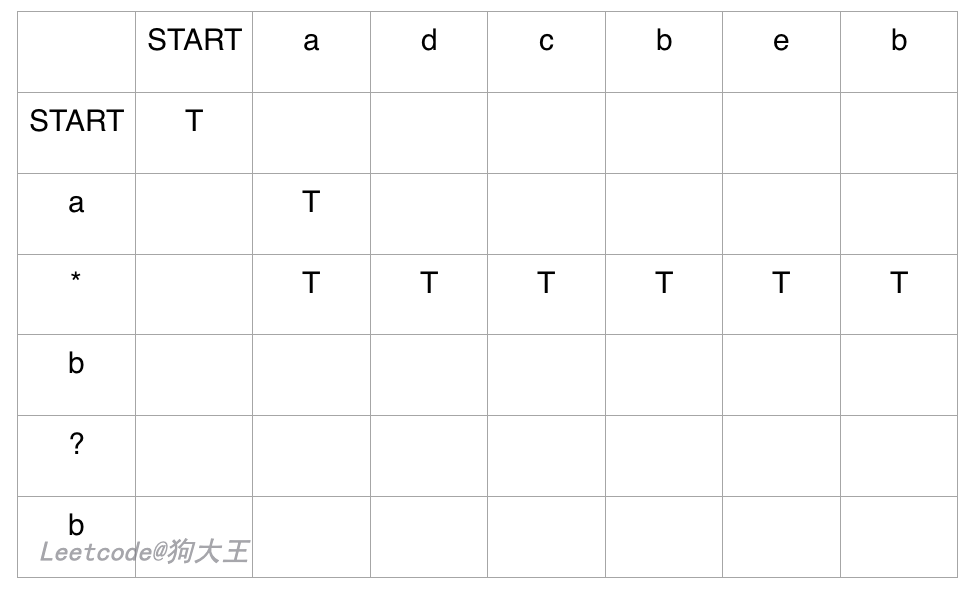
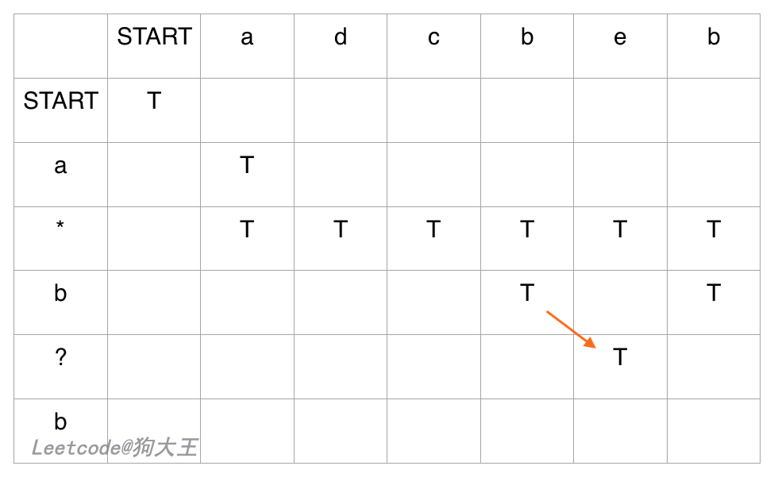

# 动态规划

[toc]

## 动态规划基本盘

**做算法题的技巧就是，把大的问题细化到一个点，先研究在这个小点上如何解决问题，然后再通过递归或迭代的方式扩展到整个问题。**

比如之前在做二叉树的问题，我们就会把整个问题细化到某一个节点上，想象自己站在某个节点上，需要做什么，然后套二叉树递归框架就行了。

### 动态规划的基础知识

动态规划，英文：Dynamic Programming，简称 DP，如果某一问题有很多==重叠子问题==，使用动态规划是最有效的。事实上，一个问题能否用动态规划解决，并不仅仅是因为它可以被拆解为很多小问题，而在于这些小问题会不会被重复调用。

[举个例子，有 n 个阶梯，一个人每一步只能跨一个台阶或是两个台阶，问这个人一共有多少种走法？](https://www.zhihu.com/question/39948290)

首先对这个问题进行抽象，n 个阶梯，每个阶梯都代表一个位置，就像是图论中的一个点，然后这些 n 个不同位置之间会有一些桥梁把它们连起来：


这个图，就是该问题的抽象表达形式，那么这个问题就转化为了从 Node 0 到 Node 10 有几种不同的路可以走？

==这就是问题的本质。== 这不就是统计学中的==递推公式==嘛？？

那么如果我在计算出了从 5 到 10 的路径数，这个路径数是不是可以保存下来？

为什么要保存？因为这个信息一会儿还要被再次用到！

因为不管我是从 3 走过来的，还是 4 走过来的，走到 5 之后，存在的路径就是第一次计算出的结果，你无需重复计算。

如果暴力遍历的话，从 3 到 10 之后，你肯定会把 5-10 的可能路径都算一遍，然后从 4 到 10 的时候，你又会把 5-10 的路径算一遍，也就是重复计算了，那么既然这样，我们创建一个数组 `a[]`，专门来存放位点 x 到 10 的所有可能路径数，初始值记为 0，然后每当要计算 x 到 10 的路径数时，先检测一下该路径数的值是不是大于 0，如果大于，就说明它之前已经被计算过了，并存在于 `a[x]` 中，那我们马上可以得到一个==递推关系==：`a[x] = a[x+1] + a[x+2]` (因为 x 可以一步到 x+1，也可以一步到 x+2 )

`a[6] = a[7] + a[8];`

`a[7] = a[8] + a[9];`

我们发现，在计算 `a[6]` 和 `a[7]` 的时候，我们都用了 `a[8]`，也就是重复利用了结果！==这就是动态规划！==

---

所以动态规划中**每一个状态一定是由上一个状态推导出来的**，这一点就区分与贪心，贪心没有状态推导，而是从局部直接选最优的。

例如：有 $N$ 件物品和一个最多能背重量为 $W$ 的背包。第 i 件物品的重量是 `weight [i]`，得到的价值是 `value [i]` 。**每件物品只能用一次**，求解将哪些物品装入背包里物品价值总和最大。

动态规划中 `dp [j]` 是由 `dp [j-weight [i]]` 推导出来的，然后取 `max (dp [j], dp [j - weight [i]] + value [i])`。

但如果是贪心呢，每次拿物品选一个最大的或者最小的就完事了，和上一个状态没有关系。

所以贪心解决不了动态规划的问题。

==动态规划的解题步骤：==

- 确定 `dp` 数组以及下表的含义
- 确定递推公式
- `dp` 数组如何初始化
- 确定遍历顺序
- 举例推导 `dp` 数组


### 动态规划的核心问题

虽然动态规划的核心思想是穷举求最值，但是问题可以千变万化，穷尽所有可行解其实并不是一件容易的事情，需要你熟练掌握递归思维，只有列出**正确的状态转移方程**，才能正确地穷举，而且，你需要判断算法问题是否具备**最优子结构**，是否能够通过子问题的最值得到原问题的最值，另外，动态规划问题存在**重叠子问题**，如果暴力穷举的话效率会很低，所以需要你使用备忘录或者 dp table 来优化穷举过程，避免不必要的计算。

在实际的算法问题中，写出状态转移方程是最困难的，这也就是为什么很多朋友觉得动态规划问题困难的原因，我来提供我总结的一个思维框架，辅助你思考状态转移方程：

==明确 base case $\to$ 明确状态 $\to$ 明确选择 $\to$ 定义 `dp` 数组的含义==：

```python
# 自顶向下递归的动态规划
def dp(状态1, 状态2, ...):
    for 选择 in 所有可能的选择:
        # 此时的状态已经因为做了选择而改变
        result = 求最值(result, dp(状态1, 状态2, ...))
    return result

# 自底向上迭代的动态规划
# 初始化 base case
dp[0][0][...] = base case
# 进行状态转移
for 状态1 in 状态1的所有取值：
    for 状态2 in 状态2的所有取值：
        for ...
            dp[状态1][状态2][...] = 求最值(选择1，选择2...)
```

#### 什么是最优子结构？

我先举个很容易理解的例子：假设你们学校有 10 个班，你已经计算出了每个班的最高考试成绩。那么现在我要求你计算全校最高的成绩，你会不会算？当然会，而且你不用重新遍历全校学生的分数进行比较，而是只要在这 10 个最高成绩中取最大的就是全校的最高成绩。

我给你提出的这个问题就**符合最优子结构**：可以从子问题的最优结果推出更大规模问题的最优结果。让你算每个班的最优成绩就是子问题，你知道所有子问题的答案后，就可以借此推出**全校**学生的最优成绩这个规模更大的问题的答案。你看，这么简单的问题都有最优子结构性质，只是因为显然**没有重叠子问题**，所以我们简单地求最值肯定用不出动态规划。

再举个栗子：假设你们学校有 10 个班，你已知每个班的最大分数差（最高分和最低分的差值）。那么现在我让你计算全校学生中的最大分数差，你会不会算？可以想办法算，但是肯定不能通过已知的这 10 个班的最大分数差推到出来。因为这 10 个班的最大分数差不一定就包含全校学生的最大分数差，比如全校的最大分数差可能是 3 班的最高分和 6 班的最低分之差。

这次我给你提出的问题就**不符合最优子结构**，因为你没办法通过每个班的最优值推出全校的最优值，没办法通过子问题的最优值推出规模更大的问题的最优值。前文 [动态规划详解](https://labuladong.github.io/algo/3/23/66/) 说过，想满足最优子结构，子问题之间必须**互相独立**。全校的最大分数差可能出现在两个班之间，显然子问题不独立，所以这个问题本身不符合最优子结构。

那么遇到这种最优子结构失效情况，怎么办？策略是：**改造问题**。

改造问题，也就是把问题等价转化：大分数差，不就等价于最高分数和最低分数的差么，那不就是要求最高和最低分数么，不就是我们讨论的第一个问题么，不就具有最优子结构了么？那现在改变思路，借助最优子结构解决最值问题，再回过头解决最大分数差问题，是不是就高效多了？

我们做动态规划问题，是不是一直在求各种最值，本质跟我们举的例子没啥区别，无非需要处理一下重叠子问题。

前文不 [同定义不同解法](https://labuladong.github.io/algo/3/26/92/) 和 [高楼扔鸡蛋问题](https://labuladong.github.io/algo/3/26/89/) 就展示了如何改造问题，不同的最优子结构，可能导致不同的解法和效率。

最优子结构并不是动态规划独有的一种性质，能求最值得问题大部分都具有这个性质；**但反过来，最优子结构性质作为动态规划问题的必要条件，一定是让你求最值的**。

找最优子结构的过程，其实就是证明状态转移方程正确性的过程，方程符合最优子结构就可以写暴力解了，写出暴力解就可以看出有没有重叠子问题了，有则优化，无则 OK。这也是套路，经常刷题的读者应该能体会。

#### 如何一眼看出重叠子问题

**首先，最简单粗暴的方式就是画图，把递归树画出来，看看有没有重复的节点**。

比如最简单的例子， [动态规划核心套路](https://labuladong.github.io/algo/3/23/66/) 中斐波那契数列的递归树：


这棵递归树很明显存在重复的节点，所以我们可以通过备忘录避免冗余计算。

#### `dp` 数组的大小设置：`n` or `n+1`

**理论上，你怎么定义都可以，只要根据定义处理好 base case 就可以**。

对 `dp` 数组而言，你当然可以定义 `dp[i][j]` 存储 `s1[:i]` 和  `s2[:j]` 的编辑距离，但问题是 base case 怎么搞（空串）？索引怎么能是 -1 呢？

所以我们把 `dp` 数组初始化为 `dp[m+1][n+1]`，让索引整体偏移一位，把索引 0 留出来作为 base case 表示空串。

#### `dp` 数组的遍历方向

1. **遍历的过程中，所需的状态必须是已经计算出来的。**
2. **遍历结束后，存储结果的那个位置必须已经被计算出来。**


### 动态规划和贪心算法的区别

==共同点==：两者都具有最优子结构性质

==不同点==：在动态规划算法中，每步所做出的选择往往依赖于相关子问题的解，因而只有在解出相关子问题时才能做出选择；而贪心算法，仅在当前状态下做出最好选择，即局部最优选择，然后再去解做出这个选择后产生的相应子问题

另外，动态规划算法通常以==自顶向上==的方式解各子问题，而贪心算法通常==自顶向下==的方式进行。

### 斐波那契数

> **斐波那契数** （通常用 `F(n)` 表示）形成的序列称为 **斐波那契数列** 。该数列由 `0` 和 `1` 开始，后面的每一项数字都是前面两项数字的和。也就是：
>
> ```
> F(0) = 0，F(1) = 1
> F(n) = F(n - 1) + F(n - 2)，其中 n > 1
> ```
>
> 给定 n，计算 F(n)：
>
> ```
> 输入：n = 2
> 输出：1
> 解释：F(2) = F(1) + F(0) = 1 + 0 = 1
> ```

动态规划的经典例子：斐波那契数

==动规五部曲==：

1. 确定 dp 数组以及下标的含义：我们要用一个一维 dp 数组来保存递归的结果

> `dp[i]` 的定义为：第 i 个数的斐波那契数值是 `dp[i]`

2. 确定递推公式：本题递推公式已经直接给出，**状态转移方程 `dp [i] = dp [i - 1] + dp [i - 2]`;**
3. `dp` 数组如何初始化：本题也直接给出了初始方式
4. 确定遍历顺序：从递归公式 `dp [i] = dp [i - 1] + dp [i - 2]`中可以看出，`dp[i]` 是依赖 `dp [i - 1]` 和 `dp [i - 2]`，那么遍历顺序一定是从前到后遍历的
5. 举例推导 `dp` 数组：当 N 为 10 的时候，`dp` 数组应该是如下的数列：0 1 1 2 3 5 8 13 21 34 55

> 如果代码写出来，发现结果不对，就把 dp 数组打印出来看看和我们推导的数列是否一致。

```python
class Solution:
    def fib(self, n: int) -> int:
        if n < 2:
            return n
        a, b, c = 0, 1, 0
        for i in range(1, n):
            c = a + b
            a, b = b, c
        return c

# 递归实现
class Solution:
    def fib(self, n: int) -> int:
        if n < 2:
            return n
        return self.fib(n - 1) + self.fib(n - 2)
```

### 爬楼梯

> 假设你正在爬楼梯。需要 n 阶你才能到达楼顶。
>
> 每次你可以爬 1 或 2 个台阶。你有多少种不同的方法可以爬到楼顶呢？

1. ==确定 dp 数组以及下标的含义==：`dp[i]`：爬到第 i 层楼梯，有 `dp[i]` 种方法

2. ==确定递推公式==：这个例子在“动态规划的基础知识”中介绍过了（反向），递推公式就是：`dp[i] = dp[i - 1] + dp[i - 2]`

3. ==dp 数组如何初始化==，回顾一下数组的定义，爬到第 $i$ 层楼梯，有 `dp[i]` 种方法，那么 i 为 0，`dp[i]` 应该是多少呢？

> 需要注意的是：题目中说了 n 是一个正整数，题目根本就没说 n 有为 0 的情况，所以本题根本就不应该讨论 dp[0] 的初始化。

4. ==确定遍历顺序==：从递推公式可以看出遍历顺序一定是从前向后遍历的
5. ==举例推导 dp 数组==


> 此时应该发现，这就是斐波那契数列！

```python
class Solution:
    def climbStairs(self, n: int) -> int:
        # dp[i] 数组存储爬到第 i 层楼梯时有 dp[i] 种方法
        if n <= 1:
            return n
        dp = [0] * (n+1)
        dp[1] = 1
        dp[2] = 2
        for i in range(3,n+1):
            dp[i] = dp[i-1] + dp[i-2]
        return dp[-1]
```

### 使用最小花费爬楼梯

> 给你一个整数数组 cost ，其中 cost[i] 是从楼梯第 i 个台阶向上爬需要支付的费用。一旦你支付此费用，即可选择向上爬一个或者两个台阶。
>
> 你可以选择从下标为 0 或下标为 1 的台阶开始爬楼梯。
>
> 请你计算并返回达到楼梯顶部的最低花费。
>
> 输入：cost = [10,15,20]
> 输出：15
> 解释：你将从下标为 1 的台阶开始。


```python
class Solution:
    def minCostClimbingStairs(self, cost):
        # dp[i] 代表走到第 i 个台阶的最小花费
        dp = [0] * (len(cost)+1)
        dp[0] = 0
        dp[1] = 0
        for i in range(2,len(cost)+1):
            dp[i] = min(dp[i-1]+cost[i-1], dp[i-2]+cost[i-2])
        return dp[-1]
```

### 不同路径

> 一个机器人位于一个 m x n 网格的左上角 （起始点在下图中标记为 “Start” ）。
>
> 机器人每次只能向下或者向右移动一步。机器人试图达到网格的右下角（在下图中标记为 “Finish” ）。
>
> 问总共有多少条不同的路径？
>
> 
>
> ```
> 输入：m = 3, n = 7
> 输出：28
> ```

#### 动态规划

dp 数组里存储节点到终点的总路径：初始化 + 递推公式就搞定了！

```python
import numpy as np
class Solution:
    def uniquePaths(self, m: int, n: int) -> int:
        # 初始化二维数组
        dp = np.zeros([m, n])
        dp[m-2, n-1] = 1
        for j in range(n):
            dp[m-1, j] = 1
        for i in range(m):
            dp[i, n-1] = 1
        for i in range(m-2, -1, -1):
            for j in range(n-2, -1, -1):
                dp[i, j] = dp[i+1, j] + dp[i, j+1]
        return int(dp[0, 0])

```

#### 数论

在这个图中，可以看出一共 m，n 的话，无论怎么走，走到终点都需要 m + n - 2 （m - 1 + n - 1）步。


在这 m + n - 2 步中，一定有 m - 1 步是要向下走的，不用管什么时候向下走。那么有几种走法呢？可以转化为，给你 m + n - 2 个不同的数，随便取 m - 1 个数，有几种取法。这其实是一个组合问题了：$C_{m+n-2}^{m-1}$，求组合的时候，要防止==两个 int 相乘溢出==，所以不能把算式的分子都算出来，分母都算出来再做除法，而是应该在计算分子的时候，不断除以分母。

#### 深搜

这一题也可以使用图论里的深搜，来枚举有多少种路径。

注意题目中说机器人每次只能向下或者向右移动一步，那么其实**机器人走过的路径可以抽象为一颗二叉树，而叶子节点就是终点！**


此时问题就可以转化为求二叉树叶子节点的个数。但是写出来会发现代码超时，我们分析一下时间复杂度，这个深搜的算法，其实是要遍历整个二叉树，这棵树的深度就是 $m+n-1$（深度按从 1 开始算），那二叉树的节点个数就是 $2^{m+n-1} -1$，可以理解深搜的算法就是遍历了整个二叉树，其实没有遍历整个二叉树，只是近似而已，所以上面深搜代码的时间复杂度为 $O(2^{m+n-1} -1)$，可以看出这指数级别的复杂度是非常大的。

### 不同路径 II：障碍

> 一个机器人位于一个 m x n 网格的左上角 （起始点在下图中标记为 “Start” ）。
>
> 机器人每次只能向下或者向右移动一步。机器人试图达到网格的右下角（在下图中标记为 “Finish”）。
>
> 现在考虑网格中有障碍物。那么从左上角到右下角将会有多少条不同的路径？
>
> 网格中的障碍物和空位置分别用 1 和 0 来表示。
>
> 
>
> 输入：obstacleGrid = [[0,0,0],[0,1,0],[0,0,0]]
> 输出：2
> 解释：3x3 网格的正中间有一个障碍物。从左上角到右下角一共有 2 条不同的路径：
>
> 1. 向右 -> 向右 -> 向下 -> 向下
> 2. 向下 -> 向下 -> 向右 -> 向右

==主要思路就是==：初始化.

1. 如果障碍物出现在终点，直接返回 0，永远也走不到
2. 如果障碍物在最右边或者最下边，该位置以上（包括该位置）或该位置以左（包括该位置）全部设置为 0
3. 如果障碍物出现在中间，将该位置的 dp 值设置为 0


自己独立思考完成！很棒！虽然提交了 4 次才成功，只是一些边界条件和初始化没有好好审查。

```python
import numpy as np
class Solution:
    def uniquePathsWithObstacles(self, obstacleGrid):
        # 初始化二维数组
        obstacleGrid = np.array(obstacleGrid)
        m,n = obstacleGrid.shape
        dp = np.zeros([m, n])
        # 如果障碍出现在终点
        if obstacleGrid[m-1, n-1] == 1:
            return 0
        for j in range(n):
            dp[m-1, j] = 1
            # 如果障碍出现在边沿，边沿上和边沿左的全部为 0
            if obstacleGrid[m-1, j] == 1:
                for k in range(j+1):
                    dp[m-1,k] = 0

        for i in range(m):
            dp[i, n-1] = 1
            if obstacleGrid[i, n-1] == 1:
                for k in range(i+1):
                    dp[k, n-1] = 0

        for i in range(m-2, -1, -1):
            for j in range(n-2, -1, -1):
                # 如果障碍出现在中间
                if obstacleGrid[i,j] == 1:
                    dp[i, j] = 0
                else:
                    dp[i, j] = dp[i+1, j] + dp[i, j+1]
        return int(dp[0, 0])
```

### 最大正方形

> 在一个由 '0' 和 '1' 组成的二维矩阵内，找到只包含 '1' 的最大正方形，并返回其面积。
>
> 
>
> 输入：matrix = [["1","0","1","0","0"],["1","0","1","1","1"],["1","1","1","1","1"],["1","0","0","1","0"]]
> 输出：4

解题的关键是观察出一个全是 1 的正方形有什么特点，如何根据小的正方形推导出大的正方形（状态转移方程）。

当 `matrix[i][j]` 为 1，且它的左边、上边、左上边都存在正方形时，`matrix[i][j]` 才能够作为一个更大的正方形的右下角：


所以我们可以定义一个二维 `dp` 数组：

以 `matrix[i][j]` 为右下角元素的最大的全为 1 正方形矩阵的边长为 `dp[i][j]`。

有了这个定义，状态转移方程就是：

```python
if matrix[i][j] == 1:
    # 类似「水桶效应」，最大边长取决于边长最短的那个正方形
    dp[i][j] = min(dp[i-1][j], dp[i-1][j-1], dp[i][j-1]) + 1
else:
    dp[i][j] = 0
```

最终想要的答案就是最大边长 `max(dp[:][:])` 的平方。

```python
class Solution:
    def maximalSquare(self, matrix: List[List[str]]) -> int:
        # 动态规划
        # dp[i][j] 右下角 最大 边长
        dp = [[0]*len(matrix[0]) for _ in range(len(matrix))]
        res = 0
        for i in range(len(matrix)):
            if matrix[i][0] == '1':
                dp[i][0] = 1
                res = 1
        for j in range(len(matrix[0])):
            if matrix[0][j] == '1':
                dp[0][j] = 1
                res = 1
        for i in range(1, len(matrix)):
            for j in range(1, len(matrix[0])):
                if matrix[i][j] == '1':
                    dp[i][j] = min(dp[i-1][j], dp[i][j-1], dp[i-1][j-1]) + 1
                    res = max(res, dp[i][j])
        
        return res**2
```


### 整数拆分

> 给定一个正整数 n，将其拆分为至少两个正整数的和，并使这些整数的乘积最大化。返回你可以获得的最大乘积。
>
> 示例 1: 输入: 2
> 输出: 1
> 解释: 2 = 1 + 1, 1 × 1 = 1。

==动规五部曲==：卡在递推公式那里没有想出来

1. 确定 dp 数组以及下标的含义：
   - dp[i]：分拆数字 i，可以得到最大乘积 dp[i]  
2. ==确定递推公式==：想一想 dp[i] 最大乘积是怎么得到的？其实可以从 1 遍历 j，然后有两种渠道得到 dp[i]
   - 一种是 $j\times(i-j)$  直接相乘
   - 一种是 $j\times dp[(i-j)]$，相当于是拆分 $(i-j)$
   - 从 1 开始遍历 $j$，比较 $j\times(i-j)$ 和 $j\times dp[(i-j)]$ 取最大的：$d p[i]=\max \left(d p[i], \max \left((i-j) \times j, d p[i-j] \times j\right)\right)$ ，==这一步真的不太好想==
3. dp 数组的初始化：dp[2] = 1
4. 确定遍历顺序：从递推公式来看，先有 `dp[i - j]`，后有 `dp[i]`，所以遍历 i 一定是从前往后的顺序，i 从 3 开始

```python
class Solution:
    def integerBreak(self, n: int) -> int:
        dp = [0]*(n+1)
        dp[2] = 1
        for i in range(3, n+1):
            for j in range(i):
                dp[i] = max(dp[i],max((i-j)*j,(dp[i-j]*j)))
        return dp[n]
```

### 不同的二叉搜索树

> 给你一个整数 `n` ，求恰由 `n` 个节点组成且节点值从 `1` 到 `n` 互不相同的 **二叉搜索树** 有多少种？返回满足题意的二叉搜索树的种数。
>
> 
>
> ```
> 输入：n = 3
> 输出：5
> ```

给我 n 个节点，我能知道可以组成多少个不同的二叉搜索树！

可以从 1 开始尝试找规律：


来看 n 为 3 时有哪几种情况：

1. 当 1 为头节点时，其右子树有两个节点，看这两个节点的布局，是不是和 n 为 2 时两棵树的布局是一样的！
2. 当 3 为头节点时，其左子树有两个节点，看这两个节点的布局，是不是和 n 为 2 的时候两棵树的布局也是一样的啊！
3. 当 2 为头节点时，其左右子树都只有一个节点，布局是不是和 n 为 1 的时候只有一棵树的布局也是一样的啊！

发现到这里，其实我们就找到重叠子问题了，其实也就是发现可以通过 dp[1] 和 dp[2] 来推导出 dp[3] 的某种方式。

- dp [3]，就是 元素 1 为头结点搜索树的数量 + 元素 2 为头结点搜索树的数量 + 元素 3 为头结点搜索树的数量
- 元素 1 为头结点搜索树的数量 = 右子树有 2 个元素的搜索树数量 * 左子树有 0 个元素的搜索树数量
- 元素 2 为头结点搜索树的数量 = 右子树有 1 个元素的搜索树数量 * 左子树有 1 个元素的搜索树数量
- 元素 3 为头结点搜索树的数量 = 右子树有 0 个元素的搜索树数量 * 左子树有 2 个元素的搜索树数量
- 有 2 个元素的搜索树数量就是 dp [2]
- 有 1 个元素的搜索树数量就是 dp [1]
- 有 0 个元素的搜索树数量就是 dp [0]
- dp [3] = dp [2] * dp [0] + dp [1] * dp [1] + dp [0] * dp [2]


==动规五部曲==：

1. 确定 dp 数组：**dp [i] 表示 1 到 i 为节点组成的二叉搜索树的个数为 dp [i]**。
2. 确定递推公式：`p [i] += dp [以 j 为头结点左子树节点数量] * dp [以 j 为头结点右子树节点数量]` ，j 相当于是头结点的元素，从 1 遍历到 i 为止。所以递推公式：`dp [i] += dp [j - 1] * dp [i - j]`
3. dp 数组如何初始化：`dp[0] = 1`，从定义上讲，空节点也是一棵二叉树
4. 确定遍历顺序：从递归公式可以看出，节点数为 i 的状态是依靠 i 之前节点数的状态。那么遍历 i 里面每一个数作为头结点的状态，用 j 来遍历。
5. 举例推导 dp 数组：


```python
class Solution:
    def numTrees(self, n: int) -> int:
        dp = [0] * (n + 1)
        dp[0], dp[1] = 1, 1
        for i in range(2, n + 1):
            # 1 到 i 分别做根节点时，不同左子树的个数乘以不同右子树的个数
            for j in range(1, i + 1):
                dp[i] += dp[j - 1] * dp[i - j]
        return dp[-1]
```

思路很复杂但是代码很简单。

---


### 最长递增子序列

> 给你一个整数数组 nums ，找到其中最长严格递增子序列的长度。
>
> 子序列 是由数组派生而来的序列，删除（或不删除）数组中的元素而不改变其余元素的顺序。例如，[3,6,2,7] 是数组 [0,3,1,6,2,2,7] 的子序列。
>
> ```
> 输入：nums = [10,9,2,5,3,7,101,18]
> 输出：4
> 解释：最长递增子序列是 [2,3,7,101]，因此长度为 4 。
> ```

最长上升子序列是动规的经典题目，这里的 dp [i] 是可以根据 dp [j] （j < i）推导出来的：

1. `dp[i]` 的定义：`dp[i]` 表示**以 `nums[i]` 这个数结尾的最长递增子序列的长度**。
2. 状态转移方程：位置 i 的最长升序子序列等于 j 从 0 到 i-1 各个位置的最长升序子序列 + 1 的最大值。

$$
\text {if (nums [i] > nums [j]) dp [i] = max (dp [i], dp [j] + 1); }
$$

> 注意这里不是要比较 **dp[i] 与 dp[j] + 1**，而是要取两者的最大值。

3. `dp[i]` 的初始化：每一个 i，对应的 `dp[i]`（即最长上升子序列）起始大小至少都是是 1，因为要包含它自己
4. 确定遍历顺序：`dp[i]` 是有 0 到 i-1 各个位置的最长升序子序列推导而来，那么遍历 i 一定是从前向后遍历
5. 根据这个定义，我们的最终结果（子序列的最大长度）应该是 `dp` 数组中的**最大值**

```python
class Solution:
    def lengthOfLIS(self, nums: List[int]) -> int:
        # 初始化
        dp = [1 for i in range(len(nums))]
        for i in range(1, len(nums)):
            for j in range(i):
                if nums[i] > nums[j]:
                    dp[i] = max(dp[i], dp[j] + 1)
 
        return max(dp)
```

> 注意，如果无法推导出递推公式，很可能就是 `dp` 数组的定义不够恰当，需要重新定义 `dp` 数组的含义；或者可能是 `dp` 数组存储的信息还不够，不足以推出下一步的答案，需要把 `dp` 数组扩大成二维数组甚至三维数组。


### 俄罗斯套娃信封问题

> 给你一个二维整数数组 envelopes，其中 envelopes[i] = [wi, hi] ，表示第 i 个信封的宽度和高度。
>
> 当另一个信封的宽度和高度都比这个信封大的时候，这个信封就可以放进另一个信封里，如同俄罗斯套娃一样。
>
> 请计算最多能有多少个信封能组成一组 “俄罗斯套娃” 信封（即可以把一个信封放到另一个信封里面）。
>
> 注意：不允许旋转信封。
>
> 输入：envelopes = [[5,4],[6,4],[6,7],[2,3]]
> 输出：3
> 解释：最多信封的个数为 3, 组合为: [2,3] => [5,4] => [6,7]。

这道题目其实是最长递增子序列的一个变种，因为每次合法的嵌套是大的套小的，**相当于在二维平面中找一个最长递增的子序列**，其长度就是最多能嵌套的信封个数。

这道题的解法比较巧妙：

**先对宽度 `w` 进行升序排序，如果遇到 `w` 相同的情况，则按照高度 `h` 降序排序；之后把所有的 `h` 作为一个数组，在这个数组上计算最长递增子序列的长度就是答案。**

为什么呢？

1. 首先，对宽度 `w` 从小到大排序，确保了 `w` 这个维度可以互相嵌套，所以我们只需要专注高度 `h` 这个维度能够互相嵌套就好；
2. 其次，两个 `w` 相同的信封不能互相包含，所以对于宽度 `w` 相同的信封，对高度 `h` 进行降序排序，保证 LIS 中不存在多个 `w` 的信封。

```python
class Solution:
    def maxEnvelopes(self, envelopes: List[List[int]]) -> int:
        # 先对宽度进行排序，宽度相同，对高度进行降序排序
        envelopes.sort(key=lambda x: (x[0], -x[1]))
        height = [x[1] for x in envelopes]
        res = self.lengthOfLIS(height)
        return res

    
    def lengthOfLIS(self, nums: List[int]) -> int:
        # 初始化
        dp = [1 for i in range(len(nums))]
        for i in range(1, len(nums)):
            for j in range(i):
                if nums[i] > nums[j]:
                    dp[i] = max(dp[i], dp[j] + 1)
        return max(dp)
```

> 上面的代码只能通过 85/87，超时，太卷了，动规都卷不动了。

### 最长连续递增序列

> 给定一个未经排序的整数数组，找到最长且连续递增的子序列，并返回该序列的长度。
>
> 连续递增的子序列 可以由两个下标 l 和 r（l < r）确定，如果对于每个 l <= i < r，都有 nums[i] < nums[i + 1] ，那么子序列 [nums[l], nums[l + 1], ..., nums[r - 1], nums[r]] 就是连续递增子序列。
>
> ```
> 输入：nums = [1,3,5,4,7]
> 输出：3
> 解释：最长连续递增序列是 [1,3,5], 长度为 3
> ```

 ```python
class Solution:
    def findLengthOfLCIS(self, nums: List[int]) -> int:
        # 初始化
        dp = [1 for i in range(len(nums))]
        for i in range(1, len(nums)):
            if nums[i] > nums[i-1]:
                dp[i] = dp[i-1] + 1
 
        return max(dp)
 ```

注意这一题的递推公式和上一题的区别：`dp[i] = dp[i-1] + 1`，要体现连续，只能和前一个比大小。

### 最长连续序列

> 给定一个未排序的整数数组 nums ，找出数字连续的最长序列（不要求序列元素在原数组中连续）的长度。
>
> 请你设计并实现时间复杂度为 O(n) 的算法解决此问题。
>
> ```
> 输入：nums = [100,4,200,1,3,2]
> 输出：4
> 解释：最长数字连续序列是 [1, 2, 3, 4]。它的长度为 4。
> ```

**解题思路**：题目要求 $O(n)$ 复杂度。

**定义**：用哈希表存储每个**边界值**对应连续区间的长度。

> 举个栗子：当 Map 的 key 为 5，value 为 3 时，这就表明当前有一个包含 5 且长度为 3 的连续区间。当然有多种可能，可以是 [3, 5], [4, 6], [5, 7]。

**具体做法**：

- 遍历 `nums` 数组中的所有数字 `num`
- 若数已在哈希表中：跳过不做处理
- 若是新数 `num` 加入：
  - 取出其左右相邻数 `num-1` 和 `num+1` 的连续区间长度 `left` 和 `right`
  - 计算当前数的区间长度为：`cur_length = left + right + 1`
  - 根据 `cur_length` 更新最大区间长度 `max_length` 的值
  - 更新区间左右边界的长度值

```python
class Solution:
    def longestConsecutive(self, nums: List[int]) -> int:
        res = 0
        hash_dict = dict()
        for num in nums:
            # 新进来哈希表一个数
            if num not in hash_dict:
                # 获取当前数的最左边连续长度,没有的话就更新为0
                left = hash_dict.get(num - 1, 0)
                # 同理获取右边的数
                right = hash_dict.get(num + 1, 0)
                # 把当前数加入哈希表，代表当前数字出现过，其对应的值可以是任意值
                hash_dict[num] = 1
                # 更新长度
                length = left + 1 + right
                res = max(res, length)
                # 更新最左端点的值，如果 left=n 存在，那么证明当前数的前n个都存在哈希表中
                hash_dict[num - left] = length
                # 更新最右端点的值，如果 right=n 存在，那么证明当前数的后n个都存在哈希表中
                hash_dict[num + right] = length
                # 此时 [num-left，num-right] 范围的值都连续存在哈希表中了
                # 即使 left 或者 right=0 都不影响结果
        return res

```

为什么 `map` 中的 `value` 能够时而表示左区间的长度，时而表示右区间的长度呢？

关键在于判断条件上：`if num not in hash_dict:`，这代表 `num` 之前并没有出现过，那么对于 `key=num-1` 来说，它的 `value` 表示的区间就只能是 `[num-value,num-1]`，`num-1` 只能是该区间的左边界值，因为其他可能的连续区间都会包含 `num`，不符合上述条件，同理，对于 `key=num+1` 来说，它的 `value` 表示的区间就只能是 `[num+1,num+value]`，`num+1` 只能是该区间的右边界值。

当 `num` 出现，这两个区间就可以被联通表示为 `[num-value1,num+value2]`，当前连续区间的左右边界会发生变化，为 `num-value1` 和 `num+value2`，因此我们需要更新这两个边界点对应的区间长度。

这种思路是非常巧妙的，如果之前没见过很难想出来。


### 最长重复子数组：二维数组

> 给两个整数数组 `nums1` 和 `nums2` ，返回两个数组中**公共的** 、长度最长的子数组的长度。
>
> ```
> 输入：nums1 = [1,2,3,2,1], nums2 = [3,2,1,4,7]
> 输出：3
> 解释：长度最长的公共子数组是 [3,2,1] 。
> ```

注意题目中说的子数组，其实就是连续子序列，这种问题动规最拿手，注意是==二维数组==：

1. ==确定 `dp` 数组以及下标的含义==：`dp [i][j]` ：以下标 `i - 1` 为**结尾**的 A，和以下标 `j - 1` 为**结尾**的 B，最长重复子数组长度为 `dp [i][j]`。注意 i 和 j 的遍历都要从 1 开始。那有同学问了，我就定义 `dp[i][j]` 为 以下标 `i` 为结尾的 A，和以下标 `j` 为结尾的 B，最长重复子数组长度。不行么？是啊，为什么不行？

> 为什么不行？2022.7.24 自己尝试写了一遍，找到了这个问题的答案。
>
> 如果定义 `dp[i][j]` 为 以下标 `i` 为结尾的 A，和以下标 `j` 为结尾的 B， 最长重复子数组的长度，A 和 B 为空的时候怎么办？dp 数组里哪一个位置可以表示这种情况？`dp[0][0]` 表示的也是含有一个数字的 A 和 B。包括后面题目中对空串的表示，也需要考虑平移一位。

1. ==确定递推公式==：当 `A[i-1]` 和 `B[j-1]` 相等的时候，`dp[i][j] = dp[i - 1][j - 1] + 1`

2. ==dp  数组如何初始化==：根据 `dp [i][j]` 的定义，`dp [i][0]` 和 `dp [0][j]` 其实都是没有意义的！但是它们都需要初始化，因为为了方便递推公式 `dp[i][j] = dp[i - 1][j - 1] + 1`，所以都初始化为 0。
3. ==确定遍历顺序==：外层 for 循环遍历 A，内层 for 循环遍历 B
4. 同时题目要求长度最长的子数组的长度，所以在遍历的时候顺便把最大值记录下来

```python
class Solution:
    def findLength(self, nums1: List[int], nums2: List[int]) -> int:
        dp = [[0] * (len(nums2)+1) for _ in range(len(nums1)+1)]
        result = 0
        for k in range(1,len(nums1)+1):
            for t in range(1,len(nums2)+1):
                if nums1[k-1] == nums2[t-1]:
                    dp[k][t] = dp[k-1][t-1] + 1
                result = max(result, dp[k][t])
        return result
```

### 最长公共子序列

> 给定两个字符串 text1 和 text2，返回这两个字符串的最长 公共子序列的长度。如果不存在公共子序列 ，返回 0 。一个字符串的 子序列是指这样一个新的字符串：它是由原字符串在不改变字符的相对顺序的情况下删除某些字符（也可以不删除任何字符）后组成的新字符串。
>
> 例如，"ace" 是 "abcde" 的子序列，但 "aec" 不是 "abcde" 的子序列。
> 两个字符串的公共子序列是这两个字符串所共同拥有的子序列。
>
> ```
> 输入：text1 = "abcde", text2 = "ace" 
> 输出：3  
> 解释：最长公共子序列是 "ace" ，它的长度为 3 。
> ```

本题和“最长重复子数组”的区别在于这里==不要求是连续==的了，但是要有==相对顺序==，即："ace" 是 "abcde" 的子序列，但 "aec" 不是 "abcde" 的子序列。

1. ==确定 dp 数组以及下标的含义==：`dp[i][j]`表示长度为 `[0, i - 1]` 的字符串 `text1` 与长度为 `[0, j - 1]` 的字符串 `text2` 的最长公共子序列。
2. ==确定递推公式==：
   -  `text1[i - 1]` 与 `text2[j - 1]` 相同：如果相同，则找到了一个公共元素，有 `dp[i][j] = dp[i - 1][j - 1] + 1`
   -  `text1[i - 1]` 与 `text2[j - 1]` 不相同：如果不相同，那就看 `text1[0, i - 2]` 与 `text2[0, j - 1]` 的最长公共子序列 和 `text1[0, i - 1]` 与 `text2[0, j - 2]` 的最长公共子序列，取最大的。即：`dp[i][j] = max(dp[i - 1][j], dp[i][j - 1])`，多加了一位元素，公共子序列不会更小了，所以两者取最大值。

3. ==dp 数组如何初始化==？`test1[0, i-1]` 和空串的最长公共子序列自然是 0，所以 `dp[i][0]` = 0；同理 `dp[0][j]` 也是 0。
4. ==确定遍历顺序==：从递推公式可以看到有三个方向可以推出 `dp[i][j]`，那么为了在递推的过程中，这三个方向都是记过计算的数值，所以要从前向后，从上到下来遍历这个矩阵。


```python
class Solution:
    def longestCommonSubsequence(self, text1: str, text2: str) -> int:
        dp = [[0]*(len(text1)+1) for _ in range(len(text2)+1)]
        for i in range(1,len(text1)+1):
            for j in range(1,len(text2)+1):
                if text1[i-1] == text2[j-1]:
                    dp[j][i] = dp[j-1][i-1] + 1
                else:
                    dp[j][i] = max(dp[j-1][i], dp[j][i-1])
        return dp[-1][-1]
```


### 不相交的线

> 在两条独立的水平线上按给定的顺序写下 nums1 和 nums2 中的整数。
>
> 现在，可以绘制一些连接两个数字 nums1[i] 和 nums2[j] 的直线，这些直线需要同时满足满足：
>
> 1. nums1[i] == nums2[j]
> 2. 且绘制的直线不与任何其他连线（非水平线）相交。
>
> 请注意，连线即使在端点也不能相交：每个数字只能属于一条连线。
>
> 以这种方法绘制线条，并返回可以绘制的最大连线数。
>
> 
>
> 输入：nums1 = [1,4,2], nums2 = [1,2,4]
> 输出：2
> 解释：可以画出两条不交叉的线，如上图所示。 
> 但无法画出第三条不相交的直线，因为从 nums1[1]=4 到 nums2[2]=4 的直线将与从 nums1[2]=2 到 nums2[1]=2 的直线相交。

本题说是求绘制的最大连线数，其实就是求两个字符串的最长公共子序列的长度。

### 最大子序和

> 给你一个整数数组 `nums` ，请你找出一个具有最大和的连续子数组（子数组最少包含一个元素），返回其最大和。
>
> **子数组**是数组中的一个连续部分。
>
> ```
> 输入：nums = [-2,1,-3,4,-1,2,1,-5,4]
> 输出：6
> 解释：连续子数组 [4,-1,2,1] 的和最大，为 6 。
> ```

可以用==贪心算法==，也可以用==动态规划==。

1. ==确定 dp 数组以及下标的含义==：**dp[i] 包括==下标 i== 之前的最大连续子数组和为 dp [i]**。
2. ==确定递推公式==：dp[i] 有两个方向可以推导出来：

  - dp[i - 1] + nums[i]，即：nums[i] 加入当前连续子序列和
  - nums[i]，即：**从头开始**计算当前连续子数组和
  - 一定要取最大的，所以 dp[i] = max(dp[i - 1] + nums[i], nums[i]) （选择从自己开始还是带着前面的开始，反正都要有自己参与，不然怎么体现连续？）

3. ==dp 数组如何初始化==？dp[0] = nums[0]
4. ==确定遍历顺序==：从前向后遍历

这里注意最后的结果，不是取 dp 数组最后的值，我们要找最大的连续子序列，就应该找每一个 i 为终点的连续最大子序列，要选 dp 数组中值最大的那一个，永远扣住 dp 数组的定义！！！

```python
class Solution:
    def maxSubArray(self, nums: List[int]) -> int:
        dp = [0]*len(nums)
        dp[0] = nums[0]
        for i in range(1, len(nums)):
            dp[i] = max(nums[i], dp[i-1]+nums[i])
        return max(dp)
```


### 判断子序列

> 给定字符串 s 和 t ，判断 s 是否为 t 的子序列。
>
> 字符串的一个子序列是原始字符串删除一些（也可以不删除）字符而不改变剩余字符相对位置形成的新字符串。（例如，"ace" 是 "abcde" 的一个子序列，而 "aec" 不是）。
>
> ```
> 输入：s = "abc", t = "ahbgdc"
> 输出：true
> ```

这道题目是编辑距离的入门题目，因为从题意中我们也可以发现，只需要计算删除的情况，不用考虑增加和替换的情况。

所以掌握本题也是对后面要讲解的编辑距离的题目打下基础。

1. ==确定 dp 数组以及下标的含义==：`dp[i][j]`表示以下标 i-1 为结尾的字符串 s，和以下标 j-1 为结尾的字符串 t，相同子序列的长度，注意这里是判断 s 是否为 t 的子序列，即 t 的长度是大于等于 s 的
2. ==确定递推公式==：在确定递推公式时，首先要考虑如下两种操作：

  - `if (s[i - 1] == t[j - 1])`：t 中的一个字符在 s 中也出现了，`dp[i][j] = dp[i - 1][j - 1] + 1`
  - `if (s[i - 1] != t[j - 1])`：相当于 t 要删除元素 `t[j-1]`，继续匹配，那么 `dp[i][j]` 的数值就是看 `s[i-1]`和 `t[j-2]` 的比较结果，即 `dp[i][j] = dp[i][j - 1]`

3. ==dp 数组如何初始化==：从递推公式可以看出 `dp [i][j]` 都是依赖于 `dp [i - 1][j - 1]` 和 `dp [i][j - 1]`，所以 `dp [0][0]` 和 `dp [1][0]` 是一定要初始化的。这里大家已经可以发现，在定义 `dp [i][j]` 含义的时候为什么要**表示以下标 i-1 为结尾的字符串 s，和以下标 j-1 为结尾的字符串 t，相同子序列的长度为 `dp [i][j]`**。==因为这样的定义在 dp 二维矩阵中可以留出初始化的区间==，如下图所示：


4. 确定遍历顺序： `dp [i][j]` 都是依赖于 `dp [i - 1][j - 1]` 和 `dp [i][j - 1]`，那么遍历顺序也应该是从上到下，从左到右
5. 举例推导 dp 数组：


明确 dp 数组的定义后，用一个例子就可以推导出递推公式！！！注意学会这种案例学习法！！

```python
class Solution:
    def isSubsequence(self, s: str, t: str) -> bool:
        dp = [[0]*(len(t)+1) for _ in range(len(s)+1)]
        for i in range(1, len(s)+1):
            for j in range(1, len(t)+1):
                if s[i-1] == t[j-1]:
                    dp[i][j] = dp[i-1][j-1] + 1
                else:
                    dp[i][j] = dp[i][j-1]
        return dp[len(s)][len(t)] == len(s)
```

另一种更直观的写法：不用计数，直接继承 True or False

```python
class Solution:
    def isSubsequence(self, s: str, t: str) -> bool:
        dp = [[False]*(len(t)+1) for _ in range(len(s)+1)]
        for k in range(len(t)+1):
            dp[0][k] = True
        for i in range(1, len(s)+1):
            for j in range(1, len(t)+1):
                if s[i-1] == t[j-1]:
                    dp[i][j] = dp[i-1][j-1]
                else:
                    # 子序列必须完整，母序列可以退一位
                    dp[i][j] = dp[i][j-1]
        return dp[-1][-1]
```

### 不同的子序列

> 给定一个字符串 s 和一个字符串 t ，计算在 s 的子序列中 t 出现的个数。
>
> 字符串的一个 子序列 是指，通过删除一些（也可以不删除）字符且不干扰剩余字符相对位置所组成的新字符串。（例如，"ACE" 是 "ABCDE" 的一个子序列，而 "AEC" 不是）
>
> 题目数据保证答案符合 32 位带符号整数范围。
>
> 输入：s = "rabbbit", t = "rabbit"
> 输出：3

这道题目相对于编辑距离，简单了不少，因为本题相当于只有删除操作，不同考虑替换增加之类的。

1. ==确定 dp 数组以及下标的含义==：`dp [i][j]`：以 i-1 为结尾的 s 子序列中出现以 j-1 为结尾的 t 的个数为 `dp [i][j]`。
2. ==确定递推公式==：可以自己举一个例子推出来
   1. 当 s[i - 1] 与 t[j - 1] 相等时，`dp [i][j]` = `dp [i - 1][j - 1] + dp [i - 1][j]`;
   2. 当 s[i - 1] 与 t[j - 1] 不相等时，`dp [i][j]` 只有一部分组成，不用 `s [i - 1]` 来匹配，即：`dp [i][j] = dp [i - 1][j]`
3. ==dp 数组如何初始化==：从递推公式可以看出 `dp[i][0] 和 dp[0][j]` 是一定要初始化的。每次初始化的时候都要回顾以下 `dp[i][j]` 的定义，不要凭感觉初始化。`dp[i][0]` 表示：以 i-1 为结尾的 s 可以随便删除元素，出现空字符串的个数。那么 `dp[i][0]` 一定都是 1，因为也就是把以 i-1 为结尾的 s，删除所有元素，出现空字符串的个数就是 1。`dp[0][j]`：空字符串 s 可以随便删除元素，出现以 j-1 为结尾的字符串 t 的个数。那么 `dp[0][j]` 一定都是 0，s 如论如何也变成不了 t。最后就要看一个特殊位置了，即：`dp[0][0]` 应该是多少。`dp[0][0]` 应该是 1，空字符串 s，可以删除 0 个元素，变成空字符串 t。
4. ==确定遍历顺序==：`dp[i][j]` 是根据左上方和正上方推出来的，所以遍历的时候一定是从上到下，从左到右


```python
class Solution:
    def numDistinct(self, s: str, t: str) -> int:
        # 初始化
        dp = [[0]*(len(t)+1) for _ in range(len(s)+1)]
        for k in range(len(s)+1):
            dp[k][0] = 1
        for i in range(1, len(s)+1):
            for j in range(1, len(t)+1):
                if s[i-1] == t[j-1]:
                    # 可以使用s的最后一个字符去匹配，也可以不使用
                    dp[i][j] = dp[i-1][j-1] + dp[i-1][j]
                else:
                    # 绝对不能使用s的最后一个字符去匹配
                    dp[i][j] = dp[i-1][j]
        return dp[-1][-1]
```

### 两个字符串的删除操作

> 给定两个单词 `word1` 和 `word2` ，返回使得 `word1` 和 `word2` **相同**所需的**最小步数**。
>
> **每步** 可以删除任意一个字符串中的一个字符。
>
> 输入: word1 = "sea", word2 = "eat"
> 输出: 2
> 解释: 第一步将 "sea" 变为 "ea" ，第二步将 "eat "变为 "ea"

1. ==确定 dp 数组以及下标的含义==：`dp [i][j]`：以 i-1 位结尾的字符串 word1，和以 j-1 位结尾的字符串 word2，想要达到相等，所需要删除元素的最少次数。

2. ==确定递推公式==：
   1. 当 word1[i - 1] 与 word2[j - 1] 相同的时候（不用有任何删除操作），`dp [i][j] = dp [i - 1][j - 1]`
   2. 当 word1[i - 1] 与 word2[j - 1] 不相同的时候，有三种情况：
      1. 情况一：删 word1[i - 1]，操作次数为 `1`，然后将 `word[i-2][j-1]` 删除到相同，操作次数为 `dp [i - 1][j]`，因此最少操作次数为 `dp [i - 1][j] + 1`
      2. 情况二：删 word2[j - 1]，最少操作次数为 `dp [i][j - 1] + 1`
      3. 情况三：同时删 word1[i - 1] 和 word2[j - 1]，操作的最少次数为 `dp [i - 1][j - 1] + 2`
      4. 那最后当然是取最小值，所以递推公式为：`dp [i][j] = min ({dp [i - 1][j - 1] + 2, dp [i - 1][j] + 1, dp [i][j - 1] + 1})`

3. ==dp 数组如何初始化？==，`dp [i][0] 和 dp [0][j]` 是一定要初始化的，很明显 `dp [i][0] = i`，`dp [0][j] = i`

4. ==确定遍历顺序==：每一个 dp 值都是根据左上方、正上方和正左方推导出来的


```python
class Solution:
    def minDistance(self, word1: str, word2: str) -> int:
        dp = [[0]*(len(word2)+1) for _ in range(len(word1)+1)]
        for k in range(len(word2)+1):
            dp[0][k] = k
        for t in range(len(word1)+1):
            dp[t][0] = t
        for i in range(1,len(word1)+1):
            for j in range(1,len(word2)+1):
                if word1[i-1] == word2[j-1]:
                    dp[i][j] = dp[i-1][j-1]
                else:
                    dp[i][j] = min(dp[i-1][j-1] + 2, dp[i-1][j] + 1, dp[i][j-1] + 1)
        return dp[-1][-1]
```


### 编辑距离

> 给你两个单词 word1 和 word2， 请返回将 word1 转换成 word2 所使用的最少操作数  。
>
> 你可以对一个单词进行如下三种操作：
>
> 插入一个字符
> 删除一个字符
> 替换一个字符
>
> 输入：word1 = "horse", word2 = "ros"
> 输出：3
> 解释：
> horse -> rorse (将 'h' 替换为 'r')
> rorse -> rose (删除 'r')
> rose -> ros (删除 'e')

编辑距离终于来了，这道题目如果大家没有了解动态规划的话，会感觉超级复杂。编辑距离是用动规来解决的经典题目：

1. ==确定 dp 数组以及下标的含义==：`dp[i][j] `表示以下标 i-1 为结尾的字符串 word1，和以下标 j-1 为结尾的字符串 word2，最近编辑距离为 `dp[i][j]`。
2. ==确定递推公式==：
   1. `if (word1[i - 1] == word2[j - 1])`：不操作 `dp[i][j] = dp[i - 1][j - 1]`
   2. `if (word1[i - 1] != word2[j - 1])`：
      1. ==增==：word1 增加一个元素，使得 word1[i] 与 word2[j - 1] 相同，然后将 word[i-1] 和 word2[j-2] 编辑到相同，所需操作数为 `1 + dp[i][j-1]`
      2. ==删==：word1 删除一个元素，然后将 word1[i-2] 和 word2[j-1] 编辑到相同，所需操作数为 `1 + dp[i-1][j]`
      3. ==换==：替换元素，word1 替换 word[i-1]，使其与 word2[j-1] 相同，此时不用增加元素：`dp [i][j] = dp [i - 1][j - 1] + 1`
      4. 取最小值：`dp[i][j] = min(dp[i - 1][j] + 1, dp[i][j - 1] + 1, dp[i - 1][j - 1] + 1)`
3. ==dp 数组如何初始化==：和上一题的初始化一样
4. ==确定遍历顺序==：显然是从上往下，从左往右


```python
class Solution:
    def minDistance(self, word1: str, word2: str) -> int:
        dp = [[0]*(len(word2)+1) for _ in range(len(word1)+1)]
        for k in range(len(word1)+1):
            dp[k][0] = k
        for t in range(len(word2)+1):
            dp[0][t] = t
        for i in range(1, len(word1)+1):
            for j in range(1, len(word2)+1):
                if word1[i-1] == word2[j-1]:
                    dp[i][j] = dp[i-1][j-1]
                else:
                    dp[i][j] = min(dp[i-1][j-1] + 1, dp[i][j-1] + 1, dp[i-1][j] + 1)
        return dp[-1][-1]
```


### 回文子串

> 给你一个字符串 s ，请你统计并返回这个字符串中 回文子串 的数目。
>
> 回文字符串 是正着读和倒过来读一样的字符串。
>
> 子字符串是字符串中的由连续字符组成的一个序列。
>
> 具有不同开始位置或结束位置的子串，即使是由相同的字符组成，也会被视作不同的子串。
>
> ```
> 输入：s = "aaa"
> 输出：6
> 解释：6个回文子串: "a", "a", "a", "aa", "aa", "aaa"
> ```

1. ==确定 dp 数组以及下标的含义==：布尔类型的 `dp [i][j]`：**表示区间范围 [i,j] （注意是左闭右闭）的子串是否是回文子串**，如果是 `dp [i][j]` 为 true，否则为 false。
2. ==确定递推公式==：
   1. 当 s [i] 与 s [j] 不相等，那没啥好说的了，`dp [i][j]` 一定是 false。
   2. 当 s [i] 与 s [j] 相等时，这就复杂一些了，有如下三种情况
      1. 下标 i 和 j 相同，同一个字符例如 a，当然是回文子串
      2. 下标 i 和 j 相差 1，例如 aa，也是回文子串
      3. 下标 i 和 j 相差大于 1 的时候，例如 cabac， 此时 s[i] 和 s[j] 已经相同了，我们看 i 到 j 的区间是不是回文子串就看 aba 是不是回文就可以了，abc 的区间就是 i+1 和 j-1 区间，这个区间是不是回文就看 `dp [i + 1][j - 1] ` 是否为 true
3. ==dp 数组如何初始化==：`dp [i][j]` 初始化为 false
4. ==确定遍历顺序==：从递推公式中可以看出情况三根据  `dp [i + 1][j - 1]` 是否为 true，在对 `dp [i][j]` 进行赋值 true 的。`dp [i + 1][j - 1]` 在 `dp [i][j]` 的左下角，如下图所示，所以一定要==从下到上，从左向右==遍历，这样保证`dp [i + 1][j - 1]` 是经过计算的


```python
class Solution:
    def countSubstrings(self, s: str) -> int:
        dp = [[False]*(len(s)) for _ in range(len(s))]
        result = 0
        # 注意遍历顺序：从下往上，从左往右
        for i in range(len(s)-1, -1, -1):
            for j in range(i, len(s)):
                if s[i] == s[j]:
                    if j - i <= 1:
                        dp[i][j] = True
                        result += 1
                    else:
                        dp[i][j] = dp[i+1][j-1]
                        if dp[i+1][j-1] == True:
                            result += 1
        # 统计 True 的个数
        return result
```

```python
# 2022.7.24
class Solution:
    def countSubstrings(self, s: str) -> int:
        if len(s) == 1: return 1
        dp = [['False']*len(s) for _ in range(len(s))]
        count = 0
        for i in range(len(s)):
            dp[i][i] = 'True'
            count += 1
        for i in range(len(s)-1, -1, -1):
            for j in range(i+1, len(s)):
                if s[i] == s[j]:
                    if dp[i+1][j-1] == 'True' or j - i == 1:
                        dp[i][j] = 'True'
                        count += 1
        return count
```


### 最长回文子串

> 给你一个字符串 `s`，找到 `s` 中最长的回文子串。
>
> ```
> 输入：s = "cbbd"
> 输出："bb"
> ```


1. ==确定 dp 数组（dp table）以及下标的含义==：布尔类型的 `dp [i][j]`：表示区间范围 [i,j] （注意是左闭右闭）的子串是否是回文子串，如果是 `dp [i][j]` 为 true，否则为 false。
2. ==确定递推公式==：
   1. 当 s[i] 与 s[j] 不相等，那没啥好说的了，`dp [i][j]` 一定是 false。注意这是子串，如果是子序列，不要求连续，就不是这么简单的情况了。
   2. 当 s[i] 与 s[j] 相等时，这就复杂一些了，有如下三种情况
      1. 情况一：下标 i 与 j 相同，同一个字符例如 a，当然是回文子串
      2. 情况二：下标 i 与 j 相差为 1，例如 aa，也是文子串
      3. 情况三：下标 i 与 j 相差大于 1 的时候，例如 cabac，此时 s [i] 与 s [j] 已经相同了，我们看 i 到 j 区间是不是回文子串就看 aba 是不是回文就可以了，那么 aba 的区间就是 i+1 与 j-1 区间，这个区间是不是回文就看 `dp [i + 1][j - 1]` 是否为 true。
   3. 在得到 [i, j]  区间是否是回文字串的时候，直接保存最长回文子串的左边界和右边界
3. ==dp 数组初始化==：全部初始化为 false
4. ==确定遍历顺序==：**从下往上，从左到右遍历**

```python
class Solution:
    def longestPalindrome(self, s: str) -> str:
        dp = [[False] * len(s) for _ in range(len(s))]
        maxlenth = 0
        left = 0
        right = 0
        for i in range(len(s) - 1, -1, -1):
            for j in range(i, len(s)):
                if s[j] == s[i]:
                    if j - i <= 1 or dp[i + 1][j - 1]:
                        dp[i][j] = True
                if dp[i][j] and j - i + 1 > maxlenth:
                    maxlenth = j - i + 1
                    left = i
                    right = j
        return s[left:right + 1]
```

这道题还可以使用==双指针法==：

寻找回文串的核心思想是：**从中间开始向两边扩散来判断回文串**，对于最长回文子串，我们有：

```python
for i in range(len(s)):
    # 找到以 s[i] 为中心的回文串
    palindrome(s, i, i)
    # 找到以 s[i] 和 s[i+1] 为中心的回文串
    palindrome(s, i, i + 1)
    更新答案
    
```

全部代码如下：

```python
class Solution:
    def longestPalindrome(self, s: str) -> str:
        # 双指针的思路
        def palindrome(s, left, right):
            # 在 s 中寻找以 s[l] 和 s[r] 为中心的最长回文串
            while left >= 0 and right < len(s) and s[left] == s[right]:
                left -= 1
                right += 1
            return s[left+1: right]
        
        res = ""
        for i in range(len(s)):
            sub1 = palindrome(s, i, i)
            sub2 = palindrome(s, i, i+1)
            if len(sub1) > len(res):
                res = sub1
            if len(sub2) > len(res):
                res = sub2
        return res
```

### 让字符串成为回文串的最少插入次数

这一题的思路和编辑距离很像。只能有**插入**操作。

> 给你一个字符串 s ，每一次操作你都可以在字符串的任意位置插入任意字符。
>
> 请你返回让 s 成为回文串的 最少操作次数 。
>
> 「回文串」是正读和反读都相同的字符串。
>
> ```
> 输入：s = "mbadm"
> 输出：2
> 解释：字符串可变为 "mbdadbm" 或者 "mdbabdm" 。
> ```

子序列问题比子串、子数组更困难一些，因为前者是不连续的序列，而后者是连续的，而且子序列的问题很可能涉及到两个字符串，一般有两种思路：

#### 一维的 `dp` 数组：

```C++
int n = array.length;
int[] dp = new int[n];

for (int i = 1; i < n; i++) {
    for (int j = 0; j < i; j++) {
        dp[i] = 最值(dp[i], dp[j] + ...)
    }
}
```

#### 二维的 `dp` 数组：

```python
int n = arr.length;
int[][] dp = new dp[n][n];

for (int i = 0; i < n; i++) {
    for (int j = 0; j < n; j++) {
        if (arr[i] == arr[j]) 
            dp[i][j] = dp[i][j] + ...
        else
            dp[i][j] = 最值(...)
    }
}
```

这种思路运用相对更多一些，尤其是涉及两个字符串的子序列。

- 涉及**两个**字符串或数组时，`dp` 数组的含义如下：

**在子数组 `arr1[0:i]` 和子数组 `arr2[0:j]` 中，我们要求的子序列（最长公共子序列）长度为 `dp[i][j]`**。

- 只涉及**一个**字符串或数组时，`dp` 数组的含义如下：

**在子数组 `array[i:j]` 中，我们要求的子序列（最长回文子序列）的长度为 `dp[i][j]`**。

---

我们用 `dp[i][j]` 表示对于字符串 s 的子串 `s[i:j]`（这里的下标从 0 开始，并且 `s[i:j]` 包含 s 中的第 i 和第 j 个字符），最少添加的字符数量，使得 `s[i:j]` 变为回文串。

我们**从外向内**考虑 `s[i:j]` ：

- 如果 `s[i] == s[j]`，那么最外层已经形成了回文，我们只需要继续考虑  `s[i+1:j-1]`；
- 如果 `s[i] != s[j]`，那么我们要么在 `s[i:j]` 的末尾添加字符 `s[i]`，要么在 `s[i:j]` 的开头添加字符 `s[j]`，才能使得最外层形成回文。如果我们选择前者，那么需要继续考虑 `s[i+1:j]`；如果我们选择后者，那么需要继续考虑 `s[i:j-1]`。

因此我们可以得到状态转移方程：

```python
if s[i] == s[j]:
	dp[i][j] = dp[i+1][j-1]
else:
    # abb, 如果 bb 已经是回文串了，那想要 abb 是回文串，在最后面补上一个 a 就行了，+1
	dp[i][j] = min(dp[i+1][j], dp[i][j-1])+1
```

整体代码为：

```python
class Solution:
    def minInsertions(self, s: str) -> int:
        n = len(s)
        dp = [[0] * n for i in range(n)]
        for i in range(n - 2, -1, -1):
            for j in range(i + 1, n):
                if s[i] == s[j]:
                    dp[i][j] = dp[i + 1][j - 1]
                else:
                    dp[i][j] = min(dp[i + 1][j], dp[i][j - 1]) + 1
        return dp[0][n - 1]
```


### 最长回文子序列

> 给你一个字符串 s ，找出其中最长的回文子序列，并返回该序列的长度。
>
> 子序列定义为：不改变剩余字符顺序的情况下，删除某些字符或者不删除任何字符形成的一个序列。
>
> ```
> 输入：s = "bbbab"
> 输出：4
> 解释：一个可能的最长回文子序列为 "bbbb" 。
> ```

注意回文子串和回文子序列的区别：回文子串需要连续，但是回文子序列可不是连续的！回文子串和回文子序列都是动规经典题目。

> 对于连续的字串而言，如果前一状态不为回文串，会连带着后面的状态也不为回文串，对于不连续的子序列而言，举个例子，字符串 "abbc"，对于其中的字串 "bb" 而言，明显最长的回文串就是 "bb", 而对于 "abbc" 而言，最长的字符串依然为 "bb"，换而言之，这个不连续可以让我们继承它的字串的最长回文序列，我们定义 `dp [i][j]` 为区间 (i, j) 中的最大回文子序列。

1. ==确定 dp 数组以及下标的含义==：**`dp [i][j]`：字符串 s 在 [i, j] 范围内最长的回文子序列的长度为 `dp [i][j]`**。
2. ==确定递推公式==：在判断回文子串的题目中，关键逻辑就是看 s [i] 与 s [j] 是否相同。如果 s [i] 与 s [j] 相同，那么 `dp [i][j] = dp [i + 1][j - 1] + 2`：


3. 如果 s [i] 与 s [j] 不相同，说明 s [i] 和 s [j] 的同时加入 并不能增加 [i,j] 区间回文子串的长度，那么分别加入 s [i]、s [j] 看看哪一个可以组成最长的回文子序列。加入 s [j] 的回文子序列长度为 `dp [i + 1][j]`；加入 s [i] 的回文子序列长度为 `dp [i][j - 1]`；那么 `dp [i][j]` 一定是取最大的，即：`dp [i][j] = max (dp [i + 1][j], dp [i][j - 1])`; ==区别==


4. ==dp 数组如何初始化==？首先要考虑当 i 和 j 相同的情况，从递推公式：`dp [i][j] = dp [i + 1][j - 1] + 2;` 可以看出 递推公式是计算不到 i 和 j 相同时候的情况。所以需要手动初始化一下，当 i 与 j 相同，那么 `dp [i][j]` 一定是等于 1 的，即：一个字符的回文子序列长度就是 1。其他情况 `dp [i][j]` 初始为 0 就行，这样递推公式：`dp [i][j] = max (dp [i + 1][j], dp [i][j - 1])`; 中 `dp [i][j]` 才不会被初始值覆盖。

5. ==确定遍历顺序==：从矩阵的角度来说，遍历 i 的时候一定要==从下到上==遍历，这样才能保证，下一行的数据是经过计算的。


```python
class Solution:
    def longestPalindromeSubseq(self, s: str) -> int:
        # dp[i][j] 代表在 i，j 范围内最长回文子序列的长度
        dp = [[0]*len(s) for _ in range(len(s))]
        # 当两个指针指向同一个位置时
        for i in range(len(s)):
            dp[i][i] = 1
        # 当两个指针指向不同位置且 j 在 i 的右边
        for i in range(len(s)-1, -1, -1):
            for j in range(i+1, len(s)):
                if s[i] == s[j]:
                    dp[i][j] = dp[i+1][j-1] + 2
                else:
                    dp[i][j] = max(dp[i][j-1], dp[i+1][j])
        return dp[0][-1]
    
    # 1. 注意遍历顺序
    # 2. 注意初始化的合理性
    # 3. 注意题目到底需要求什么
```

这题和最长回文子串的区别就是，它不要求求出的值是连续的，这就意味着当左右两端的字符串无法提高最长回文串的长度时，我们可以==继承==它的子串的最大回文串长度，而最长回文串不行。


### 下降路径最小和

> 给你一个 n x n 的 方形 整数数组 matrix ，请你找出并返回通过 matrix 的下降路径 的 最小和 。
>
> 下降路径 可以从第一行中的任何元素开始，并从每一行中选择一个元素。在下一行选择的元素和当前行所选元素最多相隔一列（即位于正下方或者沿对角线向左或者向右的第一个元素）。具体来说，位置 (row, col) 的下一个元素应当是 (row + 1, col - 1)、(row + 1, col) 或者 (row + 1, col + 1) 
>
> 

1. `dp` 数组的含义：**从第一行（`matrix[0]`）向下落，落到位置 `matrix[i][j]` 的最小路径和为 `dp[i][j]`**。

2. **注意边界条件的处理**：

```python
class Solution:
    def minFallingPathSum(self, matrix: List[List[int]]) -> int:
        # dp[i][j]：从第一行往下落，落到 matrix[i][j] 的下降路径最小和
        n = len(matrix)
        dp = [[float('inf')] * n for _ in range(n)]
        # 初始化
        for k in range(n):
            dp[0][k] = matrix[0][k]
        for i in range(1, n):
            for j in range(n):
                if j < n - 1 and j > 0:
                    dp[i][j] = min(dp[i-1][j-1], dp[i-1][j], dp[i-1][j+1]) + matrix[i][j]
                elif j == n - 1:
                    dp[i][j] = min(dp[i-1][j-1], dp[i-1][j]) + matrix[i][j]
                elif j == 0:
                    dp[i][j] = min(dp[i-1][j], dp[i-1][j+1]) + matrix[i][j]
                    
        return min(dp[-1])
```

考虑下面这个**更好的边界处理**，直接给 `dp` 数组“**加宽**”，左加一列，右加一列。

注意，此时 dp 的定义会发生改变：**从第一行（`matrix[0]`）向下落，落到位置 `matrix[i][j-1]` 的最小路径和为 `dp[i][j]`**。因为我们往左边增加了一列。

```python
class Solution:
    def minFallingPathSum(self, matrix: List[List[int]]) -> int:
        # dp[i][j]：从第一行往下落，落到 matrix[i][j-1] 的下降路径最小和
        n = len(matrix)
        # 为什么是 n+2 呢？方便边界情况的处理
        dp = [[float('inf')] * (n+2) for _ in range(n)]
        # 初始化
        for k in range(1, n+1):
            dp[0][k] = matrix[0][k-1]
        for i in range(1, n):
            for j in range(1, n+1):
                dp[i][j] = min(dp[i-1][j-1], dp[i-1][j], dp[i-1][j+1]) + matrix[i][j-1]

        return min(dp[-1])
```


---

## 背包问题

第一步要明确两点：状态和选择。

1. 状态：背包的容量和可选择的物品
2. 选择：装进背包和不装进背包

状态有两个，也就是说我们需要一个二维 `dp` 数组。

`dp[i][w]` 的定义如下：对于前 `i` 个物品，当前背包的容量为 `w`，这种情况下可以装的最大价值是 `dp[i][w]`。

比如说，如果 `dp[3][5] = 6`，其含义为：对于给定的一系列物品中，若只对前 3 个物品进行选择（只是可以选，不是都选上的意思），当背包容量为 5 时，最多可以装下的价值为 6。

```C++
int[][] dp[N+1][W+1]
dp[0][..] = 0
dp[..][0] = 0

for i in [1..N]:
    for w in [1..W]:
        dp[i][w] = max(
            把物品 i 装进背包,
            不把物品 i 装进背包
        )
return dp[N][W]
```

### 背包问题基础知识

#### 01 背包

有 N 件物品和一个最多能被重量为 W 的背包。第 i 件物品的重量是 weight [i]，得到的价值是 value [i] 。**每件物品只能用一次**，求解将哪些物品装入背包里物品价值总和最大。

如果使用暴力的解法，每一件物品其实只有两个状态，取或者不取，所以可以使用回溯法搜索出所有的情况，那么时间复杂度就是 $O (2^n)$，这里的 n 代表物品数量，暴力的解法是指数级别的时间复杂度，所以才需要动态规划的解法来进行优化！

背包最大重量为 4。

物品为：

|        | 重量 | 价值 |
| :----- | :--- | :--- |
| 物品 0 | 1    | 15   |
| 物品 1 | 3    | 20   |
| 物品 2 | 4    | 30   |

问背包能背的物品最大价值是多少？

1. ==确定 dp 数组以及下标的含义==：对于背包问题，有一种写法，是使用二维数组，即 `dp[i][j]` 表示从下标为 `[0-i]` 的物品里任意取，然后放进容量为 $j$ 的背包，==价值总和最大是多少==。


> 要时刻记着这个 dp 数组的含义，下面的一些步骤都围绕着 dp 数组的含义进行。

2. ==确定递推公式==：有两个方向推出来 `dp[i][j]`:

   1. 由 `dp [i - 1][j]` 推出，即背包容量为 j，里面不放物品 i 的最大价值，此时 `dp [i][j]` 就是 `dp [i - 1][j]`
   2. 由 `dp [i - 1][j - weight [i]]` 推出，`dp [i - 1][j - weight [i]]` 为背包容量为 j - weight [i] 的时候不放物品 i 的最大价值，那么 `dp [i - 1][j - weight [i]]` + value [i] （物品 i 的价值），就是背包放物品 i 得到的最大价值
   3. 所以递推公式为：`dp [i][j] = max (dp [i - 1][j], dp [i - 1][j - weight [i]] + value [i]);`

3. ==dp 数组的初始化==：关于初始化，一定要和 dp 数组的定义吻合，否则到递推公式的时候就会越来越乱

   1. 首先从 `dp [i][j]` 的定义触发，如果背包容量 j 为 0 的话，即 `dp [i][0]`，无论是选取哪些物品，背包价值总和一定为 0。
   2. `dp [0][j]`，即：i 为 0，存放编号 0 的物品的时候，各个容量的背包所能存放的最大价值。j 从最大开始，倒叙遍历：`dp[0][j] = dp[0][j-weight[0]] + value[0]`，值得注意的是，这个初始化为什么是倒叙的遍历？正序遍历不行吗？正序遍历不行，`dp [0][j]` 表示容量为 j 的背包存放物品 0 时候的最大价值，物品 0 的价值就是 15，因为题目中说了 每个物品只有一个！所以 `dp [0][j]` 如果不是初始值的话，就应该都是物品 0 的价值，也就是 15。但是一旦正序遍历，那么物品 0 就会被重复加入多次，例如 `dp [0][1]` 是 15，到了 `dp [0][2] = dp [0][2 - 1] + 15`; 也就是 `dp [0][2] = 30` 了，那么就是物品 0 被重复放入了。

   **所以一定要倒叙遍历，保证物品 0 只被放入一次！这一点对 01 背包很重要，后面在讲解滚动数组的时候，还会用到倒叙遍历来保证物品使用一次！**

   > 用不了这么复杂，看下面的代码。

   

   那么现在`dp [0][j]` 和 `dp [i][0]` 都已经初始化了，那么其他下标应该初始化多少呢？`dp [i][j]` 在推导的时候一定是取价值最大的数，如果题目给的价值都是正整数那么非 0 下标都初始化为 0 就可以了，因为 0 就是最小的了，不会影响取最大价值的结果。

   如果题目给的价值有负数，那么非 0 下标就要初始化为负无穷了。例如：一个物品的价值是 - 2，但对应的位置依然初始化为 0，那么取最大值的时候，就会取 0 而不是 - 2 了，所以要初始化为负无穷。这样才能让 dp 数组在递归公式的过程中取最大的价值，而不是被初始值覆盖了。

   

4. ==确定遍历顺序==：我们有两个遍历的维度：物品和背包重量

那么问题来了：先遍历物品还是先遍历背包重量呢？其实都可以，但是先遍历物品更好理解。要理解递归的本质和递推的方向。`dp [i][j] = max (dp [i - 1][j], dp [i - 1][j - weight [i]] + value [i])`; 递归公式中可以看出 `dp [i][j]` 是靠 `dp [i-1][j]` 和 `dp [i - 1][j - weight [i]]` 推导出来的。

`dp [i-1][j]` 和 `dp [i - 1][j - weight [i]]` 都在 `dp [i][j]` 的左上角方向（包括正左和正上两个方向），那么先遍历物品，再遍历背包的过程如图所示：


5. ==举例推导 dp 数组==：来看一下对应的 dp 数组的数值：最终结果就是 `dp[2][4]`


做动态规划的题目，最好的过程就是自己在纸上举一个例子把对应的 dp 数组的数值推导一下，然后再动手写代码

```python
def test_2_wei_bag_problem1(bag_size, weight, value) -> int: 
	rows, cols = len(weight), bag_size + 1
	dp = [[0 for _ in range(cols)] for _ in range(rows)]
    
	# 初始化dp数组. 
	for i in range(rows): 
		dp[i][0] = 0
	first_item_weight, first_item_value = weight[0], value[0]
	for j in range(1, cols): 	
		if first_item_weight <= j: 
			dp[0][j] = first_item_value

	# 更新dp数组: 先遍历物品, 再遍历背包. 
	for i in range(1, len(weight)): 
		cur_weight, cur_val = weight[i], value[i]
        # 这里为什么没有倒序？？？
		for j in range(1, cols): 
			if cur_weight > j: # 说明背包装不下当前物品. 
				dp[i][j] = dp[i - 1][j] # 所以不装当前物品. 
			else: 
				# 定义dp数组: dp[i][j] 前i个物品里，放进容量为j的背包，价值总和最大是多少。
				dp[i][j] = max(dp[i - 1][j], dp[i - 1][j - cur_weight]+ cur_val)

	print(dp)


if __name__ == "__main__": 
	bag_size = 4
	weight = [1, 3, 4]
	value = [15, 20, 30]
	test_2_wei_bag_problem1(bag_size, weight, value)
```

#### 滚动数组

背包问题状态可以压缩的，在使用二维数组的时候，递推公式 `dp [i][j] = max (dp [i - 1][j], dp [i - 1][j - weight [i]] + value [i])`，我们发现如果把 `dp[i-1]`那一层拷贝到 `dp[i]` 上，表达式完全可以是：`dp [i][j] = max (dp [i][j], dp [i][j - weight [i]] + value [i])`，于其把 dp [i - 1] 这一层拷贝到 dp [i] 上，不如只用一个一维数组了，只用 dp [j]（一维数组，也可以理解是一个滚动数组）。这就是滚动数组的由来，需要满足的条件是上一层可以重复利用，直接拷贝到当前层。

注意，`dp[i][j]`里面 i 是物品，j 是背包容量。**`dp [i][j]` 表示从下标为 [0-i] 的物品里任意取，放进容量为 j 的背包，价值总和最大是多少**。

动规五部曲分析如下：

1. ==确定 dp 数组的定义==：在一维 dp 数组中，dp [j] 表示：容量为 j 的背包，所背的物品价值可以最大为 dp [j]。
2. ==一维 dp 数组的递推公式==：dp [j] 为 容量为 j 的背包所背的最大价值，那么如何推导 dp [j] 呢？dp [j] 可以通过 dp [j - weight [j]] 推导出来，dp [j - weight [i]] 表示容量为 j - weight [i] 的背包所背的最大价值。dp [j - weight [i]] + value [i] 表示 容量为 j - 物品 i 重量 的背包 加上 物品 i 的价值。（也就是容量为 j 的背包，放入物品 i 了之后的价值即：dp [j]）。此时 dp [j] 有两个选择，一个是取自己 dp [j]，一个是取 dp [j - weight [i]] + value [i]，指定是取最大的，毕竟是求最大价值，所以递推公式为：`dp[j] = max(dp[j], dp[j - weight[i]] + value[i]);` 需要遍历 i 求解吗？是的。
3. ==一维 dp 数组如何初始化==：dp [j] 表示容量为 j 的背包，所背的物品价值可以最大为 dp [j]，那么 dp [0] 就应该是 0，因为背包容量为 0 所背的物品的最大价值就是 0。那么 dp 数组除了下标 0 的位置，初始为 0，其他下标应该初始化多少呢？看一下递推公式，dp 数组在推导的时候一定是取价值最大的数，如果题目给的价值都是正整数那么非 0 下标都初始化为 0 就可以了，如果题目给的价值有负数，那么非 0 下标就要初始化为负无穷。**这样才能让 dp 数组在递归公式的过程中取的最大的价值，而不是被初始值覆盖了**。
4. ==一维 dp 数组的遍历顺序==：这里和二维 dp 的遍历顺序不太一样，二维 dp 遍历的时候背包容量从小到大，而一维 dp 遍历的时候，背包从大到小。为什么呢？倒序遍历是为了保证物品 i 只被放入一次，举一个例子：

> 物品 0 的重量 weight [0] = 1，价值 value [0] = 15
>
> 如果正序遍历
>
> dp[1] = dp[1 - weight[0]] + value[0] = 15
>
> dp[2] = dp[2 - weight[0]] + value[0] = 30
>
> 此时 dp [2] 就已经是 30 了，意味着物品 0，被放入了两次，所以不能正序遍历。
>
> 为什么倒叙遍历，就可以保证物品只放入一次呢？
>
> 倒叙就是先算 dp [2]
>
> dp [2] = dp [2 - weight [0]] + value [0] = 15  （dp 数组已经都初始化为 0）
>
> dp[1] = dp[1 - weight[0]] + value[0] = 15
>
> 所以从后往前循环，每次取得状态不会和之前取得状态重合，这样每种物品就只取一次了。

再来看两个被嵌套 for 循环的顺序，代码中是先遍历==物品==嵌套遍历==背包容量==，那可不可以先遍历背包容量嵌套遍历物品呢？

不可以！！！

因为一维 dp 的写法，==背包容量一定要倒序遍历==，如果遍历背包容量放在上一层，那么每个 dp [j] 就只会放入一个物品，即：背包里只放入了一个物品。**所以一维 dp 数组的背包在遍历顺序上和二维其实是有很大差异的！**，这一点大家一定要注意。

5. ==举例推导 dp 数组==：一维 dp，用物品 0，物品 1，物品 2 来遍历背包，最终得到结果如下：


```python
def test_1_wei_bag_problem():
    weight = [1, 3, 4]
    value = [15, 20, 30]
    bag_weight = 4
    # 初始化: 全为0
    dp = [0] * (bag_weight + 1)

    # 先遍历物品, 再遍历背包容量
    for i in range(len(weight)):
        # 注意，背包容量一定要倒序遍历
        for j in range(bag_weight, weight[i] - 1, -1):
            # 递归公式
            dp[j] = max(dp[j], dp[j - weight[i]] + value[i])

    print(dp)

test_1_wei_bag_problem()
```

可以看到一维 dp 的 01 背包，要比二维的简洁很多，初始化和遍历顺序相对简单了，而且空间复杂度还降了一个数量级。所以下面我们都用滚动数组。

### 分割等和子集：背包能装满吗？

> 给你一个 **只包含正整数** 的 **非空** 数组 `nums` 。请你判断是否可以将这个数组分割成两个子集，使得两个子集的元素和相等。
>
> ```
> 输入：nums = [1,5,11,5]
> 输出：true
> 解释：数组可以分割成 [1, 5, 5] 和 [11] 。
> ```

这道题目初步看和下面两道题目是一样的，可以用回溯法：

1. 698 划分为 k 个相等的子集
2. 473 火柴拼正方形

这道题目要找是否可以将这个数组分割承两个子集，使得两个子集的元素和相等，那么只要找到集合里能够出现 sum / 2 的子集总和，就算是可以分割成两个相同元素和子集了。

回溯法可以做但是超时了，直接上 ==01 背包==。

> 注意背包问题有多种背包方式，常见的有 01 背包、完全背包、多重背包和分组背包、混合背包等等。
>
> 要注意题目描述中商品是不是可以重复放入。
>
> 如果一个商品可以重复多次放入是完全背包，而只能放入一次是 01 背包，写法是不一样的。

只有确定了如下四点，才能把 01 背包问题套到本题上来：

1. 背包的体积为 sum / 2
2. 背包要放入的商品（集合里的元素）重量为元素的数值，价值也为元素的数值
3. 背包如果正好装满，说明找到了总和为 sum / 2 的子集
4. 背包中每一个元素是不可重复放入

动规五部曲如下：

1. ==确定 dp 数组以及下标的含义==：dp[j] 表示背包容量是 j，最大可以凑成的子集总和为 dp[j]
2. ==确定递推公式==：`dp [j] = max (dp [j], dp [j - nums [i]] + nums [i])`（通俗的理解就是一点都没浪费），本题，相当于背包里放入数值，那么物品 i 的重量是 nums [i]，其价值也是 nums [i]。
3. ==dp 数组如何初始化==：见上
4. ==确定遍历顺序==：如果使用一维 dp 数组，物品遍历的 for 循环放在外层，遍历背包的 for 循环放在内层，且内层 for 循环倒叙遍历！
5. ==举例推导 dp数组==：dp[i] 的数值一定是小于等于 i 的，如果 dp[i] == i （容量和价值相等）说明，集合中的子集总和正好可以凑成总和 i，理解这一点很重要。


最后 dp [11] == 11，说明可以将这个数组分割成两个子集，使得两个子集的元素和相等。

```python
class Solution:
    def canPartition(self, nums: List[int]) -> bool:
        if sum(nums)%2 == 0:
            dp = [0]*int((sum(nums)/2)+1)
        else:
            return False
        for i in range(len(nums)):
            for j in range(len(dp)-1, nums[i]-1, -1):
                dp[j] = max(dp[j], dp[j-nums[i]] + nums[i])
        if dp[-1] == sum(nums)/2:  # 价值 == 容量
            return True
        else:
            return False
```

### 最后一块石头的重量 II：背包最多能装多少？

> 有一堆石头，用整数数组 stones 表示。其中 stones[i] 表示第 i 块石头的重量。
>
> 每一回合，从中选出**任意**两块石头，然后将它们一起粉碎。假设石头的重量分别为 x 和 y，且 x <= y。那么粉碎的可能结果如下：
>
> 如果 x == y，那么两块石头都会被完全粉碎；
> 如果 x != y，那么重量为 x 的石头将会完全粉碎，而重量为 y 的石头新重量为 y-x。
> 最后，最多只会剩下一块 石头。返回此石头 最小的可能重量 。如果没有石头剩下，就返回 0。
>
> 输入：stones = [2,7,4,1,8,1]
> 输出：1
> 解释：
> 组合 2 和 4，得到 2，所以数组转化为 [2,7,1,8,1]，
> 组合 7 和 8，得到 1，所以数组转化为 [2,1,1,1]，
> 组合 2 和 1，得到 1，所以数组转化为 [1,1,1]，
> 组合 1 和 1，得到 0，所以数组转化为 [1]，这就是最优值。

本题其实就是==尽量让石头分成重量相同的两堆==，相撞之后剩下的石头最小，这样就化解成 01 背包问题了。

本题物品的重量为 store [i]，物品的价值也为 store [i]。

接下来进行动规五步曲：

1. ==确定 dp 数组以及下标的含义==：**dp [j] 表示容量（这里说容量更形象，其实就是重量）为 j 的背包，最多可以背 dp [j] 这么重的石头**。
2. ==确定递推公式==：01 背包的递推公式为：`dp [j] = max (dp [j], dp [j - weight [i]] + value [i])`
3. ==dp 数组如何初始化==：既然 dp[j] 中的 j 表示容量，那么最大容量是多少呢？就是所有石头的重量和。而我们要求的 target 其实只是最大重量的一半。因为重量都不会是负数，所以 dp [j] 都初始化为 0 就可以了，这样在递归公式 dp [j] = max (dp [j], dp [j - stones [i]] + stones [i]) 中 dp [j] 才不会初始值所覆盖。
4. ==确定遍历顺序==：如果使用一维 dp 数组，物品遍历的 for 循环放在外层，遍历背包的 for 循环放在内层，且内层 for 循环倒序遍历。
5. ==举例推导 dp 数组==：


最后 dp [target] 里是容量为 target 的背包所能背的最大重量。那么分成两堆石头，一堆石头的总重量是 dp [target]（target 是容量，dp[target] 是重量），另一堆就是 sum - dp [target]。

**在计算 target 的时候，target = sum / 2 因为是向下取整，所以 sum - dp [target] 一定是大于等于 dp [target] 的**。

那么相撞之后剩下的最小石头重量就是 (sum - dp [target]) - dp [target]。

其实本题和上一题“分割等和子集”几乎是一样的，“分割等和子集”相当于是求背包是否正好装满，而本题是求背包最多能装多少。

```python
class Solution:
    def lastStoneWeightII(self, stones: List[int]) -> int:
        target = sum(stones) // 2
        dp = [0] * (target+1)
        for i in range(len(stones)):
            for j in range(len(dp)-1, stones[i]-1, -1):
                dp[j] = max(dp[j], dp[j-stones[i]] + stones[i])
        
        return sum(stones) - 2*dp[-1]
```

### 最后一块石头的重量

> 有一堆石头，每块石头的重量都是正整数。
>
> 每一回合，从中选出两块 最重的 石头，然后将它们一起粉碎。假设石头的重量分别为 x 和 y，且 x <= y。那么粉碎的可能结果如下：
>
> 如果 x == y，那么两块石头都会被完全粉碎；
> 如果 x != y，那么重量为 x 的石头将会完全粉碎，而重量为 y 的石头新重量为 y-x。
> 最后，最多只会剩下一块石头。返回此石头的重量。如果没有石头剩下，就返回 0。

注意，与上一题相比，要求从中选出**最大**（不是任意）的两块石头进行粉碎，返回剩余的石头的重量，可以用**堆**写。

```python
class Solution:
    def lastStoneWeight(self, stones: List[int]) -> int:
        import heapq
        q = []
        for stone in stones:
            heapq.heappush(q, -stone)
        while len(q) >= 2:
            a = heapq.heappop(q)
            b = heapq.heappop(q)
            if a - b != 0:
                heapq.heappush(q, a-b)
        return - heapq.heappop(q) if q else 0
```

上面的代码其实就是**模拟法**。模拟人为的计算过程。

### 目标和：装满背包有几种方法？

> 给你一个整数数组 nums 和一个整数 target 。
>
> 向数组中的每个整数前添加 '+' 或 '-' ，然后串联起所有整数，可以构造一个 表达式 ：
>
> 例如，nums = [2, 1] ，可以在 2 之前添加 '+' ，在 1 之前添加 '-' ，然后串联起来得到表达式 "+2-1" 。
> 返回可以通过上述方法构造的、运算结果等于 target 的不同 表达式 的数目。
>
> 输入：nums = [1,1,1,1,1], target = 3
> 输出：5
> 解释：一共有 5 种方法让最终目标和为 3 。
> -1 + 1 + 1 + 1 + 1 = 3
> +1 - 1 + 1 + 1 + 1 = 3
> +1 + 1 - 1 + 1 + 1 = 3
> +1 + 1 + 1 - 1 + 1 = 3
> +1 + 1 + 1 + 1 - 1 = 3

如何转化为 01 背包问题？

假设加法的总和为 x，那么减法对应的总和就是 sum - x，所以我们要求的是 x - (sum - x) = S，`x = (S + sum) / 2`，此时问题就转化为，装满容量为 x 的背包，有几种方法。

注意，这次和之前遇到的背包问题不一样了，之前都是要求容量为 j 的背包，最多能装多少。本题则是装满有几种方法，其实这就是一个组合问题了：

1. ==确定 dp 数组以及下标的含义==：dp [j] 表示：填满 j（包括 j）这么大容积的包，有 dp [j] 种方法
2. ==确定递推公式==：有哪些来源可以推出 dp [j] 呢？不考虑 nums[i] 的情况下，填满容量为 j - nums[i] 的背包，有 dp[j - nums[i]] 种方法，那么只要搞到 nums[i] 的话，凑成 dp[j] 就有 dp[j - nums[i]] 种方法。那么只需要把这些方法累加起来就可以了：`dp [j] += dp [j - nums [i]]`，所有求组合类问题的公式，都是类似这种：

3. ==dp数组如何初始化==：从递推公式可以看出，在初始化的时候 dp[0] 一定要初始化为 1，因为它是一个起源，如果它为 0，那么后i面的一切结果都将为 0。dp [j] 其他下标对应的数值应该初始化为 0，从递归公式也可以看出，dp [j] 要保证是 0 的初始值，才能正确的由 dp [j - nums [i]] 推导出来。

> dp [0] = 1，理论上也很好解释，装满容量为 0 的背包，有 1 种方法，就是装 0 件物品。

4. ==确定遍历顺序==：对于 01 背包问题一维 dp 的遍历，==nums 放在外循环，target 在内循环，且内循环倒序。==

5. ==举例推导 dp 数组==：nums: [1, 1, 1, 1, 1], S: 3； bagSize = (S + sum) / 2 =  (3 + 5) / 2 = 4


```python
class Solution:
    def findTargetSumWays(self, nums: List[int], target: int) -> int:
        # x + y = sum(nums)
        # x - y = target
        # x = (sum(nums) + target) / 2
        sumValue = sum(nums)
        # 注意这里对边界条件的判断
        # 对数组求和，能够覆盖的范围是 [-sumV, +sumV]
        # 如果 target 不在范围中，不可能实现，返回 0
        if target > sumValue or target < -sumValue or (sumValue + target) % 2 == 1: return 0
        bagSize = (sumValue + target) // 2
        dp = [0] * (bagSize + 1)
        dp[0] = 1
        for i in range(len(nums)):
            for j in range(bagSize, nums[i] - 1, -1):
                dp[j] += dp[j - nums[i]]
        return dp[bagSize]
```

### 一和零：两维背包

> 给你一个二进制字符串数组 strs 和两个整数 m 和 n 。
>
> 请你找出并返回 strs 的最大子集的长度，该子集中 最多 有 m 个 0 和 n 个 1 。
>
> 如果 x 的所有元素也是 y 的元素，集合 x 是集合 y 的 子集 。
>
> 输入：strs = ["10", "0001", "111001", "1", "0"], m = 5, n = 3
> 输出：4
> 解释：最多有 5 个 0 和 3 个 1 的最大子集是 {"10","0001","1","0"} ，因此答案是 4 。
> 其他满足题意但较小的子集包括 {"0001","1"} 和 {"10","1","0"} 。{"111001"} 不满足题意，因为它含 4 个 1 ，大于 n 的值 3 。

m 和 n 相当于是一个==两个维度==的背包，本题依然是 01 背包问题！

但问题是这个背包有两个维度，一个是 m，一个是 n，而不同长度的字符串就是不同大小的待装物品。

1. ==确定 dp 数组以及下标的含义==：最多有 i 个 0 和 j 个 1 的 strs 的最大子集的大小为 `dp[i][j]`。
2. ==确定递推公式==：`dp[i][j]` 可以由前一个 strs 里的字符串推导出来，strs 里的字符串有 zeroNum 个 0，oneNum 个 1。`dp[i][j]` 就可以是 `dp[i - zeroNum][j - oneNum] + 1`。然后我们在遍历的过程中，取 `dp[i][j]` 的最大值。所以递推公式：`dp[i][j] = max (dp [i][j], dp[i - zeroNum][j - oneNum] + 1)`

> 此时大家可以回想一下 01 背包的递推公式：dp [j] = max (dp [j], dp [j - weight [i]] + value [i]);
>
> 对比一下就会发现，字符串的 zeroNum 和 oneNum 相当于物品的重量（weight [i]），字符串本身的个数相当于物品的价值（value [i]）。
>
> **这就是一个典型的 01 背包！** 只不过物品的重量有了两个维度而已。

3. ==dp 数组如何初始化==：01 背包的 dp 数组初始化为 0 就可以。
4. ==确定遍历顺序==：外层 for 循环遍历物品，内层 for 循环遍历背包容量且从后向前遍历！
5. ==举例推导 dp 数组==：以输入：["10","0001","111001","1","0"]，m = 3，n = 3 为例


```python
class Solution:
    def findMaxForm(self, strs: List[str], m: int, n: int) -> int:
        dp = [[0]*(n+1) for _ in range(m+1)]
        for i in range(len(strs)):
            zeroNum = strs[i].count('0')
            oneNum = strs[i].count('1')
            for j in range(m, zeroNum-1, -1):
                for k in range(n, oneNum-1, -1):
                    dp[j][k] = max(dp[j][k], dp [j - zeroNum][k - oneNum] + 1)
        return dp[-1][-1]
```

### 完全背包

> 有 N 件物品和一个最多能背重量为 W 的背包。第 i 件物品的重量是 weight [i]，得到的价值是 value [i] 。**每件物品都有无限个（也就是可以放入背包多次）**，求解将哪些物品装入背包里物品价值总和最大。

==**完全背包和 01 背包问题唯一不同的地方就是，每种物品有无限件**。==

举例如下：

背包最大重量为 4。

物品为：

|        | 重量 | 价值 |
| :----- | :--- | :--- |
| 物品 0 | 1    | 15   |
| 物品 1 | 3    | 20   |
| 物品 2 | 4    | 30   |

**每件商品都有无限个！**

问背包能背的物品最大价值是多少？

01 背包和完全背包==唯一不同==就是体现在遍历顺序上，所以本文就不去做动规五部曲了，我们直接针对遍历顺序进行分析！

首先回顾下 01 背包的核心代码：

```python
# 先遍历物品, 再遍历背包容量
for i in range(len(weight)):
    # 注意，01 背包容量一定要倒序遍历
    for j in range(bag_weight, weight[i] - 1, -1):
        # 递归公式
        dp[j] = max(dp[j], dp[j - weight[i]] + value[i])
```

我们知道 01 背包内嵌的循环是==从大到小==遍历，为了保证每个物品仅被添加一次。

而完全背包的物品是可以**添加多次**的，所以一定要==从小到大==去遍历！

```python
# 先遍历物品, 再遍历背包容量
    for i in range(len(weight)):
        # 注意，完全背包容量一定要从小到大遍历
        for j in range(weight[i], bag_weight+1):
            # 递归公式
            dp[j] = max(dp[j], dp[j - weight[i]] + value[i])
```


**其实还有一个很重要的问题，为什么遍历物品在外层循环，遍历背包容量在内层循环？**

这个问题很多题解关于这里都是轻描淡写就略过了，大家都默认 遍历物品在外层，遍历背包容量在内层，好像本应该如此一样，那么为什么呢？

01 背包中二维 dp 数组的两个 for 遍历的先后循序是可以颠倒了，一位 dp 数组的两个 for 循环先后循序一定是先遍历物品，再遍历背包容量。

**在完全背包中，对于一维 dp 数组来说，其实两个 for 循环嵌套顺序同样无所谓！**

因为 dp [j] 是根据 下标 j 之前所对应的 dp [j] 计算出来的。只要保证下标 j 之前的 dp [j] 都是经过计算的就可以了。

遍历物品在外层循环，遍历背包容量在内层循环，状态如图：


遍历背包容量在外层循环，遍历物品在内层循环，状态如图：


看了这两个图，大家就会理解，完全背包中，两个 for 循环的先后循序，都不影响计算 dp [j] 所需要的值（这个值就是下标 j 之前所对应的 dp [j]）。

```python
# 先遍历物品，再遍历背包
def test_complete_pack1():
    weight = [1, 3, 4]
    value = [15, 20, 30]
    bag_weight = 4

    dp = [0]*(bag_weight + 1)

    for i in range(len(weight)):
        # 注意这里的起始点不是从 0 开始，是从遍历的物品重量开始
        for j in range(weight[i], bag_weight + 1):
            dp[j] = max(dp[j], dp[j - weight[i]] + value[i])
    
    print(dp[bag_weight])

# 先遍历背包，再遍历物品
def test_complete_pack2():
    weight = [1, 3, 4]
    value = [15, 20, 30]
    bag_weight = 4

    dp = [0]*(bag_weight + 1)

    for j in range(bag_weight + 1):
        for i in range(len(weight)):
            if j >= weight[i]: 
                dp[j] = max(dp[j], dp[j - weight[i]] + value[i])
    
    print(dp[bag_weight])


if __name__ == '__main__':
    test_complete_pack1()
    test_complete_pack2()
```

### 零钱兑换 II：凑成总金额的数量

> 给你一个整数数组 coins 表示不同面额的硬币，另给一个整数 amount 表示总金额。
>
> 请你计算并返回可以凑成总金额的硬币组合数。如果任何硬币组合都无法凑出总金额，返回 0 。
>
> 假设每一种面额的硬币有无限个。 
>
> 题目数据保证结果符合 32 位带符号整数。
>
> 输入：amount = 5, coins = [1, 2, 5]
> 输出：4
> 解释：有四种方式可以凑成总金额：
> 5=5
> 5=2+2+1
> 5=2+1+1+1
> 5=1+1+1+1+1

本题和纯完全背包不一样，纯完全背包是能否凑成总金额，而本题是要求凑成总金额的个数！

注意题目描述中是凑成总金额的硬币组合数，为什么强调是组合数呢？

**组合不强调元素之间的顺序，排列强调元素之间的顺序**。

那我为什么要介绍这些呢，因为这和下文讲解==遍历顺序==息息相关！

回归本题，动规五步曲来分析如下：

1. ==确定 dp 数组以及下标的含义==：dp [j]：凑成总金额 j 的货币组合数为 dp [j]

2. ==确定递推公式==：dp [j] （考虑 coins [i] 的组合总和） 就是所有的 dp [j - coins [i]]（不考虑 coins [i]）相加。所以递推公式：dp [j] += dp [j - coins [i]];

**这个递推公式大家应该不陌生了，我在讲解 01 背包题目的时候在这篇[动态规划：目标和！](https://mp.weixin.qq.com/s?__biz=MzUxNjY5NTYxNA==&mid=2247486709&idx=1&sn=75f1f43d96dbd1c5c3e281b8963e3c50&scene=21#wechat_redirect)中就讲解了，求装满背包有几种方法，一般公式都是：dp [j] += dp [j - nums [i]];**

3. ==dp 数组如何初始化==：首先 dp [0] 一定要为 1，dp [0] = 1 是 递归公式的基础。从 dp [i] 的含义上来讲就是，凑成总金额 0 的货币组合数为 1。下标非 0 的 dp [j] 初始化为 0，这样累计加 dp [j - coins [i]] 的时候才不会影响真正的 dp [j]

4. ==确定遍历顺序==：本题中我们是外层 for 循环遍历物品（钱币），内层 for 遍历背包（金钱总额），还是外层 for 遍历背包（金钱总额），内层 for 循环遍历物品（钱币）呢？

完全背包的两个 for 循环的先后顺序都是可以的。**但本题就不行了！**

因为纯完全背包求得是能否凑成总和，和凑成总和的元素有没有顺序没关系，即：有顺序也行，没有顺序也行！

而本题要求凑成总和的组合数，元素之间要求没有顺序。

所以纯完全背包是能凑成总结就行，不用管怎么凑的。

==本题是求凑出来的方案个数，且每个方案个数是为组合数。==

那么本题，两个 for 循环的先后顺序可就有说法了。

我们先来看 外层 for 循环遍历物品（钱币），内层 for 遍历背包（金钱总额）的情况。

假设：coins [0] = 1，coins [1] = 5。

那么就是先把 1 加入计算，然后再把 5 加入计算，得到的方法数量只有 {1, 5} 这种情况。而不会出现 {5, 1} 的情况。

**所以这种遍历顺序中 dp [j] 里计算的是组合数！**

如果把两个 for 交换顺序，代码如下：

背包容量的每一个值，都是经过 1 和 5 的计算，包含了 {1, 5} 和 {5, 1} 两种情况。

**此时 dp [j] 里算出来的就是排列数！**

可能这里很多同学还不是很理解，**建议动手把这两种方案的 dp 数组数值变化打印出来，对比看一看！（实践出真知）**

5. ==举例推导 dp 数组==：输入: amount = 5, coins = [1, 2, 5] ，dp 状态图如下：


最后红色框 dp [amount] 为最终结果。

==在求装满背包有几种方案的时候，认清遍历顺序是非常关键的。==

- **如果求组合数就是外层 for 循环遍历物品，内层 for 遍历背包**。

- **如果求排列数就是外层 for 遍历背包，内层 for 循环遍历物品**。

```python
class Solution:
    def change(self, amount: int, coins: List[int]) -> int:
        dp = [0]*(amount + 1)
        dp[0] = 1
        # 遍历物品
        for i in range(len(coins)):
            # 遍历背包
            for j in range(coins[i], amount + 1):
                dp[j] += dp[j - coins[i]]
        return dp[amount]
```

### 组合总和 IV

> 给你一个由不同整数组成的数组 nums ，和一个目标整数 target 。请你从 nums 中找出并返回总和为 target 的元素组合的个数。
>
> 题目数据保证答案符合 32 位整数范围。
>
> ```
> 输入：nums = [1,2,3], target = 4
> 输出：7
> 解释：
> 所有可能的组合为：
> (1, 1, 1, 1)
> (1, 1, 2)
> (1, 2, 1)
> (1, 3)
> (2, 1, 1)
> (2, 2)
> (3, 1)
> 请注意，顺序不同的序列被视作不同的组合。
> ```

本题描述说是求组合，但又说是可以元素相同顺序不同的组合算两个组合，其实就是求==排列==。

组合不强调顺序，排列强调顺序。

我们在做回溯算法专题的时候，一定做过这两道题目[回溯算法：39. 组合总和](https://mp.weixin.qq.com/s?__biz=MzUxNjY5NTYxNA==&mid=2247485343&idx=1&sn=2c7e259454411002d2c6e0e39cc0b939&scene=21#wechat_redirect)和[回溯算法：40. 组合总和 II](https://mp.weixin.qq.com/s?__biz=MzUxNjY5NTYxNA==&mid=2247485360&idx=1&sn=2256a0f01a304d82a2b59252327f3edb&scene=21#wechat_redirect) 会感觉这两题和本题很像！

但其本质是本题求的是排列总和，而且仅仅是求排列总和的个数，并不是把所有的排列都列出来。

**如果本题要把排列都列出出来的话，只能使用回溯算法暴力搜索。**

动规五部曲分析如下：

1. 确定 dp 数组以及下标的含义：**dp [i]: 凑成目标正整数为 i 的排列个数为 dp [i]**
2. 确定递推公式：dp [i]（考虑 nums [j]）可以由 dp [i - nums [j]]（不考虑 nums [j]） 推导出来。因为只要得到 nums [j]，排列个数 dp [i - nums [j]]，就是 dp [i] 的一部分。求装满背包的几种方法，递推公式一般都是 `dp [i] += dp [i - nums [j]]`
3. dp 数组如何初始化：因为递推公式 dp [i] += dp [i - nums [j]] 的缘故，dp [0] 要初始化为 1，这样递归其他 dp [i] 的时候才会有数值基础。但实际上，dp [0] = 1 是没有意义的，仅仅是为了推导递推公式。至于非 0 下标的 dp [i] 应该初始为多少呢？初始化为 0，这样才不会影响 dp [i] 累加所有的 dp [i - nums [j]]。
4. 确定遍历顺序：个数不限使用，说明这是一个完全背包，得到的集合是排列，说明需要考虑元素之间的顺序。本题要求的是排列，那么这个 for 循环嵌套的顺序可以有说法了。

- **如果求组合数就是外层 for 循环遍历物品，内层 for 遍历背包**。
- **如果求排列数就是外层 for 遍历背包，内层 for 循环遍历物品**。

如果把遍历 nums（物品）放在外循环，遍历 target 的作为内循环的话，举一个例子：计算 dp [4] 的时候，结果集只有 {1,3} 这样的集合，不会有 {3,1} 这样的集合，因为 nums 遍历放在外层，3 只能出现在 1 后面！有道理！

所以本题遍历顺序最终遍历顺序：**target（背包）放在外循环，将 nums（物品）放在内循环，内循环从前到后遍历**。

5. 举例来推导 dp 数组：


```python
class Solution:
    def combinationSum4(self, nums: List[int], target: int) -> int:
        dp = [0]*(target+1)
        dp[0] = 1
        # 求排列数：先背包，后物品
        for j in range(1, target+1):
            for i in range(len(nums)):
                if j >= nums[i]:
                    dp[j] += dp[j-nums[i]]
        return dp[-1]
```

> 自己写出来的，真棒！

### 爬楼梯

爬楼梯就是一道简单动规题，但是可以稍加改动：

**改为：每次可以爬 1 、 2 或者 m 个台阶。问有多少种不同的方法可以爬到楼顶呢？**

1 阶，2 阶，m 阶就是物品，楼顶就是背包。

每一阶可以重复使用，例如跳了 1 阶，还可以继续跳 1 阶。

问跳到楼顶有几种方法其实就是问装满背包有几种方法。这就是一个完全背包问题！

动规五部曲分析如下：

1. ==确定 dp 数组以及下标的含义==：**dp [i]：爬到有 i 个台阶的楼顶，有 dp [i] 种方法**。
2. ==确定递推公式==：`dp [i] += dp [i - j]`
3. ==dp 数组如何初始化==：既然递归公式是 dp [i] += dp [i - j]，那么 dp [0] 一定为 1，dp [0] 是递归中一切数值的基础所在，如果 dp [0] 是 0 的话，其他数值都是 0 了。下标非 0 的 dp [i] 初始化为 0，因为 dp [i] 是靠 dp [i-j] 累计上来的，dp [i] 本身为 0 这样才不会影响结果。
4. ==确定遍历顺序==：这里的背包是在求排列问题，即：**1、2 步  和 2、1 步都是上三个台阶，但是这两种方法不同！**所以需将 target 放在外循环，将 nums 放在内循环。每一步可以走多次，这是完全背包，内循环需要从前向后遍历。
5. 举例来推导 dp 数组

```python
class Solution:
    def climbStairs(self, n: int) -> int:
        dp = [0]*(n+1)
        dp[0] = 1
        # 求排列数：先背包，后步数
        for j in range(1, n+1):
            # m 是可以选择的步数
            for i in range(1, m+1):
                if j >= i:
                    dp[j] += dp[j-i]
        return dp[-1]
```

### 零钱兑换：凑成总金额的最少硬币组合

> 给你一个整数数组 coins ，表示不同面额的硬币；以及一个整数 amount ，表示总金额。
>
> 计算并返回可以凑成总金额所需的 最少的硬币个数 。如果没有任何一种硬币组合能组成总金额，返回 -1 。
>
> 你可以认为每种硬币的数量是无限的。
>
> ```
> 输入：coins = [1, 2, 5], amount = 11
> 输出：3 
> 解释：11 = 5 + 5 + 1
> ```

题目中说每种硬币的数量是无限的，可以看出是典型的==完全背包==问题。

动规五部曲分析如下：

1. ==确定 dp 数组以及下标的含义==：**dp [j]：凑足总额为 j 所需钱币的最少个数为 dp [j]**
2. ==确定递推公式==：得到 dp [j]（考虑 coins [i]），只有一个来源，dp [j - coins [i]]（没有考虑 coins [i]）。凑足总额为 j - coins [i] 的最少个数为 dp [j - coins [i]]，那么只需要加上一个钱币 coins [i] 即 dp [j - coins [i]] + 1 就是 dp [j]（考虑 coins [i]），所以 dp [j] 要取所有 dp [j - coins [i]] + 1 中最小的。递推公式：`dp [j] =  min (dp [j - coins [i]] + 1, dp [j])`
3. ==dp 数组如何初始化==：首先凑足总金额为 0 所需钱币的个数一定是 0，那么 dp [0] = 0；其他下标对应的数值呢？考虑到递推公式的特性，==dp [j] 必须初始化为一个最大的数==，否则就会在 min (dp [j - coins [i]] + 1, dp [j]) 比较的过程中被初始值覆盖。所以下标非 0 的元素都是应该是最大值。
4. ==确定遍历顺序==：本题求钱币最小个数，**那么钱币有顺序和没有顺序都可以，都不影响钱币的最小个数。**所以本题并不强调集合是组合还是排列。本题钱币数量可以无限使用，那么是完全背包。所以遍历的内循环是正序。**综上所述**，遍历顺序为：coins（物品）放在外循环，target（背包）在内循环。且内循环正序。
5. ==举例推导 dp 数组==：以输入：coins = [1, 2, 5], amount = 5 为例


```python
class Solution:
    def coinChange(self, coins: List[int], amount: int) -> int:
        # 初始化成一个很大的数
        dp = [amount + 1] * (amount + 1)
        # 凑成 0 所需要的钱币数为 0
        dp[0] = 0
        for i in range(len(coins)):
            # 完全背包：正序遍历！！
             for j in range(coins[i], amount + 1):
                dp[j] = min(dp[j], dp[j-coins[i]] + 1)
        print(dp)
        return dp[-1] if dp[-1] < amount + 1 else -1
```

### 完全平方数

> 给你一个整数 n ，返回 和为 n 的完全平方数的最少数量 。
>
> 完全平方数 是一个整数，其值等于另一个整数的平方；换句话说，其值等于一个整数自乘的积。例如，1、4、9 和 16 都是完全平方数，而 3 和 11 不是。
>
> ```
> 输入：n = 12
> 输出：3 
> 解释：12 = 4 + 4 + 4
> ```

可能刚看这种题感觉没啥思路，又平方和的，又最小数的。

**我来把题目翻译一下：完全平方数就是物品（可以无限件使用），凑个正整数 n 就是背包，问凑满这个背包最少有多少物品？**

动规五部曲分析如下：

1. ==确定 dp 数组（dp table）以及下标的含义==：**dp [i]：和为 i 的完全平方数的最少数量为 dp [i]**

2. ==确定递推公式==：dp [j] 可以由 dp [j - i * i] 推出， dp [j - i * i] + 1 便可以凑成 dp [j]。此时我们要选择最小的 dp [j]，所以递推公式：`dp [j] = min (dp [j - i * i] + 1, dp [j])`

3. ==dp 数组如何初始化==：dp [0] 表示 和为 0 的完全平方数的最小数量，那么 dp [0] 一定是 0。非 0 下标的 dp [j] 应该是多少呢？从递归公式 `dp [j] = min (dp [j - i * i] + 1, dp [j])`; 中可以看出每次 dp [j] 都要选最小的，**所以非 0 下标的 dp [i] 一定要初始为最大值，这样 dp [j] 在递推的时候才不会被初始值覆盖**。

4. ==确定遍历顺序==：完全背包，正序遍历，至于背包和物品谁先谁后，无所谓！

5. ==举例推导 dp 数组==：

   

```python
class Solution:
    def numSquares(self, n: int) -> int:
        # 完全背包：元素可以重复使用，背包正序遍历
        # 装满背包的最少数量
        nums = [i**2 for i in range(100)]
        dp = [float('inf')]*(n+1)
        dp[0] = 0
        dp[1] = 1
        for num in nums:
            for j in range(num, n+1):
                dp[j] = min(dp[j], dp[j-num] + 1)
        return dp[-1]
```

```python
class Solution:
    def numSquares(self, n: int) -> int:
        # 用最少的元素装满背包
        stored = [i**2 for i in range(1, n+1) if i**2 <= n]  
        dp = [float('inf')]*(n+1)
        dp[0] = 0
        for i in range(1, n+1):
            for item in stored:
                dp[i] = min(dp[i], dp[i-item] + 1)
        return dp[-1]
```


### ==单词拆分==

> 给你一个字符串 s 和一个字符串列表 wordDict 作为字典。请你判断是否可以利用字典中出现的单词拼接出 s 。
>
> 注意：不要求字典中出现的单词全部都使用，并且字典中的单词可以重复使用。
>
> 输入: s = "leetcode", wordDict = ["leet", "code"]
> 输出: true
> 解释: 返回 true 因为 "leetcode" 可以由 "leet" 和 "code" 拼接成。

单词就是物品，字符串 s 就是背包，单词能否组成字符串 s，就是问物品能不能把背包装满。

拆分时可以重复时使用字典中的单词，说明就是一个完全背包！

1. ==确定 dp 数组以及下标的含义==：**dp [i] : 字符串长度为 i 的话，dp [i] 为 true，表示可以拆分为一个或多个在字典中出现的单词**。
2. ==确定递推公式==：如果确定 dp [j] 是 true，且 [j, i] 这个区间的子串出现在字典里，那么 dp [i] 一定是 true。（j < i ）。**所以递推公式是 if ([j, i] 这个区间的子串出现在字典里 && dp [j] 是 true) 那么 dp [i] = true**。
3. ==dp 数组如何初始化==：从递归公式中可以看出，dp [i] 的状态依靠 dp [j] 是否为 true，那么 dp [0] 就是递归的根基，==dp [0] 一定要为 true==，否则递归下去后面都都是 false 了。dp [0] 初始为 true 完全就是为了推导公式。下标非 0 的 dp [i] 初始化为 false，只要没有被覆盖说明都是不可拆分为一个或多个在字典中出现的单词。
4. ==确定遍历顺序==：题目中说是拆分为一个或多个在字典中出现的单词，所以这是完全背包。而且是**考虑排列顺序的完全背包问题**，所以最终我选择的遍历顺序为：遍历背包放在外循环，将遍历物品放在内循环。内循环从前到后。

> `# 2022.7.24` 非常重要！反复思考！
>
> 解释一下这里为什么考虑**排列**而不是**组合**（涉及到背包和物品的遍历顺序问题）？
>
> 以 "applepenapple" ，wordDict = ["apple", "pen"] 为例，两个 “apple” 和一个 “pen” 并不一定能填满背包，只有在正确的排列顺序下，"apple”-“pen”-“apple" 这样排列背包才能正确填满，返回 **TRUE**；
>
> 如果用组合的方式先遍历物品再遍历背包，那么 “apple” 永远只能在 “pen” 之前出现，永远也不会返回 **TRUE**。

1. ==举例推导 dp [i]==：以输入: s = "leetcode", wordDict = ["leet", "code"] 为例，dp 状态如图：


```python
class Solution:
    def wordBreak(self, s: str, wordDict: List[str]) -> bool:
        dp = [False]*(len(s) + 1)
        dp[0] = True
        # 完全背包，正序遍历
        # 排列：一定要先背包，后物品
        for j in range(1, len(s) + 1):
            # 遍历单词
            for word in wordDict:
                if j >= len(word):
                    # 如果后一部分单词出现在字典中
                    if dp[j - len(word)] and word == s[j - len(word):j]:
                        dp[j] = True
        return dp[-1]
```


### 背包总结

#### 背包递推公式

其实，所有的递推公式都需要扣着定义，时刻牢记 dp 的定义，递推公式可以自然而然地写出来。

1. 问能否装满背包（或者最多装多少）：`dp[j] = max(dp[j], dp[j - nums[i]] + nums[i])`
   1. 分割等和子集
   2. 最后一块石头的重量
2. 问装满背包有几种方法：`dp[j] += dp[j - nums[i]] `
   1. 目标和
   2. 零钱兑换 II
   3. 组合总和 IV
   4. 爬楼梯进阶版
3. 问背包装满最大价值：`dp[j] = max (dp[j], dp[j - weight[i]] + value[i])`
   1. 一和零
4. 问装满背包所用物品的最小个数：`dp[j] =  min(dp[j]，dp[j - coins [i]] + 1)`
   1. 零钱兑换
   2. 完全平方数

#### 遍历顺序

##### 01 背包

在[动态规划：关于 01 背包问题，你该了解这些！](https://mp.weixin.qq.com/s?__biz=MzUxNjY5NTYxNA==&mid=2247486598&idx=1&sn=dd7d0530dd7a5caef7ce70cc3d6eee3f&scene=21#wechat_redirect)中我们讲解二维 dp 数组 01 背包先遍历物品还是先遍历背包都是可以的，且第二层 for 循环是从小到大遍历。

和[动态规划：关于 01 背包问题，你该了解这些！（滚动数组）](https://mp.weixin.qq.com/s?__biz=MzUxNjY5NTYxNA==&mid=2247486624&idx=2&sn=96e8c6344dc25f57462b675b55ccd6e7&scene=21#wechat_redirect)中，我们讲解一维 dp 数组 01 背包只能==先遍历物品再遍历背包容量==，且第二层 for 循环是==从大到小遍历==。

**一维 dp 数组的背包在遍历顺序上和二维 dp 数组实现的 01 背包其实是有很大差异的，大家需要注意！**

##### 完全背包

说完 01 背包，再看看完全背包。

在[动态规划：关于完全背包，你该了解这些！](https://mp.weixin.qq.com/s?__biz=MzUxNjY5NTYxNA==&mid=2247486748&idx=1&sn=dca9f65b75a75c50c502ae8aba279877&scene=21#wechat_redirect)中，讲解了纯完全背包的一维 dp 数组实现，先遍历物品还是先遍历背包都是可以的，且第二层 for 循环是==从小到大遍历==。

但是仅仅是纯完全背包的遍历顺序是这样的，题目稍有变化，两个 for 循环的先后顺序就不一样了。

**如果求组合数就是外层 for 循环遍历物品，内层 for 遍历背包**。

**如果求排列数就是外层 for 遍历背包，内层 for 循环遍历物品**。

相关题目如下：

- 求组合数：[动态规划：518. 零钱兑换 II](https://mp.weixin.qq.com/s?__biz=MzUxNjY5NTYxNA==&mid=2247486757&idx=1&sn=36f5eb60bfe4d8993cf3b3def5645a34&scene=21#wechat_redirect)
- 求排列数：[动态规划：377. 组合总和 Ⅳ](https://mp.weixin.qq.com/s?__biz=MzUxNjY5NTYxNA==&mid=2247486826&idx=2&sn=80de2ae278bfd0c906d51fd012d37565&scene=21#wechat_redirect)、 [动态规划：70. 爬楼梯进阶版（完全背包）](https://mp.weixin.qq.com/s?__biz=MzUxNjY5NTYxNA==&mid=2247486833&idx=1&sn=beda10fdf8f53e8596dd3ad56ff751d5&scene=21#wechat_redirect)

如果求最小数，那么两层 for 循环的先后顺序就无所谓了，相关题目如下：

- 求最小数：[动态规划：322. 零钱兑换](https://mp.weixin.qq.com/s?__biz=MzUxNjY5NTYxNA==&mid=2247486848&idx=1&sn=fec1c0c36789f4929a9067910afd600b&scene=21#wechat_redirect)、[动态规划：279. 完全平方数](https://mp.weixin.qq.com/s?__biz=MzUxNjY5NTYxNA==&mid=2247486872&idx=2&sn=01a3b81edafd125812d8860e89a6407f&scene=21#wechat_redirect)

**对于背包问题，其实递推公式算是容易的，难是难在遍历顺序上，如果把遍历顺序搞透，才算是真正理解了**。


## 打家劫舍系列

### 开始打家劫舍：学会**“考虑”**

> 你是一个专业的小偷，计划偷窃沿街的房屋。每间房内都藏有一定的现金，影响你偷窃的唯一制约因素就是相邻的房屋装有相互连通的防盗系统，如果两间相邻的房屋在同一晚上被小偷闯入，系统会自动报警。
>
> 给定一个代表每个房屋存放金额的非负整数数组，计算你不触动警报装置的情况下 ，一夜之内能够偷窃到的最高金额。
>
> 输入：[1,2,3,1]
> 输出：4
> 解释：偷窃 1 号房屋 (金额 = 1) ，然后偷窃 3 号房屋 (金额 = 3)。偷窃到的最高金额 = 1 + 3 = 4 。

1. ==确定 dp 数组（dp table）以及下标的含义==：**dp [i]：==考虑==（注意这两个字，是考虑！！！）下标 i（包括 i）以内的房屋，最多可以偷窃的金额为 dp [i]**。
2. ==确定递推公式==：决定 dp[i] 的因素就是第 i 个房间偷还是不偷，==千万注意，这里不用非要偷第 i 个房间，注意和连续子序和的区别！！==
   1. 如果偷第 i 房间，那么 `dp [i] = dp [i - 2] + nums [i]` ，即：第 `i-1` 房一定是不考虑的，找出下标 i-2（包括 i-2）以内的房屋，最多可以偷窃的金额为 dp [i-2] 加上第 i 房间偷到的钱；
   2. 如果不偷第 i 房间，那么 `dp [i] = dp [i - 1]`，即考虑 `i-1` 房，（**注意这里是考虑，并不是一定要偷 i-1 房，这是很多同学容易混淆的点**）
   3. 然后 dp [i] 取最大值，即 `dp [i] = max (dp [i - 2] + nums [i], dp [i - 1])`;
3. ==dp 数组如何初始化==：从递推公式可以看出递推公式的基础就是 dp [0] 和 dp [1]，从 dp [i] 的定义上来讲，dp [0] 一定是 nums [0]，dp [1] 就是 nums [0] 和 nums [1] 的最大值即：`dp [1] = max (nums [0], nums [1])`;
4. ==确定遍历顺序==：当然是从前向后
5. ==举例推导==：


```python
class Solution:
    def rob(self, nums: List[int]) -> int:
        if len(nums) == 1:
            return nums[0]
        dp = [0] * len(nums)
        dp[0] = nums[0]
        dp[1] = max(nums[0], nums[1])
        for i in range(2, len(nums)):
            dp[i] = max(dp[i-2] + nums[i], dp[i-1])
        return dp[-1]
```

当然了，还有另一种比较直接的定义 dp 的方法，只是这样很容易在写递推公式的时候出错，这是拼多多一面的原题，把解法也写在下面，以作区别：

1. ==确定 dp 数组（dp table）以及下标的含义==：**dp [i]：偷下标 i 的房屋，最多可以偷窃的金额为 dp [i]**。
2. ==确定递推公式==：千万不要写成 `dp[i] = dp[i-2] + nums[i]`，不能偷 `i-1` 号房是肯定的，但是，谁说一定要偷 `i-2` 号来得到最大值，`[2,1,1,2]` 这个例子的最大值就是偷 0 号和 3 号，而不是 1 号和 3 号，所以这里还需要一个 `j` 指针来遍历前 `i-2` 号房以获得最大值，代码如下，复杂度比上面的大。

```python
class Solution:
    def rob(self, nums: List[int]) -> int:
        # dp[i] 表示偷第 i 家所能偷的最大金额
        if len(nums) == 1: return nums[0]
        dp = [0] * len(nums)
        dp[0] = nums[0]
        dp[1] = nums[1]
        for i in range(2, len(nums)):
            for j in range(i-1):
                dp[i] = max(dp[i], nums[i] + dp[j])
        return max(dp)
```

### 打家劫舍 II：环形

> 你是一个专业的小偷，计划偷窃沿街的房屋，每间房内都藏有一定的现金。这个地方所有的房屋都 围成一圈 ，这意味着第一个房屋和最后一个房屋是紧挨着的。同时，相邻的房屋装有相互连通的防盗系统，如果两间相邻的房屋在同一晚上被小偷闯入，系统会自动报警 。
>
> 给定一个代表每个房屋存放金额的非负整数数组，计算你 在不触动警报装置的情况下 ，今晚能够偷窃到的最高金额。
>
> ```
> 输入：nums = [2,3,2]
> 输出：3
> 解释：你不能先偷窃 1 号房屋（金额 = 2），然后偷窃 3 号房屋（金额 = 2）, 因为他们是相邻的。
> ```

这和上一题唯一的区别就是成环了，对于一个数组，成环的话主要有如下三种情况：

1. 考虑不包含首尾元素：


2. 考虑包含首元素，不包含尾元素


3. 考虑包含尾元素，不包含首元素

**而情况二 和 情况三 都包含了情况一了，所以只考虑情况二和情况三就可以了**。

```python
class Solution:
    def rob(self, nums: List[int]) -> int:
      if (n := len(nums)) == 0:
        return 0
      if n == 1:
        return nums[0]
      result1 = self.robRange(nums, 0, n - 2)
      result2 = self.robRange(nums, 1, n - 1)
      return max(result1 , result2)

    def robRange(self, nums: List[int], start: int, end: int) -> int:
      if end == start: return nums[start]
      dp = [0] * len(nums)
      dp[start] = nums[start]
      dp[start + 1] = max(nums[start], nums[start + 1])
      for i in range(start + 2, end + 1):
        dp[i] = max(dp[i -2] + nums[i], dp[i - 1])
      return dp[end]
```

### 打家劫舍 III

> 小偷又发现了一个新的可行窃的地区。这个地区只有一个入口，我们称之为 root 。
>
> 除了 root 之外，每栋房子有且只有一个 “父 “房子与之相连。一番侦察之后，聪明的小偷意识到 “这个地方的所有房屋的排列类似于一棵二叉树”。 如果 两个直接相连的房子在同一天晚上被打劫 ，房屋将自动报警。
>
> 给定二叉树的 root 。返回 在不触动警报的情况下 ，小偷能够盗取的最高金额 。
>
> 
>
> ```
> 输入: root = [3,2,3,null,3,null,1]
> 输出: 7 
> 解释: 小偷一晚能够盗取的最高金额 3 + 3 + 1 = 7
> ```

如果对树的遍历不够熟悉的话，那本题就有难度了。对于树的话，首先就要想到遍历方式，前中后序（深度优先搜索）还是层序遍历（广度优先搜索）。

本题一定要后序遍历，因为通过递归函数的返回值来做下一步计算，关键同样是要讨论当前节点抢还是不抢。如果抢了当前节点，两个孩子就不能动，如果没抢当前节点，就可以考虑抢左右孩子。

暴力搜索方式对节点偷与不偷得到的最大金钱都没有做记录，而是需要实时计算。而动态规划其实就是使用状态转移容器来记录状态的变化，这里可以使用一个长度为 2 的数组，记录当前节点偷与不偷所得到的最大金钱。

1. ==确定递归函数的参数和返回值==：这里我们要求一个节点偷与不偷的两个状态所得到的金钱，那么返回值就是一个长度为 2 的数组。==下标为 0 记录不偷该节点所得到的的最大金钱，下标为 1 记录偷该节点所得到的的最大金钱==。所以本题 dp 数组就是一个长度为 2 的数组！

2. ==确定终止条件==：在遍历的过程中，如果遇到空间点的话，很明显无论偷还是不偷都是 0

3. ==确定遍历顺序==：首先明确的是使用后序遍历。因为通过递归函数的返回值来做下一步计算。
   - 通过递归左节点，得到左节点偷与不偷的金钱。

   - 通过递归右节点，得到右节点偷与不偷的金钱。

4. ==确定单层递归的逻辑==：
   1. 如果是偷当前节点，那么左右孩子就不能偷，`val1 = cur->val + left [0] + right [0]`;  （**如果对下标含义不理解就在回顾一下 dp 数组的含义**）
   2. 如果不偷当前节点，那么左右孩子就可以偷，至于到底偷不偷一定是选一个最大的 (可偷可不偷)，所以：`val2 = max (left [0], left [1]) + max (right [0], right [1])`;
   3. 最后当前节点的状态就是 `{val2, val1}`; 即：{不偷当前节点得到的最大金钱，偷当前节点得到的最大金钱}
5. ==举例推导 dp 数组==：


最后头节点就是取下标 0 和下标 1 的最大值就是偷得的最大金钱

这是树形 DP 的入门题目，树形 DP 就是树上进行递推公式的推导。

```python
# Definition for a binary tree node.
# class TreeNode:
#     def __init__(self, val=0, left=None, right=None):
#         self.val = val
#         self.left = left
#         self.right = right
class Solution:
    def rob(self, root: TreeNode) -> int:
        result = self.rob_tree(root)
        return max(result[0], result[1])
    
    def rob_tree(self, node):
        if node is None:
            return (0, 0) # (偷当前节点金额，不偷当前节点金额)
        # 后序遍历
        left = self.rob_tree(node.left)
        right = self.rob_tree(node.right)
        val1 = node.val + left[1] + right[1] # 偷当前节点，不能偷子节点
        # 在这里体现考虑！可偷可不偷，看谁利益更大
        val2 = max(left[0], left[1]) + max(right[0], right[1]) # 不偷当前节点，可偷可不偷子节点
        return (val1, val2)
```

==千万注意在计算 val2 时，就是不偷当前子节点的时候，val2 并不等于偷左节点的钱加偷右节点的钱，而是考虑左节点和考虑右节点，这个考虑等价于可偷可不偷，取最大值！！！==

## 股票系列

### 买卖股票的最佳时机：单次交易

> 给定一个数组 prices ，它的第 i 个元素 prices[i] 表示一支给定股票第 i 天的价格。
>
> 你只能选择 某一天 买入这只股票，并选择在 未来的某一个不同的日子 卖出该股票。设计一个算法来计算你所能获取的最大利润。
>
> 返回你可以从这笔交易中获取的最大利润。如果你不能获取任何利润，返回 0 。
>
> 输入：[7,1,5,3,6,4]
> 输出：5
> 解释：在第 2 天（股票价格 = 1）的时候买入，在第 5 天（股票价格 = 6）的时候卖出，最大利润 = 6-1 = 5 。注意利润不能是 7-1 = 6, 因为卖出价格需要大于买入价格；同时，你不能在买入前卖出股票

#### 贪心算法

因为股票就买卖一次，那么贪心的想法很自然就是取最左最小值，取最右最大值，那么得到的差值就是最大利润。

```python
class Solution:
    def maxProfit(self, prices: List[int]) -> int:
        low = float("inf")
        result = 0
        for i in range(len(prices)):
            low = min(low, prices[i]) # 取最左最小价格
            result = max(result, prices[i] - low) #直接取最大区间利润
        return result
```

#### 动态规划

1. ==确定 dp 数组（dp table）以及下标的含义==：`dp [i][0]` 表示第 i 天持有股票所得现金；`dp [i][1]` 表示第 i 天不持有股票所得现金 

2. ==确定递推公式==：如果第 i 天持有股票即 `dp [i][0]`， 那么可以由两个状态推出来：

   1. 第 i-1 天就持有股票，那么就保持现状，所得现金就是昨天持有股票的所得现金 即：`dp [i - 1][0]`
   2. 第 i 天买入股票，所得现金就是买入今天的股票后所得现金即：-prices [i]
   3. 那么 `dp [i][0]` 应该选所得现金最大的，所以 `dp [i][0] = max (dp [i - 1][0], -prices [i])`;

3. ==确定递推公式==：如果第 i 天不持有股票即 `dp [i][1]`， 也可以由两个状态推出来：

   1. 第 i-1 天就不持有股票，那么就保持现状，所得现金就是昨天不持有股票的所得现金 即：`dp [i - 1][1]`
   2. 第 i 天卖出股票，所得现金就是按照今天股票佳价格卖出后所得现金即：`prices [i] + dp [i - 1][0]`
   3. 同样 `dp [i][1]` 取最大的，`dp [i][1] = max (dp [i - 1][1], prices [i] + dp [i - 1][0])`;

4. ==dp 数组如何初始化==：由递推公式 `dp [i][0] = max (dp [i - 1][0], -prices [i]); 和 dp [i][1] = max (dp [i - 1][1], prices [i] + dp [i - 1][0])`可以看出，其基础都是要从 `dp [0][0]` 和 `dp [0][1]` 推导出来。那么 `dp [0][0]` 表示第 0 天持有股票，此时的持有股票就一定是买入股票了，因为不可能有前一天推出来，所以 `dp [0][0] -= prices [0]`;`dp [0][1]` 表示第 0 天不持有股票，不持有股票那么现金就是 0，所以 `dp [0][1] = 0`;

5. ==确定遍历顺序==：从前向后遍历

6. ==举例推导 dp 数组==：以示例 1，输入：[7,1,5,3,6,4] 为例，dp 数组状态如下：

   

`dp [5][1]` 就是最终结果。为什么不是 `dp [5][0]` 呢？**因为本题中不持有股票状态所得金钱一定比持有股票状态得到的多！**

```python
class Solution:
    def maxProfit(self, prices: List[int]) -> int:
        length = len(prices)
        if len == 0:
            return 0
        dp = [[0] * 2 for _ in range(length)]
        dp[0][0] = -prices[0]
        dp[0][1] = 0
        for i in range(1, length):
            dp[i][0] = max(dp[i-1][0], -prices[i])
            dp[i][1] = max(dp[i-1][1], prices[i] + dp[i-1][0])
        return dp[-1][1]
```

### 买卖股票的最佳时机 II：多次交易

> 给定一个数组 prices ，其中 prices[i] 表示股票第 i 天的价格。
>
> 在每一天，你可能会决定购买和 / 或出售股票。你在任何时候 最多 只能持有 一股 股票。你也可以购买它，然后在 同一天 出售。
> 返回 你能获得的 最大 利润 。
>
> 输入: prices = [7,1,5,3,6,4]
> 输出: 7
> 解释: 在第 2 天（股票价格 = 1）的时候买入，在第 3 天（股票价格 = 5）的时候卖出, 这笔交易所能获得利润 = 5-1 = 4 。随后，在第 4 天（股票价格 = 3）的时候买入，在第 5 天（股票价格 = 6）的时候卖出, 这笔交易所能获得利润 = 6-3 = 3 。

贪心解法之前已经讲过，接下来讲动态规划。

本题和上一题的唯一区别就是本题股票可以买卖多次，注意只有一只股票，所以再次购买前要出售掉之前的股票。

这里重申一下 dp 数组的含义：

- `dp [i][0]` 表示第 i 天持有股票所得现金。
- `dp [i][1]` 表示第 i 天不持有股票所得最多现金

如果第 i 天持有股票即 `dp [i][0]`， 那么可以由两个状态推出来：

- 第 i-1 天就持有股票，那么就保持现状，所得现金就是昨天持有股票的所得现金 即：`dp [i - 1][0]`
- 第 i 天买入股票，所得现金就是昨天不持有股票的所得现金减去今天的股票价格，即：`dp [i - 1][1] - prices [i]`

==注意这里和 121. 买卖股票的最佳时机 唯一不同的地方==，就是推导 `dp [i][0]` 的时候，第 i 天买入股票的情况。上一题股票全程只能买卖一次，所以如果买入股票，那么第 i 天持有股票 `dp[i][0]` 一定是 `0 - price[i]`，而 本题，因为一只股票可以买卖多次，所以当第 i 天买入股票的时候，所持有的现金可能有之前买卖过的利润，即：`dp [i - 1][1] - prices [i]`

```python
class Solution:
    """动态规划"""
    def maxProfit(self, prices: List[int]) -> int:
        # (第 i天持有股票所得现金，未持有所得现金)
        dp = [[0]*2 for _ in range(len(prices))]
        dp[0][0] = -prices[0]
        dp[0][1] = 0
        for i in range(1, len(prices)):
            dp[i][0] = max(dp[i-1][0], dp[i-1][1] - prices[i])
            dp[i][1] = max(dp[i-1][1], dp[i-1][0] + prices[i])
        return dp[-1][-1]
```

### 买卖股票的最佳时机 III：最多交易两次

> 给定一个数组，它的第 i 个元素是一支给定的股票在第 i 天的价格。
>
> 设计一个算法来计算你所能获取的最大利润。你最多可以完成两笔交易。
>
> 注意：你不能同时参与多笔交易（你必须在再次购买前出售掉之前的股票）。
>
> 输入：prices = [3,3,5,0,0,3,1,4]
> 输出：6
> 解释：在第 4 天（股票价格 = 0）的时候买入，在第 6 天（股票价格 = 3）的时候卖出，这笔交易所能获得利润 = 3-0 = 3 。随后，在第 7 天（股票价格 = 1）的时候买入，在第 8 天 （股票价格 = 4）的时候卖出，这笔交易所能获得利润 = 4-1 = 3 。

这题又比上一题难了不少，关键在于至多买卖两次，这意味着可以买卖一次，可以买卖两次，也可以不买卖。

1. ==确定 dp 数组以及下标的含义==：一天一共就有五个状态， `dp [i][j]` 中 i 表示第 i 天，j 为 [0 - 4] 五个状态，`dp [i][j]` 表示第 i 天状态 j 所剩最大现金。
   - 0. 没有操作
   - 1. 第一次买入
   - 2. 第一次卖出
   - 3. 第二次买入
   - 4. 第二次卖出
2. ==确定递推公式==：`dp [i][1]`，**表示的是第 i 天，==买入股票的状态 (注意理解这句话)==，并不是说一定要第 i 天买入股票**，达到 `dp [i][1]` 状态，有两个具体操作：
   1. 操作一：第 i 天买入股票了，那么 `dp [i][1] = dp [i-1][0] - prices [i]`
   2. 操作二：第 i 天没有操作，而是沿用前一天买入的状态，即：`dp [i][1] = dp [i - 1][1]`
   3. 选择最大的：`dp [i][1] = max (dp [i-1][0] - prices [i], dp [i - 1][1])`
   4. 同理 `dp [i][2] = max (dp [i - 1][1] + prices [i], dp [i - 1][2])`
   5. `dp[i][3] = max(dp[i - 1][3], dp[i - 1][2] - prices[i])`
   6. `dp[i][4] = max(dp[i - 1][4], dp[i - 1][3] + prices[i])`


3. ==dp 数组如何初始化==：
   1. 第 0 天没有操作，即：`dp [0][0] = 0`
   2. 第 0 天做第一次买入的操作，`dp [0][1] = -prices [0]`
   3. 第 0 天做第一次卖出的操作，`dp [0][2] = 0`
   4. 第 0 天第二次买入操作，`dp [0][3] = -prices [0]`
   5. 第 0 天第二次卖出操作，`dp [0][4] = 0`
4. ==确定遍历顺序==：从前向后遍历
5. ==举例推导 dp 数组==：


大家可以看到红色框为最后两次卖出的状态。现在最大的时候一定是卖出的状态，而两次卖出的状态现金最大一定是最后一次卖出。

```python
class Solution:
    def maxProfit(self, prices: List[int]) -> int:
        dp = [[0]*5 for _ in range(len(prices))]
        dp[0][0] = 0
        dp[0][1] = -prices[0]
        dp[0][2] = 0
        dp[0][3] = -prices[0]
        dp[0][4] = 0
        for i in range(1, len(prices)):
            dp[i][1] = max(dp [i-1][0] - prices [i], dp [i - 1][1])
            dp[i][2] = max(dp [i-1][1] + prices [i], dp [i - 1][2])
            dp[i][3] = max(dp [i-1][2] - prices [i], dp [i - 1][3])
            dp[i][4] = max(dp [i-1][3] + prices [i], dp [i - 1][4])
        return dp[-1][-1]
```

### 买卖股票的最佳时机 IV：最多 k 笔交易

> 给定一个整数数组 prices ，它的第 i 个元素 prices[i] 是一支给定的股票在第 i 天的价格。
>
> 设计一个算法来计算你所能获取的最大利润。你最多可以完成 k 笔交易。
>
> 注意：你不能同时参与多笔交易（你必须在再次购买前出售掉之前的股票）。
>
> 输入：k = 2, prices = [2,4,1]
> 输出：2
> 解释：在第 1 天 (股票价格 = 2) 的时候买入，在第 2 天 (股票价格 = 4) 的时候卖出，这笔交易所能获得利润 = 4-2 = 2 。

其实就是上一题的推广：

```python
class Solution:
    def maxProfit(self, k: int, prices: List[int]) -> int:
        if not prices: return 0 
        dp = [[0]*(2*k+1) for _ in range(len(prices))]
        for t in range(2*k+1):
            if t % 2 == 0:
                dp[0][t] = 0
            else:
                dp[0][t] = -prices[0]
        for i in range(1, len(prices)):
            for j in range(1, 2*k+1):
                dp[i][j] = max(dp[i-1][j-1] + prices[i]*((-1)**j), dp[i-1][j])
        return dp[-1][-1]
```

### 最佳买卖股票时机含冷冻期

> 给定一个整数数组 prices，其中第  prices[i] 表示第 i 天的股票价格 。
>
> 设计一个算法计算出最大利润。在满足以下约束条件下，你可以尽可能地完成更多的交易（多次买卖一支股票）:
>
> 卖出股票后，你无法在第二天买入股票 (即冷冻期为 1 天)。
> 注意：你不能同时参与多笔交易（你必须在再次购买前出售掉之前的股票）。
>
> ```
> 输入: prices = [1,2,3,0,2]
> 输出: 3 
> 解释: 对应的交易状态为: [买入, 卖出, 冷冻期, 买入, 卖出]
> ```

1. ==确定 dp 数组以及下标的含义==：`dp [i][j]`，第 i 天状态为 j，所剩的最多现金为 `dp [i][j]`。有冷冻期后有四个状态：
   1. 状态一：买入股票状态（今天买入股票，或者是之前就买入了股票然后没有操作）
   2. 卖出股票状态，这里就有两种卖出股票状态
      - 状态二：两天前就卖出了股票，度过了冷冻期，一直没操作，今天保持卖出股票状态
      - 状态三：今天卖出了股票
   3. 状态四：今天为冷冻期状态，但冷冻期状态不可持续，只有一天！ 

> 注意这里的每一个状态，例如状态一，是买入股票状态并不是说今天已经就买入股票，而是说保存买入股票的状态即：可能是前几天买入的，之后一直没操作，所以保持买入股票的状态。

2. ==确定递推公式==：

   1. 达到买入股票状态（状态一）即：`dp [i][0]`，有两个具体操作：

      1. 操作一：前一天就是持有股票状态（状态一），`dp [i][0] = dp [i - 1][0]`
      2. 操作二：今天买入了，有两种情况

   2. - 前一天是冷冻期（状态四）
      - 前一天是保持卖出股票状态（状态二）
      - 所以操作二取最大值，即：`max (dp [i - 1][3], dp [i - 1][1]) - prices [i]`，那么 `dp [i][0] = max (dp [i - 1][0], max (dp [i - 1][3], dp [i - 1][1]) - prices [i]`;

   3. 达到保持卖出股票状态（状态二）即：`dp [i][1]`，有两个具体操作：
      1. 操作一：前一天就是状态二
      2. 操作二：前一天是冷冻期（状态四）
      3. 操作最大值：`dp[i][1] = max(dp[i - 1][1], dp[i - 1][3])`;

   4. 达到今天就卖出股票状态（状态三），即：`dp [i][2]` ，只有一个操作：
      1. 操作一：昨天一定是买入股票状态（状态一），今天卖出，即：`dp [i][2] = dp [i - 1][0] + prices [i]`;

   5. 达到冷冻期状态（状态四），即：`dp [i][3]`，只有一个操作：
      1. 操作一：昨天卖出了股票（状态三）`p[i][3] = dp[i - 1][2]`;

3. ==dp 数组如何初始化==：
   1. 如果是持有股票状态（状态一）那么：`dp [0][0] = -prices [0]`，买入股票所省现金为负数。
   2. 保持卖出股票状态（状态二），第 0 天没有卖出 `dp [0][1]` 初始化为 0 就行，
   3. 今天卖出了股票（状态三），同样 `dp [0][2]` 初始化为 0，因为最少收益就是 0，绝不会是负数。
   4. 同理 `dp [0][3]` 也初始为 0。

4. ==确定遍历顺序==：从前向后遍历
5. ==举例推导 dp 数组==：


注意！最后的结果是取状态二、状态三和状态四的最大值！！

```python
class Solution:
    def maxProfit(self, prices: List[int]) -> int:
        if not prices: return 0
        # (买入，两天前就已经卖出，当天卖出，今天为冷冻期)
        dp = [[0]*4 for _ in range(len(prices))]
        dp[0][0] = -prices[0]
        for k in range(1,4):
            dp[0][k] = 0
        for i in range(1, len(prices)):
            dp[i][0] = max(dp[i-1][0], max(dp[i-1][1] - prices[i],dp[i-1][3] - prices[i]))
            dp[i][1] = max(dp[i-1][1], dp[i-1][3])
            dp[i][2] = dp[i-1][0] + prices[i]
            dp[i][3] = dp[i-1][2]
        return max(dp[-1][-3], dp[-1][-2], dp[-1][-1])
```

```python
class Solution:
    def maxProfit(self, prices: List[int]) -> int:
        # 按时间顺序排列会比较好理解
        # 状态：买入、卖出当天、卖出第二天（冷冻期）（不能买）、卖出度过冷冻期（可买）
        dp = [[0]*4 for _ in range(len(prices))]
        # 初始化
        dp[0][0] = -prices[0]
        for i in range(1, len(prices)):
            dp[i][0] = max(dp[i-1][3] - prices[i], dp[i-1][2] - prices[i], dp[i-1][0])
            dp[i][1] = dp[i-1][0] + prices[i]
            dp[i][2] = dp[i-1][1]
            dp[i][3] = max(dp[i-1][2], dp[i-1][3])
        return max(dp[-1])
```


### 买卖股票的最佳时机含手续费

> 给定一个整数数组 prices，其中 prices[i] 表示第 i 天的股票价格 ；整数 fee 代表了交易股票的手续费用。
>
> 你可以无限次地完成交易，但是你每笔交易都需要付手续费。如果你已经购买了一个股票，在卖出它之前你就不能再继续购买股票了。
>
> 返回获得利润的最大值。
>
> 注意：这里的一笔交易指买入持有并卖出股票的整个过程，每笔交易你只需要为支付一次手续费。
>
> 输入：prices = [1, 3, 2, 8, 4, 9], fee = 2
> 输出：8
> 解释：能够达到的最大利润:  
> 在此处买入 prices[0] = 1
> 在此处卖出 prices[3] = 8
> 在此处买入 prices[4] = 4
> 在此处卖出 prices[5] = 9
> 总利润: ((8 - 1) - 2) + ((9 - 4) - 2) = 8

贪心算法之前已经讲过了，接下俩介绍动态规划！

这题和 买卖股票的最佳时机 II 相比，==只需要在计算卖出操作时减去手续费就可以了==，先自己试着写一写。

==递推公式==：

- `dp [i][0] = max (dp [i - 1][0], dp [i - 1][1] - prices [i])`

- `dp [i][1] = max (dp [i - 1][1], dp [i - 1][0] + prices [i] - fee)`

```python
class Solution: 
    # 动态规划
    def maxProfit(self, prices: List[int], fee: int) -> int:
        if len(prices) == 0: return 0
        # (第 i 天持有股票时的现金，不持有时的现金)
        dp = [[0]*2 for _ in range(len(prices))]
        dp[0][0] = -prices[0]
        dp[0][1] = 0
        for i in range(1,len(prices)):
            # 统一为买的时候不花手续费，卖的时候花手续费
            dp[i][0] = max(dp[i-1][0], dp[i-1][1] - prices[i])
            dp[i][1] = max(dp[i-1][1], dp[i-1][0] + prices[i] - fee)
        return dp[-1][-1]
```


## 难题系列

### 地下城游戏

> 一些恶魔抓住了公主（P）并将她关在了地下城的右下角。地下城是由 M x N 个房间组成的二维网格。我们英勇的骑士（K）最初被安置在左上角的房间里，他必须穿过地下城并通过对抗恶魔来拯救公主。
>
> 骑士的初始健康点数为一个正整数。如果他的健康点数在某一时刻降至 0 或以下，他会立即死亡。
>
> 有些房间由恶魔守卫，因此骑士在进入这些房间时会失去健康点数（若房间里的值为负整数，则表示骑士将损失健康点数）；其他房间要么是空的（房间里的值为 0），要么包含增加骑士健康点数的魔法球（若房间里的值为正整数，则表示骑士将增加健康点数）。
>
> 为了尽快到达公主，骑士决定每次只向右或向下移动一步。
>
> | -2 (K) | -3   | 3      |
> | ------ | ---- | ------ |
> | -5     | -10  | 1      |
> | 10     | 30   | -5 (P) |
>


感觉这道题和最小路径和有点关系，但是也有很大的区别。

想要最小化骑士的初始生命值，是不是意味着要最大化骑士行进路线上的血瓶？是不是相当于求最大路径和？是不是可以直接套用计算**最小路径和**的思路？

但是稍加思考，发现这个推论并不成立，吃到最多的血瓶，并不一定能获得最小的初始生命值。因为我们要保证骑士在每一格中血量都不能低于0。

**所以问题的关键不在于吃最多的血瓶，而是在于如何损失最少的生命值。**

这类求最值的问题，肯定要借助动态规划技巧，要合理设计 `dp` 数组 / 函数的定义。

思考一下，应该如何定义 `dp` 数组呢？这是一个难点。如果按照常理定义为：

**从左上角（`grid[0][0]`）走到 `grid[i][j]` 至少需要 `dp[i][j]` 的生命值**。

那么我们如何寻找状态转移方程？


具体来说，「到达 `A` 的最小生命值」应该能够由「到达 `B` 的最小生命值」和「到达 `C` 的最小生命值」推导出来：

但是我们推导不出来。

因为按照 `dp` 函数的定义，我们只知道能够从左上角到达 `B` 的最小生命值，但并不知道到达 `B` 时的生命值，**到达 `B` 时的生命值**是进行状态转移的必要参考。


> 
>
> 你说这种情况下，骑士救公主的最优路线是什么？
>
> 显然是按照图中蓝色的线走到 `B`，最后走到 `A` 对吧，这样初始血量只需要 1 就可以；如果走黄色箭头这条路，先走到 `C` 然后走到 `A`，初始血量至少需要 6。
>
> 为什么会这样呢？骑士走到 `B` 和 `C` 的最少初始血量都是 1，为什么最后是从 `B` 走到 `A`，而不是从 `C` 走到 `A` 呢？
>
> 因为骑士走到 `B` 的时候生命值为 11，而走到 `C` 的时候生命值依然是 1。
>
> 如果骑士执意要通过 `C` 走到 `A`，那么初始血量必须加到 6 点才行；而如果通过 `B` 走到 `A`，初始血量为 1 就够了，因为路上吃到血瓶了，生命值足够抗 `A` 上面怪物的伤害。

再回顾我们对 `dp` 函数的定义，上图的情况，算法只知道 `dp(1, 2) = dp(2, 1) = 1`，都是一样的，怎么做出正确的决策，计算出 `dp(2, 2)` 呢？

**所以说，我们之前对 `dp` 数组的定义是错误的，信息量不足，算法无法做出正确的状态转移**。

但是我们要修改 `dp` 数组的定义：

**从 `grid[i][j]` 到达终点（右下角）所需的最少生命值是 `dp(grid, i, j)`**。（考虑后半程？够离奇，够简单！）

具体来说，「从 `A` 到达右下角的最少生命值」应该由「从 `B` 到达右下角的最少生命值」和「从 `C` 到达右下角的最少生命值」推导出来：


能不能推导出来呢？这次是可以的，假设 `dp(0, 1) = 5, dp(1, 0) = 4`，那么可以肯定要从 `A` 走向 `C`，因为 4 小于 5 嘛。

那么怎么推出 `dp(0, 0)` 是多少呢？

假设 `A` 的值为 1，既然知道下一步要往 `C` 走，且 `dp(1, 0) = 4` 意味着走到 `grid[1][0]` 的时候至少要有 4 点生命值，那么就可以确定骑士出现在 `A` 点时需要 $4 - 1 = 3$ 点初始生命值，对吧。

那如果 `A` 的值为 10，落地就能捡到一个大血瓶，超出了后续需求，$4 - 10 = -6$ 意味着骑士的初始生命值为负数，这显然不可以，骑士的生命值小于 1 就挂了，所以这种情况下骑士的初始生命值应该是 1。

```python
class Solution:
    def calculateMinimumHP(self, dungeon: List[List[int]]) -> int:
        def func(x, y):
            if x - y > 0:
                return x - y
            else:
                return 1

        # dp[i][j] 表示从（i,j） 到终点所需要的最少血量
        dp = [[float('inf')] * len(dungeon[0]) for _ in range(len(dungeon))]

        # 初始化
        dp[-1][-1] = func(1, dungeon[-1][-1])
        for i in range(len(dungeon) - 2, -1, -1):
            dp[i][-1] = func(dp[i + 1][-1], dungeon[i][-1])
        for j in range(len(dungeon[0]) - 2, -1, -1):
            dp[-1][j] = func(dp[-1][j + 1], dungeon[-1][j])

        # 状态转移方程
        for i in range(len(dungeon) - 2, -1, -1):
            for j in range(len(dungeon[0]) - 2, -1, -1):
                dp[i][j] = func(min(dp[i + 1][j], dp[i][j + 1]), dungeon[i][j])

        return dp[0][0]

```

> 我：公主，你自杀吧，我走不过去。
>
> 公主：傻屌，起点等着，我去找你！
>
> 我迟早会被评论区笑死。

```python
# 改进代码
class Solution:
    def calculateMinimumHP(self, dungeon: List[List[int]]) -> int:
        def func(x, y):
            if x - y > 0:
                return x - y
            else:
                return 1

        m, n = len(dungeon), len(dungeon[0])
        # dp[i][j] 表示从（i,j） 终点所需要的最少血量
        # 多加一层之后，初始化的部分更简单一点，但没有那么直接
        dp = [[float('inf')] * (n + 1) for _ in range(m + 1)]
        dp[m - 1][n - 1] = func(1, dungeon[m - 1][n - 1])

        # 状态转移方程
        for i in range(m - 1, -1, -1):
            for j in range(n - 1, -1, -1):
                if i == m - 1 and j == n - 1:
                    continue
                dp[i][j] = func(min(dp[i + 1][j], dp[i][j + 1]), dungeon[i][j])

        return dp[0][0]

```

### 自由之路

> 电子游戏 “辐射 4” 中，任务 “通向自由” 要求玩家到达名为 “Freedom Trail Ring” 的金属表盘，并使用表盘拼写特定关键词才能开门。
>
> 给定一个字符串 ring ，表示刻在外环上的编码；给定另一个字符串 key ，表示需要拼写的关键词。您需要算出能够拼写关键词中所有字符的最少步数。
>
> 最初，ring 的第一个字符与 12:00 方向对齐。您需要顺时针或逆时针旋转 ring 以使 key 的一个字符在 12:00 方向对齐，然后按下中心按钮，以此逐个拼写完 key 中的所有字符。
>
> 旋转 ring 拼出 key 字符 key[i] 的阶段中：
>
> 您可以将 ring 顺时针或逆时针旋转 一个位置 ，计为 1 步。旋转的最终目的是将字符串 ring 的一个字符与 12:00 方向对齐，并且这个字符必须等于字符 key[i] 。
> 如果字符 key[i] 已经对齐到 12:00 方向，您需要按下中心按钮进行拼写，这也将算作 1 步。按完之后，您可以开始拼写  key 的下一个字符（下一阶段）, 直至完成所有拼写。
>
> 
>
> 输入: ring = "godding", key = "gd"
> 输出: 4
> 解释:
>  对于 key 的第一个字符 'g'，已经在正确的位置, 我们只需要1步来拼写这个字符。 
>  对于 key 的第二个字符 'd'，我们需要逆时针旋转 ring "godding" 2步使它变成 "ddinggo"。
>  当然, 我们还需要1步进行拼写。
>  因此最终的输出是 4。

注意：旋转和按按钮的操作都记为 $1$ 步。

拨动圆盘的不同方法所需的操作次数肯定是不同的。

比如说你想把一个字母对准到指针上，你可以顺时针转圆盘，也可以逆时针转圆盘；而且某些字母可能不止出现一次，比如上图中大写字母 O 就在圆盘的不同位置出现了三次，你到时候应该拨哪个 O 才能使得整体的操作次数最少呢？

**遇到求最值的问题，基本都是由动态规划算法来解决，因为动态规划本身就是运筹优化算法的一种。**

那么，这个问题如何使用动态规划的技巧解决呢？或者说，这道题的「状态」和「选择」是什么呢？

- **状态**：就是当前需要输入的字符和当前圆盘指针的位置。

再具体点，状态就是 `i` 和 `j` 两个变量。我们可以用 `j` 表示当前圆盘指针指向的字符（也就是 `ring[j]`）；用 `i` 表示需要输入的字符（也就是 `key[i]`）。

那么，`dp` 数组的定义如下：好离奇的定义啊。

**当圆盘指针指向 `ring[j]` 时，输入字符串 `key[:i]`（包括 `i`） 至少需要 `dp[i][j]` 次操作**。

- **选择**：就是如何拨动指针得到待输入的字符

再具体点，对于现在想输入的字符 `key[j]`，我们可以如何拨动圆盘，得到这个字符？

比如说输入 `ring = "gdonidg"`，现在圆盘的状态如下图：


假设我想输入的字符 `key[j] = "d"`，圆盘中有两个字母 `"d"`，而且我可以顺时针也可以逆时针拨动指针，所以总共有四种「选择」输入字符 `"d"`，我们需要选择操作次数最少的那个拨法。

1. 顺时针 or 逆时针？答案：怎么近怎么来
2. 对于圆盘中的两个字符 `"d"`，还能是怎么近怎么来吗？

不能，因为这和 `key[i]` 之后需要输入的字符有关，还是上面的例子：

如果输入的是 `key = "di"`，那么即便右边的 `"d"` 离得近，也应该去左边的 `"d"`，因为左边的 `"d"` 旁边就是 `"i"`，「整体」的操作数最少。

那么，应该如何判断呢？其实就是穷举，递归调用 `dp` 函数，把两种选择的**整体代价**算出来，然后再做比较就行了。

```python
class Solution:
    def findRotateSteps(self, ring, key):
        # 先用一个哈希表存放ring中各个字母的索引
        hs = dict()
        for i in range(len(ring)):
            if ring[i] not in hs:
                hs[ring[i]] = [i]
            else:
                hs[ring[i]].append(i)

        # 初始化 dp 数组
        # dp[i][j] : 将指针拨向 ring[j] 时，完成任务 key[:i]（包括 i）所需要的最小步数
        m, n = len(ring), len(key)
        dp = [[float('inf')] * m for _ in range(n)]
        # 如果只用拼写第一个字母，指针可以选择转到不同的 q 位置（对应相同的第一个字母）
        # 所需要的最小操作数为 dp[0][q]
        for q in hs[key[0]]:
            dp[0][q] = min(q, m - q) + 1
		
        # 当处理第 i 个关键字时
        for i in range(1, n):
            # 指针在上一步中停留的位置 p
            for p in hs[key[i - 1]]:
                # 指针在这一步中可以选择的位置 j
                for j in hs[key[i]]:
                    dp[i][j] = min(
                        dp[i][j], min(abs(j - p), m - abs(j - p)) + dp[i - 1][p] + 1
                    )
                        
        return min(dp[-1])
```

### K 站中转内最便宜的航班

> 有 n 个城市通过一些航班连接。给你一个数组 flights ，其中 flights[i] = [fromi, toi, pricei] ，表示该航班都从城市 fromi 开始，以价格 pricei 抵达 toi。
>
> 现在给定所有的城市和航班，以及出发城市 src 和目的地 dst，你的任务是找到出一条最多经过 k 站中转的路线，使得从 src 到 dst 的 价格最便宜 ，并返回该价格。 如果不存在这样的路线，则输出 -1。
>
> ```
> 输入: 
> n = 3, edges = [[0,1,100],[1,2,100],[0,2,500]]
> src = 0, dst = 2, k = 1
> 输出: 200
> ```
>
> 

**很明显，这题就是个加权有向图中求最短路径的问题。**

说白了，就是给你一幅加权有向图，让你求 `src` 到 `dst` 权重最小的一条路径，同时要满足，**这条路径最多不能超过 `K + 1` 条边**（经过 `K` 个节点相当于经过 `K + 1` 条边）。

#### BFS 

求最短路径，肯定可以用 BFS 算法来解决。

因为 BFS 算法相当于从起始点开始，一步一步向外扩散，那当然是离起点越近的节点越先被遍历到，如果 BFS 遍历的过程中遇到终点，那么走的肯定是最短路径。

对于加权最短路径来说，我们需要使用优先级队列 `PriorityQueue`，利用优先级队列自动排序的特性，将路径权重较小的节点排在队列前面，以此为基础施展 BFS 算法，也就变成了 [Dijkstra 算法](https://labuladong.github.io/algo/2/21/55/)。

#### 动态规划思路

求最值的问题，很多都可能使用动态规划来求解。加权最短路径问题，再加个 `K` 的限制也无妨，不也是个求最值的问题嘛，动态规划统统拿下。


### 正则表达式匹配

> 给你一个字符串 s 和一个字符规律 p，请你来实现一个支持 '.' 和 '*' 的正则表达式匹配。
>
> '.' 匹配任意单个字符
> '*' 匹配零个或多个前面的那一个元素
> 所谓匹配，是要涵盖整个字符串 s 的，而不是部分字符串。
>
> ```
> 输入：s = "aa", p = "a"
> 输出：false
> 解释："a" 无法匹配 "aa" 整个字符串。
> ```

点号「.」可以匹配任意一个字符，星号「*」可以让之前的那个字符重复任意次数（包括 0 次）。

对于字符串 `p` 而言，有三种字符：

- 普通字符：需要和 s 中同一位置的字符完全匹配
- `.`：能够匹配 s 中同一位置的任意字符
- `*`：不能够单独使用，必须和前一个字符同时搭配使用，数据保证了 `*` 能够找到前面一个字符。能够匹配 s 中同一位置字符任意次。

所以本题关键是分析当出现 `a*` 这种字符时，是匹配 0 个 a、还是 1 个 a、还是 2 个 a ...

本题可以使用动态规划进行求解：

- **状态定义**：`f(i,j)` 代表考虑 `s` 中以 `i` 为结尾的子串和 `p` 中的 `j` 为结尾的子串是否匹配。即最终我们要求的结果为 `f[n][m]` 。
- **状态转移**：前面说到了 `p` 有三种字符，所以这里的状态转移也要分三种情况讨论：
  - `p[j]` 为普通字符：匹配的条件是前面的字符匹配，同时 s 中的第 i 个字符和 p 中的第 j 位相同。 即 `f(i,j) = f(i - 1, j - 1) && s[i] == p[j]` 。
  - `p[j]` 为 `.`：匹配的条件是前面的字符匹配， `s` 中的第 `i` 个字符可以是任意字符。即 `f(i,j) = f(i - 1, j - 1) && p[j] == '.'`。
  - `p[j]` 为 `*`：读得 `p[j-1]` 的字符，例如字符 `a`，然后根据 `a*` 实际匹配 `s` 中的 `a` 的个数是 0 个、1 个、2 个 ...
    - 当匹配为 0 个：`f(i,j) = f(i, j - 2)`
    - 当匹配为 1 个：`f(i,j) = f(i - 1, j - 2) && (s[i] == p[j - 1] || p[j - 1] == '.')`
    - 当匹配为 2 个：`f(i,j) = f(i - 2, j - 2) && ((s[i] == p[j - 1] && s[i - 1] == p[j - 1]) || p[j - 1] == '.')`
    - …

我们知道，**通过「枚举」来确定 `\*` 到底匹配多少个 `a` 这样的做法，算法复杂度是很高的。我们需要挖掘一些「性质」来简化这个过程。**


```python
class Solution:
    def isMatch(self, s: str, p: str) -> bool:
        # 技巧：往原字符头部插入空格，这样得到 char 数组是从 1 开始，而且可以使得 f[0][0] = true，可以将 true 这个结果滚动下去
        m, n = len(s), len(p)
        s = " " + s
        p = " " + p
        # dp[i][j] 代表考虑 s 中 1~i 字符和 p 中 1~j 字符是否匹配
        dp = [[False] * (n + 1) for _ in range(m + 1)]
        dp[0][0] = True
        for i in range(m + 1):
            for j in range(1, n + 1):
                # 如果下一个字符是 *，则代表当前字符不能单独使用
                if j <= n - 1 and p[j + 1] == '*':
                    continue
                if i >= 1 and p[j] != '*':
                    # 对应了 p[j] 为普通字符和 '.' 的两种情况
                    if s[i] == p[j] or p[j] == '.':
                        dp[i][j] = dp[i - 1][j - 1]
                if p[j] == '*':
                    # 对应了 p[j] 为 '*' 的情况: 匹配 0 次和匹配 1 次
                    dp[i][j] = (j - 2 >= 0 and dp[i][j - 2]) or (
                        i - 1 >= 0
                        and dp[i - 1][j]
                        and (s[i] == p[j - 1] or p[j - 1] == '.')
                    )
        return dp[m][n]
```

- 时间复杂度：n 表示 s 的长度，m 表示 p 的长度，总共 $m*n$ 个状态。复杂度为 $O(n * m)$
- 空间复杂度：使用了二维数组记录结果。复杂度为 $O(n * m)$

### 通配符匹配

> 给定一个字符串 (`s`) 和一个字符模式 (`p`) ，实现一个支持 `'?'` 和 `'*'` 的通配符匹配。
>
> ```
> '?' 可以匹配任何单个字符。
> '*' 可以匹配任意字符串（包括空字符串）。
> ```
>
> 两个字符串**完全匹配**才算匹配成功。
>
> ```
> 输入:
> s = "aa"
> p = "*"
> 输出: true
> 解释: '*' 可以匹配任意字符串。
> ```

我们来看这样一个表：


其中，横轴为 string s，纵轴为 pattern p，这个表第 (m,n) 个格子的意义是:【p 从 0 位置到 m 位置】这一整段，是否能与【 s 从 0 位置到 n 位置】这一整段匹配。

我在 START,START) 这个位置放了一个 T，这就是我们开始行走的位置，往右下角走，我来举个例子，比如从刚才的初始位置出发，往右下角走一格，来到 (a,a) 这个位置，发现新引入的这两个字母正好匹配，于是我们在这里记录一个“T”。：


角色：`"*"`
特技：铲平道路
描述：如果这一行是 `"*"`，可以从上一行的任意 T 出发，向下、右铲平这一行的任意道路：



**所到之处，皆为平地**

- `"*"` 可以从原来T向正下方走的原因：星号可以匹配空串；
- `"*"` 可以铲平所有右边道路的原因：星号可以匹配任意长度字符串

角色：`"?"`
特技：狸猫换太子
描述：如果这一行是 `"?"`，从上一行某个 T 也只能向右下角走，但不必匹配字母就能记录 T



要判定是否成功匹配，**只要看一个格子**！！如果最最右下角的格子是T，那就是匹配成功了，不用在意之前到底发生了什么
所以我们成功了，撒花✿✿ヽ(^▽^)ノ✿

```python
class Solution:
    def isMatch(self, s: str, p: str) -> bool:
        # 动态规划
        dp = [[False]*(len(s)+1) for _ in range(len(p)+1)]
        dp[0][0] = True
		# 当 p 是 * 开头时
        if p.startswith("*"):
            dp[1] = [True] * (len(s)+1)
		
        # p = "*****" and s = "" 时的情况
        for k in range(1, len(p)+1):
            if p[k-1] == "*" and dp[k-1][0]:
                dp[k][0] = True

        for i in range(1, len(p)+1):
            for j in range(1, len(s)+1):
                if p[i-1] == s[j-1] or p[i-1] == '?':
                    dp[i][j] = dp[i-1][j-1]
                elif p[i-1] == '*' and dp[i-1][j]:
                    # 向下，向右铲平道路
                    dp[i][j] = True
                    while j <= len(s)-1:
                        j += 1
                        dp[i][j] = True
                    break
                    
        return dp[-1][-1]
```


### 戳气球

> 有 n 个气球，编号为0 到 n - 1，每个气球上都标有一个数字，这些数字存在数组 nums 中。
>
> 现在要求你戳破所有的气球。戳破第 i 个气球，你可以获得 nums[i - 1] * nums[i] * nums[i + 1] 枚硬币。 这里的 i - 1 和 i + 1 代表和 i 相邻的两个气球的序号。如果 i - 1或 i + 1 超出了数组的边界，那么就当它是一个数字为 1 的气球。
>
> 求所能获得硬币的最大数量。
>
> 输入：nums = [3,1,5,8]
> 输出：167
> 解释：
> nums = [3,1,5,8] --> [3,5,8] --> [3,8] --> [8] --> []
> coins =  3*1*5    +   3*5*8   +  1*3*8  + 1*8*1 = 167
>

我们来看一个区间，这个区间的气球长这样：


假设这个区间是个开区间，最左边索引 i，最右边索引 j
我这里说 “开区间” 的意思是，我们只能戳爆 i 和 j 之间的气球，i 和 j 不要戳
 
DP 思路是这样的，就先别管前面是怎么戳的，你只要管这个区间最后一个被戳破的是哪个气球
这最后一个被戳爆的气球就是 k
**k 是这个区间最后一个被戳爆的气球**！

假设最后一个被戳爆的气球是粉色的，`k` 就是粉色气球的索引，然后由于 `k` 是最后一个被戳爆的，所以它被戳爆之前的场景是什么样子？


是这样子的朋友们！因为是最后一个被戳爆的，所以它周边没有球了！没有球了！只有这个开区间首尾的 `i` 和 `j` 了！这就是为什么DP的状态转移方程是只和 `i` 和 `j` 位置的数字有关。

假设 `dp[i][j]` 表示开区间 `(i,j)` 内你能拿到的最多金币，那么这个情况下，你在 `(i,j)` 开区间得到的金币可以由 `dp[i][k]` 和 `dp[k][j]` 进行转移，如果你此刻选择戳爆气球 `k`，那么你得到的金币数量就是：

`total`
`=`
`dp[i][k]`
`+`
`val[i] * val[k] * val[j]`
`+`
`dp[k][j]`

> 注：`val[i]` 表示 `i` 位置气球的数字，然后 `(i,k)` 和 `(k,j)` 也都是开区间。

而你在 `(i,j)` 开区间可以选的 k 是有多个的，见一开头的图，除了粉色之外，你还可以戳绿色和红色
所以你枚举一下这几个 k，从中选择使得 total 值最大的即可用来更新 `dp[i][j]`
然后呢，你就从 `(i,j)` 开区间只有三个数字的时候开始计算，储存每个小区间可以得到金币的最大值
然后慢慢扩展到更大的区间，利用小区间里已经算好的数字来算更大的区间。

```python
class Solution:
    def maxCoins(self, nums: List[int]) -> int:
        # dp[i][j] 表示戳开区间 i j 的气球能够拿到的最大金额

        # nums首尾添加1，方便处理边界情况
        nums.insert(0, 1)
        nums.insert(len(nums), 1)

        dp = [[0] * len(nums) for _ in range(len(nums))]
        for i in range(len(nums), -1, -1):
            for j in range(i + 1, len(nums)):
                for k in range(i + 1, j):
                    dp[i][j] = max(
                        dp[i][j], dp[i][k] + dp[k][j] + nums[i] * nums[k] * nums[j]
                    )
        return dp[0][-1]
```

### 石子游戏

博弈类问题的套路都差不多，下文参考 [这个 YouTube 视频](https://www.youtube.com/watch?v=WxpIHvsu1RI) 的思路讲解，其核心思路是在二维 dp 的基础上使用元组分别存储两个人的博弈结果。掌握了这个技巧以后，别人再问你什么俩海盗分宝石，俩人拿硬币的问题，你就告诉别人：我懒得想，直接给你写个算法算一下得了。

> 你和你的朋友面前有一排石头堆，用一个数组 `piles` 表示，`piles[i]` 表示第 `i` 堆石子有多少个。你们轮流拿石头，一次拿一堆，但是只能拿走最左边或者最右边的石头堆。所有石头被拿完后，谁拥有的石头多，谁获胜。

石头的堆数可以是任意正整数，石头的总数也可以是任意正整数，这样就能打破先手必胜的局面了。比如有三堆石头 `piles = [1, 100, 3]`，先手不管拿 1 还是 3，能够决定胜负的 100 都会被后手拿走，后手会获胜。

**假设两人都很聪明**，请你写一个 `stoneGame` 函数，返回先手和后手的最后得分（石头总数）之差。比如上面那个例子，先手能获得 4 分，后手会获得 100 分，你的算法应该返回 -96。

这样推广之后就变成了一道难度比较高的动态规划问题了，力扣第 486 题「 [预测赢家](https://leetcode.cn/problems/predict-the-winner/)」就是一道类似的问题。

博弈问题的难点在于，两个人要轮流进行选择，而且都贼精明，应该如何编程表示这个过程呢？

**定义 `dp` 数组的含义：**


下文讲解时，认为元组是包含 `first` 和 `second` 属性的一个类，而且为了节省篇幅，将这两个属性简写为 `fir` 和 `sec`。比如按上图的数据，我们说 `dp[1][3].fir = 11`，`dp[0][1].sec = 2`。

**以下是对 dp 数组含义的解释：**

`dp[i][j].fir = x` 表示，对于 `piles[i:j]` 这部分石头堆，先手能获得的最高分数为 `x`。

`dp[i][j].sec = y` 表示，对于 `piles[i:j]` 这部分石头堆，后手能获得的最高分数为 `y`。

举例理解一下，假设 `piles = [2, 8, 3, 5]`，索引从 0 开始，那么：

`dp[0][1].fir = 8` 意味着：面对石头堆 `[2, 8]`，先手最多能够获得 8 分；`dp[1][3].sec = 5` 意味着：面对石头堆 `[8, 3, 5]`，后手最多能够获得 5 分。

我们想求的答案是先手和后手最终分数之差，按照这个定义也就是 `dp[0][n-1].fir - dp[0][n-1].sec`，即面对整个 `piles`，先手的最优得分和后手的最优得分之差。

**状态转移方程：**

写状态转移方程很简单，首先要找到所有「状态」和每个状态可以做的「选择」，然后择优。

根据前面对 `dp` 数组的定义，**状态显然有三个：开始的索引 `i`，结束的索引 `j`，当前轮到的人。**

对于这个问题的每个状态，可以做的**选择有两个：选择最左边的那堆石头，或者选择最右边的那堆石头。** 我们可以这样穷举所有状态：

```python
n = len(piles)
for i in range(n):
    for j in range(i+1):
        for who in {fir, sec}:
            dp[i][j][who] = max(left, right)
```

上面的伪码是动态规划的一个大致的框架，这道题的难点在于，两人足够聪明，而且是交替进行选择的，也就是说先手的选择会对后手有影响，这怎么表达出来呢？

根据我们对 `dp` 数组的定义，很容易解决这个难点，**写出状态转移方程：**

```python
dp[i][j].fir = max(piles[i] + dp[i+1][j].sec, piles[j] + dp[i][j-1].sec)
dp[i][j].fir = max(     选择最左边的石头堆     ,     选择最右边的石头堆      )
# 解释：我作为先手，面对 piles[i:j] 时，有两种选择：
# 要么我选择最左边的那一堆石头，然后面对 piles[i+1:j]
# 但是此时轮到对方，相当于我变成了后手；
# 要么我选择最右边的那一堆石头，然后面对 piles[i:j-1]
# 但是此时轮到对方，相当于我变成了后手。

if 先手选择左边:
    dp[i][j].sec = dp[i+1][j].fir
if 先手选择右边:
    dp[i][j].sec = dp[i][j-1].fir
# 解释：我作为后手，要等先手先选择，有两种情况：
# 如果先手选择了最左边那堆，给我剩下了 piles[i+1:j]
# 此时轮到我，我变成了先手；
# 如果先手选择了最右边那堆，给我剩下了 piles[i:j-1]
# 此时轮到我，我变成了先手。
```

根据 dp 数组的定义，我们也可以找出 **base case**，也就是最简单的情况：

```python
dp[i][j].fir = piles[i]
dp[i][j].sec = 0
其中 0 <= i == j < n
# 解释：i 和 j 相等就是说面前只有一堆石头 piles[i]
# 那么显然先手的得分为 piles[i]
# 后手没有石头拿了，得分为 0
```


这里需要注意一点，我们发现 base case 是斜着的，而且我们推算 `dp[i][j]` 时需要用到 `dp[i+1][j]` 和 `dp[i][j-1]`：`i` 应该倒着遍历


总而言之，博弈问题的前提一般都是在两个聪明人之间进行，变成描述这种游戏的方法就是二维 `dp` 数组，数组中通过元组分别表示两人的最优决策。

之所以这样设计，是因为先手在做出选择之后，就成了后手，后手在对方做完选择后，就变成了先手。这种角色转换使得我们可以重用之前的结果，典型的动态规划的标志。

```C++
/* 返回游戏最后先手和后手的得分之差 */
int stoneGame(int[] piles) {
    int n = piles.length;
    // 初始化 dp 数组
    Pair[][] dp = new Pair[n][n];
    for (int i = 0; i < n; i++) 
        for (int j = i; j < n; j++)
            dp[i][j] = new Pair(0, 0);
    // 填入 base case
    for (int i = 0; i < n; i++) {
        dp[i][i].fir = piles[i];
        dp[i][i].sec = 0;
    }

    // 倒着遍历数组
    for (int i = n - 2; i >= 0; i--) {
        for (int j = i + 1; j < n; j++) {
            // 先手选择最左边或最右边的分数
            int left = piles[i] + dp[i+1][j].sec;
            int right = piles[j] + dp[i][j-1].sec;
            // 套用状态转移方程
            // 先手肯定会选择更大的结果，后手的选择随之改变
            if (left > right) {
                dp[i][j].fir = left;
                dp[i][j].sec = dp[i+1][j].fir;
            } else {
                dp[i][j].fir = right;
                dp[i][j].sec = dp[i][j-1].fir;
            }
        }
    }
    Pair res = dp[0][n-1];
    return res.fir - res.sec;
}
```


# 参考资料

1. 微信公众号：代码随想录
1. https://github.com/youngyangyang04/leetcode-master/tree/master/problems

