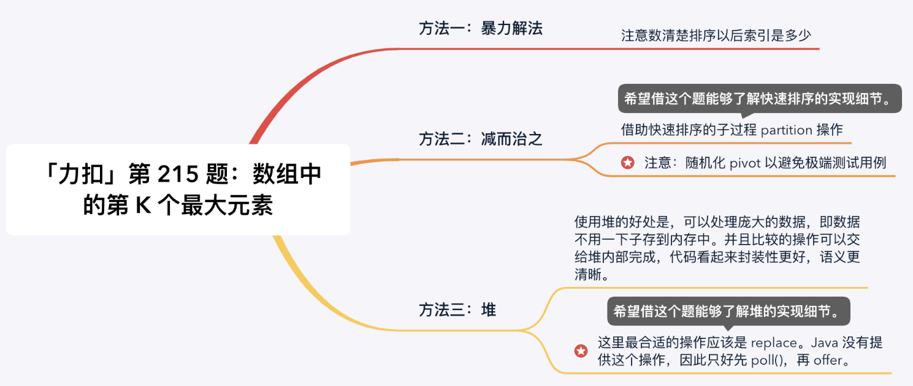
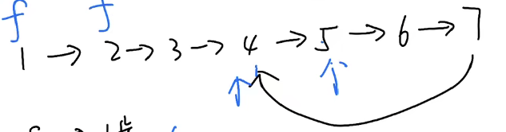
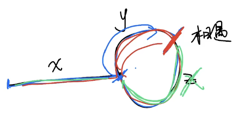
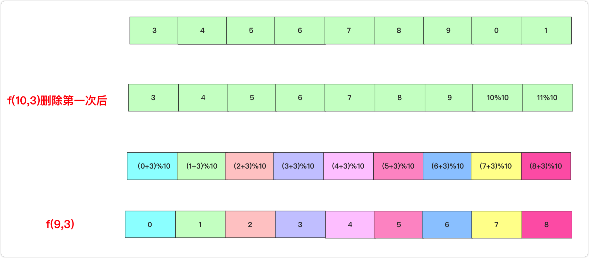
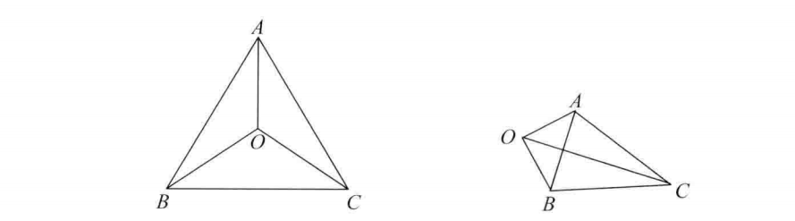
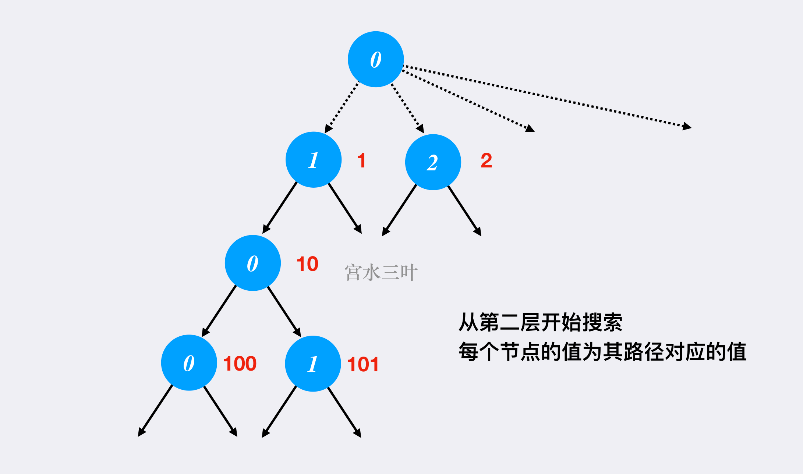

# 面试题

[TOC]

## 经典排序算法详解

==TODO==


## 快速排序：前序遍历

> 给你一个整数数组 `nums`，请你将该数组升序排列。
>
> ```
> 输入：nums = [5,2,3,1]
> 输出：[1,2,3,5]
> ```

快速排序的主要思想是通过划分将待排序的序列分成前后两部分，其中前一部分的数据都比后一部分的数据要小，然后再递归调用函数对两部分的序列分别进行快速排序，以此使得整个序列达到有序。

我们定义函数 `randomized_quicksort(nums, l, r)` 为对 nums 数组里 `[l, r]` 的部分进行排序，每次先调用 randomized_partition 函数对 nums 数组里 `[l, r]`的部分进行划分，并返回分界的下标 `pos` ，然后按上述讲的递归调用 `randomized_quicksort(nums, l, pos - 1)` 和 `randomized_quicksort(nums, pos + 1, r)` 即可。

那么核心就是划分函数的实现了，划分函数一开始需要确定一个分界值，我们称之为主元 pivot，然后再进行划分。整个划分函数 partition 主要涉及两个指针 i 和 j，一开始 `i = l - 1，j = l`。我们需要实时维护两个指针使得任意时候，对于任意数组下标 k，我们有如下条件成立：

1. $l \leq k \leq i$ 时， nums $[k] \leq$ pivot。
2. $i+1 \leq k \leq j-1$ 时， nums $[k]>$ pivot 。
3. $k=r$ 时， $n u m s[k]=$ pivot

```python
class Solution:
    def sortArray(self, nums: List[int]) -> List[int]:
        import random  # 导入随机数函数库

        def quicksort(nums, left, right):
            # 类似于前序遍历
      
            flag = nums[random.randint(left, right)]  # 随机初始化哨兵位置
            i, j = left, right  # 设定从左到右的指针 i，从右到左的指针 j
            while i <= j:
                while nums[i] < flag:
                    i += 1  # i 从左往右扫，找到大于等于 flag 的数。
                while nums[j] > flag:
                    j -= 1  # j 从右往左扫，找到小于等于 flag 的数。
                if i <= j:
                    nums[i], nums[j] = nums[j], nums[i]  # 交换左右指针下标对应的数值
                    i += 1  # 左指针继续往右走
                    j -= 1  # 右指针继续往左走
            
            if i < right:
                quicksort(nums, i, right)  # 递归解决 flag 左边的低位数组的排序
            if j > left:
                quicksort(nums, left, j)  # 递归解决 flag 右边的低位数组的排序

        quicksort(nums, 0, len(nums) - 1)  # 函数入口，将整个数组的信息传入
        return nums
```

## 分治算法：为运算表达式设计优先级

> 给你一个由数字和运算符组成的字符串 expression ，按不同优先级组合数字和运算符，计算并返回所有可能组合的结果。你可以 按任意顺序 返回答案。
>
> 生成的测试用例满足其对应输出值符合 32 位整数范围，不同结果的数量不超过 104 。
>
> ```
> 输入：expression = "2-1-1"
> 输出：[0,2]
> 解释：
> ((2-1)-1) = 0 
> (2-(1-1)) = 2
> ```

可以使用**分治算法**：明确函数的定义，相信并且利用这个函数定义。

**按照运算符进行分割，给每个运算符的左右两部分加括号**，这就是之前说的第一个关键点，不要考虑整体，而是聚焦每个运算符。

**明确函数的定义，相信并且利用这个函数的定义。**

```python
class Solution:
    def diffWaysToCompute(self, expression: str) -> List[int]:
        # 定义：计算算式 input 所有可能的运算结果
        # 明确函数的定义，相信并且利用这个函数定义
        res = []
        for i in range(len(expression)):
            # 扫描 input 中的运算符
            if expression[i] in {'-', '*', '+'}:
                # 分：以运算符为中心，分割成两个字符串，分别递归
                left = self.diffWaysToCompute(expression[:i])
                right = self.diffWaysToCompute(expression[i+1:])
                
                # 治：通过子问题的结果，合成原问题的结果
                for a in left:
                    for b in right:
                        a = int(a)
                        b = int(b)
                        if expression[i] == '-':
                            res.append(a - b)
                        elif expression[i] == '*':
                            res.append(a * b)
                        elif expression[i] == '+':
                            res.append(a + b)
        # base case
        # base case 写在下面，注意一下
        if not res:
            res.append(int(expression))

        return res
```

递归函数必须有个 base case 用来结束递归，其实这段代码就是我们分治算法的 base case，代表着你「分」到什么时候可以开始「治」。我们是按照运算符进行「分」的，一直这么分下去，什么时候是个头？显然，当算式中不存在运算符的时候就可以结束了。

那为什么以 `res.isEmpty()` 作为判断条件？因为当算式中不存在运算符的时候，就不会触发 `if` 语句，也就不会给 `res` 中添加任何元素。


## [不用加减乘除做加法](https://leetcode-cn.com/problems/bu-yong-jia-jian-cheng-chu-zuo-jia-fa-lcof/)

> 写一个函数，求两个整数之和，要求在函数体内不得使用 “+”、“-”、“*”、“/” 四则运算符号。
>
> ```
> 输入: a = 1, b = 1
> 输出: 2
> ```

==使用位运算来实现==：

1. 进行异或运算，计算两个数各个位置上的相加，不考虑进位；
2. 进行位与运算，然后左移一位，计算进位值；
3. 把异或运算的结果赋给 num1，把进位值赋给 num2，依此循环，进位值为空的时候结束循环，num1 就是两数之和。

==基本思路==：回顾十进制加法原理

以 `5 + 7 = 12`为例，分步走：

1. 相加各位的值，不算进位，得到 2
2. 计算进位值，得到 10。如果这一步的进位值为 0，如果这一步的进位值为 0，那么第一步得到的值就是最终结果
3. 重复上述两步，只是相加的值变成上述两步得到的结果 2 和 10，得到 12

==相同思想运用于二进制加法运算==：

同样我们可以用三步走的方式计算二进制值相加，5 = （101），7 = （111）

1. 相加各位的值，不算进位，得到 010，二进制每位相加就相当于各位做==异或操作==，101 ^ 111。
2. 计算进位值，得到 1010，相当于各位做与操作得到 101，再向左移一位得到 1010，(101 & 111) << 1。
3. 重复上述两步， 各位相加 010 ^ 1010 = 1000，进位值为 100 = (010 & 1010) << 1 。
4. 继续重复上述两步：1000 ^ 100 = 1100，进位值为 0，跳出循环，1100 为最终结果。

==有点难，先放着==


## ==[数组中的第 K 个最大元素](https://leetcode-cn.com/problems/kth-largest-element-in-an-array/)==

> 给定整数数组 `nums` 和整数 `k`，请返回数组中第 `k` 个最大的元素。
>
> 请注意，你需要找的是数组排序后的第 `k` 个最大的元素，而不是第 `k` 个不同的元素。
>
> ```
> 输入: [3,2,1,5,6,4] 和 k = 2
> 输出: 5
> ```



**理解题意：** 数组排序后的第 K 个最大的元素，而不是第 K 个不同的元素，换句话说就是：从右边往左边数的第 K 个元素（从 1 开始），那么从左向右数是第几个呢：

- 一共 6 个元素，找第 2 大，下标是 4；
- 一共 6 个元素，找第 4 大，下标是 2。

因此升序排序后，目标元素的下标是 $N-K$

```python
# 暴力解法
class Solution:
    def findKthLargest(self, nums: List[int], k: int) -> int:
        size = len(nums)
        nums.sort()
        return nums[size - k]
```

### 大根堆：调库

维护一个有 K 个元素的最小堆：

- 如果当前堆不满，直接添加
- 堆满的时候，如果新读到的数小于等于堆顶，肯定不是我们要找的元素，只有新遍历到的数大于堆顶的时候，才将堆顶拿出，然后放入到新读到的数，进而让堆自己去调整内部结构。

```python
class Solution:
    def findKthLargest(self, nums: List[int], k: int) -> int:
        # 维护一个最小堆
        minHeap = []

        for i in range(k):
            heapq.heappush(minHeap, nums[i])
            
        for j in range(k, len(nums)):
            # 只有当待添加元素大于堆顶元素时，才添加，添加前 pop 一下
            if nums[j] > minHeap[0]:
                heapq.heappop(minHeap)
                heapq.heappush(minHeap, nums[j])
        return heapq.heappop(minHeap)

```


## ==有多少小于当前数字的数字==：排序 + 字典

> 给你一个数组 nums，对于其中每个元素 nums[i]，请你统计数组中比它小的所有数字的数目。
>
> 换而言之，对于每个 nums[i] 你必须计算出有效的 j 的数量，其中 j 满足 j != i 且 nums[j] < nums[i] 。
>
> 以数组形式返回答案。
>
> 输入：nums = [8,1,2,2,3]
> 输出：[4,0,1,1,3]
> 解释： 
> 对于 nums[0]=8 存在四个比它小的数字：（1，2，2 和 3）。 
> 对于 nums[1]=1 不存在比它小的数字。
> 对于 nums[2]=2 存在一个比它小的数字：（1）。 
> 对于 nums[3]=2 存在一个比它小的数字：（1）。 
> 对于 nums[4]=3 存在三个比它小的数字：（1，2 和 2）。

首先要找小于当前数字的数字，那么从小到大排序之后，该数字之前的数字就是比它小的了。

所以可以定义一个新数组，将数组排个序。**排序之后，其实每一个数值的下标就代表这前面有几个比它小的了**。

用一个哈希表 hash（本题可以就用一个数组）来做数值和下标的映射。这样就可以通过数值快速知道下标（也就是前面有几个比它小的）。

此时有一个情况，就是数值相同怎么办？

例如，数组：1 2 3 4 4 4 ，第一个数值 4 的下标是 3，第二个数值 4 的下标是 4 了。

这里就需要一个技巧了，**在构造数组 hash 的时候，从后向前遍历，这样 hash 里存放的就是相同元素最左面的数值和下标了**。

最后在遍历原数组 nums，用 hash 快速找到每一个数值对应的 小于这个数值的个数。存放在将结果存放在另一个数组中。


```python
class Solution:
    def smallerNumbersThanCurrent(self, nums: List[int]) -> List[int]:
        res = nums[:]
        hash = dict()
        res.sort() # 从小到大排序之后，元素下标就是小于当前数字的数字
        for i, num in enumerate(res):
            if num  not in hash.keys(): # 遇到了相同的数字，那么不需要更新该 number 的情况
                hash[num] = i       
        for i, num in enumerate(nums):
            res[i] = hash[num]
        return res
```

## ==比较含退格的字符串==：栈

> 给定 s 和 t 两个字符串，当它们分别被输入到空白的文本编辑器后，如果两者相等，返回 true 。# 代表退格字符。
>
> 注意：如果对空文本输入退格字符，文本继续为空。
>
> ```
> 输入：s = "ab#c", t = "ad#c"
> 输出：true
> 解释：s 和 t 都会变成 "ac"。
> 
> 输入：s = "ab##", t = "c#d#"
> 输出：true
> 解释：s 和 t 都会变成 ""。
> ```

我的解法：从后向前遍历，双指针，好吧，这种想法无法解决 ‘ab##’ 的问题。

### 栈

这道题目一看就是要使用栈的节奏，这种**匹配消除问题**也是栈的擅长所在。**那么本题，确实可以使用栈的思路，但是没有必要使用栈，因为最后比较的时候还要比较栈里的元素，有点麻烦**。这里直接使用字符串 string，来作为栈，末尾添加和弹出，string 都有相应的接口，最后比较的时候，只要比较两个字符串就可以了，比比较栈里的元素方便一些。

```python
class Solution:

    def get_string(self, s: str) -> str :
        bz = []
        for i in range(len(s)) :
            c = s[i]
            if c != '#' :
                bz.append(c) # 模拟入栈
            elif len(bz) > 0: # 栈非空才能弹栈
                bz.pop() # 模拟弹栈
        return str(bz)

    def backspaceCompare(self, s: str, t: str) -> bool:
        return self.get_string(s) == self.get_string(t)
        pass
```


### 双指针：从后向前

当然还可以有使用 O (1) 的空间复杂度来解决该问题。

同时从后向前遍历 S 和 T（i 初始为 S 末尾，j 初始为 T 末尾），记录 # 的数量，模拟消除的操作，如果 # 用完了，就开始比较 S [i] 和 S [j]。


如果 S [i] 和 S [j] 不相同返回 false，如果有一个指针（i 或者 j）先走到的字符串头部位置，也返回 false。

1. 准备两个指针 $i,j$ 分别指向 $S$ 和 $T$ 的末位字符，再准备两个变量 `skipS` 和 `skipT` 来分别存放 S 和 T 字符串中 # 的数量
2. 从后往前遍历 $S$，所遇情况有三:
   1. 若当前字符是 #，则 `skipS` 自增 1
   2. 若当前字符不是 # 且 `skipS` 不为 0，则`skipS` 自减 1
   3. 若当前字符不是 #，且 `skipS` 为 0，则代表当前字符不会被消除，我们可以用来和 $T$ 中的当前字符作比较。
3. 若对比过程出现  $S$ 和 $T$ 当前字符不匹配，则遍历结束，返回 false，若  $S$ 和 $T$ 都遍历结束，且能一一匹配，则返回 true

```python
class Solution:
    def backspaceCompare(self, S: str, T: str) -> bool:
        i, j = len(S) - 1, len(T) - 1
        skipS = skipT = 0

        while i >= 0 or j >= 0:
            while i >= 0:
                if S[i] == "#":
                    skipS += 1
                    i -= 1
                elif skipS > 0:
                    skipS -= 1
                    i -= 1
                else:
                    break
            while j >= 0:
                if T[j] == "#":
                    skipT += 1
                    j -= 1
                elif skipT > 0:
                    skipT -= 1
                    j -= 1
                else:
                    break
            if i >= 0 and j >= 0:
                if S[i] != T[j]:
                    return False
            elif i >= 0 or j >= 0:
                return False
            i -= 1
            j -= 1
        
        return True

```

> 这对我来说是个难题，因为循环中套着循环，不太好想。

## [轮转数组](https://leetcode.cn/problems/rotate-array/)

> 给你一个数组，将数组中的元素向右轮转 `k` 个位置，其中 `k` 是非负数。
>
> 输入: nums = [1,2,3,4,5,6,7], k = 3
> 输出: [5,6,7,1,2,3,4]
> 解释:
> 向右轮转 1 步: [7,1,2,3,4,5,6]
> 向右轮转 2 步: [6,7,1,2,3,4,5]
> 向右轮转 3 步: [5,6,7,1,2,3,4]

注意本题要求使用空间复杂度为 O(1) 的原地算法。

1. 反转整个字符串：[7,6,5,4,3,2,1]
2. 反转区间为前 k 的子串：[5,6,7,4,3,2,1]
3. 反转区间为 k 到末尾的子串：[5,6,7,1,2,3,4]

**需要注意的是，本题还有一个小陷阱，题目输入中，如果 k 大于 nums.size 了应该怎么办？**

例如，[1,2,3,4,5,6,7]  如果右移动 15 次的话，是 [7,1,2,3,4,5,6]  。

所以其实就是右移 k % nums.size () 次，即：15 % 7 = 1

```python
class Solution:
    def rotate(self, A: List[int], k: int) -> None:
        def reverse(i, j):
            while i < j:
                A[i], A[j] = A[j], A[i]
                i += 1
                j -= 1
        n = len(A)
        k = k % n
        reverse(0, n - 1)
        reverse(0, k - 1)
        reverse(k, n - 1)
```

## [Dota2 参议院](https://leetcode-cn.com/problems/dota2-senate/)

> 输入："RD"
> 输出："Radiant"
> 解释：第一个参议员来自 Radiant 阵营并且他可以使用第一项权利让第二个参议员失去权力，因此第二个参议员将被跳过因为他没有任何权利。然后在第二轮的时候，第一个参议员可以宣布胜利，因为他是唯一一个有投票权的人

例如输入 "RRDDD"，执行过程应该是什么样呢？

- 第一轮：senate [0] 的 R 消灭 senate [2] 的 D，senate [1] 的 R 消灭 senate [3] 的 D，senate [4] 的 D 消灭 senate [0] 的 R，此时剩下 "RD"，第一轮结束！
- 第二轮：senate [0] 的 R 消灭 senate [1] 的 D，第二轮结束
- 第三轮：只有 R 了，R 胜利

估计不少同学都困惑，R 和 D 数量相同怎么办，究竟谁赢，**其实这是一个持续消灭的过程！** 即：如果同时存在 R 和 D 就继续进行下一轮消灭，轮数直到只剩下 R 或者 D 为止！

那么每一轮消灭的策略应该是什么呢？例如：RDDRD

第一轮：senate [0] 的 R 消灭 senate [1] 的 D，那么 senate [2] 的 D，是消灭 senate [0] 的 R 还是消灭 senate [3] 的 R 呢？

当然是消灭 senate [3] 的 R，因为当轮到这个 R 的时候，它可以消灭 senate [4] 的 D。

==所以消灭的策略是，尽量消灭自己后面的对手，因为前面的对手已经使用过权力了，而后序的对手依然可以使用权力消灭自己的同伴！==

==局部最优==：有一次权力机会，就消灭自己后面的对手

==全局最优==：为自己的阵营赢取最大利益

实现代码，在每一轮循环的过程中，去过模拟优先消灭身后的对手，其实是比较麻烦的。

这里有一个技巧，就是用一个变量记录当前参议员之前有几个敌对对手了，进而判断自己是否被消灭了。这个变量我用 flag 来表示。

```python
class Solution:
    def predictPartyVictory(self, senate: str) -> str:
        # R = true 表示本轮循环结束后，字符串里依然有 R。D 同理
        R , D = True, True

        # flag 表示当前参议院前面有几个敌对对手
        # 当 flag 大于 0 时，R 在 D 前出现，R 可以消灭 D。当 flag 小于 0 时，D 在 R 前出现，D可以消灭 R
        flag = 0

        senate = list(senate)
        while R and D: # 一旦 R 或者 D 为 false，就结束循环，说明本轮结束后只剩下 R 或者 D了
            R = False
            D = False
            for i in range(len(senate)):
                if senate[i] == 'R':
                    if flag < 0: 
                        senate[i] = '0' # 消灭 R，R 此时为 false
                    else: 
                        R = True # 如果没被消灭，本轮循环结束有 R
                    flag += 1
                if senate[i] == 'D':
                    if flag > 0: 
                        senate[i] = '0'
                    else: 
                        D = True
                    flag -= 1
        # 循环结束之后，R 和 D 只能有一个为 true
        return "Radiant" if R else "Dire"
```

## 有效的山脉数组：双指针

> 给定一个整数数组 arr，如果它是有效的山脉数组就返回 true，否则返回 false。
>
> 让我们回顾一下，如果 arr 满足下述条件，那么它是一个山脉数组：
>
> arr.length >= 3
> 在 0 < i < arr.length - 1 条件下，存在 i 使得：
> arr[0] < arr[1] < ... arr[i-1] < arr[i]
> arr[i] > arr[i+1] > ... > arr[arr.length - 1]
>
> 
>
> ```
> 输入：arr = [0,3,2,1]
> 输出：true
> 
> 输入：arr = [3,5,5]
> 输出：false
> ```

判断是山峰，主要就是要严格的保存左边到中间，和右边到中间是递增的。

这样可以使用两个指针，le3t 和 right，让其按照如下规则移动，如图：


**注意这里还是有一些细节，例如如下两点：**

- 因为 left 和 right 是数组下表，移动的过程中注意不要==数组越界==
- 如果 left 或者 right 没有移动，说明是一个单调递增或者递减的数组，依然不是山峰（所以有一个不在起始位置的判断）

```python
class Solution:
    def validMountainArray(self, arr: List[int]) -> bool:
        i = 0
        j = len(arr) - 1
        if len(arr) < 3: return False
        while i < len(arr)-1 and arr[i+1] > arr[i]:
            i += 1
        while j > 0 and arr[j-1] > arr[j]:
            j -= 1
        # i 和 j 相遇且都不在起始位置
        if i == j and i > 0 and j < len(arr) - 1:
            return True
        else:
            return False  
```

## 独一无二的出现次数：使用两个字典，k | v 互换

> 给你一个整数数组 `arr`，请你帮忙统计数组中每个数的出现次数。
>
> 如果每个数的出现次数都是独一无二的，就返回 `true`；否则返回 `false`。
>
> 输入：arr = [1,2,2,1,1,3]
> 输出：true
> 解释：在该数组中，1 出现了 3 次，2 出现了 2 次，3 只出现了 1 次。没有两个数的出现次数相同。

这道题目数组在是哈希法中的经典应用，回归本题，**本题强调了 - 1000 <= arr [i] <= 1000**，那么就可以用数组来做哈希，arr [i] 作为哈希表（数组）的下标，那么 arr [i] 可以是负数，怎么办？负数不能做数组下标。

**此时可以定义一个 2000 大小的数组，例如 int count [2002];**，统计的时候，将 arr [i] 统一加 1000，这样就可以统计 arr [i] 的出现频率了。

题目中要求的是是否有相同的频率出现，那么需要再定义一个哈希表（数组）用来记录频率是否重复出现过，bool fre [1002]; 定义布尔类型的就可以了，**因为题目中强调 1 <= arr.length <= 1000，所以哈希表大小为 1000 就可以了**。


```python
class Solution:
    def uniqueOccurrences(self, arr: List[int]) -> bool:
        # 可以用字典
        res = {}
        for i in range(len(arr)):
            if arr[i] in res:
                res[arr[i]] += 1
            else:
                res[arr[i]] = 1
        # 标记相同频率是否重复出现
        temp = {}
        for _, fre in res.items():
            if fre not in temp:
                temp[fre] = 1
            else:
                return False
        return True
```

## 寻找数组的中心下标

> 给你一个整数数组 nums ，请计算数组的中心下标。
>
> 数组中心下标是数组的一个下标，其左侧所有元素相加的和等于右侧所有元素相加的和。
>
> 如果中心下标位于数组最左端，那么左侧数之和视为 0 ，因为在下标的左侧不存在元素。这一点对于中心下标位于数组最右端同样适用。
>
> 如果数组有多个中心下标，应该返回最靠近左边的那一个。如果数组不存在中心下标，返回 -1 。
>
> 输入：nums = [1, 7, 3, 6, 5, 6]
> 输出：3
> 解释：
> 中心下标是 3 。
> 左侧数之和 sum = nums[0] + nums[1] + nums[2] = 1 + 7 + 3 = 11 ，
> 右侧数之和 sum = nums[4] + nums[5] = 5 + 6 = 11 ，二者相等。

```python
class Solution:
    def pivotIndex(self, nums: List[int]) -> int:
        numSum = sum(nums) # 数组总和
        leftSum = 0
        for i in range(len(nums)):
            # 注意这里，不要重复计算，把 左边的和 存起来
            if numSum - leftSum -nums[i] == leftSum: #左右和相等
                return i
            leftSum += nums[i]
        return -1
```

## ==[按奇偶排序数组 II](https://leetcode-cn.com/problems/sort-array-by-parity-ii/)==：快排思想

> 给定一个非负整数数组 `nums`，  `nums` 中一半整数是奇数 ，一半整数是偶数 。
>
> 对数组进行排序，以便当 `nums[i]` 为奇数时，`i` 也是奇数 ；当 `nums[i]` 为偶数时， `i` 也是偶数 。
>
> ```
> 输入：nums = [4,2,5,7]
> 输出：[4,5,2,7]
> 解释：[4,7,2,5]，[2,5,4,7]，[2,7,4,5] 也会被接受。
> ```

```python
class Solution:
    def sortArrayByParityII(self, nums: List[int]) -> List[int]:
        oddIndex = 1
        # 步长为2
        for i in range(0,len(nums),2): 
            # 偶数位遇到奇数
            if nums[i] % 2: 
                # 奇数位找偶数
                while nums[oddIndex] % 2: 
                    oddIndex += 2
                nums[i], nums[oddIndex] = nums[oddIndex], nums[i]
        return nums
```

**感觉有点快速排序的意思：找到不应该呆在相应位置的两个元素，交换。**

## 搜索插入位置

> 给定一个排序数组和一个目标值，在数组中找到目标值，并返回其索引。如果目标值不存在于数组中，返回它将会被按顺序插入的位置。
>
> 请必须使用时间复杂度为 O(log n) 的算法。
>
> ```
> 输入: nums = [1,3,5,6], target = 5
> 输出: 2
> ```

```python
class Solution:
    def searchInsert(self, nums: List[int], target: int) -> int:
        # 二分法
        left = 0
        right = len(nums) - 1
        while left <= right:
            mid = (left + right) // 2
            if nums[mid] == target:
                return mid
            elif nums[mid] < target:
                left = mid + 1
            elif nums[mid] > target:
                right = mid - 1
        return right + 1
```

> 注意最后输出的是 right + 1。为什么呢？没有找到元素呗，插入在最后。


## ==重排链表==：双向队列

> 给定一个单链表 L 的头节点 head ，单链表 L 表示为：
>
> L0 → L1 → … → Ln - 1 → Ln
> 请将其重新排列后变为：
>
> L0 → Ln → L1 → Ln - 1 → L2 → Ln - 2 → …
> 不能只是单纯的改变节点内部的值，而是需要实际的进行节点交换。
>
> 
>
> ```
> 输入：head = [1,2,3,4]
> 输出：[1,4,2,3]
> ```

### 数组模拟

把链表放进数组中，然后通过双指针法，一前一后，来遍历数组，构造链表。

### 双向队列模拟

把链表放进双向队列，然后通过双向队列一前一后弹出数据，来构造新的链表。这种方法比操作数组容易一些，不用双指针模拟一前一后了

```python
class Solution:
    def reorderList(self, head: ListNode) -> None:
        """
        Do not return anything, modify head in-place instead.
        """
        d = collections.deque()
        tmp = head
        while tmp.next: # 链表除了首元素全部加入双向队列
            d.append(tmp.next)
            tmp = tmp.next
        tmp = head
        while len(d): # 一后一前加入链表
            # 在 pop 之前检查长度够不够
            tmp.next = d.pop()
            # tmp 指针一直向前走
            tmp = tmp.next
            # 在 pop 之前检查长度够不够
            if len(d):
                tmp.next = d.popleft()
                tmp = tmp.next
        tmp.next = None # 尾部置空
```


### 直接分割链表

将链表分割成两个链表，然后把第二个链表反转，之后在通过两个链表拼接成新的链表。


```python
# 方法三 反转链表
class Solution:
    def reorderList(self, head: ListNode) -> None:
        if head == None or head.next == None:
            return True
        slow, fast = head, head
        while fast and fast.next:
            slow = slow.next
            fast = fast.next.next
        right = slow.next # 分割右半边
        slow.next = None # 切断
        right = self.reverseList(right) #反转右半边
        left = head
        # 左半边一定比右半边长, 因此判断右半边即可
        while right:
            curLeft = left.next
            left.next = right
            left = curLeft

            curRight = right.next
            right.next = left
            right = curRight


    def reverseList(self, head: ListNode) -> ListNode:
        cur = head   
        pre = None
        while(cur!=None):
            temp = cur.next # 保存一下cur的下一个节点
            cur.next = pre # 反转
            pre = cur
            cur = temp
        return pre
```

## 在排序数组中查找元素的第一个和最后一个位置

> 给定一个按照升序排列的整数数组 nums，和一个目标值 target。找出给定目标值在数组中的开始位置和结束位置。
>
> 如果数组中不存在目标值 target，返回 [-1, -1]。
>
> ```
> 输入：nums = [5,7,7,8,8,10], target = 8
> 输出：[3,4]
> ```

下面我来把所有情况都讨论一下。

寻找 target 在数组里的左右边界，有如下三种情况：

- 情况一：target 在数组范围的右边或者左边，例如数组 {3, 4, 5}，target 为 2 或者数组 {3, 4, 5},target 为 6，此时应该返回 {-1, -1}
- 情况二：target 在数组范围中，且数组中不存在 target，例如数组 {3,6,7},target 为 5，此时应该返回 {-1, -1}
- 情况三：target 在数组范围中，且数组中存在 target，例如数组 {3,6,7},target 为 6，此时应该返回 {1, 1}

接下来，在去寻找左边界，和右边界了。

采用二分法来去寻找左右边界，为了让代码清晰，我分别写两个二分来寻找左边界和右边界。

**刚刚接触二分搜索的同学不建议上来就像如果用一个二分来查找左右边界，很容易把自己绕进去，建议扎扎实实的写两个二分分别找左边界和右边界**

这里我采用 `while (left <= right)` 的写法，区间定义为 `[left, right]`，即左闭右闭的区间。

```python
# 1、首先，在 nums 数组中二分查找 target；
# 2、如果二分查找失败，则 binarySearch 返回 -1，表明 nums 中没有 target。此时，searchRange 直接返回 {-1, -1}；
# 3、如果二分查找成功，则 binarySearch 返回 nums 中值为 target 的一个下标。然后，通过左右滑动指针，来找到符合题意的区间
class Solution:
    def searchRange(self, nums: List[int], target: int) -> List[int]:
        
        def binarySearch(nums:List[int], target:int) -> int:
            left, right = 0, len(nums)-1
            while left<=right: # 不变量：左闭右闭区间
                middle = left + (right-left) // 2
                if nums[middle] > target:
                    right = middle - 1
                elif nums[middle] < target:
                    left = middle + 1
                else:
                    return middle
            # 如果没有找到，返回 -1
            return -1
        
        # 因为是二分查找，不确定找到的这个值是第几个值，所以需要向前向后找边界
        index = binarySearch(nums, target)
        # nums 中不存在 target，直接返回 {-1, -1}
        if index == -1:
            return [-1, -1]
        # nums 中存在 targe，则左右滑动指针，来找到符合题意的区间
        left, right = index, index
        # 向左滑动，找左边界，因为这是一个排序数组
        while left -1 >= 0 and nums[left - 1] == target:
            left -=1
        # 向右滑动，找右边界
        while right+1 < len(nums) and nums[right + 1] == target:
            right +=1
        return [left, right]
```

```python
# 直接寻找左右边界：更清晰直观
class Solution:
    def searchRange(self, nums: List[int], target: int) -> List[int]:
        # 查找左边界
        i = 0
        j = len(nums)-1
        while i <= j:
            mid = i + (j-i) // 2
            if nums[mid] == target:
                j = mid - 1
            elif nums[mid] > target:
                j = mid - 1
            elif nums[mid] < target:
                i = mid + 1
        left = i

        # 查找右边界
        i = 0
        j = len(nums)-1
        while i <= j:
            mid = i + (j-i) // 2
            if nums[mid] == target:
                i = mid + 1
            elif nums[mid] > target:
                j = mid - 1
            elif nums[mid] < target:
                i = mid + 1
        right = j

        return [left,right] if left <= right else [-1, -1]
```


## ==矩阵置零==

> 给定一个 `m x n` 的矩阵，如果一个元素为 **0** ，则将其所在行和列的所有元素都设为 **0** 。请使用 **[原地](http://baike.baidu.com/item/原地算法)** 算法**。**
>
> 

### 用 O(m+n) 额外空间

两遍扫 `matrix`, 第一遍用集合记录哪些行，哪些列有 `0`; 第二遍置 `0`

```python
class Solution:
    def setZeroes(self, matrix: List[List[int]]) -> None:
        """
        Do not return anything, modify matrix in-place instead.
        """
        row = len(matrix)
        col = len(matrix[0])
        row_zero = set()
        col_zero = set()
        for i in range(row):
            for j in range(col):
                if matrix[i][j] == 0:
                    row_zero.add(i)
                    col_zero.add(j)
        for i in range(row):
            for j in range(col):
                if i in row_zero or j in col_zero:
                    matrix[i][j] = 0

```

### 用 O(1) 空间 

**关键思想**：用 matrix 第一行和第一列记录该行该列是否有 0, 作为标志位

但是对于第一行，和第一列要设置一个标志位，为了防止自己这一行 (一列) 也有 0 的情况。注释写在代码里，直接看代码很好理解！

```python
lass Solution:
    def setZeroes(self, matrix: List[List[int]]) -> None:
        """
        Do not return anything, modify matrix in-place instead.
        """
        row = len(matrix)
        col = len(matrix[0])
        row0_flag = False
        col0_flag = False
        # 找第一行是否有0
        for j in range(col):
            if matrix[0][j] == 0:
                row0_flag = True
                break
        # 第一列是否有0
        for i in range(row):
            if matrix[i][0] == 0:
                col0_flag = True
                break

        # 把第一行或者第一列作为 标志位
        for i in range(1, row):
            for j in range(1, col):
                if matrix[i][j] == 0:
                    matrix[i][0] = matrix[0][j] = 0
        #print(matrix)
        # 置 0
        for i in range(1, row):
            for j in range(1, col):
                if matrix[i][0] == 0 or matrix[0][j] == 0:
                    matrix[i][j] = 0

        if row0_flag:
            for j in range(col):
                matrix[0][j] = 0
        if col0_flag:
            for i in range(row):
                matrix[i][0] = 0

```


## ==字母异位词分组==

> 给你一个字符串数组，请你将 字母异位词 组合在一起。可以按任意顺序返回结果列表。
>
> 字母异位词 是由重新排列源单词的字母得到的一个新单词，所有源单词中的字母通常恰好只用一次。
>
> 输入: strs = ["eat", "tea", "tan", "ate", "nat", "bat"]
> 输出: [["bat"],["nat","tan"],["ate","eat","tea"]]

```python
class Solution:
    def groupAnagrams(self, strs):
        if len(strs) < 2:
            return [strs]
        result = {}
        for s in strs:
            # key: temp
            # value: s
            temp = ''.join(sorted(s))
            result[temp] = result.get(temp, []) + [s]
        return list(result.values())
```

-----

## 寻找重复数：环形链表

> 给定一个包含 n + 1 个整数的数组 nums ，其数字都在 [1, n] 范围内（包括 1 和 n），可知至少存在一个重复的整数。
>
> 假设 nums 只有一个重复的整数 ，返回这个重复的数。
>
> 你设计的解决方案必须 不修改 数组 nums 且只用常量级 O(1) 的额外空间。（这简直就是链表的专业术语）
>
> ```
> 输入：nums = [1,3,4,2,2]
> 输出：2
> ```

可以使用字典的方法，不再赘述。

另一个方法是==快慢指针法==。

回顾一下环形链表，



1. slow 指针走一步；fast 指针走两步
2. **第一次相遇在环内**，相遇后，fast 指针回到初始位置，开始走一步
3. **第二相遇会在环的入口处**



对这一题来说，可以把数组看作一个链表。为什么呢，因为题目强调了数字都在 [1, n] 范围内

```python
# 142 题中慢指针走一步 
slow = slow.next ==> 本题 slow = nums[slow]
# 142 题中快指针走两步 
fast = fast.next.next ==> 本题 fast = nums[nums[fast]]
```

首先明确前提，整数的数组 nums 中的数字范围是 [1,n]。考虑一下两种情况：

如果数组中没有重复的数，以数组 [1,3,4,2]为例，我们将数组下标 n 和数 nums[n] 建立一个映射关系 f(n)f(n)，
其映射关系 n->f(n)为：
0->1
1->3
2->4
3->2
我们从下标为 0 出发，根据 f(n)f(n) 计算出一个值，以这个值为新的下标，再用这个函数计算，以此类推，直到下标超界。这样可以产生一个类似链表一样的序列。
0->1->3->2->4->null

如果数组中有重复的数，以数组 [1,3,4,2,2] 为例,我们将数组下标 n 和数 nums[n] 建立一个映射关系 f(n)f(n)，
其映射关系 n->f(n) 为：
0->1
1->3
2->4
3->2
4->2
同样的，我们从下标为 0 出发，根据 f(n) 计算出一个值，以这个值为新的下标，再用这个函数计算，以此类推产生一个类似链表一样的序列。
0->1->3->2->4->2->4->2->……
这里 2->4 是一个循环，那么这个链表可以抽象为下图：


从理论上讲，数组中如果有重复的数，那么就会产生**多对一的映射**，这样，形成的链表就一定会有环路了：

> 将这个题目给的特殊的数组当作一个链表来看，数组的下标就是指向元素的指针，把数组的元素也看作指针。如 0 是指针，指向 nums[0]，而 nums[0] 也是指针，指向 nums[nums[0]].
>

```python
class Solution:
    def findDuplicate(self, nums: List[int]) -> int:
        # 142 题中慢指针走一步 slow = slow.next ==> 本题 slow = nums[slow]
        # 142 题中快指针走两步 fast = fast.next.next ==> 本题 fast = nums[nums[fast]]
        if len(nums) == 2: return nums[0]
        slow = 0
        fast = 0
        slow = nums[slow]
        fast = nums[nums[fast]]
        while slow != fast:
            slow = nums[slow]
            fast = nums[nums[fast]]
            
        # 相遇之后, fast 回到起点
        fast = 0
        while fast != slow:
            fast = nums[fast]
            slow = nums[slow]
        return fast
```

==其实也可以使用原地哈希的方式，但是题目要求不能修改数组，不太符合要求，但原地哈希可以在找到重复数和缺失数：==

```python
class Solution:
    def findDuplicate(self, nums: List[int]) -> int:
        # 让每一个孩子 val 都回到它的家：下标为 val-1
        # 如果家被别人占了，这就是重复数
        # 如果家还空着，这就是缺失数
        for i in range(len(nums)):
            # val: nums[i]
            # 家：nums[i] - 1
            # 如果家里住了别的人
            while nums[nums[i]-1] != nums[i]:
                # 交换
                # 注意这里不能使用 a,b = b,a 的形式，可能因为互相重叠
                temp = nums[nums[i]-1]
                nums[nums[i]-1] = nums[i]
                nums[i] = temp
                
            # 如果家里住了人和它长得一样但是不是它，找到双胞胎兄弟了
            if nums[nums[i]-1] == nums[i] and i != nums[i]-1:
                return nums[i]
```


## 丢失的数字：高斯求和

> 给定一个包含 `[0, n]` 中 `n` 个数的数组 `nums` ，找出 `[0, n]` 这个范围内没有出现在数组中的那个数。
>
> 输入：nums = [3,0,1]
> 输出：2
> 解释：n = 3，因为有 3 个数字，所以所有的数字都在范围 [0,3] 内。2 是丢失的数字，因为它没有出现在 nums 中。

```python
class Solution:
    def missingNumber(self, nums: List[int]) -> int:
        # 数学法: ((首项 + 尾项) * 项数) / 2
        targrt = ((0 + len(nums)) * (len(nums) + 1)) / 2
        res = targrt - sum(nums)
        return int(res) 
```

## 缺失的第一个正数：原地哈希

> 给你一个未排序的整数数组 `nums` ，请你找出其中没有出现的最小的正整数。
>
> 请你实现时间复杂度为 `O(n)` 并且只使用常数级别额外空间的解决方案。
>
> ```
> 输入：nums = [1,2,0]
> 输出：3
> ```

原地哈希就相当于，让每个数字 `n` 都回到下标为 `n-1` 的家里。

而那些没有回到家里的就成了孤魂野鬼流浪在外，他们要么是根本就没有自己的家（数字小于等于 `0` 或者大于`nums.size()`），要么是自己的家被别人占领了（出现了重复）。

这些流浪汉被临时安置在下标为 `i` 的空房子里，之所以有空房子是因为房子 `i` 的主人 `i+1` 失踪了（数字 `i+1` 缺失）。

因此通过原地构建哈希让各个数字回家，我们就可以找到原始数组中重复的数字还有消失的数字。

==算法：==

1. 由于题目要求我们「只能使用常数级别的空间」，而要找的数一定在 `[1, N + 1]` 左闭右闭（这里 N 是数组的长度）这个区间里。因此，我们可以就把原始的数组当做哈希表来使用。事实上，哈希表其实本身也是一个数组；
2. 我们要找的数就在 `[1, N + 1]` 里，最后 `N + 1` 这个元素我们不用找。因为在前面的 N 个元素都找不到的情况下，我们才返回 `N + 1`；
3. 那么，我们可以采取这样的思路：**就把 1 这个数放到下标为 0 的位置， 2 这个数放到下标为 1 的位置，按照这种思路整理一遍数组。然后我们再遍历一次数组，第 1 个遇到的它的值不等于下标的那个数，就是我们要找的缺失的第一个正数。**
4. 这个思想就相当于我们自己编写哈希函数，这个哈希函数的规则特别简单，那就是数值为 `i` 的数映射到下标为 `i - 1` 的位置。


```python
class Solution:
    def firstMissingPositive(self, nums: List[int]) -> int:
        # 原地哈希
        n = len(nums)
        for i in range(n):
            # nums[i] 的家在下标为 nums[i] - 1 的房间
            while 1 <= nums[i] <= n and nums[nums[i] - 1] != nums[i]:
                nums[nums[i] - 1], nums[i] = nums[i], nums[nums[i] - 1]

        for i in range(n):
            if nums[i] != i + 1:
                return i + 1
        return n + 1
```

笔试的时候我遇到过这题，但是当时完全没有想起来用原地哈希做，还需要再训练一下。

## 多数元素：摩尔投票法

> 给定一个大小为 n 的数组 nums ，返回其中的多数元素。多数元素是指在数组中出现次数 大于 ⌊ n/2 ⌋ 的元素。
>
> 你可以假设数组是非空的，并且给定的数组总是存在多数元素。
>
> ```
> 输入：nums = [3,2,3]
> 输出：3
> ```

使用==摩尔投票法==：元素相同就加 1，元素不同就减 1，减到 0 时拥立新王。

```python
class Solution:
    def majorityElement(self, nums: List[int]) -> int:
        # 摩尔投票法
        count = 0
        for i in range(len(nums)):
            if count == 0:
                flag = nums[i]
                count += 1
            else:
                if nums[i] != flag:
                    count -= 1
                else:
                    count += 1
        return flag
```

## ==求众数==

> 给定一个大小为 *n* 的整数数组，找出其中所有出现超过 `⌊ n/3 ⌋` 次的元素。
>
> ```
> 输入：[1,1,1,3,3,2,2,2]
> 输出：[1,2]
> ```

同样使用==摩尔投票法==

摩尔投票法解决的问题是如何在任意多的候选人中，选出票数超过一半的那个人，注意，是票数超过一半的那个人。

但这并不意味这个候选人的票数一定能超过一半，例如 `[A, B, C]` 的抵消阶段，最后得到的结果是 `[C,1]`，C 候选人的票数也未能超过一半的票数。

摩尔投票法分为两个阶段：==抵消阶段==和==计数阶段==。

- **抵消阶段**：两个不同投票进行对坑，并且同时抵消掉各一张票，如果两个投票相同，则累加可抵消的次数；
- **计数阶段**：在抵消阶段最后得到的抵消计数只要不为 0，那这个候选人是有可能超过一半的票数的，为了验证，则需要遍历一次，统计票数，才可确定。

摩尔投票法经历两个阶段最多消耗 $O(2n)$ 的时间，也属于 $O(n)$ 的线性时间复杂度，另外空间复杂度也达到常量级。

理解摩尔投票法之后，我们再回到题目描述，题目可以看作是：在任意多的候选人中，选出票数超过`⌊ 1/3 ⌋`的候选人。我们可以利用反证法推断出满足这样的条件的元素最多只有两个，那么摩尔投票的核心思想就是：**每次选择三个互不相同的元素进行抵消。**

- 每次检测当前元素是否为第一个选中的元素或者第二个选中的元素
- 如果当前元素与已经选中的两个元素都不相同，则进行抵消一次
- 如果存在最终选票大于 0 的元素，我们还需要再次统计已选中元素的次数，检查元素的次数是否大于 `⌊ 1/3 ⌋`

```python
class Solution:
    def majorityElement(self, nums: List[int]) -> List[int]:
        ans = []
        element1, element2 = 0, 0
        vote1, vote2 = 0, 0

        for num in nums:
            # 如果该元素为第一个元素，则计数加1
            if vote1 > 0 and num == element1:
                vote1 += 1
            # 如果该元素为第二个元素，则计数加1
            elif vote2 > 0 and num == element2:
                vote2 += 1
            # 选择第一个元素
            elif vote1 == 0:
                element1 = num
                vote1 += 1
            # 选择第二个元素
            elif vote2 == 0:
                element2 = num
                vote2 += 1
            # 如果三个元素均不相同，则相互抵消1次
            else:
                vote1 -= 1
                vote2 -= 1

        cnt1, cnt2 = 0, 0
        for num in nums:
            if vote1 > 0 and num == element1:
                cnt1 += 1
            if vote2 > 0 and num == element2:
                cnt2 += 1        
        # 检测元素出现的次数是否满足要求
        if vote1 > 0 and cnt1 > len(nums) / 3:
            ans.append(element1)
        if vote2 > 0 and cnt2 > len(nums) / 3:
            ans.append(element2)

        return ans
```

----

## 丑数

> **丑数** 就是只包含质因数 `2`、`3` 和 `5` 的正整数。
>
> 给你一个整数 `n` ，请你判断 `n` 是否为 **丑数** 。如果是，返回 `true` ；否则，返回 `false` 。
>
> ```
> 输入：n = 6
> 输出：true
> 解释：6 = 2 × 3
> ```

```python
class Solution:
    def isUgly(self, n: int) -> bool:
        if n < 1:
            return False
        # 循环
        while n != 1:
            if n % 2 == 0:
                n = n / 2
            elif n % 3 == 0:
                n = n / 3
            elif n % 5 == 0:
                n = n / 5
            else:
                return False
        
        return True
```

把质因数一个一个除掉，如果结果不等于 1，就不是丑数。

## 丑数 II

> 给你一个整数 `n` ，请你找出并返回第 `n` 个 **丑数** 。
>
> **丑数** 就是只包含质因数 `2`、`3` 或 `5` 的正整数。
>
> ```
> 输入：n = 10
> 输出：12
> 解释：[1, 2, 3, 4, 5, 6, 8, 9, 10, 12] 是由前 10 个丑数组成的序列。
> ```

**这一题和可以被 3 整除的最大和有点像欸。**

### 最小堆法


### ==动态规划法==

使用三个指针 p2，p3，p5，用==生成==的方法！

$p_i$ 的含义是有资格同 $i$ 相乘的最小丑数的位置。这里的资格是指：如果一个丑数 `nums[pi]` 通过乘以 `i` 可以得到下一个丑数，那么这个丑数 `nums[pi]` 就永远失去了同 `i` 相乘的资格，指针前移，用 `pi += 1` 

```python
class Solution:
    def nthUglyNumber(self, n: int) -> int:

        dp = [float('inf')]* n
        dp[0] = 1
        p_2, p_3, p_5 = 0, 0, 0
        for i in range(1, n):
            dp[i] = min(dp[p_2] * 2, dp[p_3] * 3, dp[p_5] * 5 )
            if dp[i] == dp[p_2] * 2:
                p_2 += 1
            # 注意这里一定要用 if 而不是 elif！不然丑数会重复
            if dp[i] == dp[p_3] * 3:
                p_3 += 1
            if dp[i] == dp[p_5] * 5:
                p_5 += 1

        return dp[-1]
```

> 还不太理解。

## 字符串相加

> 给定两个字符串形式的非负整数 num1 和 num2 ，计算它们的和并同样以字符串形式返回。
>
> 你不能使用任何內建的用于处理大整数的库（比如 BigInteger）， 也不能直接将输入的字符串转换为整数形式。
>
> ```
> 输入：num1 = "11", num2 = "123"
> 输出："134"
> ```

**解题思路：**设定 `i`，`j` 两指针分别指向 `num1`，`num2` 尾部，模拟人工加法；

- **计算进位**： 计算 carry = tmp // 10，代表当前位相加是否产生进位；
- **添加当前位**： 计算 tmp = n1 + n2 + carry，并将当前位 tmp % 10 添加至 res 头部；
- **索引溢出处理**： 当指针 i 或 j 走过数字首部后，给 n1，n2 赋值为 0，相当于给 num1，num2 中长度较短的数字前面填 0，以便后续计算。
- 当遍历完 num1，num2 后跳出循环，并根据 carry 值决定是否在头部添加进位 1，最终返回 res 即可。

```python
class Solution
    def addStrings(self, num1: str, num2: str) -> str:
        res = ""
        i, j, carry = len(num1) - 1, len(num2) - 1, 0
        while i >= 0 or j >= 0:
            n1 = int(num1[i]) if i >= 0 else 0
            n2 = int(num2[j]) if j >= 0 else 0
            tmp = n1 + n2 + carry
            carry = tmp // 10
            res = str(tmp % 10) + res
            i, j = i - 1, j - 1
        return "1" + res if carry else res
```

## 字符串相乘

> 给定两个以字符串形式表示的非负整数 num1 和 num2，返回 num1 和 num2 的乘积，它们的乘积也表示为字符串形式。
>
> 注意：不能使用任何内置的 BigInteger 库或直接将输入转换为整数。
>
> ```
> 输入: num1 = "2", num2 = "3"
> 输出: "6"
> ```

**思路：**竖式运算思想：


遍历 `num2`每一位与 `num1`进行相乘，将每一步的结果进行累加。

注意：

1. `num2`除了第一位的其他位与 `num1`运算的结果需要补 0
2. 计算字符串数字累加其实就是上一题的代码

```python
class Solution:
    def multiply(self, num1: str, num2: str) -> str:
        def addStrings(num1: str, num2: str) -> str:
            res = ""
            i, j, carry = len(num1) - 1, len(num2) - 1, 0
            while i >= 0 or j >= 0:
                n1 = int(num1[i]) if i >= 0 else 0
                n2 = int(num2[j]) if j >= 0 else 0
                tmp = n1 + n2 + carry
                carry = tmp // 10
                res = str(tmp % 10) + res
                i, j = i - 1, j - 1
            return "1" + res if carry else res

        res = ""
        path = ""
        for j in range(len(num2) - 1, -1, -1):
            path = "0" * (len(num2) -1 - j)
            i = len(num1) - 1
            carry = 0
            while i >= 0:
                temp = int(num1[i]) * int(num2[j]) + carry
                carry = temp // 10
                path = str(temp % 10) + path
                i = i - 1
            path = str(carry) + path if carry else path
            res = addStrings(res, path)
        
        # 如果首位是 0
        if res[0] == '0':
            res = '0'

        return res
```

## 会议室 II：同一时刻最大重叠区间数

> 给定一系列的会议时间间隔 intervals，包括起始和结束时间 `[[s1,e1],[s2,e2],...] (si < ei)`，找到所需的最小的会议室数量。
>
> ```
> 输入: intervals = [(0,30),(5,10),(15,20)]
> 输出: 2
> 解释:
> 需要两个会议室
> 会议室1:(0,30)
> 会议室2:(5,10),(15,20)
> ```

最大重复个数？对

### 扫描线算法

```python
# 扫描线算法，很精彩的分析
class Solution:
    def minMeetingRooms(self, intervals):
        points = []
        for interval in intervals:
            points.append((interval.start, 1))
            points.append((interval.end, -1))
            
        meeting_rooms = 0
        ongoing_meetings = 0
        for _, delta in sorted(points):
            ongoing_meetings += delta
            meeting_rooms = max(meeting_rooms, ongoing_meetings)
            
        return meeting_rooms
```

### 贪心解法

1. 对所有会议，按照开始时间排升序
2. 用==贪心算法==，每来一个新的会议，遍历所有会议室，如果有空的会议室（该会议室的结束时间早于等于会议的开始时间），则作为当前最优的选择，更新该会议室的结束时间，并停止循环
3. 如果一个可用的会议室都没有，则新增会议室，并**更新该会议室的结束时间**

```python
class Solution:
    def minMeetingRooms(self, intervals: List[List[int]]) -> int:
        rooms = []  # 记录各会议室的结束时间
        meetings = sorted(intervals, key=lambda x: x[0])  # 按开始时间升序
        for meeting in meetings:
            find = False
            for index, end_time in enumerate(rooms):
                # 找到满足结束时间早于当前会议开始时间的会议室，并更新会议室的时间表
                if end_time <= meeting[0]:
                    rooms[index] = meeting[1]
                    find = True
                    break
            # 如果没找到，则新增会议室
            if not find:
                rooms.append(meeting[1])
        return len(rooms)
```

贪心解法也很好理解。

### 最小堆解法

1. 对长度为 N 的会议进行排序
2. 对 N 个会议分别执行弹出和插入操作，最差的情况下任意两两会议的时间都是冲突的，每次弹出的复杂度为 1，每次插入的复杂度为 $O(\log N)$，N 个会议室的总复杂度为：$O\left(N^{\star} \log N\right)$

```python
import heapq

class Solution:
    def minMeetingRooms(self, intervals: list) -> int:
        rooms = []  # 记录各会议室的最早结束时间
        meetings = sorted(intervals, key=lambda x: x[0])  # 按开始时间升序
        for meeting in meetings:
            # 如果最早结束的会议室的结束时间比会议室时间要早，则先关闭该会议室
            if rooms and rooms[0] <= meeting[0]:
                heapq.heappop(rooms)
            # 插入新的会议室到最小堆
            heapq.heappush(rooms, meeting[1])
        return len(rooms)
```


## Pow(x, n)

> 实现 [pow(*x*, *n*)](https://www.cplusplus.com/reference/valarray/pow/) ，即计算 `x` 的 `n` 次幂函数（即，$x^n$ ）。

```python
class Solution:
    def myPow(self, x: float, n: int) -> float:
        # 递归法运用二分思想
        def quickMul(N):
            if N == 0:
                return 1.0
            y = quickMul(N // 2)
            return y * y if N % 2 == 0 else y * y * x
        
        return quickMul(n) if n >= 0 else 1.0 / quickMul(-n)
```


## 加一

> 给定一个由 整数 组成的 非空 数组所表示的非负整数，在该数的基础上加一。
>
> 最高位数字存放在数组的首位， 数组中每个元素只存储单个数字。
>
> 你可以假设除了整数 0 之外，这个整数不会以零开头。
>
> ```
> 输入：digits = [1,2,3]
> 输出：[1,2,4]
> 解释：输入数组表示数字 123。
> ```

```python
# 迭代法
class Solution:
    def plusOne(self, digits: List[int]) -> List[int]:
        for i in range(len(digits)-1,-1,-1):
            digits[i] = (digits[i] + 1) % 10
            # 如果不等于 0，说明没有进位
            if digits[i] != 0:
                return digits
            # 否则，继续循环
        
        # 如果此时还没有 return，说明 digits 中所有的元素均为 9
        return [1] + [0] * len(digits)
```

## 田忌赛马

> 给定两个大小相等的数组 nums1 和 nums2，nums1 相对于 nums 的优势可以用满足 `nums1[i] > nums2[i]` 的索引 `i` 的数目来描述。
>
> 返回 nums1 的任意排列，使其相对于 nums2 的优势最大化。
>
> ```
> 输入：nums1 = [2,7,11,15], nums2 = [1,10,4,11]
> 输出：[2,11,7,15]
> ```

==思想：打得过就打，打不过就拿自己的垃圾和对方的精锐互换。==

> 比得过就比，比不过就送。

**将齐王和田忌的马按照战斗力排序，然后按照排名一一对比。如果田忌的马能赢，那就比赛，如果赢不了，那就换个垫底的来送人头，保存实力**。

算法使用双指针和大顶堆：

```python
class Solution:
    def advantageCount(self, nums1: List[int], nums2: List[int]) -> List[int]:
        # 田忌赛马问题
        hq = []
        # 大顶堆
        for i, num in enumerate(nums2):
            heapq.heappush(hq, (-num, i))
        nums1.sort()
        # 双指针
        left, right = 0, len(nums1) - 1
        res = [0] * len(nums1)
        while hq:
            max_num, idx = heapq.heappop(hq)
            max_sum = -max_num
            if max_sum < nums1[right]:
                res[idx] = nums1[right]
                right -= 1
            else:
                res[idx] = nums1[left]
                left += 1
        return res
```

## ==下一个排列==

> 整数数组的 **下一个排列** 是指其整数的下一个字典序更大的排列。如果不存在下一个更大的排列，则将数字重新排列成最小的排列（即升序排列）。
>
> 给你一个整数数组 `nums` ，找出 `nums` 的下一个排列。
>
> ```
> 输入：nums = [1,2,3]
> 输出：[1,3,2]
> ```

这一题和 **下一个更大元素 III** 的解法是完全一样的。

我们可以将该问题形式化地描述为：给定若干个数字，将其组合为一个整数。如何将这些数字重新排列，以得到下一个更大的整数。如 123 下一个更大的数为 132。如果没有更大的整数，则输出最小的整数。

**算法推导**：

如何得到这样的排列顺序？这是本文的重点，我们可以这样来分析：

1. 我们希望**下一个数比当前数大**，这样才满足“下一个排列”的定义。因此只需要将后面的「大数」与前面的「小数」交换，就能得到一个更大的数。比如 123456，将 5 和 6 交换就能得到一个更大的数 123465。
2. 我们还希望下一个数**增幅尽可能的小**，这样才满足“下一个排列与当前排列紧邻”的要求，为了满足这个要求，我们需要：
   1. 在==尽可能靠右的低位==进行交换，需要从后向前查找
   2. 将一个==尽可能小的大数==与前面的小数交换。比如 `123465`，下一个排列应该把 `5` 和 `4` 交换而不是把 `6` 和 `4` 交换
   3. 将大数置换到前面后，需要将**大数后面的所有数重置为升序**，升序就是最小的排列。以 123465 为例：首先按照上一步，交换 5 和 4，得到 123564；然后需要将 5 之后的数重置为升序，得到 123546。显然 123546 比 123564 更小，123546 就是 123465 的下一个排列

**算法过程**：

标准的“下一个排列”算法可以描述为：

1. 从后向前查找第一个**相邻升序**的元素对 `(i,j)`，满足 `A[i] < A[j]`。此时 `[j,end)` 必然是降序
2. 在 `[j,end)` **从后向前**查找第一个满足 `A[i] < A[k]` 的 `k`。`A[i]`、`A[k]` 分别就是上文所说的==「小数」==、==「大数」==
3. 将 `A[i]` 与 `A[k]` 交换
4. 可以断定这时 `[j,end)` 必然是降序，逆置 `[j,end)`，使其升序
5. 如果在步骤 1 找不到符合的相邻元素对，说明当前 `[begin,end)` 为一个降序顺序，则直接跳到步骤 4

```python
class Solution:
    def nextPermutation(self, nums: List[int]) -> None:
        """
        Do not return anything, modify nums in-place instead.
        """
        def reverse(nums, i, j):
            while i < j:
                nums[i], nums[j] = nums[j], nums[i]
                i += 1
                j -= 1
        
        # base case
        if not nums: return
        if len(nums) == 1: return nums
        flag = False
        # 从后向前遍历
        for i in range(len(nums)-2, -1, -1):
            # 找到第一个相邻的升序元素对
            if nums[i] < nums[i+1]:
                # 从后向前遍历，找到"最小的大数"
                for j in range(len(nums)-1, i, -1):
                    if nums[j] > nums[i]:
                        big_index = j
                        break
                nums[i], nums[j] = nums[j], nums[i]
                reverse(nums, i+1, len(nums)-1)
                flag = True
                break
            
        # 全部都不是升序
        if not flag:
            reverse(nums, 0, len(nums)-1) 
```

## 有效三角形的个数：倒着的双指针

> 给定一个包含非负整数的数组 `nums` ，返回其中可以组成三角形三条边的三元组个数。
>
> ```
> 输入: nums = [2,2,3,4]
> 输出: 3
> 解释:有效的组合是: 
> 2,3,4 (使用第一个 2)
> 2,3,4 (使用第二个 2)
> 2,2,3
> ```

这一题需要使用双指针！并且是**倒着来**，**先固定最长的边**！

```python
class Solution:
    def triangleNumber(self, nums: List[int]) -> int:
        # 三角形：任意两边之和大于第三边
        # 或者说，只需要判断两条短边之和大于最长边即可
        # 双指针！倒序！固定最长的一条边
        nums.sort()
        res = 0
        for k in range(len(nums)-1, 1, -1):
            i = 0 
            j = k-1
            while i < j:
                if nums[i] + nums[j] > nums[k]:
                    res += j-i
                    j -= 1
                else:
                    i += 1
        return res
```

## 对角线遍历

> 给你一个大小为 `m x n` 的矩阵 `mat` ，请以对角线遍历的顺序，用一个数组返回这个矩阵中的所有元素。
>
> 
>
> ```
> 输入：mat = [[1,2,3],[4,5,6],[7,8,9]]
> 输出：[1,2,4,7,5,3,6,8,9]
> ```

根据题目描述，首先仔细找一下这道题中一些数字上的规律。

1. 每一趟对角线中元素的坐标（x, y）相加的和是递增的。

> 第一趟：1 的坐标(0, 0)。x + y == 0。
> 第二趟：2 的坐标(1, 0)，4 的坐标(0, 1)。x + y == 1。
> 第三趟：7 的坐标(0, 2), 5 的坐标(1, 1)，3 的坐标(2, 0)。第三趟 x + y == 2。
> 第四趟：……

2. 每一趟内都是 x 或 y 其中一个从大到小（每次-1），另一个从小到大（每次+1）。

> 第二趟：2 的坐标(1, 0)，4 的坐标(0, 1)。x 每次-1，y 每次+1。
> 第三趟：7 的坐标(0, 2), 5 的坐标(1, 1)，3 的坐标(2, 0)。x 每次 +1，y 每次 -1。

3. 确定初始值。例如这一趟是 x 从大到小， x 尽量取最大，当初始值超过 x 的上限时，不足的部分加到 y 上面。

> 第二趟：2 的坐标(1, 0)，4 的坐标(0, 1)。x + y == 1，x 初始值取 1，y 取 0。
> 第四趟：6 的坐标(2, 1)，8 的坐标(1, 2)。x + y == 3，x 初始值取 2，剩下的加到 y上，y 取 1。

4. 确定结束值。例如这一趟是 x 从大到小，这一趟结束的判断是， x 减到 0 或者 y 加到上限。

> 第二趟：2 的坐标(1, 0)，4 的坐标(0, 1)。x 减到 0 为止。
> 第四趟：6 的坐标(2, 1)，8 的坐标(1, 2)。x 虽然才减到 1，但是 y 已经加到上限了。

5. 这一趟是 x 从大到小，那么下一趟是 y 从大到小，循环进行。 并且方向相反时，逻辑处理是一样的，除了 x，y 和他们各自的上限值是相反的。

> x 从大到小，第二趟：2 的坐标(1, 0)，4 的坐标(0, 1)。x + y == 1，x 初始值取 1，y 取 0。结束值 x 减到 0 为止。
> x 从小到大，第三趟：7 的坐标(0, 2)，5 的坐标(1, 1)，3 的坐标(2, 0)。x + y == 2，y 初始值取 2，x 取 0。结束值 y 减到 0 为止。

```python
class Solution:
    def findDiagonalOrder(self, mat: List[List[int]]) -> List[int]:
        m = len(mat)
        n = len(mat[0])
        s = 0
        res = []
        while s <= m+n-2:
            # 奇数趟：x 由大变小
            x1 = s if s <= m-1 else m-1
            y1 = s - x1
            while x1 >= 0 and y1 <= n-1:
                res.append(mat[x1][y1])
                x1 -= 1
                y1 += 1

            s += 1
            if s > m+n-2: break
            
            # 偶数趟：y 由大变小
            y2 = s if s <= n-1 else n-1
            x2 = s - y2
            while y2 >= 0 and x2 <= m-1:
                res.append(mat[x2][y2])
                x2 += 1
                y2 -= 1
            
            s += 1

        return res
```

## 圆圈中最后剩下的数字：约瑟夫环

> 0,1,···,n-1 这 n 个数字排成一个圆圈，从数字 0 开始，每次从这个圆圈里删除第 m 个数字（删除后从下一个数字开始计数）。求出这个圆圈里剩下的最后一个数字。
>
> 例如，0、1、2、3、4 这 5 个数字组成一个圆圈，从数字0开始每次删除第 3 个数字，则删除的前 4 个数字依次是2、0、4、1，因此最后剩下的数字是 3。
>
> ```
> 输入: n = 5, m = 3
> 输出: 3
> ```

==约瑟夫环==：人们站在一个等待被处决的圈子里。 计数从圆圈中的指定点开始，并沿指定方向围绕圆圈进行。 在跳过指定数量的人之后，處刑下一个人。 对剩下的人重复该过程，从下一个人开始，朝同一方向跳过相同数量的人，直到只剩下一个人，并被释放。

问题即：给定人数、起点、方向和要跳过的数字，选择初始圆圈中的位置以避免被处决。

==递推公式==：

在约瑟夫环中，每当有一个人出圈，出圈的人的下一个成为新的环的头，相当于把数组向前移动 $m$ 位。若已知 $n-1$ 个人时，胜利者的下标位置为 $f(n-1,m)$，则 $n$ 个人的时候，就是往后移动 $m$ 位，因为有可能数组越界，超过的部分会被接到头上，所以还要模 $n$，计算公式为：
$$
f(n, m)=(f(n-1, m)+m) \% n
$$
举个例子，有 `0 1 2 3 4 5 6 7 8 9` 十个数字，假设 m 为 3, 最后结果可以先记成 **f(10,3)**，即使我们不知道它是多少。

进行第一次时候，找到元素 `2` 删除，此时还剩 9 个元素，但**起始位置已经变成元素 3**。等价成 `3 4 5 6 7 8 9 0 1` 这 9 个数字重写开始找。


此时这个序列最终剩下的一个值即为 **f(10,3)**，这个序列的值和 f (9,3) 不同， **但是都是 9 个数且 m 等于 3，所以其删除位置是相同的，即算法大体流程是一致的，只是各位置上的数字不一样**。所以我们需要做的事情是**找找这个序列上和 f (9,3) 值上有没有什么联系**。

寻找过程中别忘记两点，首先可通过 **% 符号 ** 对数字有效扩充，即我们可以将 `3 4 5 6 7 8 9 0 1` 这个序列看成 (3,4,5,6,7,8,9,10,11)%10. 这里的 10 即为此时的 n 数值。

另外数值如果是连续的，那么最终一个结果的话是可以找到联系的 (差值为一个定制)。所以我们可以就找到 `f(10,3)` 和 `f(9,3)` 值之间结果的关系，可以看下图：



递推公式为：$f(n, m)=(f(n-1, m)+m) \% n$

但是递归效率因为有个来回的规程，效率相比直接迭代差一些，也可从前往后迭代：

```python
class Solution:
    def lastRemaining(self, n: int, m: int) -> int:
        # # 使用递推公式
        # def func(n,m):
        #     if n == 0:
        #         return 0
        #     return (func(n-1,m) + m) % n
        # return func(n, m)

        # 使用迭代法
        res = 0
        # i 代表有几个数字
        for i in range(1, n+1):
            res = (res + m) % i

        return res
```

## ==颜色分类：三指针（易错）==

> 给定一个包含红色、白色和蓝色、共 n 个元素的数组 nums ，原地对它们进行排序，使得相同颜色的元素相邻，并按照红色、白色、蓝色顺序排列。
>
> 我们使用整数 0、 1 和 2 分别表示红色、白色和蓝色。
>
> 必须在不使用库的sort函数的情况下解决这个问题。
>
> ```
> 输入：nums = [2,0,2,1,1,0]
> 输出：[0,0,1,1,2,2]
> ```

```python
class Solution:
    def sortColors(self, nums: List[int]) -> None:
        """
        Do not return anything, modify nums in-place instead.
        """
        # 三指针法
        i = 0
        while i < len(nums) and nums[i] == 0:
            i += 1
        j = len(nums) - 1
        while j >= 0 and nums[j] == 2:
            j -= 1
        k = i
        while k <= j:
            # 注意这里！一定要先和后面交换，而且是循环交换
            while k <= j and nums[k] == 2:
                nums[j], nums[k] = nums[k], nums[j]
                j -= 1
            # 然后再和左边交换
            if nums[k] == 0:
                nums[i], nums[k] = nums[k], nums[i]
                i += 1
            k += 1
```

这一题非常易错，看着好像思路很简单，但是提交了三遍都没通过！

我们使用 `i` 指针指向开端 0，`j` 指针指向末端 2，中间的遍历指针 `k`，思路如下：

1. 如果找到了 0，将其和 `nums[i]` 交换，并将 `i` 向后移动一个位置
2. 如果找到了 2，将其与 `nums[j]` 交换，并将 `j` 向后移动一个位置

但是！这样做是**错误**的！对于第二种情况，当我们将 `nums[k]` 和 `nums[j]` 交换之后，新的 `nums[k]` 仍有可能是 2，也可能是 0，然而此时我们已经结束了交换，开始遍历下一个元素，不会再次考虑它了，这样我们就得到了错误的答案！

因此，当我们找到 2 时，我们需要**不断**地将其与 `nums[j]` 进行交换，直到新的 `nums[k]` 不为 2，此时，如果其为 0，对应第一种情况，如果为 1，则不需要任何操作！


## 匈牙利算法：最大匹配数量

### 匈牙利算法描述

匈牙利算法是一个经典的解决二部图最小权值匹配问题的算法，这种说话谁看谁不迷糊？别急，举个例子：

有 n 个工作，需要指派给 n 个工人（即给每个工人分配一个工作，一个工人只能完成一项工作），每个工人完成每个工作的时间可能都不一样，给出一个算法，使指派后，完成所有工作所花费的时间最小。

这里，**并不是所有的工人都能干所有的工作**。换句话说就是，有的工人只会干 1 号和 2 号工作，而有的工人只能干 3 号工作。

==不重复造轮子 ——scipy 中匈牙利算法的用法==

`scipy` 匈牙利算法的函数名为：`scipy.optimize.linear_sum_assignment`

参数是 “每个工人干完每项工作所需要花费的时间”，返回值有两个分别是 row_index，col_index，代表每个工人应该安排在哪项工作。

### 例题：[最大兼容性评分和](https://leetcode.cn/problems/maximum-compatibility-score-sum/)

> 每个学生都会被分配给 一名 导师，而每位导师也会分配到 一名 学生。配对的学生与导师之间的兼容性评分等于学生和导师答案相同的次数。
>
> 例如，学生答案为[1, 0, 1] 而导师答案为 [0, 0, 1] ，那么他们的兼容性评分为 2 ，因为只有第二个和第三个答案相同。
> 请你找出最优的学生与导师的配对方案，以 最大程度上 提高 兼容性评分和 。
>
> 给你 students 和 mentors ，返回可以得到的 最大兼容性评分和 。
>
> 输入：students = [[1,1,0],[1,0,1],[0,0,1]], mentors = [[1,0,0],[0,0,1],[1,1,0]]
> 输出：8
> 解释：按下述方式分配学生和导师：
> - 学生 0 分配给导师 2 ，兼容性评分为 3 。
> - 学生 1 分配给导师 0 ，兼容性评分为 2 。
> - 学生 2 分配给导师 1 ，兼容性评分为 3 。
> 最大兼容性评分和为 3 + 2 + 3 = 8 。
>

**思路**：

首先要构造**代价矩阵 cost_matrix**：但需要注意的是：题目要求的是求解兼容分数最大，而匈牙利算法的目的是求解工人工作时间最小，那怎么办？很简单，把兼容性分数乘以负一就可以顺利把求解最大改为了求解最小。

```python
class Solution:
    def maxCompatibilitySum(self, students, mentors) -> int:
        import numpy as np
        from scipy.optimize import linear_sum_assignment

        cost_matrix = []
        for student in students:
            value_list = []
            for mentor in mentors:
                temp_sum = 0
                for i in range(len(student)):
                    if student[i] == mentor[i]:
                        temp_sum -= 1
                value_list.append(temp_sum)
            cost_matrix.append(value_list)
        cost_mat_array = np.array(cost_matrix)
        # print(cost_mat_array)
        row_ind, col_ind = linear_sum_assignment(cost_mat_array)
        return int(cost_mat_array[row_ind, col_ind].sum()) * (-1)
```

## 可被三整除的最大和

> 给你一个整数数组 `nums`，请你找出并返回能被三整除的元素最大和。
>
> ```
> 输入：nums = [3,6,5,1,8]
> 输出：18
> 解释：选出数字 3, 6, 1 和 8，它们的和是 18（可被 3 整除的最大和）。
> ```

维护一个滚动数组 `remainder`，存储余数分别为 0，1，2 时的最大和。

1. 来到一个新数时，新数分别和三类最大值相加
2. 然后用新值去更新 `remainder`，怎么更新呢？看看新数除以 3 后余几，就去更新对应位置的值，取最大值！

```python
from typing import List
class Solution:
    def maxSumDivThree(self, nums: List[int]) -> int:
        # 回溯？no 动态规划
        n = len(nums)
        # remainder分别为余数0，1，2时的最大值
        remainder = [0, 0, 0]
        for i in range(n):
            # 来了一个新数之后，分别和之前的最大和相加，再更新之前的最大和
            a = remainder[0] + nums[i]
            b = remainder[1] + nums[i]
            c = remainder[2] + nums[i]
            remainder[a % 3] = max(remainder[a % 3], a)
            remainder[b % 3] = max(remainder[b % 3], b)
            remainder[c % 3] = max(remainder[c % 3], c)
        return remainder[0]

sol = Solution()
nums = [3,6,5,1,8]
print(sol.maxSumDivThree(nums))
```

## 如何判断一个点是否在三角形内

> 给定三角形 3 个点的坐标，在给定一个点 (x,y)，判断该点是否在三角形中。
>
> ps: 坐标值均为 double 型

### 面积比较

判断$△ABO$+$△BOC$+$△COA$ 的面积与$△ABC$ 是否相等。若相等则 O 在内部，反之则在外部。



如何计算三角形的面积呢？通过坐标，很容易计算三角形的边长。再通过==海伦公式==计算面积。
$$
\mathrm{S}=\sqrt{p(p-a)(p-b)(p-c)}
$$
其中, $a, b, c$ 为三边长度, $p=\frac{a+b+c}{2}$

> 由于 double 类型计算时有精度问题，因此这种方法存在误差，在牛客上无法通过全部测试用例。

### 向量叉乘

**若点 O 在三角形内部，则沿着三角形的边逆时针走，点 O 一定保持在边的左侧。**（这倒真的没发现啊）

如下图所示，点在逆时针行走时，在 AB，BC，CA 的左侧。


**如何判断点在一个边的左侧呢？**

可以借助向量叉乘来判断 $O$ 是否在向量 AB 的哪一侧。若计算向量 AO 和向量 AB 的叉乘的值为正，则表示 O 在 AB 的左侧，反之为右侧。

> 向量叉乘的结果是一个向量，这个向量与两个进行叉乘的向量同时正交，其长度等于两个向量作为边围起来平行四边形的面积。？有点混乱，先放放。

向量 $\vec{a}$ 是 $(m, n), \vec{b}$ 是 $(p, q)$
$$
\vec{a} * \vec{b}=(m * q-n * p)
$$

## 困于环中的机器人

> 在无限的平面上，机器人最初位于 (0, 0) 处，面朝北方。注意:
>
> 北方向 是y轴的正方向。
> 南方向 是y轴的负方向。
> 东方向 是x轴的正方向。
> 西方向 是x轴的负方向。
> 机器人可以接受下列三条指令之一：
>
> "G"：直走 1 个单位
> "L"：左转 90 度
> "R"：右转 90 度
> 机器人按顺序执行指令 instructions，并一直重复它们。
>
> 只有在平面中存在环使得机器人永远无法离开时，返回 true。否则，返回 false。
>
> 输入：instructions = "GG"
> 输出：false
> 解释：机器人最初在(0,0)处，面向北方。
> “G”:移动一步。位置:(0,1)方向:北。
> “G”:移动一步。位置:(0,2).方向:北。
> 重复这些指示，继续朝北前进，不会进入循环。
> 在此基础上，返回false。

观察规律可知，当一轮循环结束之后，如果方向与初始方向不一致，或者回到了原点，一定会产生循环
换言之，如果方向一致，但不在原点，则一定不会产生循环。

```python
class Solution:
    def isRobotBounded(self, instructions: str) -> bool:
        # 一轮执行结束后，如果方向与初始方向不一致，或者回到了原点，一定会产生循环
        # 换言之，如果方向一致，但不在原点，则一定不会产生循环
        # 感性理解一下

        mov = [(0,1),(1,0),(0,-1),(-1,0)]
        direction = 0 # 0是北，1是东，2是南，3是西
        pos = [0,0]
        for ins in instructions:
            if ins == "L":
                direction -= 1
            elif ins == "R":
                direction += 1
            else:
                pos[0] += mov[direction%4][0]
                pos[1] += mov[direction%4][1]
        if direction % 4 == 0  and (pos[0] or pos[1]):
            return False
        return True
```

这道题反正挺让人费解的。


## 字典序排数

> 给你一个整数 `n` ，按字典序返回范围 `[1, n]` 内所有整数。
>
> 你必须设计一个时间复杂度为 `O(n)` 且使用 `O(1)` 额外空间的算法。
>
> ```
> 输入：n = 13
> 输出：[1,10,11,12,13,2,3,4,5,6,7,8,9]
> ```

使用递归的方法来实现 `DFS`：

将 $[1, n]$ 的数按照字典序添加到答案，本质上是对一颗节点数量为 n，形态类似字典树的多阶数进行遍历，根节点为 0，需要被跳过，因此我们可以从数的第二层开始搜索。

树中每个节点的值为其搜索路径所代表的数字，且每个节点有 $[0,9]$ 共 10 个子节点。



```python
class Solution:
    def lexicalOrder(self, n: int) -> List[int]:
        ans = []
        
        def dfs(cur, limit):
            if cur > limit:
                return
            
            # 先根遍历
            ans.append(cur)
            # 0 - 9
            for i in range(10):
                dfs(cur*10+i, limit)

        for i in range(1, 10):
            dfs(i, n)
        return ans
```

- 时间复杂度：本质上在搜索一棵节点数量为 n 的多阶树，复杂度为 $O(n)$

- 空间复杂度：忽略递归带来的额外空间开销，复杂度为 $O(1)$

## 矩阵中的最长递增路径

> 给定一个 m x n 整数矩阵 matrix ，找出其中 最长递增路径 的长度。
>
> 对于每个单元格，你可以往上，下，左，右四个方向移动。 你不能在对角线方向上移动或移动到边界外（即不允许环绕）。
>
> 
>
> ```
> 输入：matrix = [[9,9,4],[6,6,8],[2,1,1]]
> 输出：4 
> 解释：最长递增路径为 [1, 2, 6, 9]。
> ```

如果使用朴素深度优先遍历，从每个节点出发，记录满足条件的最长递增路径的长度，时间复杂度是指数级别，这样会超时。

朴素深度优先搜索的时间复杂度过高的原因是进行了大量的重复计算，同一个单元格会被访问多次，每次访问都要重新计算。由于同一个单元格对应的最长递增路径的长度是固定不变的，因此可以使用**记忆化**的方法进行优化。

**用矩阵 memo 作为缓存矩阵，已经计算过的单元格的结果存储到缓存矩阵中。**

使用记忆化深度优先搜索，当访问到一个单元格时，如果 $memo[i][j] \neq 0$ 时，说明该单元格的结果已经计算过，则直接从缓存中读取结果，如果 $memo[i][j] = 0$，说明该单元格的结果尚未被计算过，则进行搜索，并将计算得到的结果存入缓存中。

遍历完矩阵中的所有单元格之后，即可得到矩阵中的最长递增路径的长度。


```python
class Solution:
    def longestIncreasingPath(self, matrix: List[List[int]]) -> int:
        # 深度优先遍历？超出时间限制了！
        # 需要使用记忆化思路
        # 用矩阵 memo 作为缓存矩阵，已经计算过的单元格的结果存储到缓存矩阵中。
        if not matrix:
            return 0
        moves = [(0, -1), (-1, 0), (1, 0), (0, 1)]
        m, n = len(matrix), len(matrix[0])
        ans = 0

        memos = [[0] * n for _ in range(m)]

        def dfs(row, col):
            # 该函数返回从 [row, col] 出发的最长递增路径的长度
            # 相信并且利用这个函数的定义
            if memos[row][col] != 0:
                return memos[row][col]
            memos[row][col] = 1
            for dx, dy in moves:
                newdx, newdy = row + dx, col + dy
                if (
                    0 <= newdx < m
                    and 0 <= newdy < n
                    # 这里天然避免了走回头路
                    and matrix[row][col] < matrix[newdx][newdy]
                ):
                    # 有没有点后序遍历的意思？有了有了
                    memos[row][col] = max(memos[row][col], dfs(newdx, newdy) + 1)

            return memos[row][col]

        for i in range(m):
            for j in range(n):
                if memos[i][j] != 0:
                    ans = max(ans, memos[i][j])
                else:
                    ans = max(ans, dfs(i, j))
        return ans
```

## ==单词搜索==

> 给定一个 m x n 二维字符网格 board 和一个字符串单词 word 。如果 word 存在于网格中，返回 true ；否则，返回 false 。
>
> 单词必须按照字母顺序，通过相邻的单元格内的字母构成，其中“相邻”单元格是那些水平相邻或垂直相邻的单元格。同一个单元格内的字母不允许被重复使用。
>
>  
>
> 输入：board = [["A","B","C","E"],["S","F","C","S"],["A","D","E","E"]], word = "ABCCED"
> 输出：true

注意，此题的解法是**深度优先遍历** + **回溯**！

> 自己第一遍做的时候只想到了深度优先遍历，没有想到回溯，好好思考一下。

==外层==：遍历

首先遍历 `board` 的所有元素，先找到和 `word` 第一个字母相同的元素，然后进入递归流程。假设这个元素的坐标为 `(i,j)`，进入递归流程前，先记得吧该元素打上使用过的标记：

```python
mark[i][j] = 1
```

==内层==：递归

1. 从 `(i,j)` 出发，朝它的上下左右试探，看看它周边的这四个元素是否能匹配 `word` 的下一个字母
   1. 如果匹配到了：带该元素继续进入下一个递归
   2. 如果都匹配不到：返回 `False`

2. 当 `word`的所有字母都完成匹配后，整个流程返回 `True`

```python
class Solution:
    def exist(self, board: List[List[str]], word: str) -> bool:
        # 定义行走方向
        directions = [(0, 1), (0, -1), (1, 0), (-1, 0)]

        def check(i: int, j: int, k: int) -> bool:
            if board[i][j] != word[k]:
                return False
            if k == len(word) - 1:
                return True

            # 注意这里对 visited 的操作
            visited.add((i, j))
            result = False
            for di, dj in directions:
                newi, newj = i + di, j + dj
                if 0 <= newi < len(board) and 0 <= newj < len(board[0]):
                    if (newi, newj) not in visited:
                        # 应用回溯函数
                        if check(newi, newj, k + 1):
                            result = True
                            break
            # 注意这里对 visited 的操作：回溯！
            visited.remove((i, j))
            return result

        h, w = len(board), len(board[0])
        visited = set()
        for i in range(h):
            for j in range(w):
                if check(i, j, 0):
                    return True

        return False
```

> 注意：
>
> 1. 递归时元素的坐标是否超过边界；
> 2. 回溯标记 `mark[i][j] = 0` 以及 `return` 的时机。
> 3. 在 `dfs` 函数中增加参数！学会这种方式

## 单词搜索 II

> 给定一个 m x n 二维字符网格 board 和一个单词（字符串）列表 words， 返回所有二维网格上的单词 。
>
> 单词必须按照字母顺序，通过 相邻的单元格 内的字母构成，其中“相邻”单元格是那些水平相邻或垂直相邻的单元格。同一个单元格内的字母在一个单词中不允许被重复使用。
>
> 
>
> 输入：board = [["o","a","a","n"],["e","t","a","e"],["i","h","k","r"],["i","f","l","v"]], words = ["oath","pea","eat","rain"]
> 输出：["eat","oath"]

太难了，下面的代码只能通过一部分案例：

```python
class Solution:
    def findWords(self, board: List[List[str]], words: List[str]) -> List[str]:
        direction = [(0, 1), (0, -1), (1, 0), (-1, 0)]
        # dfs + 回溯
        def isValid(i, j):
            if 0 <= i <= m - 1 and 0 <= j <= n - 1:
                return True
            return False

        def dfs(i, j):
            if not isValid(i,j):
                return
            
            visited.add((i, j))
            path.append(board[i][j])

            # 注意判断的时机
            # 应该在添加元素之后
            if ''.join(path) in words and ''.join(path) not in res:
                res.append(''.join(path))
                path.pop()
                visited.remove((i, j))
                return

            for d in direction:
                ni = i + d[0]
                nj = j + d[1]
                if (
                    0 <= ni < len(board)
                    and 0 <= nj < len(board[0])
                    and (ni, nj) not in visited
                ):
                    dfs(ni, nj)

            # 在循环判断之外进行回溯
            visited.remove((i, j))
            path.pop()

        m, n = len(board), len(board[0])
        path = []
        res = []
        visited = set()
        for i in range(m):
            for j in range(n):
                dfs(i, j)
        return res
```

## [和可被 K 整除的子数组](https://leetcode.cn/problems/subarray-sums-divisible-by-k/)：同余定理

> 给定一个整数数组 `nums` 和一个整数 `k` ，返回其中元素之和可被 `k` 整除的（连续、非空） **子数组** 的数目。
>
> **子数组** 是数组的 **连续** 部分。
>
> 输入：nums = [4,5,0,-2,-3,1], k = 5
> 输出：7
> 解释：
> 有 7 个子数组满足其元素之和可被 k = 5 整除：
> [4, 5, 0, -2, -3, 1], [5], [5, 0], [5, 0, -2, -3], [0], [0, -2, -3], [-2, -3]

注意审题，第一次做的时候用了回溯法，可是题目要求**子数组是数组的连续部分**！

这题很明显，需要用到前缀和数组！

另外扩充知识点：**同余定理**

> 同余定理：给定一个[正整数](https://baike.baidu.com/item/正整数/8461335) m，如果两个[整数](https://baike.baidu.com/item/整数/1293937) a 和 b 满足 a-b 能够被 m 整除，即 (a-b)/m 得到一个整数，那么就称整数 a 与 b 对[模](https://baike.baidu.com/item/模/13332719) m 同余，记作 a≡b (mod m)。对模 m 同余是整数的一个等价关系。

我们令 $P[i]=n u m s[0]+n u m s[1]+\ldots+n u m s[i]$ 。那么每个连续子数组的和 $\operatorname{sum}(i, j)$ 就可以写成 $P[j]-$ $P[i-1]$ （其中 $0<i<j$ ) 的形式。此时，判断子数组的和能否被 $k$ 整除就等价于判断 $(P[j]-P[i-$ 1]) $\bmod k==0$ ，根据同余定理，只要 $P[j] \bmod k==P[i-1] \bmod k$ ，就可以保证上面的等式成立。

因此我们可以考虑对数组进行遍历，在遍历同时统计答案。当我们遍历到第 $i$ 个元素时，我们统计以 $i$ 结尾的符合条件的子数组个数。我们可以维护一个以前缀和模 $k$ 的值为键，出现次数为值的哈希表 record，在遍历的同时进行更新。这样在计算以 $i$ 结尾的符合条件的子数组个数时，根据上面的分析，答案即为 $[0 : i-1]$ 中前缀和模 $k$ 也为 $P[i] \bmod k$ 的位置个数，即 $\operatorname{record}[P[i] \bmod k]$ 。

最后的答案即为以每一个位置为数尾的符合条件的子数组个数之和。需要注意的一个边界条件是，我们需要对哈希表初始化，记录 `record[0] = 1`，这样就考虑了前缀和本身被 $k$ 整除的情况。

```python
class Solution:
    def subarraysDivByK(self, nums: List[int], k: int) -> int:
        record = {0: 1}
        total, ans = 0, 0
        for elem in nums:
            total += elem
            modulus = total % k
            same = record.get(modulus, 0)
            ans += same
            record[modulus] = same + 1
        return ans
```

**复杂度分析**

- 时间复杂度: $O(n)$ ，其中 $n$ 是数组 nums 的长度。我们只需要从前往后遍历一次数组，在遍历数组的过程中，维护哈希表的各个操作均为 $O(1)$ ，因此总时间复杂度为 $O(n)$ 。
- 空间复杂度： $O(\min (n, k))$ ，即哈希表需要的空间。当 $n \leq k$ 时，最多有 $n$ 个前缀和，因此哈希表中最多有 $n+1$ 个键值对；当 $n>k$ 时，最多有 $k$ 个不同的余数，因此哈希表中最多有 $k$ 个键值对。也就 是说，哈希表需要的空间取决于 $n$ 和 $k$ 中的较小值。
